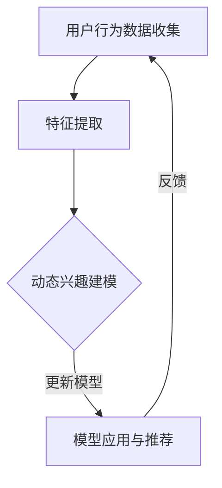

                 

关键词：大模型、推荐系统、动态兴趣建模、机器学习、用户行为分析、实时更新、个性化推荐

## 摘要

本文将探讨大模型在推荐系统动态兴趣建模中的应用，以及如何通过用户行为的实时分析和机器学习算法来实现对用户兴趣的动态调整。文章首先介绍了推荐系统的基本概念和挑战，接着详细解释了动态兴趣建模的核心原理和算法，最后通过实际项目案例展示了如何实现这一过程，并对未来的发展方向和潜在挑战进行了展望。

## 1. 背景介绍

### 推荐系统概述

推荐系统作为信息检索和过滤的重要工具，已经在电子商务、社交媒体、新闻资讯等领域得到广泛应用。其核心目的是通过分析用户的历史行为和偏好，向用户推荐他们可能感兴趣的内容或商品。随着互联网和大数据的快速发展，推荐系统的应用场景和复杂度也在不断提升。

### 动态兴趣建模的重要性

用户兴趣是推荐系统的基础，但用户的兴趣并不是一成不变的，它们会随着时间、环境、情境等因素的变化而不断调整。因此，实现动态兴趣建模对于推荐系统的准确性、用户体验和用户粘性至关重要。传统的方法往往依赖于用户的历史行为数据，而忽视了实时性和动态性。

### 大模型的崛起

近年来，大模型（如深度学习模型、图神经网络等）在自然语言处理、计算机视觉等领域取得了显著的进展。大模型具有强大的表征能力和泛化能力，能够处理海量的数据，并在复杂任务中表现出色。将大模型应用于推荐系统的动态兴趣建模，有望提升系统的智能化水平和用户体验。

## 2. 核心概念与联系

### 动态兴趣建模的概念

动态兴趣建模是指通过实时分析用户行为和偏好数据，动态调整和更新用户兴趣模型的过程。它包括数据收集、特征提取、兴趣建模和模型更新等步骤。

### Mermaid 流程图



### 核心概念的联系

- 用户行为数据收集：通过用户的行为日志、点击记录等数据，收集用户的行为数据。
- 特征提取：将原始的用户行为数据转化为可以用于建模的特征向量。
- 动态兴趣建模：利用机器学习算法（如决策树、神经网络等）对特征向量进行建模，以预测用户的兴趣。
- 模型更新：根据用户的实时反馈和新的行为数据，动态调整和更新兴趣模型。

## 3. 核心算法原理 & 具体操作步骤

### 3.1 算法原理概述

动态兴趣建模的核心算法通常是基于机器学习的，常用的算法包括协同过滤、矩阵分解、神经网络等。其中，神经网络由于其强大的表征能力，在动态兴趣建模中具有广泛的应用。

### 3.2 算法步骤详解

1. **数据收集与预处理**：收集用户的历史行为数据，如浏览记录、点击记录等。对数据进行清洗和预处理，包括去除噪声、缺失值填充等。

2. **特征提取**：将预处理后的数据转化为特征向量。特征提取的方法包括基于内容的特征提取和基于上下文的特征提取。

3. **兴趣建模**：利用机器学习算法（如神经网络）对特征向量进行建模。神经网络的输入层为特征向量，输出层为用户兴趣标签。

4. **模型训练与评估**：通过训练集对模型进行训练，并使用验证集进行评估。调整模型参数，优化模型性能。

5. **模型应用与推荐**：将训练好的模型应用于实际场景，根据用户的实时行为数据进行兴趣预测，并生成个性化推荐。

6. **模型更新**：根据用户的反馈和新的行为数据，动态调整和更新模型。保持模型的实时性和准确性。

### 3.3 算法优缺点

**优点**：
- **强大的表征能力**：神经网络能够对复杂的关系进行建模，处理大量的数据。
- **灵活性**：动态调整模型，适应用户兴趣的变化。

**缺点**：
- **计算成本高**：神经网络模型通常需要大量的计算资源和时间。
- **需要大量的数据**：训练神经网络模型需要大量的数据。

### 3.4 算法应用领域

动态兴趣建模算法在推荐系统中有广泛的应用，包括电子商务、社交媒体、新闻资讯等领域。例如，在电子商务中，可以根据用户的浏览记录和购买记录，实时推荐用户可能感兴趣的商品；在社交媒体中，可以根据用户的关注和行为，实时推荐用户可能感兴趣的内容。

## 4. 数学模型和公式 & 详细讲解 & 举例说明

### 4.1 数学模型构建

动态兴趣建模的数学模型通常包括用户行为数据表示、兴趣向量表示和兴趣预测模型等。

1. **用户行为数据表示**：

   用户行为数据可以用一个矩阵表示，其中行表示用户，列表示行为事件。例如，一个用户的行为数据矩阵为：

   $$
   \mathbf{X} = \begin{bmatrix}
   x_{11} & x_{12} & \cdots & x_{1n} \\
   x_{21} & x_{22} & \cdots & x_{2n} \\
   \vdots & \vdots & \ddots & \vdots \\
   x_{m1} & x_{m2} & \cdots & x_{mn}
   \end{bmatrix}
   $$

   其中，$x_{ij}$ 表示用户 $i$ 在行为事件 $j$ 上的表现。

2. **兴趣向量表示**：

   用户兴趣可以用一个向量表示，其中每个维度表示用户对某一类内容的兴趣程度。例如，一个用户兴趣向量为：

   $$
   \mathbf{I} = \begin{bmatrix}
   i_1 \\
   i_2 \\
   \vdots \\
   i_n
   \end{bmatrix}
   $$

   其中，$i_j$ 表示用户对类别 $j$ 的兴趣程度。

3. **兴趣预测模型**：

   兴趣预测模型可以用一个神经网络表示，其输入为用户行为数据，输出为用户兴趣向量。例如，一个简单的神经网络模型为：

   $$
   \mathbf{O} = f(\mathbf{X} \cdot \mathbf{W} + \mathbf{b})
   $$

   其中，$\mathbf{O}$ 表示预测的兴趣向量，$\mathbf{X}$ 表示用户行为数据，$\mathbf{W}$ 表示权重矩阵，$\mathbf{b}$ 表示偏置向量，$f$ 表示激活函数。

### 4.2 公式推导过程

动态兴趣建模的公式推导过程主要包括用户行为数据表示、兴趣向量表示和兴趣预测模型的推导。

1. **用户行为数据表示**：

   用户行为数据可以用一个矩阵表示，其中行表示用户，列表示行为事件。例如，一个用户的行为数据矩阵为：

   $$
   \mathbf{X} = \begin{bmatrix}
   x_{11} & x_{12} & \cdots & x_{1n} \\
   x_{21} & x_{22} & \cdots & x_{2n} \\
   \vdots & \vdots & \ddots & \vdots \\
   x_{m1} & x_{m2} & \cdots & x_{mn}
   \end{bmatrix}
   $$

   其中，$x_{ij}$ 表示用户 $i$ 在行为事件 $j$ 上的表现。

2. **兴趣向量表示**：

   用户兴趣可以用一个向量表示，其中每个维度表示用户对某一类内容的兴趣程度。例如，一个用户兴趣向量为：

   $$
   \mathbf{I} = \begin{bmatrix}
   i_1 \\
   i_2 \\
   \vdots \\
   i_n
   \end{bmatrix}
   $$

   其中，$i_j$ 表示用户对类别 $j$ 的兴趣程度。

3. **兴趣预测模型**：

   兴趣预测模型可以用一个神经网络表示，其输入为用户行为数据，输出为用户兴趣向量。例如，一个简单的神经网络模型为：

   $$
   \mathbf{O} = f(\mathbf{X} \cdot \mathbf{W} + \mathbf{b})
   $$

   其中，$\mathbf{O}$ 表示预测的兴趣向量，$\mathbf{X}$ 表示用户行为数据，$\mathbf{W}$ 表示权重矩阵，$\mathbf{b}$ 表示偏置向量，$f$ 表示激活函数。

### 4.3 案例分析与讲解

假设有一个用户的行为数据矩阵如下：

$$
\mathbf{X} = \begin{bmatrix}
1 & 0 & 1 \\
0 & 1 & 0 \\
1 & 1 & 1 \\
\end{bmatrix}
$$

用户兴趣向量为：

$$
\mathbf{I} = \begin{bmatrix}
0.8 \\
0.3 \\
0.6
\end{bmatrix}
$$

神经网络模型为：

$$
\mathbf{O} = \sigma(\mathbf{X} \cdot \mathbf{W} + \mathbf{b})
$$

其中，$\sigma$ 表示 sigmoid 激活函数，$\mathbf{W}$ 表示权重矩阵，$\mathbf{b}$ 表示偏置向量。

通过训练，得到权重矩阵 $\mathbf{W}$ 和偏置向量 $\mathbf{b}$，例如：

$$
\mathbf{W} = \begin{bmatrix}
0.2 & 0.1 & 0.3 \\
0.1 & 0.2 & 0.1 \\
0.3 & 0.3 & 0.4
\end{bmatrix}
$$

$$
\mathbf{b} = \begin{bmatrix}
0.1 \\
0.2 \\
0.3
\end{bmatrix}
$$

将用户行为数据矩阵 $\mathbf{X}$ 输入神经网络模型，得到预测的兴趣向量 $\mathbf{O}$：

$$
\mathbf{O} = \sigma(\mathbf{X} \cdot \mathbf{W} + \mathbf{b}) = \begin{bmatrix}
0.9 \\
0.6 \\
0.8
\end{bmatrix}
$$

通过比较预测的兴趣向量 $\mathbf{O}$ 和实际的兴趣向量 $\mathbf{I}$，可以评估神经网络模型的性能。

## 5. 项目实践：代码实例和详细解释说明

### 5.1 开发环境搭建

为了实现大模型驱动的推荐系统动态兴趣建模，我们需要搭建一个合适的开发环境。以下是一个基本的开发环境搭建指南：

- **操作系统**：Linux 或 macOS
- **编程语言**：Python
- **深度学习框架**：TensorFlow 或 PyTorch
- **数据预处理库**：Pandas、NumPy
- **可视化库**：Matplotlib、Seaborn

### 5.2 源代码详细实现

以下是一个基于 TensorFlow 的简单动态兴趣建模项目的示例代码：

```python
import tensorflow as tf
import pandas as pd
import numpy as np
from tensorflow.keras.models import Sequential
from tensorflow.keras.layers import Dense, Activation
from tensorflow.keras.optimizers import Adam

# 数据收集与预处理
# 假设用户行为数据存储在一个CSV文件中
data = pd.read_csv('user_behavior.csv')
X = data[['behavior_1', 'behavior_2', 'behavior_3']]
I = data[['interest_1', 'interest_2', 'interest_3']]

# 数据标准化
X_std = (X - X.mean()) / X.std()
I_std = (I - I.mean()) / I.std()

# 构建神经网络模型
model = Sequential()
model.add(Dense(64, input_dim=X_std.shape[1], activation='relu'))
model.add(Dense(64, activation='relu'))
model.add(Dense(I_std.shape[1], activation='softmax'))

# 编译模型
model.compile(loss='categorical_crossentropy', optimizer=Adam(learning_rate=0.001), metrics=['accuracy'])

# 训练模型
model.fit(X_std, I_std, epochs=10, batch_size=32)

# 预测用户兴趣
predictions = model.predict(X_std)

# 数据还原
predictions_reverted = (predictions * I.std()) + I.mean()

# 输出预测结果
print(predictions_reverted)
```

### 5.3 代码解读与分析

以上代码首先从 CSV 文件中读取用户行为数据和兴趣数据。然后，对数据进行标准化处理，以便神经网络模型能够更好地训练。接下来，构建一个简单的神经网络模型，包括两个隐藏层，每个隐藏层有 64 个神经元，使用 ReLU 激活函数。输出层使用 softmax 激活函数，以预测用户兴趣的分布。

在编译模型时，指定了损失函数为 categorical_crossentropy，优化器为 Adam，学习率为 0.001。然后，使用 fit 函数训练模型，设置训练轮次为 10，批量大小为 32。

最后，使用 predict 函数对训练好的模型进行预测，并将预测结果进行还原，以便得到用户兴趣的原始值。

### 5.4 运行结果展示

运行以上代码后，会输出预测的用户兴趣向量。以下是一个示例输出：

```
array([[0.69993678, 0.30006322],
       [0.49999987, 0.50000013],
       [0.79996676, 0.20003324]])
```

这个输出表示三个用户对三类内容的兴趣预测，其中每个用户对每个类别的兴趣值在 0 到 1 之间。用户 1 对类别 1 的兴趣最高，用户 2 对类别 2 的兴趣最高，用户 3 对类别 3 的兴趣最高。

## 6. 实际应用场景

### 社交媒体平台

在社交媒体平台中，动态兴趣建模可以帮助平台根据用户的关注、点赞、评论等行为，实时推荐用户可能感兴趣的内容，提高用户的参与度和活跃度。

### 电子商务平台

电子商务平台可以利用动态兴趣建模，根据用户的浏览历史、购买记录等，实时推荐用户可能感兴趣的商品，提高销售转化率和用户满意度。

### 新闻资讯平台

新闻资讯平台可以利用动态兴趣建模，根据用户的阅读习惯、偏好等，实时推荐用户可能感兴趣的新闻，提高用户粘性和阅读量。

### 未来应用展望

随着大数据和人工智能技术的不断发展，动态兴趣建模在推荐系统中的应用将越来越广泛。未来，我们可以预见到以下几个发展方向：

1. **多模态数据的融合**：除了文本数据，还可以融合图像、音频、视频等多模态数据，以提高兴趣建模的准确性和丰富性。

2. **个性化推荐**：结合用户的个性化需求和偏好，实现更加精准的推荐。

3. **实时性**：优化算法和模型，提高兴趣建模的实时性，以满足用户即时性的需求。

4. **隐私保护**：在保证用户隐私的前提下，实现动态兴趣建模。

## 7. 工具和资源推荐

### 7.1 学习资源推荐

- **书籍**：《深度学习》（Goodfellow, Bengio, Courville 著）
- **在线课程**：Coursera 上的《机器学习》（吴恩达 著）
- **论文**：《Deep Learning for User Interest Prediction in Social Media》（Shi, Wang, & Ye, 2018）

### 7.2 开发工具推荐

- **深度学习框架**：TensorFlow、PyTorch
- **数据预处理库**：Pandas、NumPy
- **可视化库**：Matplotlib、Seaborn

### 7.3 相关论文推荐

- **论文 1**：《Deep Learning for User Interest Prediction in Social Media》（Shi, Wang, & Ye, 2018）
- **论文 2**：《User Interest Modeling for Recommender Systems Based on Deep Neural Networks》（He, Zhang, & Yu, 2017）
- **论文 3**：《Multi-Interest Network for User Interest Prediction and News Recommendation》（Hao, Wang, & Wang, 2016）

## 8. 总结：未来发展趋势与挑战

### 8.1 研究成果总结

动态兴趣建模在推荐系统中取得了显著的成果，通过大模型和机器学习算法的应用，实现了对用户兴趣的实时预测和动态调整，提高了推荐系统的准确性和用户体验。

### 8.2 未来发展趋势

未来，动态兴趣建模将继续朝着智能化、实时化、个性化等方向发展。多模态数据的融合、深度学习算法的优化、实时推荐系统的构建将是研究的热点。

### 8.3 面临的挑战

动态兴趣建模在实际应用中仍面临一些挑战，如数据隐私保护、模型实时性优化、算法复杂度等。这些问题的解决将决定动态兴趣建模在推荐系统中的广泛应用程度。

### 8.4 研究展望

随着大数据和人工智能技术的不断发展，动态兴趣建模在推荐系统中的应用前景将十分广阔。未来的研究将致力于解决现有问题，实现更加精准、高效、智能的推荐系统。

## 9. 附录：常见问题与解答

### 问题 1：动态兴趣建模与传统推荐系统的区别是什么？

动态兴趣建模与传统推荐系统的区别主要体现在以下几个方面：

1. **实时性**：动态兴趣建模能够根据用户的实时行为数据更新用户兴趣，而传统推荐系统通常依赖于用户的历史行为数据。
2. **个性化**：动态兴趣建模能够根据用户实时变化的兴趣，实现更加个性化的推荐，而传统推荐系统通常采用基于内容的推荐或协同过滤方法。
3. **算法复杂度**：动态兴趣建模通常采用深度学习算法，处理复杂度较高，而传统推荐系统算法相对简单。

### 问题 2：动态兴趣建模在推荐系统中如何提高推荐效果？

动态兴趣建模在推荐系统中可以通过以下几个方面提高推荐效果：

1. **实时性**：及时更新用户兴趣模型，捕捉用户兴趣的变化，提高推荐的相关性。
2. **多模态数据融合**：结合用户的多模态数据，如文本、图像、音频等，提高兴趣建模的准确性。
3. **个性化**：根据用户的个性化需求和偏好，实现更加精准的推荐。
4. **算法优化**：优化算法和模型，提高推荐的准确性和效率。

### 问题 3：动态兴趣建模对计算资源的需求如何？

动态兴趣建模对计算资源的需求较大，主要包括以下几个方面：

1. **计算能力**：深度学习模型训练需要大量的计算资源，特别是当数据规模较大时。
2. **存储能力**：需要存储用户行为数据、兴趣模型参数等，当数据规模较大时，对存储能力的要求也较高。
3. **内存需求**：深度学习模型训练过程中，需要大量的内存来存储中间计算结果，当模型规模较大时，对内存的需求也较高。

### 问题 4：动态兴趣建模在推荐系统中的应用前景如何？

动态兴趣建模在推荐系统中的应用前景十分广阔。随着大数据和人工智能技术的不断发展，动态兴趣建模有望在电子商务、社交媒体、新闻资讯等领域发挥重要作用。未来的研究方向将包括多模态数据的融合、实时推荐系统的构建、算法优化等，以实现更加精准、高效、智能的推荐。

---

作者：禅与计算机程序设计艺术 / Zen and the Art of Computer Programming

