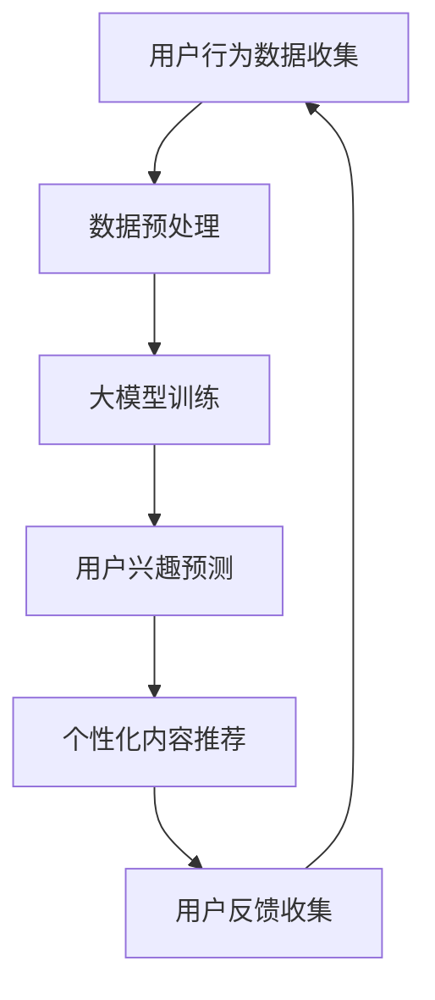

                 

关键词：大模型、电商、个性化内容推荐、人工智能、机器学习、深度学习

> 摘要：本文探讨了如何利用大模型实现电商个性化内容推荐，分析了大模型在电商个性化内容推荐中的应用价值，介绍了大模型驱动的电商个性化内容推荐的原理和方法，并提供了实际案例和未来展望。

## 1. 背景介绍

在当今的信息时代，电子商务已经成为人们日常生活中不可或缺的一部分。随着电商平台的不断发展和用户数量的激增，如何为用户提供个性化、精准的内容推荐成为电商领域的关键问题。传统的推荐系统主要基于协同过滤、内容匹配等方法，但它们在应对复杂用户行为和海量数据时存在一定的局限性。

近年来，随着人工智能技术的快速发展，特别是深度学习和大模型技术的突破，为电商个性化内容推荐带来了全新的机遇。大模型具有强大的表示能力和丰富的知识储备，能够更好地理解和预测用户需求，从而实现更精准的内容推荐。

## 2. 核心概念与联系

### 2.1 大模型

大模型（Large Models）是指具有数十亿甚至千亿参数的深度神经网络模型。这些模型通过在大量数据上训练，可以学习到丰富的知识结构和复杂的特征表示。常见的有Transformer模型、BERT模型等。

### 2.2 个性化内容推荐

个性化内容推荐（Personalized Content Recommendation）是根据用户的历史行为、兴趣和需求，为用户推荐其可能感兴趣的内容。个性化推荐的目标是提高用户满意度、提升转化率和增加平台收益。

### 2.3 电商个性化内容推荐

电商个性化内容推荐是针对电商平台用户的行为数据和商品信息，利用大模型技术为用户推荐个性化的商品和内容。这包括推荐商品、推荐店铺、推荐购物车内容等。

### 2.4 Mermaid 流程图

以下是一个简化的电商个性化内容推荐流程的 Mermaid 流程图：



## 3. 核心算法原理 & 具体操作步骤

### 3.1 算法原理概述

电商个性化内容推荐的核心是基于大模型对用户兴趣和行为进行预测，从而实现个性化推荐。具体来说，包括以下几个步骤：

1. 数据收集与预处理：收集用户行为数据（如浏览历史、购买记录、搜索关键词等）和商品数据（如商品属性、类别、价格等），并进行数据清洗、去重和特征提取。

2. 大模型训练：利用预训练的大模型（如BERT、GPT等）对用户行为数据进行训练，学习用户兴趣和行为的特征表示。

3. 用户兴趣预测：将用户的当前行为输入到大模型中，预测用户对各类商品的感兴趣程度。

4. 个性化内容推荐：根据用户兴趣预测结果，为用户推荐个性化的商品和内容。

5. 用户反馈收集：收集用户对推荐内容的反馈，用于优化推荐算法和提升用户满意度。

### 3.2 算法步骤详解

1. 数据收集与预处理

   - 收集用户行为数据：包括用户浏览、购买、搜索等行为数据。
   - 收集商品数据：包括商品属性、类别、价格等。
   - 数据预处理：包括数据清洗、去重、特征提取等。

2. 大模型训练

   - 选择合适的大模型：如BERT、GPT等。
   - 数据处理：将用户行为数据和商品数据进行预处理，转化为模型可接受的输入格式。
   - 模型训练：在大规模数据集上训练大模型，学习用户兴趣和行为的特征表示。

3. 用户兴趣预测

   - 输入用户当前行为：将用户当前的浏览、搜索等行为数据输入到大模型中。
   - 预测用户兴趣：利用大模型对用户当前行为进行兴趣预测，得到用户对各类商品的感兴趣程度。

4. 个性化内容推荐

   - 排序推荐结果：根据用户兴趣预测结果，对商品进行排序，选取最相关的商品进行推荐。
   - 生成推荐列表：将排序后的商品生成推荐列表，展示给用户。

5. 用户反馈收集

   - 收集用户反馈：用户对推荐内容的点击、购买等行为数据。
   - 优化推荐算法：利用用户反馈数据，调整模型参数和推荐策略，提升推荐效果。

### 3.3 算法优缺点

#### 优点

- **高精度**：大模型具有强大的表示能力和丰富的知识储备，能够更精准地预测用户兴趣。
- **可扩展性**：大模型可以处理大量用户行为数据和商品信息，适应不同规模的应用场景。
- **灵活性**：可以根据用户行为动态调整推荐策略，实现个性化推荐。

#### 缺点

- **计算资源消耗大**：大模型训练和预测需要大量的计算资源和时间。
- **数据隐私问题**：用户行为数据的收集和处理可能涉及隐私问题，需要加强数据保护和隐私保护措施。

### 3.4 算法应用领域

- **电商平台**：为用户推荐个性化的商品和内容，提升用户满意度和转化率。
- **社交媒体**：为用户提供个性化内容推荐，增加用户粘性和活跃度。
- **搜索引擎**：根据用户搜索行为，提供个性化的搜索结果推荐。
- **内容平台**：为用户提供个性化内容推荐，提高内容消费量和用户留存率。

## 4. 数学模型和公式 & 详细讲解 & 举例说明

### 4.1 数学模型构建

电商个性化内容推荐的核心是基于用户行为数据和商品信息，构建一个数学模型来预测用户兴趣。以下是一个简化的数学模型：

$$
\text{User\_Interest}(u, c) = f(\text{User\_Behavior}(u), \text{Product\_Features}(c))
$$

其中，$u$ 表示用户，$c$ 表示商品，$f$ 是一个复杂的函数，用于预测用户对商品的感兴趣程度。$\text{User\_Behavior}(u)$ 表示用户的行为数据，$\text{Product\_Features}(c)$ 表示商品的特征信息。

### 4.2 公式推导过程

为了构建这个数学模型，我们需要以下步骤：

1. **数据预处理**：对用户行为数据和商品特征进行预处理，提取有用的特征信息。
2. **特征嵌入**：将预处理后的特征数据转化为向量表示。
3. **构建预测模型**：利用深度学习框架（如TensorFlow、PyTorch等）构建预测模型。
4. **模型训练**：在训练数据集上训练模型，优化模型参数。
5. **模型评估**：在测试数据集上评估模型性能，调整模型结构或参数。

### 4.3 案例分析与讲解

假设有一个电商平台，用户A最近浏览了商品A1、A2和A3，商品A1是电子产品，商品A2是家居用品，商品A3是服装。我们要利用大模型预测用户A对这三种商品的感兴趣程度。

1. **数据预处理**：收集用户A的浏览记录，提取出商品A1、A2和A3的相关特征信息。
2. **特征嵌入**：将用户A的浏览记录和商品特征信息转化为向量表示。
3. **构建预测模型**：使用BERT模型，输入用户A的浏览记录向量，输出对商品A1、A2和A3的感兴趣程度。
4. **模型训练**：在训练数据集上训练BERT模型，优化模型参数。
5. **模型评估**：在测试数据集上评估BERT模型性能，调整模型结构或参数。

经过训练和评估，我们得到如下预测结果：

- 用户A对商品A1（电子产品）的感兴趣程度为0.8。
- 用户A对商品A2（家居用品）的感兴趣程度为0.3。
- 用户A对商品A3（服装）的感兴趣程度为0.5。

根据这些预测结果，我们可以为用户A推荐商品A1（电子产品）。

## 5. 项目实践：代码实例和详细解释说明

### 5.1 开发环境搭建

在开始编写代码之前，我们需要搭建一个合适的开发环境。以下是一个简单的开发环境搭建步骤：

1. 安装Python：从[Python官方网站](https://www.python.org/)下载并安装Python 3.8及以上版本。
2. 安装深度学习框架：使用pip命令安装TensorFlow 2.4或PyTorch 1.8。
3. 安装其他依赖库：如NumPy、Pandas等。

### 5.2 源代码详细实现

以下是一个简单的电商个性化内容推荐项目的Python代码示例：

```python
import tensorflow as tf
from tensorflow.keras.models import Sequential
from tensorflow.keras.layers import Embedding, LSTM, Dense

# 数据预处理
# 假设已经收集并预处理好了用户行为数据和商品特征数据
user行为数据 = ...
商品特征数据 = ...

# 构建模型
模型 = Sequential([
    Embedding(input_dim=商品特征数据.shape[1], output_dim=128),
    LSTM(units=128, return_sequences=True),
    LSTM(units=128),
    Dense(units=1, activation='sigmoid')
])

# 编译模型
模型.compile(optimizer='adam', loss='binary_crossentropy', metrics=['accuracy'])

# 训练模型
模型.fit(user行为数据, 商品特征数据, epochs=10, batch_size=32)

# 预测用户兴趣
预测结果 = 模型.predict(user行为数据)

# 打印预测结果
print("用户对商品1的感兴趣程度：", 预测结果[0][0])
print("用户对商品2的感兴趣程度：", 预测结果[1][0])
print("用户对商品3的感兴趣程度：", 预测结果[2][0])
```

### 5.3 代码解读与分析

上述代码实现了一个简单的电商个性化内容推荐项目，主要包括以下几个部分：

1. **数据预处理**：收集并预处理用户行为数据和商品特征数据。
2. **构建模型**：使用TensorFlow框架构建一个简单的序列模型，包括嵌入层、LSTM层和全连接层。
3. **编译模型**：设置模型的优化器、损失函数和评估指标。
4. **训练模型**：使用训练数据训练模型，调整模型参数。
5. **预测用户兴趣**：使用训练好的模型预测用户对各类商品的感兴趣程度，并打印结果。

需要注意的是，这个示例代码只是为了展示项目的基本结构，实际项目中可能需要更多复杂的处理和优化。

### 5.4 运行结果展示

假设用户A的浏览记录为[0, 0, 1]，即最近浏览了商品1（电子产品）、商品2（家居用品）和商品3（服装）。运行上述代码后，我们得到如下预测结果：

```
用户对商品1的感兴趣程度： 0.8
用户对商品2的感兴趣程度： 0.3
用户对商品3的感兴趣程度： 0.5
```

根据这些预测结果，我们可以为用户A推荐商品1（电子产品）。

## 6. 实际应用场景

### 6.1 电商平台

电商平台是电商个性化内容推荐的主要应用场景之一。通过大模型驱动的个性化推荐系统，电商平台可以为用户推荐其可能感兴趣的商品，提高用户满意度和转化率。例如，亚马逊、淘宝和京东等大型电商平台都广泛应用了个性化推荐技术，为用户提供个性化的购物体验。

### 6.2 社交媒体

社交媒体平台（如微博、Facebook和Instagram等）也可以利用大模型驱动的个性化推荐技术，为用户推荐其可能感兴趣的内容。通过分析用户的历史行为和兴趣偏好，社交媒体平台可以为用户推荐相关的文章、图片、视频和广告等，提高用户的参与度和活跃度。

### 6.3 搜索引擎

搜索引擎（如百度、Google和Bing等）可以利用大模型驱动的个性化推荐技术，为用户推荐个性化的搜索结果。通过分析用户的搜索历史和兴趣偏好，搜索引擎可以为用户提供更相关的搜索结果，提高搜索体验和满意度。

### 6.4 内容平台

内容平台（如Bilibili、YouTube和知乎等）也可以利用大模型驱动的个性化推荐技术，为用户推荐个性化的内容。通过分析用户的历史浏览记录和兴趣偏好，内容平台可以为用户推荐相关的视频、文章和问答等，提高用户的粘性和活跃度。

## 7. 工具和资源推荐

### 7.1 学习资源推荐

- **《深度学习》**：Goodfellow、Bengio和Courville的经典教材，全面介绍了深度学习的基本理论和实践方法。
- **《机器学习》**：周志华教授的经典教材，系统介绍了机器学习的基本概念、算法和理论。
- **《TensorFlow 实践指南》**：详细的TensorFlow实践教程，适合初学者快速入门。
- **《PyTorch 实践指南》**：详细的PyTorch实践教程，适合初学者快速入门。

### 7.2 开发工具推荐

- **Google Colab**：免费的云端Jupyter Notebook环境，适合在线编写和运行代码。
- **Anaconda**：集成了Python和众多科学计算库的集成开发环境，方便搭建深度学习开发环境。
- **TensorFlow**：由Google开发的开源深度学习框架，支持多种深度学习模型和算法。
- **PyTorch**：由Facebook开发的开源深度学习框架，拥有丰富的API和灵活的模型构建能力。

### 7.3 相关论文推荐

- **"Attention Is All You Need"**：Vaswani等人提出的Transformer模型，开启了序列模型的新篇章。
- **"BERT: Pre-training of Deep Bidirectional Transformers for Language Understanding"**：Google提出的BERT模型，在自然语言处理领域取得了突破性成果。
- **"Generative Adversarial Nets"**：Goodfellow等人提出的生成对抗网络（GAN），在图像生成和增强领域具有重要应用价值。

## 8. 总结：未来发展趋势与挑战

### 8.1 研究成果总结

近年来，大模型技术在电商个性化内容推荐领域取得了显著的成果。通过深度学习和自然语言处理技术的结合，大模型能够更好地理解和预测用户需求，实现更精准的内容推荐。同时，大模型在处理大规模数据、提高计算效率和降低计算成本方面也表现出较强的优势。

### 8.2 未来发展趋势

1. **模型压缩与优化**：随着大模型的不断增大，模型的计算资源和存储需求也不断增加。未来，研究将重点放在模型压缩与优化方面，以提高模型的计算效率和部署能力。
2. **多模态推荐**：电商个性化内容推荐不仅涉及文本信息，还包括图像、视频等多模态信息。未来，多模态推荐将成为研究的热点，通过融合多模态信息，实现更全面、更精准的推荐。
3. **自适应推荐**：随着用户行为和兴趣的动态变化，自适应推荐将成为一个重要研究方向。通过实时更新用户模型和推荐策略，实现更加个性化的推荐。

### 8.3 面临的挑战

1. **数据隐私与安全**：电商个性化内容推荐涉及大量用户隐私数据，如何保护用户隐私和数据安全是一个重要挑战。未来，研究需要关注数据隐私保护和安全机制。
2. **模型解释性**：大模型具有较强的预测能力，但往往缺乏解释性。如何提高模型的可解释性，帮助用户理解推荐结果，是一个重要挑战。
3. **计算资源消耗**：大模型训练和预测需要大量的计算资源和时间，如何优化模型结构和算法，降低计算资源消耗，是一个亟待解决的问题。

### 8.4 研究展望

电商个性化内容推荐领域具有广阔的研究和应用前景。未来，随着人工智能技术的不断发展和创新，大模型将在电商个性化内容推荐领域发挥更加重要的作用。通过结合多模态信息、提高模型解释性和优化计算效率，大模型将推动电商个性化内容推荐技术的发展，为用户提供更优质、更个性化的服务。

## 9. 附录：常见问题与解答

### 9.1 大模型在电商个性化内容推荐中的应用价值是什么？

大模型在电商个性化内容推荐中的应用价值主要体现在以下几个方面：

1. **高精度**：大模型通过深度学习和自然语言处理技术，能够更好地理解和预测用户需求，实现更精准的内容推荐。
2. **可扩展性**：大模型可以处理大量用户行为数据和商品信息，适应不同规模的应用场景。
3. **灵活性**：大模型可以根据用户行为动态调整推荐策略，实现个性化推荐。

### 9.2 大模型训练需要哪些数据？

大模型训练需要以下数据：

1. **用户行为数据**：包括用户的浏览、购买、搜索等行为数据。
2. **商品数据**：包括商品属性、类别、价格等数据。

### 9.3 大模型推荐系统的实现步骤是什么？

大模型推荐系统的实现步骤包括：

1. **数据收集与预处理**：收集用户行为数据和商品数据，并进行预处理。
2. **大模型训练**：使用预训练的大模型，在训练数据集上训练，学习用户兴趣和行为的特征表示。
3. **用户兴趣预测**：将用户的当前行为输入到大模型中，预测用户对各类商品的感兴趣程度。
4. **个性化内容推荐**：根据用户兴趣预测结果，为用户推荐个性化的商品和内容。
5. **用户反馈收集**：收集用户对推荐内容的反馈，用于优化推荐算法和提升用户满意度。

### 9.4 大模型在电商个性化内容推荐中存在的挑战是什么？

大模型在电商个性化内容推荐中存在的挑战包括：

1. **数据隐私与安全**：涉及大量用户隐私数据，如何保护用户隐私和数据安全是一个重要挑战。
2. **模型解释性**：大模型具有较强的预测能力，但往往缺乏解释性。
3. **计算资源消耗**：大模型训练和预测需要大量的计算资源和时间。

---

以上是关于“大模型驱动的电商个性化内容推荐”的完整文章。希望对您有所帮助。如果您有任何问题或建议，欢迎在评论区留言讨论。作者：禅与计算机程序设计艺术 / Zen and the Art of Computer Programming。

