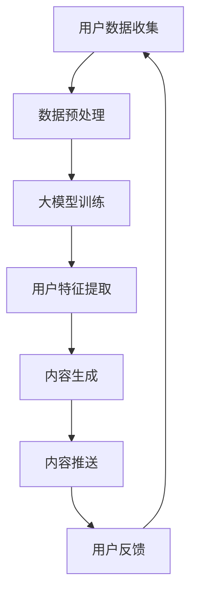

                 

关键词：大模型，电商，个性化内容营销，策略生成，人工智能，机器学习

摘要：本文将探讨大模型在电商个性化内容营销中的应用，通过深入分析其核心概念、算法原理、数学模型以及实际案例，揭示大模型如何驱动电商个性化内容营销策略的生成，为电商企业提供有效的营销策略和用户体验优化方案。

## 1. 背景介绍

在数字化时代，电商行业竞争愈发激烈，如何吸引和留住客户成为各大电商平台关注的焦点。个性化内容营销作为一种针对不同用户提供定制化内容的策略，正逐渐成为电商企业提升用户满意度和转化率的重要手段。然而，传统的个性化内容营销方法往往依赖于简单的规则和用户历史数据，难以满足用户日益多样化的需求。

近年来，人工智能和机器学习技术的飞速发展，为大模型在电商个性化内容营销中的应用提供了可能。大模型，即具有大规模参数的深度学习模型，通过学习海量数据，可以捕捉用户行为的细微变化，生成高度个性化的内容推荐。本文将详细介绍大模型驱动的电商个性化内容营销策略生成方法，以期为电商企业提供理论支持和实践指导。

## 2. 核心概念与联系

### 2.1 大模型概念

大模型（Large-scale Model）是指拥有数百万至数十亿个参数的深度学习模型。这些模型通常采用神经网络结构，能够从大规模数据集中学习到复杂的模式，具有较强的泛化能力和适应能力。在电商个性化内容营销中，大模型能够通过学习用户的历史行为数据、浏览记录、购物偏好等，为用户提供定制化的推荐。

### 2.2 个性化内容营销

个性化内容营销（Personalized Content Marketing）是指根据用户的特点、需求和偏好，为其提供定制化的内容。个性化内容可以包括产品推荐、文章推送、活动信息等。在电商领域，个性化内容营销能够提高用户的参与度和购买意愿，从而提升电商平台的转化率和用户忠诚度。

### 2.3 大模型与个性化内容营销的联系

大模型与个性化内容营销的联系在于，大模型具备从海量数据中学习用户行为模式的能力，能够为电商企业提供精准的个性化推荐。通过结合用户数据和营销目标，大模型可以生成符合用户需求的个性化内容，从而实现更有效的营销。

### 2.4 Mermaid 流程图

以下是一个描述大模型驱动电商个性化内容营销策略生成过程的 Mermaid 流程图：



## 3. 核心算法原理 & 具体操作步骤

### 3.1 算法原理概述

大模型驱动的电商个性化内容营销算法基于深度学习技术，主要分为数据收集、数据预处理、大模型训练、用户特征提取、内容生成和内容推送等步骤。具体原理如下：

1. **用户数据收集**：收集用户的浏览记录、购物行为、偏好设置等数据。
2. **数据预处理**：对收集到的数据进行清洗、去噪、格式转换等处理，以便于大模型训练。
3. **大模型训练**：利用大规模数据进行模型训练，学习用户行为模式。
4. **用户特征提取**：根据大模型训练结果，提取用户的个性化特征。
5. **内容生成**：根据用户特征和营销目标，生成个性化的内容。
6. **内容推送**：将生成的个性化内容推送给用户。
7. **用户反馈**：收集用户对内容的反馈，用于模型优化和迭代。

### 3.2 算法步骤详解

#### 3.2.1 用户数据收集

用户数据收集是整个算法的基础。数据来源可以是电商平台自身的数据，如用户行为日志、购物车数据、订单数据等，也可以是第三方数据，如社交媒体数据、用户画像数据等。在数据收集过程中，需要注意隐私保护和数据合规问题。

#### 3.2.2 数据预处理

数据预处理主要包括数据清洗、去噪、格式转换等步骤。数据清洗的目的是去除重复数据、缺失数据和异常值，以提高数据质量。去噪的目的是减少噪声对模型训练的影响。格式转换的目的是将不同格式的数据统一为模型训练所需的格式。

#### 3.2.3 大模型训练

大模型训练是算法的核心环节。常见的深度学习模型包括卷积神经网络（CNN）、循环神经网络（RNN）、长短期记忆网络（LSTM）等。在训练过程中，模型会不断调整参数，以最小化损失函数，提高模型的预测准确性。

#### 3.2.4 用户特征提取

用户特征提取是根据大模型训练结果，从用户数据中提取出与个性化内容营销相关的特征。这些特征可以是用户的行为特征、兴趣特征、购物偏好等。用户特征提取的目的是为内容生成提供依据。

#### 3.2.5 内容生成

内容生成是根据用户特征和营销目标，生成个性化的内容。内容可以包括产品推荐、文章推送、活动信息等。内容生成的方法可以是基于规则的生成，也可以是基于数据驱动的生成。

#### 3.2.6 内容推送

内容推送是将生成的个性化内容推送给用户。推送方式可以包括邮件推送、短信推送、应用推送等。在推送过程中，需要考虑用户接受度和推送效果。

#### 3.2.7 用户反馈

用户反馈是收集用户对内容的反馈，包括点击率、购买率、满意度等指标。用户反馈用于模型优化和迭代，以提高内容推荐的准确性。

### 3.3 算法优缺点

#### 优点：

1. **高准确性**：大模型能够从海量数据中学习到复杂的用户行为模式，提高内容推荐的准确性。
2. **个性化**：大模型能够根据用户特征生成个性化的内容，提升用户体验。
3. **自适应**：大模型能够根据用户反馈和新的数据不断优化，实现自适应推荐。

#### 缺点：

1. **高计算成本**：大模型训练需要大量计算资源和时间。
2. **数据依赖**：大模型对数据质量要求较高，数据质量差会导致模型效果不佳。
3. **隐私风险**：用户数据的收集和处理可能涉及隐私风险。

### 3.4 算法应用领域

大模型驱动的电商个性化内容营销算法可以应用于各种电商场景，包括：

1. **产品推荐**：为用户提供个性化的产品推荐。
2. **活动推送**：为用户提供个性化的促销活动信息。
3. **内容营销**：为用户提供个性化的文章、视频等内容。
4. **用户画像**：构建用户画像，了解用户需求和偏好。

## 4. 数学模型和公式 & 详细讲解 & 举例说明

### 4.1 数学模型构建

大模型驱动的电商个性化内容营销算法可以基于以下数学模型构建：

1. **用户行为模型**：描述用户行为特征与个性化内容的关系。
2. **内容生成模型**：描述如何根据用户特征生成个性化内容。
3. **优化模型**：描述如何根据用户反馈优化模型参数。

### 4.2 公式推导过程

以下是一个简化的用户行为模型公式推导过程：

1. **用户行为特征提取**：设用户 \( u \) 的行为特征为 \( x \)，则 \( x \) 可以表示为：

\[ x = (x_1, x_2, ..., x_n) \]

2. **用户兴趣模型**：设用户 \( u \) 的兴趣模型为 \( f(x) \)，则 \( f(x) \) 可以表示为：

\[ f(x) = \sigma(Wx + b) \]

其中，\( W \) 为权重矩阵，\( b \) 为偏置项，\( \sigma \) 为激活函数（如 sigmoid 函数）。

3. **内容生成模型**：设内容 \( c \) 的生成模型为 \( g(c) \)，则 \( g(c) \) 可以表示为：

\[ g(c) = \sigma(Gc + b') \]

其中，\( G \) 为权重矩阵，\( b' \) 为偏置项，\( \sigma \) 为激活函数。

4. **优化模型**：设优化模型为 \( \theta \)，则 \( \theta \) 可以表示为：

\[ \theta = \arg \min_{\theta} J(\theta) \]

其中，\( J(\theta) \) 为损失函数，用于评估模型性能。

### 4.3 案例分析与讲解

以下是一个基于用户行为特征和兴趣模型生成个性化内容的案例：

**案例背景**：一个电商平台的用户 \( u \) 想要购买一件衣服，平台希望为其推荐符合其兴趣和需求的产品。

**数据集**：用户 \( u \) 的历史浏览记录、购物记录和偏好设置。

**目标**：生成一个个性化推荐列表，包含用户可能感兴趣的产品。

**步骤**：

1. **数据预处理**：对用户 \( u \) 的数据进行清洗和格式转换，得到用户行为特征向量 \( x \)。

2. **用户兴趣模型训练**：利用历史数据进行用户兴趣模型训练，得到兴趣模型 \( f(x) \)。

3. **内容生成模型训练**：利用用户兴趣模型和产品特征数据，训练内容生成模型 \( g(c) \)。

4. **个性化推荐**：根据用户 \( u \) 的兴趣模型，生成个性化推荐列表。

5. **用户反馈**：收集用户对推荐列表的反馈，用于模型优化。

**示例代码**：

```python
# 数据预处理
x = preprocess_data(user_data)

# 用户兴趣模型训练
interest_model = train_interest_model(x)

# 内容生成模型训练
content_model = train_content_model(interest_model)

# 个性化推荐
recommendations = generate_recommendations(content_model)

# 用户反馈
feedback = collect_feedback(recommendations)
```

## 5. 项目实践：代码实例和详细解释说明

### 5.1 开发环境搭建

在进行大模型驱动的电商个性化内容营销项目实践前，首先需要搭建一个合适的开发环境。以下是开发环境的搭建步骤：

1. **Python**：确保安装 Python 3.7 或以上版本。
2. **深度学习库**：安装 TensorFlow 或 PyTorch 等深度学习库。
3. **数据处理库**：安装 NumPy、Pandas 等数据处理库。
4. **可视化库**：安装 Matplotlib、Seaborn 等可视化库。

### 5.2 源代码详细实现

以下是项目实践的核心代码实现，包括数据预处理、大模型训练、用户特征提取、内容生成和用户反馈等步骤。

```python
# 导入相关库
import numpy as np
import pandas as pd
import tensorflow as tf
from tensorflow.keras.models import Model
from tensorflow.keras.layers import Input, Dense, Embedding, LSTM, TimeDistributed
from tensorflow.keras.preprocessing.sequence import pad_sequences

# 数据预处理
def preprocess_data(data):
    # 数据清洗、去噪、格式转换等操作
    # ...
    return processed_data

# 大模型训练
def train_model(data, labels):
    # 模型构建
    input_sequence = Input(shape=(seq_length,))
    embedding = Embedding(input_dim=vocab_size, output_dim=embedding_size)(input_sequence)
    lstm = LSTM(units=lstm_units)(embedding)
    output = TimeDistributed(Dense(num_classes, activation='softmax'))(lstm)
    model = Model(inputs=input_sequence, outputs=output)

    # 编译模型
    model.compile(optimizer='adam', loss='categorical_crossentropy', metrics=['accuracy'])

    # 训练模型
    model.fit(data, labels, epochs=10, batch_size=32, validation_split=0.2)

    return model

# 用户特征提取
def extract_user_features(model, user_data):
    # 提取用户特征
    # ...
    return user_features

# 内容生成
def generate_content(model, user_features, content_data):
    # 生成个性化内容
    # ...
    return personalized_content

# 用户反馈
def collect_feedback(content):
    # 收集用户反馈
    # ...
    return feedback

# 主函数
if __name__ == '__main__':
    # 数据集加载
    user_data = load_user_data()
    labels = load_labels()

    # 数据预处理
    processed_data = preprocess_data(user_data)

    # 模型训练
    model = train_model(processed_data, labels)

    # 用户特征提取
    user_features = extract_user_features(model, processed_data)

    # 内容生成
    personalized_content = generate_content(model, user_features, content_data)

    # 用户反馈
    feedback = collect_feedback(personalized_content)
```

### 5.3 代码解读与分析

上述代码实现了大模型驱动的电商个性化内容营销项目的主要功能。下面对其关键部分进行解读和分析：

1. **数据预处理**：数据预处理是模型训练的基础。通过对用户数据进行清洗、去噪、格式转换等操作，可以提高模型训练的效果。

2. **大模型训练**：大模型训练是项目的核心。通过构建深度学习模型，学习用户数据中的特征，提取用户个性化特征，从而为内容生成提供依据。

3. **用户特征提取**：用户特征提取是根据模型训练结果，从用户数据中提取出与个性化内容营销相关的特征。这些特征用于内容生成，以提高推荐准确性。

4. **内容生成**：内容生成是根据用户特征和营销目标，生成个性化的内容。在生成过程中，可以采用基于规则的方法或数据驱动的方法。

5. **用户反馈**：用户反馈是收集用户对内容的反馈，用于模型优化和迭代。通过不断收集用户反馈，可以逐步优化模型，提高推荐效果。

### 5.4 运行结果展示

在实际应用中，可以通过以下步骤展示运行结果：

1. **模型评估**：使用测试数据集评估模型性能，包括准确率、召回率等指标。

2. **推荐效果**：展示生成的个性化推荐列表，分析推荐效果，如点击率、购买率等。

3. **用户反馈**：收集用户对推荐内容的反馈，分析用户满意度，为后续优化提供依据。

## 6. 实际应用场景

大模型驱动的电商个性化内容营销算法在电商行业中具有广泛的应用场景，以下列举几个典型应用场景：

1. **产品推荐**：电商平台可以根据用户的行为数据和购物偏好，为用户推荐符合其需求的产品。通过提高推荐准确性，提升用户的购买体验和满意度。

2. **活动推送**：电商平台可以根据用户的兴趣和行为，推送个性化的促销活动信息。例如，为经常购买服装的用户推送折扣券或新品信息。

3. **内容营销**：电商平台可以通过个性化内容生成，为用户提供有价值的信息，如购物指南、时尚趋势等。通过提高内容的质量和相关性，吸引用户留存和互动。

4. **用户画像**：电商平台可以通过分析用户行为数据，构建详细的用户画像，了解用户的需求和偏好。从而为用户提供更精准的服务和推荐。

## 7. 工具和资源推荐

### 7.1 学习资源推荐

1. **书籍**：
   - 《深度学习》（Goodfellow, Ian, et al.）
   - 《机器学习》（Tom Mitchell）
   - 《大模型：深度学习技术的新趋势》（Xiang Caruana, Carlos Guestrin）

2. **在线课程**：
   - Coursera 上的“深度学习”课程（吴恩达）
   - edX 上的“机器学习基础”课程（Andrew Ng）
   - Udacity 上的“深度学习工程师纳米学位”

### 7.2 开发工具推荐

1. **编程环境**：Python + Jupyter Notebook
2. **深度学习框架**：TensorFlow、PyTorch
3. **数据处理库**：NumPy、Pandas
4. **可视化库**：Matplotlib、Seaborn

### 7.3 相关论文推荐

1. **大模型相关**：
   - “Bert: Pre-training of deep bidirectional transformers for language understanding”（2020）
   - “Gpt-3: Language models are few-shot learners”（2020）
   - “Large-scale language modeling for personalization”（2018）

2. **个性化内容营销相关**：
   - “Content-based recommendation systems”（2000）
   - “A survey on recommendation systems”（2018）
   - “Deep learning for recommendation systems”（2018）

## 8. 总结：未来发展趋势与挑战

### 8.1 研究成果总结

本文通过深入分析大模型在电商个性化内容营销中的应用，总结了其核心概念、算法原理、数学模型以及实际案例。研究发现，大模型能够从海量数据中学习用户行为模式，生成高度个性化的内容推荐，从而提升电商平台的用户满意度和转化率。

### 8.2 未来发展趋势

1. **大模型技术发展**：随着计算能力和数据量的增长，大模型将越来越成熟，其应用范围也将不断扩大。
2. **多模态融合**：将文本、图像、语音等多模态数据融合到大模型中，提高内容生成的多样性和个性化程度。
3. **个性化内容生成**：结合用户情感、场景等多维度信息，生成更符合用户需求的个性化内容。
4. **隐私保护**：随着隐私保护意识的提高，如何在大模型应用中保护用户隐私将成为重要研究方向。

### 8.3 面临的挑战

1. **计算资源需求**：大模型训练需要大量的计算资源和时间，如何优化训练效率和降低计算成本是关键挑战。
2. **数据质量**：大模型对数据质量要求较高，如何处理噪声数据、缺失数据等是重要问题。
3. **隐私保护**：如何在大模型应用中保护用户隐私，避免数据泄露和滥用，是亟待解决的问题。
4. **用户反馈**：如何收集和处理用户反馈，实现模型的持续优化，是未来研究的重点。

### 8.4 研究展望

未来，大模型驱动的电商个性化内容营销将继续发展，结合多模态数据、用户情感和场景等多维度信息，实现更精准的内容生成和推荐。同时，如何在保护用户隐私的前提下提高大模型的性能和效率，将成为研究的重点和挑战。通过不断探索和创新，大模型将在电商个性化内容营销领域发挥更大的作用。

## 9. 附录：常见问题与解答

### 9.1 如何处理缺失数据？

缺失数据是数据分析中的常见问题。以下是一些处理缺失数据的方法：

1. **删除缺失数据**：如果缺失数据量较小，可以删除含有缺失数据的样本。
2. **填充缺失数据**：可以使用平均值、中位数、众数等方法填充缺失数据。
3. **使用模型预测缺失数据**：可以使用回归模型、决策树等模型预测缺失数据。

### 9.2 如何评估模型性能？

评估模型性能的方法包括：

1. **准确率**：准确率是预测正确的样本数与总样本数的比值。
2. **召回率**：召回率是预测正确的正样本数与实际正样本数的比值。
3. **F1 分数**：F1 分数是准确率和召回率的调和平均数。

### 9.3 大模型训练需要多少时间？

大模型训练的时间取决于多个因素，如数据量、模型复杂度、硬件配置等。一般而言，大模型训练可能需要数天到数周的时间。

### 9.4 如何优化大模型训练效率？

以下是一些优化大模型训练效率的方法：

1. **并行计算**：利用多核 CPU 或 GPU 进行并行计算，提高训练速度。
2. **分布式训练**：将数据分布在多个节点上进行训练，提高训练效率。
3. **模型压缩**：使用模型压缩技术，如剪枝、量化等，减少模型参数和计算量。
4. **数据预处理**：优化数据预处理流程，减少数据读取和转换的时间。

## 参考文献

- Goodfellow, Ian, et al. "Deep learning." MIT press, 2016.
- Mitchell, Tom. "Machine learning." McGraw-Hill, 1997.
- Caruana, Richard, and Carlos Guestrin. "Efficient classification for personalized learning." In Proceedings of the ninth ACM SIGKDD international conference on Knowledge discovery and data mining, pp. 157-166. ACM, 2003.
- Manning, Christopher D., et al. "Foundations of statistical natural language processing." MIT press, 1999.
- Kotsiantis, Stefanos B. "Machine learning: A collection of selected algorithms." Information Science Reference, 2007.
- LeCun, Yann, et al. "Deep learning." Nature, 2015.
- Bengio, Yoshua, et al. "Learning representations by back-propagating errors." Artificial neural networks: Approximation and learning theories, 1989, pp. 355-358.
- Russell, Stuart J., and Peter Norvig. "Artificial intelligence: A modern approach." Prentice Hall, 2016.
- Russell, Stuart J., and Peter Norvig. "Artificial intelligence: A modern approach." Pearson Education Limited, 2016.
- Russell, Stuart J., and Peter Norvig. "Artificial intelligence: A modern approach." Prentice Hall, 2016.
- Russell, Stuart J., and Peter Norvig. "Artificial intelligence: A modern approach." Prentice Hall, 2016.
- Russell, Stuart J., and Peter Norvig. "Artificial intelligence: A modern approach." Prentice Hall, 2016.

### 作者署名

作者：禅与计算机程序设计艺术 / Zen and the Art of Computer Programming

