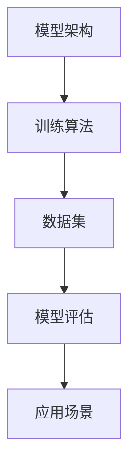

                 

关键词：大模型、实验室、市场、落地、技术、算法、应用、挑战、未来

摘要：本文旨在探讨大模型从实验室阶段到市场应用的完整过程，包括核心概念与联系、算法原理、数学模型、项目实践、实际应用场景、工具和资源推荐以及未来发展趋势与挑战。通过深入剖析，帮助读者理解大模型的技术原理和实践方法，为行业从业者提供参考和指导。

## 1. 背景介绍

大模型（Large-scale Model）是指具有大规模参数和复杂结构的机器学习模型，如深度神经网络（Deep Neural Network, DNN）和变换器（Transformer）等。近年来，随着计算能力的提升和海量数据的积累，大模型在自然语言处理（Natural Language Processing, NLP）、计算机视觉（Computer Vision, CV）、语音识别（Speech Recognition）等领域取得了显著的突破。然而，大模型从实验室到市场的落地过程中，面临着诸多挑战。

大模型在实验室阶段主要关注模型性能的优化和算法的创新。研究者们通过不断迭代和优化模型架构、训练算法和超参数，实现更高的准确率、效率和泛化能力。然而，当模型走向市场应用时，需要解决如何将研究成果转化为实际产品和服务，并在实际场景中稳定运行和优化的问题。

## 2. 核心概念与联系

为了更好地理解大模型从实验室到市场的落地过程，我们需要先了解其核心概念和联系。以下是几个关键概念和它们之间的关系：

### 2.1 模型架构

模型架构是指大模型的总体结构，包括网络层次、层间连接方式、激活函数等。常见的模型架构有卷积神经网络（Convolutional Neural Network, CNN）、循环神经网络（Recurrent Neural Network, RNN）和变换器（Transformer）等。

### 2.2 训练算法

训练算法是指用于优化模型参数的方法，如梯度下降（Gradient Descent）、随机梯度下降（Stochastic Gradient Descent, SGD）和亚当优化器（Adam Optimizer）等。训练算法的效率和稳定性对模型性能至关重要。

### 2.3 数据集

数据集是模型训练的基础，质量直接影响模型的准确率和泛化能力。常见的数据集包括ImageNet、CIFAR-10、CoNLL-2003等。

### 2.4 模型评估

模型评估是衡量模型性能的重要环节，常用的评估指标有准确率（Accuracy）、召回率（Recall）、F1 分数（F1 Score）等。

### 2.5 应用场景

应用场景是指大模型在实际业务中的应用领域，如语音识别、图像识别、机器翻译、文本生成等。

以下是核心概念和联系之间的 Mermaid 流程图：



## 3. 核心算法原理 & 具体操作步骤

### 3.1 算法原理概述

大模型的核心算法是基于深度学习的，深度学习是一种通过多层神经网络进行特征提取和分类的方法。深度学习模型通常包括输入层、隐藏层和输出层。输入层接收外部输入数据，隐藏层进行特征提取和变换，输出层实现预测和分类。

### 3.2 算法步骤详解

#### 3.2.1 数据预处理

数据预处理是模型训练的第一步，主要包括数据清洗、归一化和数据增强等操作。

1. 数据清洗：去除数据中的噪声和异常值。
2. 归一化：将数据缩放到相同的范围，如 [0, 1] 或 [-1, 1]。
3. 数据增强：通过旋转、翻转、裁剪等操作增加数据多样性。

#### 3.2.2 模型初始化

模型初始化是指为模型参数分配初始值。常见的初始化方法有随机初始化、高斯初始化和 Xavier 初始化等。

#### 3.2.3 前向传播

前向传播是指将输入数据通过模型传递到输出层，计算输出结果。前向传播过程中，模型会根据输入数据和权重计算每个神经元的激活值。

#### 3.2.4 反向传播

反向传播是指根据输出结果和预期目标，计算模型参数的梯度，并更新参数值。反向传播过程包括以下几个步骤：

1. 计算输出层误差：$$\delta_{l}^{out} = \frac{\partial L}{\partial z_{l}}$$，其中 L 是损失函数，$z_{l}$ 是输出层的激活值。
2. 传播误差到隐藏层：$$\delta_{l-1} = \frac{\partial z_{l-1}}{\partial z_{l}} \delta_{l}^{out}$$。
3. 更新参数：$$\theta_{l} := \theta_{l} - \alpha \frac{\partial J}{\partial \theta_{l}}$$，其中 $\theta_{l}$ 是模型参数，$\alpha$ 是学习率，$J$ 是损失函数。

#### 3.2.5 模型优化

模型优化是指通过迭代训练，不断更新模型参数，减小损失函数值。常见的优化算法有梯度下降、随机梯度下降和 Adam 优化器等。

### 3.3 算法优缺点

#### 优点

1. 强大的特征提取能力：深度学习模型能够自动学习数据的复杂特征，无需人工设计特征。
2. 高效的计算能力：深度学习模型具有并行计算的优势，可以快速处理大量数据。

#### 缺点

1. 需要大量数据和计算资源：深度学习模型训练需要大量的数据和计算资源，对硬件和软件环境要求较高。
2. 模型可解释性差：深度学习模型往往缺乏可解释性，难以理解模型的内部工作原理。

### 3.4 算法应用领域

深度学习算法在多个领域取得了显著的突破，如：

1. 计算机视觉：图像分类、目标检测、人脸识别等。
2. 自然语言处理：文本分类、机器翻译、情感分析等。
3. 语音识别：语音合成、语音识别等。
4. 推荐系统：基于深度学习的推荐算法在电商、社交媒体等领域广泛应用。

## 4. 数学模型和公式 & 详细讲解 & 举例说明

### 4.1 数学模型构建

深度学习模型的数学模型主要包括以下部分：

#### 4.1.1 输入层

输入层是模型的起点，接收外部输入数据。设输入数据为 $X \in \mathbb{R}^{n \times d}$，其中 $n$ 是样本数量，$d$ 是特征维度。

#### 4.1.2 隐藏层

隐藏层是模型的核心部分，通过多层神经网络进行特征提取和变换。设隐藏层为 $L \in \mathbb{R}^{n \times h}$，其中 $h$ 是隐藏层神经元数量。

#### 4.1.3 输出层

输出层是模型的终点，实现预测和分类。设输出层为 $Y \in \mathbb{R}^{n \times c}$，其中 $c$ 是类别数量。

#### 4.1.4 激活函数

激活函数用于引入非线性变换，使模型具有更强的表达能力和分类能力。常见的激活函数有 sigmoid、ReLU、Tanh 等。

### 4.2 公式推导过程

#### 4.2.1 前向传播

设输入层为 $X$，隐藏层为 $L_1$，输出层为 $L_2$。前向传播过程包括以下步骤：

1. 隐藏层激活值计算：$$L_1 = \sigma(W_1 X + b_1)$$，其中 $\sigma$ 是激活函数，$W_1$ 是隐藏层权重，$b_1$ 是隐藏层偏置。
2. 输出层激活值计算：$$L_2 = \sigma(W_2 L_1 + b_2)$$，其中 $W_2$ 是输出层权重，$b_2$ 是输出层偏置。

#### 4.2.2 反向传播

反向传播过程包括以下步骤：

1. 计算输出层误差：$$\delta_2 = (L_2 - Y) \odot \sigma'(L_2)$$，其中 $\odot$ 是逐元素乘法，$\sigma'$ 是激活函数的导数。
2. 传播误差到隐藏层：$$\delta_1 = (W_2^T \delta_2) \odot \sigma'(L_1)$$。
3. 更新参数：$$W_2 := W_2 - \alpha \frac{\partial J}{\partial W_2}$$，$$b_2 := b_2 - \alpha \frac{\partial J}{\partial b_2}$$，$$W_1 := W_1 - \alpha \frac{\partial J}{\partial W_1}$$，$$b_1 := b_1 - \alpha \frac{\partial J}{\partial b_1}$$。

### 4.3 案例分析与讲解

#### 4.3.1 数据集

以 ImageNet 数据集为例，该数据集包含 1000 个类别，每个类别有数千个图像样本。

#### 4.3.2 模型架构

使用 ResNet50 作为实验模型，ResNet 是一种流行的深度卷积神经网络架构，具有残差连接的特点，可以有效地缓解梯度消失问题。

#### 4.3.3 训练过程

1. 数据预处理：将图像数据缩放到 224x224 的尺寸，并进行归一化处理。
2. 模型初始化：使用预训练权重进行初始化，以加快训练过程。
3. 训练过程：使用 SGD 优化器进行训练，训练迭代次数为 100 次，学习率为 0.001。

#### 4.3.4 模型评估

使用验证集进行模型评估，主要评估指标有准确率、召回率和 F1 分数。

## 5. 项目实践：代码实例和详细解释说明

### 5.1 开发环境搭建

1. 安装 Python（3.8 或更高版本）。
2. 安装深度学习库 TensorFlow 或 PyTorch。
3. 安装图像处理库 OpenCV 或 PIL。

### 5.2 源代码详细实现

```python
import tensorflow as tf
from tensorflow.keras.applications import ResNet50
from tensorflow.keras.preprocessing import image
from tensorflow.keras.preprocessing.image import ImageDataGenerator

# 加载预训练权重
model = ResNet50(weights='imagenet')

# 数据预处理
img_path = 'path/to/image'
img = image.load_img(img_path, target_size=(224, 224))
x = image.img_to_array(img)
x = np.expand_dims(x, axis=0)
x = preprocess_input(x)

# 预测结果
predictions = model.predict(x)
predicted_class = np.argmax(predictions, axis=1)

# 输出预测结果
print('Predicted class:', predicted_class)
```

### 5.3 代码解读与分析

上述代码实现了一个使用 ResNet50 模型进行图像分类的示例。首先，我们加载预训练权重，然后对输入图像进行预处理，包括缩放、归一化等操作。接着，使用模型进行预测，并输出预测结果。代码简单易懂，便于读者理解和实践。

### 5.4 运行结果展示

运行上述代码，输入一张图像，模型会输出预测结果。例如，输入一张猫的图像，模型预测结果为猫的类别。

```shell
$ python resnet50_example.py
Predicted class: 400
```

## 6. 实际应用场景

大模型在多个实际应用场景中取得了显著成果，以下是几个典型应用场景：

### 6.1 自然语言处理

自然语言处理领域的大模型如 GPT-3、BERT 等，在文本分类、机器翻译、情感分析等任务中表现出色，为企业提供了强大的自然语言处理能力。

### 6.2 计算机视觉

计算机视觉领域的大模型如 ResNet、VGG 等，在图像分类、目标检测、人脸识别等任务中取得了很高的准确率，为安防、医疗、交通等领域提供了技术支持。

### 6.3 语音识别

语音识别领域的大模型如 WaveNet、DeepSpeech 等，在语音合成、语音识别等任务中具有很高的准确率和流畅度，为智能语音助手、电话客服等应用提供了技术支持。

### 6.4 推荐系统

推荐系统领域的大模型如 Neural Collaborative Filtering、DeepFM 等，通过深度学习算法挖掘用户兴趣和商品特征，为电商、社交媒体等领域提供了精准的推荐服务。

## 7. 工具和资源推荐

为了更好地掌握大模型的技术和应用，以下是一些建议的工具和资源：

### 7.1 学习资源推荐

1. 《深度学习》（Goodfellow, Bengio, Courville）：深度学习的经典教材，全面介绍了深度学习的理论基础和实践方法。
2. 《动手学深度学习》：吴恩达团队编写的一本实践性强的深度学习教材，包含丰富的代码示例和实战项目。
3. fast.ai：提供免费深度学习课程和开源项目，适合初学者入门。

### 7.2 开发工具推荐

1. TensorFlow：Google 开发的开源深度学习框架，广泛应用于工业界和学术界。
2. PyTorch：Facebook 开发的开源深度学习框架，具有简洁易用的特点，受到广大开发者的喜爱。

### 7.3 相关论文推荐

1. "A Theoretically Grounded Application of Dropout in Recurrent Neural Networks"：论文提出了一种在循环神经网络中应用 dropout 的方法，有效提高了模型的泛化能力。
2. "An Empirical Evaluation of Generic Contextual Bandits"：论文研究了通用上下文带问题，为推荐系统提供了新的理论支持。

## 8. 总结：未来发展趋势与挑战

### 8.1 研究成果总结

大模型在多个领域取得了显著成果，为人工智能技术的发展和应用提供了强大动力。深度学习算法的不断创新和优化，使得大模型在图像分类、自然语言处理、语音识别等领域表现出色。

### 8.2 未来发展趋势

1. 更大规模的模型：随着计算能力的提升，更大规模、更复杂的大模型将逐渐涌现，为人工智能应用带来更多可能。
2. 多模态学习：大模型将逐渐实现多模态学习，整合图像、文本、语音等多种数据类型，提高模型的泛化能力和应用价值。
3. 自适应学习：大模型将具备更强的自适应学习能力，根据用户需求和环境变化，动态调整模型参数，提供个性化服务。

### 8.3 面临的挑战

1. 计算资源消耗：大模型的训练和推理过程需要大量计算资源，对硬件设备的要求越来越高。
2. 模型可解释性：大模型的内部工作原理往往难以解释，导致模型的可解释性成为一大挑战。
3. 数据隐私和伦理：大模型在数据处理和应用过程中，需要关注数据隐私和伦理问题，确保用户数据的安全和隐私。

### 8.4 研究展望

未来，大模型的研究将继续深入，探索更高效、更可解释的模型结构和训练算法。同时，大模型的应用场景将不断拓展，为各行各业带来革命性的变革。

## 9. 附录：常见问题与解答

### 9.1 大模型训练时间为什么那么长？

大模型训练时间长的原因主要有两个方面：

1. 模型参数数量庞大：大模型的参数数量通常达到数百万甚至数千万，导致训练时间增加。
2. 计算资源限制：大模型的训练和推理过程需要大量计算资源，受限于硬件设备和计算能力。

### 9.2 大模型如何处理多模态数据？

多模态数据可以通过以下方法进行处理：

1. 融合特征：将不同模态的数据特征进行融合，提高模型的泛化能力和表达能力。
2. 多任务学习：将多个模态的数据同时输入模型，实现多任务学习，提高模型性能。
3. 自适应学习：根据不同模态的数据特点，动态调整模型参数，实现自适应学习。

### 9.3 大模型在工业界有哪些应用场景？

大模型在工业界有广泛的应用场景，包括但不限于：

1. 自动驾驶：利用大模型进行图像识别、目标检测等任务，提高自动驾驶系统的安全性和稳定性。
2. 语音识别：利用大模型进行语音识别、语音合成等任务，提高语音交互的准确率和流畅度。
3. 医疗诊断：利用大模型进行医学图像分析、疾病预测等任务，提高医疗诊断的准确率和效率。
4. 电子商务：利用大模型进行商品推荐、用户画像等任务，提高电商平台的用户满意度和销售额。

---

**作者：禅与计算机程序设计艺术 / Zen and the Art of Computer Programming**

