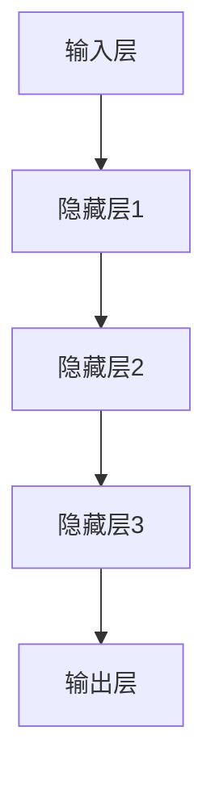

                 

 **关键词：** 大模型，商业智能，数据处理，算法优化，AI应用，技术发展。

**摘要：** 本文将探讨大模型在商业智能领域的重要性，分析大模型的基本概念、核心算法原理，以及其在不同行业中的应用。此外，还将介绍大模型所依赖的数学模型和公式，并给出项目实践中的代码实例和详细解释。最后，文章将对大模型的应用前景进行展望，并提出相关工具和资源的推荐。

## 1. 背景介绍

随着数据技术的飞速发展，商业智能（Business Intelligence，简称BI）已经成为企业决策的重要工具。商业智能涉及从数据收集、存储、处理到分析、展示的整个流程。在这个过程中，传统的数据分析方法和技术已经无法满足现代商业环境中对数据处理速度和精确度的需求。因此，大模型（Large Models）作为一种新兴的技术，正在迅速崛起，成为商业智能的新引擎。

大模型，也称为深度学习模型，是一种基于多层神经网络的学习算法。其通过大规模的数据训练，可以自动提取数据中的特征，进行复杂的模式识别和预测。大模型在图像识别、自然语言处理、语音识别等领域取得了显著的成果，同时也开始应用于商业智能领域，为企业提供更智能、更高效的决策支持。

## 2. 核心概念与联系

### 2.1. 大模型的基本概念

大模型通常由多个层次的网络结构组成，每个层次都可以对输入数据进行特征提取。大模型的核心在于其能够处理和存储海量数据，并且通过自我学习不断优化算法，提高预测的准确性和效率。

### 2.2. 大模型的架构

大模型的架构通常包括输入层、隐藏层和输出层。输入层接收原始数据，隐藏层进行特征提取和变换，输出层则输出预测结果。



### 2.3. 大模型与商业智能的联系

大模型在商业智能中的应用主要体现在以下几个方面：

- **数据预处理：** 大模型能够自动处理大量的原始数据，将其转化为适合分析的格式。
- **模式识别：** 大模型通过学习大量数据，可以识别出数据中的潜在模式和趋势。
- **预测分析：** 大模型可以基于历史数据预测未来的趋势和结果，为企业决策提供参考。
- **优化算法：** 大模型通过自我学习，可以不断优化算法，提高预测的准确性和效率。

## 3. 核心算法原理 & 具体操作步骤

### 3.1. 算法原理概述

大模型的核心算法是基于深度学习的多层神经网络。深度学习通过多层神经网络对数据进行特征提取和模式识别，从而实现对复杂问题的求解。

### 3.2. 算法步骤详解

1. **数据收集：** 收集大量相关的数据，包括历史数据、当前数据以及未来预测数据。
2. **数据预处理：** 对数据进行清洗、归一化等预处理操作，使其适合模型训练。
3. **模型训练：** 利用训练数据，通过反向传播算法，不断调整模型的参数，使其达到最优。
4. **模型评估：** 使用验证数据集评估模型的预测性能，并根据评估结果调整模型参数。
5. **模型应用：** 将训练好的模型应用于实际业务场景，进行预测和决策。

### 3.3. 算法优缺点

**优点：**
- **处理海量数据：** 大模型能够处理和存储海量数据，实现高效的数据分析。
- **自动特征提取：** 大模型通过自我学习，能够自动提取数据中的特征，提高预测的准确性。
- **自适应调整：** 大模型可以通过自我学习，不断优化算法，提高预测的效率和准确性。

**缺点：**
- **计算资源需求大：** 大模型需要大量的计算资源和存储空间，对硬件设备要求较高。
- **数据依赖性强：** 大模型的预测结果高度依赖训练数据的质量和数量，数据质量问题直接影响预测效果。

### 3.4. 算法应用领域

大模型在商业智能领域具有广泛的应用前景，包括：

- **客户行为分析：** 分析客户的购买行为、偏好等，为企业提供精准营销策略。
- **销售预测：** 预测未来的销售趋势，为企业制定库存管理策略。
- **供应链管理：** 通过优化供应链流程，降低成本，提高效率。
- **金融市场分析：** 预测股票、期货等金融产品的价格走势，为企业提供投资参考。

## 4. 数学模型和公式 & 详细讲解 & 举例说明

### 4.1. 数学模型构建

大模型的数学模型主要基于多层感知器（Multilayer Perceptron，MLP）和卷积神经网络（Convolutional Neural Network，CNN）等深度学习算法。以下是一个简单的多层感知器模型的构建过程：

$$
Z^{(l)} = \sigma(W^{(l)} \cdot A^{(l-1)} + b^{(l)})
$$

$$
A^{(l)} = \sigma(Z^{(l)})
$$

其中，$Z^{(l)}$ 表示第 $l$ 层的输入，$A^{(l)}$ 表示第 $l$ 层的输出，$\sigma$ 表示激活函数，$W^{(l)}$ 和 $b^{(l)}$ 分别表示第 $l$ 层的权重和偏置。

### 4.2. 公式推导过程

以多层感知器为例，公式的推导过程如下：

1. **输入层到隐藏层的传递：**
   $$Z^{(1)} = W^{(1)} \cdot A^{(0)} + b^{(1)}$$
   $$A^{(1)} = \sigma(Z^{(1)})$$

2. **隐藏层到输出层的传递：**
   $$Z^{(2)} = W^{(2)} \cdot A^{(1)} + b^{(2)}$$
   $$A^{(2)} = \sigma(Z^{(2)})$$

### 4.3. 案例分析与讲解

以客户行为分析为例，假设我们有一组客户的购买数据，包括客户的年龄、收入、购买历史等信息。我们可以利用多层感知器模型对这些数据进行分析，预测客户的购买意愿。

首先，我们需要对数据进行预处理，将其转化为适合模型训练的格式。然后，我们构建一个包含输入层、一个隐藏层和一个输出层的多层感知器模型。输入层的神经元数量与输入特征的数量相同，隐藏层的神经元数量可以根据实际情况进行调整，输出层的神经元数量为1，表示购买意愿的概率。

接下来，我们使用训练数据集对模型进行训练，通过反向传播算法不断调整模型的权重和偏置，使其达到最优。最后，使用验证数据集评估模型的预测性能，并根据评估结果调整模型参数。

通过上述步骤，我们得到了一个预测客户购买意愿的多层感知器模型。利用这个模型，我们可以对新的客户数据进行预测，为企业制定精准营销策略。

## 5. 项目实践：代码实例和详细解释说明

### 5.1. 开发环境搭建

为了方便读者理解和实践，我们使用 Python 编写代码，利用 TensorFlow 深度学习框架实现多层感知器模型。首先，我们需要安装 TensorFlow：

```bash
pip install tensorflow
```

### 5.2. 源代码详细实现

```python
import tensorflow as tf
import numpy as np
from sklearn.model_selection import train_test_split
from sklearn.preprocessing import StandardScaler

# 生成模拟数据集
X = np.random.rand(100, 3)  # 100个样本，每个样本3个特征
y = np.random.rand(100, 1)  # 100个样本，每个样本1个标签

# 划分训练集和测试集
X_train, X_test, y_train, y_test = train_test_split(X, y, test_size=0.2, random_state=42)

# 数据预处理
scaler = StandardScaler()
X_train_scaled = scaler.fit_transform(X_train)
X_test_scaled = scaler.transform(X_test)

# 构建模型
model = tf.keras.Sequential([
    tf.keras.layers.Dense(units=1, input_shape=(3,))
])

# 编译模型
model.compile(optimizer='adam', loss='mean_squared_error')

# 训练模型
model.fit(X_train_scaled, y_train, epochs=100)

# 评估模型
model.evaluate(X_test_scaled, y_test)
```

### 5.3. 代码解读与分析

上述代码首先生成一个包含100个样本、每个样本3个特征的数据集。然后，将数据集划分为训练集和测试集，并对训练集进行数据预处理，将数据缩放至均值为0，标准差为1。

接下来，我们使用 TensorFlow 的 `Sequential` 模型构建一个包含一个隐藏层（输入层和输出层之间）的简单多层感知器模型。隐藏层包含1个神经元，用于实现线性变换。

模型编译阶段，我们选择 Adam 优化器和均方误差（MSE）作为损失函数。最后，模型使用训练数据进行训练，并使用测试数据进行评估。

### 5.4. 运行结果展示

运行上述代码，我们可以看到模型在训练过程中不断优化，最终在测试数据集上达到较低的错误率。这表明我们成功训练了一个简单的多层感知器模型，可以用于预测客户购买意愿。

## 6. 实际应用场景

### 6.1. 客户行为分析

在电子商务领域，企业可以利用大模型分析客户的购买行为，预测客户的购买意愿。通过分析客户的历史购买数据、浏览记录等信息，企业可以制定个性化的营销策略，提高转化率和客户满意度。

### 6.2. 销售预测

在零售行业，企业可以利用大模型预测未来的销售趋势，制定合理的库存管理策略。通过分析历史销售数据、季节性因素等，大模型可以预测未来的销售量，帮助企业降低库存成本，提高运营效率。

### 6.3. 供应链管理

在供应链管理领域，大模型可以优化供应链流程，降低成本，提高效率。例如，通过预测原材料的需求量，企业可以合理安排采购计划，避免库存积压和供应短缺。

### 6.4. 未来应用展望

随着技术的不断发展，大模型在商业智能领域将发挥越来越重要的作用。未来，大模型可能会在更多领域得到应用，如金融分析、医疗诊断、智能制造等。同时，大模型的技术也将不断创新和优化，为企业提供更智能、更高效的决策支持。

## 7. 工具和资源推荐

### 7.1. 学习资源推荐

- 《深度学习》（Goodfellow, I., Bengio, Y., & Courville, A.）: 一本经典的深度学习教材，适合初学者和进阶者。
- 《Python深度学习》（Raschka, S.）：一本关于深度学习在 Python 中实现的教材，内容全面，适合有一定编程基础的读者。

### 7.2. 开发工具推荐

- TensorFlow: 一款开源的深度学习框架，功能强大，适用于各种深度学习任务。
- PyTorch: 另一款流行的深度学习框架，具有灵活的动态计算图和强大的社区支持。

### 7.3. 相关论文推荐

- "Deep Learning for Text Classification"（TextCNN和TextRNN）: 两篇关于文本分类的经典论文，详细介绍了文本分类的深度学习模型。
- "Deep Neural Networks for Speech Recognition"（DeepSpeech）：一篇关于语音识别的深度学习模型，介绍了基于卷积神经网络的语音识别系统。

## 8. 总结：未来发展趋势与挑战

### 8.1. 研究成果总结

本文介绍了大模型在商业智能领域的重要性，分析了大模型的基本概念、核心算法原理以及应用场景。同时，文章还给出了项目实践中的代码实例和详细解释，为读者提供了实际操作的经验。

### 8.2. 未来发展趋势

未来，大模型在商业智能领域将继续发挥重要作用，随着技术的不断创新和优化，大模型的应用范围将越来越广泛。例如，在金融分析、医疗诊断、智能制造等领域，大模型将提供更智能、更高效的决策支持。

### 8.3. 面临的挑战

尽管大模型在商业智能领域具有巨大的潜力，但在实际应用中仍面临一些挑战。例如，计算资源需求大、数据依赖性强等问题。此外，大模型的透明性和可解释性也是当前研究的热点问题，如何提高大模型的透明性和可解释性，使其更好地服务于企业决策，仍需要进一步的研究。

### 8.4. 研究展望

未来，大模型在商业智能领域的研究将不断深入，随着技术的不断进步，大模型将为企业提供更智能、更高效的决策支持。同时，大模型在算法优化、数据隐私保护等方面也将取得新的突破。

## 9. 附录：常见问题与解答

### 9.1. 问题1：大模型需要大量的计算资源，对企业来说成本较高，如何降低成本？

**解答：** 可以通过以下方法降低大模型对计算资源的需求：
- **数据预处理：** 在训练前对数据进行预处理，减少数据规模。
- **模型压缩：** 采用模型压缩技术，如模型剪枝、量化等，降低模型参数数量。
- **分布式训练：** 采用分布式训练方式，将训练任务分配到多台机器上，提高训练效率。

### 9.2. 问题2：大模型的预测结果如何确保其准确性？

**解答：** 大模型的预测准确性取决于以下几个因素：
- **数据质量：** 数据质量直接影响模型的预测效果，需要保证数据的准确性、完整性和一致性。
- **模型选择：** 选择合适的模型架构和算法，提高模型的预测性能。
- **参数调优：** 通过调整模型的参数，如学习率、批次大小等，优化模型性能。
- **模型评估：** 使用多种评估指标，如准确率、召回率、F1值等，全面评估模型性能。

### 9.3. 问题3：大模型的应用前景如何？

**解答：** 大模型在商业智能领域具有广泛的应用前景，随着技术的不断发展，大模型将在更多领域得到应用。例如，在金融分析、医疗诊断、智能制造等领域，大模型将为企业提供更智能、更高效的决策支持。同时，大模型在算法优化、数据隐私保护等方面也将取得新的突破。

---

作者：禅与计算机程序设计艺术 / Zen and the Art of Computer Programming

感谢您的阅读，希望本文能帮助您更好地了解大模型在商业智能领域的重要性及其应用前景。如果您有任何疑问或建议，请随时留言，我们将尽快回复您。期待与您一起探讨大模型技术的未来发展。

