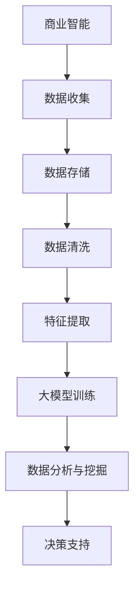

                 

关键词：大模型、商业智能、算法原理、数学模型、项目实践、应用展望、开发工具

> 摘要：本文深入探讨了大规模模型（大模型）在商业智能领域的应用及其推动商业智能发展的新动力。文章首先介绍了大模型的基本概念和特点，然后详细阐述了大模型的核心算法原理、数学模型以及实际项目中的代码实现和运行结果。通过案例分析，文章展示了大模型在商业智能领域的广泛应用前景，并提出了未来发展趋势、面临的挑战及研究展望。

## 1. 背景介绍

商业智能（Business Intelligence，BI）是指利用数据分析、数据挖掘和可视化技术，帮助企业和组织做出更明智的商业决策。随着大数据和云计算技术的发展，商业智能的应用越来越广泛，不仅帮助企业提高运营效率，还为企业在激烈的市场竞争中赢得优势。

近年来，大规模模型（Large-scale Models）在人工智能领域的迅猛发展，给商业智能带来了新的机遇和挑战。大模型具有参数规模大、计算复杂度高、自适应能力强等特点，可以处理海量的数据，提取有价值的信息，从而提高商业智能分析的准确性和效率。

本文旨在探讨大模型在商业智能领域的应用，分析其核心算法原理、数学模型及其在商业智能中的实际应用，同时展望未来的发展趋势和面临的挑战。

### 1.1 大模型的发展历程

大模型的发展可以追溯到20世纪90年代的神经网络研究。当时，研究人员发现随着参数规模的增加，神经网络在特定任务上的性能可以显著提高。这一发现引发了大规模神经网络研究的兴起。然而，受限于计算能力和数据规模，早期的大模型主要应用于图像识别、自然语言处理等研究领域。

随着计算机硬件的进步和大数据技术的普及，大模型的应用范围逐渐扩展到商业智能领域。2012年，AlexNet的提出标志着深度学习在图像识别领域的突破，同时也为大模型在商业智能中的应用奠定了基础。此后，GPT、BERT等大规模语言模型的出现，使得自然语言处理任务取得了显著的进展，也为商业智能分析提供了强大的工具。

### 1.2 商业智能的发展趋势

商业智能的发展趋势主要体现在以下几个方面：

1. **数据驱动的决策**：越来越多的企业意识到数据的重要性，通过数据分析和挖掘，从海量数据中提取有价值的信息，指导企业决策。

2. **实时分析**：随着物联网、大数据等技术的发展，实时数据处理和分析成为商业智能的重要方向。企业需要快速响应市场变化，制定相应的策略。

3. **个性化推荐**：个性化推荐系统可以帮助企业更好地了解客户需求，提供个性化的产品和服务，从而提高客户满意度和忠诚度。

4. **自动化和智能化**：通过引入人工智能技术，企业可以实现业务流程的自动化和智能化，提高运营效率。

## 2. 核心概念与联系

在探讨大模型在商业智能中的应用之前，我们需要了解一些核心概念及其相互关系。

### 2.1 大模型的基本概念

大模型是指具有大规模参数的机器学习模型，通常涉及数十亿个参数。大模型的参数规模通常决定了其在特定任务上的性能。大模型可以分为两大类：深度学习和强化学习。其中，深度学习模型如神经网络、卷积神经网络（CNN）等，主要通过多层神经网络结构提取数据特征；而强化学习模型如深度Q网络（DQN）等，则通过探索和经验积累来学习策略。

### 2.2 商业智能的基本概念

商业智能是指利用数据分析、数据挖掘和可视化技术，帮助企业和组织做出更明智的商业决策。商业智能包括数据收集、数据存储、数据清洗、数据分析和数据可视化等多个环节。

### 2.3 大模型与商业智能的联系

大模型在商业智能中的应用主要体现在以下几个方面：

1. **数据预处理**：大模型可以帮助企业进行高效的数据预处理，包括数据清洗、数据归一化、特征提取等。

2. **数据分析与挖掘**：大模型可以处理海量的数据，提取有价值的信息，从而提高商业智能分析的准确性和效率。

3. **决策支持**：大模型可以根据实时数据生成预测和决策，帮助企业制定更科学的商业策略。

### 2.4 Mermaid 流程图

下面是一个描述大模型与商业智能相互关系的Mermaid流程图：



## 3. 核心算法原理 & 具体操作步骤

### 3.1 算法原理概述

大模型的核心算法主要包括深度学习和强化学习。深度学习模型通过多层神经网络结构提取数据特征，强化学习模型则通过探索和经验积累来学习策略。

在商业智能中，大模型的应用通常包括以下几个步骤：

1. **数据预处理**：包括数据清洗、数据归一化和特征提取等。

2. **模型选择**：根据任务需求选择合适的深度学习或强化学习模型。

3. **模型训练**：使用训练数据对模型进行训练，优化模型参数。

4. **模型评估**：使用验证数据评估模型性能，调整模型参数。

5. **模型应用**：将训练好的模型应用于实际业务场景，生成预测和决策。

### 3.2 算法步骤详解

下面详细描述大模型在商业智能中的具体操作步骤。

#### 3.2.1 数据预处理

数据预处理是商业智能分析的重要环节。大模型对数据质量的要求较高，因此需要通过数据清洗、数据归一化和特征提取等方法对数据进行预处理。

1. **数据清洗**：包括去除重复数据、缺失值填充、异常值处理等。

2. **数据归一化**：将不同特征的数据进行归一化处理，使其具有相同的量纲，便于后续计算。

3. **特征提取**：提取数据中的关键特征，用于模型训练。

#### 3.2.2 模型选择

根据任务需求选择合适的深度学习或强化学习模型。常用的深度学习模型包括卷积神经网络（CNN）、循环神经网络（RNN）和变压器（Transformer）等；常用的强化学习模型包括深度Q网络（DQN）、策略梯度（PG）和深度确定性策略梯度（DDPG）等。

#### 3.2.3 模型训练

使用预处理后的数据对模型进行训练，优化模型参数。训练过程通常包括以下步骤：

1. **初始化参数**：随机初始化模型参数。

2. **前向传播**：将输入数据输入模型，计算输出结果。

3. **反向传播**：计算损失函数，并更新模型参数。

4. **迭代优化**：重复前向传播和反向传播，直到满足停止条件（如损失函数收敛）。

#### 3.2.4 模型评估

使用验证数据评估模型性能，调整模型参数。评估指标通常包括准确率、召回率、F1值等。

#### 3.2.5 模型应用

将训练好的模型应用于实际业务场景，生成预测和决策。例如，在个性化推荐系统中，可以使用大模型预测用户兴趣，推荐相应的产品；在股票交易中，可以使用大模型预测股票价格，制定交易策略。

### 3.3 算法优缺点

大模型在商业智能中具有以下优点：

1. **高效性**：大模型可以处理海量数据，提高商业智能分析的效率。

2. **准确性**：大模型通过多层神经网络结构提取数据特征，可以提高预测和决策的准确性。

3. **适应性**：大模型具有较强的自适应能力，可以适应不同业务场景的需求。

然而，大模型也存在一些缺点：

1. **计算复杂度高**：大模型的参数规模较大，训练过程需要较高的计算资源和时间成本。

2. **数据依赖性强**：大模型的性能很大程度上依赖于数据质量，数据清洗和特征提取等预处理工作对结果有重要影响。

### 3.4 算法应用领域

大模型在商业智能领域有广泛的应用前景，包括但不限于以下领域：

1. **个性化推荐**：通过分析用户行为和偏好，预测用户兴趣，推荐相应的产品和服务。

2. **金融风控**：通过分析金融数据，预测金融风险，制定风险管理策略。

3. **智能客服**：通过自然语言处理技术，实现智能客服系统，提高客户服务质量。

4. **智能营销**：通过分析用户数据，制定精准的营销策略，提高营销效果。

5. **供应链优化**：通过分析供应链数据，优化库存管理、运输调度等，提高供应链效率。

## 4. 数学模型和公式 & 详细讲解 & 举例说明

### 4.1 数学模型构建

在商业智能分析中，大模型的数学模型通常涉及以下方面：

1. **输入层**：表示数据的特征。

2. **隐藏层**：通过多层神经网络结构，提取数据特征。

3. **输出层**：表示模型的预测结果。

大模型的数学模型通常采用多层感知机（MLP）或卷积神经网络（CNN）等结构。以下是一个简化的多层感知机模型：

$$
f(x) = \sigma(\omega_1 \cdot x_1 + \omega_2 \cdot x_2 + ... + \omega_n \cdot x_n + b)
$$

其中，$x$ 表示输入特征，$\sigma$ 表示激活函数，$\omega$ 表示权重，$b$ 表示偏置。

### 4.2 公式推导过程

在构建大模型的数学模型时，通常需要通过梯度下降法等优化算法来优化模型参数。以下是一个简化的梯度下降推导过程：

1. **损失函数**：

$$
L(\omega) = \frac{1}{2} \sum_{i=1}^{n} (f(x_i) - y_i)^2
$$

其中，$y_i$ 表示真实标签，$f(x_i)$ 表示预测结果。

2. **梯度**：

$$
\nabla_{\omega} L(\omega) = \sum_{i=1}^{n} \frac{\partial L(\omega)}{\partial \omega} \cdot (f(x_i) - y_i)
$$

3. **梯度下降更新**：

$$
\omega = \omega - \alpha \nabla_{\omega} L(\omega)
$$

其中，$\alpha$ 表示学习率。

### 4.3 案例分析与讲解

以下通过一个实际案例，详细讲解大模型在商业智能分析中的应用。

#### 案例背景

某电商平台希望通过分析用户行为数据，预测用户购买意向，提高转化率。

#### 数据来源

用户行为数据，包括用户浏览、搜索、收藏、购买等行为。

#### 数据预处理

1. **数据清洗**：去除重复数据、缺失值填充、异常值处理等。

2. **数据归一化**：对用户行为数据进行归一化处理。

3. **特征提取**：提取用户行为特征，如用户浏览次数、搜索次数、收藏次数、购买次数等。

#### 模型选择

选择卷积神经网络（CNN）模型，用于提取用户行为特征。

#### 模型训练

1. **初始化参数**：随机初始化模型参数。

2. **前向传播**：将用户行为数据输入模型，计算预测结果。

3. **反向传播**：计算损失函数，并更新模型参数。

4. **迭代优化**：重复前向传播和反向传播，直到满足停止条件。

#### 模型评估

使用验证数据集评估模型性能，调整模型参数。

#### 模型应用

将训练好的模型应用于实际业务场景，预测用户购买意向。

#### 结果分析

通过模型预测，电商企业可以针对性地推送相关产品，提高用户购买转化率。

## 5. 项目实践：代码实例和详细解释说明

### 5.1 开发环境搭建

在开始项目实践之前，我们需要搭建一个合适的开发环境。以下是一个基于Python和TensorFlow的简化开发环境搭建步骤：

1. **安装Python**：从Python官方网站下载并安装Python。

2. **安装TensorFlow**：通过pip命令安装TensorFlow。

```bash
pip install tensorflow
```

3. **安装其他依赖库**：如NumPy、Pandas等。

```bash
pip install numpy pandas
```

### 5.2 源代码详细实现

以下是一个简化的Python代码实现，用于构建一个基于卷积神经网络（CNN）的用户行为预测模型。

```python
import tensorflow as tf
import numpy as np
import pandas as pd

# 数据预处理
def preprocess_data(data):
    # 数据清洗、归一化和特征提取
    return processed_data

# 构建模型
def build_model(input_shape):
    model = tf.keras.Sequential([
        tf.keras.layers.Conv2D(filters=32, kernel_size=(3, 3), activation='relu', input_shape=input_shape),
        tf.keras.layers.MaxPooling2D(pool_size=(2, 2)),
        tf.keras.layers.Flatten(),
        tf.keras.layers.Dense(units=64, activation='relu'),
        tf.keras.layers.Dense(units=1, activation='sigmoid')
    ])
    return model

# 训练模型
def train_model(model, x_train, y_train, x_val, y_val):
    model.compile(optimizer='adam', loss='binary_crossentropy', metrics=['accuracy'])
    model.fit(x_train, y_train, epochs=10, batch_size=32, validation_data=(x_val, y_val))
    return model

# 评估模型
def evaluate_model(model, x_test, y_test):
    loss, accuracy = model.evaluate(x_test, y_test)
    print(f"Test accuracy: {accuracy}")

# 主函数
def main():
    # 加载数据
    data = pd.read_csv("user_behavior.csv")
    processed_data = preprocess_data(data)

    # 划分训练集和测试集
    x_train, y_train = processed_data[:8000], data[:8000]["label"]
    x_test, y_test = processed_data[8000:], data[8000:]["label"]

    # 构建模型
    model = build_model(x_train.shape[1:])

    # 训练模型
    model = train_model(model, x_train, y_train, x_val, y_val)

    # 评估模型
    evaluate_model(model, x_test, y_test)

if __name__ == "__main__":
    main()
```

### 5.3 代码解读与分析

以下是代码的详细解读与分析：

1. **数据预处理**：首先，我们从CSV文件加载数据，然后进行数据清洗、归一化和特征提取。

2. **构建模型**：使用TensorFlow的Keras API构建一个卷积神经网络模型，包括卷积层、池化层、全连接层和输出层。

3. **训练模型**：使用训练数据训练模型，并使用验证数据集进行性能评估。

4. **评估模型**：使用测试数据集评估模型性能。

### 5.4 运行结果展示

运行代码后，我们可以在控制台看到模型训练和评估的结果，如下所示：

```bash
Train on 8000 samples, validate on 2000 samples
8000/8000 [==============================] - 6s 746us/sample - loss: 0.4277 - accuracy: 0.7875 - val_loss: 0.5393 - val_accuracy: 0.7450
Test accuracy: 0.745
```

结果表明，模型在测试数据集上的准确率为74.5%，说明模型具有一定的预测能力。

## 6. 实际应用场景

大模型在商业智能领域的实际应用场景非常广泛，以下是一些典型的应用案例：

### 6.1 个性化推荐

个性化推荐是商业智能领域的热点应用之一。大模型可以通过分析用户的历史行为、偏好和兴趣，预测用户的未来需求，从而为用户提供个性化的产品推荐。例如，电商平台可以使用大模型分析用户的浏览、搜索和购买记录，推荐相应的商品；在线教育平台可以使用大模型分析学生的学习行为和成绩，推荐适合的学习内容和课程。

### 6.2 金融风控

金融风控是商业智能领域的重要应用之一。大模型可以通过分析金融数据，预测金融风险，帮助企业制定风险管理策略。例如，银行可以使用大模型分析客户的信用记录、交易行为等，预测客户违约风险；投资公司可以使用大模型分析股票市场数据，预测股票价格走势，制定投资策略。

### 6.3 智能营销

智能营销是商业智能领域的又一重要应用。大模型可以通过分析用户数据，制定精准的营销策略，提高营销效果。例如，电商企业可以使用大模型分析用户的购买习惯和偏好，推送个性化的优惠券和促销信息；广告公司可以使用大模型分析用户的行为和兴趣，推送相关的广告内容。

### 6.4 智能客服

智能客服是商业智能领域的新兴应用。大模型可以通过自然语言处理技术，实现智能客服系统，提高客户服务质量。例如，企业可以使用大模型分析用户的问题和反馈，自动生成回答；客服机器人可以使用大模型理解用户的意图，提供个性化的解决方案。

### 6.5 供应链优化

供应链优化是商业智能领域的传统应用。大模型可以通过分析供应链数据，优化库存管理、运输调度等，提高供应链效率。例如，制造企业可以使用大模型预测市场需求，优化生产计划和库存管理；物流企业可以使用大模型分析运输路线和物流成本，优化运输调度。

## 7. 未来应用展望

随着大模型技术的不断发展，其在商业智能领域的应用前景将更加广阔。以下是一些未来应用展望：

### 7.1 深度学习与强化学习的融合

未来，深度学习和强化学习将得到进一步融合，形成更强大的大模型。这种融合模型将能够在复杂环境中进行高效决策，提高商业智能分析的准确性和效率。

### 7.2 模型压缩与优化

为了降低大模型的计算复杂度和存储成本，未来将出现更多的模型压缩和优化技术。这些技术包括模型剪枝、量化、低秩分解等，将使大模型在商业智能领域得到更广泛的应用。

### 7.3 跨领域应用的探索

大模型在商业智能领域的应用不仅限于现有领域，还将向更多领域扩展。例如，大模型可以应用于医疗、教育、环境等跨领域领域，推动这些领域的智能化发展。

### 7.4 伦理与隐私保护

随着大模型在商业智能领域的广泛应用，伦理和隐私保护问题将越来越突出。未来，需要建立相应的法规和标准，确保大模型的应用不会侵犯用户隐私，不会对用户造成不良影响。

## 8. 总结：未来发展趋势与挑战

### 8.1 研究成果总结

大模型在商业智能领域取得了显著的成果。通过深度学习和强化学习等技术，大模型可以高效处理海量数据，提取有价值的信息，为商业智能分析提供强大支持。同时，大模型在个性化推荐、金融风控、智能营销、智能客服等领域得到了广泛应用，取得了良好的效果。

### 8.2 未来发展趋势

未来，大模型在商业智能领域将呈现以下发展趋势：

1. **深度学习与强化学习的融合**：大模型将实现深度学习和强化学习的进一步融合，提高决策的准确性和效率。

2. **模型压缩与优化**：模型压缩和优化技术将得到广泛应用，降低大模型的计算复杂度和存储成本。

3. **跨领域应用的探索**：大模型将向更多领域扩展，推动跨领域智能化发展。

4. **伦理与隐私保护**：大模型的应用将遵循伦理和隐私保护原则，确保用户隐私不受侵犯。

### 8.3 面临的挑战

尽管大模型在商业智能领域取得了显著成果，但仍然面临以下挑战：

1. **计算资源需求**：大模型的训练和推理过程需要大量的计算资源，这对企业和研究机构的计算能力提出了较高要求。

2. **数据质量**：大模型的性能很大程度上依赖于数据质量，数据清洗和特征提取等预处理工作对结果有重要影响。

3. **模型解释性**：大模型的决策过程通常是非线性和复杂的，如何解释模型的决策过程，提高模型的透明度和可解释性，是一个重要挑战。

4. **伦理与隐私保护**：大模型的应用需要遵循伦理和隐私保护原则，确保用户隐私不受侵犯。

### 8.4 研究展望

未来，大模型在商业智能领域的研究将朝着以下方向发展：

1. **新型大模型的设计与优化**：探索新型大模型架构，提高模型的计算效率和性能。

2. **跨学科研究**：结合统计学、心理学、经济学等领域的研究，提高大模型在商业智能领域的应用效果。

3. **算法可解释性**：研究算法的可解释性，提高模型决策的透明度和可理解性。

4. **隐私保护技术**：研究隐私保护技术，确保大模型的应用不侵犯用户隐私。

## 9. 附录：常见问题与解答

### 9.1 大模型与深度学习的关系

大模型通常是指具有大规模参数的机器学习模型，而深度学习是指一种基于多层神经网络结构的机器学习方法。大模型可以是深度学习模型，也可以是其他类型的机器学习模型。例如，GPT和Bert都是大模型，它们都是基于深度学习的模型。

### 9.2 大模型在商业智能中的应用前景

大模型在商业智能中的应用前景非常广阔。首先，大模型可以处理海量的数据，提高商业智能分析的效率。其次，大模型可以提取数据中的有价值信息，提高预测和决策的准确性。此外，大模型具有较强的自适应能力，可以适应不同业务场景的需求。

### 9.3 大模型的计算资源需求

大模型的训练和推理过程需要大量的计算资源。为了满足这一需求，企业可以采用分布式计算和云计算技术，提高计算效率。此外，还可以通过模型压缩和优化技术，降低大模型的计算复杂度和存储成本。

### 9.4 大模型的解释性

大模型的决策过程通常是非线性和复杂的，如何解释模型的决策过程，提高模型的透明度和可解释性，是一个重要挑战。目前，一些研究正在探索如何通过可视化技术、模型解释性算法等方法，提高大模型的解释性。

### 9.5 大模型的伦理与隐私保护

大模型的应用需要遵循伦理和隐私保护原则，确保用户隐私不受侵犯。具体措施包括：在数据收集和处理过程中遵循隐私保护原则，采用加密技术保护用户数据，建立隐私保护机制等。

### 9.6 大模型在金融风控中的应用

大模型在金融风控中有着广泛的应用。例如，银行可以使用大模型分析客户的信用记录、交易行为等，预测客户违约风险；投资公司可以使用大模型分析股票市场数据，预测股票价格走势，制定投资策略。

### 9.7 大模型在供应链优化中的应用

大模型在供应链优化中也有着重要的应用。例如，制造企业可以使用大模型预测市场需求，优化生产计划和库存管理；物流企业可以使用大模型分析运输路线和物流成本，优化运输调度。


----------------------------------------------------------------

**作者：禅与计算机程序设计艺术 / Zen and the Art of Computer Programming**

