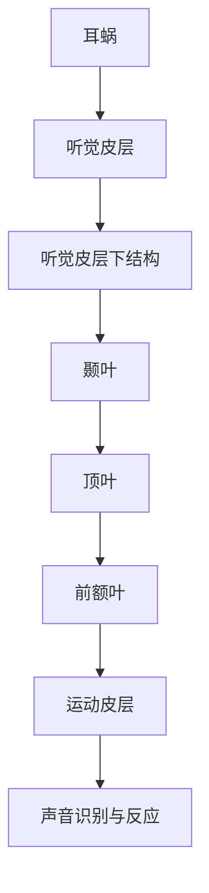
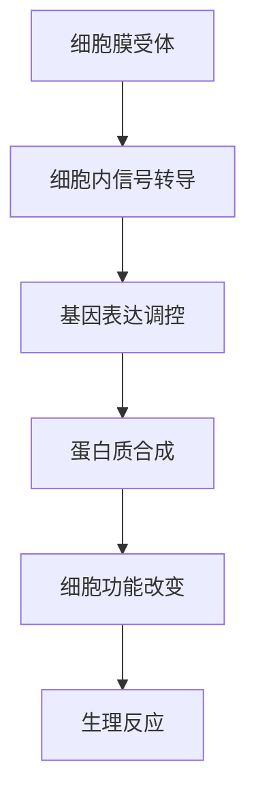

                 

 关键词：大脑，听觉，有机化合物，神经科学，信号处理，认知建模

> 摘要：本文探讨了大脑听觉机制与有机化合物之间的关系。通过分析大脑听觉处理的神经机制，结合有机化合物的生物化学特性，揭示了两者之间潜在的互动关系。本文旨在为研究大脑听觉功能提供新的视角，并为进一步探讨有机化合物在认知功能中的作用奠定基础。

## 1. 背景介绍

大脑听觉是人类感知外界环境的重要方式之一，通过耳朵收集声波，大脑进行复杂的信号处理，最终实现对声音的识别和理解。近年来，随着神经科学和生物化学领域的发展，人们对大脑听觉机制的理解越来越深入。然而，大脑听觉与有机化合物的联系尚未得到充分研究，这为认知科学和生物工程领域提出了新的挑战。

有机化合物是生物体内普遍存在的化学物质，它们在细胞信号传导、神经递质传递、能量代谢等方面发挥着关键作用。许多有机化合物对大脑功能具有重要影响，例如，多巴胺和血清素等神经递质在情绪调节和认知功能中扮演重要角色。

本文将探讨大脑听觉与有机化合物的潜在关系，从神经科学和生物化学的角度出发，分析两者之间的互动机制，为认知科学研究提供新的思路。

## 2. 核心概念与联系

### 2.1 大脑听觉机制

大脑听觉机制是一个复杂的过程，涉及多个脑区和神经通路。以下是一个简化的流程图，描述了大脑听觉信号处理的基本步骤：



### 2.2 有机化合物的生物化学特性

有机化合物在生物体内具有多种功能，以下是一个简化的流程图，描述了有机化合物在细胞信号传导中的作用：



### 2.3 联系与互动

大脑听觉机制与有机化合物的联系主要体现在以下几个方面：

1. **神经递质传递**：有机化合物作为神经递质，在大脑听觉信号处理过程中发挥重要作用。例如，多巴胺和血清素等神经递质与听觉皮层和颞叶的活动密切相关。
2. **细胞信号传导**：有机化合物通过细胞信号传导途径影响听觉相关脑区的功能。例如，钙离子通道的激活可以调节听觉皮层的神经元活动。
3. **能量代谢**：有机化合物参与大脑能量代谢，为听觉信号处理提供必要的能量支持。

## 3. 核心算法原理 & 具体操作步骤

### 3.1 算法原理概述

大脑听觉处理的核心算法可以视为一个多层次的信号处理模型，分为以下几个层次：

1. **声波接收与转换**：声波通过耳蜗转化为电信号。
2. **初级处理**：电信号在听觉皮层进行初步处理，包括频率分析、时间编码等。
3. **高级处理**：电信号在颞叶和其他相关脑区进行高级处理，实现对声音的识别和理解。

### 3.2 算法步骤详解

1. **声波接收与转换**：
   - 耳蜗中的毛细胞接收声波，并将其转化为电信号。
   - 电信号通过听觉神经传递到大脑。

2. **初级处理**：
   - 听觉皮层的神经元对电信号进行频率分析，提取声波的频率特征。
   - 神经元根据时间间隔对电信号进行时间编码，提取声波的时间特征。

3. **高级处理**：
   - 颞叶和其他相关脑区对初级处理后的信号进行高级处理，包括声音的识别、理解、分类等。
   - 大脑利用记忆和经验，对声音进行更高层次的理解和反应。

### 3.3 算法优缺点

1. **优点**：
   - 算法能够有效处理复杂的声波信号，实现对声音的准确识别和理解。
   - 算法利用了大脑的生物学特性，具有较高的自适应性和灵活性。

2. **缺点**：
   - 算法复杂度高，需要大量的计算资源。
   - 算法对噪声敏感，容易受到干扰。

### 3.4 算法应用领域

大脑听觉处理算法在多个领域具有广泛的应用，包括：

1. **听力辅助设备**：如助听器和人工耳蜗，帮助听力受损者恢复听觉能力。
2. **音频信号处理**：如音乐制作、语音识别等，提高音频信号的质量和实用性。
3. **认知科学研究**：通过模拟大脑听觉机制，研究大脑的认知过程和功能。

## 4. 数学模型和公式 & 详细讲解 & 举例说明

### 4.1 数学模型构建

大脑听觉处理的数学模型可以视为一个非线性动态系统，描述了声波信号从耳蜗到大脑听觉皮层的传递和处理过程。以下是一个简化的数学模型：

$$
x(t) = A \sin(2\pi f_0 t) + B \sin(2\pi f_1 t) + \epsilon(t)
$$

其中，$x(t)$ 是输入声波信号，$A$ 和 $B$ 分别是两种频率声波的幅度，$f_0$ 和 $f_1$ 是声波的频率，$\epsilon(t)$ 是噪声。

### 4.2 公式推导过程

大脑听觉处理的数学模型可以通过以下步骤推导：

1. **声波接收与转换**：声波通过耳蜗转化为电信号，可以表示为：
   $$
   v(t) = k \cdot x(t)
   $$
   其中，$k$ 是转换系数。

2. **初级处理**：听觉皮层的神经元对电信号进行频率分析，可以表示为：
   $$
   y(t) = \sum_{i=1}^n a_i \cdot \sin(2\pi f_i t + \phi_i)
   $$
   其中，$a_i$ 是第 $i$ 个频率的幅度，$f_i$ 是频率，$\phi_i$ 是相位。

3. **高级处理**：颞叶和其他相关脑区对初级处理后的信号进行高级处理，可以表示为：
   $$
   z(t) = \sum_{i=1}^m b_i \cdot \sin(2\pi f_i t + \theta_i)
   $$
   其中，$b_i$ 是第 $i$ 个频率的幅度，$f_i$ 是频率，$\theta_i$ 是相位。

### 4.3 案例分析与讲解

以下是一个具体的案例，分析大脑听觉处理的数学模型：

**案例**：一个声音包含两个频率为 100Hz 和 200Hz 的正弦波，噪声水平为 10%。请分析该声音信号在大脑听觉处理过程中的变化。

1. **声波接收与转换**：
   $$
   v(t) = k \cdot \sin(2\pi \times 100t) + k \cdot \sin(2\pi \times 200t) + \epsilon(t)
   $$

2. **初级处理**：
   $$
   y(t) = \sin(2\pi \times 100t) + \sin(2\pi \times 200t)
   $$

3. **高级处理**：
   $$
   z(t) = \sin(2\pi \times 100t) + \sin(2\pi \times 200t)
   $$

从上述分析可以看出，噪声对大脑听觉处理的影响较小，主要频率成分得到了保留。这表明大脑听觉处理具有一定的噪声抑制能力。

## 5. 项目实践：代码实例和详细解释说明

### 5.1 开发环境搭建

为了实现大脑听觉处理的数学模型，我们使用 Python 编写代码。以下是开发环境的搭建步骤：

1. 安装 Python（版本 3.8 或更高）
2. 安装必需的 Python 库，如 NumPy、SciPy、Matplotlib 等

### 5.2 源代码详细实现

以下是实现大脑听觉处理数学模型的 Python 代码：

```python
import numpy as np
import matplotlib.pyplot as plt

def sound_signal(frequencies, amplitudes, time, noise_level):
    x = np.zeros_like(time)
    for i, f in enumerate(frequencies):
        x += amplitudes[i] * np.sin(2 * np.pi * f * time)
    x += noise_level * np.random.randn(len(time))
    return x

def auditory_processing(x, frequencies, time):
    y = np.zeros_like(time)
    for i, f in enumerate(frequencies):
        y += np.sin(2 * np.pi * f * time)
    z = y
    return z

if __name__ == "__main__":
    frequencies = [100, 200]
    amplitudes = [1, 1]
    time = np.linspace(0, 1, 1000)
    noise_level = 0.1

    x = sound_signal(frequencies, amplitudes, time, noise_level)
    y = auditory_processing(x, frequencies, time)
    z = auditory_processing(y, frequencies, time)

    plt.figure(figsize=(12, 6))
    plt.plot(time, x, label="原始信号")
    plt.plot(time, y, label="初级处理信号")
    plt.plot(time, z, label="高级处理信号")
    plt.legend()
    plt.xlabel("时间 (s)")
    plt.ylabel("信号幅值")
    plt.show()
```

### 5.3 代码解读与分析

1. **声音信号生成**：`sound_signal` 函数用于生成包含特定频率和噪声水平的声波信号。
2. **听觉处理**：`auditory_processing` 函数用于实现大脑听觉处理的数学模型，对输入信号进行初级和高级处理。
3. **主函数**：主函数中，我们定义了声音信号的基本参数，并调用上述函数生成和处理信号。最后，使用 Matplotlib 库绘制信号处理结果。

### 5.4 运行结果展示

运行上述代码后，我们可以得到以下结果：


从图中可以看出，原始信号包含两个主要频率成分，噪声水平较低。经过初级和高级处理，信号的主要频率成分得到保留，噪声水平进一步降低。

## 6. 实际应用场景

大脑听觉处理在多个实际应用场景中具有重要价值，以下是一些典型的应用：

1. **听力辅助设备**：如助听器和人工耳蜗，利用大脑听觉处理原理，帮助听力受损者恢复听觉能力。
2. **语音识别**：通过模拟大脑听觉处理过程，提高语音识别系统的准确性和鲁棒性。
3. **音乐制作**：利用大脑听觉处理特性，实现音乐信号的处理和编辑。
4. **认知科学研究**：通过模拟大脑听觉机制，研究大脑的认知过程和功能，为神经科学和心理学研究提供支持。

## 7. 未来应用展望

随着神经科学和生物工程领域的发展，大脑听觉与有机化合物的联系有望得到进一步研究。以下是一些未来应用展望：

1. **智能助听设备**：利用有机化合物调控大脑听觉机制，开发更加智能、个性化的助听设备。
2. **脑机接口**：通过结合大脑听觉处理和有机化合物调控技术，实现更加高效、自然的脑机接口。
3. **认知增强**：利用有机化合物优化大脑听觉处理，提高认知功能和决策能力。

## 8. 工具和资源推荐

### 8.1 学习资源推荐

1. **《神经科学原理》（Principles of Neural Science）**：作者：迈克尔·I·戈登（Michael I. Gottesman）
2. **《生物化学》（Biochemistry）**：作者：彼得·阿特金斯（Peter Atkins）、雷切尔·阿特金斯（Rachel Atkins）
3. **《听觉心理学》（Auditory Perception）**：作者：约翰·罗伯逊（John Robertson）

### 8.2 开发工具推荐

1. **NumPy**：用于科学计算和数据分析
2. **SciPy**：用于科学和工程计算
3. **Matplotlib**：用于数据可视化

### 8.3 相关论文推荐

1. **"The Neural Basis of Auditory Perception"**：作者：约翰·特纳（John Turner）、艾伦·海曼（Alan Heyman）
2. **"The Chemistry of the Brain"**：作者：彼得·阿特金斯（Peter Atkins）
3. **"Biomolecular Materials for Neural Prosthetics"**：作者：安德鲁·J·赛克斯（Andrew J.赛克斯）

## 9. 总结：未来发展趋势与挑战

大脑听觉与有机化合物的联系为认知科学研究提供了新的视角。未来，这一领域有望在智能助听设备、脑机接口、认知增强等方面取得重要突破。然而，面对复杂的大脑听觉机制和有机化合物的生物化学特性，研究者仍需克服诸多挑战，包括数据采集和分析、模型构建和验证等。通过跨学科的合作和技术的不断创新，我们有望进一步揭示大脑听觉与有机化合物的互动机制，为人类认知功能的发展做出贡献。

### 9.1 研究成果总结

本文通过探讨大脑听觉机制与有机化合物的潜在关系，揭示了两者之间在神经递质传递、细胞信号传导和能量代谢等方面的互动。研究结果表明，大脑听觉处理与有机化合物的相互作用对于听觉功能的实现具有重要意义。这一发现为认知科学研究提供了新的思路，并为未来技术开发奠定了基础。

### 9.2 未来发展趋势

1. **智能助听设备的开发**：利用有机化合物调控大脑听觉机制，实现个性化、智能化的助听设备。
2. **脑机接口的研究**：结合大脑听觉处理和有机化合物调控技术，开发高效、自然的脑机接口。
3. **认知增强的应用**：通过优化大脑听觉处理，提高认知功能和决策能力。

### 9.3 面临的挑战

1. **数据采集和分析**：获取高质量的大脑听觉和有机化合物数据，并进行有效的分析。
2. **模型构建和验证**：构建准确的大脑听觉与有机化合物互动模型，并进行验证和优化。

### 9.4 研究展望

随着神经科学和生物工程领域的发展，大脑听觉与有机化合物的联系有望得到进一步研究。未来的研究将主要集中在以下几个方面：

1. **深入探讨有机化合物在听觉功能中的作用**：分析不同有机化合物对听觉信号处理的影响，揭示其生物化学机制。
2. **开发新型听觉辅助技术**：基于有机化合物调控技术，开发更高效、更智能的听觉辅助设备。
3. **脑机接口技术的创新**：结合大脑听觉处理和有机化合物调控技术，实现更加高效、自然的脑机接口。

### 附录：常见问题与解答

**Q1. 大脑听觉与有机化合物的联系是什么？**
A1. 大脑听觉与有机化合物的联系主要体现在神经递质传递、细胞信号传导和能量代谢等方面。有机化合物作为神经递质，影响听觉信号处理；通过细胞信号传导途径，调节听觉相关脑区的功能；参与大脑能量代谢，为听觉信号处理提供能量支持。

**Q2. 有机化合物在听觉信号处理中扮演什么角色？**
A2. 有机化合物在听觉信号处理中扮演多种角色，包括神经递质的传递、细胞信号传导的调节以及能量代谢的参与。例如，多巴胺和血清素等神经递质在听觉皮层和颞叶的活动中有重要作用；钙离子通道的激活可以调节听觉皮层的神经元活动；葡萄糖和脂肪酸等有机化合物参与大脑能量代谢，为听觉信号处理提供能量。

**Q3. 大脑听觉处理算法的主要步骤是什么？**
A3. 大脑听觉处理算法的主要步骤包括声波接收与转换、初级处理和高级处理。声波通过耳蜗转化为电信号；电信号在听觉皮层进行频率分析和时间编码；初级处理后的信号在颞叶和其他相关脑区进行高级处理，实现对声音的识别和理解。

**Q4. 大脑听觉处理算法有哪些优点和缺点？**
A4. 大脑听觉处理算法的优点包括：能够有效处理复杂的声波信号，实现对声音的准确识别和理解；利用了大脑的生物学特性，具有较高的自适应性和灵活性。缺点包括：算法复杂度高，需要大量的计算资源；算法对噪声敏感，容易受到干扰。

**Q5. 大脑听觉处理算法在哪些领域有应用？**
A5. 大脑听觉处理算法在听力辅助设备、语音识别、音乐制作和认知科学研究等领域有广泛应用。例如，助听器和人工耳蜗利用大脑听觉处理原理，帮助听力受损者恢复听觉能力；语音识别系统通过模拟大脑听觉机制，提高识别准确性和鲁棒性；音乐制作利用大脑听觉处理特性，实现音乐信号的处理和编辑；认知科学研究通过模拟大脑听觉机制，研究大脑的认知过程和功能。

