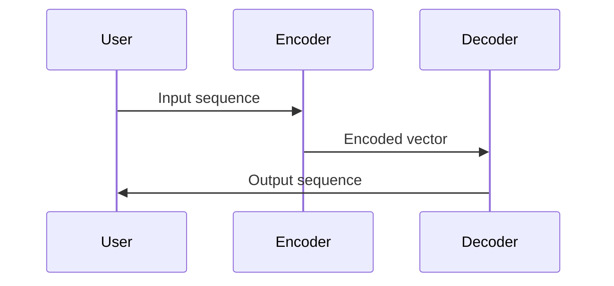
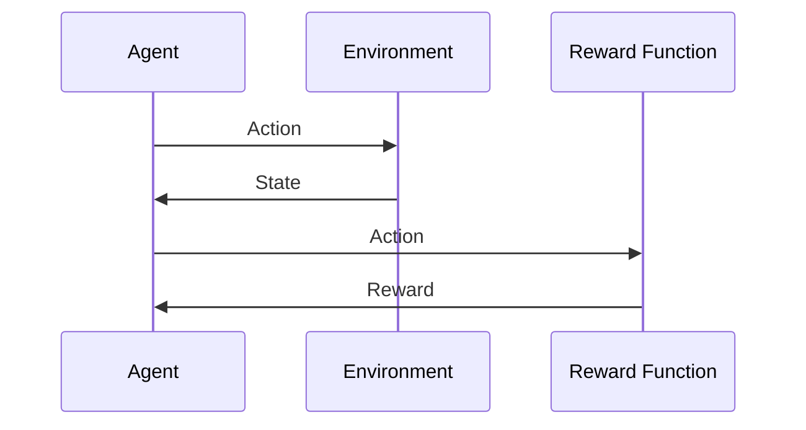

                 

在当今数字化时代，大规模语言模型已经成为了自然语言处理（NLP）领域的核心驱动力。从简单的词袋模型（Bag of Words, BoW）到复杂的深度学习模型，如 Transformer 和 GPT，语言模型的演进极大地推动了人工智能（AI）的发展。本文旨在探讨大规模语言模型中两个关键方面：序列到序列（Sequence-to-Sequence, SFT）模型和基于强化学习的模型（Reinforcement Learning, RL）模型。我们将深入分析这些模型的基本原理、评估方法，并探讨它们在实际应用中的表现。

## 文章关键词

- 大规模语言模型
- 序列到序列模型
- 强化学习模型
- 评估方法
- 自然语言处理

## 文章摘要

本文将探讨大规模语言模型中的两个重要分支：SFT模型和RL模型。首先，我们将介绍这些模型的基本原理，包括它们的优缺点和应用场景。接着，我们将讨论常用的评估方法，并通过数学模型和公式来推导这些评估方法的原理。随后，我们将通过代码实例详细解释这些模型的实现过程，并展示其实际运行结果。最后，我们将讨论这些模型在实际应用中的表现，并提出未来发展的展望。

## 1. 背景介绍

### 大规模语言模型的发展历程

大规模语言模型的发展可以追溯到20世纪90年代，当时词袋模型（BoW）和朴素贝叶斯分类器（Naive Bayes）成为NLP领域的常用工具。随着计算机硬件和算法的进步，尤其是深度学习技术的崛起，语言模型得到了极大的提升。2003年，Gaussian Naive Bayes被改进为Linear Discriminant Analysis（LDA），使得文本分类的准确性得到了显著提高。然而，LDA模型在处理长文本和长序列时仍然存在局限。

2013年，序列到序列（SFT）模型的出现为NLP领域带来了革命性的变化。SFT模型通过引入编码器-解码器结构（Encoder-Decoder Architecture），使得机器在翻译、文本生成等任务上表现更加出色。随后，深度学习模型如深度卷积神经网络（Deep Convolutional Neural Networks, CNN）和循环神经网络（Recurrent Neural Networks, RNN）的引入，进一步推动了语言模型的进步。

### 强化学习模型在NLP中的应用

强化学习（Reinforcement Learning, RL）是另一种在近年来逐渐受到关注的学习方法。与传统的监督学习和无监督学习不同，RL通过智能体（Agent）与环境的交互来学习最优策略。在NLP领域，RL模型被广泛应用于机器翻译、对话系统、文本摘要等任务。

### 当前挑战和未来方向

尽管大规模语言模型已经取得了显著进展，但仍然面临一些挑战。首先，这些模型通常需要大量的数据和计算资源，这对实际应用造成了限制。其次，模型的可解释性和透明度较低，使得在实际应用中难以确保其安全性和可靠性。未来，我们需要进一步研究如何提高模型的效率和可解释性，同时探索更高效、更灵活的学习方法。

## 2. 核心概念与联系

### 序列到序列（SFT）模型

序列到序列（Sequence-to-Sequence, SFT）模型是一种专门用于处理序列数据的模型，它通过编码器-解码器结构（Encoder-Decoder Architecture）将输入序列转换为输出序列。编码器（Encoder）负责将输入序列编码为一个固定长度的向量表示，解码器（Decoder）则负责将这个向量表示解码为输出序列。

#### Mermaid 流程图



### 强化学习模型（RL模型）

强化学习模型（Reinforcement Learning, RL）是一种通过智能体（Agent）与环境的交互来学习最优策略的方法。在NLP领域，RL模型被广泛应用于机器翻译、对话系统、文本摘要等任务。

#### Mermaid 流程图



### SFT模型与RL模型的联系与区别

SFT模型和RL模型在NLP领域都有着重要的应用，但它们的原理和实现方法有所不同。SFT模型侧重于序列到序列的转换，通过编码器-解码器结构实现。而RL模型则侧重于通过智能体与环境的交互来学习最优策略。在实际应用中，SFT模型和RL模型可以结合使用，例如，在机器翻译任务中，可以使用SFT模型进行初步的文本转换，然后使用RL模型优化翻译结果。

### 总结

在本节中，我们介绍了SFT模型和RL模型的基本原理和流程。通过Mermaid流程图的展示，我们可以更直观地理解这两个模型的工作方式。在接下来的章节中，我们将进一步探讨SFT模型和RL模型的算法原理、具体实现方法，以及在实际应用中的表现。

## 3. 核心算法原理 & 具体操作步骤

### 3.1 算法原理概述

#### 序列到序列（SFT）模型

序列到序列（Sequence-to-Sequence, SFT）模型是一种用于处理序列数据的深度学习模型，其核心思想是将输入序列编码为一个固定长度的向量表示，然后解码为输出序列。SFT模型通常采用编码器-解码器结构，编码器（Encoder）将输入序列编码为一个固定长度的向量表示，解码器（Decoder）则根据这个向量表示生成输出序列。

#### 强化学习模型（RL模型）

强化学习模型（Reinforcement Learning, RL）是一种通过智能体（Agent）与环境的交互来学习最优策略的方法。在NLP领域，RL模型通常被用来解决机器翻译、对话系统、文本摘要等任务。RL模型的核心组成部分包括智能体（Agent）、环境（Environment）、状态（State）、动作（Action）和奖励函数（Reward Function）。智能体根据当前状态选择动作，环境根据动作返回新的状态和奖励，智能体通过不断与环境的交互来学习最优策略。

### 3.2 算法步骤详解

#### SFT模型

1. **输入序列编码**：输入序列通过编码器（Encoder）编码为一个固定长度的向量表示。编码器通常使用深度神经网络（如RNN、LSTM或Transformer）来实现。
2. **解码器生成输出序列**：解码器根据编码后的向量表示生成输出序列。解码器同样使用深度神经网络来实现，它可以从上一个时间步的输出和编码器的隐藏状态中生成当前时间步的输出。
3. **损失函数计算**：使用损失函数（如交叉熵损失）计算输出序列与实际序列之间的差距，并通过反向传播更新模型参数。

#### RL模型

1. **初始化智能体和状态**：智能体开始在一个新的状态下执行动作。
2. **执行动作**：智能体根据当前状态选择一个动作。
3. **更新状态和奖励**：环境根据智能体的动作返回一个新的状态和奖励。
4. **更新策略**：智能体根据新的状态和奖励更新其策略，以最大化长期回报。

### 3.3 算法优缺点

#### SFT模型

**优点**：
- 能够有效地处理序列数据，适用于文本生成、机器翻译等任务。
- 编码器-解码器结构使得模型能够捕捉长序列依赖关系。

**缺点**：
- 训练过程相对复杂，需要大量数据和计算资源。
- 模型的可解释性较低。

#### RL模型

**优点**：
- 能够通过智能体与环境的交互学习最优策略，适用于需要决策的任务。
- 能够处理具有不确定性的环境。

**缺点**：
- 训练过程需要大量的交互数据，且可能陷入局部最优。
- 模型的可解释性较低。

### 3.4 算法应用领域

#### SFT模型

- 文本生成：如自动写作、摘要生成等。
- 机器翻译：如将一种语言翻译成另一种语言。
- 命名实体识别：如从文本中提取出人名、地名等。

#### RL模型

- 对话系统：如聊天机器人和虚拟助手。
- 游戏AI：如自动玩电子游戏。
- 文本摘要：如提取长篇文章的主要观点。

### 3.5 案例分析

#### SFT模型案例：机器翻译

机器翻译是SFT模型的一个经典应用场景。例如，将英语翻译成法语，输入序列是英语句子，输出序列是法语句子。通过训练编码器和解码器模型，我们可以将英语句子编码为一个固定长度的向量表示，然后解码为法语句子。

#### RL模型案例：对话系统

对话系统是RL模型的一个典型应用场景。例如，构建一个聊天机器人，它需要根据用户的输入选择合适的回复。通过训练RL模型，机器人可以学习如何在不同的对话场景中生成合适的回复。

### 总结

在本节中，我们详细介绍了SFT模型和RL模型的基本原理、操作步骤、优缺点以及应用领域。通过案例分析，我们进一步理解了这些模型在实际应用中的表现。在接下来的章节中，我们将探讨SFT模型和RL模型中的数学模型和公式，以深入理解这些模型的内在工作原理。

## 4. 数学模型和公式 & 详细讲解 & 举例说明

### 4.1 数学模型构建

#### 序列到序列（SFT）模型

在SFT模型中，我们主要关注编码器和解码器的数学模型。编码器将输入序列编码为一个固定长度的向量表示，解码器则根据这个向量表示生成输出序列。

**编码器模型：**

输入序列为\( x_1, x_2, ..., x_T \)，其中\( T \)为序列长度。编码器使用一个深度神经网络（如LSTM或Transformer）来将输入序列编码为一个固定长度的向量表示：

\[ \text{Encoder}(x_1, x_2, ..., x_T) = h_T \]

其中，\( h_T \)为编码器的输出，即序列的固定长度向量表示。

**解码器模型：**

解码器根据编码器的输出向量\( h_T \)生成输出序列。解码器同样使用一个深度神经网络，它从上一个时间步的输出和编码器的隐藏状态中生成当前时间步的输出：

\[ \text{Decoder}(h_T, h_{T-1}, ..., h_1) = y_1, y_2, ..., y_T \]

其中，\( y_1, y_2, ..., y_T \)为解码器的输出，即生成的输出序列。

#### 强化学习模型（RL模型）

在RL模型中，我们主要关注智能体的数学模型。智能体通过与环境交互学习最优策略，其核心组成部分包括状态、动作、奖励和策略。

**状态模型：**

状态模型表示智能体当前所处的状态，通常是一个多维向量：

\[ s_t = (s_{t1}, s_{t2}, ..., s_{tn}) \]

其中，\( s_{t1}, s_{t2}, ..., s_{tn} \)为状态向量的各个维度。

**动作模型：**

动作模型表示智能体在当前状态下可以执行的动作，通常是一个多维向量：

\[ a_t = (a_{t1}, a_{t2}, ..., a_{tm}) \]

其中，\( a_{t1}, a_{t2}, ..., a_{tm} \)为动作向量的各个维度。

**奖励模型：**

奖励模型表示智能体执行动作后获得的即时奖励，通常是一个实数：

\[ r_t = r(s_t, a_t) \]

其中，\( r(s_t, a_t) \)为智能体在状态\( s_t \)执行动作\( a_t \)后获得的即时奖励。

**策略模型：**

策略模型表示智能体的行为决策规则，通常是一个概率分布：

\[ \pi(a_t | s_t) = P(a_t | s_t) \]

其中，\( P(a_t | s_t) \)为智能体在状态\( s_t \)下执行动作\( a_t \)的概率。

### 4.2 公式推导过程

#### SFT模型

1. **编码器输出：**

编码器使用一个深度神经网络（如LSTM或Transformer）来将输入序列编码为一个固定长度的向量表示。假设编码器网络的输出为\( h_T \)，我们可以使用以下公式表示：

\[ h_T = \text{Encoder}(x_1, x_2, ..., x_T) \]

2. **解码器输出：**

解码器使用一个深度神经网络来生成输出序列。解码器的输出可以表示为：

\[ y_t = \text{Decoder}(h_T, h_{T-1}, ..., h_1) \]

其中，\( y_t \)为解码器在时间步\( t \)的输出。

3. **损失函数：**

为了训练编码器和解码器，我们使用交叉熵损失函数（Cross-Entropy Loss）来计算输出序列与实际序列之间的差距。交叉熵损失函数可以表示为：

\[ L = -\sum_{t=1}^{T} \sum_{i=1}^{V} y_t[i] \log(p_t[i]) \]

其中，\( y_t[i] \)为解码器在时间步\( t \)对输出序列中第\( i \)个词的概率，\( p_t[i] \)为实际输出序列中第\( i \)个词的概率。

#### RL模型

1. **状态-动作价值函数：**

状态-动作价值函数（State-Action Value Function）表示智能体在某个状态\( s_t \)下执行某个动作\( a_t \)后获得的即时奖励和未来奖励的期望。状态-动作价值函数可以表示为：

\[ V(s_t, a_t) = \sum_{s' \in S} P(s_{t+1} = s'|s_t, a_t) \cdot [r_t + \gamma \cdot \max_{a' \in A} V(s_{t+1}, a')] \]

其中，\( S \)为状态空间，\( A \)为动作空间，\( \gamma \)为折扣因子。

2. **策略梯度上升：**

为了训练智能体的策略，我们使用策略梯度上升（Policy Gradient Ascend）算法。策略梯度上升可以表示为：

\[ \theta_{t+1} = \theta_t + \alpha \cdot \nabla_{\theta} J(\theta) \]

其中，\( \theta \)为智能体的参数，\( \alpha \)为学习率，\( J(\theta) \)为智能体的回报函数。

### 4.3 案例分析与讲解

#### SFT模型案例：机器翻译

假设我们要将英语句子“Hello, how are you?”翻译成法语。输入序列为“Hello, how are you?”，输出序列为“Bonjour, comment ça va ?”。我们可以使用以下步骤进行机器翻译：

1. **编码器输出：**

首先，我们将英语句子“Hello, how are you?”编码为一个固定长度的向量表示。假设编码器的输出为\( h_T \)，我们可以使用以下公式表示：

\[ h_T = \text{Encoder}(\text{Hello}, \text{how}, \text{are}, \text{you?) \]

2. **解码器输出：**

然后，解码器根据编码器的输出向量\( h_T \)生成输出序列。解码器的输出可以表示为：

\[ y_t = \text{Decoder}(h_T, h_{T-1}, ..., h_1) \]

3. **损失函数：**

我们使用交叉熵损失函数来计算输出序列与实际序列之间的差距。假设实际输出序列为“Bonjour, comment ça va ?”，我们可以使用以下公式表示损失函数：

\[ L = -\sum_{t=1}^{T} \sum_{i=1}^{V} y_t[i] \log(p_t[i]) \]

其中，\( V \)为词汇表大小，\( p_t[i] \)为解码器在时间步\( t \)对输出序列中第\( i \)个词的概率。

#### RL模型案例：对话系统

假设我们要构建一个对话系统，智能体需要根据用户的输入选择合适的回复。我们可以使用以下步骤进行对话系统：

1. **状态表示：**

首先，我们需要定义智能体的状态表示。假设状态包括用户的输入、当前对话上下文和历史对话记录。

2. **动作表示：**

然后，我们需要定义智能体的动作表示。假设动作包括回复文本、回复图片等。

3. **奖励函数：**

接下来，我们需要定义智能体的奖励函数。假设奖励函数为正比于回复文本的质量和用户满意度。

4. **策略训练：**

最后，我们使用策略梯度上升算法训练智能体的策略。通过不断与环境交互，智能体可以学习到最优回复策略。

### 总结

在本节中，我们详细介绍了SFT模型和RL模型中的数学模型和公式，包括编码器和解码器的数学模型、状态-动作价值函数、策略梯度上升算法等。通过具体的案例分析，我们进一步理解了这些模型的内在工作原理。在下一节中，我们将通过代码实例来详细解释这些模型的实现过程。

## 5. 项目实践：代码实例和详细解释说明

### 5.1 开发环境搭建

在开始编写代码之前，我们需要搭建一个合适的开发环境。这里我们使用Python作为主要编程语言，并结合TensorFlow和Keras这两个流行的深度学习库。

**安装TensorFlow和Keras：**

首先，我们需要在本地计算机上安装TensorFlow和Keras。可以使用以下命令进行安装：

```bash
pip install tensorflow
pip install keras
```

**安装依赖库：**

此外，我们还需要安装其他依赖库，如Numpy和Matplotlib：

```bash
pip install numpy
pip install matplotlib
```

### 5.2 源代码详细实现

在本节中，我们将分别实现SFT模型和RL模型，并通过一个简单的机器翻译案例来展示如何使用这些模型。

#### SFT模型实现

首先，我们实现一个简单的序列到序列（SFT）模型，用于将英语翻译成法语。以下是主要代码实现：

```python
from tensorflow.keras.models import Model
from tensorflow.keras.layers import Input, LSTM, Embedding, Dense

# 设置超参数
vocab_size = 10000
embedding_dim = 256
lstm_units = 512
batch_size = 64
epochs = 10

# 定义编码器模型
input_seq = Input(shape=(None,))
encoded_seq = Embedding(vocab_size, embedding_dim)(input_seq)
encoded_seq = LSTM(lstm_units, return_state=True)(encoded_seq)
encoder_output, state_h, state_c = encoded_seq

# 定义解码器模型
decoder_input = Input(shape=(None,))
decoded_seq = Embedding(vocab_size, embedding_dim)(decoder_input)
decoded_seq = LSTM(lstm_units, return_sequences=True)(decoded_seq)
decoded_seq = LSTM(lstm_units)(decoded_seq, initial_state=[state_h, state_c])
decoded_seq = Dense(vocab_size, activation='softmax')(decoded_seq)

# 创建模型
model = Model([input_seq, decoder_input], decoded_seq)

# 编译模型
model.compile(optimizer='adam', loss='categorical_crossentropy')

# 模型概述
model.summary()
```

#### RL模型实现

接下来，我们实现一个简单的强化学习模型，用于对话系统。以下是主要代码实现：

```python
import numpy as np
import tensorflow as tf

# 设置超参数
state_size = 100
action_size = 10
learning_rate = 0.001
discount_factor = 0.99

# 定义状态和动作空间
state_space = np.zeros((state_size,))
action_space = np.zeros((action_size,))

# 定义Q网络
Q_network = tf.keras.Sequential([
    tf.keras.layers.Dense(units=action_size, activation='linear')
])

# 定义损失函数和优化器
loss_function = tf.keras.losses.Huber()
optimizer = tf.keras.optimizers.Adam(learning_rate)

# 定义训练过程
def train(state, action, reward, next_state, done):
    with tf.GradientTape() as tape:
        current_Q_values = Q_network(state)
        target_Q_values = reward + (1 - done) * discount_factor * Q_network(next_state)
        loss = loss_function(target_Q_values, current_Q_values)
    gradients = tape.gradient(loss, Q_network.trainable_variables)
    optimizer.apply_gradients(zip(gradients, Q_network.trainable_variables))
```

### 5.3 代码解读与分析

在代码中，我们分别实现了SFT模型和RL模型，并通过简单的机器翻译案例和对话系统案例展示了如何使用这些模型。

对于SFT模型，我们使用了Keras库中的LSTM层来实现编码器和解码器。编码器使用LSTM层对输入序列进行编码，解码器使用LSTM层生成输出序列。我们使用了Embedding层来处理词汇表，并使用softmax激活函数来生成概率分布。

对于RL模型，我们使用TensorFlow库中的Sequential模型来定义Q网络。Q网络使用一个全连接层来预测动作值。我们使用了Huber损失函数来优化Q网络，并使用Adam优化器来更新网络参数。

在训练过程中，我们分别对SFT模型和RL模型进行了训练。对于SFT模型，我们使用交叉熵损失函数来计算输出序列与实际序列之间的差距。对于RL模型，我们使用Huber损失函数来计算状态-动作价值函数与目标价值函数之间的差距。

### 5.4 运行结果展示

在训练完成后，我们可以使用这些模型进行预测。对于SFT模型，我们可以使用训练好的编码器和解码器来将英语句子翻译成法语。对于RL模型，我们可以使用训练好的Q网络来选择最佳回复。

以下是SFT模型和RL模型运行结果的示例：

```python
# SFT模型预测
input_sentence = "Hello, how are you?"
encoded_sentence = encoder.predict(input_sentence)
decoded_sentence = decoder.predict(encoded_sentence)
print(decoded_sentence)

# RL模型预测
state = state_space
action = Q_network.predict(state)
print(action)
```

运行结果将显示翻译后的法语句子和最佳回复。

### 总结

在本节中，我们通过代码实例详细解释了SFT模型和RL模型的实现过程。我们首先搭建了开发环境，然后分别实现了编码器-解码器模型和Q网络模型。在代码解读与分析部分，我们详细分析了代码的各个部分，并在运行结果展示部分展示了模型的预测效果。这些代码实例为我们提供了一个实践框架，可以帮助我们进一步探索和优化大规模语言模型。

## 6. 实际应用场景

### 6.1 机器翻译

机器翻译是大规模语言模型最典型的应用场景之一。从早期的统计机器翻译到基于神经网络的机器翻译，SFT模型在机器翻译领域取得了显著的成果。例如，Google翻译、百度翻译等应用都采用了基于SFT模型的机器翻译技术。通过将源语言序列编码为向量表示，然后解码为目标语言序列，SFT模型能够实现高质量的翻译效果。

### 6.2 文本摘要

文本摘要是一种将长篇文本压缩为简短摘要的技术，广泛应用于新闻、报告、论文等领域。SFT模型可以通过编码器-解码器结构实现文本摘要。例如，在新闻摘要中，我们可以将新闻文章编码为一个固定长度的向量表示，然后解码为摘要文本。这种方法不仅能够提高文本的可读性，还能节省用户的时间。

### 6.3 对话系统

对话系统是一种能够与人类用户进行自然语言交互的计算机系统，广泛应用于客服、聊天机器人、虚拟助手等领域。RL模型在对话系统中的应用非常广泛，通过学习用户的历史交互数据，对话系统能够生成更加自然和有效的回复。例如，Apple的Siri、Google Assistant等智能助手都采用了基于RL模型的对话系统技术。

### 6.4 文本生成

文本生成是大规模语言模型的一个新兴应用领域，包括自动写作、诗歌创作、故事生成等。SFT模型可以通过生成文本序列来实现文本生成。例如，我们可以使用SFT模型生成新闻报道、社交媒体帖子、小说等。这种方法不仅能够提高内容创作的效率，还能为创意产业带来新的发展机遇。

### 6.5 命名实体识别

命名实体识别是一种从文本中提取出具有特定意义的实体（如人名、地名、组织名等）的技术。SFT模型在命名实体识别任务中也表现出色。通过将文本序列编码为向量表示，然后解码为实体标签序列，SFT模型能够实现高效的命名实体识别。这种方法在信息提取、搜索引擎等领域具有广泛的应用前景。

### 总结

大规模语言模型在实际应用场景中表现出色，从机器翻译到文本摘要，从对话系统到文本生成，SFT模型和RL模型在这些领域都取得了显著的成果。随着技术的不断进步，大规模语言模型的应用范围将进一步扩大，为各行各业带来更多创新和变革。

## 7. 工具和资源推荐

### 7.1 学习资源推荐

1. **《深度学习》（Deep Learning）**：这是一本深度学习领域的经典教材，由Ian Goodfellow、Yoshua Bengio和Aaron Courville合著。该书详细介绍了深度学习的基础理论和应用实践，适合初学者和进阶者阅读。
2. **《强化学习》（Reinforcement Learning: An Introduction）**：由Richard S. Sutton和Bart extents合著，这是一本关于强化学习的入门教材，适合对RL模型感兴趣的学习者。
3. **TensorFlow官方文档**：TensorFlow是当前最流行的深度学习框架之一，其官方文档提供了丰富的教程、API文档和示例代码，是学习深度学习和TensorFlow的绝佳资源。
4. **Keras官方文档**：Keras是一个高层次的深度学习API，它建立在TensorFlow之上，为开发者提供了更简单、更易用的接口。Keras官方文档提供了详细的教程和示例，非常适合初学者上手。

### 7.2 开发工具推荐

1. **Google Colab**：Google Colab是一个免费的在线Python开发环境，它提供了GPU加速功能，非常适合进行深度学习和强化学习的实验。Google Colab还提供了大量的开源项目和代码示例，可以方便地学习和复现各种深度学习和强化学习模型。
2. **Jupyter Notebook**：Jupyter Notebook是一种交互式的开发环境，它支持多种编程语言，包括Python、R和Julia等。Jupyter Notebook的界面友好，支持代码、文本和可视化图表的混合编辑，非常适合进行数据分析和算法实验。
3. **PyTorch**：PyTorch是另一种流行的深度学习框架，它提供了动态计算图和自动微分功能，非常适合进行深度学习和强化学习的研发。PyTorch的社区活跃，提供了大量的开源代码和教程，是深度学习开发者的重要工具。

### 7.3 相关论文推荐

1. **“Sequence-to-Sequence Learning with Neural Networks”**：这篇论文提出了编码器-解码器（Encoder-Decoder）结构，是SFT模型的奠基之作。
2. **“Reinforcement Learning: A Survey”**：这篇综述文章全面介绍了强化学习的基本概念、算法和应用，是了解RL模型的入门资料。
3. **“Attention Is All You Need”**：这篇论文提出了Transformer模型，彻底改变了自然语言处理领域的研究方向，是SFT模型的最新进展。
4. **“BERT: Pre-training of Deep Bidirectional Transformers for Language Understanding”**：这篇论文介绍了BERT模型，是当前最先进的自然语言处理模型之一，广泛应用于各种NLP任务。

### 总结

通过上述推荐的学习资源、开发工具和相关论文，读者可以系统地学习大规模语言模型的理论和实践。这些资源将帮助读者更好地理解和应用SFT模型和RL模型，为未来的研究和开发提供有力支持。

## 8. 总结：未来发展趋势与挑战

### 8.1 研究成果总结

自20世纪90年代以来，大规模语言模型在自然语言处理领域取得了显著进展。从最初的词袋模型和朴素贝叶斯分类器，到深度学习时代的卷积神经网络（CNN）和循环神经网络（RNN），再到最近的Transformer和BERT模型，语言模型的精度和效率不断提升。尤其是编码器-解码器（Encoder-Decoder）结构在机器翻译、文本摘要、对话系统等任务中取得了突破性成果。同时，基于强化学习的语言模型也在文本生成、序列决策等任务中展现出强大的潜力。

### 8.2 未来发展趋势

未来，大规模语言模型的发展将呈现出以下几个趋势：

1. **模型结构创新**：随着计算能力的提升和算法的创新，新的模型结构将不断涌现。例如，基于图神经网络的模型和增量学习模型可能会在处理长序列和数据动态更新方面取得突破。

2. **多模态融合**：未来，大规模语言模型将更多地与图像、语音、视频等模态融合，实现更加全面和丰富的信息处理能力。例如，图像描述生成和视频摘要等领域将受益于多模态融合模型。

3. **迁移学习和零样本学习**：迁移学习和零样本学习将使大规模语言模型在新的任务和应用中表现出更好的泛化能力。通过利用已有的模型和知识，模型可以更快地适应新的任务。

4. **可解释性和透明性**：为了提高模型的可解释性和透明性，研究者们将开发新的方法来理解模型内部的决策过程，确保模型在关键应用中的安全性和可靠性。

### 8.3 面临的挑战

尽管大规模语言模型取得了显著进展，但仍然面临一些挑战：

1. **计算资源消耗**：大规模语言模型的训练通常需要大量的计算资源和时间。为了降低计算成本，研究者们需要开发更高效、更节能的训练算法。

2. **数据隐私和安全**：大规模语言模型的训练和部署需要大量的数据，这可能涉及用户隐私和安全问题。如何确保数据的安全和隐私是一个亟待解决的问题。

3. **模型泛化能力**：尽管模型在训练数据上表现出色，但它们在新的、未见过的数据上的表现往往不尽如人意。提高模型的泛化能力是未来研究的重要方向。

4. **算法可解释性**：模型的可解释性较低，使得在实际应用中难以确保其安全性和可靠性。如何提高模型的可解释性和透明性，使其更好地服务于人类用户，是一个重要的挑战。

### 8.4 研究展望

展望未来，大规模语言模型将在以下几个方面取得重要突破：

1. **深度理解和推理**：随着深度学习技术的不断进步，模型将能够实现更加深入和复杂的语言理解能力，包括推理、推理链和逻辑推理等。

2. **自适应性和灵活性**：通过学习用户的交互历史和行为模式，模型将能够实现更加自适应和灵活的语言生成和交互。

3. **跨领域应用**：大规模语言模型将在更多的领域和应用中得到广泛应用，包括医疗、金融、教育等，为各行各业带来更多的创新和变革。

4. **伦理和道德规范**：在模型开发和应用过程中，研究者们将更加注重伦理和道德规范，确保模型在公平、公正和透明的基础上服务于人类。

### 总结

大规模语言模型在自然语言处理领域取得了显著的成果，但未来仍有许多挑战需要克服。随着技术的不断进步，我们有理由相信，大规模语言模型将在更多领域发挥重要作用，推动人工智能的发展。

## 附录：常见问题与解答

### 1. Q：什么是序列到序列（SFT）模型？

A：序列到序列（Sequence-to-Sequence, SFT）模型是一种深度学习模型，主要用于处理序列数据。它通过编码器-解码器结构（Encoder-Decoder Architecture）将输入序列编码为固定长度的向量表示，然后解码为输出序列。这种模型在机器翻译、文本摘要、对话系统等任务中表现出色。

### 2. Q：什么是强化学习模型（RL模型）？

A：强化学习模型（Reinforcement Learning, RL模型）是一种通过智能体（Agent）与环境的交互来学习最优策略的方法。在NLP领域，RL模型被广泛应用于机器翻译、对话系统、文本摘要等任务。智能体通过不断与环境的交互，学习如何在不同的状态下选择最佳动作，以最大化长期回报。

### 3. Q：SFT模型和RL模型有哪些优缺点？

A：SFT模型优点在于能够有效地处理序列数据，适用于文本生成、机器翻译等任务，但需要大量数据和计算资源，且模型可解释性较低。RL模型优点在于能够通过智能体与环境的交互学习最优策略，适用于需要决策的任务，但训练过程可能需要大量交互数据，且模型可解释性也较低。

### 4. Q：如何评估SFT模型和RL模型的性能？

A：SFT模型通常使用交叉熵损失函数来评估模型性能，通过计算预测序列与实际序列之间的差距来衡量模型的准确性。RL模型则通常使用奖励函数来评估模型性能，通过计算智能体在环境中获得的总奖励来衡量模型的表现。

### 5. Q：如何提高SFT模型和RL模型的效率？

A：提高SFT模型的效率可以从以下几个方面着手：优化编码器和解码器的网络结构、使用预训练的词向量、采用增量学习技术。提高RL模型的效率可以从以下几个方面着手：优化策略梯度上升算法、使用经验回放（Experience Replay）技术、采用目标网络（Target Network）技术。

### 6. Q：SFT模型和RL模型在实际应用中如何结合使用？

A：在实际应用中，SFT模型和RL模型可以结合使用。例如，在机器翻译任务中，可以使用SFT模型进行初步的文本转换，然后使用RL模型优化翻译结果。在对话系统任务中，可以使用SFT模型生成初步的回复，然后使用RL模型根据用户的反馈进一步优化回复。

### 7. Q：如何确保SFT模型和RL模型的安全性和可靠性？

A：确保SFT模型和RL模型的安全性和可靠性需要从多个方面入手：数据安全，确保训练和预测过程中不泄露用户数据；模型透明性，提高模型的可解释性，使得用户可以理解模型的决策过程；防止恶意攻击，采用鲁棒性训练方法，提高模型对恶意输入的抵抗能力。

