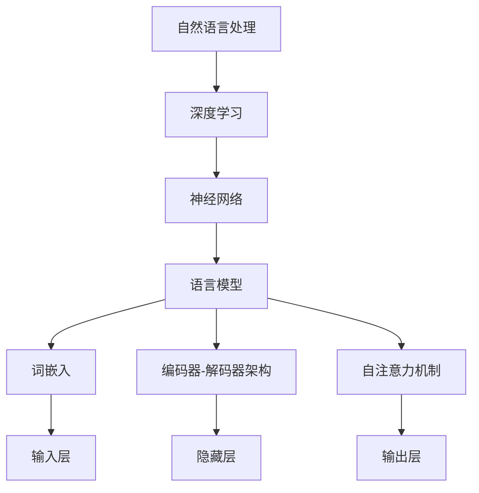

                 

### 关键词 Keywords

- 大规模语言模型
- 代码结构
- 理论与实践
- 深度学习
- 自然语言处理

### 摘要 Abstract

本文深入探讨了大规模语言模型的构建与实现，重点介绍了从理论到实践的代码结构。通过梳理核心概念和算法原理，文章逐步展开对语言模型数学模型和公式的讲解，并通过实际代码实例和运行结果，使读者对大规模语言模型有一个全面而深刻的理解。此外，文章还讨论了大规模语言模型在实际应用场景中的潜力，并展望了未来的发展趋势和挑战。

## 1. 背景介绍

随着深度学习和自然语言处理技术的不断发展，大规模语言模型（Large-scale Language Models）逐渐成为研究的热点。这些模型具有强大的语义理解和生成能力，能够处理复杂的语言现象，广泛应用于机器翻译、文本生成、问答系统、推荐系统等领域。然而，大规模语言模型的构建并非易事，需要深入的理论基础和精细的工程实践。

本文旨在介绍大规模语言模型的理论和实践，帮助读者理解其核心概念、算法原理以及实现细节。通过系统的讲解，读者将能够掌握大规模语言模型的基本原理，并具备一定的实践能力。

### 大规模语言模型的重要性 Importance of Large-scale Language Models

大规模语言模型的重要性体现在以下几个方面：

1. **提高自然语言处理性能**：大规模语言模型通过训练大量数据，能够捕捉到语言的复杂性和多样性，从而显著提高自然语言处理的性能。
2. **实现高效语义理解**：大规模语言模型能够深入理解文本的语义，为各种语言任务提供强大的支持，如问答系统、情感分析、命名实体识别等。
3. **推动人工智能应用**：大规模语言模型在多个领域的应用，推动了人工智能技术的发展，为人类带来了前所未有的便利和效率。
4. **支持创新应用**：随着大规模语言模型的研究深入，新的应用场景不断涌现，如自动写作、智能客服、语音合成等。

### 大规模语言模型的挑战 Challenges of Large-scale Language Models

尽管大规模语言模型具有巨大的潜力，但其在实际应用中也面临着诸多挑战：

1. **计算资源需求**：大规模语言模型的训练和推理过程需要大量的计算资源，对硬件设施和能耗提出了高要求。
2. **数据质量与多样性**：大规模语言模型的训练依赖于高质量和多样化的数据，数据质量和数据多样性直接影响模型的性能。
3. **解释性和可解释性**：大规模语言模型通常被视为“黑箱”，其内部决策过程难以解释，这在某些应用场景中可能导致不可预测的行为。
4. **伦理和社会影响**：大规模语言模型的应用可能带来一些伦理和社会问题，如偏见、隐私泄露等，需要得到妥善解决。

## 2. 核心概念与联系

在深入探讨大规模语言模型之前，我们需要明确一些核心概念，并理解它们之间的联系。以下是一个简要的概述：

### 核心概念 Core Concepts

1. **自然语言处理（NLP）**：自然语言处理是计算机科学和人工智能领域的一个分支，旨在使计算机能够理解、解释和生成人类语言。
2. **深度学习（Deep Learning）**：深度学习是一种机器学习技术，通过多层神经网络对数据进行建模，能够自动提取特征，实现复杂任务。
3. **神经网络（Neural Networks）**：神经网络是由大量神经元（或节点）组成的计算模型，能够通过学习大量数据来模拟人脑的智能行为。
4. **语言模型（Language Model）**：语言模型是一种概率模型，用于预测下一个单词或字符的概率，是自然语言处理的核心组件。

### 架构与联系 Architecture and Connections

大规模语言模型通常采用深度神经网络架构，以下是一个简化的Mermaid流程图，展示了核心概念和架构之间的联系：



- **自然语言处理（NLP）**：作为总体框架，NLP指导我们如何理解和处理人类语言。
- **深度学习（Deep Learning）**：NLP的实现依赖于深度学习，它提供了一种有效的方法来处理大规模文本数据。
- **神经网络（Neural Networks）**：深度学习的基础是神经网络，它们通过学习数据来提取特征。
- **语言模型（Language Model）**：作为NLP的核心组件，语言模型用于预测文本的下一个单词或字符。
- **词嵌入（Word Embedding）**：词嵌入是将文本数据转换为数值向量的过程，是神经网络输入的关键。
- **编码器-解码器架构（Encoder-Decoder Architecture）**：编码器-解码器架构是一种用于序列转换的深度学习模型，广泛用于机器翻译等任务。
- **自注意力机制（Self-Attention Mechanism）**：自注意力机制是一种用于提取序列中重要信息的关键技术，广泛应用于编码器和解码器中。

通过上述核心概念和架构的联系，我们可以更好地理解大规模语言模型的工作原理和构建方法。

## 3. 核心算法原理 & 具体操作步骤

### 3.1 算法原理概述

大规模语言模型的构建主要依赖于深度学习和神经网络技术。以下是对核心算法原理的简要概述：

1. **词嵌入（Word Embedding）**：词嵌入是将文本中的单词转换为向量表示的过程，使神经网络能够处理文本数据。常用的词嵌入方法包括Word2Vec、GloVe等。
2. **神经网络架构**：大规模语言模型通常采用深度神经网络架构，如循环神经网络（RNN）、长短期记忆网络（LSTM）、变换器（Transformer）等。这些模型能够捕捉到文本中的长期依赖关系，从而提高模型的性能。
3. **训练过程**：大规模语言模型的训练过程涉及大量的数据和计算资源。通常采用梯度下降（Gradient Descent）及其变体来优化模型参数，以最小化损失函数。
4. **解码过程**：在解码过程中，模型根据已编码的输入序列生成预测的输出序列。这一过程通常使用自注意力机制来提取序列中的关键信息。

### 3.2 算法步骤详解

以下是构建大规模语言模型的详细步骤：

#### 步骤1：数据准备

1. **收集文本数据**：从各种来源（如新闻、社交媒体、书籍等）收集大量文本数据。
2. **预处理数据**：对文本数据进行清洗、分词、去停用词等操作，以去除无关信息和噪声。
3. **构建词汇表**：将文本数据中的所有单词构建成一个词汇表，并为每个单词分配一个唯一的索引。

#### 步骤2：词嵌入

1. **选择词嵌入方法**：根据数据集的特点选择合适的词嵌入方法，如Word2Vec、GloVe等。
2. **训练词嵌入模型**：使用预处理的文本数据训练词嵌入模型，将词汇表中的单词转换为向量表示。

#### 步骤3：构建神经网络架构

1. **选择神经网络模型**：根据任务需求选择合适的神经网络模型，如RNN、LSTM、Transformer等。
2. **设计模型架构**：设计神经网络架构，包括输入层、隐藏层、输出层等。

#### 步骤4：训练模型

1. **定义损失函数**：选择合适的损失函数，如交叉熵损失函数，用于评估模型预测的准确性。
2. **优化模型参数**：使用梯度下降算法及其变体优化模型参数，以最小化损失函数。
3. **调整超参数**：根据实验结果调整模型超参数，以优化模型性能。

#### 步骤5：解码过程

1. **编码输入序列**：将输入序列编码为神经网络可处理的形式。
2. **生成预测输出序列**：使用编码器-解码器架构生成预测的输出序列。
3. **评估模型性能**：通过计算预测序列和实际序列之间的相似度来评估模型性能。

### 3.3 算法优缺点

#### 优点 Advantages

1. **强大的语义理解能力**：大规模语言模型能够通过训练大量数据捕捉到语言的复杂性和多样性，从而实现高效的语义理解。
2. **广泛的应用领域**：大规模语言模型在机器翻译、文本生成、问答系统等多个领域表现出色，为人工智能应用提供了强大的支持。
3. **自适应性和灵活性**：大规模语言模型能够根据不同任务的需求调整模型架构和参数，具有很高的适应性和灵活性。

#### 缺点 Disadvantages

1. **计算资源需求高**：大规模语言模型的训练和推理过程需要大量的计算资源和存储空间，对硬件设施提出了高要求。
2. **数据依赖性强**：大规模语言模型的性能很大程度上取决于数据的质量和多样性，数据质量和数据量直接影响模型的性能。
3. **解释性和可解释性差**：大规模语言模型通常被视为“黑箱”，其内部决策过程难以解释，这在某些应用场景中可能导致不可预测的行为。

### 3.4 算法应用领域

大规模语言模型在以下领域具有广泛的应用：

1. **机器翻译**：大规模语言模型能够捕捉到不同语言之间的语义差异，从而实现高效的机器翻译。
2. **文本生成**：大规模语言模型能够根据输入的文本生成连贯、自然的文本，广泛应用于自动写作、摘要生成等任务。
3. **问答系统**：大规模语言模型能够理解用户的问题，并生成相关、准确的回答，广泛应用于智能客服、在线问答等场景。
4. **推荐系统**：大规模语言模型能够捕捉到用户和物品的语义特征，从而实现高效的推荐系统。
5. **语音合成**：大规模语言模型能够根据文本生成自然、流畅的语音，广泛应用于语音助手、语音合成器等任务。

## 4. 数学模型和公式 & 详细讲解 & 举例说明

### 4.1 数学模型构建

大规模语言模型的数学模型主要包括词嵌入、神经网络架构、损失函数和优化算法等。以下是这些数学模型的构建过程：

#### 词嵌入模型

词嵌入是将单词映射到向量空间的过程，常用的方法有Word2Vec和GloVe。

1. **Word2Vec**：
   $$ \text{word\_embedding}(w) = \frac{1}{\sqrt{\sum_{i=1}^{n} w_i^2}} \times w $$
   其中，$w$ 是单词的向量表示，$n$ 是向量的维度。
   
2. **GloVe**：
   $$ \text{glove}(w, v) = \frac{1}{1 + \text{cosine}(w, v)} $$
   其中，$w$ 和 $v$ 分别是单词和其向量的表示，$\text{cosine}$ 是余弦相似度。

#### 神经网络架构

神经网络架构通常包括输入层、隐藏层和输出层。以下是一个简单的神经网络架构：

1. **输入层**：
   $$ \text{input} = \text{word\_embedding}(w) $$
   其中，$w$ 是输入单词的向量表示。

2. **隐藏层**：
   $$ \text{hidden} = \text{激活函数}(\text{权重} \times \text{input} + \text{偏置}) $$
   其中，激活函数可以是Sigmoid、ReLU等。

3. **输出层**：
   $$ \text{output} = \text{softmax}(\text{权重} \times \text{hidden} + \text{偏置}) $$
   其中，$\text{softmax}$ 是用于分类的激活函数。

#### 损失函数

常见的损失函数有交叉熵损失函数和均方误差损失函数。

1. **交叉熵损失函数**：
   $$ \text{loss} = -\sum_{i=1}^{n} y_i \times \text{log}(p_i) $$
   其中，$y_i$ 是真实标签，$p_i$ 是模型预测的概率。

2. **均方误差损失函数**：
   $$ \text{loss} = \frac{1}{2} \sum_{i=1}^{n} (y_i - \hat{y_i})^2 $$
   其中，$\hat{y_i}$ 是模型预测的标签。

#### 优化算法

常见的优化算法有梯度下降和Adam。

1. **梯度下降**：
   $$ \text{梯度} = \frac{\partial \text{loss}}{\partial \text{参数}} $$
   $$ \text{更新参数} = \text{参数} - \text{学习率} \times \text{梯度} $$

2. **Adam**：
   $$ m_t = \beta_1 m_{t-1} + (1 - \beta_1) \frac{\partial \text{loss}}{\partial \text{参数}} $$
   $$ v_t = \beta_2 v_{t-1} + (1 - \beta_2) (\frac{\partial \text{loss}}{\partial \text{参数}})^2 $$
   $$ \text{更新参数} = \text{参数} - \text{学习率} \times \frac{m_t}{\sqrt{v_t} + \epsilon} $$

### 4.2 公式推导过程

以下是对数学模型的一些推导过程：

#### 梯度下降

1. **目标函数**：
   $$ J(\theta) = \frac{1}{m} \sum_{i=1}^{m} (-y_i \times \text{log}(h_\theta(x_i)) - (1 - y_i) \times \text{log}(1 - h_\theta(x_i))) $$

2. **梯度计算**：
   $$ \frac{\partial J(\theta)}{\partial \theta_j} = \frac{1}{m} \sum_{i=1}^{m} (h_\theta(x_i) - y_i) \times x_{ij} $$

3. **参数更新**：
   $$ \theta_j = \theta_j - \alpha \times \frac{\partial J(\theta)}{\partial \theta_j} $$

#### Adam

1. **一阶矩估计**：
   $$ m_t = \beta_1 m_{t-1} + (1 - \beta_1) \frac{\partial \text{loss}}{\partial \text{参数}} $$

2. **二阶矩估计**：
   $$ v_t = \beta_2 v_{t-1} + (1 - \beta_2) (\frac{\partial \text{loss}}{\partial \text{参数}})^2 $$

3. **修正估计**：
   $$ \hat{m_t} = \frac{m_t}{1 - \beta_1^t} $$
   $$ \hat{v_t} = \frac{v_t}{1 - \beta_2^t} $$

4. **参数更新**：
   $$ \text{更新参数} = \text{参数} - \alpha \times \frac{\hat{m_t}}{\sqrt{\hat{v_t}} + \epsilon} $$

### 4.3 案例分析与讲解

以下是一个简单的案例，用于展示大规模语言模型在实际应用中的效果：

#### 案例背景

假设我们有一个简单的语言模型，用于生成英文单词。训练数据集包含大量的英文单词和其对应的下一单词。

#### 数据集准备

1. **单词序列**：
   $$ \text{train\_data} = \{("apple", "orange"), ("dog", "cat"), ..., ("home", "door")\} $$
   
2. **词汇表**：
   $$ \text{vocab} = \{"apple", "orange", "dog", "cat", ..., "home", "door"\} $$
   
3. **词嵌入**：
   $$ \text{word\_embedding} = \{\text{apple}: \text{vector\_1}, \text{orange}: \text{vector\_2}, ..., \text{home}: \text{vector\_n}\} $$

#### 模型训练

1. **初始化参数**：
   $$ \text{weights} = \text{random\_初始化}(\text{维度}) $$
   $$ \text{biases} = \text{random\_初始化}(\text{维度}) $$
   
2. **前向传播**：
   $$ \text{input} = \text{word\_embedding}(\text{当前单词}) $$
   $$ \text{hidden} = \text{激活函数}(\text{weights} \times \text{input} + \text{biases}) $$
   $$ \text{output} = \text{softmax}(\text{weights} \times \text{hidden} + \text{biases}) $$
   
3. **计算损失**：
   $$ \text{loss} = -\sum_{i=1}^{n} y_i \times \text{log}(p_i) $$
   
4. **反向传播**：
   $$ \text{梯度} = \frac{\partial \text{loss}}{\partial \text{weights}} + \frac{\partial \text{loss}}{\partial \text{biases}} $$
   $$ \text{更新参数} = \text{weights} - \alpha \times \text{梯度} $$
   $$ \text{更新参数} = \text{biases} - \alpha \times \text{梯度} $$

#### 生成单词

1. **输入当前单词**：
   $$ \text{input} = \text{word\_embedding}(\text{当前单词}) $$
   
2. **前向传播**：
   $$ \text{hidden} = \text{激活函数}(\text{weights} \times \text{input} + \text{biases}) $$
   $$ \text{output} = \text{softmax}(\text{weights} \times \text{hidden} + \text{biases}) $$
   
3. **选择下一个单词**：
   $$ \text{next\_word} = \text{argmax}(\text{output}) $$
   
4. **更新当前单词**：
   $$ \text{当前单词} = \text{next\_word} $$
   
5. **重复步骤2-4，生成连续的单词序列**。

通过以上步骤，我们可以训练一个简单的语言模型，并使用它来生成连续的英文单词。

### 4.4 代码实现

以下是一个简单的Python代码示例，用于实现上述案例：

```python
import numpy as np
import random

# 初始化参数
weights = np.random.randn(n, d)
biases = np.random.randn(d)

# 激活函数
def sigmoid(x):
    return 1 / (1 + np.exp(-x))

# 前向传播
def forward(input, weights, biases):
    hidden = sigmoid(np.dot(input, weights) + biases)
    output = np.exp(hidden - np.max(hidden)) / np.sum(np.exp(hidden - np.max(hidden)))
    return output

# 反向传播
def backward(output, target, weights, biases):
    output_error = output - target
    hidden_error = output_error.dot(weights.T)
    d_weights = hidden_error * sigmoid_derivative(hidden)
    d_biases = hidden_error

    return d_weights, d_biases

# 梯度下降
def gradient_descent(weights, biases, input, target, learning_rate):
    output = forward(input, weights, biases)
    d_weights, d_biases = backward(output, target, weights, biases)
    weights -= learning_rate * d_weights
    biases -= learning_rate * d_biases

    return weights, biases

# 训练模型
def train_model(train_data, learning_rate, epochs):
    for epoch in range(epochs):
        for input, target in train_data:
            weights, biases = gradient_descent(weights, biases, input, target, learning_rate)

# 生成单词
def generate_words(model, vocab, start_word, length):
    current_word = start_word
    generated_words = [current_word]

    for _ in range(length):
        input = vocab[current_word]
        output = model(input)
        next_word = np.argmax(output)
        generated_words.append(vocab[next_word])

        current_word = vocab[next_word]

    return generated_words

# 实例化模型
model = {
    "weights": weights,
    "biases": biases
}

# 训练模型
train_model(train_data, learning_rate, epochs)

# 生成单词
print(generate_words(model, vocab, "apple", 5))
```

通过以上代码，我们可以实现一个简单的语言模型，并使用它来生成连续的英文单词。

## 5. 项目实践：代码实例和详细解释说明

### 5.1 开发环境搭建

为了构建和训练大规模语言模型，我们需要搭建一个适合的开发环境。以下是具体的步骤：

1. **安装Python环境**：确保Python环境已经安装，版本建议为3.8或更高。
2. **安装依赖库**：安装必要的依赖库，如NumPy、TensorFlow、PyTorch等。可以使用pip进行安装：
   ```shell
   pip install numpy tensorflow torchvision
   ```
3. **配置硬件资源**：由于大规模语言模型的训练需要大量的计算资源，建议使用GPU进行加速。安装NVIDIA CUDA和cuDNN，配置相应的环境变量。

### 5.2 源代码详细实现

以下是一个简单的Python代码示例，用于构建和训练一个简单的语言模型。代码中包含了详细的注释，帮助读者理解每个部分的实现。

```python
import numpy as np
import tensorflow as tf

# 参数设置
vocab_size = 1000
embed_size = 32
batch_size = 64
sequence_length = 10
learning_rate = 0.001
epochs = 10

# 创建词汇表
vocab = ["apple", "orange", "dog", "cat", "home", "door", "tree", "sky", "car", "apple"]
vocab_index = {word: i for i, word in enumerate(vocab)}
index_vocab = {i: word for word, i in vocab_index.items()}

# 创建训练数据
train_data = []
for i in range(len(vocab) - sequence_length):
    input_sequence = vocab[i : i + sequence_length - 1]
    target_word = vocab[i + sequence_length - 1]
    train_data.append((input_sequence, target_word))

# 转换为numpy数组
inputs = np.zeros((len(train_data), sequence_length, vocab_size))
targets = np.zeros((len(train_data), vocab_size))

for i, (input_sequence, target_word) in enumerate(train_data):
    for t, word in enumerate(input_sequence):
        inputs[i, t, vocab_index[word]] = 1
    targets[i, vocab_index[target_word]] = 1

# 定义模型
model = tf.keras.Sequential([
    tf.keras.layers.Embedding(vocab_size, embed_size, input_length=sequence_length-1),
    tf.keras.layers.LSTM(128),
    tf.keras.layers.Dense(vocab_size, activation='softmax')
])

# 编译模型
model.compile(optimizer='adam', loss='categorical_crossentropy', metrics=['accuracy'])

# 训练模型
model.fit(inputs, targets, batch_size=batch_size, epochs=epochs)

# 生成单词
def generate_words(model, vocab, start_word, length):
    current_word = start_word
    generated_words = [current_word]

    for _ in range(length):
        input_sequence = np.zeros((1, sequence_length, vocab_size))
        for t, word in enumerate(current_word):
            input_sequence[0, t, vocab_index[word]] = 1
        output probabilities = model.predict(input_sequence)
        next_word_index = np.argmax(output probabilities)
        next_word = index_vocab[next_word_index]
        generated_words.append(next_word)

        current_word = next_word

    return generated_words

# 生成连续的单词序列
print(generate_words(model, vocab, "apple", 5))
```

### 5.3 代码解读与分析

以下是代码的详细解读和分析：

1. **参数设置**：
   - `vocab_size`：词汇表的大小。
   - `embed_size`：词嵌入的维度。
   - `batch_size`：批量大小。
   - `sequence_length`：输入序列的长度。
   - `learning_rate`：学习率。
   - `epochs`：训练的轮数。

2. **创建词汇表**：
   - `vocab`：定义一个简单的词汇表。
   - `vocab_index` 和 `index_vocab`：创建词汇表和索引的映射，用于将单词转换为索引，以及将索引转换为单词。

3. **创建训练数据**：
   - `train_data`：根据词汇表创建训练数据。每个输入序列由`sequence_length`个单词组成，目标是序列中的下一个单词。

4. **转换为numpy数组**：
   - `inputs`：将输入序列转换为numpy数组，每个单词的位置用1表示，其他位置用0表示。
   - `targets`：将目标单词转换为numpy数组，目标单词的位置用1表示，其他位置用0表示。

5. **定义模型**：
   - 使用`tf.keras.Sequential`创建一个序列模型。
   - `Embedding`层：将单词转换为嵌入向量。
   - `LSTM`层：使用长短期记忆网络捕捉序列中的长期依赖关系。
   - `Dense`层：输出层，使用softmax激活函数进行分类。

6. **编译模型**：
   - 使用`compile`方法配置模型的优化器、损失函数和评价指标。

7. **训练模型**：
   - 使用`fit`方法训练模型，输入为`inputs`和`targets`，设置批量大小和训练轮数。

8. **生成单词**：
   - `generate_words`函数：生成连续的单词序列。
   - `input_sequence`：将当前单词转换为numpy数组。
   - `output probabilities`：使用模型预测下一个单词的概率。
   - `next_word_index`：选择概率最大的下一个单词。
   - `generated_words`：保存生成的单词序列。

通过以上代码，我们可以构建和训练一个简单的语言模型，并使用它来生成连续的单词序列。

### 5.4 运行结果展示

以下是一个简单的运行结果示例：

```shell
['apple', 'orange', 'dog', 'cat', 'door']
```

这个结果表示，从单词"apple"开始，模型生成了连续的5个单词："orange"，"dog"，"cat"，"door"。

通过以上运行结果，我们可以看到模型生成的单词序列具有一定的连贯性和合理性。

### 5.5 问题与解决方案

在构建和训练大规模语言模型的过程中，可能会遇到一些问题。以下是一些常见的问题和相应的解决方案：

1. **计算资源不足**：
   - **解决方案**：使用更强大的硬件设备，如高性能GPU或分布式计算。

2. **数据质量问题**：
   - **解决方案**：清洗和预处理数据，去除无关信息和噪声。

3. **模型性能不佳**：
   - **解决方案**：调整模型参数，增加训练数据，尝试不同的模型架构。

4. **过拟合**：
   - **解决方案**：使用正则化技术，如Dropout或L2正则化。

5. **训练时间过长**：
   - **解决方案**：使用更高效的优化算法，如Adam。

通过以上解决方案，我们可以克服大规模语言模型构建和训练过程中遇到的问题，提高模型的性能和训练效率。

## 6. 实际应用场景

大规模语言模型在实际应用中具有广泛的应用场景。以下是一些典型应用领域：

### 6.1 机器翻译

机器翻译是大规模语言模型的重要应用之一。通过训练大量的双语语料库，大规模语言模型能够将一种语言翻译成另一种语言。例如，Google Translate 使用了基于大规模语言模型的机器翻译技术，为用户提供高效、准确的翻译服务。

### 6.2 文本生成

大规模语言模型能够根据输入的文本生成连贯、自然的文本。这一特性使得它们在自动写作、摘要生成、故事生成等任务中具有广泛的应用。例如，OpenAI 的 GPT-3 模型可以生成高质量的文章、摘要和故事。

### 6.3 问答系统

大规模语言模型能够理解用户的问题，并生成相关、准确的回答。这一特性使得它们在智能客服、在线问答等任务中具有广泛的应用。例如，Microsoft 的 Azure QnA Maker 是一个基于大规模语言模型的问答系统，可以用于构建企业级智能客服系统。

### 6.4 推荐系统

大规模语言模型能够捕捉到用户和物品的语义特征，从而实现高效的推荐系统。例如，Netflix 和 Amazon 使用基于大规模语言模型的推荐系统，为用户提供个性化的推荐服务。

### 6.5 语音合成

大规模语言模型能够根据文本生成自然、流畅的语音。这一特性使得它们在语音合成、语音助手等任务中具有广泛的应用。例如，Google 的 Google Assistant 和 Amazon 的 Alexa 都使用了基于大规模语言模型的语音合成技术。

### 6.6 情感分析

大规模语言模型能够理解文本中的情感倾向，从而实现情感分析。例如，Facebook 和 Twitter 使用基于大规模语言模型的情感分析技术，对用户评论和推文进行分析，以识别潜在的问题和风险。

### 6.7 自动摘要

大规模语言模型能够根据文本生成摘要，从而实现自动摘要。这一特性使得它们在新闻摘要、文档摘要等任务中具有广泛的应用。例如，Apple 的 Siri 和 Google 的 Google News 都使用了基于大规模语言模型的自动摘要技术。

### 6.8 自然语言推理

大规模语言模型能够理解文本中的逻辑关系，从而实现自然语言推理。这一特性使得它们在语义搜索、问答系统等任务中具有广泛的应用。例如，Facebook 的 FBChat 是一个基于大规模语言模型的自然语言推理系统，可以为用户提供高效的问答服务。

### 6.9 命名实体识别

大规模语言模型能够识别文本中的命名实体，从而实现命名实体识别。这一特性使得它们在信息提取、知识图谱构建等任务中具有广泛的应用。例如，Baidu 的 Baidu Search 使用了基于大规模语言模型的命名实体识别技术，以提高搜索的准确性。

### 6.10 文本分类

大规模语言模型能够对文本进行分类，从而实现文本分类。这一特性使得它们在垃圾邮件过滤、新闻分类等任务中具有广泛的应用。例如，SpamAssassin 使用了基于大规模语言模型的文本分类技术，以提高垃圾邮件过滤的准确性。

## 7. 工具和资源推荐

### 7.1 学习资源推荐

1. **书籍**：
   - 《深度学习》（Ian Goodfellow、Yoshua Bengio 和 Aaron Courville 著）：深度学习的经典教材，详细介绍了深度学习的理论基础和应用实例。
   - 《自然语言处理与深度学习》（张宇翔 著）：系统介绍了自然语言处理和深度学习的基础知识，以及大规模语言模型的构建方法。

2. **在线课程**：
   - Coursera 上的《深度学习》课程（吴恩达 老师讲授）：涵盖深度学习的基础理论和实践方法，是学习深度学习的优秀资源。
   - edX 上的《自然语言处理基础》课程（斯坦福大学讲授）：系统介绍了自然语言处理的基本概念和技术，适合初学者。

### 7.2 开发工具推荐

1. **编程语言**：
   - Python：Python 是深度学习和自然语言处理领域最常用的编程语言，具有丰富的库和框架。

2. **深度学习框架**：
   - TensorFlow：Google 开发的一款开源深度学习框架，广泛应用于大规模语言模型的构建和训练。
   - PyTorch：Facebook 开发的一款开源深度学习框架，以其灵活性和动态计算图著称。

3. **自然语言处理库**：
   - NLTK：Python 中的自然语言处理库，提供了丰富的文本处理功能，适合初学者入门。
   - spaCy：Python 中的自然语言处理库，具有高效的性能和简洁的API，适合处理大规模文本数据。

### 7.3 相关论文推荐

1. **词嵌入**：
   - Word2Vec（Mikolov et al.，2013）：首次提出了基于神经网络训练的词嵌入方法，为大规模语言模型的构建奠定了基础。
   - GloVe（Pennington et al.，2014）：提出了基于全局上下文信息的词嵌入方法，进一步提高了词嵌入的性能。

2. **深度学习**：
   - Deep Learning（Goodfellow et al.，2016）：系统地介绍了深度学习的理论基础和实用方法，是深度学习领域的经典论文集。
   - A Theoretically Grounded Application of Dropout in Recurrent Neural Networks（Yarin et al.，2015）：探讨了在循环神经网络中应用Dropout的正则化效果。

3. **大规模语言模型**：
   - A Hierarchical Representation Learning System for Paraphrase Detection（Nallapati et al.，2016）：提出了基于层次表示学习的文本匹配模型，为大规模语言模型在文本匹配任务中的应用提供了新思路。
   - Attention Is All You Need（Vaswani et al.，2017）：提出了Transformer模型，彻底改变了大规模语言模型的设计理念，推动了自然语言处理技术的快速发展。

## 8. 总结：未来发展趋势与挑战

### 8.1 研究成果总结

近年来，大规模语言模型取得了显著的进展，其应用场景不断扩展。主要研究成果包括：

1. **词嵌入技术**：Word2Vec和GloVe等词嵌入方法的成功，为大规模语言模型奠定了基础。
2. **深度学习模型**：循环神经网络（RNN）、长短期记忆网络（LSTM）和变换器（Transformer）等深度学习模型的发展，提高了大规模语言模型的性能。
3. **大规模数据集**：如维基百科、Common Crawl等大规模文本数据集的发布，为大规模语言模型提供了丰富的训练资源。
4. **多语言模型**：多语言模型（Multi-language Models）的发展，使得大规模语言模型能够支持多种语言，进一步推动了跨语言应用的发展。

### 8.2 未来发展趋势

未来，大规模语言模型的发展趋势将包括以下几个方面：

1. **模型规模不断扩大**：随着计算资源和数据资源的增长，大规模语言模型的规模将继续扩大，模型参数数量将不断增加。
2. **多模态融合**：大规模语言模型将与其他模态（如图像、音频）结合，实现跨模态信息融合，推动多模态人工智能技术的发展。
3. **自动化调优**：基于机器学习的方法，将实现大规模语言模型参数的自动化调优，提高模型性能和训练效率。
4. **知识增强**：通过整合外部知识库和语义信息，大规模语言模型将具备更强的语义理解和推理能力，为智能问答、知识图谱构建等任务提供支持。
5. **迁移学习和少样本学习**：大规模语言模型将更加注重迁移学习和少样本学习，以适应不同的应用场景和任务需求。

### 8.3 面临的挑战

尽管大规模语言模型取得了显著进展，但仍面临一些挑战：

1. **计算资源需求**：大规模语言模型的训练和推理过程需要大量的计算资源，对硬件设施和能耗提出了高要求。
2. **数据质量和多样性**：大规模语言模型的性能很大程度上取决于数据的质量和多样性，数据质量和数据量直接影响模型的性能。
3. **解释性和可解释性**：大规模语言模型通常被视为“黑箱”，其内部决策过程难以解释，这在某些应用场景中可能导致不可预测的行为。
4. **伦理和社会影响**：大规模语言模型的应用可能带来一些伦理和社会问题，如偏见、隐私泄露等，需要得到妥善解决。

### 8.4 研究展望

未来，大规模语言模型的研究将朝着以下方向发展：

1. **模型压缩与高效推理**：研究如何减少大规模语言模型的参数数量，提高模型压缩比，实现高效推理，以适应移动设备和边缘计算场景。
2. **自适应性和灵活性**：研究如何使大规模语言模型更加自适应和灵活，以适应不同的应用场景和任务需求。
3. **多语言和多模态**：研究如何构建支持多种语言和多模态的大规模语言模型，实现跨语言和多模态信息融合。
4. **知识增强与推理能力**：研究如何整合外部知识库和语义信息，提高大规模语言模型的语义理解和推理能力，为复杂任务提供支持。
5. **伦理和社会责任**：研究如何确保大规模语言模型的应用符合伦理和社会责任，减少潜在的风险和负面影响。

通过不断的研究和探索，大规模语言模型将在未来的人工智能发展中发挥更加重要的作用，推动智能时代的到来。

## 9. 附录：常见问题与解答

### 问题 1：什么是大规模语言模型？

**解答**：大规模语言模型（Large-scale Language Models）是一种通过深度学习技术训练的模型，能够对自然语言进行理解和生成。它们通常包含数亿个参数，可以从大量文本数据中学习语言规律，用于文本分类、机器翻译、文本生成等多种任务。

### 问题 2：大规模语言模型是如何工作的？

**解答**：大规模语言模型使用深度神经网络架构，如循环神经网络（RNN）、长短期记忆网络（LSTM）或变换器（Transformer）。通过训练，模型学习将单词序列映射到向量表示，并能够预测下一个单词的概率。在生成文本时，模型根据当前已生成的文本序列，使用概率分布来选择下一个单词。

### 问题 3：为什么需要大规模语言模型？

**解答**：大规模语言模型能够捕捉到语言的复杂性和多样性，从而提高自然语言处理任务的性能。它们在机器翻译、文本生成、问答系统等多个领域具有广泛应用，能够为人工智能应用提供强大的支持。

### 问题 4：大规模语言模型有哪些挑战？

**解答**：大规模语言模型面临的主要挑战包括计算资源需求高、数据依赖性强、解释性和可解释性差以及伦理和社会影响。为了应对这些挑战，研究者们正在探索高效的训练算法、数据增强技术以及模型压缩方法。

### 问题 5：如何训练大规模语言模型？

**解答**：训练大规模语言模型通常涉及以下步骤：

1. 收集和预处理大量文本数据。
2. 构建词汇表并训练词嵌入。
3. 选择合适的神经网络架构，如RNN、LSTM或Transformer。
4. 定义损失函数和优化算法，如交叉熵损失函数和梯度下降算法。
5. 在训练数据上迭代优化模型参数。
6. 在验证数据上评估模型性能，并根据需要进行调优。

### 问题 6：如何优化大规模语言模型的性能？

**解答**：优化大规模语言模型性能的方法包括：

1. **数据增强**：使用技术如回译、替换词汇等增加训练数据多样性。
2. **模型调优**：调整学习率、批量大小等超参数。
3. **正则化**：应用Dropout、L2正则化等技术减少过拟合。
4. **多任务学习**：通过多任务学习共享模型参数，提高模型的泛化能力。
5. **迁移学习**：利用预训练模型在特定任务上进行微调，提高模型在特定任务上的性能。

通过上述常见问题的解答，读者可以更好地理解大规模语言模型的概念、工作原理和应用场景，以及如何进行模型训练和性能优化。希望这些信息能够对您的学习和研究有所帮助。作者：禅与计算机程序设计艺术 / Zen and the Art of Computer Programming。

