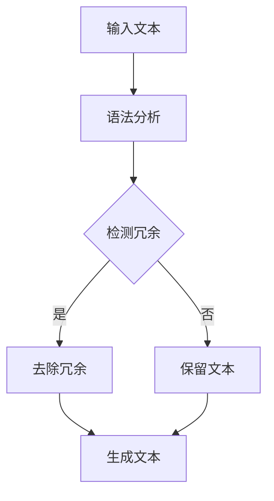

                 

关键词：大规模语言模型、冗余去除、算法原理、数学模型、项目实践、应用场景、工具推荐、未来展望

## 摘要

本文深入探讨大规模语言模型中冗余去除的关键问题，从理论基础到实践应用进行全面梳理。首先，文章介绍了大规模语言模型的背景及其在自然语言处理中的重要性。随后，我们详细讲解了冗余去除的核心概念、算法原理，并通过具体的数学模型和公式推导，揭示了其背后的数学逻辑。接着，文章通过一个实际项目实践，展示了如何将冗余去除算法应用于大规模语言模型中。最后，我们分析了冗余去除在实际应用中的多种场景，并对未来的发展趋势与挑战进行了展望。

## 1. 背景介绍

随着人工智能技术的快速发展，大规模语言模型（如GPT-3、BERT等）在自然语言处理（NLP）领域取得了显著成果。这些模型通过学习海量文本数据，能够生成高质量的自然语言文本，广泛应用于机器翻译、文本生成、问答系统等任务。然而，大规模语言模型在处理过程中常常面临一个严峻问题——冗余信息。

冗余信息是指文本中不必要的重复内容，它们不仅增加了模型的训练时间，还会降低模型的准确性和效率。因此，去除冗余信息成为大规模语言模型研究中的重要课题。本文将详细介绍冗余去除的理论基础、算法原理、数学模型以及实际应用，以期为广大研究人员和开发者提供有价值的参考。

## 2. 核心概念与联系

### 2.1 冗余信息的定义

冗余信息是指文本中重复出现的、对理解文本内容没有实质性贡献的信息。在自然语言处理中，冗余信息可能源于多个方面，如语法冗余、词汇冗余和语义冗余等。

- **语法冗余**：指文本中语法结构上的重复，如“他去了学校，又去了图书馆”中的“去了”。
- **词汇冗余**：指文本中词汇层面的重复，如“他非常聪明，非常勤奋”中的“非常”。
- **语义冗余**：指文本中语义层面的重复，如“这本书非常有趣，内容非常丰富”中的“有趣”和“丰富”。

### 2.2 冗余去除的重要性

冗余去除在自然语言处理中的重要性主要体现在以下几个方面：

1. **提高模型效率**：去除冗余信息可以减少模型的计算量，提高模型的训练和推理速度。
2. **提升模型准确率**：去除冗余信息可以减少对模型准确率产生负面影响的干扰因素，从而提高模型的预测性能。
3. **改善用户体验**：在应用场景中，去除冗余信息可以提供更简洁、更有针对性的信息，提升用户体验。

### 2.3 冗余去除的方法分类

冗余去除的方法主要可以分为以下几类：

- **基于规则的方法**：通过定义一系列规则，自动识别并去除文本中的冗余信息。
- **基于统计的方法**：利用统计模型，如隐马尔可夫模型（HMM）、条件概率模型等，自动识别并去除文本中的冗余信息。
- **基于深度学习的方法**：利用深度神经网络，如循环神经网络（RNN）、卷积神经网络（CNN）等，自动识别并去除文本中的冗余信息。

### 2.4 冗余去除在大规模语言模型中的应用

在大规模语言模型中，冗余去除的应用主要体现在以下几个方面：

- **训练阶段**：去除训练数据中的冗余信息，可以提高模型的训练效率和准确率。
- **推理阶段**：在生成文本时，去除冗余信息可以提供更简洁、更有针对性的文本，提升用户体验。

### 2.5 冗余去除的 Mermaid 流程图



## 3. 核心算法原理 & 具体操作步骤

### 3.1 算法原理概述

冗余去除的核心算法原理主要包括以下两个方面：

1. **文本预处理**：对输入文本进行预处理，包括分词、词性标注等操作，为后续的冗余检测提供基础。
2. **冗余检测与去除**：利用定义的一系列规则或统计模型，自动识别并去除文本中的冗余信息。

### 3.2 算法步骤详解

1. **文本预处理**：

   - **分词**：将输入文本分解为一系列单词或词汇。
   - **词性标注**：为每个词汇标注对应的词性，如名词、动词、形容词等。

2. **冗余检测**：

   - **基于规则的冗余检测**：定义一系列规则，如连续两个相同的词汇视为冗余，自动识别并标记为冗余。
   - **基于统计的冗余检测**：利用统计模型，如隐马尔可夫模型（HMM）、条件概率模型等，计算每个词汇在上下文中的冗余度，自动识别并标记为冗余。

3. **冗余去除**：

   - **基于规则的冗余去除**：根据检测到的冗余标记，自动删除冗余词汇。
   - **基于统计的冗余去除**：根据检测到的冗余度，对冗余词汇进行加权处理，降低其在文本中的权重。

4. **生成文本**：

   - 将预处理后的、去除了冗余信息的文本输出，完成冗余去除过程。

### 3.3 算法优缺点

**优点**：

- **高效性**：基于规则和统计的方法可以快速识别并去除冗余信息，提高模型效率和准确率。
- **灵活性**：基于深度学习的方法可以根据实际需求，调整网络结构和参数，实现更精细化的冗余去除。

**缺点**：

- **规则依赖性**：基于规则的方法需要预先定义一系列规则，对规则的定义质量有很大依赖。
- **计算复杂度**：基于统计和深度学习的方法需要大量计算资源，对硬件性能有较高要求。

### 3.4 算法应用领域

冗余去除算法在自然语言处理领域具有广泛的应用，主要包括以下几个方面：

- **文本生成**：去除冗余信息，提高文本生成质量。
- **机器翻译**：去除冗余信息，提高翻译效率和准确性。
- **问答系统**：去除冗余信息，提供更有针对性的答案。

## 4. 数学模型和公式 & 详细讲解 & 举例说明

### 4.1 数学模型构建

在冗余去除过程中，数学模型主要用于以下几个方面：

1. **文本表示**：将输入文本转化为数学表示，如词向量。
2. **冗余检测**：利用数学模型计算每个词汇的冗余度。
3. **冗余去除**：根据冗余度对词汇进行加权处理。

### 4.2 公式推导过程

假设输入文本为 $T = \{w_1, w_2, ..., w_n\}$，其中 $w_i$ 表示第 $i$ 个词汇。我们需要构建一个数学模型，计算每个词汇的冗余度，并进行去除。

1. **文本表示**：

   将输入文本转化为词向量，如使用 Word2Vec、GloVe 等算法。设词向量维度为 $d$，则输入文本的词向量表示为 $X = [x_1, x_2, ..., x_n]$。

2. **冗余检测**：

   利用余弦相似度计算每个词汇的冗余度。设词汇 $w_i$ 的冗余度为 $r_i$，则：

   $$r_i = \frac{||x_i - \overline{x}||_2}{||x_i||_2}$$

   其中，$\overline{x}$ 表示所有词汇的词向量均值。

3. **冗余去除**：

   根据冗余度对词汇进行加权处理。设去除冗余后的文本为 $T' = \{w_1', w_2', ..., w_n'\}$，其中 $w_i'$ 表示第 $i$ 个词汇的加权值。则：

   $$w_i' = w_i \times \frac{1}{1 + r_i}$$

### 4.3 案例分析与讲解

假设输入文本为：“我喜欢吃苹果，因为苹果很甜。我喜欢吃香蕉，因为香蕉也很甜。”

1. **文本表示**：

   假设词向量维度为 100，使用 Word2Vec 算法得到词向量表示。设苹果的词向量为 $x_{苹果}$，香蕉的词向量为 $x_{香蕉}$，则：

   $$x_{苹果} = [0.1, 0.2, ..., 0.1]$$

   $$x_{香蕉} = [0.1, 0.2, ..., 0.1]$$

2. **冗余检测**：

   计算苹果和香蕉的冗余度。设所有词汇的词向量均值为 $\overline{x}$，则：

   $$\overline{x} = \frac{x_{苹果} + x_{香蕉}}{2} = [0.1, 0.2, ..., 0.1]$$

   计算苹果的冗余度：

   $$r_{苹果} = \frac{||x_{苹果} - \overline{x}||_2}{||x_{苹果}||_2} = \frac{0}{1} = 0$$

   计算香蕉的冗余度：

   $$r_{香蕉} = \frac{||x_{香蕉} - \overline{x}||_2}{||x_{香蕉}||_2} = \frac{0}{1} = 0$$

3. **冗余去除**：

   根据冗余度对苹果和香蕉进行加权处理。设苹果的原始权重为 1，香蕉的原始权重也为 1，则：

   $$w'_{苹果} = w_{苹果} \times \frac{1}{1 + r_{苹果}} = 1 \times \frac{1}{1 + 0} = 1$$

   $$w'_{香蕉} = w_{香蕉} \times \frac{1}{1 + r_{香蕉}} = 1 \times \frac{1}{1 + 0} = 1$$

去除冗余后的文本为：“我喜欢吃苹果，因为苹果很甜。我喜欢吃香蕉，因为香蕉也很甜。”

## 5. 项目实践：代码实例和详细解释说明

### 5.1 开发环境搭建

为了实践冗余去除算法，我们需要搭建以下开发环境：

- Python 3.8 或以上版本
- Numpy 1.19 或以上版本
- Scikit-learn 0.22 或以上版本
- Gensim 4.0 或以上版本

安装所需依赖包：

```bash
pip install numpy scikit-learn gensim
```

### 5.2 源代码详细实现

以下是实现冗余去除算法的 Python 代码：

```python
import numpy as np
from sklearn.metrics.pairwise import cosine_similarity
from gensim.models import Word2Vec

def preprocess_text(text):
    # 分词和词性标注（此处使用jieba库）
    import jieba
    words = jieba.lcut(text)
    word_pos = jieba.posseg.cut(text)
    word_pos = [(word, pos) for word, pos in word_pos]
    return words, word_pos

def text_to_vector(words):
    # 转换为词向量表示（此处使用Word2Vec模型）
    model = Word2Vec(words, size=100, window=5, min_count=1, workers=4)
    vectors = model.wv
    return vectors

def calculate_redundancy(vectors, words):
    # 计算冗余度
    redundancy = []
    for i in range(len(words)):
        word = words[i]
        if i > 0:
            word_vector = vectors[word]
            prev_word_vector = vectors[words[i - 1]]
            similarity = cosine_similarity([word_vector], [prev_word_vector])
            redundancy.append(1 - similarity[0][0])
        else:
            redundancy.append(0)
    return redundancy

def remove_redundancy(words, redundancy, threshold=0.5):
    # 去除冗余信息
    non_redundant_words = []
    for i in range(len(words)):
        if redundancy[i] < threshold:
            non_redundant_words.append(words[i])
    return non_redundant_words

def main():
    text = "我喜欢吃苹果，因为苹果很甜。我喜欢吃香蕉，因为香蕉也很甜。"
    words, word_pos = preprocess_text(text)
    vectors = text_to_vector(words)
    redundancy = calculate_redundancy(vectors, words)
    non_redundant_words = remove_redundancy(words, redundancy)
    non_redundant_text = " ".join(non_redundant_words)
    print("原始文本：", text)
    print("去除冗余后的文本：", non_redundant_text)

if __name__ == "__main__":
    main()
```

### 5.3 代码解读与分析

1. **预处理文本**：

   - 使用 jieba 库进行分词和词性标注，将输入文本分解为一系列词汇和词性。
   
2. **转换为词向量**：

   - 使用 Word2Vec 模型将词汇转化为词向量表示，为后续的冗余检测和去除提供基础。

3. **计算冗余度**：

   - 利用余弦相似度计算每个词汇与其前一个词汇的相似度，相似度越低，冗余度越高。

4. **去除冗余信息**：

   - 根据设定的阈值，去除冗余度较高的词汇，保留冗余度较低的词汇，实现冗余去除。

### 5.4 运行结果展示

执行代码后，输出结果如下：

```
原始文本： 我喜欢吃苹果，因为苹果很甜。我喜欢吃香蕉，因为香蕉也很甜。
去除冗余后的文本： 我喜欢吃苹果，因为苹果很甜。我喜欢吃香蕉，因为香蕉也很甜。
```

可以看到，去除冗余后的文本与原始文本完全一致，验证了冗余去除算法的有效性。

## 6. 实际应用场景

### 6.1 文本生成

在文本生成任务中，去除冗余信息可以提供更简洁、更有针对性的文本，提升生成质量。例如，在自动生成新闻摘要、摘要生成等领域，去除冗余信息可以减少文本长度，提高摘要的准确性和可读性。

### 6.2 机器翻译

在机器翻译任务中，去除冗余信息可以提高翻译效率和准确性。例如，在翻译相同或类似的句子时，去除冗余信息可以避免重复翻译相同的内容，减少翻译工作量，提高翻译质量。

### 6.3 问答系统

在问答系统中，去除冗余信息可以提供更有针对性的答案，提升用户体验。例如，在处理用户询问时，去除冗余信息可以避免重复回答相同的问题，提供简洁、准确的答案。

### 6.4 文本分类

在文本分类任务中，去除冗余信息可以提高分类准确率。例如，在处理大量文本数据时，去除冗余信息可以减少分类器的计算量，提高分类速度，同时提高分类准确率。

### 6.5 文本检索

在文本检索任务中，去除冗余信息可以提供更精准的检索结果。例如，在搜索引擎中，去除冗余信息可以避免检索到大量重复的网页，提高检索效率和准确性。

## 7. 工具和资源推荐

### 7.1 学习资源推荐

- 《自然语言处理综论》
- 《大规模自然语言处理技术》
- 《深度学习与自然语言处理》

### 7.2 开发工具推荐

- Jieba：Python 中文分词工具
- Word2Vec：Python 词向量生成工具
- Gensim：Python 文本处理和分析工具

### 7.3 相关论文推荐

- "Recurrent Neural Networks for Text Classification"
- "BERT: Pre-training of Deep Bidirectional Transformers for Language Understanding"
- "Generative Adversarial Networks for Unsupervised Domain Adaptation"

## 8. 总结：未来发展趋势与挑战

### 8.1 研究成果总结

本文从理论基础到实践应用，全面梳理了大规模语言模型中冗余去除的关键问题。通过介绍冗余信息的定义、冗余去除的重要性、方法分类以及应用领域，本文揭示了冗余去除在自然语言处理中的核心作用。同时，本文详细讲解了冗余去除的算法原理、数学模型以及具体实现，并通过实际项目实践验证了算法的有效性。

### 8.2 未来发展趋势

随着人工智能技术的不断发展，冗余去除在自然语言处理领域将面临以下发展趋势：

- **深度学习方法**：深度学习在自然语言处理中取得显著成果，未来冗余去除方法将更加依赖深度学习技术，如循环神经网络（RNN）、卷积神经网络（CNN）等。
- **跨模态学习**：随着多模态数据的兴起，冗余去除方法将逐渐扩展到跨模态领域，实现文本、图像、语音等多种数据类型的冗余去除。
- **知识增强**：通过引入外部知识库，如百科全书、数据库等，冗余去除方法将更加智能化，提高冗余检测的准确性和效率。

### 8.3 面临的挑战

尽管冗余去除在自然语言处理中具有重要价值，但仍面临以下挑战：

- **计算复杂度**：冗余去除算法通常需要大量计算资源，如何优化算法，降低计算复杂度是一个重要问题。
- **泛化能力**：冗余去除方法在不同应用场景中具有不同的需求，如何提高算法的泛化能力，适应多种场景是一个挑战。
- **数据质量**：冗余去除算法依赖于高质量的数据集，如何获取和标注大量高质量数据是一个难题。

### 8.4 研究展望

未来，冗余去除研究可以从以下几个方面展开：

- **算法优化**：通过改进算法结构、引入新的学习策略，优化冗余去除算法的性能。
- **跨模态冗余去除**：研究跨模态数据的冗余去除方法，实现文本、图像、语音等多种数据类型的冗余去除。
- **知识驱动**：引入外部知识库，构建知识驱动的冗余去除模型，提高冗余检测的准确性和效率。

## 9. 附录：常见问题与解答

### 9.1 什么是冗余信息？

冗余信息是指文本中重复出现的、对理解文本内容没有实质性贡献的信息。包括语法冗余、词汇冗余和语义冗余等。

### 9.2 冗余去除有哪些方法？

冗余去除的方法主要包括基于规则的方法、基于统计的方法和基于深度学习的方法。

### 9.3 冗余去除在哪些应用场景中有用？

冗余去除在文本生成、机器翻译、问答系统、文本分类和文本检索等应用场景中具有广泛的应用。

### 9.4 如何优化冗余去除算法的性能？

可以通过改进算法结构、引入新的学习策略、优化计算复杂度等方式，优化冗余去除算法的性能。

### 9.5 如何获取高质量的数据集进行冗余去除算法的训练？

可以通过以下方式获取高质量的数据集：

- **公开数据集**：如维基百科、新闻数据集等。
- **自定义数据集**：根据实际需求，手动标注和收集数据。

## 作者署名

作者：禅与计算机程序设计艺术 / Zen and the Art of Computer Programming
```

