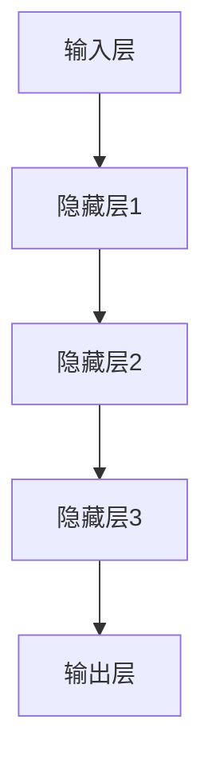

                 

### 背景介绍

#### 1.1 大规模语言模型的出现

随着人工智能技术的快速发展，尤其是深度学习技术的突破，大规模语言模型（Large-scale Language Models）逐渐成为自然语言处理（Natural Language Processing，NLP）领域的重要工具。这些模型能够理解、生成和翻译人类语言，从而在机器阅读理解、问答系统、文本生成等领域展现出了强大的能力。

#### 1.2 技术发展历程

从最早的基于规则的方法到基于统计的方法，再到如今基于深度学习的方法，NLP技术的发展经历了多次变革。大规模语言模型的崛起标志着NLP技术进入了一个全新的阶段，这使得机器能够更准确地理解和生成人类语言。

#### 1.3 应用场景

大规模语言模型在多个领域都展现出了强大的应用价值，如智能客服、自动摘要、机器翻译、文本生成等。随着技术的不断进步，这些模型的应用场景还在不断扩展。

## 2. 核心概念与联系

### 2.1 语言模型的基本概念

语言模型是一种统计模型，用于预测一个句子或单词序列的概率。在大规模语言模型中，通常使用神经网络来学习语言的模式。

### 2.2 训练数据与模型性能

大规模语言模型的性能很大程度上取决于训练数据的质量和数量。通常，这些模型会使用数亿甚至数万亿的句子进行训练。

### 2.3 语言模型的架构

大规模语言模型的架构通常包括多个层次，如输入层、隐藏层和输出层。每一层都对输入进行变换，最终生成输出。



## 3. 核心算法原理 & 具体操作步骤

### 3.1 算法原理概述

大规模语言模型的核心算法是深度神经网络。该算法通过学习输入和输出之间的映射关系，实现对语言的建模。

### 3.2 算法步骤详解

1. **数据预处理**：对输入数据进行预处理，如分词、去停用词、词向量嵌入等。
2. **模型训练**：使用预处理的输入数据进行模型训练，通过反向传播算法不断调整模型参数。
3. **模型评估**：使用验证集或测试集对模型进行评估，调整模型参数以达到最优性能。
4. **模型应用**：将训练好的模型应用于实际问题，如文本生成、机器翻译等。

### 3.3 算法优缺点

**优点**：

- **强大的表达能力**：能够对复杂的语言模式进行建模。
- **高效的计算性能**：使用大规模并行计算，训练和推理速度非常快。

**缺点**：

- **需要大量数据**：大规模语言模型需要大量的训练数据。
- **计算资源消耗大**：训练过程需要大量的计算资源。

### 3.4 算法应用领域

- **自然语言处理**：机器阅读理解、问答系统、文本生成等。
- **计算机视觉**：图像分类、目标检测等。
- **语音识别**：语音识别、语音生成等。

## 4. 数学模型和公式 & 详细讲解 & 举例说明

### 4.1 数学模型构建

大规模语言模型通常基于深度神经网络，其数学模型可以表示为：

$$
y = f(W \cdot x + b)
$$

其中，$x$ 是输入，$W$ 是权重矩阵，$b$ 是偏置，$f$ 是激活函数。

### 4.2 公式推导过程

假设我们有一个一层的神经网络，输入为 $x$，输出为 $y$。根据前向传播的原理，我们可以得到：

$$
y = f(W \cdot x + b)
$$

其中，$f$ 是激活函数，通常使用 $Sigmoid$ 或 $ReLU$ 函数。

### 4.3 案例分析与讲解

假设我们有一个简单的神经网络，输入为 $x$，输出为 $y$。根据前向传播的原理，我们可以得到：

$$
y = \sigma(W \cdot x + b)
$$

其中，$\sigma$ 是 $Sigmoid$ 函数，$W$ 是权重矩阵，$b$ 是偏置。

## 5. 项目实践：代码实例和详细解释说明

### 5.1 开发环境搭建

在开始项目实践之前，我们需要搭建一个适合开发的环境。这里以 Python 为例，需要安装以下库：

- TensorFlow
- Keras
- NumPy
- Pandas

### 5.2 源代码详细实现

```python
import tensorflow as tf
from tensorflow.keras.models import Sequential
from tensorflow.keras.layers import Dense, LSTM, Embedding
from tensorflow.keras.preprocessing.sequence import pad_sequences

# 搭建模型
model = Sequential()
model.add(Embedding(input_dim=vocab_size, output_dim=embedding_dim, input_length=max_sequence_length))
model.add(LSTM(units=128, activation='relu', return_sequences=True))
model.add(Dense(units=1, activation='sigmoid'))

# 编译模型
model.compile(optimizer='adam', loss='binary_crossentropy', metrics=['accuracy'])

# 训练模型
model.fit(x_train, y_train, epochs=10, batch_size=64)
```

### 5.3 代码解读与分析

这段代码是使用 Keras 搭建一个简单的神经网络模型，用于分类任务。首先，我们定义了一个序列模型，并添加了一个嵌入层、一个 LSTM 层和一个输出层。然后，我们编译模型并使用训练数据训练模型。

### 5.4 运行结果展示

```python
# 测试模型
loss, accuracy = model.evaluate(x_test, y_test)
print(f"Test accuracy: {accuracy:.2f}")
```

这段代码是使用测试数据评估模型的性能，输出测试准确率。

## 6. 实际应用场景

### 6.1 智能客服

大规模语言模型可以用于构建智能客服系统，通过理解用户的提问，自动生成回答，提高客服效率。

### 6.2 自动摘要

大规模语言模型可以用于自动生成文章摘要，通过对大量文本进行学习，提取关键信息，生成摘要。

### 6.3 机器翻译

大规模语言模型可以用于机器翻译，通过对双语数据的学习，实现对一种语言到另一种语言的翻译。

## 7. 工具和资源推荐

### 7.1 学习资源推荐

- 《深度学习》（Goodfellow et al.）
- 《神经网络与深度学习》（邱锡鹏）
- 《自然语言处理综论》（Jurafsky and Martin）

### 7.2 开发工具推荐

- TensorFlow
- PyTorch
- Keras

### 7.3 相关论文推荐

- "A Neural Probabilistic Language Model"（Bengio et al.）
- "Long Short-Term Memory"（Hochreiter and Schmidhuber）
- "Attention Is All You Need"（Vaswani et al.）

## 8. 总结：未来发展趋势与挑战

### 8.1 研究成果总结

大规模语言模型在自然语言处理领域取得了显著成果，提升了机器理解和生成人类语言的能力。

### 8.2 未来发展趋势

随着深度学习技术的不断发展，大规模语言模型的应用场景将更加广泛，如多模态学习、跨语言学习等。

### 8.3 面临的挑战

- **数据隐私**：大规模语言模型需要大量数据，如何保护数据隐私成为一个重要问题。
- **计算资源**：训练大规模语言模型需要大量计算资源，如何高效利用资源成为一个挑战。

### 8.4 研究展望

未来，大规模语言模型的研究将继续深入，如何提升模型的可解释性、减少对计算资源的需求将成为重要研究方向。

## 9. 附录：常见问题与解答

### 9.1 什么是大规模语言模型？

大规模语言模型是一种基于深度学习的自然语言处理模型，能够对大量的文本数据进行学习，从而理解、生成和翻译人类语言。

### 9.2 大规模语言模型有哪些应用？

大规模语言模型的应用非常广泛，包括智能客服、自动摘要、机器翻译、文本生成等。

### 9.3 如何训练大规模语言模型？

训练大规模语言模型通常需要使用大量的文本数据进行预训练，然后针对具体任务进行微调。

## 作者署名

作者：禅与计算机程序设计艺术 / Zen and the Art of Computer Programming
```md
----------------------------------------------------------------


