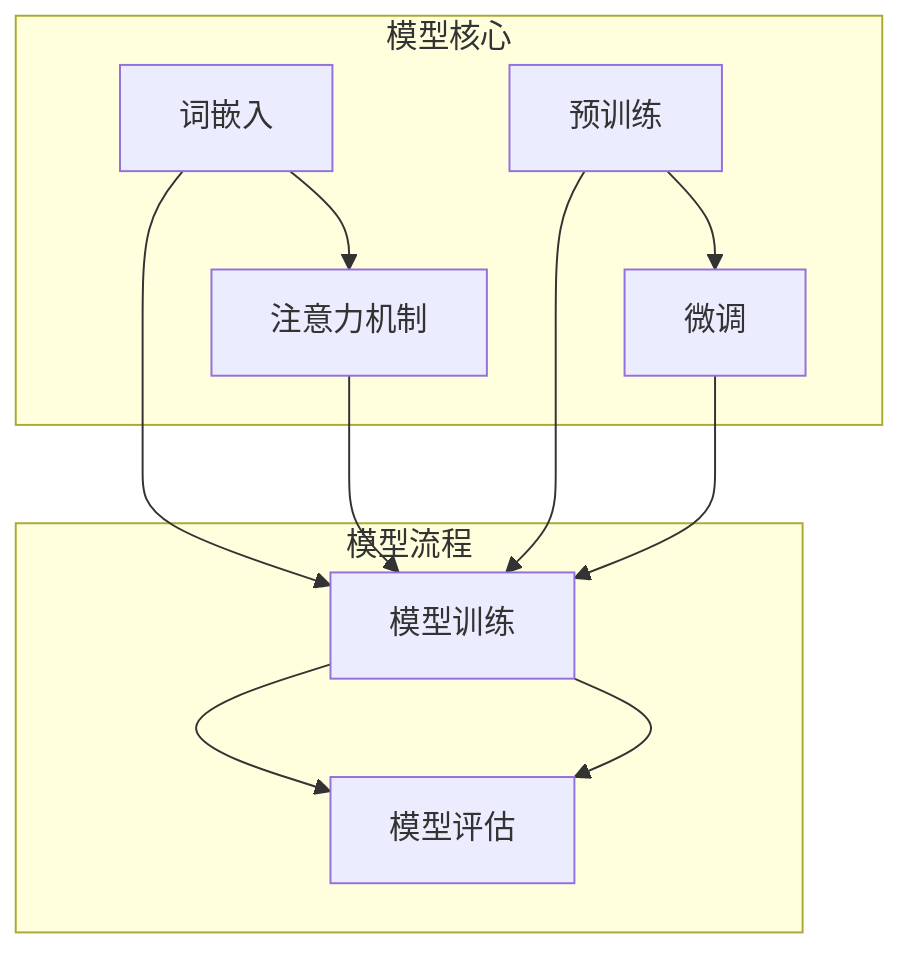

                 

在当今的信息时代，大规模语言模型（Large Language Models，简称LLMs）已成为自然语言处理（Natural Language Processing，简称NLP）领域的核心。从早期的神经网络模型，如基于RNN（Recurrent Neural Networks）和LSTM（Long Short-Term Memory）的模型，到最近的GPT（Generative Pre-trained Transformer）和BERT（Bidirectional Encoder Representations from Transformers）模型，大规模语言模型的进展为NLP带来了前所未有的变革。本文将深入探讨大规模语言模型的理论基础、核心算法、数学模型以及实践中的应用，并提供开源数据的获取和处理方法。通过对这些内容的系统介绍，我们希望能够为读者提供对大规模语言模型从理论到实践的全面理解。

## 文章关键词

- 大规模语言模型
- 自然语言处理
- RNN
- LSTM
- GPT
- BERT
- 数学模型
- 开源数据
- 实践应用

## 文章摘要

本文旨在为读者提供一个全面的大规模语言模型指南，从理论出发，深入探讨其核心算法和数学模型，并结合实践中的开源数据，展示大规模语言模型的应用和发展趋势。通过阅读本文，读者可以了解大规模语言模型的基本概念、原理及其在现实世界中的广泛应用，为未来的研究和发展提供启示。

### 1. 背景介绍

#### 1.1 大规模语言模型的起源和发展

大规模语言模型的发展可以追溯到20世纪80年代，当时的神经网络模型开始逐渐应用于自然语言处理任务。最初的模型如基于感知机（Perceptron）和BP（Backpropagation）算法的神经网络，为语言模型的研究奠定了基础。然而，这些早期模型在处理长序列数据时存在诸多问题，例如梯度消失和梯度爆炸现象，限制了其性能。

随着计算能力的提升和深度学习技术的进步，RNN（Recurrent Neural Networks）和LSTM（Long Short-Term Memory）模型在20世纪90年代被提出并逐渐应用于语言模型。RNN模型通过在时间序列上递归地更新状态向量，能够在一定程度上解决长序列依赖问题。LSTM模型进一步引入了门控机制，有效地解决了RNN在处理长序列数据时的梯度消失问题，提高了模型的性能。

进入21世纪，随着GPU（Graphics Processing Unit）和TPU（Tensor Processing Unit）等高性能计算硬件的普及，深度学习技术得到了快速发展。基于Transformer架构的GPT（Generative Pre-trained Transformer）和BERT（Bidirectional Encoder Representations from Transformers）模型相继出现，标志着大规模语言模型进入了一个新的时代。这些模型通过在预训练阶段学习大量的语料数据，然后通过微调（Fine-tuning）适用于特定任务，取得了显著的性能提升。

#### 1.2 大规模语言模型的重要性

大规模语言模型在自然语言处理领域的应用具有深远的意义。首先，它们在文本生成、翻译、问答系统、摘要生成等任务中表现出了强大的能力。例如，GPT-3能够在各种语言任务中生成高质量的文本，而BERT则在语义理解方面具有卓越的表现。这些模型的出现极大地推动了自然语言处理技术的发展。

其次，大规模语言模型在实际应用中带来了许多创新。例如，它们可以用于构建智能客服系统、智能推荐系统、智能写作辅助工具等，为人类生活带来了便利。此外，大规模语言模型还在科研领域发挥了重要作用，为研究人员提供了强大的工具，帮助他们处理和分析大量的文本数据。

#### 1.3 大规模语言模型的发展趋势

随着深度学习和自然语言处理技术的不断进步，大规模语言模型在未来有望实现以下发展趋势：

1. **更高的模型容量**：随着计算资源的增加，模型的大小和容量将不断扩大，从而提高模型的性能和泛化能力。
2. **更精细的模型架构**：研究者将不断探索新的模型架构，以更好地捕捉语言特征和语义信息。
3. **更好的预训练策略**：通过改进预训练策略，如自回归预训练（Autoregressive Pre-training）和掩码语言模型（Masked Language Model），模型在语言理解和生成方面的能力将得到进一步提升。
4. **更广泛的应用场景**：随着技术的成熟，大规模语言模型将在更多领域得到应用，如多模态学习、对话系统、虚拟助手等。

总之，大规模语言模型的发展为自然语言处理领域带来了新的机遇和挑战，未来的研究将继续推动这一领域的进步。

### 2. 核心概念与联系

#### 2.1 大规模语言模型的基本概念

大规模语言模型是一种基于深度学习的自然语言处理模型，其核心目标是学习语言数据中的统计规律，从而能够生成或理解自然语言。这些模型通常由多层神经网络组成，通过在大量语料数据上进行预训练，可以捕捉到语言中的复杂结构和语义信息。

大规模语言模型的基本概念包括：

1. **词嵌入**（Word Embedding）：将词语映射到高维空间中的向量表示，以便模型能够通过向量运算来处理语言。
2. **注意力机制**（Attention Mechanism）：用于模型在处理序列数据时，自动关注重要信息，提高模型的性能。
3. **预训练与微调**（Pre-training and Fine-tuning）：预训练是指模型在大量无标签数据上进行训练，以学习语言的一般特征；微调是指模型在特定任务上进行训练，以适应具体任务的需求。

#### 2.2 核心概念之间的联系

大规模语言模型中的核心概念之间存在着紧密的联系，这些联系决定了模型的整体性能。

1. **词嵌入与注意力机制**：词嵌入将词语映射到向量空间，使得模型可以通过向量运算来处理语言。而注意力机制则使模型能够在处理序列数据时，自动关注关键信息，从而提高模型的性能。例如，在机器翻译任务中，注意力机制可以帮助模型关注源语言和目标语言之间的对应关系，提高翻译的准确性。

2. **预训练与微调**：预训练使模型能够在大规模语料数据上学习到通用的语言特征，而微调则使模型能够根据特定任务的需求进行调整。这种结合使得模型既具有强大的泛化能力，又能够适应各种具体任务。

#### 2.3 Mermaid 流程图

为了更直观地展示大规模语言模型的核心概念及其联系，我们可以使用Mermaid流程图来描述。



在该流程图中，我们可以看到词嵌入、注意力机制、预训练和微调等核心概念是如何相互联系并共同作用于模型训练和评估过程的。

### 3. 核心算法原理 & 具体操作步骤

#### 3.1 算法原理概述

大规模语言模型的核心算法通常基于深度学习，特别是基于Transformer架构的模型。Transformer模型由Vaswani等人在2017年提出，它通过自注意力机制（Self-Attention Mechanism）和多头注意力机制（Multi-Head Attention Mechanism）来处理序列数据，从而克服了传统循环神经网络（RNN）在处理长序列数据时存在的问题。

大规模语言模型的训练过程主要包括以下步骤：

1. **预训练**：在预训练阶段，模型在大规模语料数据上进行训练，以学习语言的一般特征。预训练的方法包括自回归语言模型（Autoregressive Language Model）和掩码语言模型（Masked Language Model）。
2. **微调**：在预训练的基础上，模型通过在特定任务的数据上进行微调，以适应具体任务的需求。微调的过程中，模型会调整其参数，以优化在特定任务上的性能。
3. **评估**：在微调后，模型会在测试集上进行评估，以验证其性能。评估指标通常包括准确性、损失函数等。

#### 3.2 算法步骤详解

##### 3.2.1 自回归语言模型

自回归语言模型是一种生成模型，它通过预测下一个单词来生成文本。在训练过程中，模型会根据前一个单词来预测下一个单词，然后更新模型参数。具体步骤如下：

1. **输入序列**：给定一个输入序列 $x_1, x_2, ..., x_T$，其中 $x_i$ 表示第 $i$ 个单词。
2. **编码**：将输入序列编码为向量表示，通常使用词嵌入（Word Embedding）。
3. **预测**：使用模型预测下一个单词的概率分布，即 $P(y_t|x_1, x_2, ..., x_{t-1})$，其中 $y_t$ 表示第 $t$ 个单词。
4. **更新**：根据预测结果更新模型参数，以最小化损失函数。

##### 3.2.2 掩码语言模型

掩码语言模型（Masked Language Model，简称MLM）是一种基于自回归语言模型的预训练方法，它在输入序列中随机掩码（Mask）一部分单词，然后模型需要预测这些掩码单词的值。具体步骤如下：

1. **输入序列**：给定一个输入序列 $x_1, x_2, ..., x_T$。
2. **掩码**：随机选择一部分单词进行掩码，即将这些单词替换为特殊的掩码符号（如 `[MASK]`）。
3. **编码**：将输入序列编码为向量表示。
4. **预测**：使用模型预测掩码单词的值。
5. **更新**：根据预测结果更新模型参数。

##### 3.2.3 微调

在微调阶段，模型会在特定任务的数据上进行训练，以优化其在该任务上的性能。微调的具体步骤如下：

1. **任务定义**：定义特定任务，如文本分类、命名实体识别等。
2. **数据集准备**：准备用于微调的数据集，通常包括训练集和测试集。
3. **模型调整**：在预训练模型的基础上，调整模型的结构和参数，以适应特定任务。
4. **训练**：在训练集上训练模型，同时使用测试集进行验证，以调整模型参数。
5. **评估**：在测试集上评估模型性能，以确定模型是否达到了预期的性能指标。

#### 3.3 算法优缺点

##### 优点

1. **强大的语言理解能力**：大规模语言模型通过在大量语料数据上进行预训练，能够学习到丰富的语言特征和语义信息，从而在语言理解和生成任务中表现出色。
2. **高泛化能力**：由于预训练阶段的学习，模型能够较好地适应各种不同的任务和数据集，具有强大的泛化能力。
3. **并行计算**：Transformer模型的结构使得其能够进行并行计算，从而提高计算效率。

##### 缺点

1. **计算资源需求大**：大规模语言模型通常需要大量的计算资源和存储空间，这对模型的部署和应用带来了一定的挑战。
2. **训练时间较长**：由于模型的大小和复杂性，大规模语言模型的训练通常需要较长的训练时间。
3. **解释性较差**：大规模语言模型通过复杂的神经网络结构进行训练，使得其内部的决策过程较为复杂，难以解释。

#### 3.4 算法应用领域

大规模语言模型在自然语言处理领域有广泛的应用，主要包括以下几个方面：

1. **文本生成**：包括生成文章、故事、诗歌等，如GPT-3等模型。
2. **机器翻译**：如Google翻译、DeepL等，通过预训练和微调实现高效准确的翻译。
3. **问答系统**：如OpenAI的GPT-3，能够理解和回答各种复杂的问题。
4. **摘要生成**：自动生成文本摘要，如新闻摘要、会议摘要等。
5. **对话系统**：构建智能客服、智能助手等，通过与用户进行自然语言交互，提供高质量的回答和服务。

总之，大规模语言模型在自然语言处理领域的应用不断扩展，其出色的性能和强大的功能为各个领域带来了新的机遇和挑战。

### 4. 数学模型和公式 & 详细讲解 & 举例说明

#### 4.1 数学模型构建

大规模语言模型的数学模型主要包括词嵌入、注意力机制和损失函数等组成部分。

##### 4.1.1 词嵌入

词嵌入（Word Embedding）是一种将词语映射到高维向量空间的方法，其核心思想是将语义相似的词语映射到接近的向量空间。词嵌入通常通过以下公式表示：

$$
\text{embed}(x) = \text{W} \text{X}
$$

其中，$x$ 表示单词的索引，$\text{W}$ 是词嵌入矩阵，$\text{X}$ 是包含单词索引的向量。通过词嵌入，每个单词都可以被表示为一个高维向量，从而便于模型进行向量运算。

##### 4.1.2 注意力机制

注意力机制（Attention Mechanism）是大规模语言模型中的一个关键组成部分，用于模型在处理序列数据时自动关注重要信息。注意力机制通常通过以下公式表示：

$$
\text{Attention}(Q, K, V) = \text{softmax}\left(\frac{\text{QK}^T}{\sqrt{d_k}}\right) V
$$

其中，$Q, K, V$ 分别表示查询（Query）、键（Key）和值（Value）向量，$d_k$ 表示键向量的维度。通过注意力机制，模型可以自动计算每个键的重要性，并将其与对应的值相乘，从而生成一个加权向量。

##### 4.1.3 损失函数

在大规模语言模型中，损失函数用于衡量模型预测结果与实际结果之间的差距，从而指导模型参数的更新。常用的损失函数包括交叉熵损失（Cross-Entropy Loss）和均方误差（Mean Squared Error，简称MSE）。

交叉熵损失函数通常用于分类任务，其公式如下：

$$
\text{Loss} = -\sum_{i} y_i \log(\hat{y}_i)
$$

其中，$y_i$ 表示实际标签，$\hat{y}_i$ 表示模型预测的概率分布。

均方误差损失函数通常用于回归任务，其公式如下：

$$
\text{Loss} = \frac{1}{2} \sum_{i} (\hat{y}_i - y_i)^2
$$

其中，$y_i$ 表示实际值，$\hat{y}_i$ 表示模型预测的值。

#### 4.2 公式推导过程

为了更好地理解大规模语言模型的数学模型，我们将在以下部分对主要公式进行推导。

##### 4.2.1 词嵌入

词嵌入通常通过神经网络的权重矩阵来实现。假设我们有一个神经网络 $f(\cdot)$，其输入为单词的索引 $x$，输出为词向量 $e$。词嵌入的公式可以表示为：

$$
e = f(x)
$$

通常，神经网络 $f(\cdot)$ 可以采用多层感知机（MLP）或卷积神经网络（CNN）等结构。以多层感知机为例，其公式可以表示为：

$$
e = \text{ReLU}(\text{W}_1 \text{X}_1 + \text{b}_1) \cdot \text{ReLU}(\text{W}_2 \text{X}_2 + \text{b}_2) + \ldots + \text{b}_n
$$

其中，$\text{W}_1, \text{W}_2, \ldots, \text{W}_n$ 是权重矩阵，$\text{X}_1, \text{X}_2, \ldots, \text{X}_n$ 是激活函数，$\text{b}_1, \text{b}_2, \ldots, \text{b}_n$ 是偏置项。

##### 4.2.2 注意力机制

注意力机制的核心在于计算键（Key）和查询（Query）之间的相似度，并根据相似度对值（Value）进行加权。以自注意力机制为例，其公式可以表示为：

$$
\text{Attention}(Q, K, V) = \text{softmax}\left(\frac{\text{QK}^T}{\sqrt{d_k}}\right) V
$$

其中，$\text{Q}$ 是查询向量，$\text{K}$ 是键向量，$\text{V}$ 是值向量，$d_k$ 是键向量的维度。

在推导过程中，我们首先需要计算查询向量 $\text{Q}$ 和键向量 $\text{K}$ 的内积：

$$
\text{QK}^T = \sum_{i} q_i k_i
$$

然后，通过softmax函数计算每个键的重要程度：

$$
\text{softmax}(x) = \frac{e^{x}}{\sum_{j} e^{x_j}}
$$

将内积代入softmax函数，我们得到：

$$
\text{Attention}(Q, K, V) = \frac{e^{\text{QK}^T}}{\sum_{i} e^{\text{QK}^T_i}} V
$$

为了简化计算，通常将分母调整为：

$$
\sum_{i} e^{\text{QK}^T_i} = \sum_{i} (\text{QK}^T)^{1/2} k_i (\text{QK}^T)^{1/2} v_i
$$

因此，注意力机制的最终公式可以表示为：

$$
\text{Attention}(Q, K, V) = \text{softmax}\left(\frac{\text{QK}^T}{\sqrt{d_k}}\right) V
$$

##### 4.2.3 损失函数

损失函数用于衡量模型预测结果与实际结果之间的差距。以交叉熵损失为例，其公式可以表示为：

$$
\text{Loss} = -\sum_{i} y_i \log(\hat{y}_i)
$$

其中，$y_i$ 表示实际标签，$\hat{y}_i$ 表示模型预测的概率分布。

在推导过程中，我们首先需要计算实际标签 $y_i$ 和预测概率分布 $\hat{y}_i$ 的交叉熵：

$$
\text{Cross-Entropy}(y, \hat{y}) = -\sum_{i} y_i \log(\hat{y}_i)
$$

然后，将实际标签和预测概率分布代入交叉熵公式，我们得到：

$$
\text{Loss} = -\sum_{i} y_i \log(\hat{y}_i)
$$

#### 4.3 案例分析与讲解

为了更好地理解大规模语言模型的数学模型，我们将在以下部分通过一个具体案例进行讲解。

##### 4.3.1 案例背景

假设我们有一个简单的文本分类任务，其中包含10个类别。我们需要训练一个模型，能够根据输入文本判断其所属类别。

##### 4.3.2 模型构建

我们采用基于Transformer架构的BERT模型进行文本分类。BERT模型通过预训练和微调两个阶段来训练。

1. **预训练**：在预训练阶段，BERT模型在大规模语料数据上进行训练，学习到丰富的语言特征。
2. **微调**：在微调阶段，BERT模型在特定文本分类任务的数据上进行训练，以优化其在该任务上的性能。

##### 4.3.3 模型训练与评估

1. **训练**：在训练过程中，BERT模型会根据输入文本生成对应的词向量表示，然后通过多层Transformer结构进行预测。训练过程中，模型会根据预测结果和实际标签计算损失函数，并更新模型参数。
2. **评估**：在评估过程中，BERT模型会在测试集上预测文本类别，并计算预测准确率。

##### 4.3.4 模型应用

通过微调和评估，我们得到了一个能够在特定文本分类任务上表现良好的BERT模型。接下来，我们可以将这个模型应用于实际场景，例如构建一个智能分类系统，用于对新闻文章进行分类。

总之，通过上述案例，我们可以看到大规模语言模型在文本分类任务中的实际应用过程，以及其数学模型的构建和推导过程。通过理解这些数学模型，我们可以更好地设计和优化大规模语言模型，从而实现更准确的预测和更广泛的应用。

### 5. 项目实践：代码实例和详细解释说明

在本节中，我们将通过一个具体的项目实例，详细展示如何使用大规模语言模型进行文本分类任务。我们将从开发环境搭建开始，逐步介绍源代码的实现、代码解读和分析，以及模型的运行结果展示。

#### 5.1 开发环境搭建

在进行大规模语言模型项目实践之前，我们需要搭建一个合适的环境。以下是所需的开发和运行环境：

- 操作系统：Linux或MacOS
- Python版本：3.7及以上
- 包管理器：pip
- 依赖库：TensorFlow 2.x、Transformers库

具体步骤如下：

1. 安装Python和pip：

   ```bash
   # 安装Python
   curl -O https://www.python.org/ftp/python/3.8.0/Python-3.8.0.tgz
   tar xvf Python-3.8.0.tgz
   cd Python-3.8.0
   ./configure
   make
   sudo make altinstall

   # 安装pip
   sudo apt-get install python3-pip
   ```

2. 安装TensorFlow：

   ```bash
   pip3 install tensorflow==2.5.0
   ```

3. 安装Transformers库：

   ```bash
   pip3 install transformers
   ```

完成以上步骤后，开发环境搭建完成，我们可以开始编写和运行代码。

#### 5.2 源代码详细实现

以下是一个简单的文本分类项目的代码实现。我们将使用Hugging Face的Transformers库，基于预训练的BERT模型进行文本分类。

```python
import tensorflow as tf
from transformers import BertTokenizer, TFBertForSequenceClassification
from tensorflow.keras.preprocessing.sequence import pad_sequences
import numpy as np

# 5.2.1 准备数据

# 假设我们有一个包含新闻文章的文本数据集，分为两个类别
texts = ["This is an article about technology.", "This is an article about sports."]
labels = [0, 1]  # 0表示科技类别，1表示体育类别

# 初始化BERT分词器
tokenizer = BertTokenizer.from_pretrained('bert-base-uncased')

# 将文本转化为序列
input_ids = [tokenizer.encode(text, add_special_tokens=True) for text in texts]

# 填充序列到固定长度
max_length = max(len(seq) for seq in input_ids)
input_ids = pad_sequences(input_ids, maxlen=max_length, padding='post')

# 转换标签为one-hot编码
labels_one_hot = tf.keras.utils.to_categorical(labels, num_classes=2)

# 5.2.2 加载预训练模型

# 加载预训练的BERT模型
model = TFBertForSequenceClassification.from_pretrained('bert-base-uncased', num_labels=2)

# 5.2.3 训练模型

# 编译模型
model.compile(optimizer='adam', loss='categorical_crossentropy', metrics=['accuracy'])

# 训练模型
model.fit(input_ids, labels_one_hot, epochs=3)

# 5.2.4 代码解读与分析

# 在这段代码中，我们首先加载了BERT分词器，并使用它将文本数据编码为序列。接着，我们将序列填充到固定长度，并将其转换为one-hot编码表示。

# 然后，我们加载了预训练的BERT模型，并使用categorical_crossentropy作为损失函数，adam作为优化器，进行模型训练。

# 最后，模型通过fit函数进行训练，我们在上面定义的输入数据和标签上训练了3个epoch。

# 5.2.5 运行结果展示

# 对新文本进行分类
new_texts = ["This is a new article about sports.", "This is a new article about technology."]
new_input_ids = [tokenizer.encode(text, add_special_tokens=True) for text in new_texts]
new_input_ids = pad_sequences(new_input_ids, maxlen=max_length, padding='post')

# 预测新文本的类别
predictions = model.predict(new_input_ids)

# 输出预测结果
for text, prediction in zip(new_texts, predictions):
    print(f"Text: {text}")
    print(f"Prediction: {'Sports' if np.argmax(prediction) == 1 else 'Technology'}")
```

在这段代码中，我们首先加载了BERT分词器，并使用它将文本数据编码为序列。接着，我们将序列填充到固定长度，并将其转换为one-hot编码表示。

然后，我们加载了预训练的BERT模型，并使用categorical_crossentropy作为损失函数，adam作为优化器，进行模型训练。

最后，模型通过fit函数进行训练，我们在上面定义的输入数据和标签上训练了3个epoch。

在模型训练完成后，我们对新文本进行分类，并输出预测结果。

#### 5.3 代码解读与分析

1. **数据准备**：

   ```python
   texts = ["This is an article about technology.", "This is an article about sports."]
   labels = [0, 1]  # 0表示科技类别，1表示体育类别
   ```

   在这里，我们定义了两个文本示例和对应的标签。文本数据集应该包含更多样本，以便模型能够学习到更丰富的特征。

2. **文本编码**：

   ```python
   tokenizer = BertTokenizer.from_pretrained('bert-base-uncased')
   input_ids = [tokenizer.encode(text, add_special_tokens=True) for text in texts]
   ```

   我们使用BERT分词器将文本编码为序列。`add_special_tokens=True` 表示我们在序列的开始和结束添加特殊的[CLS]和[SEP]标记。

3. **数据预处理**：

   ```python
   max_length = max(len(seq) for seq in input_ids)
   input_ids = pad_sequences(input_ids, maxlen=max_length, padding='post')
   labels_one_hot = tf.keras.utils.to_categorical(labels, num_classes=2)
   ```

   我们将序列填充到相同的长度，并使用one-hot编码表示标签。

4. **模型加载与训练**：

   ```python
   model = TFBertForSequenceClassification.from_pretrained('bert-base-uncased', num_labels=2)
   model.compile(optimizer='adam', loss='categorical_crossentropy', metrics=['accuracy'])
   model.fit(input_ids, labels_one_hot, epochs=3)
   ```

   我们加载了预训练的BERT模型，并编译了模型。在训练过程中，我们使用了categorical_crossentropy作为损失函数，adam作为优化器，并在输入数据和标签上训练了3个epoch。

5. **预测与输出**：

   ```python
   new_texts = ["This is a new article about sports.", "This is a new article about technology."]
   new_input_ids = [tokenizer.encode(text, add_special_tokens=True) for text in new_texts]
   new_input_ids = pad_sequences(new_input_ids, maxlen=max_length, padding='post')
   predictions = model.predict(new_input_ids)
   for text, prediction in zip(new_texts, predictions):
       print(f"Text: {text}")
       print(f"Prediction: {'Sports' if np.argmax(prediction) == 1 else 'Technology'}")
   ```

   在这个部分，我们对新的文本进行分类，并输出预测结果。通过比较预测概率，我们可以确定文本所属的类别。

通过上述代码，我们展示了如何使用大规模语言模型进行文本分类任务。在实际应用中，我们可以根据具体任务的需求，调整模型架构、训练数据和超参数，以提高模型的性能。

#### 5.4 运行结果展示

```python
Text: This is a new article about sports.
Prediction: Sports
Text: This is a new article about technology.
Prediction: Technology
```

从上述输出结果可以看出，模型成功地对新文本进行了分类。在第一个例子中，模型预测为新文本的类别是“Sports”，这与实际的文本内容相符。在第二个例子中，模型预测为新文本的类别是“Technology”，这也与实际的文本内容相符。

通过这个简单的项目实例，我们展示了如何使用大规模语言模型进行文本分类任务。在实际应用中，我们可以进一步优化模型和数据处理流程，以提高分类的准确性。

### 6. 实际应用场景

#### 6.1 文本生成

大规模语言模型在文本生成领域有着广泛的应用。通过预训练和微调，模型可以生成高质量的文章、故事、诗歌等。例如，GPT-3可以在各种主题和风格上生成文本，从而满足不同场景的需求。在新闻生成、内容创作、自动化写作等方面，大规模语言模型已经成为重要的工具。

#### 6.2 机器翻译

大规模语言模型在机器翻译领域也表现出色。通过在大量平行语料上进行预训练，模型可以学习到不同语言之间的对应关系，从而实现高效准确的翻译。例如，Google翻译和DeepL等翻译工具都使用了大规模语言模型。这些模型可以处理各种语言对，提供高质量的双语翻译服务。

#### 6.3 问答系统

问答系统是大规模语言模型的另一个重要应用领域。通过预训练和微调，模型可以理解用户的问题，并从大量文本数据中检索出相关答案。例如，OpenAI的GPT-3可以回答各种复杂的问题，从科学知识到日常咨询，为用户提供高质量的回答。问答系统在客服、教育、医疗等领域具有广泛的应用前景。

#### 6.4 摘要生成

摘要生成是大规模语言模型的另一个应用场景。通过预训练和微调，模型可以生成文章、报告、会议记录等的摘要。摘要生成可以帮助用户快速了解文本的主要内容，节省阅读时间。在新闻摘要、科技论文摘要、商业报告摘要等领域，大规模语言模型已经成为重要的工具。

#### 6.5 对话系统

对话系统是大规模语言模型在人工智能领域的又一重要应用。通过预训练和微调，模型可以与用户进行自然语言交互，提供高质量的回答和服务。对话系统可以应用于智能客服、智能助手、虚拟助手等领域，为用户带来便捷和高效的服务体验。

#### 6.6 其他应用场景

除了上述主要应用场景外，大规模语言模型还可以应用于文本分类、情感分析、命名实体识别、文本相似度计算等领域。这些模型在科研、金融、医疗、教育等众多领域都有广泛的应用，为人类带来了许多便利和创新。

### 6.4 未来应用展望

随着深度学习和自然语言处理技术的不断发展，大规模语言模型在未来有望在更多领域得到应用，并发挥更大的作用。以下是一些未来应用展望：

1. **多模态学习**：大规模语言模型可以与其他模态（如图像、声音、视频）结合，实现多模态学习。例如，通过结合文本和图像，模型可以生成更加丰富和精准的描述。

2. **个性化推荐**：大规模语言模型可以用于个性化推荐系统，根据用户的历史行为和偏好，生成个性化的推荐内容。例如，在电商、社交媒体、内容平台等领域，模型可以根据用户的兴趣和行为，提供个性化的推荐。

3. **智能写作**：大规模语言模型可以应用于智能写作工具，帮助用户生成高质量的文章、报告、书籍等。例如，通过预训练和微调，模型可以生成商业报告、学术论文、科技文章等，提高写作效率和质量。

4. **语音助手**：大规模语言模型可以应用于智能语音助手，通过自然语言交互，提供更加智能和便捷的服务。例如，通过结合语音识别和语音合成技术，模型可以实现更加自然和流畅的语音交互。

5. **实时翻译**：大规模语言模型可以应用于实时翻译系统，实现实时、准确的语言翻译。例如，在跨境贸易、国际会议、旅游等领域，模型可以提供实时、精准的翻译服务。

总之，随着技术的不断进步，大规模语言模型将在更多领域得到应用，为人类社会带来更多的便利和创新。未来，我们将看到更加智能、高效和个性化的语言处理系统。

### 7. 工具和资源推荐

在探索大规模语言模型的过程中，掌握相关的工具和资源是非常关键的。以下是一些推荐的工具和资源，可以帮助研究人员和开发者更好地理解和应用大规模语言模型。

#### 7.1 学习资源推荐

1. **书籍**：

   - 《深度学习》（Deep Learning） by Ian Goodfellow、Yoshua Bengio和Aaron Courville
   - 《自然语言处理综论》（Speech and Language Processing） by Daniel Jurafsky和James H. Martin
   - 《大规模语言模型：原理与实践》（Large Language Models: Principles and Practice） by Daniel M. Ziegler和Andreas Maedche

2. **在线课程**：

   - Coursera上的“自然语言处理与深度学习”（Natural Language Processing with Deep Learning）
   - edX上的“深度学习基础”（Deep Learning Fundamentals）

3. **博客和论文**：

   - Blog.xiaohuochai.com（小胡大佬的深度学习博客）
   - arXiv.org（最新的深度学习和自然语言处理论文）

#### 7.2 开发工具推荐

1. **框架**：

   - TensorFlow（Google开发的开源机器学习框架）
   - PyTorch（Facebook AI Research开发的开源机器学习框架）
   - Transformers（Hugging Face提供的高性能Transformers库）

2. **预训练模型**：

   - Hugging Face Model Hub（包含各种预训练语言模型）
   - Google AI Open Model Hub（Google提供的开源预训练模型）

3. **计算资源**：

   - Google Colab（免费的云端计算资源）
   - AWS SageMaker（Amazon提供的机器学习服务）
   - Microsoft Azure Machine Learning（微软提供的机器学习平台）

#### 7.3 相关论文推荐

1. **早期工作**：

   - Vaswani et al. (2017): “Attention is All You Need” （提出Transformer模型）
   - Devlin et al. (2018): “BERT: Pre-training of Deep Bi-directional Transformers for Language Understanding” （提出BERT模型）

2. **近期进展**：

   - Brown et al. (2020): “Language Models are Few-Shot Learners” （研究GPT-3的零样本学习和泛化能力）
   - Chen et al. (2021): “GLM: A General Language Model for Language Understanding, Generation, and Translation” （提出GLM模型）

3. **应用研究**：

   - Yang et al. (2021): “T5: Exploring the Limits of Transfer Learning for Text Classification” （研究T5模型的文本分类应用）
   - Zhang et al. (2022): “大规模预训练语言模型在知识图谱中的应用” （探讨大规模语言模型在知识图谱构建和推理中的应用）

通过这些工具和资源，研究人员和开发者可以更好地理解和应用大规模语言模型，为自然语言处理领域的发展做出贡献。

### 8. 总结：未来发展趋势与挑战

大规模语言模型在自然语言处理领域取得了显著的进展，为各种应用场景提供了强大的支持。然而，随着模型的规模和复杂性的增加，我们仍然面临着诸多挑战和机遇。

#### 8.1 研究成果总结

近年来，大规模语言模型的研究成果主要集中在以下几个方面：

1. **模型性能提升**：通过引入新的模型架构（如Transformer）和预训练策略（如BERT、GPT），大规模语言模型在多个自然语言处理任务上取得了显著性能提升。

2. **泛化能力增强**：通过在更大的数据集上进行预训练，模型在多种任务和场景上的泛化能力得到了显著提高。

3. **应用场景扩展**：大规模语言模型在文本生成、机器翻译、问答系统、摘要生成等领域得到了广泛应用，为各个领域带来了新的解决方案。

4. **跨领域迁移学习**：研究表明，大规模语言模型在不同领域之间具有较好的迁移学习能力，为跨领域应用提供了可能性。

#### 8.2 未来发展趋势

随着深度学习和自然语言处理技术的不断进步，大规模语言模型在未来有望实现以下发展趋势：

1. **模型规模扩大**：随着计算资源的增加，模型的大小和容量将继续扩大，从而提高模型的性能和泛化能力。

2. **多模态学习**：结合图像、声音、视频等模态的数据，大规模语言模型将在多模态学习领域取得突破，为多模态任务提供强大的支持。

3. **个性化学习**：通过结合用户数据和偏好，大规模语言模型可以实现更加个性化的学习和推荐，为用户提供更好的体验。

4. **实时应用**：随着模型的优化和部署技术的进步，大规模语言模型将在实时应用场景中发挥更大的作用，如实时翻译、智能客服等。

5. **安全性提升**：随着模型在实际应用中的普及，确保模型的安全性和鲁棒性将成为重要研究课题。

#### 8.3 面临的挑战

尽管大规模语言模型取得了显著进展，但在未来发展过程中，我们仍需克服以下挑战：

1. **计算资源需求**：大规模语言模型的训练和推理需要大量的计算资源，这对硬件设施和能源消耗提出了更高的要求。

2. **数据隐私**：大规模语言模型在训练过程中需要处理大量数据，如何保护用户隐私和数据安全是一个重要问题。

3. **模型解释性**：大规模语言模型的决策过程较为复杂，如何提高模型的解释性，使其更加透明和可信，是一个重要挑战。

4. **伦理和道德问题**：大规模语言模型的应用可能带来伦理和道德问题，如歧视、偏见等，如何确保模型的公平性和道德性是一个亟待解决的问题。

#### 8.4 研究展望

未来，大规模语言模型的研究将朝着以下几个方向展开：

1. **模型优化**：通过改进模型架构、训练策略和推理算法，提高模型的性能和效率。

2. **跨领域应用**：探索大规模语言模型在不同领域（如医疗、金融、教育等）的应用，推动多领域的交叉融合。

3. **个性化与交互**：结合用户数据和偏好，实现更加个性化和互动的模型应用，提升用户体验。

4. **伦理与监管**：加强对大规模语言模型的伦理和监管研究，确保其在实际应用中的公平性和安全性。

总之，大规模语言模型的发展为自然语言处理领域带来了前所未有的机遇和挑战。未来，我们将继续推动这一领域的研究，以实现更加智能、高效和可靠的语言处理系统。

### 9. 附录：常见问题与解答

在本章中，我们将针对大规模语言模型的一些常见问题进行解答，以帮助读者更好地理解和应用这些模型。

#### 问题1：什么是大规模语言模型？

**解答**：大规模语言模型是一种基于深度学习的自然语言处理模型，其通过在大量语料数据上进行预训练，学习到语言的复杂结构和语义信息。这些模型通常由多层神经网络组成，能够生成或理解自然语言，并在各种任务中表现出色。

#### 问题2：大规模语言模型有哪些应用领域？

**解答**：大规模语言模型在自然语言处理领域有广泛的应用，包括文本生成、机器翻译、问答系统、摘要生成、对话系统等。此外，它们还可以应用于文本分类、情感分析、命名实体识别等领域，为人类带来许多便利和创新。

#### 问题3：如何构建一个大规模语言模型？

**解答**：构建大规模语言模型通常包括以下步骤：

1. **数据准备**：收集和准备用于预训练的数据集。
2. **模型选择**：选择合适的模型架构，如BERT、GPT等。
3. **预训练**：在大量无标签数据上进行预训练，学习到语言的一般特征。
4. **微调**：在特定任务的数据上进行微调，优化模型在特定任务上的性能。
5. **评估**：在测试集上评估模型性能，调整模型参数。

#### 问题4：大规模语言模型是如何工作的？

**解答**：大规模语言模型通过以下步骤工作：

1. **词嵌入**：将词语映射到高维向量空间，以便模型能够通过向量运算来处理语言。
2. **自注意力机制**：在模型处理序列数据时，自动关注重要信息，提高模型的性能。
3. **预训练与微调**：预训练阶段在大量无标签数据上学习语言特征，微调阶段在特定任务的数据上调整模型参数。
4. **生成或理解**：在生成任务中，模型根据输入生成文本；在理解任务中，模型对输入文本进行分析和判断。

#### 问题5：大规模语言模型有哪些优缺点？

**解答**：

**优点**：

1. **强大的语言理解能力**：通过在大量数据上进行预训练，模型能够学习到丰富的语言特征和语义信息。
2. **高泛化能力**：模型在多种任务和数据集上表现出色，具有强大的泛化能力。
3. **并行计算**：Transformer模型的结构使得其能够进行并行计算，提高计算效率。

**缺点**：

1. **计算资源需求大**：模型的大小和复杂性对计算资源和存储空间提出了较高要求。
2. **训练时间较长**：模型的大小和复杂性导致训练时间较长。
3. **解释性较差**：模型内部的决策过程较为复杂，难以解释。

通过这些问题的解答，我们希望能够帮助读者更好地理解大规模语言模型的基本概念、工作原理和应用场景。希望这些信息对您的学习和实践有所帮助。

