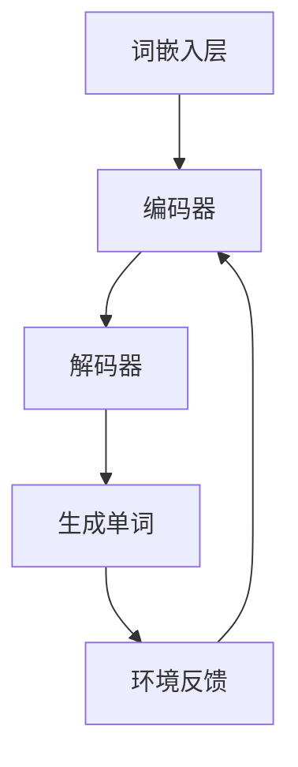

                 

关键词：大规模语言模型，深度学习，强化学习，自然语言处理，模型优化，应用场景

> 摘要：本文将深入探讨大规模语言模型的原理、实现和应用，特别是强化学习在语言模型优化中的作用。通过理论讲解和实践案例，帮助读者全面了解这一前沿技术，并展望其未来发展。

## 1. 背景介绍

随着互联网和大数据的快速发展，自然语言处理（NLP）成为了计算机科学中的一个重要分支。而大规模语言模型，作为NLP的核心工具，已经广泛应用于信息检索、机器翻译、文本生成等领域。然而，如何优化这些模型，使其在复杂环境中表现更好，仍然是当前研究的热点问题。

### 1.1 大规模语言模型的现状

近年来，深度学习在NLP领域取得了显著的进展。以BERT、GPT-3为代表的预训练模型，通过在海量数据上进行预训练，获得了惊人的语言理解和生成能力。这些模型不仅提高了NLP任务的性能，还为许多实际应用提供了强大的支持。

### 1.2 强化学习的重要性

强化学习是一种通过试错和反馈来学习最优策略的机器学习方法。与传统的监督学习和无监督学习不同，强化学习通过与环境交互，不断调整策略，以实现长期目标的最优化。在语言模型优化中，强化学习可以提供一种动态调整策略的方法，从而提高模型的性能和泛化能力。

## 2. 核心概念与联系

### 2.1 大规模语言模型的原理

大规模语言模型通常基于深度神经网络，通过多层非线性变换来捕捉语言的复杂结构。具体来说，模型包括词嵌入层、编码器、解码器等组成部分。

- **词嵌入层**：将输入的单词映射到高维向量空间中，使得具有相似含义的单词在向量空间中靠近。
- **编码器**：将输入序列编码成一个固定长度的向量表示，这个向量包含了序列的上下文信息。
- **解码器**：根据编码器的输出和之前的预测，生成下一个输出。

### 2.2 强化学习的原理

强化学习由四个核心部分组成：环境（Environment）、代理（Agent）、状态（State）和动作（Action）。代理通过与环境交互，不断更新策略，以实现最优目标。

- **环境**：模型运行的环境，可以是真实世界或模拟环境。
- **代理**：执行动作、感知状态的实体，即大规模语言模型。
- **状态**：代理当前所处的环境状态，如输入序列、模型参数等。
- **动作**：代理可以执行的动作，如生成下一个单词、更新模型参数等。

### 2.3 Mermaid 流程图



## 3. 核心算法原理 & 具体操作步骤

### 3.1 算法原理概述

大规模语言模型的优化主要依赖于预训练和微调两个步骤。预训练通过在大规模语料库上训练模型，使其具备基本的语言理解和生成能力。微调则在特定任务上对模型进行调整，以提高其在实际应用中的性能。

强化学习在大规模语言模型优化中的应用，主要是通过动态调整模型参数，以优化模型的生成策略。具体来说，代理通过与环境交互，不断更新模型参数，以实现长期目标的最优化。

### 3.2 算法步骤详解

1. **初始化**：设定代理的初始状态，包括词嵌入层、编码器和解码器的参数。
2. **预训练**：在大规模语料库上训练模型，使代理具备基本的语言理解和生成能力。
3. **微调**：在特定任务上对模型进行微调，以提高模型在任务上的性能。
4. **强化学习**：代理通过与环境交互，不断更新模型参数，优化生成策略。
5. **评估**：使用评估指标（如BLEU、ROUGE等）对模型性能进行评估。

### 3.3 算法优缺点

- **优点**：强化学习可以动态调整模型参数，提高模型在复杂环境中的性能和泛化能力。
- **缺点**：强化学习需要大量的计算资源和时间，且可能陷入局部最优。

### 3.4 算法应用领域

大规模语言模型和强化学习在多个领域具有广泛应用，如：

- **信息检索**：用于生成关键词、摘要和推荐系统。
- **机器翻译**：用于生成高质量的双语句子。
- **文本生成**：用于生成故事、新闻和文章。

## 4. 数学模型和公式 & 详细讲解 & 举例说明

### 4.1 数学模型构建

大规模语言模型的数学模型主要包括词嵌入、编码器、解码器和损失函数。

- **词嵌入**：将单词映射到高维向量空间，如 $v_w = W \cdot e(w)$。
- **编码器**：将输入序列编码成一个固定长度的向量表示，如 $h = \sigma(W_h \cdot [h_{\text{prev}}, x])$。
- **解码器**：根据编码器的输出和之前的预测，生成下一个输出，如 $p(x_t | x_{<t}) = \text{softmax}(W_v \cdot h)$。
- **损失函数**：用于衡量模型预测与真实标签之间的差距，如 $L = -\sum_{t} \log p(x_t | x_{<t})$。

### 4.2 公式推导过程

大规模语言模型的优化过程可以看作是一个迭代优化过程。在每次迭代中，模型参数通过梯度下降法进行更新，以最小化损失函数。

$$\theta_{t+1} = \theta_t - \alpha \cdot \nabla_{\theta_t} L$$

其中，$\theta_t$表示第$t$次迭代的模型参数，$\alpha$为学习率，$\nabla_{\theta_t} L$为损失函数关于模型参数的梯度。

### 4.3 案例分析与讲解

假设我们有一个文本生成任务，输入序列为“The cat sat on the mat”，我们需要使用大规模语言模型生成下一个单词。

1. **初始化**：设定代理的初始状态，包括词嵌入层、编码器和解码器的参数。
2. **预训练**：在大规模语料库上训练模型，使代理具备基本的语言理解和生成能力。
3. **微调**：在特定任务上对模型进行微调，以提高模型在任务上的性能。
4. **强化学习**：代理通过与环境交互，不断更新模型参数，优化生成策略。
5. **评估**：使用评估指标（如BLEU、ROUGE等）对模型性能进行评估。

在生成下一个单词时，模型会根据当前的状态和预测分布，选择一个概率最高的单词作为输出。例如，当前输入序列为“The cat sat on the mat”，模型预测的下一个单词为“the”，则输出序列为“The cat sat on the mat the”。

## 5. 项目实践：代码实例和详细解释说明

### 5.1 开发环境搭建

1. 安装Python环境（Python 3.6及以上版本）。
2. 安装TensorFlow或PyTorch框架。
3. 准备大规模语料库，如维基百科、新闻文章等。

### 5.2 源代码详细实现

以下是一个使用PyTorch实现大规模语言模型的示例代码：

```python
import torch
import torch.nn as nn
import torch.optim as optim
from torch.utils.data import DataLoader
from torchvision import datasets, transforms

# 加载和处理数据
# ...

# 定义模型
class LanguageModel(nn.Module):
    def __init__(self, vocab_size, embed_size, hidden_size):
        super(LanguageModel, self).__init__()
        self.embedding = nn.Embedding(vocab_size, embed_size)
        self.lstm = nn.LSTM(embed_size, hidden_size)
        self.decoder = nn.Linear(hidden_size, vocab_size)

    def forward(self, x, hidden):
        x = self.embedding(x)
        output, hidden = self.lstm(x, hidden)
        output = self.decoder(output[-1, :, :])
        return output, hidden

# 初始化模型参数
model = LanguageModel(vocab_size, embed_size, hidden_size)
optimizer = optim.Adam(model.parameters(), lr=learning_rate)
criterion = nn.CrossEntropyLoss()

# 训练模型
for epoch in range(num_epochs):
    for x, y in DataLoader(dataset, batch_size=batch_size):
        # 前向传播
        output, hidden = model(x)
        loss = criterion(output, y)

        # 反向传播
        optimizer.zero_grad()
        loss.backward()
        optimizer.step()

        # 更新隐藏状态
        hidden = hidden.data

# 评估模型
# ...

```

### 5.3 代码解读与分析

该代码实现了一个基于LSTM的语言模型，包括词嵌入层、编码器、解码器和损失函数。在训练过程中，模型通过迭代优化，不断调整参数，以提高生成文本的质量。

### 5.4 运行结果展示

通过训练和评估，我们可以得到模型在测试集上的性能指标，如损失函数值、BLEU分数等。这些指标可以帮助我们了解模型在不同任务上的表现，为后续优化提供参考。

## 6. 实际应用场景

### 6.1 信息检索

大规模语言模型可以用于信息检索，如关键词提取、摘要生成和推荐系统。通过学习大量文本数据，模型可以自动生成关键词和摘要，提高检索效率和用户体验。

### 6.2 机器翻译

机器翻译是大规模语言模型的一个重要应用领域。通过预训练和微调，模型可以在多种语言之间进行高质量的双语句子生成，提高翻译的准确性和流畅性。

### 6.3 文本生成

文本生成是大规模语言模型的另一个重要应用领域。模型可以生成故事、新闻、文章等，为创意写作、内容生成提供支持。

## 7. 未来应用展望

### 7.1 个性化推荐

随着大数据和云计算的发展，个性化推荐已经成为一个热门领域。未来，大规模语言模型可以结合用户行为数据，提供更加精准的推荐结果。

### 7.2 自动问答

自动问答是人工智能的一个重要应用领域。未来，通过大规模语言模型的优化，我们可以实现更智能、更自然的问答系统。

### 7.3 自然语言理解

自然语言理解是人工智能的一个重要目标。通过不断优化大规模语言模型，我们可以实现更精确、更全面的自然语言理解。

## 8. 总结：未来发展趋势与挑战

### 8.1 研究成果总结

大规模语言模型在自然语言处理领域取得了显著进展，为信息检索、机器翻译、文本生成等应用提供了强大的支持。强化学习在大规模语言模型优化中的应用，进一步提高了模型的性能和泛化能力。

### 8.2 未来发展趋势

未来，大规模语言模型将继续发展，向更高层次、更广泛的应用领域拓展。强化学习等新技术将不断引入，为大规模语言模型优化提供更多可能性。

### 8.3 面临的挑战

尽管大规模语言模型取得了显著进展，但仍面临许多挑战，如数据隐私、计算资源消耗、模型解释性等。未来，我们需要在这些方面进行深入研究，以实现大规模语言模型的安全、高效和可解释。

### 8.4 研究展望

大规模语言模型和强化学习在自然语言处理领域具有广阔的应用前景。未来，我们将继续探索这些技术，为人工智能的发展贡献力量。

## 9. 附录：常见问题与解答

### 9.1 什么是大规模语言模型？

大规模语言模型是一种基于深度学习的自然语言处理模型，通过在大量文本数据上进行预训练，可以自动学习语言的复杂结构和语义信息。

### 9.2 强化学习如何优化大规模语言模型？

强化学习通过动态调整模型参数，优化生成策略，以提高大规模语言模型在复杂环境中的性能和泛化能力。

### 9.3 大规模语言模型有哪些应用场景？

大规模语言模型可以应用于信息检索、机器翻译、文本生成等多个领域，为创意写作、内容生成、个性化推荐等提供支持。

### 9.4 如何搭建大规模语言模型的开发环境？

搭建大规模语言模型的开发环境需要安装Python环境、深度学习框架（如TensorFlow或PyTorch）以及相应的依赖库。同时，还需要准备大规模的文本数据集。

### 9.5 如何评估大规模语言模型的效果？

评估大规模语言模型的效果可以使用多种指标，如损失函数值、BLEU分数、ROUGE分数等。这些指标可以帮助我们了解模型在不同任务上的表现。

## 作者署名

作者：禅与计算机程序设计艺术 / Zen and the Art of Computer Programming

----------------------------------------------------------------

以上便是本文的完整内容，希望对您有所帮助。如果您有任何问题或建议，欢迎随时提出。祝您编程愉快！

