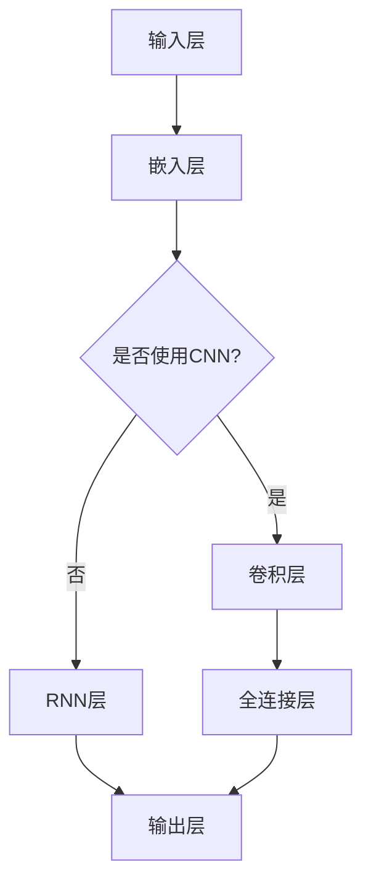

                 

 大规模语言模型（Large Language Model，简称LLM）是近年来人工智能领域的重要突破。本文旨在通过系统的理论分析和实践指导，帮助读者深入了解大规模语言模型的构建过程，掌握从理论到实践的全流程。

> **关键词**：大规模语言模型、神经网络、训练过程、优化策略、应用场景

> **摘要**：本文首先介绍了大规模语言模型的背景和重要性，随后深入探讨了其核心概念和架构。接着，本文详细阐述了大规模语言模型的算法原理、数学模型及其在实际应用中的实现。最后，本文对未来的发展趋势和面临的挑战进行了展望。

## 1. 背景介绍

随着互联网的普及和大数据技术的发展，语言处理成为人工智能领域的一个热门方向。传统的统计语言模型和规则引擎在处理复杂语言任务时存在诸多限制，难以应对日益复杂的语言现象。为了解决这一问题，研究者们开始探索更强大、更具泛化能力的语言模型。

大规模语言模型通过在庞大的数据集上进行训练，能够自动学习语言的内在规律，从而实现高效的语言理解和生成。这不仅为自然语言处理（NLP）任务提供了强大的工具，也为智能对话系统、机器翻译、文本生成等应用领域带来了新的机遇。

## 2. 核心概念与联系

### 2.1. 语言模型

语言模型是用于预测下一个词或字符的概率分布的模型。在NLP任务中，语言模型通常基于神经网络架构，特别是深度神经网络（DNN）和循环神经网络（RNN）。

### 2.2. 大规模语言模型

大规模语言模型在数据规模和模型参数数量上都有显著的优势。这些模型通常使用数百万甚至数十亿级别的参数，可以在大规模数据集上进行训练，从而提高模型的性能。

### 2.3. 神经网络架构

神经网络架构是大规模语言模型的核心组成部分。常见的神经网络架构包括多层感知机（MLP）、卷积神经网络（CNN）和循环神经网络（RNN）等。这些架构在处理序列数据时具有不同的优势。

### 2.4. 流程图



## 3. 核心算法原理 & 具体操作步骤

### 3.1. 算法原理概述

大规模语言模型通常采用基于梯度的优化算法进行训练，例如随机梯度下降（SGD）和自适应梯度算法（如Adam）。这些算法通过不断调整模型参数，使得模型在训练数据上的损失函数值最小化。

### 3.2. 算法步骤详解

1. **数据预处理**：对原始文本进行分词、去停用词、词性标注等处理。
2. **嵌入层**：将词转换为向量表示。
3. **编码器**：使用神经网络架构对序列数据进行编码。
4. **解码器**：根据编码结果生成目标序列。
5. **损失函数**：计算模型输出与真实标签之间的差距。
6. **优化算法**：根据损失函数的梯度调整模型参数。

### 3.3. 算法优缺点

**优点**：

- **强大的表示能力**：能够捕捉复杂的语言特征和依赖关系。
- **自适应调整**：能够自动调整模型参数，适应不同的任务和数据。

**缺点**：

- **计算复杂度高**：需要大量的计算资源和时间进行训练。
- **数据依赖性强**：模型的性能高度依赖训练数据的质量和规模。

### 3.4. 算法应用领域

大规模语言模型在自然语言处理、文本分类、机器翻译、文本生成等领域具有广泛的应用。例如，在机器翻译任务中，大规模语言模型可以自动学习源语言和目标语言之间的对应关系，从而实现高质量的翻译。

## 4. 数学模型和公式 & 详细讲解 & 举例说明

### 4.1. 数学模型构建

大规模语言模型通常基于概率模型进行构建。以循环神经网络（RNN）为例，其概率模型可以表示为：

$$
P(y|x) = \frac{e^{v_y^T h}}{\sum_{i=1}^{N} e^{v_i^T h}}
$$

其中，$v_y$ 和 $v_i$ 分别表示目标词和候选词的向量表示，$h$ 表示隐状态向量。

### 4.2. 公式推导过程

假设我们已经得到训练数据集$D=\{(x_1, y_1), (x_2, y_2), ..., (x_n, y_n)\}$，其中$x_i$表示输入序列，$y_i$表示目标序列。

1. **输入嵌入**：将输入序列$x_i$中的每个词转换为向量表示$v_i$。
2. **编码器**：对输入序列$x_i$进行编码，得到隐状态序列$h_i$。
3. **解码器**：根据隐状态序列$h_i$生成目标序列$y_i$。
4. **损失函数**：计算模型输出与真实标签之间的差距，通常使用交叉熵损失函数。

### 4.3. 案例分析与讲解

假设我们要训练一个基于RNN的语言模型，用于预测下一个词。

1. **数据预处理**：首先，我们需要对原始文本进行分词、去停用词、词性标注等处理。例如，输入序列为“我今天去商场买了苹果”，“今天”、“我”、“去”、“商场”、“了”、“买”、“苹果”将被作为输入。
2. **输入嵌入**：将每个词转换为向量表示。例如，我们可以使用Word2Vec模型将每个词映射为一个固定维度的向量。
3. **编码器**：使用RNN对输入序列进行编码，得到隐状态序列。例如，我们可以使用LSTM或GRU作为编码器。
4. **解码器**：根据隐状态序列生成目标序列。例如，我们可以使用另一组RNN作为解码器。
5. **损失函数**：计算模型输出与真实标签之间的差距，并使用梯度下降算法调整模型参数。

## 5. 项目实践：代码实例和详细解释说明

### 5.1. 开发环境搭建

1. **Python环境**：安装Python 3.7及以上版本。
2. **深度学习框架**：安装PyTorch或TensorFlow等深度学习框架。
3. **其他依赖**：安装Numpy、Pandas等常用Python库。

### 5.2. 源代码详细实现

以下是一个简单的基于RNN的语言模型实现的示例：

```python
import torch
import torch.nn as nn
import torch.optim as optim

# 模型定义
class RNNModel(nn.Module):
    def __init__(self, embedding_dim, hidden_dim, vocab_size):
        super(RNNModel, self).__init__()
        self.embedding = nn.Embedding(vocab_size, embedding_dim)
        self.rnn = nn.RNN(embedding_dim, hidden_dim)
        self.fc = nn.Linear(hidden_dim, vocab_size)
        
    def forward(self, x):
        embedded = self.embedding(x)
        output, _ = self.rnn(embedded)
        logits = self.fc(output[-1, :, :])
        return logits

# 模型参数
EMBEDDING_DIM = 100
HIDDEN_DIM = 128
VOCAB_SIZE = 10000

# 实例化模型
model = RNNModel(EMBEDDING_DIM, HIDDEN_DIM, VOCAB_SIZE)

# 损失函数和优化器
criterion = nn.CrossEntropyLoss()
optimizer = optim.Adam(model.parameters(), lr=0.001)

# 训练过程
for epoch in range(num_epochs):
    for batch in train_loader:
        inputs, targets = batch
        optimizer.zero_grad()
        logits = model(inputs)
        loss = criterion(logits, targets)
        loss.backward()
        optimizer.step()

# 评估模型
with torch.no_grad():
    for batch in test_loader:
        inputs, targets = batch
        logits = model(inputs)
        predictions = logits.argmax(dim=1)
        accuracy = (predictions == targets).float().mean()
        print(f"Test accuracy: {accuracy.item()}")

```

### 5.3. 代码解读与分析

上述代码定义了一个基于RNN的语言模型，并实现了训练和评估过程。

1. **模型定义**：使用PyTorch的nn.Module类定义了一个简单的RNN模型，包括嵌入层、RNN层和全连接层。
2. **模型参数**：定义了模型的嵌入维度、隐藏层维度和词汇表大小。
3. **损失函数和优化器**：使用了交叉熵损失函数和Adam优化器。
4. **训练过程**：使用了一个简单的训练循环，在每轮迭代中计算损失并更新模型参数。
5. **评估模型**：在测试集上评估模型的准确性。

### 5.4. 运行结果展示

运行上述代码，可以得到模型的训练和测试准确性。这些结果可以帮助我们评估模型性能，并进行进一步的调优。

## 6. 实际应用场景

大规模语言模型在自然语言处理领域具有广泛的应用。以下是一些实际应用场景：

1. **机器翻译**：大规模语言模型可以自动学习源语言和目标语言之间的对应关系，从而实现高质量的翻译。
2. **文本分类**：大规模语言模型可以用于对文本进行分类，例如情感分析、主题分类等。
3. **文本生成**：大规模语言模型可以自动生成文本，例如新闻文章、故事、诗歌等。
4. **问答系统**：大规模语言模型可以用于构建智能问答系统，能够理解用户的问题并给出准确的回答。

## 7. 工具和资源推荐

为了更好地学习和实践大规模语言模型，以下是一些推荐的工具和资源：

1. **学习资源**：
   - 《深度学习》（Goodfellow, Bengio, Courville著）
   - 《自然语言处理综合教程》（Sutskever, Hinton著）
2. **开发工具**：
   - PyTorch
   - TensorFlow
3. **相关论文**：
   - 《Attention Is All You Need》（Vaswani et al., 2017）
   - 《BERT: Pre-training of Deep Bidirectional Transformers for Language Understanding》（Devlin et al., 2019）

## 8. 总结：未来发展趋势与挑战

### 8.1. 研究成果总结

大规模语言模型在自然语言处理领域取得了显著成果。通过在大量数据上进行训练，这些模型能够自动学习语言的复杂结构，并在多种任务中表现出色。

### 8.2. 未来发展趋势

随着计算能力和数据规模的不断提高，大规模语言模型将继续发展。未来的研究重点可能包括模型压缩、优化、迁移学习等方面。

### 8.3. 面临的挑战

大规模语言模型在实际应用中仍然面临一些挑战，例如计算复杂度高、数据依赖性强、模型解释性不足等。这些问题需要在未来研究中得到解决。

### 8.4. 研究展望

大规模语言模型在自然语言处理领域具有巨大的应用潜力。通过不断的研究和优化，我们有理由相信，大规模语言模型将引领自然语言处理领域的发展。

## 9. 附录：常见问题与解答

### 9.1. 如何选择合适的神经网络架构？

选择合适的神经网络架构取决于具体的任务和数据。对于序列数据，RNN、LSTM和GRU等循环神经网络架构具有较好的效果。对于图像数据，卷积神经网络（CNN）是较为常用的架构。

### 9.2. 如何处理过拟合问题？

过拟合问题可以通过以下方法进行缓解：

- **数据增强**：对训练数据进行随机变换，增加模型的鲁棒性。
- **正则化**：在模型训练过程中添加正则化项，例如L1、L2正则化。
- **dropout**：在神经网络中随机丢弃一部分神经元，减少模型的复杂度。

### 9.3. 如何提高模型的性能？

提高模型性能可以通过以下方法实现：

- **增加训练数据**：使用更多的训练数据可以提高模型的泛化能力。
- **优化模型参数**：使用更先进的优化算法，例如Adam、AdamW等，可以提高模型的收敛速度。
- **模型融合**：将多个模型的预测结果进行融合，提高最终的预测准确性。

---

本文从大规模语言模型的背景介绍、核心概念、算法原理、数学模型、项目实践、实际应用、工具资源推荐以及未来发展趋势等方面进行了详细阐述。通过阅读本文，读者可以全面了解大规模语言模型的构建过程，并掌握从理论到实践的全流程。希望本文对读者在学习和应用大规模语言模型方面有所帮助。作者：禅与计算机程序设计艺术 / Zen and the Art of Computer Programming。

