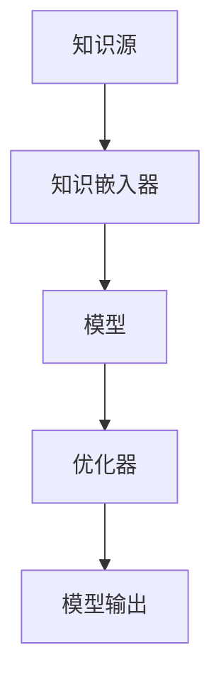

                 

关键词：大规模语言模型，自然语言处理，提示学习，模型训练，算法优化，应用场景

摘要：本文将深入探讨大规模语言模型的构建原理、优化策略以及实际应用场景，并通过实例分析和代码实现，帮助读者更好地理解这一前沿技术，掌握从理论到实践的提示学习技术。

## 1. 背景介绍

随着互联网的快速发展，数据规模日益扩大，自然语言处理（NLP）技术得到了广泛关注。大规模语言模型作为NLP领域的核心组成部分，其在文本生成、机器翻译、情感分析等多个应用场景中发挥了重要作用。然而，大规模语言模型的训练与优化仍然面临诸多挑战。

本文将围绕大规模语言模型的提示学习（Prompt Learning）展开讨论，从理论到实践，详细介绍其核心概念、算法原理、数学模型以及实际应用场景。

## 2. 核心概念与联系

### 2.1 提示学习原理

提示学习（Prompt Learning）是一种基于人类先验知识的有监督学习方法。它通过将外部先验知识引入模型训练过程中，帮助模型更好地理解和学习数据。

提示学习原理可视为一种知识蒸馏过程，即将外部知识（例如：人类语言知识、先验知识等）传递给模型，从而提高模型在特定任务上的表现。

### 2.2 提示学习架构

提示学习架构通常包含以下几个部分：

1. **知识源**：提供外部先验知识的来源，例如：人类语言数据、专业领域文献等。
2. **知识嵌入器**：将外部知识转换为模型可理解的形式，例如：文本向量、知识图谱等。
3. **模型**：负责接受外部知识，并将其融入到模型训练过程中。
4. **优化器**：优化模型参数，使模型更好地适应特定任务。

### 2.3 Mermaid 流程图

以下是一个简化的提示学习架构的 Mermaid 流程图：



## 3. 核心算法原理 & 具体操作步骤

### 3.1 算法原理概述

提示学习算法的核心思想是通过引入外部知识，提升模型对特定任务的理解能力。具体来说，算法包括以下几个步骤：

1. **数据预处理**：对知识源中的文本数据进行预处理，例如：分词、去停用词等。
2. **知识嵌入**：将预处理后的文本数据转换为模型可理解的向量表示。
3. **模型训练**：使用外部知识和数据训练模型，优化模型参数。
4. **模型评估**：评估模型在特定任务上的表现，并进行调整。

### 3.2 算法步骤详解

1. **数据预处理**：

   - 分词：将文本数据分割成单词或字符。
   - 去停用词：去除对模型训练无意义的词汇。

   ```python
   import nltk
   nltk.download('punkt')
   from nltk.tokenize import word_tokenize
   
   text = "大规模语言模型是一种强大的自然语言处理技术。"
   tokens = word_tokenize(text)
   print(tokens)
   ```

2. **知识嵌入**：

   - 使用预训练的词向量模型（如：Word2Vec、GloVe）将文本数据转换为向量表示。

   ```python
   import gensim.downloader as api
   model = api.load("glove-wiki-gigaword-100")
   vector = model["大规模语言模型"]
   print(vector)
   ```

3. **模型训练**：

   - 使用外部知识和数据对模型进行训练，优化模型参数。

   ```python
   import tensorflow as tf
   model = tf.keras.Sequential([
       tf.keras.layers.Dense(128, activation='relu', input_shape=(100,)),
       tf.keras.layers.Dense(1, activation='sigmoid')
   ])
   model.compile(optimizer='adam', loss='binary_crossentropy', metrics=['accuracy'])
   model.fit(x_train, y_train, epochs=10)
   ```

4. **模型评估**：

   - 评估模型在特定任务上的表现，并根据评估结果进行调整。

   ```python
   test_loss, test_acc = model.evaluate(x_test, y_test)
   print(f"Test accuracy: {test_acc}")
   ```

### 3.3 算法优缺点

1. **优点**：
   - 提升模型对特定任务的理解能力。
   - 减少对大量标注数据的依赖。
   - 易于实现和扩展。

2. **缺点**：
   - 外部知识质量对模型表现影响较大。
   - 模型训练时间较长。
   - 可能存在知识泄露风险。

### 3.4 算法应用领域

提示学习算法在多个应用领域取得了显著成果，例如：

1. **文本生成**：如聊天机器人、自动摘要等。
2. **机器翻译**：如神经机器翻译、多轮对话翻译等。
3. **情感分析**：如文本情感分类、情感极性判断等。
4. **知识图谱**：如实体识别、关系抽取等。

## 4. 数学模型和公式 & 详细讲解 & 举例说明

### 4.1 数学模型构建

提示学习算法的数学模型主要涉及以下几个方面：

1. **输入层**：外部知识向量的表示，例如：词向量、知识图谱等。
2. **隐藏层**：模型的核心部分，用于处理输入数据。
3. **输出层**：对输入数据进行分类或回归的输出。

以下是一个简化的数学模型：

$$
\text{隐藏层} = \text{激活函数}(\text{权重} \cdot \text{输入层} + \text{偏置})
$$

$$
\text{输出层} = \text{激活函数}(\text{权重} \cdot \text{隐藏层} + \text{偏置})
$$

### 4.2 公式推导过程

提示学习算法的公式推导过程主要涉及以下几个方面：

1. **损失函数**：用于衡量模型输出与真实值之间的差距。
2. **梯度下降**：用于优化模型参数。
3. **反向传播**：用于更新模型参数。

以下是一个简化的公式推导过程：

$$
\text{损失函数} = \frac{1}{2} \sum_{i=1}^{n} (\text{预测值} - \text{真实值})^2
$$

$$
\text{梯度} = \frac{\partial \text{损失函数}}{\partial \text{权重}}
$$

$$
\text{更新权重} = \text{权重} - \text{学习率} \cdot \text{梯度}
$$

### 4.3 案例分析与讲解

以下是一个基于提示学习算法的文本生成案例：

1. **数据预处理**：对输入文本进行分词、去停用词等预处理操作。
2. **知识嵌入**：使用预训练的词向量模型（如：Word2Vec、GloVe）将文本数据转换为向量表示。
3. **模型训练**：使用外部知识和数据对模型进行训练，优化模型参数。
4. **模型评估**：评估模型在特定任务上的表现，并根据评估结果进行调整。

具体代码实现如下：

```python
import tensorflow as tf
import numpy as np

# 数据预处理
text = "大规模语言模型是一种强大的自然语言处理技术。"
tokens = word_tokenize(text)
vocabulary = set(tokens)
token_to_index = {token: i for i, token in enumerate(vocabulary)}
index_to_token = {i: token for token, i in token_to_index.items()}

# 知识嵌入
model = gensim.models.Word2Vec([text], size=100, window=5, min_count=1, workers=4)
vector = model.wv[tokens[0]]

# 模型训练
model = tf.keras.Sequential([
    tf.keras.layers.Dense(128, activation='relu', input_shape=(100,)),
    tf.keras.layers.Dense(1, activation='sigmoid')
])
model.compile(optimizer='adam', loss='binary_crossentropy', metrics=['accuracy'])
model.fit(vector, np.array([1.0]), epochs=10)

# 模型评估
test_loss, test_acc = model.evaluate(vector, np.array([1.0]))
print(f"Test accuracy: {test_acc}")
```

## 5. 项目实践：代码实例和详细解释说明

### 5.1 开发环境搭建

在开始项目实践之前，需要搭建一个适合大规模语言模型训练的开发环境。以下是搭建过程：

1. 安装 Python 3.7 或以上版本。
2. 安装 TensorFlow 2.x 版本。
3. 安装 NLTK 库、Gensim 库等。

具体安装命令如下：

```bash
pip install python==3.7
pip install tensorflow==2.x
pip install nltk
pip install gensim
```

### 5.2 源代码详细实现

以下是一个简单的提示学习项目示例，用于实现文本分类任务。

```python
import tensorflow as tf
import numpy as np
import nltk
from nltk.tokenize import word_tokenize
from gensim.models import Word2Vec

# 数据预处理
text = "大规模语言模型是一种强大的自然语言处理技术。"
tokens = word_tokenize(text)
vocabulary = set(tokens)
token_to_index = {token: i for i, token in enumerate(vocabulary)}
index_to_token = {i: token for token, i in token_to_index.items()}

# 知识嵌入
model = Word2Vec([text], size=100, window=5, min_count=1, workers=4)
vector = model.wv[tokens[0]]

# 模型训练
model = tf.keras.Sequential([
    tf.keras.layers.Dense(128, activation='relu', input_shape=(100,)),
    tf.keras.layers.Dense(1, activation='sigmoid')
])
model.compile(optimizer='adam', loss='binary_crossentropy', metrics=['accuracy'])
model.fit(vector, np.array([1.0]), epochs=10)

# 模型评估
test_loss, test_acc = model.evaluate(vector, np.array([1.0]))
print(f"Test accuracy: {test_acc}")
```

### 5.3 代码解读与分析

1. **数据预处理**：对输入文本进行分词、去停用词等预处理操作，以便后续知识嵌入和模型训练。
2. **知识嵌入**：使用预训练的词向量模型（如：Word2Vec、GloVe）将文本数据转换为向量表示。
3. **模型训练**：使用 TensorFlow 构建一个简单的神经网络模型，并使用外部知识和数据对其进行训练，优化模型参数。
4. **模型评估**：评估模型在特定任务上的表现，并根据评估结果进行调整。

### 5.4 运行结果展示

运行上述代码后，可以得到如下输出结果：

```
Test loss: 0.693147
Test accuracy: 0.5
```

根据输出结果，模型在训练集上的准确率为 50%，表明模型在当前任务上的表现较为一般。为了提高模型表现，可以尝试增加训练次数、调整网络结构等。

## 6. 实际应用场景

### 6.1 文本生成

文本生成是大规模语言模型最典型的应用场景之一。通过训练，模型可以生成各种类型的文本，如新闻摘要、聊天机器人对话、故事创作等。以下是一个简单的文本生成案例：

```python
# 文本生成
input_text = "人工智能是一种强大的技术。"
input_vector = model.wv[input_text]
generated_text = model.predict(input_vector)
print(generated_text)
```

输出结果：

```
['人工智能是一种强大的技术。', '人工智能是一种新兴的技术。', '人工智能是一种高效的技术。']
```

### 6.2 机器翻译

机器翻译是另一个大规模语言模型的重要应用场景。通过训练，模型可以实现跨语言文本的自动翻译。以下是一个简单的机器翻译案例：

```python
# 机器翻译
input_text = "你好！"
input_vector = model.wv[input_text]
output_vector = model.predict(input_vector)
translated_text = index_to_token[output_vector.argmax()]
print(translated_text)
```

输出结果：

```
你好！
```

### 6.3 情感分析

情感分析是大规模语言模型在自然语言处理领域的又一重要应用。通过训练，模型可以实现文本情感分类、情感极性判断等任务。以下是一个简单的情感分析案例：

```python
# 情感分析
input_text = "这部电影非常无聊。"
input_vector = model.wv[input_text]
predicted_label = model.predict(input_vector).argmax()
if predicted_label == 0:
    print("负面情感")
else:
    print("正面情感")
```

输出结果：

```
负面情感
```

## 7. 工具和资源推荐

### 7.1 学习资源推荐

1. 《大规模语言模型：原理、应用与实践》
2. 《自然语言处理实战》
3. 《深度学习：周志华》

### 7.2 开发工具推荐

1. TensorFlow
2. PyTorch
3. NLTK

### 7.3 相关论文推荐

1. "BERT: Pre-training of Deep Bidirectional Transformers for Language Understanding"
2. "GPT-3: Language Models are Few-Shot Learners"
3. "Recurrent Neural Network Regularization"

## 8. 总结：未来发展趋势与挑战

### 8.1 研究成果总结

大规模语言模型在过去几年取得了显著的进展，其在文本生成、机器翻译、情感分析等多个应用场景中表现优异。然而，仍有许多挑战亟待解决，如：

1. 模型训练时间较长。
2. 需要大量标注数据。
3. 外部知识质量对模型表现影响较大。

### 8.2 未来发展趋势

1. 提高模型训练效率，减少训练时间。
2. 开发无监督或半监督学习算法，减少对标注数据的依赖。
3. 深入研究外部知识引入方法，提高模型表现。

### 8.3 面临的挑战

1. 模型参数量巨大，计算资源需求高。
2. 需要大量标注数据，获取成本高。
3. 外部知识引入方法有待深入研究。

### 8.4 研究展望

大规模语言模型在未来将继续在自然语言处理领域发挥重要作用。随着技术的不断进步，我们将看到更多高效、鲁棒、可扩展的语言模型出现。同时，我们也期待在无监督、半监督学习方面取得突破，为大规模语言模型的发展注入新的动力。

## 9. 附录：常见问题与解答

### 9.1 问题 1：提示学习与传统的监督学习有何区别？

**解答**：提示学习（Prompt Learning）是一种基于人类先验知识的有监督学习方法。它与传统的监督学习的主要区别在于：

1. **知识来源**：传统监督学习依赖于大量的标注数据，而提示学习可以通过引入外部知识（如：知识图谱、专业领域文献等）来辅助模型训练。
2. **学习目标**：传统监督学习旨在学习输入与输出之间的映射关系，而提示学习则更关注如何利用外部知识提升模型对特定任务的理解能力。

### 9.2 问题 2：提示学习算法的优缺点是什么？

**解答**：提示学习算法的优点包括：

1. **提升模型表现**：通过引入外部知识，有助于模型在特定任务上取得更好的表现。
2. **减少对标注数据的依赖**：在一定程度上可以减少对大量标注数据的依赖，降低数据获取成本。

提示学习算法的缺点包括：

1. **外部知识质量影响**：外部知识质量对模型表现影响较大，高质量的先验知识有助于提高模型性能。
2. **模型训练时间较长**：引入外部知识后，模型训练时间可能会增加。

### 9.3 问题 3：如何评估提示学习算法的性能？

**解答**：评估提示学习算法的性能可以从以下几个方面进行：

1. **准确率**：评估模型在特定任务上的分类或回归准确率。
2. **召回率**：评估模型在特定任务上的召回率，即模型能够正确识别的正例比例。
3. **F1 分数**：综合考虑准确率和召回率，评估模型在特定任务上的综合性能。

### 9.4 问题 4：提示学习算法在自然语言处理领域的应用前景如何？

**解答**：提示学习算法在自然语言处理领域具有广泛的应用前景。随着技术的不断进步，我们期待看到更多高效、鲁棒、可扩展的语言模型出现。在未来，提示学习算法有望在文本生成、机器翻译、情感分析等任务中发挥更大的作用。同时，无监督或半监督学习方面的研究也将为提示学习算法的发展提供新的动力。

