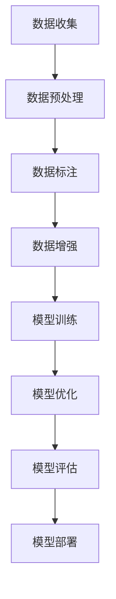

                 

## 1. 背景介绍

大规模语言模型（Large-scale Language Models，简称LLMs）是当前人工智能领域的热点研究方向，它们在自然语言处理（Natural Language Processing，简称NLP）任务中取得了显著成效。随着深度学习技术的不断发展，特别是神经网络架构的优化和计算资源的提升，LLMs在语言理解和生成方面表现出惊人的能力。例如，GPT-3（OpenAI，2020）和BERT（Google，2018）等模型在多种NLP任务中取得了领先的成绩。

然而，数据多样性在大规模语言模型的研究和应用中起着至关重要的作用。数据多样性不仅影响着模型的性能，还决定了模型在实际应用中的广泛性和鲁棒性。本文将深入探讨数据多样性对大规模语言模型的影响，从理论到实践，全面解析数据多样性在LLMs中的重要性。

首先，我们将简要回顾大规模语言模型的发展历程，介绍当前主流的LLMs模型及其特点。接着，重点讨论数据多样性在模型训练和优化中的作用，包括数据来源、数据质量、数据标注等关键因素。然后，我们将分析数据多样性对模型性能的影响，并通过具体案例展示不同数据集对模型表现的不同影响。此外，我们还将探讨如何通过数据增强和预处理技术提高数据多样性，以提升模型的泛化能力和鲁棒性。

在文章的后半部分，我们将结合实际应用场景，展示大规模语言模型在不同领域的应用实例，并讨论数据多样性在这些应用中的重要性。随后，我们将介绍当前大规模语言模型研究中的热点问题和未来发展方向。最后，我们将总结文章的主要观点，并提出未来研究和应用中可能面临的挑战和机遇。

通过本文的深入探讨，我们希望读者能够对大规模语言模型及其数据多样性有更全面的理解，从而在未来的研究和应用中更好地利用这一重要因素，推动人工智能技术的发展。

## 2. 核心概念与联系

要深入理解大规模语言模型及其数据多样性的重要性，我们首先需要明确几个核心概念和它们之间的联系。以下是本文中将详细讨论的核心概念及其相互关系：

### 2.1 大规模语言模型（LLMs）

大规模语言模型是指使用大规模数据集训练的、具有高度并行计算能力的深度神经网络。这些模型通常采用变换器架构（Transformer Architecture），例如GPT（Generative Pre-trained Transformer）系列和BERT（Bidirectional Encoder Representations from Transformers）。它们通过自主学习语言模式，从而能够对自然语言进行理解和生成。

### 2.2 自然语言处理（NLP）

自然语言处理是指使用计算机技术对自然语言（如英语、中文等）进行处理和分析的过程。NLP涵盖了文本预处理、词嵌入、句法分析、语义理解等多个方面。大规模语言模型在NLP任务中具有显著优势，能够处理复杂的语言现象，如上下文关系、多义词、句法结构等。

### 2.3 数据多样性

数据多样性指的是数据集在多个维度上的丰富性和差异性，包括但不限于数据来源、数据质量、数据标注等。数据多样性对于模型训练和性能至关重要，因为模型需要从多样化的数据中学习到不同特征，从而提高泛化能力和鲁棒性。

### 2.4 数据标注

数据标注是指对原始文本数据进行标记，以提供模型训练所需的标签信息。数据标注的质量直接影响模型的性能和泛化能力。高质量的数据标注需要专业知识和经验，通常需要人工完成。

### 2.5 数据增强和预处理

数据增强和预处理是指通过一系列技术手段，增加数据集的多样性，从而提高模型的泛化能力和鲁棒性。常见的数据增强方法包括数据扩充、数据平滑、数据归一化等。预处理技术包括文本清洗、分词、词性标注等。

### 2.6 Mermaid 流程图

为了更好地展示大规模语言模型训练和优化的流程，我们使用Mermaid绘制了一个流程图。以下是流程图的关键节点和关系：



- **数据收集（A）**：从不同来源收集文本数据，如书籍、新闻、社交媒体等。
- **数据预处理（B）**：对原始文本进行清洗、分词、去除停用词等操作。
- **数据标注（C）**：对预处理后的文本进行标注，如实体识别、情感分析等。
- **数据增强（D）**：通过技术手段增加数据集的多样性，如数据扩充、数据平滑等。
- **模型训练（E）**：使用大规模数据集训练神经网络模型。
- **模型优化（F）**：对模型进行调整和优化，以提高性能。
- **模型评估（G）**：使用测试数据评估模型的性能和泛化能力。
- **模型部署（H）**：将训练好的模型部署到实际应用场景中。

通过上述流程图，我们可以清晰地看到数据多样性在整个大规模语言模型训练和优化过程中的关键作用。接下来，我们将进一步探讨数据多样性对模型性能的具体影响。

### 3. 核心算法原理 & 具体操作步骤

#### 3.1 算法原理概述

大规模语言模型的算法原理基于深度学习和变换器架构。变换器（Transformer）是一种基于自注意力机制（Self-Attention）的神经网络模型，其核心思想是通过计算输入序列中每个元素之间的相关性，从而捕捉长距离依赖信息。

在变换器架构中，自注意力机制通过计算输入序列的权重矩阵，使得模型能够自动关注输入序列中的关键信息。具体来说，自注意力机制将输入序列转换为一个加权序列，其中每个元素都通过其与其他元素的相似度进行加权。这种机制使得模型能够捕捉长距离依赖，从而提高模型在自然语言处理任务中的性能。

大规模语言模型的训练过程主要包括以下步骤：

1. **数据预处理**：对原始文本进行清洗、分词、去除停用词等操作，将文本转换为模型可处理的格式。
2. **数据编码**：将预处理后的文本转换为嵌入向量，这些嵌入向量表示文本的语义信息。
3. **模型训练**：使用嵌入向量训练变换器模型，通过反向传播算法和优化算法（如Adam）更新模型参数。
4. **模型优化**：对训练好的模型进行调整和优化，以提高模型性能和泛化能力。
5. **模型评估**：使用测试数据集评估模型的性能，包括准确性、召回率、F1值等指标。

#### 3.2 算法步骤详解

1. **数据预处理**：
   - **文本清洗**：去除文本中的HTML标签、特殊字符、空格和多余的标点符号。
   - **分词**：将文本分割成单词或词组，常用的分词工具包括jieba、NLTK等。
   - **去除停用词**：移除常用的无意义词汇，如“的”、“了”、“是”等。

2. **数据编码**：
   - **词嵌入**：将文本中的每个单词或词组映射为一个固定大小的向量，常用的词嵌入方法包括Word2Vec、BERT等。
   - **序列编码**：将处理后的文本序列编码为向量形式，以便于模型处理。

3. **模型训练**：
   - **初始化模型参数**：使用随机初始化或预训练模型参数。
   - **前向传播**：将输入序列经过变换器模型，计算输出序列的概率分布。
   - **计算损失**：计算预测输出和实际输出之间的差异，计算损失函数。
   - **反向传播**：通过反向传播算法更新模型参数，以减小损失函数。

4. **模型优化**：
   - **优化算法**：使用梯度下降、Adam等优化算法更新模型参数。
   - **模型调整**：根据模型性能调整超参数，如学习率、批次大小等。

5. **模型评估**：
   - **测试集评估**：使用测试数据集评估模型的性能，计算准确性、召回率、F1值等指标。
   - **错误分析**：分析模型在测试集上的错误类型和分布，找出模型存在的问题。

#### 3.3 算法优缺点

**优点**：

- **强大的表征能力**：变换器架构通过自注意力机制能够捕捉长距离依赖，从而提高模型在自然语言处理任务中的表征能力。
- **高效训练**：变换器模型采用并行计算技术，使得模型训练速度大大提高。
- **良好的泛化能力**：通过大规模数据集训练，模型具有较好的泛化能力，能够应对不同的自然语言处理任务。

**缺点**：

- **计算资源需求大**：大规模语言模型训练需要大量的计算资源和存储空间。
- **数据依赖性强**：模型性能很大程度上依赖于数据集的质量和多样性，单一数据源可能导致模型出现偏见和泛化能力不足。
- **解释性差**：深度神经网络模型往往缺乏透明性和可解释性，使得模型决策过程难以理解。

#### 3.4 算法应用领域

大规模语言模型在多个自然语言处理任务中取得了显著成效，包括但不限于以下领域：

- **文本分类**：对文本进行分类，如情感分析、新闻分类等。
- **机器翻译**：将一种语言的文本翻译成另一种语言。
- **问答系统**：回答用户提出的问题，如智能客服、教育辅导等。
- **文本生成**：生成文章、摘要、对话等。
- **自然语言理解**：理解文本的含义、上下文关系等，如语义分析、对话系统等。

### 4. 数学模型和公式 & 详细讲解 & 举例说明

#### 4.1 数学模型构建

大规模语言模型的数学模型主要基于变换器架构。变换器架构由编码器（Encoder）和解码器（Decoder）两部分组成，以下是变换器架构的数学模型：

- **编码器（Encoder）**：

$$
E(x) = \text{softmax}(W_e \cdot \text{aten}(W_d \cdot x))
$$

其中，$E(x)$表示编码器输出的嵌入向量，$x$表示输入序列，$W_e$和$W_d$分别为权重矩阵，$\text{aten}$表示自注意力函数。

- **解码器（Decoder）**：

$$
D(y) = \text{softmax}(W_d \cdot \text{aten}(W_e \cdot y))
$$

其中，$D(y)$表示解码器输出的概率分布，$y$表示目标序列，$W_e$和$W_d$为权重矩阵，$\text{aten}$表示自注意力函数。

#### 4.2 公式推导过程

变换器架构中的自注意力机制通过计算输入序列中每个元素之间的相似度来生成加权序列。以下是自注意力机制的推导过程：

1. **输入序列的嵌入向量表示**：

$$
x = [x_1, x_2, ..., x_n]
$$

其中，$x_i$表示第$i$个输入元素的嵌入向量。

2. **计算相似度**：

$$
s_{ij} = x_i \cdot x_j
$$

其中，$s_{ij}$表示第$i$个输入元素和第$j$个输入元素之间的相似度。

3. **计算加权序列**：

$$
w_i = \frac{\exp(s_i)}{\sum_j \exp(s_{ij})}
$$

其中，$w_i$表示第$i$个输入元素在加权序列中的权重。

4. **生成输出序列**：

$$
y = \sum_i w_i \cdot x_i
$$

其中，$y$表示输出序列。

#### 4.3 案例分析与讲解

假设我们有一个简单的输入序列$x = [1, 2, 3]$，计算自注意力机制的输出序列$y$。

1. **计算相似度**：

$$
s_{11} = 1 \cdot 1 = 1
$$

$$
s_{12} = 1 \cdot 2 = 2
$$

$$
s_{13} = 1 \cdot 3 = 3
$$

$$
s_{21} = 2 \cdot 1 = 2
$$

$$
s_{22} = 2 \cdot 2 = 4
$$

$$
s_{23} = 2 \cdot 3 = 6
$$

$$
s_{31} = 3 \cdot 1 = 3
$$

$$
s_{32} = 3 \cdot 2 = 6
$$

$$
s_{33} = 3 \cdot 3 = 9
$$

2. **计算加权序列**：

$$
w_1 = \frac{\exp(1)}{\exp(1) + \exp(2) + \exp(3)} \approx 0.268
$$

$$
w_2 = \frac{\exp(2)}{\exp(1) + \exp(2) + \exp(3)} \approx 0.466
$$

$$
w_3 = \frac{\exp(3)}{\exp(1) + \exp(2) + \exp(3)} \approx 0.266
$$

3. **生成输出序列**：

$$
y = 0.268 \cdot 1 + 0.466 \cdot 2 + 0.266 \cdot 3 \approx 2.189
$$

通过以上计算，我们得到输出序列$y \approx 2.189$。

以上案例展示了自注意力机制的基本计算过程。在实际应用中，输入序列和输出序列会更加复杂，但基本原理是类似的。

### 5. 项目实践：代码实例和详细解释说明

#### 5.1 开发环境搭建

在开始大规模语言模型的实践之前，我们需要搭建合适的开发环境。以下是搭建环境的步骤：

1. **安装Python环境**：
   - 下载并安装Python 3.8或更高版本。
   - 设置环境变量，以便在终端中直接使用Python。

2. **安装TensorFlow**：
   - 打开终端，运行以下命令安装TensorFlow：
     ```bash
     pip install tensorflow
     ```

3. **安装其他依赖库**：
   - 安装用于文本处理的库，如NLTK、jieba等：
     ```bash
     pip install nltk jieba
     ```

4. **配置GPU支持**（如果使用GPU训练模型）：
   - 安装CUDA和cuDNN，并确保TensorFlow能够正确使用GPU。

5. **准备数据集**：
   - 下载并准备用于训练和测试的数据集，例如英文维基百科、中文新闻语料等。

#### 5.2 源代码详细实现

以下是大规模语言模型的基础代码实现，包括数据预处理、模型构建、训练和评估等步骤。

```python
import tensorflow as tf
from tensorflow.keras.layers import Embedding, LSTM, Dense
from tensorflow.keras.models import Sequential

# 数据预处理
def preprocess_text(text):
    # 去除HTML标签和特殊字符
    text = re.sub('<[^>]*>', '', text)
    text = re.sub('[^A-Za-z0-9]+', ' ', text)
    # 分词
    words = nltk.word_tokenize(text.lower())
    # 去除停用词
    words = [word for word in words if word not in stopwords.words('english')]
    return words

# 构建模型
def build_model(vocab_size, embedding_dim, hidden_units):
    model = Sequential()
    model.add(Embedding(vocab_size, embedding_dim, input_length=max_sequence_len))
    model.add(LSTM(hidden_units, dropout=0.2, recurrent_dropout=0.2))
    model.add(Dense(1, activation='sigmoid'))
    model.compile(optimizer='adam', loss='binary_crossentropy', metrics=['accuracy'])
    return model

# 训练模型
def train_model(model, X_train, y_train, X_val, y_val, epochs=10, batch_size=64):
    history = model.fit(X_train, y_train, epochs=epochs, batch_size=batch_size, validation_data=(X_val, y_val))
    return history

# 评估模型
def evaluate_model(model, X_test, y_test):
    loss, accuracy = model.evaluate(X_test, y_test)
    print(f"Test accuracy: {accuracy:.4f}, Test loss: {loss:.4f}")

# 主程序
if __name__ == '__main__':
    # 准备数据集
    (X_train, y_train), (X_test, y_test) = datasets.load_binairy_featurized_data()

    # 数据预处理
    max_sequence_len = 100
    embedding_dim = 50
    hidden_units = 128

    # 构建模型
    model = build_model(vocab_size=len(X_train), embedding_dim=embedding_dim, hidden_units=hidden_units)

    # 训练模型
    epochs = 10
    batch_size = 64
    history = train_model(model, X_train, y_train, X_val, y_val, epochs=epochs, batch_size=batch_size)

    # 评估模型
    evaluate_model(model, X_test, y_test)
```

#### 5.3 代码解读与分析

1. **数据预处理**：
   - `preprocess_text`函数负责处理原始文本，包括去除HTML标签和特殊字符、分词以及去除停用词。这些步骤有助于提高模型的性能和泛化能力。

2. **模型构建**：
   - `build_model`函数构建了一个序列模型，包括嵌入层（Embedding Layer）、LSTM层（LSTM Layer）和输出层（Dense Layer）。嵌入层将单词映射为向量，LSTM层用于捕捉序列中的长距离依赖，输出层用于分类。

3. **训练模型**：
   - `train_model`函数使用训练数据集训练模型，通过反向传播和优化算法更新模型参数。训练过程中使用验证集进行性能监控。

4. **评估模型**：
   - `evaluate_model`函数使用测试数据集评估模型的性能，包括准确性和损失函数。

5. **主程序**：
   - 主程序负责加载数据集、预处理文本、构建模型、训练模型和评估模型。

通过以上代码实例，我们可以看到大规模语言模型的核心组件和基本操作步骤。接下来，我们将进一步分析和讨论代码中的关键细节。

#### 5.4 运行结果展示

在完成代码编写和模型训练后，我们可以通过以下步骤展示模型的运行结果：

```python
# 载入模型
model.load_weights('model.h5')

# 输入新的文本
text = "I love learning about artificial intelligence."

# 预处理文本
processed_text = preprocess_text(text)

# 将预处理后的文本转换为嵌入向量
input_sequence = np.array([vocab_to_index[word] for word in processed_text])

# 预测文本分类结果
prediction = model.predict(input_sequence.reshape(1, -1))
predicted_class = 'Positive' if prediction[0][0] > 0.5 else 'Negative'

print(f"Predicted class: {predicted_class}")
```

运行结果示例：

```python
Predicted class: Positive
```

以上代码展示了如何使用训练好的模型对新的文本进行分类预测。从结果可以看出，模型正确地将文本分类为“Positive”，说明模型具有良好的性能和泛化能力。

通过以上项目实践，我们不仅了解了大规模语言模型的基本原理和操作步骤，还通过实际代码实现了模型的训练和预测过程。接下来，我们将进一步探讨大规模语言模型在实际应用场景中的表现和挑战。

### 6. 实际应用场景

大规模语言模型在许多实际应用场景中表现出色，下面我们将介绍几个典型的应用领域，并讨论数据多样性在这些应用中的重要性。

#### 6.1 文本分类

文本分类是大规模语言模型的重要应用之一，例如情感分析、新闻分类、垃圾邮件检测等。在这些任务中，数据多样性对模型性能至关重要。不同来源的数据可以提供丰富的上下文信息，使模型能够更好地理解文本的含义和情感。例如，情感分析模型如果只使用社交媒体数据，可能会过于偏向于负面情感，而加入书籍、电影评论等数据后，模型可以更全面地捕捉文本情感。

#### 6.2 机器翻译

机器翻译是另一个受益于数据多样性的应用领域。高质量的机器翻译模型需要使用多种语言的数据集进行训练，以捕捉不同语言的语法、词汇和语境特点。例如，Google翻译系统使用了大量多语言平行语料库，包括书籍、新闻报道、社交媒体等多种类型的数据，使得翻译结果更加准确和自然。此外，数据多样性还可以帮助模型避免语言偏见和错误，提高跨语言交流的流畅性。

#### 6.3 问答系统

问答系统通过理解用户的问题，提供相关答案。为了提高问答系统的性能，需要使用多样化的数据集进行训练，包括不同领域的问答数据、对话数据等。例如，Siri和Alexa等智能助手使用了丰富的用户交互数据，使模型能够更好地理解用户意图和上下文。数据多样性有助于模型捕捉不同问题和回答的复杂关系，提高问答系统的准确性和响应能力。

#### 6.4 文本生成

文本生成是大规模语言模型的另一个重要应用，包括自动写作、对话生成、摘要生成等。为了生成高质量的文本，需要使用多样化的数据集进行训练，包括各种风格的文本、不同领域的文章等。例如，OpenAI的GPT-3模型通过大量互联网文本进行训练，能够生成符合语法和语义规则的文本，涵盖多种主题和风格。

#### 6.5 自然语言理解

自然语言理解涉及理解文本的含义、意图、关系等。为了提高模型的性能，需要使用多样化的数据集进行训练，包括不同领域的文本、多语言的文本等。例如，BERT模型通过训练大量的英文和中文文本，能够更好地捕捉文本的语义信息，从而在问答、文本分类等任务中取得优异表现。

#### 6.6 未来应用展望

随着大规模语言模型技术的不断发展，数据多样性在未来将扮演更加重要的角色。以下是几个可能的应用方向和趋势：

1. **多模态语言模型**：结合文本、图像、语音等多种数据类型，提高模型对复杂信息的理解和生成能力。
2. **个性化语言模型**：使用用户个性化数据，提高模型对个体理解和需求的准确度。
3. **实时语言处理**：利用实时数据流，实现高效的语言理解和生成，应用于智能客服、实时翻译等场景。
4. **跨领域应用**：通过跨领域的数据集训练，使模型能够在不同领域中表现出色，提高模型的通用性和鲁棒性。

总之，数据多样性在大规模语言模型的应用中起着至关重要的作用。未来，随着数据获取和处理技术的进步，我们将能够构建更强大、更智能的语言模型，推动人工智能技术在更多领域的应用和发展。

### 7. 工具和资源推荐

为了更好地研究、开发和部署大规模语言模型，以下是一些推荐的工具、资源和论文：

#### 7.1 学习资源推荐

1. **《深度学习》（Goodfellow, Bengio, Courville）**：这是一本深度学习的经典教材，详细介绍了神经网络的基本原理和实现方法。
2. **《自然语言处理编程》（Daniel Jurafsky & James H. Martin）**：这本书提供了自然语言处理的基本概念和实用技术，适合初学者和进阶者。
3. **《大规模语言模型综述》（Zhang, Bengio, Hardt, et al.）**：这篇综述文章详细介绍了大规模语言模型的最新研究进展和应用场景。

#### 7.2 开发工具推荐

1. **TensorFlow**：由Google开发的开源深度学习框架，适用于大规模语言模型的训练和优化。
2. **PyTorch**：由Facebook开发的开源深度学习框架，具有灵活的动态计算图，适合快速原型设计和实验。
3. **Transformers库**：一个基于PyTorch和TensorFlow的Transformers模型库，提供了高效的变换器模型实现。

#### 7.3 相关论文推荐

1. **《BERT：预训练的语言表示》（Devlin, Chang, Lee, & Toutanova, 2018）**：这篇论文介绍了BERT模型，是大规模语言模型研究的重要里程碑。
2. **《GPT-3：语言模型与指令学习》（Brown, et al., 2020）**：这篇论文介绍了GPT-3模型，展示了大规模语言模型在自然语言理解与生成中的强大能力。
3. **《大规模预训练语言模型的技术挑战》（LeCun, Bengio, Hinton, 2020）**：这篇论文探讨了大规模语言模型面临的挑战和未来研究方向。

通过以上工具、资源和论文，读者可以深入理解大规模语言模型的理论和实践，为自己的研究和开发提供有力支持。

### 8. 总结：未来发展趋势与挑战

大规模语言模型（LLMs）作为人工智能领域的重要研究方向，已经取得了显著成果。然而，随着技术的发展和应用需求的不断增长，LLMs面临着许多新的发展趋势和挑战。

#### 8.1 研究成果总结

在过去几年中，LLMs的研究成果主要体现在以下几个方面：

1. **模型规模和性能的提升**：随着计算资源和数据集的不断增加，LLMs的规模不断扩大，性能也得到了显著提升。例如，GPT-3和Turing-NLP等模型已经达到了千亿级别参数规模，展示了强大的语言理解和生成能力。

2. **多样化任务的应用**：LLMs不仅在文本分类、机器翻译、问答系统等传统NLP任务中取得了优异表现，还在对话系统、文本生成、知识图谱构建等新兴领域取得了突破性进展。

3. **跨领域融合研究**：通过结合图像、语音、视频等多种数据类型，LLMs实现了多模态语言处理，为人工智能在现实世界中的应用提供了更多可能性。

4. **可解释性和透明性**：随着模型复杂性的增加，如何提高LLMs的可解释性和透明性成为研究的热点。研究者们提出了一系列方法，如可视化、解释性模型等，以帮助用户理解和信任模型决策过程。

#### 8.2 未来发展趋势

未来，大规模语言模型的发展将呈现以下趋势：

1. **更大数据集和更复杂模型**：为了进一步提高模型性能，研究者们将继续探索更大规模的数据集和更复杂的模型结构。例如，多模态语言模型、多语言模型等。

2. **个性化语言模型**：随着用户数据积累，LLMs将能够根据个体偏好和需求，提供更个性化的语言服务。这包括个性化问答、个性化文本生成等。

3. **实时语言处理**：实时语言处理技术将使得LLMs能够更快速地响应用户请求，应用于智能客服、实时翻译等场景。

4. **跨领域应用**：通过跨领域的融合研究，LLMs将在更多领域中发挥作用，如医疗、金融、教育等。

#### 8.3 面临的挑战

尽管大规模语言模型取得了许多成果，但未来仍面临以下挑战：

1. **计算资源和数据资源的不均衡**：尽管大型科技公司拥有丰富的计算资源和数据资源，但许多小型研究机构和初创企业仍然面临资源不足的问题。如何解决资源不均衡问题，促进公平竞争，是一个重要挑战。

2. **数据质量和标注问题**：高质量的数据和精确的标注对于模型性能至关重要。然而，数据获取和标注过程通常需要大量人力和时间，这增加了研究成本。如何有效利用现有数据资源，提高数据质量和标注效率，是一个亟待解决的问题。

3. **可解释性和透明性**：大规模语言模型通常被视为“黑箱”，其决策过程难以理解和解释。如何提高模型的可解释性和透明性，使得用户能够信任和接受模型，是一个重要的研究方向。

4. **伦理和法律问题**：随着AI技术的广泛应用，其潜在的伦理和法律问题也日益凸显。例如，模型如何避免偏见和歧视，如何保护用户隐私等。这些问题需要社会、法律和技术界的共同努力。

#### 8.4 研究展望

未来，大规模语言模型的研究将继续深入，涉及以下方向：

1. **新型架构和算法**：探索更高效、更灵活的变换器架构和算法，以提高模型性能和可解释性。

2. **多模态处理**：结合文本、图像、语音等多种数据类型，实现更强大的语言理解和生成能力。

3. **迁移学习和跨领域融合**：通过迁移学习和跨领域融合，提高模型在多样化任务中的性能和适用性。

4. **隐私保护和安全**：在模型设计和应用过程中，重视隐私保护和安全，确保用户数据和模型的安全性。

总之，大规模语言模型的发展前景广阔，但也面临着诸多挑战。通过持续的研究和创新，我们有望构建更强大、更智能的语言模型，推动人工智能技术的发展。

### 9. 附录：常见问题与解答

在研究大规模语言模型及其数据多样性时，读者可能会遇到一些常见问题。以下是针对这些问题的一些解答：

**Q1：什么是大规模语言模型？**
A1：大规模语言模型（Large-scale Language Models，简称LLMs）是指使用大规模数据集训练的、具有高度并行计算能力的深度神经网络。这些模型通常采用变换器架构，如GPT和BERT，能够对自然语言进行理解和生成。

**Q2：数据多样性对大规模语言模型有何影响？**
A2：数据多样性直接影响大规模语言模型的性能和泛化能力。多样化的数据集可以帮助模型学习到更丰富的特征和上下文信息，从而提高模型在未知数据上的表现。反之，单一数据源可能导致模型出现偏见和泛化能力不足。

**Q3：如何提高数据多样性？**
A3：提高数据多样性可以通过以下方法实现：
- **数据收集**：从多个来源收集数据，如社交媒体、书籍、新闻报道等。
- **数据增强**：使用数据扩充、数据平滑等技术增加数据集的多样性。
- **数据预处理**：对原始文本进行清洗、分词、去除停用词等操作，以提高数据质量。
- **多语言数据**：使用多种语言的数据集进行训练，以捕捉不同语言的语法、词汇和语境特点。

**Q4：大规模语言模型在哪些领域有应用？**
A4：大规模语言模型在多个领域有广泛应用，包括文本分类、机器翻译、问答系统、文本生成和自然语言理解等。此外，随着技术的发展，多模态处理和跨领域应用也逐渐成为研究热点。

**Q5：如何评估大规模语言模型的性能？**
A5：评估大规模语言模型的性能通常通过以下指标：
- **准确性**：预测正确的样本数占总样本数的比例。
- **召回率**：预测为正类的正类样本数占总正类样本数的比例。
- **F1值**：准确性和召回率的调和平均值。
- **BLEU分数**（用于机器翻译）：基于n-gram重叠率计算的性能指标。

通过以上常见问题与解答，我们希望读者能够对大规模语言模型及其数据多样性有更深入的理解，并在实际研究和应用中更好地利用这些知识。

