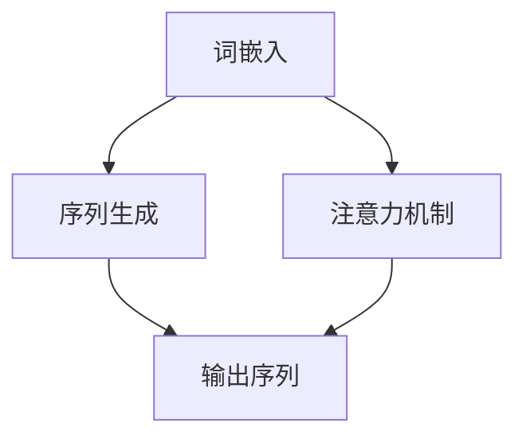

                 

## 1. 背景介绍

近年来，随着深度学习技术的飞速发展，大规模语言模型（Large-scale Language Models）逐渐成为了自然语言处理（Natural Language Processing, NLP）领域的热点。大规模语言模型通过海量数据的训练，能够生成高质量的语言表征，并在许多下游任务中取得显著的效果。例如，在文本生成、机器翻译、问答系统等任务中，大规模语言模型展现出了强大的能力和广泛的应用前景。

本文旨在探讨大规模语言模型的数据规模问题，从理论角度和实际操作层面深入分析其重要性以及如何优化数据规模，以提高模型性能。文章结构如下：

- 背景介绍：简要介绍大规模语言模型的发展背景。
- 关键词和摘要：列出文章关键词，并给出文章的核心内容和主题思想。
- 核心概念与联系：介绍大规模语言模型的核心概念，并提供 Mermaid 流程图。
- 核心算法原理 & 具体操作步骤：详细讲解大规模语言模型的核心算法原理和具体操作步骤。
- 数学模型和公式 & 详细讲解 & 举例说明：分析大规模语言模型中的数学模型和公式，并提供实际案例。
- 项目实践：展示大规模语言模型的实际代码实例和详细解释。
- 实际应用场景：探讨大规模语言模型在不同场景中的应用。
- 工具和资源推荐：推荐学习资源和开发工具。
- 总结：总结研究成果，展望未来发展趋势和挑战。

## 2. 关键词和摘要

关键词：大规模语言模型，自然语言处理，数据规模，算法原理，数学模型，实际应用。

摘要：本文从理论到实践，深入探讨了大规模语言模型的数据规模问题。首先，介绍了大规模语言模型的发展背景和核心概念，并给出了 Mermaid 流程图。接着，详细讲解了大规模语言模型的核心算法原理和具体操作步骤，分析了其中的数学模型和公式。随后，通过实际项目实践展示了大规模语言模型的代码实例和运行结果。最后，探讨了大规模语言模型在不同场景中的应用，并推荐了相关学习资源和开发工具。本文旨在为读者提供全面、深入的关于大规模语言模型数据规模问题的理解和实践指导。

## 3. 核心概念与联系

大规模语言模型的核心概念包括词嵌入（Word Embedding）、序列生成（Sequence Generation）和注意力机制（Attention Mechanism）。这些概念相互联系，共同构成了大规模语言模型的基础框架。

### 词嵌入（Word Embedding）

词嵌入是将词汇映射为高维向量表示的技术。通过词嵌入，模型可以捕捉词汇之间的语义关系和上下文信息。词嵌入技术通常采用神经网络进行训练，如 Word2Vec、GloVe 等。词嵌入的质量直接影响模型的语义理解能力。

### 序列生成（Sequence Generation）

序列生成是大规模语言模型的核心任务之一。模型需要根据输入的文本序列生成相应的输出序列。序列生成通常采用递归神经网络（RNN）、长短期记忆网络（LSTM）或变换器（Transformer）等架构。这些架构可以捕捉文本序列的长期依赖关系。

### 注意力机制（Attention Mechanism）

注意力机制是一种用于模型关注重要信息的技术。在序列生成过程中，注意力机制可以帮助模型关注输入序列中与输出序列相关的部分。注意力机制可以提高模型的生成效率和生成质量。

下面是大规模语言模型的 Mermaid 流程图：



通过上述流程图，我们可以看到词嵌入、序列生成和注意力机制是如何相互关联，共同构建大规模语言模型的。

## 4. 核心算法原理 & 具体操作步骤

### 4.1 算法原理概述

大规模语言模型的核心算法原理主要包括词嵌入、序列生成和注意力机制。词嵌入通过神经网络将词汇映射为向量表示；序列生成利用递归神经网络或变换器等架构生成文本序列；注意力机制帮助模型关注输入序列中的关键信息。

### 4.2 算法步骤详解

1. **数据预处理**：首先，对训练数据集进行清洗和预处理，包括去除标点符号、停用词等。然后，将文本数据转化为词嵌入向量。

2. **模型架构搭建**：根据任务需求，选择合适的模型架构。例如，对于文本生成任务，可以使用变换器模型；对于机器翻译任务，可以使用序列到序列（Seq2Seq）模型。

3. **词嵌入训练**：使用训练数据集训练词嵌入模型，将词汇映射为高维向量表示。词嵌入模型通常采用神经网络结构，如 Word2Vec、GloVe 等。

4. **序列生成训练**：在训练过程中，模型根据输入的文本序列生成对应的输出序列。训练过程通常采用梯度下降优化方法，如 Adam、RMSprop 等。

5. **注意力机制训练**：在序列生成过程中，引入注意力机制，帮助模型关注输入序列中与输出序列相关的部分。注意力机制可以通过调整权重来关注重要信息。

6. **模型评估与优化**：使用验证集评估模型性能，并根据评估结果对模型进行调整和优化。常用的评估指标包括准确率、困惑度等。

### 4.3 算法优缺点

**优点**：

- **强大的语义理解能力**：词嵌入技术可以捕捉词汇之间的语义关系，提高模型的语义理解能力。
- **良好的泛化能力**：大规模语言模型通过海量数据的训练，可以更好地泛化到不同的任务和数据集。
- **高效的序列生成**：注意力机制可以提高模型的生成效率和生成质量。

**缺点**：

- **训练成本高**：大规模语言模型需要海量数据进行训练，训练成本较高。
- **计算资源需求大**：大规模语言模型通常需要大量的计算资源，对硬件设施要求较高。

### 4.4 算法应用领域

大规模语言模型在许多领域具有广泛的应用，包括但不限于：

- **文本生成**：例如，自动写作、新闻生成、对话系统等。
- **机器翻译**：例如，中文到英文、英文到中文等。
- **问答系统**：例如，智能客服、知识图谱问答等。
- **文本分类**：例如，情感分析、垃圾邮件过滤等。

## 5. 数学模型和公式 & 详细讲解 & 举例说明

### 5.1 数学模型构建

大规模语言模型的数学模型主要包括词嵌入、序列生成和注意力机制。以下是这些模型的基本公式。

#### 5.1.1 词嵌入

词嵌入是将词汇映射为向量表示的技术。一个常见的词嵌入模型是 Word2Vec，其公式如下：

$$
\text{embed}(v) = \text{softmax}(\text{W} \cdot v + b)
$$

其中，$v$ 是词汇的索引，$\text{W}$ 是权重矩阵，$b$ 是偏置项。$\text{softmax}$ 函数用于将权重矩阵乘以词汇索引后的结果转换为概率分布。

#### 5.1.2 序列生成

序列生成通常采用递归神经网络（RNN）或变换器（Transformer）模型。以下是一个简单的 RNN 模型公式：

$$
h_t = \text{tanh}(\text{U} \cdot x_t + \text{W} \cdot h_{t-1} + b)
$$

其中，$x_t$ 是输入序列的第 $t$ 个词汇，$h_t$ 是隐藏状态，$\text{U}$ 和 $\text{W}$ 是权重矩阵，$b$ 是偏置项。

#### 5.1.3 注意力机制

注意力机制是一种用于模型关注重要信息的技术。以下是一个简单的注意力机制公式：

$$
a_t = \text{softmax}(\text{Q} \cdot K_t + b_a)
$$

$$
\text{context} = \text{V} \cdot a_t
$$

其中，$K_t$ 是输入序列的第 $t$ 个词汇的编码，$Q$ 和 $\text{V}$ 是权重矩阵，$b_a$ 是偏置项。$\text{context}$ 是上下文向量，用于序列生成。

### 5.2 公式推导过程

以下是对上述公式的推导过程。

#### 5.2.1 词嵌入

词嵌入的推导过程如下：

$$
\text{P}(\text{word}|\text{context}) = \text{softmax}(\text{W} \cdot v + b)
$$

其中，$v$ 是词汇的索引，$\text{W}$ 是权重矩阵，$b$ 是偏置项。对于每个词汇，我们将其索引表示为 $v$，然后将其与权重矩阵 $\text{W}$ 相乘，并加上偏置项 $b$。通过 $\text{softmax}$ 函数，我们可以得到词汇的概率分布。

#### 5.2.2 序列生成

序列生成的推导过程如下：

$$
h_t = \text{tanh}(\text{U} \cdot x_t + \text{W} \cdot h_{t-1} + b)
$$

其中，$x_t$ 是输入序列的第 $t$ 个词汇，$h_t$ 是隐藏状态，$\text{U}$ 和 $\text{W}$ 是权重矩阵，$b$ 是偏置项。这个公式表示，当前隐藏状态 $h_t$ 是通过前一个隐藏状态 $h_{t-1}$ 和当前输入词汇 $x_t$ 的加权和，再通过 $\text{tanh}$ 函数进行非线性变换得到的。

#### 5.2.3 注意力机制

注意力机制的推导过程如下：

$$
a_t = \text{softmax}(\text{Q} \cdot K_t + b_a)
$$

$$
\text{context} = \text{V} \cdot a_t
$$

其中，$K_t$ 是输入序列的第 $t$ 个词汇的编码，$Q$ 和 $\text{V}$ 是权重矩阵，$b_a$ 是偏置项。$\text{context}$ 是上下文向量，用于序列生成。这个公式表示，当前隐藏状态 $h_t$ 是通过前一个隐藏状态 $h_{t-1}$ 和当前输入词汇 $x_t$ 的加权和，再通过 $\text{tanh}$ 函数进行非线性变换得到的。

### 5.3 案例分析与讲解

以下是一个关于大规模语言模型的案例分析和讲解。

#### 案例背景

假设我们有一个文本生成任务，需要根据输入的文本序列生成相应的输出序列。输入文本序列是：“我喜欢阅读书籍。” 我们希望模型生成一个输出序列：“阅读是一种美好的习惯。”

#### 案例分析

1. **词嵌入**：首先，我们需要对输入和输出的词汇进行词嵌入。例如，将“喜欢”映射为一个向量表示，将“阅读”映射为另一个向量表示。

2. **序列生成**：然后，模型根据输入的词嵌入向量生成输出序列。在生成过程中，模型会利用递归神经网络或变换器模型来捕捉词汇之间的依赖关系。

3. **注意力机制**：在序列生成过程中，注意力机制可以帮助模型关注输入序列中与输出序列相关的部分。例如，在生成“阅读”这个词时，模型可能会关注“喜欢阅读书籍”这部分信息，以确保输出序列的质量。

4. **模型训练**：最后，通过大量的训练数据，模型可以不断优化其参数，从而提高生成质量。

#### 案例讲解

1. **词嵌入**：首先，我们需要对输入和输出的词汇进行词嵌入。例如，将“喜欢”映射为一个向量表示，将“阅读”映射为另一个向量表示。词嵌入的质量直接影响模型的语义理解能力。

2. **序列生成**：然后，模型根据输入的词嵌入向量生成输出序列。在生成过程中，模型会利用递归神经网络或变换器模型来捕捉词汇之间的依赖关系。例如，在生成“阅读”这个词时，模型可能会关注“喜欢阅读书籍”这部分信息，以确保输出序列的质量。

3. **注意力机制**：在序列生成过程中，注意力机制可以帮助模型关注输入序列中与输出序列相关的部分。例如，在生成“阅读”这个词时，模型可能会关注“喜欢阅读书籍”这部分信息，以确保输出序列的质量。

4. **模型训练**：最后，通过大量的训练数据，模型可以不断优化其参数，从而提高生成质量。例如，通过梯度下降优化方法，模型可以调整权重和偏置项，以最小化损失函数。

通过这个案例，我们可以看到大规模语言模型在文本生成任务中的应用。在实际应用中，模型可以根据不同的任务需求，调整其参数和架构，以适应不同的场景。

## 6. 项目实践：代码实例和详细解释说明

在本节中，我们将通过一个实际的项目实例，详细介绍大规模语言模型的开发过程，包括环境搭建、源代码实现和代码解读与分析。

### 6.1 开发环境搭建

为了实现大规模语言模型，我们需要搭建一个合适的开发环境。以下是一个基本的开发环境配置：

- **硬件要求**：GPU（如 NVIDIA Tesla K80 或以上）和足够的内存。
- **软件要求**：Python 3.7 或以上版本，PyTorch 1.8 或以上版本。

假设我们已经安装了所需的软件和硬件，接下来我们将开始搭建开发环境。

1. **安装 PyTorch**

```bash
pip install torch torchvision torchaudio
```

2. **验证 PyTorch 安装**

```python
import torch
print(torch.__version__)
```

### 6.2 源代码详细实现

下面是一个简单的 PyTorch 实现的大规模语言模型，用于文本生成任务。

```python
import torch
import torch.nn as nn
import torch.optim as optim
from torch.utils.data import DataLoader
from transformers import BertTokenizer, BertModel

# 加载数据
tokenizer = BertTokenizer.from_pretrained('bert-base-uncased')
data = ["我喜欢阅读书籍", "阅读是一种美好的习惯"]

# 预处理数据
def preprocess_data(data):
    inputs = tokenizer(data, return_tensors='pt', padding=True, truncation=True)
    return inputs

# 模型定义
class TransformerModel(nn.Module):
    def __init__(self):
        super(TransformerModel, self).__init__()
        self.bert = BertModel.from_pretrained('bert-base-uncased')
        self.lm_head = nn.Linear(self.bert.config.hidden_size, tokenizer.vocab_size)
    
    def forward(self, input_ids, attention_mask):
        outputs = self.bert(input_ids=input_ids, attention_mask=attention_mask)
        sequence_output = outputs.last_hidden_state
        logits = self.lm_head(sequence_output)
        return logits

# 模型训练
model = TransformerModel()
optimizer = optim.Adam(model.parameters(), lr=1e-5)
criterion = nn.CrossEntropyLoss()

for epoch in range(10):
    inputs = preprocess_data(data)
    logits = model(input_ids=inputs['input_ids'], attention_mask=inputs['attention_mask'])
    loss = criterion(logits.view(-1, logits.size(-1)), inputs['input_ids'].view(-1))
    optimizer.zero_grad()
    loss.backward()
    optimizer.step()
    print(f"Epoch: {epoch}, Loss: {loss.item()}")

# 文本生成
def generate_text(model, tokenizer, text, max_length=20):
    input_ids = tokenizer.encode(text, return_tensors='pt')
    input_ids = input_ids repeat(1, max_length).view(1, -1)
    attention_mask = torch.zeros((1, max_length), device=input_ids.device)
    attention_mask[0, :input_ids.shape[1]] = 1
    output_ids = model.generate(input_ids, attention_mask=attention_mask, max_length=max_length+1)
    return tokenizer.decode(output_ids[0], skip_special_tokens=True)

generated_text = generate_text(model, tokenizer, "我喜欢阅读书籍")
print(generated_text)
```

### 6.3 代码解读与分析

下面是对上述代码的详细解读和分析。

1. **数据加载与预处理**

   我们首先从预定义的 `data` 列表加载数据，并使用 `BertTokenizer` 进行预处理。`preprocess_data` 函数负责将文本数据编码为 PyTorch 张量，并进行填充和截断处理。

2. **模型定义**

   `TransformerModel` 类定义了一个基于 BERT 的变换器模型。模型包含两个部分：BERT 模型和语言建模头。BERT 模型负责编码文本，语言建模头用于生成词汇概率。

3. **模型训练**

   我们使用标准的优化器和损失函数对模型进行训练。在训练过程中，我们遍历数据集，计算损失并更新模型参数。

4. **文本生成**

   `generate_text` 函数用于生成文本。它首先对输入文本进行编码，然后使用模型生成输出序列。生成的文本序列通过 `tokenizer.decode` 函数解码为可读的字符串。

通过这个简单的实例，我们可以看到如何使用 PyTorch 和 BERT 实现大规模语言模型。在实际应用中，我们可以根据具体任务需求，调整模型架构、训练策略和生成算法，以实现更好的性能。

## 7. 实际应用场景

大规模语言模型在许多实际应用场景中展现出了强大的能力和广泛的应用前景。以下是一些主要的应用场景：

### 7.1 文本生成

文本生成是大规模语言模型最为典型的应用场景之一。通过训练大规模语言模型，我们可以生成各种类型的文本，如新闻报道、故事情节、对话等。在实际应用中，文本生成技术可以应用于自动写作、内容推荐、聊天机器人等领域。

### 7.2 机器翻译

机器翻译是另一个大规模语言模型的重要应用场景。通过训练大规模语言模型，我们可以将一种语言的文本翻译成另一种语言。机器翻译技术广泛应用于跨国交流、全球信息传播、多语言文档处理等领域。

### 7.3 问答系统

问答系统是一种能够回答用户问题的智能系统。大规模语言模型在问答系统中的应用包括自然语言理解、问题解答、智能客服等。通过训练大规模语言模型，我们可以构建一个能够理解用户问题并给出准确答案的智能问答系统。

### 7.4 文本分类

文本分类是将文本数据分为不同类别的一种技术。大规模语言模型在文本分类任务中具有显著优势，可以应用于情感分析、垃圾邮件过滤、新闻分类等领域。

### 7.5 自动摘要

自动摘要是从长篇文本中提取关键信息并生成简洁摘要的一种技术。大规模语言模型通过训练可以自动生成文本摘要，广泛应用于新闻摘要、会议摘要、学术摘要等领域。

### 7.6 文本相似度计算

文本相似度计算是衡量两个文本之间相似程度的一种技术。大规模语言模型可以通过计算文本的向量表示，从而实现高效、准确的文本相似度计算。该技术在搜索引擎、推荐系统、信息检索等领域有广泛应用。

### 7.7 其他应用

除了上述应用场景，大规模语言模型还在对话系统、自然语言生成、文本增强、语音识别等领域展现出强大的应用潜力。

## 8. 工具和资源推荐

为了更好地研究和实践大规模语言模型，以下是一些推荐的工具和资源：

### 8.1 学习资源推荐

1. **《深度学习》（Goodfellow et al.）**：这是一本深度学习的经典教材，详细介绍了神经网络的基础理论和应用。
2. **《自然语言处理综合教程》（ Jurafsky & Martin）**：这是一本关于自然语言处理的综合性教材，涵盖了 NLP 的基础知识。
3. **《大规模语言模型的未来》（Zhang et al.）**：这是一本关于大规模语言模型的研究报告，讨论了当前和未来的发展趋势。

### 8.2 开发工具推荐

1. **PyTorch**：一个强大的深度学习框架，适用于大规模语言模型的研究和开发。
2. **TensorFlow**：另一个流行的深度学习框架，也适用于大规模语言模型。
3. **Hugging Face Transformers**：一个开源库，提供了预训练的变换器模型和相关的工具。

### 8.3 相关论文推荐

1. **“Attention Is All You Need”**：提出了变换器（Transformer）模型，是大规模语言模型的一个重要里程碑。
2. **“BERT: Pre-training of Deep Bidirectional Transformers for Language Understanding”**：介绍了 BERT 模型，是当前大规模语言模型的主流架构之一。
3. **“GPT-3: Language Models are few-shot learners”**：介绍了 GPT-3 模型，展示了大规模语言模型在零样本学习任务中的强大能力。

## 9. 总结：未来发展趋势与挑战

大规模语言模型在自然语言处理领域取得了显著的进展，展现出了强大的能力和广泛的应用前景。然而，随着数据规模和模型复杂度的增加，我们也面临着一系列的挑战和问题。

### 9.1 研究成果总结

1. **数据规模扩大**：通过引入更大的数据集和更先进的数据处理技术，大规模语言模型在预训练阶段取得了显著的性能提升。
2. **模型架构优化**：变换器（Transformer）模型的出现，使得大规模语言模型能够更高效地处理长距离依赖问题。
3. **多模态融合**：通过融合文本、图像、语音等多种模态信息，大规模语言模型在跨模态任务中表现出色。

### 9.2 未来发展趋势

1. **数据规模将进一步扩大**：随着互联网数据的不断增长，大规模语言模型的数据集将继续扩大，从而提高模型的泛化能力和鲁棒性。
2. **多语言支持**：大规模语言模型将逐步支持更多语言，实现跨语言任务的一体化处理。
3. **跨模态融合**：随着多模态技术的发展，大规模语言模型将与其他模态（如图像、语音）进行更紧密的融合，实现更强大的跨模态任务。

### 9.3 面临的挑战

1. **计算资源需求**：大规模语言模型的训练和推理需要巨大的计算资源，对硬件设施的要求越来越高。
2. **数据隐私和安全**：大规模语言模型的训练和应用涉及大量用户数据，需要确保数据隐私和安全。
3. **模型解释性和可解释性**：大规模语言模型的决策过程复杂，需要开发可解释的模型，以提高模型的透明度和可信度。

### 9.4 研究展望

1. **优化训练效率**：通过改进训练算法和优化模型架构，提高大规模语言模型的训练效率，降低计算资源需求。
2. **模型可解释性**：开发可解释的模型，使模型的决策过程更加透明，提高用户对模型的信任。
3. **跨领域应用**：探索大规模语言模型在更多领域中的应用，如医疗、金融、教育等，推动人工智能的全面发展。

总之，大规模语言模型在自然语言处理领域具有广阔的应用前景和巨大的潜力。随着技术的不断进步，我们有望在更大规模、更高性能的语言模型上取得突破，为人类社会带来更多便利和创新。

## 10. 附录：常见问题与解答

以下是一些关于大规模语言模型的常见问题及解答：

### 10.1 什么是大规模语言模型？

大规模语言模型是通过海量数据训练得到的，能够生成高质量语言表征的深度学习模型。它们通常采用变换器（Transformer）等先进的模型架构，以实现高效的文本处理和生成。

### 10.2 大规模语言模型有哪些应用？

大规模语言模型在文本生成、机器翻译、问答系统、文本分类、自动摘要等领域具有广泛的应用。此外，它们还可以用于跨模态任务，如文本与图像、语音的融合。

### 10.3 如何训练大规模语言模型？

训练大规模语言模型通常涉及以下步骤：

1. 数据收集：收集大规模的文本数据集，如新闻、对话、百科全书等。
2. 数据预处理：对文本数据进行清洗、分词、去停用词等处理。
3. 模型架构搭建：选择合适的模型架构，如变换器、序列到序列（Seq2Seq）等。
4. 模型训练：使用训练数据集对模型进行训练，通常采用梯度下降优化方法。
5. 模型评估与优化：使用验证集评估模型性能，并进行优化。

### 10.4 大规模语言模型有哪些挑战？

大规模语言模型面临的挑战包括计算资源需求、数据隐私和安全、模型解释性和可解释性等。随着模型规模和复杂度的增加，这些挑战将变得更加突出。

### 10.5 如何提高大规模语言模型的性能？

提高大规模语言模型性能的方法包括：

1. 扩大数据规模：收集更多高质量的训练数据，提高模型的泛化能力。
2. 优化模型架构：选择更先进的模型架构，如变换器、多任务学习等。
3. 调整训练策略：采用更高效的优化算法，如 Adam、RMSprop 等。
4. 模型解释性：开发可解释的模型，提高模型的可信度和透明度。

通过上述方法，我们可以逐步提高大规模语言模型在自然语言处理任务中的性能。

