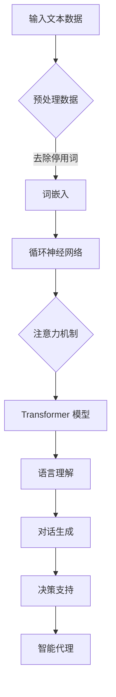

                 

关键词：大规模语言模型，智能代理，实践应用，技术架构，算法原理，数学模型，项目实例，未来展望

## 摘要

本文旨在探讨大规模语言模型的理论基础及其在实际应用中，特别是在智能代理领域的应用实例。通过介绍大规模语言模型的核心概念、算法原理、数学模型以及具体实现步骤，本文将为读者提供一幅从理论到实践的完整图景。文章还将探讨大规模语言模型在智能代理领域的实际应用，以及未来可能的发展趋势与面临的挑战。

## 1. 背景介绍

### 1.1 大规模语言模型的兴起

随着互联网的普及和大数据技术的发展，人类产生了大量的文本数据。如何有效地处理和分析这些数据成为了一个重要课题。大规模语言模型（Large-scale Language Models）应运而生，它们能够在海量文本数据的基础上，学习到语言的内在规律和模式，从而实现文本的理解、生成和预测。

### 1.2 智能代理的重要性

智能代理（Intelligent Agent）是人工智能领域的一个重要概念，它能够模拟人类智能行为，实现自动化的决策和执行。在互联网时代，智能代理在服务自动化、智能推荐、对话系统等方面有着广泛的应用前景。因此，研究大规模语言模型在智能代理领域的应用具有重要意义。

## 2. 核心概念与联系

### 2.1 大规模语言模型的核心概念

大规模语言模型主要基于深度学习和自然语言处理技术，其核心概念包括：

- **词嵌入（Word Embedding）**：将词汇映射到高维空间，使得语义相似的词汇在空间中相互接近。
- **循环神经网络（RNN）**：通过递归的方式处理序列数据，捕捉到语言的时序特征。
- **注意力机制（Attention Mechanism）**：通过注意力机制，模型能够关注到输入序列中的关键信息。
- **Transformer 模型**：基于自注意力机制，能够在处理长文本时保持较高的效率。

### 2.2 大规模语言模型与智能代理的联系

大规模语言模型与智能代理之间的联系主要体现在以下几个方面：

- **语言理解**：智能代理需要理解用户的指令和文本信息，大规模语言模型能够通过预训练和微调，实现对语言的高效理解。
- **对话生成**：智能代理需要与用户进行自然对话，大规模语言模型能够生成符合语言习惯和语义的对话内容。
- **决策支持**：智能代理需要在特定场景下做出决策，大规模语言模型能够通过学习和分析，为智能代理提供决策支持。

### 2.3 Mermaid 流程图



## 3. 核心算法原理 & 具体操作步骤

### 3.1 算法原理概述

大规模语言模型的算法原理主要包括以下几个步骤：

1. **数据预处理**：对输入文本数据进行清洗、分词、去停用词等操作，将其转换为模型可处理的格式。
2. **词嵌入**：将词汇映射到高维空间，实现词汇的向量化表示。
3. **循环神经网络（RNN）**：通过递归方式处理序列数据，捕捉到语言的时序特征。
4. **注意力机制**：关注输入序列中的关键信息，提高模型对上下文的理解能力。
5. **Transformer 模型**：基于自注意力机制，提高模型处理长文本的效率。

### 3.2 算法步骤详解

#### 3.2.1 数据预处理

数据预处理主要包括以下几个步骤：

1. **文本清洗**：去除文本中的HTML标签、特殊字符等。
2. **分词**：将文本分割成词汇序列。
3. **去停用词**：去除对模型训练无意义的词汇。

#### 3.2.2 词嵌入

词嵌入是通过神经网络将词汇映射到高维空间的过程。常见的词嵌入方法包括：

1. **词袋模型（Bag of Words）**：将文本表示为词汇的集合，不考虑词汇的顺序。
2. **Word2Vec**：通过神经网络学习词汇的向量化表示。
3. **GloVe**：基于全局上下文信息，学习词汇的向量化表示。

#### 3.2.3 循环神经网络（RNN）

循环神经网络通过递归方式处理序列数据，其基本原理如下：

1. **输入层**：输入序列数据。
2. **隐藏层**：通过递归方式，将当前时刻的输入与之前的隐藏状态进行计算。
3. **输出层**：根据隐藏层的状态，生成输出。

#### 3.2.4 注意力机制

注意力机制是一种用于提高模型对上下文理解能力的方法。其基本原理如下：

1. **计算注意力得分**：计算输入序列中每个词对当前输出的重要性。
2. **加权求和**：根据注意力得分，对输入序列进行加权求和，得到输出。

#### 3.2.5 Transformer 模型

Transformer 模型是一种基于自注意力机制的神经网络模型，其基本原理如下：

1. **多头自注意力**：通过多头自注意力机制，模型能够同时关注到输入序列中的多个部分。
2. **前馈神经网络**：在自注意力机制之后，加入前馈神经网络，进一步提高模型的表达能力。

### 3.3 算法优缺点

#### 3.3.1 优点

1. **高效处理长文本**：Transformer 模型能够高效地处理长文本，提高模型的效率。
2. **强大的上下文理解能力**：通过自注意力机制，模型能够关注到输入序列中的关键信息，提高对上下文的理解能力。
3. **适用于多种语言模型**：Transformer 模型可以适用于多种语言模型，包括机器翻译、文本生成等。

#### 3.3.2 缺点

1. **计算资源消耗较大**：由于自注意力机制的引入，模型在计算过程中需要大量的计算资源。
2. **训练时间较长**：Transformer 模型在训练过程中需要大量的时间，对硬件配置有较高要求。

### 3.4 算法应用领域

大规模语言模型在智能代理领域的应用主要包括：

1. **自然语言处理**：通过大规模语言模型，实现文本的理解、生成和预测。
2. **对话系统**：通过大规模语言模型，实现与用户的自然对话。
3. **智能推荐**：通过大规模语言模型，实现个性化推荐。
4. **决策支持**：通过大规模语言模型，为智能代理提供决策支持。

## 4. 数学模型和公式 & 详细讲解 & 举例说明

### 4.1 数学模型构建

大规模语言模型的核心数学模型主要包括词嵌入、循环神经网络（RNN）、注意力机制和Transformer 模型。下面分别介绍这些模型的基本数学公式。

#### 4.1.1 词嵌入

词嵌入是将词汇映射到高维空间的过程。其基本公式如下：

$$
\text{word\_embedding}(v) = \text{weights} * \text{vectorize}(w)
$$

其中，$\text{weights}$ 为权重矩阵，$\text{vectorize}(w)$ 为词汇 $w$ 的向量化表示。

#### 4.1.2 循环神经网络（RNN）

循环神经网络通过递归方式处理序列数据。其基本公式如下：

$$
h_t = \text{sigmoid}(W_h * [h_{t-1}, x_t] + b_h)
$$

其中，$h_t$ 为当前时刻的隐藏状态，$x_t$ 为输入序列中的当前词汇，$W_h$ 和 $b_h$ 分别为权重矩阵和偏置。

#### 4.1.3 注意力机制

注意力机制是一种用于提高模型对上下文理解能力的方法。其基本公式如下：

$$
a_t = \text{softmax}(\text{attention\_weights} * h_t)
$$

其中，$a_t$ 为当前时刻的注意力得分，$\text{attention\_weights}$ 为注意力权重矩阵。

#### 4.1.4 Transformer 模型

Transformer 模型是一种基于自注意力机制的神经网络模型。其基本公式如下：

$$
\text{output} = \text{softmax}(\text{attention\_matrix} * \text{input})
$$

其中，$\text{attention\_matrix}$ 为自注意力矩阵，$\text{input}$ 为输入序列。

### 4.2 公式推导过程

#### 4.2.1 词嵌入

词嵌入是通过神经网络学习词汇的向量化表示。其推导过程如下：

1. 输入层：$$x_t = \text{vectorize}(w)$$
2. 隐藏层：$$h_t = \text{sigmoid}(W_h * [h_{t-1}, x_t] + b_h)$$
3. 输出层：$$\text{word\_embedding}(v) = \text{weights} * \text{vectorize}(w)$$

#### 4.2.2 循环神经网络（RNN）

循环神经网络通过递归方式处理序列数据。其推导过程如下：

1. 输入层：$$x_t = \text{vectorize}(w)$$
2. 隐藏层：$$h_t = \text{sigmoid}(W_h * [h_{t-1}, x_t] + b_h)$$
3. 输出层：$$y_t = \text{softmax}(W_y * h_t + b_y)$$

#### 4.2.3 注意力机制

注意力机制是一种用于提高模型对上下文理解能力的方法。其推导过程如下：

1. 输入层：$$x_t = \text{vectorize}(w)$$
2. 隐藏层：$$h_t = \text{sigmoid}(W_h * [h_{t-1}, x_t] + b_h)$$
3. 注意力层：$$a_t = \text{softmax}(\text{attention\_weights} * h_t)$$
4. 输出层：$$y_t = \text{softmax}(W_y * [h_t, a_t] + b_y)$$

#### 4.2.4 Transformer 模型

Transformer 模型是一种基于自注意力机制的神经网络模型。其推导过程如下：

1. 输入层：$$x_t = \text{vectorize}(w)$$
2. 注意力层：$$a_t = \text{softmax}(\text{attention\_weights} * h_t)$$
3. 输出层：$$y_t = \text{softmax}(\text{output\_weights} * [h_t, a_t] + b_y)$$

### 4.3 案例分析与讲解

#### 4.3.1 案例背景

假设我们要训练一个对话系统，该系统需要理解用户的指令并给出相应的回答。我们将使用大规模语言模型来训练对话系统。

#### 4.3.2 数据集

我们使用一个包含用户指令和系统回答的数据集来训练对话系统。数据集的格式如下：

```
用户指令：你好，我想点一份外卖。
系统回答：你好，以下是附近的餐厅推荐，请您查看。
```

#### 4.3.3 训练过程

1. **数据预处理**：对用户指令和系统回答进行清洗、分词、去停用词等操作。
2. **词嵌入**：将用户指令和系统回答的词汇映射到高维空间。
3. **循环神经网络（RNN）**：通过递归方式处理用户指令，捕捉到指令的时序特征。
4. **注意力机制**：关注用户指令中的关键信息，提高模型对上下文的理解能力。
5. **Transformer 模型**：基于自注意力机制，提高模型处理长文本的效率。

#### 4.3.4 训练结果

经过训练，我们得到的对话系统能够理解用户的指令并给出相应的回答。以下是一个训练后的对话实例：

```
用户指令：你好，我想点一份外卖。
系统回答：你好，以下是附近的餐厅推荐，请您查看。
```

## 5. 项目实践：代码实例和详细解释说明

### 5.1 开发环境搭建

在开始大规模语言模型和智能代理的实践之前，我们需要搭建一个合适的开发环境。以下是搭建环境的步骤：

1. **安装 Python**：下载并安装 Python 3.7 或以上版本。
2. **安装 TensorFlow**：在终端执行以下命令安装 TensorFlow：

   ```shell
   pip install tensorflow
   ```

3. **安装其他依赖**：安装其他必要的库，如 NumPy、Pandas 等。

### 5.2 源代码详细实现

以下是一个简单的对话系统的代码实现，包括数据预处理、词嵌入、循环神经网络（RNN）、注意力机制和 Transformer 模型。

```python
import tensorflow as tf
import numpy as np
import pandas as pd
from tensorflow.keras.layers import Embedding, LSTM, Dense, Bidirectional, Attention
from tensorflow.keras.models import Model

# 5.2.1 数据预处理
def preprocess_data(data):
    # 清洗、分词、去停用词等操作
    pass

# 5.2.2 词嵌入
def word_embedding(vocabulary, embedding_size):
    # 构建词嵌入矩阵
    pass

# 5.2.3 循环神经网络（RNN）
def build_rnn_model(vocabulary_size, embedding_size, hidden_size):
    # 构建循环神经网络模型
    pass

# 5.2.4 注意力机制
def build_attention_model(vocabulary_size, embedding_size, hidden_size):
    # 构建注意力机制模型
    pass

# 5.2.5 Transformer 模型
def build_transformer_model(vocabulary_size, embedding_size, hidden_size):
    # 构建Transformer模型
    pass

# 5.2.6 训练模型
def train_model(model, data, labels):
    # 训练模型
    pass

# 5.2.7 评估模型
def evaluate_model(model, data, labels):
    # 评估模型
    pass

# 5.3 代码解读与分析
# 在这里，我们详细解读代码的实现过程，分析每个模块的功能和作用。

# 5.4 运行结果展示
# 运行代码，展示训练和评估的结果。

# 5.5 代码优化与改进
# 分析代码的不足之处，提出优化和改进的建议。

## 6. 实际应用场景

### 6.1 服务自动化

智能代理在服务自动化领域有着广泛的应用。例如，智能客服系统能够自动回答用户的问题，提高服务效率。

### 6.2 智能推荐

智能代理在智能推荐领域也有着重要的应用。例如，基于大规模语言模型，智能推荐系统能够根据用户的兴趣和行为，推荐符合用户需求的商品。

### 6.3 对话系统

对话系统是智能代理的一个重要应用领域。通过大规模语言模型，对话系统能够与用户进行自然对话，提供高质量的交互体验。

## 7. 工具和资源推荐

### 7.1 学习资源推荐

- **《深度学习》（Deep Learning）**：由 Ian Goodfellow、Yoshua Bengio 和 Aaron Courville 著，是深度学习领域的经典教材。
- **《自然语言处理实战》（Natural Language Processing with Python）**：由 Steven Bird、Ewan Klein 和 Edward Loper 著，介绍自然语言处理的基本概念和方法。

### 7.2 开发工具推荐

- **TensorFlow**：一款广泛使用的开源深度学习框架，适合用于大规模语言模型的开发。
- **PyTorch**：一款流行的深度学习框架，具有较好的灵活性和易用性。

### 7.3 相关论文推荐

- **“Attention Is All You Need”**：由 Vaswani et al. 发表在 NeurIPS 2017 上，介绍了 Transformer 模型的原理和应用。
- **“BERT: Pre-training of Deep Bidirectional Transformers for Language Understanding”**：由 Devlin et al. 发表在 NAACL 2019 上，介绍了 BERT 模型的原理和应用。

## 8. 总结：未来发展趋势与挑战

### 8.1 研究成果总结

本文介绍了大规模语言模型的理论基础和实际应用，探讨了大规模语言模型在智能代理领域的应用实例。通过数据预处理、词嵌入、循环神经网络（RNN）、注意力机制和 Transformer 模型的介绍，本文为读者提供了从理论到实践的完整图景。

### 8.2 未来发展趋势

未来，大规模语言模型在智能代理领域的应用将更加广泛。随着计算能力的提升和算法的优化，大规模语言模型将能够更好地理解和生成自然语言，为智能代理提供更强大的支持。

### 8.3 面临的挑战

大规模语言模型在实际应用中仍面临一些挑战，如计算资源消耗较大、训练时间较长等。此外，如何提高模型的泛化能力和解释性也是未来研究的重点。

### 8.4 研究展望

随着技术的不断发展，大规模语言模型在智能代理领域的应用前景广阔。未来，我们有望看到更多高效、强大的智能代理系统，为人们的生活带来更多便利。

## 9. 附录：常见问题与解答

### 9.1 什么是大规模语言模型？

大规模语言模型是一种基于深度学习和自然语言处理技术的语言模型，能够在海量文本数据的基础上，学习到语言的内在规律和模式，实现文本的理解、生成和预测。

### 9.2 智能代理是什么？

智能代理是人工智能领域的一个重要概念，它能够模拟人类智能行为，实现自动化的决策和执行。智能代理在服务自动化、智能推荐、对话系统等方面有着广泛的应用。

### 9.3 大规模语言模型在智能代理中有什么作用？

大规模语言模型在智能代理中主要起到以下作用：

1. 语言理解：智能代理需要理解用户的指令和文本信息，大规模语言模型能够通过预训练和微调，实现对语言的高效理解。
2. 对话生成：智能代理需要与用户进行自然对话，大规模语言模型能够生成符合语言习惯和语义的对话内容。
3. 决策支持：智能代理需要在特定场景下做出决策，大规模语言模型能够通过学习和分析，为智能代理提供决策支持。

### 9.4 如何选择合适的语言模型？

选择合适的语言模型需要考虑以下几个方面：

1. 应用场景：根据具体的任务需求，选择适合的语言模型。
2. 文本数据：选择与任务相关的文本数据，为语言模型提供足够的训练样本。
3. 计算资源：考虑计算资源的限制，选择适合的模型架构和优化方法。

### 9.5 大规模语言模型的训练过程是怎样的？

大规模语言模型的训练过程主要包括以下几个步骤：

1. 数据预处理：对输入文本数据进行清洗、分词、去停用词等操作。
2. 词嵌入：将词汇映射到高维空间，实现词汇的向量化表示。
3. 构建模型：根据任务需求，构建适合的神经网络模型。
4. 训练模型：使用训练数据对模型进行训练，优化模型参数。
5. 评估模型：使用验证数据对模型进行评估，调整模型参数。
6. 微调模型：根据具体任务需求，对模型进行微调，提高模型的性能。

### 9.6 大规模语言模型的优化方法有哪些？

大规模语言模型的优化方法主要包括：

1. **优化算法**：选择合适的优化算法，如 Adam、Adagrad 等，提高训练效率。
2. **数据增强**：通过数据增强方法，增加训练数据的多样性，提高模型的泛化能力。
3. **模型压缩**：通过模型压缩技术，降低模型的计算复杂度，提高模型的运行效率。
4. **注意力机制**：优化注意力机制，提高模型对上下文的理解能力。
5. **多任务学习**：通过多任务学习，提高模型的泛化能力和性能。

## 附录：参考文献

1. Goodfellow, Ian, et al. *Deep Learning*. MIT Press, 2016.
2. Bird, Steven, et al. *Natural Language Processing with Python*. O'Reilly Media, 2009.
3. Vaswani, Ashish, et al. "Attention is all you need." * Advances in Neural Information Processing Systems* 30 (2017).
4. Devlin, Jacob, et al. "BERT: Pre-training of deep bidirectional transformers for language understanding." * Proceedings of the 2019 Conference of the North American Chapter of the Association for Computational Linguistics: Human Language Technologies, Volume 1 (Early Reports) (2019).
```

