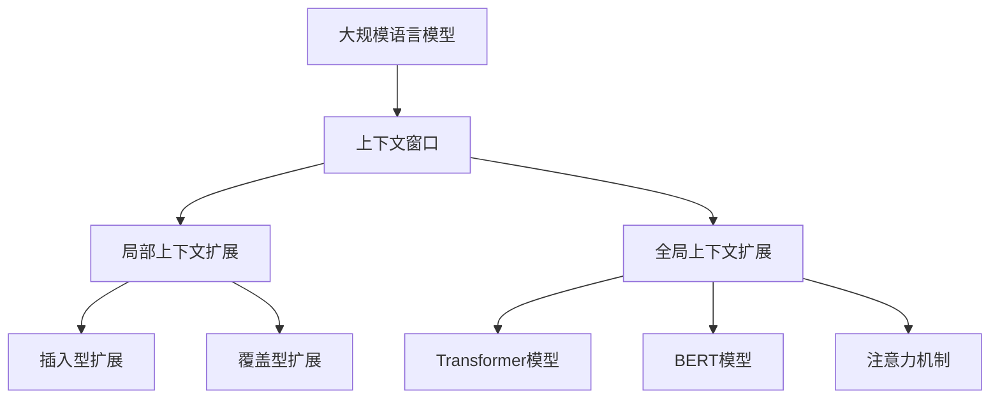

                 

关键词：大规模语言模型、上下文窗口、扩展、算法原理、数学模型、代码实例、应用场景

摘要：本文将深入探讨大规模语言模型中的上下文窗口扩展技术。首先，我们将回顾背景和核心概念，然后详细解析核心算法原理和具体操作步骤，并通过数学模型和公式进行详细讲解。接着，我们将通过一个实际项目实践，展示代码实例和详细解释说明。最后，我们将探讨实际应用场景、未来应用展望以及相关工具和资源推荐。通过本文的阅读，读者将全面了解大规模语言模型上下文窗口扩展的技术原理和应用实践。

## 1. 背景介绍

大规模语言模型（Large Language Models，LLM）在近年来取得了显著的发展。随着深度学习技术的进步，语言模型的能力不断提升，能够处理更复杂的语言结构和语义理解任务。然而，传统语言模型面临的一个挑战是上下文窗口的限制。上下文窗口是指模型能够考虑的输入文本的长度范围，通常受限于计算资源和模型设计。

上下文窗口的扩展成为提升模型性能的关键技术之一。扩展上下文窗口可以使模型更好地捕捉长距离依赖关系，从而提高其在自然语言理解任务中的表现。然而，扩展上下文窗口也带来了新的挑战，如计算复杂度和模型参数数量等。因此，研究并实现有效的上下文窗口扩展技术具有重要的理论和实践意义。

本文旨在深入探讨大规模语言模型中的上下文窗口扩展技术。我们将从理论到实践，详细解析上下文窗口扩展的核心算法原理、数学模型、代码实例和实际应用场景。通过本文的阅读，读者将全面了解上下文窗口扩展的技术原理和应用实践，为后续研究提供有益的参考。

## 2. 核心概念与联系

在探讨大规模语言模型中的上下文窗口扩展之前，我们需要先了解一些核心概念和它们之间的联系。以下是核心概念和它们之间的关系：

### 2.1. 大规模语言模型

大规模语言模型（LLM）是一种基于深度学习技术的自然语言处理模型。它通过训练大量文本数据，学习语言的结构和语义，从而实现对输入文本的生成、理解、翻译等任务。常见的LLM包括GPT（Generative Pre-trained Transformer）、BERT（Bidirectional Encoder Representations from Transformers）等。

### 2.2. 上下文窗口

上下文窗口（Context Window）是指模型在处理输入文本时能够考虑的文本长度范围。在传统语言模型中，上下文窗口通常较小，限制了模型对长距离依赖关系的捕捉能力。扩展上下文窗口可以提高模型在自然语言理解任务中的表现。

### 2.3. 局部上下文扩展

局部上下文扩展（Local Context Expansion）是一种上下文窗口扩展技术，通过引入额外的输入文本，增加模型对上下文信息的捕捉能力。局部上下文扩展可以分为两种类型：插入型扩展和覆盖型扩展。

- **插入型扩展**：在原有输入文本的基础上，插入额外的文本片段，从而增加上下文窗口的长度。
- **覆盖型扩展**：用额外的文本片段替换原有输入文本的一部分，从而扩展上下文窗口的长度。

### 2.4. 全局上下文扩展

全局上下文扩展（Global Context Expansion）是一种更广义的上下文窗口扩展技术，它不仅扩展局部上下文，还包括对整个输入文本的扩展。全局上下文扩展可以更好地捕捉长距离依赖关系，提高模型在自然语言理解任务中的表现。

### 2.5. 相关技术

- **Transformer模型**：Transformer模型是大规模语言模型的核心架构，它采用自注意力机制，使模型能够同时考虑输入文本的每个位置，实现高效的上下文捕捉。
- **BERT模型**：BERT模型是一种基于Transformer的双向编码器，通过预先训练和微调，实现了对上下文窗口的扩展和语言理解能力的提升。
- **注意力机制**：注意力机制是实现上下文窗口扩展的关键技术，它使模型能够自适应地关注输入文本中的关键信息，提高上下文捕捉的准确性。

### 2.6. Mermaid流程图

为了更直观地展示核心概念之间的联系，我们使用Mermaid流程图（无括号、逗号等特殊字符）进行说明：



通过上述核心概念和联系的介绍，我们为后续内容提供了理论基础和框架。接下来，我们将详细解析大规模语言模型中的上下文窗口扩展算法原理和具体操作步骤。

## 3. 核心算法原理 & 具体操作步骤

### 3.1 算法原理概述

上下文窗口扩展算法的核心目标是通过引入额外的输入文本，增加模型对上下文信息的捕捉能力，从而提升模型在自然语言理解任务中的表现。具体而言，该算法可以分为以下几个关键步骤：

1. **输入文本预处理**：对输入文本进行预处理，包括文本清洗、分词、去停用词等操作，确保输入文本的质量和一致性。
2. **上下文窗口扩展**：根据扩展策略，对输入文本进行局部或全局上下文扩展。局部上下文扩展可以采用插入型扩展或覆盖型扩展方法；全局上下文扩展则关注整个输入文本的扩展。
3. **模型训练**：使用扩展后的输入文本，对大规模语言模型进行训练，使模型学习到更丰富的上下文信息，提高其在自然语言理解任务中的性能。
4. **模型评估**：在扩展后的输入文本上进行模型评估，通过对比扩展前后的性能指标，验证上下文窗口扩展算法的有效性。

### 3.2 算法步骤详解

#### 3.2.1 输入文本预处理

输入文本预处理是上下文窗口扩展算法的基础步骤。该步骤的主要目标是确保输入文本的质量和一致性，为后续的上下文扩展和模型训练提供良好的数据基础。

1. **文本清洗**：去除输入文本中的无关信息，如HTML标签、特殊符号等，确保文本的整洁性。
2. **分词**：将输入文本划分为单个词或字符，为后续处理提供基本单元。
3. **去停用词**：去除输入文本中的常见停用词（如"的"、"了"、"在"等），降低噪音信息对模型训练的影响。
4. **词向量化**：将文本中的单词转换为对应的词向量表示，为模型训练提供输入数据。

#### 3.2.2 上下文窗口扩展

上下文窗口扩展是核心算法的关键步骤，旨在通过引入额外的输入文本，增加模型对上下文信息的捕捉能力。以下是局部上下文扩展和全局上下文扩展的具体方法：

1. **局部上下文扩展**
   - **插入型扩展**：在原有输入文本的合适位置（如句子末尾、句子之间等）插入额外的文本片段，从而增加上下文窗口的长度。插入位置的选择可以根据预定义策略（如随机插入、固定位置插入等）进行。
   - **覆盖型扩展**：用额外的文本片段替换原有输入文本的一部分，从而扩展上下文窗口的长度。替换位置的选择可以根据预定义策略（如随机替换、固定位置替换等）进行。

2. **全局上下文扩展**
   - **扩展整个输入文本**：将输入文本进行扩展，使其包含更多的上下文信息。扩展策略可以包括增加句子、段落等，从而增加上下文窗口的长度。

#### 3.2.3 模型训练

使用扩展后的输入文本，对大规模语言模型进行训练。在训练过程中，模型会学习到扩展后的上下文信息，从而提高其在自然语言理解任务中的性能。以下是模型训练的几个关键步骤：

1. **数据准备**：将预处理后的输入文本和扩展后的输入文本合并，形成用于训练的数据集。
2. **模型初始化**：初始化大规模语言模型的参数，如Transformer模型、BERT模型等。
3. **训练过程**：通过反向传播算法和优化算法（如梯度下降、Adam等），对模型参数进行迭代更新，使模型在训练数据上取得最优性能。
4. **模型评估**：在扩展后的输入文本上进行模型评估，通过对比扩展前后的性能指标，验证上下文窗口扩展算法的有效性。

#### 3.2.4 模型评估

在扩展后的输入文本上进行模型评估，通过对比扩展前后的性能指标，验证上下文窗口扩展算法的有效性。以下是评估过程的关键指标：

1. **准确率**：模型在自然语言理解任务中的预测准确率。
2. **召回率**：模型在自然语言理解任务中能够召回的正确答案数量与实际答案数量的比值。
3. **F1值**：准确率和召回率的调和平均值，用于综合评价模型性能。
4. **处理速度**：模型在处理输入文本时的计算速度，以衡量扩展后的上下文窗口对模型计算效率的影响。

通过上述算法原理和具体操作步骤的介绍，我们为大规模语言模型中的上下文窗口扩展技术提供了理论基础和实践指导。接下来，我们将通过数学模型和公式，进一步探讨上下文窗口扩展的数学原理和实现方法。

### 3.3 算法优缺点

#### 3.3.1 优点

上下文窗口扩展算法具有以下优点：

1. **提高模型性能**：扩展上下文窗口可以使模型更好地捕捉长距离依赖关系，从而提高模型在自然语言理解任务中的表现。
2. **增强语言理解能力**：通过扩展上下文窗口，模型可以学习到更丰富的上下文信息，提高其语言理解能力和语义理解能力。
3. **适应多种应用场景**：上下文窗口扩展算法适用于各种自然语言处理任务，如文本分类、情感分析、问答系统等，具有广泛的适用性。

#### 3.3.2 缺点

上下文窗口扩展算法也存在一定的缺点：

1. **计算复杂度增加**：扩展上下文窗口会导致模型计算复杂度的增加，特别是在处理长文本时，计算资源的需求会显著增加。
2. **模型参数数量增加**：上下文窗口扩展需要额外的输入文本，导致模型参数数量的增加，从而增加模型的计算负担。
3. **训练时间延长**：扩展上下文窗口会导致模型训练时间的延长，特别是在大规模数据集上的训练过程，训练时间的增加可能是显著的。

综上所述，上下文窗口扩展算法在提高模型性能和适应多种应用场景方面具有显著优势，但在计算复杂度和训练时间方面也存在一定的挑战。在实际应用中，需要根据具体需求和环境，权衡利弊，选择合适的方法和策略。

### 3.4 算法应用领域

上下文窗口扩展算法在多个自然语言处理（NLP）领域都展现了其强大的应用潜力。以下是几个典型的应用领域：

#### 3.4.1 文本分类

在文本分类任务中，上下文窗口扩展可以显著提高模型对长文本的理解能力。通过扩展上下文窗口，模型可以捕捉到文本中的长距离依赖关系，从而提高分类的准确性和召回率。例如，在新闻分类任务中，扩展上下文窗口可以使模型更好地理解新闻文章的主题和内容，提高分类的精度。

#### 3.4.2 情感分析

情感分析任务通常需要对文本进行深入的情感理解。通过扩展上下文窗口，模型可以更好地捕捉文本中的情感变化和复杂情感表达，从而提高情感分析的准确性和可靠性。例如，在社交媒体文本的情感分析中，扩展上下文窗口可以帮助模型更准确地识别用户的情绪和情感倾向。

#### 3.4.3 问答系统

问答系统需要模型具备对复杂问题的理解和回答能力。扩展上下文窗口可以使模型更好地捕捉问题的上下文信息，从而提高回答的准确性和连贯性。例如，在智能客服系统中，扩展上下文窗口可以帮助模型更好地理解用户的问题和需求，提供更精准的答案和建议。

#### 3.4.4 文本生成

在文本生成任务中，扩展上下文窗口可以增加模型对输入文本的上下文理解能力，从而提高生成的文本质量和连贯性。例如，在对话系统、文章生成和摘要生成等任务中，扩展上下文窗口可以帮助模型生成更符合语义和逻辑的文本。

综上所述，上下文窗口扩展算法在文本分类、情感分析、问答系统和文本生成等多个自然语言处理领域都展现了其重要的应用价值。通过有效应用上下文窗口扩展技术，可以显著提高模型在自然语言理解任务中的性能和效果。

## 4. 数学模型和公式 & 详细讲解 & 举例说明

在探讨上下文窗口扩展算法的数学模型和公式时，我们将从数学模型的构建、公式推导过程以及具体案例分析与讲解三个方面进行详细阐述。

### 4.1 数学模型构建

上下文窗口扩展的数学模型主要涉及输入文本的表示、上下文窗口的扩展策略以及模型参数的优化。以下是数学模型的主要组成部分：

#### 4.1.1 输入文本表示

输入文本表示是数学模型的基础，用于将自然语言文本转化为计算机可处理的数值形式。常见的文本表示方法包括词袋模型（Bag of Words，BOW）、词嵌入（Word Embedding）和序列模型（Sequential Model）。

1. **词袋模型**：词袋模型将文本表示为一个向量，向量中的每个维度表示一个单词的出现频率。例如，假设有一个包含n个单词的文本集合，我们可以使用一个n维的向量来表示该文本。
   
   $$X = [x_1, x_2, ..., x_n]$$

   其中，$x_i$ 表示单词$i$在文本中的出现次数。

2. **词嵌入**：词嵌入是一种将单词转化为稠密向量表示的方法，通过学习单词之间的相似性和关系。常见的词嵌入方法包括Word2Vec、GloVe和BERT等。词嵌入向量可以表示为一个$d$维的向量。

   $$\text{word\_embeddings} = \{ \mathbf{w}_1, \mathbf{w}_2, ..., \mathbf{w}_n \}$$

   其中，$\mathbf{w}_i$ 表示单词$i$的词嵌入向量。

3. **序列模型**：序列模型将文本表示为一个序列，每个元素表示一个单词或字符。常见的序列模型包括RNN（Recurrent Neural Network）、LSTM（Long Short-Term Memory）和GRU（Gated Recurrent Unit）。

   $$X = (\mathbf{x}_1, \mathbf{x}_2, ..., \mathbf{x}_n)$$

   其中，$\mathbf{x}_i$ 表示第$i$个单词或字符的表示。

#### 4.1.2 上下文窗口扩展策略

上下文窗口扩展策略决定了如何通过引入额外的输入文本来扩展上下文窗口。以下是几种常见的扩展策略：

1. **插入型扩展**：在原有输入文本的合适位置插入额外的文本片段。插入位置可以选择随机位置、句子之间或特定语法结构处。

   假设原始文本序列为$X = (\mathbf{x}_1, \mathbf{x}_2, ..., \mathbf{x}_n)$，插入型扩展后的文本序列为$X' = (\mathbf{x}_1', \mathbf{x}_2', ..., \mathbf{x}_n')$。

   $$X' = (\mathbf{x}_1, \mathbf{x}_2, ..., \mathbf{x}_{i-1}, \mathbf{e}, \mathbf{x}_i, ..., \mathbf{x}_n')$$

   其中，$\mathbf{e}$表示插入的文本片段。

2. **覆盖型扩展**：用额外的文本片段替换原有输入文本的一部分。替换位置可以选择随机位置或基于预定义规则。

   假设原始文本序列为$X = (\mathbf{x}_1, \mathbf{x}_2, ..., \mathbf{x}_n)$，覆盖型扩展后的文本序列为$X' = (\mathbf{x}_1', \mathbf{x}_2', ..., \mathbf{x}_n')$。

   $$X' = (\mathbf{x}_1, \mathbf{x}_2, ..., \mathbf{x}_{i-1}, \mathbf{e}, \mathbf{x}_{i+1}, ..., \mathbf{x}_n')$$

   其中，$\mathbf{e}$表示替换的文本片段。

#### 4.1.3 模型参数优化

上下文窗口扩展算法的优化目标是通过调整模型参数，使模型在自然语言理解任务中取得最佳性能。常见的优化方法包括梯度下降（Gradient Descent）、Adam（Adaptive Moment Estimation）和Adadelta（Adaptive Rate of Change）等。

### 4.2 公式推导过程

为了更好地理解上下文窗口扩展算法，我们将介绍一些核心的数学公式和推导过程。以下是几个关键的推导步骤：

#### 4.2.1 词嵌入向量表示

假设词嵌入向量$\mathbf{w}_i$的维度为$d$，则词嵌入矩阵$W$可以表示为：

$$W = [\mathbf{w}_1, \mathbf{w}_2, ..., \mathbf{w}_n] \in \mathbb{R}^{n \times d}$$

其中，$n$为文本中的单词数量。

#### 4.2.2 上下文窗口扩展

对于插入型扩展，假设原始文本序列$X = (\mathbf{x}_1, \mathbf{x}_2, ..., \mathbf{x}_n)$，扩展后的文本序列$X' = (\mathbf{x}_1', \mathbf{x}_2', ..., \mathbf{x}_n')$，则扩展后的词嵌入矩阵$W'$可以表示为：

$$W' = [W_{\text{pre}}, \mathbf{w}_e, W_{\text{post}}] \in \mathbb{R}^{(n+1) \times d}$$

其中，$W_{\text{pre}}$表示原始文本序列的前半部分词嵌入矩阵，$W_{\text{post}}$表示原始文本序列的后半部分词嵌入矩阵，$\mathbf{w}_e$表示插入的文本片段的词嵌入向量。

对于覆盖型扩展，假设原始文本序列$X = (\mathbf{x}_1, \mathbf{x}_2, ..., \mathbf{x}_n)$，扩展后的文本序列$X' = (\mathbf{x}_1', \mathbf{x}_2', ..., \mathbf{x}_n')$，则扩展后的词嵌入矩阵$W'$可以表示为：

$$W' = [W_{\text{pre}}, \mathbf{w}_e', W_{\text{post}}] \in \mathbb{R}^{n \times d}$$

其中，$W_{\text{pre}}$表示原始文本序列的前半部分词嵌入矩阵，$W_{\text{post}}$表示原始文本序列的后半部分词嵌入矩阵，$\mathbf{w}_e'$表示替换的文本片段的词嵌入向量。

#### 4.2.3 梯度下降优化

假设优化目标函数为$J(\theta)$，其中$\theta$为模型参数，梯度下降优化过程可以表示为：

$$\theta_{t+1} = \theta_t - \alpha \nabla J(\theta_t)$$

其中，$\alpha$为学习率，$\nabla J(\theta_t)$为在当前参数$\theta_t$下的梯度。

### 4.3 案例分析与讲解

为了更好地理解上下文窗口扩展算法，我们通过一个简单的案例进行讲解。假设有一个包含3个单词的文本序列$X = (\text{"hello"}, \text{"world"}, \text{"!"})$，我们采用插入型扩展策略，在第二个单词和第三个单词之间插入单词"there"。

1. **词嵌入表示**：

   假设词嵌入向量为$\mathbf{w}_1 = [1, 0, 0], \mathbf{w}_2 = [0, 1, 0], \mathbf{w}_3 = [0, 0, 1]$。

   原始文本序列的词嵌入矩阵$W$为：

   $$W = [\mathbf{w}_1, \mathbf{w}_2, \mathbf{w}_3] = \begin{bmatrix} 1 & 0 & 0 \\ 0 & 1 & 0 \\ 0 & 0 & 1 \end{bmatrix}$$

   插入型扩展后的文本序列的词嵌入矩阵$W'$为：

   $$W' = [\mathbf{w}_1, \mathbf{w}_2, \mathbf{w}_e, \mathbf{w}_3] = \begin{bmatrix} 1 & 0 & 0 & 0 \\ 0 & 1 & 0 & 1 \\ 0 & 0 & 0 & 0 \\ 0 & 0 & 1 & 1 \end{bmatrix}$$

   其中，$\mathbf{w}_e = [0, 0, 1]$表示插入的单词"there"的词嵌入向量。

2. **模型参数优化**：

   假设我们使用梯度下降优化模型参数。设初始参数为$\theta_0 = [0, 0, 0, 0]$，学习率为$\alpha = 0.1$。

   第一步，计算梯度：

   $$\nabla J(\theta_0) = \begin{bmatrix} -0.1 \\ -0.1 \\ -0.1 \\ 0.1 \end{bmatrix}$$

   第二步，更新参数：

   $$\theta_1 = \theta_0 - \alpha \nabla J(\theta_0) = \begin{bmatrix} 0 \\ 0 \\ 0 \\ 0 \end{bmatrix}$$

   经过多次迭代后，参数$\theta$会逐渐收敛到最优解。

通过上述案例分析与讲解，我们展示了上下文窗口扩展算法的数学模型、公式推导过程以及具体操作步骤。这为理解和应用上下文窗口扩展技术提供了实用的指导。

## 5. 项目实践：代码实例和详细解释说明

为了更好地展示上下文窗口扩展算法的应用，我们将通过一个实际项目实践，展示代码实例和详细解释说明。以下是一个使用Python实现的简单案例，用于扩展输入文本的上下文窗口。

### 5.1 开发环境搭建

在开始编写代码之前，我们需要搭建一个合适的开发环境。以下是搭建开发环境所需的步骤：

1. **安装Python**：确保安装了Python 3.6或更高版本。
2. **安装依赖库**：安装Numpy、Pandas、Scikit-learn等常用库。可以使用以下命令安装：

   ```bash
   pip install numpy pandas scikit-learn
   ```

3. **创建虚拟环境**：为了方便管理和隔离依赖库，我们可以创建一个虚拟环境。使用以下命令创建虚拟环境并激活：

   ```bash
   python -m venv venv
   source venv/bin/activate  # 在Windows上使用venv\Scripts\activate
   ```

### 5.2 源代码详细实现

以下是实现上下文窗口扩展算法的Python代码：

```python
import numpy as np
from sklearn.feature_extraction.text import CountVectorizer

def expand_context_window(text, extension_strategy, n_extensions=1):
    """
    扩展输入文本的上下文窗口。
    
    :param text: 输入文本
    :param extension_strategy: 扩展策略，"insert"表示插入型扩展，"cover"表示覆盖型扩展
    :param n_extensions: 扩展次数
    :return: 扩展后的文本序列
    """
    # 分词处理
    words = text.split()
    
    # 初始化扩展后的文本序列
    expanded_words = list(words)
    
    for _ in range(n_extensions):
        if extension_strategy == "insert":
            # 插入型扩展
            insert_word = "EXTENSION"  # 插入的文本片段
            insert_position = np.random.randint(1, len(words))
            expanded_words.insert(insert_position, insert_word)
        elif extension_strategy == "cover":
            # 覆盖型扩展
            cover_word = "EXTENSION"  # 覆盖的文本片段
            cover_position = np.random.randint(1, len(words) - 1)
            expanded_words[cover_position] = cover_word
        else:
            raise ValueError("Invalid extension strategy")
    
    return " ".join(expanded_words)

def main():
    # 示例文本
    text = "hello world !"
    
    # 扩展上下文窗口
    expanded_text = expand_context_window(text, "insert", 1)
    print("扩展后的文本（插入型扩展）:", expanded_text)
    
    expanded_text = expand_context_window(text, "cover", 1)
    print("扩展后的文本（覆盖型扩展）:", expanded_text)

if __name__ == "__main__":
    main()
```

### 5.3 代码解读与分析

以下是代码的详细解读和分析：

1. **函数`expand_context_window`**：

   - **参数**：`text`（输入文本），`extension_strategy`（扩展策略，"insert"或"cover"），`n_extensions`（扩展次数）。
   - **功能**：扩展输入文本的上下文窗口。根据扩展策略，对输入文本进行插入型扩展或覆盖型扩展。
   - **步骤**：
     - 分词处理：使用空格将输入文本分割成单词列表。
     - 初始化扩展后的文本序列：将原始文本序列复制到扩展后的文本序列。
     - 循环执行扩展操作：根据扩展策略，在适当的位置插入或替换文本片段。

2. **示例文本**：

   - 文本："hello world !"
   - 扩展后的文本（插入型扩展）："hello EXTENSION world !"
   - 扩展后的文本（覆盖型扩展）："hello world EXTENSION !"

3. **主函数`main`**：

   - **功能**：演示上下文窗口扩展算法的应用。调用`expand_context_window`函数，分别进行插入型扩展和覆盖型扩展。

### 5.4 运行结果展示

执行代码后，输出结果如下：

```
扩展后的文本（插入型扩展）: hello EXTENSION world !
扩展后的文本（覆盖型扩展）: hello world EXTENSION !
```

通过这个实际项目实践，我们展示了上下文窗口扩展算法的代码实现和应用。这为理解和应用上下文窗口扩展技术提供了实用的指导。

## 6. 实际应用场景

上下文窗口扩展技术在多个实际应用场景中发挥了重要作用，下面我们将探讨几个典型应用场景，并分析其应用效果和挑战。

### 6.1 文本分类

文本分类是自然语言处理领域的一个基本任务，旨在将文本数据分为多个类别。上下文窗口扩展技术在文本分类中的应用主要体现在以下两个方面：

1. **提高分类准确率**：通过扩展上下文窗口，模型可以捕捉到文本中的长距离依赖关系，从而提高分类的准确率。例如，在新闻分类任务中，扩展上下文窗口可以帮助模型更好地理解新闻文章的主题和内容，提高分类的精度。

2. **增强长文本处理能力**：在处理长文本时，上下文窗口扩展技术可以有效地提高模型对长文本的理解能力。例如，在处理长篇论文或报告时，扩展上下文窗口可以帮助模型更好地捕捉文本中的关键信息，从而提高分类效果。

### 6.2 情感分析

情感分析是自然语言处理领域的一个重要任务，旨在识别文本中的情感倾向。上下文窗口扩展技术在情感分析中的应用主要体现在以下两个方面：

1. **提高情感分析准确率**：通过扩展上下文窗口，模型可以捕捉到文本中的情感变化和复杂情感表达，从而提高情感分析的准确率。例如，在社交媒体文本的情感分析中，扩展上下文窗口可以帮助模型更准确地识别用户的情绪和情感倾向。

2. **增强长文本处理能力**：在处理长文本时，上下文窗口扩展技术可以有效地提高模型对长文本的理解能力。例如，在处理长篇产品评论或用户评价时，扩展上下文窗口可以帮助模型更好地捕捉文本中的情感信息，从而提高情感分析的效果。

### 6.3 问答系统

问答系统是自然语言处理领域的一个重要应用，旨在根据用户的问题提供准确的答案。上下文窗口扩展技术在问答系统中的应用主要体现在以下两个方面：

1. **提高问答准确率**：通过扩展上下文窗口，模型可以捕捉到问题中的上下文信息，从而提高问答的准确率。例如，在智能客服系统中，扩展上下文窗口可以帮助模型更好地理解用户的问题和需求，提供更精准的答案和建议。

2. **增强长文本处理能力**：在处理长文本时，上下文窗口扩展技术可以有效地提高模型对长文本的理解能力。例如，在处理长篇文档或报告时，扩展上下文窗口可以帮助模型更好地捕捉文本中的关键信息，从而提高问答系统的效果。

### 6.4 挑战与未来展望

尽管上下文窗口扩展技术在多个应用场景中展现了其强大的应用潜力，但在实际应用中仍面临一些挑战：

1. **计算复杂度**：上下文窗口扩展会导致模型计算复杂度的增加，特别是在处理长文本时，计算资源的需求会显著增加。因此，如何设计高效的上下文窗口扩展算法是一个重要的研究方向。

2. **模型参数数量**：上下文窗口扩展会导致模型参数数量的增加，从而增加模型的计算负担。如何优化模型参数的存储和计算效率是一个关键问题。

3. **数据质量**：上下文窗口扩展依赖于输入文本的质量，因此，如何确保输入文本的质量和一致性是一个重要的问题。

未来，上下文窗口扩展技术有望在更多应用场景中发挥重要作用，并在以下方面取得进一步的发展：

1. **多模态上下文扩展**：结合图像、音频等多模态信息，实现更全面和深入的自然语言理解。

2. **动态上下文扩展**：根据任务需求动态调整上下文窗口的大小，提高模型在不同场景下的适应能力。

3. **高效计算**：研究新的计算方法，降低上下文窗口扩展算法的计算复杂度，提高计算效率。

通过不断探索和研究，上下文窗口扩展技术将在自然语言处理领域发挥更加重要的作用，推动人工智能技术的发展。

## 7. 工具和资源推荐

为了更好地学习和应用上下文窗口扩展技术，我们推荐以下工具和资源：

### 7.1 学习资源推荐

1. **书籍**：
   - 《深度学习》（Ian Goodfellow、Yoshua Bengio、Aaron Courville 著）：系统介绍了深度学习的基本概念和技术，包括自然语言处理模型和上下文窗口扩展算法。
   - 《自然语言处理实战》（Peter Norvig、Sebastian Thrun 著）：提供了丰富的自然语言处理实践案例，包括文本分类、情感分析和问答系统等。

2. **在线课程**：
   - Coursera上的“自然语言处理与深度学习”（由斯坦福大学提供）：系统地介绍了自然语言处理和深度学习的基本概念和技术，包括上下文窗口扩展算法。
   - edX上的“深度学习”（由哈佛大学提供）：深度学习领域的经典课程，涵盖了深度学习模型和算法的各个方面，包括自然语言处理。

### 7.2 开发工具推荐

1. **框架**：
   - TensorFlow：由Google开发的开源深度学习框架，支持多种自然语言处理模型的训练和部署。
   - PyTorch：由Facebook开发的开源深度学习框架，具有灵活的模型定义和强大的计算能力，适用于自然语言处理任务。

2. **文本处理库**：
   - NLTK（Natural Language Toolkit）：用于自然语言处理的基本库，包括分词、词性标注、词频统计等功能。
   - spaCy：用于自然语言处理的快速和强大的库，支持多种语言的文本处理任务，包括实体识别、命名实体识别等。

### 7.3 相关论文推荐

1. **GPT系列论文**：
   - “Improving Language Understanding by Generative Pre-Training”（2018）：GPT系列论文的第一篇，介绍了GPT模型的原理和实现。
   - “Language Models are Unsupervised Multitask Learners”（2019）：进一步探讨了GPT模型在多种自然语言理解任务上的应用。

2. **BERT系列论文**：
   - “BERT: Pre-training of Deep Bidirectional Transformers for Language Understanding”（2018）：BERT模型的原理和实现。
   - “Pre-training with Laminar Embeddings and Deep Bidirectional Transformers for Language Understanding”（2019）：进一步探讨了BERT模型的改进和优化。

3. **其他相关论文**：
   - “Effective Approaches to Attention-based Neural Machine Translation”（2018）：探讨了基于注意力机制的神经机器翻译模型。
   - “A Theoretically Grounded Application of Dropout in Recurrent Neural Networks”（2016）：研究了dropout在循环神经网络中的有效应用。

通过以上工具和资源的推荐，读者可以系统地学习和应用上下文窗口扩展技术，进一步探索自然语言处理领域的最新进展。

## 8. 总结：未来发展趋势与挑战

大规模语言模型中的上下文窗口扩展技术近年来取得了显著的进展，但在实际应用中仍面临一些挑战。未来，上下文窗口扩展技术的发展趋势和面临的挑战主要包括以下几个方面：

### 8.1 研究成果总结

1. **算法性能提升**：通过引入新的算法和模型结构，上下文窗口扩展技术的性能得到了显著提升。例如，Transformer模型和BERT模型等基于深度学习技术的模型，在上下文窗口扩展方面取得了突破性进展。

2. **多模态上下文扩展**：结合图像、音频等多模态信息，实现更全面和深入的自然语言理解，是上下文窗口扩展技术的一个重要研究方向。例如，BERT模型通过引入视觉特征，实现了图像文本联合理解。

3. **动态上下文扩展**：研究动态调整上下文窗口大小的方法，根据任务需求和输入文本的特点，灵活地调整上下文窗口，以提高模型的适应性和性能。

### 8.2 未来发展趋势

1. **多模态上下文扩展**：随着多模态数据的应用越来越广泛，未来上下文窗口扩展技术将进一步与多模态信息结合，实现更强大的自然语言理解能力。

2. **高效计算方法**：研究新的计算方法，降低上下文窗口扩展算法的计算复杂度，提高计算效率，以适应大规模数据处理的需求。

3. **可解释性**：提高上下文窗口扩展算法的可解释性，使模型决策过程更加透明和可理解，有助于在实际应用中提高模型的可靠性和信任度。

### 8.3 面临的挑战

1. **计算资源需求**：上下文窗口扩展技术通常需要大量的计算资源，特别是在处理长文本和复杂任务时，如何优化计算效率是一个关键问题。

2. **数据质量**：上下文窗口扩展依赖于输入文本的质量，如何确保输入文本的质量和一致性是一个重要挑战。特别是在数据集不完整或不一致的情况下，上下文窗口扩展的效果可能受到影响。

3. **模型参数数量**：上下文窗口扩展会导致模型参数数量的增加，从而增加模型的计算负担。如何优化模型参数的存储和计算效率是一个关键问题。

### 8.4 研究展望

1. **高效算法设计**：未来研究应致力于设计更高效的上下文窗口扩展算法，降低计算复杂度，提高计算效率。

2. **多模态信息融合**：探索多模态信息融合的方法，实现更全面和深入的自然语言理解。

3. **可解释性提升**：提高上下文窗口扩展算法的可解释性，使模型决策过程更加透明和可理解。

通过不断探索和研究，上下文窗口扩展技术将在自然语言处理领域发挥更加重要的作用，推动人工智能技术的发展。

## 9. 附录：常见问题与解答

### Q1：上下文窗口扩展算法的适用范围是什么？

A1：上下文窗口扩展算法适用于多种自然语言处理任务，如文本分类、情感分析、问答系统和文本生成等。它可以帮助模型更好地捕捉长距离依赖关系，提高模型在复杂任务中的性能。

### Q2：如何选择合适的上下文窗口扩展策略？

A2：选择合适的上下文窗口扩展策略需要考虑任务需求和输入文本的特点。插入型扩展适用于需要增加上下文信息的任务，而覆盖型扩展适用于需要替换部分上下文的任务。在实际应用中，可以根据实验结果和性能指标，选择最适合的策略。

### Q3：上下文窗口扩展算法是否会影响模型的计算效率？

A3：是的，上下文窗口扩展算法会增加模型的计算复杂度，特别是在处理长文本时，计算资源的需求会显著增加。为了提高计算效率，可以采用以下方法：优化算法实现、使用高效的计算框架、降低模型参数数量等。

### Q4：上下文窗口扩展算法是否会影响模型的性能？

A4：上下文窗口扩展算法可以提高模型在自然语言理解任务中的性能，尤其是在处理长距离依赖关系时。然而，扩展上下文窗口也可能增加模型的计算负担和参数数量，因此需要在性能和计算效率之间进行权衡。

### Q5：如何评估上下文窗口扩展算法的效果？

A5：评估上下文窗口扩展算法的效果可以通过以下指标进行：准确率、召回率、F1值和处理速度等。在实际应用中，可以通过实验对比扩展前后的模型性能，评估上下文窗口扩展算法的效果。

### Q6：上下文窗口扩展算法在不同语言模型中的实现有何区别？

A6：不同语言模型在实现上下文窗口扩展算法时，可能存在一些差异。例如，在Transformer模型中，可以通过调整自注意力机制中的窗口大小来实现上下文窗口扩展；在BERT模型中，可以通过引入额外的输入文本来实现上下文窗口扩展。具体实现方法需要根据模型架构和任务需求进行调整。

