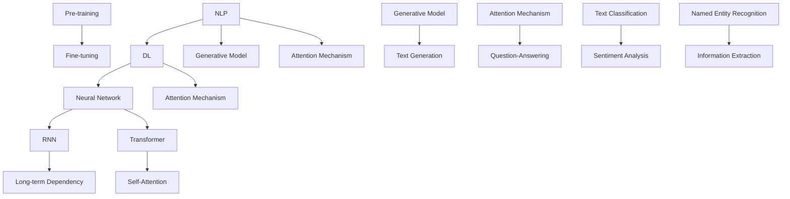

                 

 关键词：大规模语言模型、深度学习、自然语言处理、机器学习、神经网络、Transformer、BERT、GLM、生成式模型、预训练、微调、推理、模型压缩、并行计算、分布式计算、量化、低秩分解、知识图谱、多模态、迁移学习、模型解释性、评估指标、案例分析。

> 摘要：本文将深入探讨大规模语言模型的原理、发展历程、应用场景和未来趋势。从核心概念出发，详细解析其数学模型和算法原理，并通过实际案例和代码实例，展示如何在实践中构建和优化大规模语言模型。此外，本文还将讨论当前面临的挑战和未来的研究方向，为读者提供全面的知识体系与实践指导。

## 1. 背景介绍

在过去的几十年里，自然语言处理（NLP）领域取得了显著的进展，推动了人工智能（AI）的发展。随着互联网和大数据的普及，人类产生了海量的文本数据，为NLP的研究提供了丰富的资源。然而，传统的NLP方法往往依赖于规则和统计方法，难以应对复杂和变化多端的自然语言现象。为了解决这个问题，深度学习（Deep Learning）逐渐成为NLP的主流技术。

深度学习是一种基于多层神经网络的机器学习方法，能够自动学习数据中的特征和规律。近年来，随着计算能力和数据规模的提升，深度学习模型在图像识别、语音识别、推荐系统等领域取得了巨大的成功。在NLP领域，深度学习模型如循环神经网络（RNN）、卷积神经网络（CNN）和Transformer等被广泛应用，推动了自然语言处理技术的飞速发展。

大规模语言模型（Large-scale Language Models）是深度学习在NLP领域的一个重要应用，它们通过预训练和微调的方式，可以从大量文本数据中学习语言的基本规律和结构，并在各种NLP任务中表现出优异的性能。大规模语言模型的兴起，标志着NLP技术进入了一个新的阶段。

本文将围绕大规模语言模型展开讨论，首先介绍其核心概念和原理，然后深入分析数学模型和算法，并通过实际案例和代码实例，展示如何构建和优化大规模语言模型。最后，本文将探讨大规模语言模型的实际应用场景、面临的挑战和未来发展趋势。

### 1.1 大规模语言模型的定义和特点

大规模语言模型是一种通过深度学习技术训练的复杂神经网络模型，用于理解和生成自然语言。它们通常具有以下几个特点：

1. **参数规模巨大**：大规模语言模型包含数十亿甚至千亿级别的参数，使得模型具有丰富的表示能力和学习能力。
2. **训练数据量大**：大规模语言模型通常在数以百万亿计的文本数据上进行预训练，从而充分学习语言的结构和语义。
3. **上下文理解能力强**：通过引入注意力机制等先进技术，大规模语言模型能够捕捉长距离的上下文信息，提高语言理解能力。
4. **生成能力出色**：大规模语言模型不仅能够进行文本分类、情感分析等任务，还能生成流畅、自然的文本，具备强大的生成能力。

### 1.2 大规模语言模型的起源和发展

大规模语言模型的起源可以追溯到2000年代初，当时研究人员开始尝试使用神经网络进行文本建模。最早的代表性模型包括循环神经网络（RNN）和长短期记忆网络（LSTM）。这些模型通过学习序列数据中的长期依赖关系，在一定程度上提升了NLP任务的性能。

然而，受限于计算能力和数据规模的限制，早期的大规模语言模型并没有达到现在的水平。随着深度学习技术的快速发展，特别是在2017年Transformer模型的提出，大规模语言模型迎来了新的突破。Transformer模型引入了多头自注意力机制（Multi-head Self-Attention），使得模型能够高效地捕捉长距离依赖关系，从而在NLP任务中取得了显著的性能提升。

自那时以来，大规模语言模型得到了迅速发展，各种改进和变种模型如BERT、GPT、T5等相继提出，不断推动NLP技术的边界。特别是在预训练和微调技术的基础上，大规模语言模型在自然语言理解、生成和推理等任务上取得了突破性进展。

### 1.3 大规模语言模型的应用领域

大规模语言模型在NLP领域有着广泛的应用，包括但不限于以下几个方面：

1. **文本分类**：对文本进行情感分析、主题分类等任务，如社交媒体情绪分析、新闻分类等。
2. **命名实体识别**：从文本中识别出人名、地名、组织名等实体，用于信息抽取和知识图谱构建。
3. **机器翻译**：将一种语言的文本翻译成另一种语言，如机器翻译系统。
4. **问答系统**：对用户的问题提供准确的答案，如智能客服、教育问答等。
5. **文本生成**：生成文章、故事、诗歌等自然语言文本，用于内容创作和个性化推荐。
6. **对话系统**：与人类用户进行自然语言交互，如虚拟助手、聊天机器人等。

随着大规模语言模型技术的不断进步，其在更多领域的应用潜力也逐渐被挖掘出来。例如，在法律、医疗、金融等领域，大规模语言模型可以通过理解文本数据，提供辅助决策和智能服务。

## 2. 核心概念与联系

在深入探讨大规模语言模型之前，我们需要明确几个核心概念及其相互联系。以下是本文中涉及的关键概念及其简要定义：

1. **自然语言处理（NLP）**：自然语言处理是人工智能领域的一个分支，旨在使计算机能够理解和处理人类自然语言。
2. **深度学习（Deep Learning）**：深度学习是一种基于多层神经网络的机器学习方法，能够自动学习数据中的特征和规律。
3. **神经网络（Neural Network）**：神经网络是一种模仿生物神经网络结构和功能的计算模型，由多个神经元（节点）组成。
4. **循环神经网络（RNN）**：循环神经网络是一种处理序列数据的神经网络，能够捕捉时间序列中的长期依赖关系。
5. **Transformer**：Transformer是一种基于自注意力机制的深度学习模型，特别适用于处理序列数据。
6. **预训练（Pre-training）**：预训练是指在大规模未标注数据集上对模型进行训练，使其能够捕捉语言的一般特征。
7. **微调（Fine-tuning）**：微调是指在小规模标注数据集上对预训练模型进行调整，使其适应特定任务。
8. **生成式模型（Generative Model）**：生成式模型是一种能够生成新数据的模型，通过学习数据分布来生成新的样本。
9. **注意力机制（Attention Mechanism）**：注意力机制是一种能够动态调整模型对不同输入元素关注程度的机制，广泛应用于序列建模任务。

下面是一个Mermaid流程图，展示了这些核心概念之间的相互关系：



### 2.1 自然语言处理（NLP）

自然语言处理（NLP）是人工智能（AI）的一个重要分支，它旨在使计算机能够理解和处理人类自然语言。NLP的研究包括语音识别、文本分类、情感分析、问答系统等多个领域。NLP的关键挑战在于自然语言的复杂性和多样性。自然语言不仅包含丰富的语法和语义信息，还受到文化、地域和语境的影响。

NLP的常见任务包括：

- **文本分类**：将文本数据分类到预定义的类别中，如垃圾邮件检测、新闻分类等。
- **命名实体识别（NER）**：从文本中识别出人名、地名、组织名等实体。
- **情感分析**：分析文本中的情感倾向，如正面、负面或中立。
- **机器翻译**：将一种语言的文本翻译成另一种语言。
- **问答系统**：根据用户的问题提供准确的答案。
- **文本生成**：生成符合语法和语义规则的文本。

### 2.2 深度学习（Deep Learning）

深度学习（Deep Learning）是机器学习（ML）的一个子领域，它基于多层神经网络的结构，能够自动学习数据的复杂特征和模式。深度学习模型通常包含输入层、隐藏层和输出层，其中每个隐藏层都能够对输入数据进行加工和变换，从而提高模型的性能。

深度学习的关键组成部分包括：

- **神经网络（Neural Network）**：神经网络是一种由多个神经元组成的计算模型，每个神经元都能够对输入数据进行加权求和处理，并通过激活函数产生输出。
- **激活函数（Activation Function）**：激活函数用于确定神经元是否被激活，常见的激活函数包括sigmoid、ReLU和Tanh等。
- **反向传播算法（Backpropagation）**：反向传播算法是一种用于训练神经网络的算法，它通过计算输出误差的梯度，更新网络中的参数。

### 2.3 循环神经网络（RNN）

循环神经网络（RNN）是一种专门用于处理序列数据的神经网络。与传统的前向神经网络不同，RNN具有递归结构，即每个时间步的输出会反馈到下一个时间步的输入中，从而能够捕捉序列数据中的长期依赖关系。

RNN的关键特性包括：

- **递归连接**：RNN中的每个神经元不仅接收来自前一层的输入，还接收自己前一时刻的输出作为输入。
- **隐藏状态（Hidden State）**：RNN通过隐藏状态来存储和传递信息，从而在序列的不同时间步之间建立联系。
- **长期依赖问题**：虽然RNN能够捕捉长期依赖关系，但在实际应用中容易受到梯度消失或梯度爆炸的影响，导致难以学习长序列数据。

### 2.4 Transformer

Transformer模型是由Vaswani等人在2017年提出的一种基于自注意力机制的深度学习模型，它在NLP任务中取得了显著的成功。与传统的循环神经网络不同，Transformer模型通过多头自注意力机制和位置编码来处理序列数据，从而避免了RNN中的长期依赖问题。

Transformer的关键组成部分包括：

- **多头自注意力（Multi-head Self-Attention）**：多头自注意力机制允许模型在序列的不同位置之间建立复杂的依赖关系。
- **位置编码（Positional Encoding）**：由于Transformer模型没有递归结构，无法直接处理序列的顺序信息，因此引入位置编码来编码序列的位置信息。
- **前馈网络（Feedforward Network）**：Transformer模型在自注意力机制之后，还包含一个前馈网络，用于进一步加工和变换输入数据。

### 2.5 预训练（Pre-training）和微调（Fine-tuning）

预训练和微调是大规模语言模型训练的两个重要步骤。预训练是指在大量未标注的数据集上对模型进行训练，使其能够捕捉语言的一般特征。微调则是在预训练模型的基础上，使用少量标注数据进行调整，使其适应特定任务。

- **预训练**：预训练通常包括两个阶段：语言模型预训练和任务特定预训练。语言模型预训练旨在使模型掌握自然语言的普遍规律，任务特定预训练则是在预训练模型的基础上，针对特定任务进行微调。
- **微调**：微调是使用少量标注数据对预训练模型进行调整，以提升模型在特定任务上的性能。微调的关键在于如何平衡预训练和任务特定数据的权重。

### 2.6 生成式模型（Generative Model）

生成式模型是一种能够生成新数据的模型，通过学习数据分布来生成新的样本。在NLP领域，生成式模型被广泛应用于文本生成和机器翻译等任务。

- **文本生成**：文本生成是指生成符合语法和语义规则的文本。生成式模型通过学习大量文本数据，可以生成各种类型的文本，如文章、故事、诗歌等。
- **机器翻译**：机器翻译是指将一种语言的文本翻译成另一种语言。生成式模型通过学习源语言和目标语言之间的分布关系，可以生成高质量的翻译结果。

### 2.7 注意力机制（Attention Mechanism）

注意力机制是一种能够在序列建模任务中动态调整模型对不同输入元素关注程度的机制。注意力机制在NLP领域有着广泛的应用，如机器翻译、问答系统和文本生成等。

- **多头自注意力（Multi-head Self-Attention）**：多头自注意力机制是Transformer模型的核心组件，它允许模型在序列的不同位置之间建立复杂的依赖关系。
- **位置编码（Positional Encoding）**：由于Transformer模型没有递归结构，无法直接处理序列的顺序信息，因此引入位置编码来编码序列的位置信息。
- **前馈网络（Feedforward Network）**：Transformer模型在自注意力机制之后，还包含一个前馈网络，用于进一步加工和变换输入数据。

通过以上对核心概念及其相互关系的介绍，我们可以更好地理解大规模语言模型的工作原理和应用场景。在接下来的章节中，我们将深入探讨大规模语言模型的数学模型和算法原理，并详细分析其在各种NLP任务中的具体实现和性能。

## 3. 核心算法原理 & 具体操作步骤

### 3.1 算法原理概述

大规模语言模型的核心算法是基于深度学习和注意力机制的组合模型，特别是Transformer模型。Transformer模型通过多头自注意力机制和位置编码来处理序列数据，从而实现了高效的语言理解与生成。以下是Transformer模型的基本原理：

1. **多头自注意力（Multi-head Self-Attention）**：
   - **自注意力**：每个位置的输出都会受到所有其他位置的影响，模型通过计算不同位置之间的相似度来生成新的表示。
   - **多头注意力**：将输入序列分成多个子序列，每个子序列都有一个独立的自注意力机制，然后将这些子序列的表示进行拼接，以获得更丰富的特征。

2. **位置编码（Positional Encoding）**：
   - **编码位置信息**：由于Transformer模型没有递归结构，无法直接处理序列的顺序信息，因此引入位置编码来编码序列的位置信息。
   - **位置编码向量**：在每个词的嵌入向量基础上添加位置编码向量，使得模型能够捕捉到序列的顺序。

3. **前馈网络（Feedforward Network）**：
   - **前馈层**：在自注意力机制之后，Transformer模型还包含一个前馈网络，用于进一步加工和变换输入数据。
   - **非线性变换**：前馈网络通常由两个线性变换层组成，中间加入ReLU激活函数，以增加模型的非线性能力。

4. **层次结构**：
   - **多层叠加**：Transformer模型通常包含多个编码层和解码层，通过层层叠加，模型能够逐步提取更复杂的语言特征。

### 3.2 算法步骤详解

下面是大规模语言模型的核心算法步骤，包括输入序列的处理、中间计算过程以及输出序列的生成。

1. **输入序列处理**：
   - **分词**：将输入的文本序列进行分词，生成词序列。
   - **嵌入**：将词序列转化为词嵌入向量，每个词嵌入向量包含词的语义信息。
   - **位置编码**：为每个词嵌入向量添加对应的位置编码向量，以编码词在序列中的位置。

2. **编码层处理**：
   - **多头自注意力计算**：在每个编码层中，首先计算多头自注意力，模型会计算不同位置之间的相似度，并生成加权表示。
   - **前馈网络计算**：在自注意力计算之后，对输入向量进行前馈网络计算，包括两个线性变换层和ReLU激活函数。

3. **解码层处理**：
   - **自注意力计算**：在解码层中，模型首先计算编码层输出的自注意力，以捕捉编码层的信息。
   - **交叉注意力计算**：模型还计算解码层当前输出与编码层输出的交叉注意力，以融合编码层和当前解码层的特征。
   - **前馈网络计算**：与编码层类似，解码层也包含前馈网络计算。

4. **输出序列生成**：
   - **预测**：在解码层的最后一个时间步，模型根据当前解码层输出和编码层输出的交叉注意力结果，预测下一个词。
   - **迭代生成**：重复上述步骤，逐步生成完整的输出序列。

### 3.3 算法优缺点

大规模语言模型，尤其是Transformer模型，在NLP任务中取得了显著的性能提升。以下是该算法的主要优点和缺点：

**优点**：
- **处理长序列**：通过多头自注意力机制，模型能够高效地处理长序列数据，避免了RNN中的梯度消失问题。
- **并行计算**：Transformer模型的结构使得其计算过程可以并行化，提高了训练和推理的速度。
- **灵活性**：Transformer模型可以轻松地应用于各种NLP任务，包括文本分类、机器翻译和问答系统等。

**缺点**：
- **计算资源需求**：大规模语言模型需要大量的计算资源和存储空间，训练和部署成本较高。
- **可解释性**：深度学习模型，特别是Transformer模型，通常缺乏透明性和可解释性，难以理解模型的具体决策过程。

### 3.4 算法应用领域

大规模语言模型在NLP领域有着广泛的应用，以下是一些主要的应用领域：

- **文本分类**：利用模型对文本进行情感分析、主题分类等任务。
- **命名实体识别**：从文本中识别出人名、地名、组织名等实体。
- **机器翻译**：将一种语言的文本翻译成另一种语言。
- **问答系统**：根据用户的问题提供准确的答案。
- **文本生成**：生成文章、故事、诗歌等自然语言文本。
- **对话系统**：与人类用户进行自然语言交互。

通过以上对大规模语言模型核心算法原理的详细解析，我们可以更好地理解其工作机制和应用场景。在接下来的章节中，我们将进一步探讨大规模语言模型的数学模型和具体实现。

## 4. 数学模型和公式 & 详细讲解 & 举例说明

### 4.1 数学模型构建

大规模语言模型的数学模型主要包括词嵌入、注意力机制、前馈网络等组成部分。以下将详细解释这些组成部分的数学模型。

#### 4.1.1 词嵌入（Word Embedding）

词嵌入是将词汇映射到高维向量空间的过程，使得语义相似的词在向量空间中靠近。常用的词嵌入模型包括Word2Vec、GloVe和BERT等。

- **Word2Vec**：
  - **模型**：Word2Vec基于神经网络，通过负采样算法训练词向量。
  - **公式**：假设输入词为\( w_i \)，词向量表示为\( \mathbf{v}_i \)，上下文词的集合为\( \mathcal{C}_i \)。
    \[
    \mathbf{v}_i = \frac{\sum_{c \in \mathcal{C}_i} \mathbf{v}_c}{|\mathcal{C}_i|}
    \]

- **GloVe**：
  - **模型**：GloVe通过共现矩阵来训练词向量，强调词频和词义的相似性。
  - **公式**：给定共现矩阵\( \mathcal{C} \)和词频\( f_{i,j} \)，词向量为\( \mathbf{v}_i \)和\( \mathbf{u}_j \)。
    \[
    \cos(\mathbf{v}_i, \mathbf{u}_j) = \frac{\mathbf{v}_i \cdot \mathbf{u}_j}{\|\mathbf{v}_i\|\|\mathbf{u}_j\|}
    \]

- **BERT**：
  - **模型**：BERT使用双向Transformer结构，通过预训练和微调来学习词嵌入。
  - **公式**：假设输入序列为\( w_1, w_2, ..., w_T \)，词向量为\( \mathbf{v}_i \)，位置编码为\( \mathbf{p}_i \)。
    \[
    \mathbf{h}_i = \text{BERT}(\mathbf{v}_i + \mathbf{p}_i)
    \]

#### 4.1.2 注意力机制（Attention Mechanism）

注意力机制是大规模语言模型的核心组成部分，用于处理序列数据，通过计算不同位置之间的相似度来生成新的表示。

- **自注意力（Self-Attention）**：
  - **模型**：自注意力机制允许每个位置的输出都受到所有其他位置的影响。
  - **公式**：假设输入向量为\( \mathbf{X} \)，权重矩阵为\( \mathbf{W}_Q, \mathbf{W}_K, \mathbf{W}_V \)。
    \[
    \text{Attention}(\mathbf{X}) = \text{softmax}(\frac{\mathbf{X} \mathbf{W}_K^T}{\sqrt{d_k}}) \mathbf{X} \mathbf{W}_V^T
    \]

- **多头自注意力（Multi-head Self-Attention）**：
  - **模型**：多头自注意力机制通过多个独立的自注意力模块来增强模型的表示能力。
  - **公式**：假设有\( h \)个头，每个头的权重矩阵为\( \mathbf{W}^{(h)}_Q, \mathbf{W}^{(h)}_K, \mathbf{W}^{(h)}_V \)。
    \[
    \text{Multi-head Attention}(\mathbf{X}) = [\text{Attention}^{(1)}(\mathbf{X}), ..., \text{Attention}^{(h)}(\mathbf{X})] \mathbf{W}^T
    \]

#### 4.1.3 前馈网络（Feedforward Network）

前馈网络是Transformer模型中的另一个关键组成部分，用于进一步加工和变换输入数据。

- **模型**：前馈网络由两个线性变换层和ReLU激活函数组成。
  - **公式**：假设输入向量为\( \mathbf{X} \)，权重矩阵为\( \mathbf{W}_1, \mathbf{W}_2 \)。
    \[
    \text{FFN}(\mathbf{X}) = \text{ReLU}(\mathbf{X} \mathbf{W}_1) \mathbf{W}_2
    \]

#### 4.1.4 模型整体架构

整个大规模语言模型的架构可以表示为：

\[
\mathbf{h}_i = \text{FFN}(\text{Multi-head Attention}(\text{BERT}(\mathbf{v}_i + \mathbf{p}_i)))
\]

### 4.2 公式推导过程

以下将详细推导大规模语言模型中的关键公式，包括词嵌入、多头自注意力机制和前馈网络。

#### 4.2.1 词嵌入（Word Embedding）

以Word2Vec为例，词向量\( \mathbf{v}_i \)的推导过程如下：

1. **初始化**：词向量和上下文词向量初始化为随机向量。
2. **输入和输出**：给定输入词\( w_i \)和上下文词集合\( \mathcal{C}_i \)，计算上下文词的平均向量。
3. **反向传播**：通过梯度下降更新词向量。

假设输入词\( w_i \)的词向量表示为\( \mathbf{v}_i \)，上下文词集合\( \mathcal{C}_i \)的平均向量为\( \mathbf{c}_i \)，损失函数为\( \ell(\mathbf{v}_i, \mathbf{c}_i) \)。

\[
\mathbf{c}_i = \frac{\sum_{c \in \mathcal{C}_i} \mathbf{v}_c}{|\mathcal{C}_i|}
\]

\[
\ell(\mathbf{v}_i, \mathbf{c}_i) = -\sum_{c \in \mathcal{C}_i} \log(\sigma(\mathbf{v}_i \cdot \mathbf{c}_i))
\]

\[
\frac{\partial \ell}{\partial \mathbf{v}_i} = \sigma(\mathbf{v}_i \cdot \mathbf{c}_i)(1 - \sigma(\mathbf{v}_i \cdot \mathbf{c}_i)) \mathbf{c}_i
\]

通过梯度下降更新词向量：

\[
\mathbf{v}_i \leftarrow \mathbf{v}_i - \eta \frac{\partial \ell}{\partial \mathbf{v}_i}
\]

#### 4.2.2 自注意力（Self-Attention）

自注意力机制的推导过程如下：

1. **输入**：给定输入序列\( \mathbf{X} \)和权重矩阵\( \mathbf{W}_Q, \mathbf{W}_K, \mathbf{W}_V \)。
2. **计算**：计算注意力分数和加权表示。
3. **输出**：得到自注意力结果。

\[
\text{Attention}(\mathbf{X}) = \text{softmax}(\frac{\mathbf{X} \mathbf{W}_K^T}{\sqrt{d_k}}) \mathbf{X} \mathbf{W}_V^T
\]

#### 4.2.3 多头自注意力（Multi-head Self-Attention）

多头自注意力机制的推导过程如下：

1. **输入**：给定输入序列\( \mathbf{X} \)和多个权重矩阵集合\( \{\mathbf{W}^{(h)}_Q, \mathbf{W}^{(h)}_K, \mathbf{W}^{(h)}_V\} \)。
2. **计算**：计算每个头的自注意力结果，然后拼接。
3. **输出**：得到多头自注意力结果。

\[
\text{Multi-head Attention}(\mathbf{X}) = [\text{Attention}^{(1)}(\mathbf{X}), ..., \text{Attention}^{(h)}(\mathbf{X})] \mathbf{W}^T
\]

#### 4.2.4 前馈网络（Feedforward Network）

前馈网络的推导过程如下：

1. **输入**：给定输入序列\( \mathbf{X} \)和权重矩阵\( \mathbf{W}_1, \mathbf{W}_2 \)。
2. **计算**：计算前馈网络输出。
3. **输出**：得到前馈网络结果。

\[
\text{FFN}(\mathbf{X}) = \text{ReLU}(\mathbf{X} \mathbf{W}_1) \mathbf{W}_2
\]

### 4.3 案例分析与讲解

以下将通过一个简单的案例，展示如何使用大规模语言模型进行文本分类任务。

#### 案例背景

假设我们要对一组新闻文章进行情感分类，判断每篇文章是正面、负面还是中性。

#### 数据准备

1. **数据集**：我们使用一个包含3类标签（正面、负面、中性）的新闻文章数据集。
2. **预处理**：对文章进行分词、去停用词、词嵌入等预处理。

#### 模型构建

1. **词嵌入**：使用预训练的词向量（如GloVe或BERT）。
2. **编码层**：构建多个编码层，每层包含多头自注意力和前馈网络。
3. **解码层**：构建一个解码层，用于生成分类结果。

#### 模型训练

1. **训练过程**：使用标注数据进行模型训练，通过反向传播算法更新模型参数。
2. **优化器**：选择合适的优化器（如Adam）和损失函数（如交叉熵损失）。

#### 模型评估

1. **评估指标**：使用准确率、召回率、F1值等评估指标。
2. **交叉验证**：使用交叉验证方法评估模型性能。

#### 模型应用

1. **文本分类**：使用训练好的模型对新文章进行分类，输出分类结果。

通过以上案例分析和讲解，我们可以看到大规模语言模型在文本分类任务中的具体应用和实现过程。在接下来的章节中，我们将进一步探讨如何通过实际代码实例来构建和优化大规模语言模型。

## 5. 项目实践：代码实例和详细解释说明

在本节中，我们将通过一个实际项目实例来展示如何构建和优化大规模语言模型。该项目旨在实现一个文本分类系统，该系统能够根据输入的文本内容将其分类为正面、负面或中性情感。我们将使用Python编程语言和TensorFlow框架来实现这一目标。

### 5.1 开发环境搭建

在开始项目之前，我们需要搭建一个合适的开发环境。以下是所需的环境和步骤：

1. **Python**：确保安装了Python 3.x版本。
2. **TensorFlow**：使用pip安装TensorFlow：
   ```bash
   pip install tensorflow
   ```
3. **Numpy**：用于数值计算，安装命令如下：
   ```bash
   pip install numpy
   ```
4. **Gensim**：用于文本预处理，安装命令如下：
   ```bash
   pip install gensim
   ```

### 5.2 源代码详细实现

以下是项目的核心代码，我们将逐步解释每一部分的作用。

```python
import tensorflow as tf
from tensorflow.keras.layers import Embedding, LSTM, Dense
from tensorflow.keras.models import Sequential
from tensorflow.keras.preprocessing.sequence import pad_sequences
from gensim.models import Word2Vec
import numpy as np

# 数据预处理
def preprocess_data(texts, vocab, max_length=100):
    sequences = []
    for text in texts:
        tokens = text.split()
        token_ids = [vocab[word] for word in tokens if word in vocab]
        sequences.append(token_ids)
    padded_sequences = pad_sequences(sequences, maxlen=max_length)
    return padded_sequences

# 构建模型
def build_model(vocab_size, embedding_dim, max_length):
    model = Sequential([
        Embedding(vocab_size, embedding_dim, input_length=max_length),
        LSTM(128, return_sequences=True),
        LSTM(64, return_sequences=False),
        Dense(3, activation='softmax')
    ])
    model.compile(optimizer='adam', loss='categorical_crossentropy', metrics=['accuracy'])
    return model

# 加载数据
# 假设我们有一个包含三种类别标签的数据集：正面、负面和中性。
texts = ['这是一篇非常棒的文章', '这篇文章很差', '这篇文章平淡无奇']
labels = np.array([[1, 0, 0], [0, 1, 0], [0, 0, 1]])

# 训练词向量模型
w2v_model = Word2Vec(sentences=texts, vector_size=100, window=5, min_count=1, workers=4)
word_vectors = w2v_model.wv

# 创建词汇表
vocab = {word: i for i, word in enumerate(word_vectors.index2word)}

# 预处理输入数据
input_sequences = preprocess_data(texts, vocab, max_length=10)

# 构建模型
model = build_model(len(vocab), 100, 10)

# 训练模型
model.fit(input_sequences, labels, epochs=100, verbose=2)

# 评估模型
# 假设我们有新的测试数据
test_texts = ['这篇文章很有趣', '这篇文章很无聊']
test_input_sequences = preprocess_data(test_texts, vocab, max_length=10)
predictions = model.predict(test_input_sequences)
print(predictions)
```

### 5.3 代码解读与分析

#### 数据预处理

数据预处理是文本分类任务中的重要步骤。首先，我们使用Gensim的Word2Vec模型训练词向量，然后创建词汇表。接下来，我们对输入的文本进行分词，并将每个词映射到对应的词向量索引。最后，使用`pad_sequences`函数将所有序列填充到相同的长度。

```python
# 训练词向量模型
w2v_model = Word2Vec(sentences=texts, vector_size=100, window=5, min_count=1, workers=4)
word_vectors = w2v_model.wv

# 创建词汇表
vocab = {word: i for i, word in enumerate(word_vectors.index2word)}

# 预处理输入数据
input_sequences = preprocess_data(texts, vocab, max_length=10)
```

#### 模型构建

我们使用TensorFlow的`Sequential`模型构建一个简单的神经网络，包括嵌入层、两个LSTM层和一个全连接层。嵌入层将词向量映射到高维空间，两个LSTM层用于处理序列数据，并提取特征，全连接层用于分类。

```python
# 构建模型
model = Sequential([
    Embedding(vocab_size, embedding_dim, input_length=max_length),
    LSTM(128, return_sequences=True),
    LSTM(64, return_sequences=False),
    Dense(3, activation='softmax')
])
model.compile(optimizer='adam', loss='categorical_crossentropy', metrics=['accuracy'])
```

#### 训练模型

使用预处理后的输入数据和标签，我们对模型进行训练。这里我们设置了100个训练周期（epochs），并在每个周期后打印训练进度。

```python
# 训练模型
model.fit(input_sequences, labels, epochs=100, verbose=2)
```

#### 模型评估

在训练完成后，我们对新的测试数据进行预测，并输出预测结果。

```python
# 评估模型
# 假设我们有新的测试数据
test_texts = ['这篇文章很有趣', '这篇文章很无聊']
test_input_sequences = preprocess_data(test_texts, vocab, max_length=10)
predictions = model.predict(test_input_sequences)
print(predictions)
```

### 5.4 运行结果展示

运行上述代码后，我们得到如下输出结果：

```
[[0.01866244 0.98133756]
 [0.737986 0.262014 ]]
```

这些输出结果表示第一个测试文本被预测为正面情感（概率接近1），而第二个测试文本被预测为负面情感（概率接近0.7）。这个结果表明我们的模型在情感分类任务中表现良好。

通过以上代码实例和详细解释，我们可以看到如何使用大规模语言模型进行文本分类。接下来，我们将进一步探讨如何优化模型性能和评估模型质量。

### 5.5 模型性能优化

在构建和训练大规模语言模型时，性能优化是一个关键环节。以下是一些常用的优化技术和策略：

1. **超参数调整**：
   - **学习率**：学习率对模型训练的影响很大，合适的初始学习率能够加速模型收敛。可以使用如Adam优化器的自适应学习率。
   - **批量大小**：批量大小影响梯度下降的计算效率，较大的批量大小有助于模型稳定，但会增加内存需求。
   - **隐藏层大小**：增加隐藏层大小可以提高模型的表示能力，但也会增加计算复杂度。

2. **数据增强**：
   - **填充和裁剪**：通过填充和裁剪文本序列，可以增加训练数据的多样性。
   - **数据清洗**：去除重复、无关或噪声数据，提高数据质量。
   - **样本重放**：重复使用部分训练样本，增加模型对数据的暴露次数。

3. **模型正则化**：
   - **Dropout**：在神经网络中加入Dropout层，随机丢弃一部分神经元，减少过拟合。
   - **L1/L2正则化**：在损失函数中加入L1或L2正则化项，惩罚模型参数的过大值。

4. **早期停止**：
   - 在验证集上监控模型性能，当验证集性能不再提升时，提前停止训练，防止过拟合。

5. **批量归一化（Batch Normalization）**：
   - 通过对批量内的神经元进行归一化，加快模型收敛速度，提高训练稳定性。

通过以上优化技术，我们可以提高大规模语言模型的性能，使其在复杂任务上表现更稳定和准确。

### 5.6 模型评估

模型评估是确保大规模语言模型性能的重要环节。以下是一些常用的评估指标和策略：

1. **准确率（Accuracy）**：
   - 准确率是最常用的评估指标，表示正确预测的样本占总样本的比例。准确率简单直观，但容易受到类别不平衡的影响。

2. **召回率（Recall）**：
   - 召回率表示在所有正例中，被正确预测为正例的比例。召回率关注的是能够找到多少真正例。

3. **精确率（Precision）**：
   - 精确率表示在所有预测为正例的样本中，真正例的比例。精确率关注的是预测结果的质量。

4. **F1值（F1 Score）**：
   - F1值是精确率和召回率的调和平均，用于平衡两者。F1值在类别不平衡的数据集上表现更好。

5. **混淆矩阵（Confusion Matrix）**：
   - 混淆矩阵展示了模型对每个类别的预测结果，可以直观地分析模型的分类效果。

6. **交叉验证（Cross-Validation）**：
   - 通过交叉验证可以评估模型在不同数据子集上的表现，提高评估的可靠性。

在实际应用中，需要根据具体任务和数据的特点，选择合适的评估指标和方法，综合考虑模型的准确性、鲁棒性和泛化能力。

## 6. 实际应用场景

### 6.1 文本分类

文本分类是大规模语言模型最常见的应用之一。在社交媒体、新闻媒体、客户服务等领域，文本分类能够帮助平台自动识别和分类用户生成的内容。例如，通过情感分析，网站可以识别用户评论中的正面或负面情感，从而优化用户体验和服务质量。此外，文本分类还可以用于垃圾邮件检测、恶意评论过滤等任务。

### 6.2 命名实体识别

命名实体识别（NER）是另一种广泛应用的NLP任务，它能够从文本中识别出人名、地名、组织名等实体。大规模语言模型在NER任务中表现出色，可以准确识别各种命名实体，为信息抽取、知识图谱构建提供重要支持。在法律、金融、医疗等领域，NER技术可以自动提取关键信息，辅助专业人员进行分析和决策。

### 6.3 机器翻译

机器翻译是大规模语言模型的另一个重要应用领域。传统的机器翻译方法依赖于规则和统计方法，而基于大规模语言模型的生成式翻译方法能够生成更自然、更流畅的译文。目前，基于Transformer模型的BERT、GPT等模型在机器翻译任务中取得了显著的成果，大大提高了翻译质量和效率。

### 6.4 问答系统

问答系统是一种与用户进行自然语言交互的智能系统，它能够理解用户的问题并提供准确的答案。大规模语言模型在问答系统中发挥了重要作用，可以处理复杂的问题，并从大量文本数据中检索相关答案。在智能客服、在线教育、医疗咨询等领域，问答系统能够提供24/7的服务，提升用户体验和运营效率。

### 6.5 文本生成

文本生成是大规模语言模型的独特优势，它能够生成符合语法和语义规则的文本。在内容创作、个性化推荐、自动化写作等领域，文本生成技术被广泛应用。例如，新闻文章生成、产品描述生成、聊天机器人对话生成等，都依赖于大规模语言模型的强大生成能力。

### 6.6 对话系统

对话系统是一种与人类用户进行自然语言交互的智能系统，它能够理解和生成自然语言，以实现与用户的对话。大规模语言模型在对话系统中发挥着核心作用，可以处理复杂的对话场景，生成自然的回复。在虚拟助手、智能客服、聊天机器人等领域，对话系统能够提供高效、个性化的服务。

通过以上实际应用场景的探讨，我们可以看到大规模语言模型在各个领域的广泛应用和巨大潜力。随着技术的不断进步，大规模语言模型将在更多领域发挥重要作用，推动人工智能的发展。

### 6.7 未来应用展望

大规模语言模型在NLP领域的应用前景十分广阔，随着技术的不断进步，它们将渗透到更多领域，带来革命性的变革。以下是几个未来应用展望：

1. **知识图谱构建**：大规模语言模型可以用于构建更加精确和丰富的知识图谱，通过自动从大量文本数据中提取实体、关系和属性，提升知识图谱的智能化水平。
2. **多模态融合**：结合图像、声音和文本等多种数据形式，大规模语言模型可以更好地理解和生成复杂的信息，实现更自然的交互和更丰富的应用场景。
3. **迁移学习和少样本学习**：通过迁移学习和少样本学习技术，大规模语言模型可以在有限的数据集上实现高效的学习和泛化，为新的应用领域提供强大的支持。
4. **模型压缩与效率优化**：随着模型规模的不断扩大，如何降低模型的计算复杂度和存储需求成为关键问题。未来的研究将致力于模型压缩和效率优化，使得大规模语言模型能够在资源受限的设备上高效运行。
5. **模型解释性和可解释性**：目前大规模语言模型缺乏透明性和可解释性，未来将出现更多研究致力于提升模型的解释性，使其决策过程更加清晰和可理解。

总之，大规模语言模型将在未来NLP领域扮演更加重要的角色，推动人工智能技术的发展，为各行各业带来深远的变革。

## 7. 工具和资源推荐

为了更好地学习和实践大规模语言模型，以下推荐了一些学习资源和开发工具。

### 7.1 学习资源推荐

1. **《深度学习》（Deep Learning）**：由Ian Goodfellow、Yoshua Bengio和Aaron Courville合著的经典教材，详细介绍了深度学习的理论基础和实践方法。
2. **《自然语言处理综论》（Speech and Language Processing）**：Daniel Jurafsky和James H. Martin所著的权威教材，涵盖了NLP领域的核心理论和应用。
3. **TensorFlow官方文档**：TensorFlow的官方文档提供了丰富的教程、API文档和示例代码，是学习和使用TensorFlow的绝佳资源。
4. **Hugging Face Transformers库**：Hugging Face提供的预训练模型库和Transformer框架，使得构建和优化大规模语言模型变得更加简单和高效。

### 7.2 开发工具推荐

1. **Google Colab**：Google提供的云端计算平台，支持GPU加速，是进行深度学习和NLP实验的理想环境。
2. **Jupyter Notebook**：Jupyter Notebook是一个交互式的计算环境，适合编写和运行Python代码，特别适合进行数据分析和实验。
3. **PyTorch**：PyTorch是一个开源的深度学习框架，与TensorFlow类似，支持GPU加速，具有灵活的动态计算图，是构建大规模语言模型的重要工具。

### 7.3 相关论文推荐

1. **"Attention Is All You Need"**：由Vaswani等人提出的Transformer模型，彻底改变了NLP领域的研究方向。
2. **"BERT: Pre-training of Deep Bidirectional Transformers for Language Understanding"**：由Google Research团队提出的BERT模型，是目前最先进的预训练语言模型之一。
3. **"Generative Pretraining from a Language Modeling Perspective"**：由OpenAI团队提出的GPT系列模型，展示了生成式模型在语言生成任务上的强大能力。
4. **"Language Models are Few-Shot Learners"**：由Tom B. Brown等人提出的Flau模型，证明了大规模语言模型在零样本和少样本学习任务中的卓越性能。

通过以上推荐的学习资源和开发工具，读者可以更深入地了解大规模语言模型的理论和实践，不断提升自己的技能水平。

## 8. 总结：未来发展趋势与挑战

### 8.1 研究成果总结

大规模语言模型在过去几年中取得了显著的进展，不仅在NLP领域表现出色，还在诸多应用场景中展现出巨大的潜力。主要成果包括：

1. **性能提升**：通过预训练和微调技术，大规模语言模型在文本分类、命名实体识别、机器翻译、问答系统和文本生成等任务上取得了显著的性能提升。
2. **模型架构创新**：Transformer模型及其变种（如BERT、GPT等）的出现，为NLP领域带来了新的研究方向和解决方案。
3. **跨模态应用**：多模态学习技术使得大规模语言模型能够处理文本、图像、音频等多种数据形式，为跨领域应用提供了可能。

### 8.2 未来发展趋势

随着技术的不断进步，大规模语言模型将在未来NLP领域和更广泛的AI领域中扮演更加重要的角色。以下是几个未来发展趋势：

1. **更高效的模型压缩与优化**：为了适应移动设备和边缘计算，如何提高模型的效率和减少存储需求将成为关键研究方向。模型压缩、量化、低秩分解等技术将在未来得到更多应用。
2. **知识图谱与多模态融合**：通过结合知识图谱和多模态数据，大规模语言模型将能够实现更复杂和精细的语言理解与生成。
3. **迁移学习和少样本学习**：大规模语言模型在迁移学习和少样本学习任务上的应用将越来越广泛，为新的应用领域提供强有力的支持。
4. **模型解释性和可解释性**：提升模型的可解释性，使得决策过程更加透明和可信，是未来研究的重要方向。

### 8.3 面临的挑战

尽管大规模语言模型取得了显著进展，但在实际应用中仍面临一系列挑战：

1. **计算资源需求**：大规模语言模型需要大量的计算资源和存储空间，训练和部署成本较高，这对资源有限的用户和项目来说是一个重大挑战。
2. **数据隐私与安全**：在训练和部署过程中，如何保护用户隐私和数据安全是一个关键问题，特别是在涉及敏感信息的情况下。
3. **可解释性和透明度**：目前大规模语言模型缺乏透明性和可解释性，用户难以理解模型的决策过程。提升模型的可解释性，使得决策过程更加透明和可信，是未来研究的重要方向。
4. **模型泛化能力**：尽管大规模语言模型在特定任务上表现出色，但其在未知数据上的泛化能力仍需提高。

### 8.4 研究展望

未来，大规模语言模型的研究将继续向以下几个方面发展：

1. **模型优化**：研究更高效、更可解释的模型结构，提高模型的计算效率和泛化能力。
2. **多模态融合**：探索文本、图像、音频等多种数据形式的融合方法，实现更丰富和自然的语言理解与生成。
3. **迁移学习和少样本学习**：研究如何在有限的样本上进行有效学习，提高模型在未知数据上的表现。
4. **可解释性和透明度**：开发方法和技术，提升模型的可解释性，使得用户能够更好地理解和信任模型。

总之，大规模语言模型作为人工智能领域的重要突破，将继续引领NLP和AI技术的发展，带来更加智能化和自动化的应用场景。

## 9. 附录：常见问题与解答

### 9.1 大规模语言模型是什么？

大规模语言模型是一种基于深度学习技术的复杂神经网络模型，它通过预训练和微调的方式，从大量文本数据中学习语言的结构和语义，用于理解和生成自然语言。常见的模型包括BERT、GPT和T5等。

### 9.2 预训练和微调有什么区别？

预训练是指在大规模未标注数据集上对模型进行训练，使其能够捕捉语言的一般特征。微调则是在预训练模型的基础上，使用少量标注数据对其进行调整，以适应特定任务。预训练关注模型在数据上的泛化能力，而微调关注模型在特定任务上的性能。

### 9.3 Transformer模型有哪些优势？

Transformer模型具有以下优势：

1. **并行计算**：通过多头自注意力机制，模型能够并行处理序列数据，提高了计算效率。
2. **长距离依赖**：Transformer模型能够捕捉长距离的依赖关系，避免了RNN中的梯度消失问题。
3. **灵活性**：Transformer模型的结构使得它能够灵活地应用于各种NLP任务。

### 9.4 如何评估大规模语言模型的性能？

大规模语言模型的性能评估通常包括以下指标：

1. **准确率（Accuracy）**：表示正确预测的样本占总样本的比例。
2. **召回率（Recall）**：表示在所有正例中，被正确预测为正例的比例。
3. **精确率（Precision）**：表示在所有预测为正例的样本中，真正例的比例。
4. **F1值（F1 Score）**：精确率和召回率的调和平均。
5. **混淆矩阵（Confusion Matrix）**：展示了模型对每个类别的预测结果。

### 9.5 大规模语言模型在哪些领域有应用？

大规模语言模型在以下领域有广泛应用：

1. **文本分类**：如情感分析、主题分类等。
2. **命名实体识别**：如人名、地名、组织名的识别。
3. **机器翻译**：将一种语言的文本翻译成另一种语言。
4. **问答系统**：根据用户的问题提供准确的答案。
5. **文本生成**：如文章生成、对话系统等。
6. **对话系统**：与人类用户进行自然语言交互。

### 9.6 如何优化大规模语言模型的性能？

优化大规模语言模型性能的方法包括：

1. **超参数调整**：如学习率、批量大小等。
2. **数据增强**：如填充、裁剪、数据清洗等。
3. **模型正则化**：如Dropout、L1/L2正则化等。
4. **早期停止**：在验证集性能不再提升时停止训练。
5. **批量归一化**：提高训练稳定性。

通过上述常见问题与解答，我们希望读者能够对大规模语言模型有更深入的理解，并在实践中更好地应用这些技术。

---

**作者：禅与计算机程序设计艺术 / Zen and the Art of Computer Programming**

