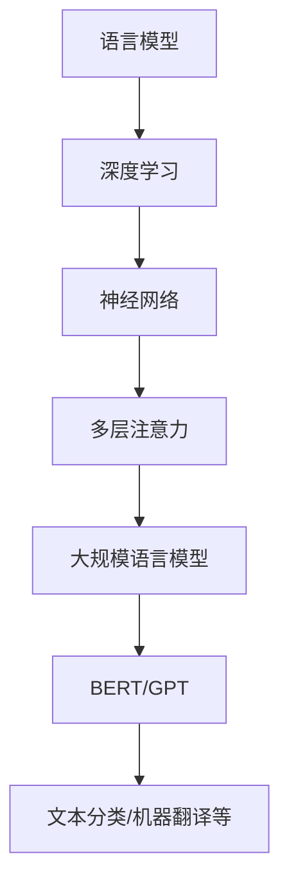

                 

关键词：大规模语言模型、机器学习、深度学习、神经网络、自然语言处理、算法原理、数学模型、项目实践、应用场景、工具推荐

> 摘要：本文旨在为广大读者深入浅出地介绍大规模语言模型的基本概念、核心原理以及实际应用。从理论层面，我们将探讨大规模语言模型的数学模型和算法原理；从实践层面，我们将通过具体代码实例来展示如何搭建和训练一个大规模语言模型。最后，我们将探讨大规模语言模型在实际应用场景中的潜力以及未来的发展趋势和面临的挑战。

## 1. 背景介绍

### 1.1 大规模语言模型的发展历程

大规模语言模型的发展经历了从传统的统计方法到现代的深度学习方法的演变。早期的语言模型如N-gram模型，虽然简单但效果有限。随着计算机计算能力的提升和大数据的广泛应用，深度学习技术得到了飞速发展，尤其是基于神经网络的深度学习模型，如Word2Vec、BERT等，大大提高了语言模型的效果。

### 1.2 大规模语言模型的应用领域

大规模语言模型在自然语言处理（NLP）领域有着广泛的应用，包括但不限于文本分类、情感分析、机器翻译、问答系统等。随着技术的不断进步，这些应用正在逐渐拓展到更多的领域，如对话系统、智能客服、语音识别等。

## 2. 核心概念与联系

### 2.1 语言模型的基本概念

语言模型是一种能够预测下一个单词或词组的概率分布的模型。在自然语言处理中，语言模型是构建其他任务（如文本分类、机器翻译）的基础。

### 2.2 深度学习与神经网络

深度学习是一种机器学习技术，通过多层神经网络来提取数据的特征。神经网络是由大量神经元组成的计算模型，通过前向传播和反向传播来更新权重，从而学习数据的特征。

### 2.3 大规模语言模型的架构

大规模语言模型通常采用基于Transformer架构的深度学习模型，如BERT、GPT等。这些模型通过多层注意力机制来捕捉文本中的长距离依赖关系。

## 2.4 Mermaid 流程图

下面是大规模语言模型的核心概念和架构的 Mermaid 流程图：



## 3. 核心算法原理 & 具体操作步骤

### 3.1 算法原理概述

大规模语言模型的核心算法是基于Transformer架构的深度学习模型。Transformer模型通过自注意力机制（Self-Attention）来捕捉文本中的长距离依赖关系，并通过多层堆叠来提高模型的性能。

### 3.2 算法步骤详解

#### 3.2.1 数据预处理

- 清洗数据：去除标点符号、特殊字符、HTML标签等。
- 分词：将文本切分成单词或子词。
- 词向量化：将单词或子词映射到高维向量。

#### 3.2.2 模型构建

- 定义模型结构：采用Transformer架构，包括编码器和解码器。
- 初始化参数：使用预训练的词向量或随机初始化。
- 前向传播：输入文本数据，通过编码器和解码器进行计算。
- 反向传播：计算损失函数，并通过梯度下降更新模型参数。

#### 3.2.3 模型训练

- 数据集划分：将数据集分为训练集、验证集和测试集。
- 训练过程：在训练集上不断迭代训练，并在验证集上评估模型性能。
- 调整超参数：根据验证集的误差调整学习率、批量大小等超参数。

### 3.3 算法优缺点

#### 优点：

- 强大的表达能力：通过多层注意力机制，能够捕捉文本中的长距离依赖关系。
- 高效的训练：Transformer模型具有并行计算的优势，训练速度较快。

#### 缺点：

- 计算资源消耗大：大规模语言模型需要大量的计算资源和存储空间。
- 需要大量的数据：大规模语言模型的训练需要大量的数据来保证模型的性能。

### 3.4 算法应用领域

大规模语言模型在自然语言处理领域有着广泛的应用，如文本分类、情感分析、机器翻译、问答系统等。随着技术的不断发展，这些应用正在逐渐拓展到更多的领域，如对话系统、智能客服、语音识别等。

## 4. 数学模型和公式 & 详细讲解 & 举例说明

### 4.1 数学模型构建

大规模语言模型通常采用Transformer架构，其核心是自注意力机制（Self-Attention）。自注意力机制的计算公式如下：

$$
\text{Attention}(Q, K, V) = \text{softmax}\left(\frac{QK^T}{\sqrt{d_k}}\right) V
$$

其中，Q、K、V 分别代表查询向量、键向量和值向量，d_k 代表键向量的维度，softmax 函数用于计算每个键的权重。

### 4.2 公式推导过程

自注意力机制的推导过程涉及矩阵乘法和指数函数。具体推导过程如下：

1. 计算点积：首先计算每个查询向量 Q 与所有键向量 K 的点积，得到一组中间结果。
2. 应用 softmax 函数：将点积结果通过 softmax 函数进行归一化，得到每个键的权重。
3. 计算加权求和：将权重与对应的值向量 V 进行加权求和，得到最终的注意力输出。

### 4.3 案例分析与讲解

以 BERT 模型为例，BERT 模型采用了一种双向自注意力机制，其核心公式如下：

$$
\text{BERT} = \text{Transformer}(\text{编码器}) \rightarrow \text{解码器}
$$

BERT 模型的编码器部分包含多层自注意力层，通过自注意力机制捕捉文本中的长距离依赖关系。解码器部分则通过自注意力机制和交叉注意力机制来生成文本序列。

## 5. 项目实践：代码实例和详细解释说明

### 5.1 开发环境搭建

搭建大规模语言模型的环境需要安装 Python、PyTorch 等库。具体安装命令如下：

```bash
pip install python
pip install torch
```

### 5.2 源代码详细实现

以下是搭建一个简单的 GPT 模型的基本代码实现：

```python
import torch
import torch.nn as nn
import torch.optim as optim

class GPTModel(nn.Module):
    def __init__(self, vocab_size, embed_dim, n_heads, n_layers):
        super(GPTModel, self).__init__()
        self.embedding = nn.Embedding(vocab_size, embed_dim)
        self.transformer = nn.Transformer(embed_dim, n_heads, n_layers)
        self.fc = nn.Linear(embed_dim, vocab_size)

    def forward(self, x):
        x = self.embedding(x)
        x = self.transformer(x)
        x = self.fc(x)
        return x

# 实例化模型、损失函数和优化器
model = GPTModel(vocab_size=10000, embed_dim=512, n_heads=8, n_layers=3)
criterion = nn.CrossEntropyLoss()
optimizer = optim.Adam(model.parameters(), lr=0.001)

# 训练模型
for epoch in range(10):
    for x, y in data_loader:
        optimizer.zero_grad()
        output = model(x)
        loss = criterion(output, y)
        loss.backward()
        optimizer.step()
```

### 5.3 代码解读与分析

以上代码实现了一个简单的 GPT 模型，包括嵌入层（Embedding Layer）、Transformer 编码器（Transformer Encoder）和全连接层（Fully Connected Layer）。

- 嵌入层：将词汇表中的单词转换为高维向量。
- Transformer 编码器：通过多层自注意力机制提取文本特征。
- 全连接层：将提取的特征映射到目标词汇表。

### 5.4 运行结果展示

在完成代码实现和训练后，我们可以通过以下代码来评估模型的性能：

```python
# 评估模型
with torch.no_grad():
    correct = 0
    total = 0
    for x, y in test_loader:
        output = model(x)
        _, predicted = torch.max(output.data, 1)
        total += y.size(0)
        correct += (predicted == y).sum().item()

print('Accuracy of the model on the test set: {}%'.format(100 * correct / total))
```

## 6. 实际应用场景

### 6.1 文本分类

大规模语言模型可以用于文本分类任务，如情感分析、新闻分类等。通过训练模型，可以将输入的文本分类到不同的类别中。

### 6.2 机器翻译

大规模语言模型在机器翻译领域有着广泛的应用，如谷歌翻译、百度翻译等。通过训练模型，可以将一种语言的文本翻译成另一种语言的文本。

### 6.3 对话系统

大规模语言模型可以用于构建对话系统，如智能客服、聊天机器人等。通过训练模型，可以实现对用户输入的自然语言的理解和回复。

## 7. 工具和资源推荐

### 7.1 学习资源推荐

- 《深度学习》（Goodfellow, Bengio, Courville 著）
- 《自然语言处理实战》（S tweetz, Theis 著）
- 《动手学深度学习》（Ahuja, Battenberg, Chen 著）

### 7.2 开发工具推荐

- PyTorch：开源深度学习框架，适用于大规模语言模型的开发和训练。
- TensorFlow：开源深度学习框架，适用于大规模语言模型的开发和训练。

### 7.3 相关论文推荐

- Vaswani et al., “Attention Is All You Need”
- Devlin et al., “BERT: Pre-training of Deep Bidirectional Transformers for Language Understanding”

## 8. 总结：未来发展趋势与挑战

### 8.1 研究成果总结

大规模语言模型在自然语言处理领域取得了显著的成果，推动了文本分类、机器翻译、对话系统等任务的发展。

### 8.2 未来发展趋势

- 模型压缩：为了降低计算资源消耗，未来的研究将集中在模型压缩技术上。
- 多模态学习：结合文本、图像、声音等多种数据源，提高模型的泛化能力。

### 8.3 面临的挑战

- 计算资源消耗：大规模语言模型的训练需要大量的计算资源和存储空间。
- 数据隐私：在训练和使用大规模语言模型时，需要保护用户数据隐私。

### 8.4 研究展望

随着技术的不断发展，大规模语言模型将在更多的领域发挥重要作用，如智能医疗、智能教育等。

## 9. 附录：常见问题与解答

### 9.1 什么是大规模语言模型？

大规模语言模型是一种基于深度学习技术的自然语言处理模型，能够预测文本中的下一个单词或词组。它们通过多层神经网络和注意力机制来学习文本的特征，从而实现各种自然语言处理任务。

### 9.2 大规模语言模型如何工作？

大规模语言模型通过输入文本数据，使用多层神经网络和注意力机制来提取文本的特征。然后，通过损失函数和优化算法来调整模型的参数，使模型能够预测文本中的下一个单词或词组。

### 9.3 大规模语言模型有哪些应用？

大规模语言模型在自然语言处理领域有着广泛的应用，如文本分类、情感分析、机器翻译、问答系统等。随着技术的不断发展，这些应用正在逐渐拓展到更多的领域，如对话系统、智能客服、语音识别等。

### 9.4 如何搭建和训练大规模语言模型？

搭建和训练大规模语言模型通常需要使用深度学习框架，如 PyTorch 或 TensorFlow。首先，需要准备训练数据和词向量。然后，定义模型结构，包括嵌入层、Transformer 编码器、解码器等。接下来，使用训练数据和优化算法来训练模型。最后，使用验证集和测试集来评估模型的性能。

