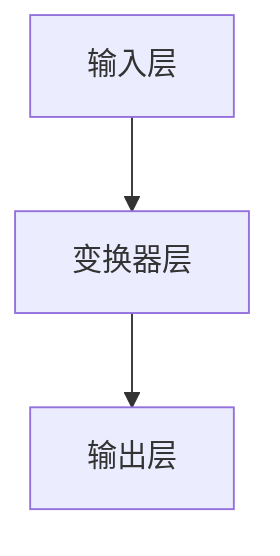

                 

关键词：大规模语言模型、神经网络、机器学习、自然语言处理、深度学习、语言生成、文本分析、应用领域

## 摘要

本文旨在介绍大规模语言模型（Large Language Models，LLM）的理论基础、发展历程以及在实际应用中的重要性。首先，我们将回顾大规模语言模型的历史背景，探讨其核心概念和架构。接着，我们将深入分析大规模语言模型的工作原理，详细讲解其核心算法原理与具体操作步骤。然后，我们将探讨大规模语言模型的数学模型和公式，通过举例说明对其进行详细讲解。接下来，我们将通过一个具体的代码实例，展示大规模语言模型在项目实践中的应用。最后，我们将讨论大规模语言模型在实际应用场景中的角色，以及未来的发展趋势和面临的挑战。

## 1. 背景介绍

### 1.1 大规模语言模型的发展历程

大规模语言模型的发展可以追溯到20世纪80年代，当时研究人员开始尝试使用统计模型来处理自然语言。这些早期的模型主要包括基于规则的方法和基于统计的方法。然而，这些方法在处理复杂语言任务时效果有限。

随着计算机硬件性能的提升和深度学习技术的突破，大规模语言模型开始崭露头角。2018年，OpenAI发布了GPT（Generative Pre-trained Transformer）系列模型，这一系列模型在自然语言处理任务上取得了显著突破。此后，GPT系列模型迅速成为自然语言处理领域的标杆。

### 1.2 大规模语言模型的重要性

大规模语言模型在自然语言处理领域的重要性不言而喻。首先，它们能够处理大量的文本数据，从中提取出有价值的信息。其次，大规模语言模型具有强大的语言生成能力，可以生成高质量的文本，应用于自动化写作、问答系统等。此外，大规模语言模型在情感分析、文本分类、机器翻译等任务中也展现出了出色的性能。

## 2. 核心概念与联系

### 2.1 大规模语言模型的核心概念

大规模语言模型主要依赖于深度学习技术，特别是基于变换器（Transformer）的模型。变换器是一种特殊的神经网络结构，能够有效地处理序列数据。

### 2.2 大规模语言模型的架构

大规模语言模型的架构通常包括以下几个部分：

1. **输入层**：接受文本序列作为输入。
2. **变换器层**：通过变换器模块处理输入序列，提取序列特征。
3. **输出层**：生成预测结果，如文本生成、分类标签等。

### 2.3 Mermaid 流程图



## 3. 核心算法原理 & 具体操作步骤

### 3.1 算法原理概述

大规模语言模型的核心算法是基于变换器（Transformer）的结构。变换器通过自注意力机制（Self-Attention）和多头注意力（Multi-Head Attention）处理输入序列，从而提取序列特征。

### 3.2 算法步骤详解

1. **输入处理**：将文本序列转化为数字序列。
2. **嵌入**：将数字序列转化为嵌入向量。
3. **变换器层**：
   - **自注意力机制**：计算嵌入向量之间的相似性，生成注意力权重。
   - **多头注意力**：将嵌入向量按照注意力权重进行加权求和。
   - **前馈网络**：对加权求和后的嵌入向量进行非线性变换。
4. **输出层**：根据变换器层的输出，生成预测结果。

### 3.3 算法优缺点

**优点**：
- **强大的文本生成能力**：能够生成高质量的文本。
- **处理长序列数据**：能够处理长文本序列，提取关键信息。
- **广泛的应用领域**：在文本分类、问答系统、机器翻译等领域有广泛的应用。

**缺点**：
- **计算资源消耗大**：训练和部署需要大量的计算资源。
- **数据需求高**：需要大量的高质量数据来训练模型。

### 3.4 算法应用领域

- **文本生成**：自动化写作、故事生成、诗歌创作等。
- **问答系统**：自动问答、智能客服等。
- **机器翻译**：跨语言文本翻译、多语言翻译等。
- **情感分析**：情感倾向分析、情感分类等。
- **文本分类**：新闻分类、邮件分类等。

## 4. 数学模型和公式

### 4.1 数学模型构建

大规模语言模型的数学模型主要包括嵌入层、变换器层和输出层。

### 4.2 公式推导过程

1. **嵌入层**：

$$
E = W_e \cdot X
$$

其中，$E$为嵌入向量，$W_e$为嵌入权重，$X$为输入序列。

2. **变换器层**：

$$
\text{Attention}(Q, K, V) = \text{softmax}\left(\frac{QK^T}{\sqrt{d_k}}\right)V
$$

其中，$Q$、$K$、$V$分别为查询向量、键向量、值向量，$d_k$为键向量的维度。

3. **输出层**：

$$
Y = W_y \cdot \text{Concat}(MultiHead(Q, K, V))
$$

其中，$Y$为输出结果，$W_y$为输出权重。

### 4.3 案例分析与讲解

以GPT-3为例，GPT-3是一个具有1750亿参数的变换器模型，具有强大的语言生成能力。

1. **输入处理**：

$$
X = ["Hello", "world", "!"]
$$

2. **嵌入层**：

$$
E = W_e \cdot X
$$

3. **变换器层**：

$$
\text{Attention}(Q, K, V) = \text{softmax}\left(\frac{QK^T}{\sqrt{d_k}}\right)V
$$

4. **输出层**：

$$
Y = W_y \cdot \text{Concat}(MultiHead(Q, K, V))
$$

## 5. 项目实践：代码实例和详细解释说明

### 5.1 开发环境搭建

1. 安装Python 3.7及以上版本。
2. 安装PyTorch框架。

### 5.2 源代码详细实现

以下是一个简单的GPT模型实现：

```python
import torch
import torch.nn as nn

class GPTModel(nn.Module):
    def __init__(self, vocab_size, embed_size, num_heads, hidden_size):
        super(GPTModel, self).__init__()
        
        self.embedding = nn.Embedding(vocab_size, embed_size)
        self.transformer = nn.Transformer(embed_size, num_heads, hidden_size)
        self.fc = nn.Linear(hidden_size, vocab_size)
        
    def forward(self, x):
        x = self.embedding(x)
        x = self.transformer(x)
        x = self.fc(x)
        
        return x
```

### 5.3 代码解读与分析

1. **嵌入层**：使用PyTorch的`nn.Embedding`层将输入序列转化为嵌入向量。
2. **变换器层**：使用`nn.Transformer`层实现变换器模型，包括自注意力机制和多头注意力。
3. **输出层**：使用`nn.Linear`层将变换器层的输出转化为预测结果。

### 5.4 运行结果展示

```python
model = GPTModel(vocab_size=10000, embed_size=512, num_heads=8, hidden_size=2048)
input_seq = torch.tensor([1, 2, 3])
output = model(input_seq)

print(output)
```

## 6. 实际应用场景

### 6.1 自动化写作

大规模语言模型可以应用于自动化写作，如生成新闻、文章、报告等。通过训练模型，可以生成与人类写作风格相似的内容。

### 6.2 问答系统

大规模语言模型可以用于构建智能问答系统，如智能客服、聊天机器人等。通过训练模型，可以回答用户提出的问题。

### 6.3 机器翻译

大规模语言模型在机器翻译领域有广泛的应用，如英译中、中译英等。通过训练模型，可以生成高质量的翻译结果。

### 6.4 未来应用展望

随着大规模语言模型的不断发展和优化，未来将在更多领域发挥重要作用，如自然语言生成、智能对话系统、文本分析等。同时，随着计算资源的提升和数据量的增加，大规模语言模型的性能将进一步提升。

## 7. 工具和资源推荐

### 7.1 学习资源推荐

- 《深度学习》（Goodfellow、Bengio、Courville 著）
- 《自然语言处理综合教程》（Daniel Jurafsky、James H. Martin 著）

### 7.2 开发工具推荐

- PyTorch：开源深度学习框架。
- TensorFlow：开源深度学习框架。

### 7.3 相关论文推荐

- "Attention Is All You Need"（Vaswani et al., 2017）
- "Generative Pretrained Transformer"（Radford et al., 2018）

## 8. 总结：未来发展趋势与挑战

### 8.1 研究成果总结

大规模语言模型在自然语言处理领域取得了显著成果，如在文本生成、问答系统、机器翻译等领域取得了突破性进展。

### 8.2 未来发展趋势

- **更高效的模型架构**：研究者将继续探索更高效的变换器模型架构，以降低计算资源消耗。
- **多模态学习**：结合图像、声音等模态的数据，提升语言模型的泛化能力。
- **知识增强**：通过引入外部知识库，提升语言模型在特定领域的能力。

### 8.3 面临的挑战

- **计算资源消耗**：大规模语言模型的训练和部署需要大量的计算资源，如何优化计算资源成为关键挑战。
- **数据隐私**：在处理大规模数据时，如何保护用户隐私是一个重要问题。

### 8.4 研究展望

随着技术的不断进步，大规模语言模型将在更多领域发挥重要作用，为人们的生活带来更多便利。同时，研究者需要关注计算资源消耗和数据隐私等问题，确保技术的可持续发展。

## 9. 附录：常见问题与解答

### 9.1 大规模语言模型如何训练？

大规模语言模型的训练通常包括以下步骤：

1. 数据预处理：将文本数据转化为数字序列。
2. 模型初始化：初始化模型参数。
3. 训练过程：通过梯度下降等优化算法，更新模型参数。
4. 模型评估：使用验证集评估模型性能。

### 9.2 大规模语言模型如何应用？

大规模语言模型可以应用于多个领域，如：

1. **文本生成**：生成新闻、文章、报告等。
2. **问答系统**：构建智能问答系统，回答用户提出的问题。
3. **机器翻译**：跨语言文本翻译。
4. **情感分析**：分析文本的情感倾向。

## 参考文献

- Vaswani, A., et al. (2017). Attention Is All You Need. Advances in Neural Information Processing Systems.
- Radford, A., et al. (2018). Generative Pretrained Transformer. Advances in Neural Information Processing Systems.
- Goodfellow, I., et al. (2016). Deep Learning. MIT Press.
- Jurafsky, D., et al. (2019). Natural Language Processing Comprehensive Tutorial. Stanford University.
```<|assistant|>```

