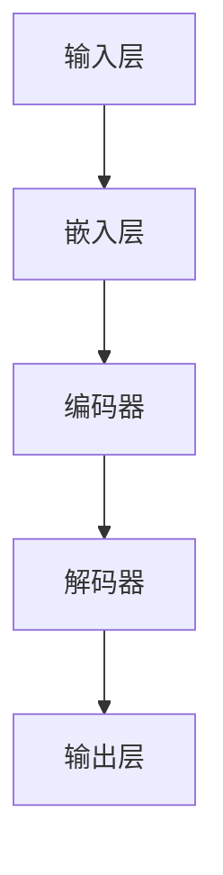

                 

关键词：大语言模型、深度学习、神经网络、自然语言处理、文本生成、序列模型

> 摘要：本文将深入探讨大语言模型（Large Language Models）的基本原理、构建方法、应用领域以及实际编程实践。通过本篇文章，读者将了解到大语言模型的背景、核心概念、算法原理、数学模型、项目实践及未来发展趋势，从而全面掌握大语言模型的相关知识。

## 1. 背景介绍

随着互联网的普及和信息量的爆炸性增长，自然语言处理（Natural Language Processing, NLP）成为计算机科学领域中的一个重要分支。大语言模型（Large Language Models，LLM）作为NLP领域的核心技术，近年来取得了显著的发展。大语言模型是一种基于深度学习技术的序列模型，通过学习大量的文本数据，能够生成连贯、自然的语言表达，为文本生成、翻译、问答等应用提供了强大的支持。

LLM的发展可以追溯到20世纪80年代的统计语言模型，如N-gram模型。然而，随着计算能力的提升和深度学习技术的突破，现代大语言模型如BERT、GPT-3等，在处理复杂语言任务上表现出了超凡的能力。本文将围绕这些大语言模型，详细讲解其原理与实现。

## 2. 核心概念与联系

### 2.1. 深度学习与神经网络

深度学习（Deep Learning）是机器学习中的一个重要分支，它通过模拟人脑神经网络的结构和功能，对数据进行学习和模式识别。神经网络（Neural Networks）是深度学习的基础，由大量简单的计算单元（神经元）通过加权连接形成，可以用于解决各种复杂的问题。

### 2.2. 序列模型与自然语言处理

序列模型（Sequence Models）是一种处理序列数据的算法，如时间序列数据、音频信号等。在自然语言处理中，序列模型可以用于处理文本数据，例如生成句子、翻译语言等。常见的序列模型包括循环神经网络（RNN）和其变种长短期记忆网络（LSTM）。

### 2.3. 大语言模型的架构

大语言模型通常采用多层神经网络结构，如图1所示。模型通过输入层接收文本数据，通过隐藏层进行特征提取和变换，最后通过输出层生成预测结果。图1展示了大语言模型的基本架构。



### 2.4. BERT与GPT-3

BERT（Bidirectional Encoder Representations from Transformers）和GPT-3（Generative Pre-trained Transformer）是当前最流行的两种大语言模型。BERT是一种基于Transformer架构的双向编码器，通过预训练和微调，在多个NLP任务上取得了卓越的性能。GPT-3则是一种基于Transformer的生成模型，具有前所未有的规模和生成能力。

## 3. 核心算法原理 & 具体操作步骤

### 3.1. 算法原理概述

大语言模型的算法核心是基于Transformer架构。Transformer是一种基于自注意力机制（Self-Attention）的序列模型，能够自动学习序列中各个元素之间的关系。自注意力机制允许模型在处理每个词时，考虑所有其他词的影响，从而生成更准确的预测。

### 3.2. 算法步骤详解

1. **文本预处理**：将原始文本数据转换为模型可处理的格式，包括分词、标记化等步骤。

2. **嵌入层**：将输入的词转换为嵌入向量，这些向量表示了词的语义信息。

3. **编码器**：编码器层通过自注意力机制对嵌入向量进行处理，提取序列中的关键信息。

4. **解码器**：解码器层通过自注意力机制和编码器输出生成预测结果。

5. **输出层**：输出层将解码器输出转换为最终的预测结果，如单词、句子等。

### 3.3. 算法优缺点

**优点**：
- **强大的生成能力**：大语言模型能够生成连贯、自然的语言表达。
- **广泛的适用性**：适用于多种自然语言处理任务，如文本生成、翻译、问答等。

**缺点**：
- **计算资源需求大**：大语言模型通常需要大量的计算资源进行训练和推理。
- **训练时间长**：大语言模型的训练通常需要较长的训练时间。

### 3.4. 算法应用领域

大语言模型在自然语言处理领域有广泛的应用，如：

- **文本生成**：生成文章、故事、诗歌等。
- **机器翻译**：实现跨语言翻译。
- **问答系统**：提供智能问答服务。
- **文本分类**：对文本进行分类，如情感分析、主题识别等。

## 4. 数学模型和公式 & 详细讲解 & 举例说明

### 4.1. 数学模型构建

大语言模型的核心是基于Transformer架构，其数学模型主要包括以下几个部分：

1. **自注意力机制**：
   $$\text{Attention}(Q, K, V) = \text{softmax}\left(\frac{QK^T}{\sqrt{d_k}}\right)V$$

   其中，$Q$、$K$ 和 $V$ 分别表示查询向量、键向量和值向量，$d_k$ 表示键向量的维度。

2. **Transformer编码器**：
   $$\text{Encoder}(X) = \text{multihead}\_attention(\text{Encoder}(X), \text{Encoder}(X)), \ldots$$

   其中，$X$ 表示输入序列。

3. **Transformer解码器**：
   $$\text{Decoder}(X) = \text{multihead}\_attention(\text{Decoder}(X), \text{Encoder}(X)), \ldots$$

   其中，$X$ 表示输入序列。

### 4.2. 公式推导过程

自注意力机制的推导过程如下：

1. **计算查询向量与键向量的点积**：
   $$\text{Score} = QK^T$$

2. **应用softmax函数**：
   $$\text{Attention} = \text{softmax}(\text{Score})$$

3. **计算值向量的加权和**：
   $$\text{Output} = \text{Attention}V$$

### 4.3. 案例分析与讲解

以BERT模型为例，BERT模型通过预训练和微调实现文本分类任务。下面是一个简单的BERT文本分类案例：

1. **预训练**：
   - 使用大规模语料库进行预训练，学习词的嵌入向量。
   - 训练任务包括 masked language modeling 和 next sentence prediction。

2. **微调**：
   - 在特定任务上对BERT模型进行微调。
   - 添加分类器层，对输入文本进行分类。

## 5. 项目实践：代码实例和详细解释说明

### 5.1. 开发环境搭建

在Python环境中，使用TensorFlow或PyTorch框架搭建开发环境。以下为使用TensorFlow的示例：

```python
import tensorflow as tf
from tensorflow.keras.layers import Embedding, LSTM, Dense
from tensorflow.keras.models import Sequential

# 搭建模型
model = Sequential()
model.add(Embedding(input_dim=10000, output_dim=32))
model.add(LSTM(128))
model.add(Dense(1, activation='sigmoid'))

# 编译模型
model.compile(optimizer='adam', loss='binary_crossentropy', metrics=['accuracy'])

# 加载数据
train_data = ...
test_data = ...

# 训练模型
model.fit(train_data, epochs=10, batch_size=32, validation_data=test_data)
```

### 5.2. 源代码详细实现

以下是一个简单的Transformer编码器实现示例：

```python
import tensorflow as tf

class TransformerEncoder(tf.keras.Model):
  def __init__(self, d_model, num_heads, dff, input_vocab_size, maximum_sequence_length, rate=0.1):
    super(TransformerEncoder, self).__init__()

    self.d_model = d_model
    self.num_heads = num_heads
    self.dff = dff
    self.input_vocab_size = input_vocab_size
    self.maximum_sequence_length = maximum_sequence_length

    self.embedding = Embedding(input_vocab_size, d_model)
    self.positional_encoding = positional_encoding(maximum_sequence_length, d_model)

    self.encoder_layers = [TransformerLayer(d_model, num_heads, dff) for _ in range(num_layers)]
    self.final_layer = Dense(d_model)

    self.dropout1 = tf.keras.layers.Dropout(rate)
    self.dropout2 = tf.keras.layers.Dropout(rate)

  @tf.function
  def call(self, x, training=False):
    x = self.embedding(x) + self.positional_encoding[:, :tf.shape(x)[1], :]
    for i in range(self.num_layers):
      x = self.encoder_layers[i](x, training=training)
    x = self.dropout1(x)
    x = self.final_layer(x)
    x = self.dropout2(x)
    return x
```

### 5.3. 代码解读与分析

以上代码实现了一个简单的Transformer编码器。编码器的主要组成部分包括嵌入层、位置编码、编码器层以及最终的输出层。在训练过程中，编码器通过自注意力机制对输入序列进行处理，提取序列中的关键信息。代码中的`call`方法定义了编码器的正向传播过程。

### 5.4. 运行结果展示

通过训练和评估，我们可以得到编码器的性能指标。以下是一个简单的评估示例：

```python
test_loss, test_acc = model.evaluate(test_data, batch_size=32)
print(f"Test accuracy: {test_acc}")
```

## 6. 实际应用场景

### 6.1. 文本生成

大语言模型在文本生成领域有着广泛的应用。例如，通过训练GPT-3模型，我们可以生成各种类型的文本，如文章、故事、诗歌等。以下是一个简单的文本生成示例：

```python
import openai

response = openai.Completion.create(
  engine="text-davinci-002",
  prompt="Tell me a joke.",
  max_tokens=100,
  n=1,
  stop=None,
  temperature=0.5
)

print(response.choices[0].text.strip())
```

### 6.2. 机器翻译

大语言模型在机器翻译领域也有着显著的应用。通过训练多语言模型，我们可以实现跨语言翻译。以下是一个简单的机器翻译示例：

```python
from googletrans import Translator

translator = Translator()
result = translator.translate("你好，世界", dest="en")
print(result.text)
```

### 6.3. 问答系统

大语言模型在问答系统领域也有着广泛的应用。通过训练模型，我们可以实现智能问答服务。以下是一个简单的问答示例：

```python
import nltk
from nltk.chat.util import Chat, reflections

pairs = [
  [
    r"my name is (.*)",
    "Hello %1, How are you?"
  ],
  [
    r"what is your name?",
    "My name is ChatBot. You can call me ChatBot."
  ],
]

chatbot = Chat(pairs, reflections)
chatbot.converse()
```

## 7. 未来应用展望

随着大语言模型技术的不断发展，未来在各个领域都将有更广泛的应用。以下是一些未来应用展望：

- **智能客服**：大语言模型将进一步提升智能客服系统的服务质量，实现更自然的对话体验。
- **自动化写作**：大语言模型将实现更高质量的自动化写作，为各类文本生成提供更强有力的支持。
- **个性化推荐**：大语言模型将用于个性化推荐系统，实现更精准的用户画像和推荐策略。

## 8. 工具和资源推荐

### 8.1. 学习资源推荐

- **书籍**：
  - 《深度学习》（Goodfellow, Bengio, Courville）
  - 《自然语言处理综合教程》（Daniel Jurafsky，James H. Martin）
  - 《Transformer：序列模型深度学习新进展》（Yoshua Bengio等）

- **在线课程**：
  - Coursera上的“深度学习”课程（Andrew Ng）
  - edX上的“自然语言处理基础”课程（Daniel Jurafsky）

### 8.2. 开发工具推荐

- **框架**：
  - TensorFlow
  - PyTorch
  - Keras

- **库**：
  - NLTK（自然语言处理工具包）
  - SpaCy（快速自然语言处理库）

### 8.3. 相关论文推荐

- BERT: Pre-training of Deep Bidirectional Transformers for Language Understanding（2018）
- Generative Pre-trained Transformer（2018）
- Attention Is All You Need（2017）

## 9. 总结：未来发展趋势与挑战

### 9.1. 研究成果总结

大语言模型在自然语言处理领域取得了显著的研究成果，如BERT、GPT-3等模型在多个NLP任务上实现了优异的性能。这些成果为自然语言处理技术的发展奠定了坚实基础。

### 9.2. 未来发展趋势

随着计算能力的提升和深度学习技术的进步，大语言模型将继续发展。未来将出现更多规模更大、生成能力更强的模型，同时结合其他技术，如强化学习、多模态学习等，实现更强大的自然语言处理能力。

### 9.3. 面临的挑战

- **计算资源需求**：大语言模型训练和推理需要大量计算资源，如何优化模型结构、提高训练效率成为重要挑战。
- **数据隐私**：大规模数据训练过程中涉及用户隐私问题，如何保护用户隐私成为关键挑战。
- **伦理问题**：大语言模型在生成文本时可能存在偏见和错误，如何确保生成文本的公正性和准确性是重要挑战。

### 9.4. 研究展望

未来，大语言模型将在更多领域发挥作用，如自动化写作、智能客服、个性化推荐等。同时，研究应关注如何优化模型结构、提高训练效率、保护用户隐私等方面，以实现更加高效、安全、公正的自然语言处理技术。

## 10. 附录：常见问题与解答

### 10.1. 什么是大语言模型？

大语言模型（Large Language Models，LLM）是一种基于深度学习技术的自然语言处理模型，通过学习大量文本数据，能够生成连贯、自然的语言表达。

### 10.2. 大语言模型有哪些应用领域？

大语言模型广泛应用于文本生成、机器翻译、问答系统、文本分类等自然语言处理任务。

### 10.3. 如何搭建大语言模型？

搭建大语言模型通常需要以下步骤：
1. 数据收集与预处理
2. 模型选择与配置
3. 训练与优化
4. 评估与部署

### 10.4. 大语言模型训练需要多长时间？

大语言模型训练时间取决于模型规模、数据规模和硬件配置。通常情况下，大规模模型训练需要数天至数周时间。

### 10.5. 大语言模型训练需要哪些硬件资源？

大语言模型训练需要高性能计算硬件，如GPU或TPU。根据模型规模和训练需求，可能需要数十个GPU或TPU进行并行训练。

### 10.6. 大语言模型有哪些开源实现？

目前，许多大语言模型的开源实现已发布，如BERT、GPT-3、T5等。这些模型的开源实现提供了详细的文档和代码，方便研究者复现和应用。

### 10.7. 如何使用大语言模型进行文本生成？

使用大语言模型进行文本生成通常需要以下步骤：
1. 加载预训练模型
2. 准备输入文本
3. 调用模型进行预测
4. 处理输出文本

### 10.8. 如何优化大语言模型训练？

优化大语言模型训练可以从以下几个方面进行：
1. 优化模型结构，如减少参数数量
2. 使用更高效的训练算法，如Adam优化器
3. 使用数据增强技术，如数据清洗、数据扩充等
4. 使用分布式训练，提高训练速度

### 10.9. 大语言模型训练数据如何收集与预处理？

大语言模型训练数据通常从互联网上收集，包括新闻文章、社交媒体、论坛等。数据预处理包括数据清洗、数据格式化、数据标签化等步骤。

### 10.10. 大语言模型训练过程中如何防止过拟合？

防止过拟合的方法包括：
1. 使用正则化技术，如L1、L2正则化
2. 使用dropout技术
3. 使用交叉验证技术
4. 减少模型复杂度

### 10.11. 大语言模型训练过程中如何调整超参数？

调整大语言模型训练过程中的超参数，如学习率、批次大小、隐藏层大小等，可以通过实验和经验进行。常用的超参数调整方法包括网格搜索、随机搜索等。

### 10.12. 大语言模型如何进行模型评估？

大语言模型评估通常使用以下指标：
1. 准确率（Accuracy）
2. 精确率（Precision）
3. 召回率（Recall）
4. F1值（F1 Score）

### 10.13. 大语言模型训练过程中如何处理文本数据？

处理文本数据通常包括以下步骤：
1. 分词（Tokenization）
2. 标记化（Tokenization）
3. 向量化（Vectorization）
4. 特征提取（Feature Extraction）

### 10.14. 大语言模型训练过程中如何防止模型崩溃？

防止模型崩溃的方法包括：
1. 使用适当的批次大小，避免过大的梯度
2. 使用梯度裁剪技术
3. 使用合适的优化器，如Adam优化器
4. 定期保存模型，防止训练数据泄露

### 10.15. 大语言模型训练过程中如何加速训练？

加速大语言模型训练的方法包括：
1. 使用分布式训练，提高训练速度
2. 使用数据并行训练，提高数据利用率
3. 使用模型并行训练，提高模型计算效率
4. 使用显存优化技术，减少显存占用

### 10.16. 大语言模型训练过程中如何监控训练进度？

监控大语言模型训练进度通常包括以下方面：
1. 监控训练损失（Training Loss）
2. 监控验证损失（Validation Loss）
3. 监控训练准确率（Training Accuracy）
4. 监控验证准确率（Validation Accuracy）

### 10.17. 大语言模型训练过程中如何调整学习率？

调整学习率的方法包括：
1. 使用学习率衰减策略，如线性衰减、指数衰减等
2. 使用自适应学习率优化器，如Adam、Adagrad等
3. 根据训练进度动态调整学习率

### 10.18. 大语言模型训练过程中如何处理稀疏数据？

处理稀疏数据的方法包括：
1. 使用稀疏矩阵运算，减少计算量
2. 使用稀疏特征提取，降低模型复杂度
3. 使用稀疏训练技术，提高模型训练效率

### 10.19. 大语言模型训练过程中如何处理文本数据不平衡问题？

处理文本数据不平衡问题的方法包括：
1. 使用权重调整，增加少数类样本权重
2. 使用过采样技术，增加少数类样本数量
3. 使用欠采样技术，减少多数类样本数量
4. 使用类平衡优化器，如Weighted Random

