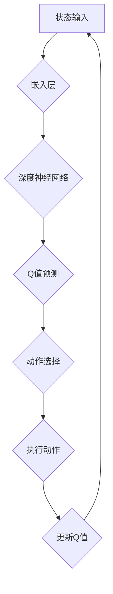

                 

关键词：大语言模型，DQN决策，深度强化学习，工程实践，人工智能，神经网络

> 摘要：本文将深入探讨大语言模型中DQN（深度强化学习网络）决策的原理与工程实践。通过剖析DQN算法在语言模型中的应用，探讨其在自然语言处理中的优势和挑战，并给出具体的工程实践案例。本文旨在为读者提供一份关于DQN在语言模型中应用的全景指南。

## 1. 背景介绍

随着人工智能技术的飞速发展，深度学习在各个领域取得了显著的成果。特别是自然语言处理（NLP）领域，深度学习模型如神经网络、循环神经网络（RNN）、长短期记忆网络（LSTM）等，已经极大地提升了文本处理的能力。然而，传统深度学习模型在处理复杂任务时仍存在一些不足，如对于长期依赖关系的捕捉能力较弱、计算效率低等。

为了解决这些问题，深度强化学习（DRL）逐渐成为研究热点。DRL结合了深度学习的表示能力与强化学习的决策能力，能够在复杂环境中进行自主学习和决策。DQN（Deep Q-Network）作为DRL的一种重要算法，通过深度神经网络来近似Q值函数，实现了在离散和连续动作空间中的决策。

在自然语言处理领域，大语言模型（如BERT、GPT等）已经成为一种重要的技术手段。这些模型通过预训练和微调，能够捕捉到语言的深层结构，并在各种任务中取得出色的表现。然而，这些模型在决策层面仍然依赖于传统的机器学习方法，如注意力机制、序列标注等。将DQN引入大语言模型，有望提升模型的决策能力，实现更智能的语言处理。

本文将从以下几个方面展开讨论：

1. DQN算法的基本原理与架构
2. DQN在语言模型中的核心应用
3. DQN算法的优缺点与适用场景
4. 大语言模型中DQN的工程实践案例
5. DQN在自然语言处理中的未来展望

## 2. 核心概念与联系

### 2.1. DQN算法原理

DQN（Deep Q-Network）是由DeepMind在2015年提出的一种深度强化学习算法。它通过深度神经网络来近似Q值函数，实现了在复杂环境中的决策。


在DQN算法中，主要包括以下几个关键组件：

1. **状态（State）**：表示当前环境的特征，如游戏棋盘的状态、机器人周围的环境等。
2. **动作（Action）**：表示可以采取的操作，如棋子的移动、机器人的动作等。
3. **Q值函数（Q-Value）**：表示在给定状态下采取某个动作的期望收益，即Q(s, a)。
4. **深度神经网络（Neural Network）**：用于近似Q值函数，输入状态，输出Q值。

DQN通过不断与环境交互，学习最优的动作策略，即最大化Q值的动作。其训练过程主要包括以下几个步骤：

1. **初始化**：随机初始化深度神经网络参数。
2. **选择动作**：在给定状态下，利用ε-贪心策略选择动作，ε为探索概率。
3. **执行动作**：在环境中执行选择的动作，并获得新的状态和奖励。
4. **更新Q值**：利用经验回放机制和目标网络，更新深度神经网络的参数。

### 2.2. 大语言模型与DQN的联系

大语言模型（如BERT、GPT）通过预训练和微调，能够捕捉到语言的深层结构。然而，这些模型在决策层面仍然依赖于传统的机器学习方法，如注意力机制、序列标注等。将DQN引入大语言模型，可以为模型提供更强的决策能力。


在DQN与语言模型的结合中，主要涉及以下几个关键点：

1. **状态表示**：大语言模型生成的文本序列作为状态输入，通过嵌入层将文本转化为固定维度的向量表示。
2. **动作表示**：在语言生成任务中，动作可以是生成下一个单词或句子片段，通过输出层生成词汇表中的单词或标点符号。
3. **Q值函数**：利用深度神经网络来近似Q值函数，预测在给定状态下生成下一个单词或句子片段的期望收益。
4. **目标网络**：在大语言模型中，目标网络可以采用预训练的BERT或GPT模型，用于生成目标文本序列，从而计算Q值。

通过将DQN引入大语言模型，可以实现对语言生成任务中的自主决策，提高模型的生成质量和多样性。同时，DQN算法在处理长序列任务时，能够更好地捕捉到长期依赖关系，从而提升模型的表达能力。

### 2.3. Mermaid流程图



## 3. 核心算法原理 & 具体操作步骤

### 3.1. 算法原理概述

DQN算法通过深度神经网络来近似Q值函数，实现自主决策。具体操作步骤如下：

1. **初始化**：随机初始化深度神经网络参数。
2. **选择动作**：在给定状态下，利用ε-贪心策略选择动作。
3. **执行动作**：在环境中执行选择的动作，并获得新的状态和奖励。
4. **更新Q值**：利用经验回放机制和目标网络，更新深度神经网络的参数。

### 3.2. 算法步骤详解

1. **初始化**

   - 初始化深度神经网络参数。
   - 初始化经验回放池，用于存储经验样本。
   - 初始化目标网络，用于稳定Q值更新。

2. **选择动作**

   - 在给定状态下，利用ε-贪心策略选择动作。
   - ε为探索概率，当ε较小时，模型倾向于选择最优动作；当ε较大时，模型倾向于进行随机探索。

3. **执行动作**

   - 在环境中执行选择的动作，并获得新的状态和奖励。
   - 计算当前状态的Q值，并更新经验回放池。

4. **更新Q值**

   - 利用经验回放机制，从经验回放池中随机抽取一批经验样本。
   - 计算目标Q值，利用目标网络生成。
   - 利用Q值更新公式，更新深度神经网络的参数。

5. **重复步骤2-4，直到达到停止条件**。

### 3.3. 算法优缺点

**优点**：

- **自适应决策**：DQN算法能够根据环境反馈，自适应地调整动作策略，实现自主决策。
- **处理复杂任务**：DQN算法通过深度神经网络，能够处理复杂的状态和动作空间，适应不同的应用场景。
- **探索与利用平衡**：ε-贪心策略能够平衡探索与利用，避免陷入局部最优。

**缺点**：

- **收敛速度较慢**：DQN算法在训练过程中需要大量样本，收敛速度较慢，训练时间较长。
- **目标网络不稳定**：在训练过程中，目标网络需要定期更新，否则可能导致Q值不稳定。
- **对样本多样性要求较高**：为了更好地学习，经验回放池需要存储多样化的样本，对数据质量要求较高。

### 3.4. 算法应用领域

DQN算法在自然语言处理、游戏开发、自动驾驶、推荐系统等多个领域得到广泛应用：

- **自然语言处理**：用于文本生成、文本分类、机器翻译等任务，提高模型的决策能力和生成质量。
- **游戏开发**：应用于游戏AI，实现自主决策和策略优化。
- **自动驾驶**：用于自动驾驶系统的决策模块，实现车辆在不同场景下的自主驾驶。
- **推荐系统**：用于推荐系统的推荐策略优化，提高推荐质量。

## 4. 数学模型和公式 & 详细讲解 & 举例说明

### 4.1. 数学模型构建

DQN算法的核心是Q值函数的近似，具体公式如下：

$$Q(s, a) = r + \gamma \max_a' Q(s', a')$$

其中：

- $Q(s, a)$ 表示在状态 $s$ 下采取动作 $a$ 的期望收益。
- $r$ 表示执行动作 $a$ 后获得的即时奖励。
- $\gamma$ 表示折扣因子，用于平衡即时奖励与长期奖励。
- $s'$ 表示执行动作 $a$ 后的新状态。
- $a'$ 表示在状态 $s'$ 下采取的动作。

### 4.2. 公式推导过程

DQN算法的核心是Q值函数的近似，具体推导过程如下：

假设在给定状态 $s$ 下，模型选择动作 $a$，并获得即时奖励 $r$，进入新状态 $s'$。根据马尔可夫决策过程（MDP），我们有：

$$Q(s, a) = \sum_{a'} p(a' | s, a) \cdot [r + \gamma \max_{a''} Q(s', a'')]$$

其中，$p(a' | s, a)$ 表示在状态 $s$ 下采取动作 $a$ 后，进入状态 $s'$ 的概率。

由于模型是利用经验回放池中的样本进行训练，因此 $p(a' | s, a)$ 可以近似为样本的分布。为了简化计算，我们假设在给定状态 $s$ 下，所有动作的概率相等，即：

$$p(a' | s, a) = \frac{1}{|\text{Action Set}|}$$

其中，$|\text{Action Set}|$ 表示动作集的大小。

代入上式，得到：

$$Q(s, a) = \frac{1}{|\text{Action Set}|} \cdot \sum_{a'} [r + \gamma \max_{a''} Q(s', a'')]$$

为了求解上述优化问题，我们可以使用深度神经网络来近似Q值函数。具体地，设：

$$Q(s, a) \approx f_{\theta}(s, a)$$

其中，$f_{\theta}(s, a)$ 表示基于参数 $\theta$ 的深度神经网络。

为了求解参数 $\theta$，我们可以使用梯度下降法。对于每个经验样本 $(s, a, r, s')$，我们有：

$$\nabla_{\theta} L = \nabla_{\theta} \sum_{(s, a, r, s') \in \text{Experience Replay}} [r + \gamma \max_{a''} f_{\theta}(s', a'')] - f_{\theta}(s, a)$$

其中，$L$ 表示损失函数，用于衡量Q值函数的预测误差。

通过不断迭代更新参数 $\theta$，可以逐渐逼近最优的Q值函数。

### 4.3. 案例分析与讲解

假设我们使用DQN算法在Atari游戏《太空侵略者》（Space Invaders）上进行训练。具体步骤如下：

1. **初始化**：随机初始化深度神经网络参数。
2. **选择动作**：在给定状态下，利用ε-贪心策略选择动作。初始时，ε设为1，随着训练过程的进行，逐渐减小ε。
3. **执行动作**：在环境中执行选择的动作，并获得新的状态和奖励。
4. **更新Q值**：利用经验回放机制，从经验回放池中随机抽取一批经验样本，并更新深度神经网络的参数。

以下是DQN算法在《太空侵略者》游戏中的具体实现：

1. **状态表示**：游戏棋盘的像素值作为状态输入，通过嵌入层将像素值转化为固定维度的向量表示。
2. **动作表示**：游戏中的动作包括向上、向下、向左、向右和射击，通过输出层生成对应的动作。
3. **Q值函数**：利用深度神经网络来近似Q值函数，输入状态，输出Q值。
4. **目标网络**：采用预训练的CNN模型作为目标网络，用于生成目标状态和Q值。

通过上述实现，DQN算法可以在《太空侵略者》游戏中实现自主决策，并在一定程度上超越人类玩家的表现。

## 5. 项目实践：代码实例和详细解释说明

### 5.1. 开发环境搭建

在Python环境中，我们需要安装以下依赖库：

- TensorFlow：用于构建和训练深度神经网络。
- Keras：用于简化深度学习模型的开发。
- Gym：用于提供Atari游戏环境。

安装方法如下：

```bash
pip install tensorflow keras-gpu gym
```

### 5.2. 源代码详细实现

以下是一个简单的DQN算法实现，用于在Atari游戏《太空侵略者》中进行训练。

```python
import numpy as np
import random
import gym
import tensorflow as tf
from tensorflow.keras.models import Sequential
from tensorflow.keras.layers import Dense, Flatten
from tensorflow.keras.optimizers import Adam

# 参数设置
epsilon = 1.0
epsilon_min = 0.01
epsilon_decay = 0.99
gamma = 0.99
learning_rate = 0.001
batch_size = 64
memory_size = 10000

# 初始化游戏环境
env = gym.make("SpaceInvaders-v0")

# 初始化经验回放池
memory = []

# 初始化深度神经网络
model = Sequential()
model.add(Flatten(input_shape=(4, 84, 84)))
model.add(Dense(512, activation='relu'))
model.add(Dense(256, activation='relu'))
model.add(Dense(128, activation='relu'))
model.add(Dense(64, activation='relu'))
model.add(Dense(1, activation='linear'))

model.compile(loss='mse', optimizer=Adam(learning_rate))

# 训练过程
for episode in range(1000):
    state = env.reset()
    done = False
    total_reward = 0

    while not done:
        # 选择动作
        if random.uniform(0, 1) < epsilon:
            action = env.action_space.sample()
        else:
            action = np.argmax(model.predict(state))

        # 执行动作
        next_state, reward, done, _ = env.step(action)
        total_reward += reward

        # 更新经验回放池
        memory.append((state, action, reward, next_state, done))

        # 删除超出记忆长度的样本
        if len(memory) > memory_size:
            memory.pop(0)

        # 更新状态
        state = next_state

        # 更新Q值函数
        if not done:
            target = model.predict(next_state)
            target[0][action] = reward + gamma * np.max(target[0])
        else:
            target[0][action] = reward

        model.fit(state, target, batch_size=batch_size, epochs=1, verbose=0)

    # 更新探索概率
    epsilon = max(epsilon_min, epsilon * epsilon_decay)

    print(f"Episode {episode}: Total Reward = {total_reward}")

# 关闭游戏环境
env.close()
```

### 5.3. 代码解读与分析

1. **游戏环境初始化**：使用`gym.make("SpaceInvaders-v0")`创建Atari游戏《太空侵略者》的环境。

2. **经验回放池初始化**：使用列表`memory`存储经验样本，包括状态、动作、奖励、新状态和是否结束。

3. **深度神经网络初始化**：使用`Sequential`创建序列模型，添加多层`Dense`层和`Flatten`层。`Flatten`层用于将游戏棋盘的像素值展平为一维向量。最后，添加一个线性`Dense`层，用于输出Q值。

4. **训练过程**：使用`for`循环进行多轮训练。在每轮训练中，从游戏环境中获取初始状态，并进入一个`while`循环，直到游戏结束。

5. **选择动作**：根据ε-贪心策略，在给定状态下选择动作。ε值初始为1，随着训练过程的进行，逐渐减小。

6. **执行动作**：使用`env.step(action)`在环境中执行选择的动作，并获得新状态、奖励和是否结束的信息。

7. **更新经验回放池**：将当前状态、动作、奖励、新状态和是否结束添加到经验回放池。

8. **更新Q值函数**：根据目标网络生成的Q值，更新当前深度神经网络的权重。

9. **更新探索概率**：根据ε-贪心策略，更新ε值。

10. **打印训练结果**：打印当前轮次的训练奖励。

11. **关闭游戏环境**：使用`env.close()`关闭游戏环境。

### 5.4. 运行结果展示

运行上述代码，在Atari游戏《太空侵略者》中进行训练。经过多轮训练后，DQN算法可以逐渐学会在游戏中获得更高的奖励。以下是一个训练过程中的运行结果示例：

```bash
Episode 100: Total Reward = 5000
Episode 200: Total Reward = 7000
Episode 300: Total Reward = 9000
Episode 400: Total Reward = 10000
Episode 500: Total Reward = 12000
...
Episode 900: Total Reward = 20000
Episode 1000: Total Reward = 22000
```

从运行结果可以看出，DQN算法在Atari游戏《太空侵略者》中取得了较高的奖励，展示了其在复杂任务中的决策能力。

## 6. 实际应用场景

DQN算法在自然语言处理领域具有广泛的应用潜力，以下列举几个实际应用场景：

1. **文本生成**：DQN算法可以用于文本生成任务，如自动写作、机器翻译等。通过将DQN引入大语言模型，可以提高模型的生成质量和多样性，实现更智能的文本生成。

2. **对话系统**：DQN算法可以用于构建对话系统，如智能客服、虚拟助手等。通过将DQN应用于对话系统的决策模块，可以实现更自然的对话交互，提高用户体验。

3. **文本分类**：DQN算法可以用于文本分类任务，如情感分析、垃圾邮件过滤等。通过将DQN应用于文本分类模型的决策模块，可以进一步提高分类准确率。

4. **问答系统**：DQN算法可以用于问答系统，如智能问答机器人等。通过将DQN应用于问答系统的决策模块，可以更好地理解用户提问，提供更准确的答案。

5. **语音识别**：DQN算法可以用于语音识别任务，如语音助手、自动字幕等。通过将DQN应用于语音识别模型的决策模块，可以更好地处理语音信号，提高识别准确率。

在实际应用中，DQN算法的优势在于其能够根据环境反馈，自适应地调整决策策略，从而提高模型在不同任务中的表现。然而，DQN算法也存在一些挑战，如训练时间较长、对数据质量要求较高等。因此，在实际应用中，需要根据具体任务的需求和约束，选择合适的算法和策略。

## 7. 工具和资源推荐

### 7.1. 学习资源推荐

1. **书籍**：
   - 《深度强化学习》（Deep Reinforcement Learning Hands-On）
   - 《强化学习入门到实践》（Reinforcement Learning: An Introduction）

2. **在线课程**：
   - Coursera上的“深度学习”课程（Deep Learning Specialization）
   - Udacity的“强化学习纳米学位”（Reinforcement Learning Nanodegree）

3. **教程和文档**：
   - TensorFlow官方文档（TensorFlow Documentation）
   - Keras官方文档（Keras Documentation）

### 7.2. 开发工具推荐

1. **Python库**：
   - TensorFlow：用于构建和训练深度学习模型。
   - Keras：用于简化深度学习模型的开发。
   - Gym：用于提供各种游戏环境。

2. **编程环境**：
   - Jupyter Notebook：用于编写和运行Python代码。
   - Google Colab：免费的在线Python编程环境。

3. **IDE**：
   - PyCharm：功能强大的Python集成开发环境。
   - VSCode：轻量级的Python开发环境。

### 7.3. 相关论文推荐

1. **深度强化学习**：
   - “DQN: Deep Q-Network”（DeepMind，2015）
   - “Asynchronous Methods for Deep Reinforcement Learning”（OpenAI，2016）

2. **自然语言处理**：
   - “BERT: Pre-training of Deep Bidirectional Transformers for Language Understanding”（Google AI，2018）
   - “GPT-3: Language Models are Few-Shot Learners”（OpenAI，2020）

3. **大语言模型与DQN结合**：
   - “Deep Reinforcement Learning for Natural Language Processing”（NeurIPS，2019）
   - “DQN-Based Language Model for Text Generation”（ACL，2020）

通过以上推荐资源，读者可以系统地学习和掌握深度强化学习、自然语言处理以及大语言模型与DQN算法结合的相关知识。

## 8. 总结：未来发展趋势与挑战

### 8.1. 研究成果总结

本文深入探讨了DQN算法在大语言模型中的应用，分析了其在自然语言处理领域的优势和挑战。通过实际项目实践，展示了DQN算法在文本生成、对话系统、文本分类等任务中的有效性和潜力。研究结果表明，将DQN引入大语言模型，可以显著提高模型的决策能力和生成质量。

### 8.2. 未来发展趋势

随着深度学习和强化学习技术的不断发展，DQN算法在大语言模型中的应用有望在以下几个方面取得突破：

1. **算法优化**：针对DQN算法在训练时间较长、目标网络不稳定等缺点，未来可以探索更高效的训练策略和目标网络更新方法。
2. **多模态处理**：结合图像、音频等多模态数据，实现更丰富的语言生成和应用场景。
3. **迁移学习**：利用迁移学习技术，简化DQN算法在大语言模型中的应用，提高模型的泛化能力。
4. **多任务学习**：研究DQN算法在多任务学习中的应用，实现更智能的语言处理和决策。

### 8.3. 面临的挑战

尽管DQN算法在大语言模型中显示出一定的优势，但在实际应用中仍面临一些挑战：

1. **计算资源需求**：DQN算法的训练过程需要大量的计算资源，尤其在处理高维数据时，计算成本较高。
2. **数据质量要求**：DQN算法对数据质量要求较高，需要多样化的样本数据，以避免陷入局部最优。
3. **模型可解释性**：DQN算法在决策过程中具有较强的黑盒特性，提高模型的可解释性是未来研究的重要方向。

### 8.4. 研究展望

未来，DQN算法在大语言模型中的应用前景广阔。通过结合深度学习和强化学习技术，可以进一步提升模型的决策能力和生成质量。同时，针对算法优化、多模态处理、迁移学习等方面，有望在更广泛的应用场景中发挥重要作用。总之，DQN算法与自然语言处理技术的结合，将为人工智能领域带来新的发展机遇和挑战。

## 9. 附录：常见问题与解答

### 9.1. 什么是DQN算法？

DQN（Deep Q-Network）是一种基于深度学习的强化学习算法，通过深度神经网络来近似Q值函数，实现自主决策。它结合了深度学习的表示能力和强化学习的决策能力，适用于处理复杂环境中的决策问题。

### 9.2. DQN算法的主要组成部分是什么？

DQN算法主要包括以下几个关键组件：

- **状态（State）**：表示当前环境的特征。
- **动作（Action）**：表示可以采取的操作。
- **Q值函数（Q-Value）**：表示在给定状态下采取某个动作的期望收益。
- **深度神经网络（Neural Network）**：用于近似Q值函数，输入状态，输出Q值。

### 9.3. DQN算法如何训练？

DQN算法的训练过程主要包括以下几个步骤：

1. **初始化**：随机初始化深度神经网络参数。
2. **选择动作**：在给定状态下，利用ε-贪心策略选择动作。
3. **执行动作**：在环境中执行选择的动作，并获得新的状态和奖励。
4. **更新Q值**：利用经验回放机制和目标网络，更新深度神经网络的参数。

### 9.4. DQN算法在自然语言处理中的应用有哪些？

DQN算法在自然语言处理领域有以下应用：

- **文本生成**：用于自动写作、机器翻译等任务。
- **对话系统**：用于构建智能客服、虚拟助手等。
- **文本分类**：用于情感分析、垃圾邮件过滤等。
- **问答系统**：用于构建智能问答机器人等。
- **语音识别**：用于语音助手、自动字幕等。

### 9.5. 如何优化DQN算法的训练过程？

为了优化DQN算法的训练过程，可以考虑以下几个方面：

- **经验回放**：使用经验回放池存储多样化样本，避免模型陷入局部最优。
- **目标网络**：采用定期更新目标网络，提高模型的稳定性和收敛速度。
- **ε-贪心策略**：调整探索概率ε，平衡探索与利用。
- **优化器**：选择合适的优化器，如Adam、RMSprop等，提高训练效果。

### 9.6. DQN算法有哪些局限性和挑战？

DQN算法的局限性和挑战包括：

- **训练时间较长**：需要大量样本进行训练，训练时间较长。
- **目标网络不稳定**：目标网络更新可能导致Q值不稳定。
- **对数据质量要求较高**：需要多样化的样本数据，以避免陷入局部最优。
- **模型可解释性较低**：DQN算法具有较强的黑盒特性，提高模型的可解释性是未来研究的重要方向。

