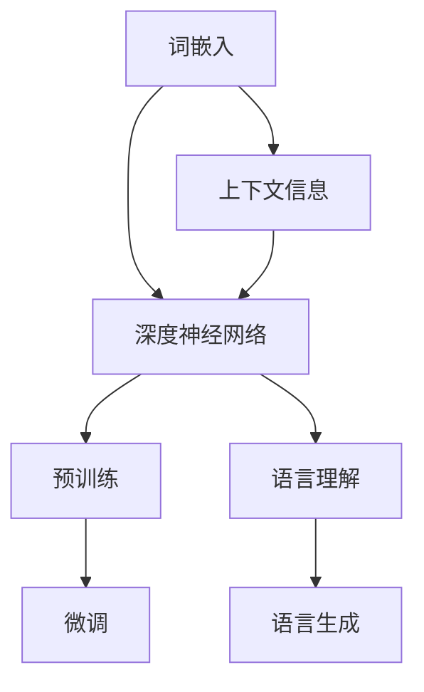

                 

关键词：大语言模型，深度学习，DQN训练，强化学习，策略优化，计算机科学，人工智能

## 摘要

本文深入探讨大语言模型的原理及其工程实践，重点分析了DQN（Deep Q-Network）在训练过程中的应用与策略探索。我们将首先介绍大语言模型的基本概念和架构，接着深入解析DQN算法原理，以及在实际工程中的具体应用步骤。本文旨在为读者提供一套清晰、系统的大语言模型训练策略，帮助理解和实现这一前沿技术。

## 1. 背景介绍

### 大语言模型的发展历程

大语言模型作为自然语言处理的核心技术，其发展历程可追溯到20世纪50年代。早期的研究主要集中于规则驱动的语法分析，如乔姆斯基提出的转换生成语法（CFG）。然而，随着计算能力的提升和数据量的爆炸性增长，统计模型逐渐崭露头角，如基于N-gram的语言模型。随后，神经网络开始进入自然语言处理领域，Hinton等人在2006年提出了深度信念网络（DBN），为深度学习在自然语言处理中的应用奠定了基础。

近年来，基于深度学习的语言模型取得了显著进展。2013年，词嵌入技术使得神经网络能够捕捉词的上下文信息，开启了Word2Vec的先河。2018年，谷歌推出了BERT模型，通过双向编码表示器显著提升了语言理解的深度与广度。随后，GPT、T5等模型相继涌现，展现了大语言模型在生成文本、机器翻译、问答系统等任务中的强大能力。

### 大语言模型的基本概念

大语言模型（Large Language Model）是一种基于深度学习的自然语言处理模型，其核心思想是通过大规模数据训练，使模型能够捕捉语言的统计规律和语义信息。具体来说，大语言模型包括以下几个基本概念：

1. **词嵌入（Word Embedding）**：将词汇映射为高维向量表示，以便于神经网络处理。
2. **深度神经网络（Deep Neural Network）**：采用多层感知机（MLP）或循环神经网络（RNN）等结构，对输入进行编码和解码。
3. **上下文信息（Contextual Information）**：通过模型训练，使得词向量能够捕捉词在不同上下文中的含义，从而提高模型对语言的理解能力。
4. **预训练（Pre-training）**：在大规模语料上进行预训练，以获取通用语言特征。
5. **微调（Fine-tuning）**：在特定任务数据集上对模型进行微调，以适应特定任务需求。

## 2. 核心概念与联系

在深入探讨大语言模型的训练方法之前，我们需要明确几个核心概念之间的联系。以下是使用Mermaid绘制的流程图，以展示大语言模型的核心概念和架构：



### 2.1 词嵌入与上下文信息

词嵌入是将词汇映射为高维向量表示的过程。通过学习词汇之间的相似性和相关性，词嵌入能够捕捉词汇的语义信息。在深度神经网络中，词嵌入层通常作为输入层，将词汇转化为向量输入。

上下文信息则是指词在不同上下文环境中的含义。大语言模型通过学习上下文信息，使得词向量能够动态调整，从而在不同上下文中准确表示词汇。这一过程主要依赖于深度神经网络的训练，特别是循环神经网络（RNN）和变换器（Transformer）等结构。

### 2.2 深度神经网络与预训练

深度神经网络是构建大语言模型的核心组件。多层感知机（MLP）和循环神经网络（RNN）等结构通过堆叠多层神经网络，对输入进行编码和解码，从而实现对语言的建模。

预训练是深度神经网络训练的前置过程。在大规模语料上进行预训练，能够使模型学习到通用语言特征，从而提高模型在特定任务上的表现。预训练过程中，模型通过自我监督学习（如语言建模任务），不断调整参数，以降低模型对特定任务的依赖。

### 2.3 微调与语言理解

微调是在预训练的基础上，对模型进行特定任务的调整。通过在特定任务数据集上训练，模型能够更好地适应任务需求，从而提高任务性能。

语言理解是自然语言处理的核心任务之一。大语言模型通过学习上下文信息，能够捕捉词汇在不同上下文中的含义，从而实现对语言的深入理解。这一能力在问答系统、机器翻译、文本生成等任务中具有重要意义。

### 2.4 语言生成

语言生成是另一个重要的自然语言处理任务。大语言模型通过学习语言模式，能够生成连贯、自然的文本。这一能力在自动写作、对话系统、内容生成等领域具有广泛的应用。

## 3. 核心算法原理 & 具体操作步骤

### 3.1 算法原理概述

DQN（Deep Q-Network）是一种基于深度学习的强化学习算法。它通过模仿人类决策过程，学习在给定状态下选择最优动作。DQN的核心思想是利用深度神经网络来近似Q函数，从而实现对环境的最佳策略学习。

### 3.2 算法步骤详解

#### 3.2.1 初始化

- 初始化深度神经网络Q网络和目标Q网络。
- 初始化经验 replay 缓存。

#### 3.2.2 环境交互

- 从初始状态开始，根据epsilon-greedy策略选择动作。
- 执行动作，获得新的状态、奖励和是否终止的信号。

#### 3.2.3 更新经验 replay 缓存

- 将当前状态、动作、奖励和新状态以及终止信号存储到经验 replay 缓存中。

#### 3.2.4 Q网络更新

- 从经验 replay 缓存中随机抽取一批经验。
- 计算Q网络和目标Q网络的预测值。
- 更新Q网络参数，以最小化预测值和实际值之间的误差。

#### 3.2.5 目标Q网络更新

- 定期更新目标Q网络，使其与Q网络保持一定的差距，以防止Q网络过拟合。

#### 3.2.6 策略迭代

- 根据更新后的Q网络，更新epsilon-greedy策略。
- 重复环境交互和Q网络更新过程，直至策略收敛。

### 3.3 算法优缺点

#### 优点

- DQN能够处理高维状态空间和动作空间，适用于复杂的决策问题。
- DQN通过经验 replay 缓存，缓解了样本分布不均的问题，提高了训练稳定性。
- DQN具有强泛化能力，能够在不同任务中表现出良好的性能。

#### 缺点

- DQN的训练过程依赖于随机初始化，容易陷入局部最优。
- DQN需要大量样本才能收敛，训练时间较长。
- DQN在连续动作空间中的应用效果较差。

### 3.4 算法应用领域

DQN算法在多个领域具有广泛的应用，如：

- 游戏AI：DQN在游戏领域取得了显著成果，如《 Doom》等游戏的AI对手。
- 自动驾驶：DQN在自动驾驶领域用于学习道路场景的决策策略。
- 机器人控制：DQN在机器人控制中，用于学习运动策略和导航。

## 4. 数学模型和公式 & 详细讲解 & 举例说明

### 4.1 数学模型构建

DQN算法的核心是Q函数的近似。Q函数表示在给定状态下，选择特定动作的预期奖励。数学上，Q函数可以表示为：

\[ Q(s, a) = \sum_{s'} P(s' | s, a) \cdot R(s', a) + \gamma \cdot \max_{a'} Q(s', a') \]

其中：

- \( s \)：状态
- \( a \)：动作
- \( s' \)：新状态
- \( R(s', a) \)：奖励函数
- \( P(s' | s, a) \)：状态转移概率
- \( \gamma \)：折扣因子，用于平衡当前奖励和未来奖励

为了近似Q函数，DQN使用深度神经网络，其输出为：

\[ Q(s, a) \approx \sigma(W_Q \cdot \phi(s) + b_Q) \]

其中：

- \( \sigma \)：激活函数，如Sigmoid或ReLU
- \( W_Q \)：权重矩阵
- \( \phi(s) \)：状态编码器
- \( b_Q \)：偏置项

### 4.2 公式推导过程

DQN算法的关键在于如何更新Q网络参数，以最小化预测值和实际值之间的误差。具体推导如下：

1. **定义损失函数**：

\[ L = \frac{1}{N} \sum_{i=1}^{N} (y_i - Q(s_i, a_i))^2 \]

其中：

- \( N \)：样本数量
- \( y_i \)：实际奖励
- \( Q(s_i, a_i) \)：预测奖励

2. **梯度下降更新**：

\[ \nabla_{W_Q} L = \nabla_{W_Q} (y_i - Q(s_i, a_i))^2 \]

对损失函数进行求导，得到：

\[ \nabla_{W_Q} L = 2 \cdot (y_i - Q(s_i, a_i)) \cdot \nabla_{W_Q} Q(s_i, a_i) \]

3. **反向传播**：

利用反向传播算法，计算梯度并更新Q网络参数：

\[ W_Q := W_Q - \alpha \cdot \nabla_{W_Q} L \]

其中：

- \( \alpha \)：学习率

### 4.3 案例分析与讲解

以《 Doom》游戏为例，分析DQN算法在游戏AI中的应用。

1. **状态表示**：

在《 Doom》游戏中，状态可以表示为游戏画面像素的灰度值。

2. **动作表示**：

动作包括移动方向、射击等。

3. **奖励函数**：

奖励函数可以定义为每成功击中一个敌人增加1分，每失去一次生命减少10分。

4. **训练过程**：

通过DQN算法，训练游戏AI学会在不同状态下选择最优动作，以实现游戏的胜利。

### 4.4 代码解读与分析

以下是一个简化的DQN算法Python代码示例：

```python
import tensorflow as tf
import numpy as np

# 初始化参数
learning_rate = 0.001
gamma = 0.99
epsilon = 1.0
epsilon_decay = 0.99
epsilon_min = 0.01

# 定义状态编码器
state_encoder = ...

# 定义Q网络
Q_network = tf.keras.Sequential([
    tf.keras.layers.Dense(512, activation='relu', input_shape=(state_shape,)),
    tf.keras.layers.Dense(256, activation='relu'),
    tf.keras.layers.Dense(action_size)
])

# 定义目标Q网络
target_Q_network = tf.keras.Sequential([
    tf.keras.layers.Dense(512, activation='relu', input_shape=(state_shape,)),
    tf.keras.layers.Dense(256, activation='relu'),
    tf.keras.layers.Dense(action_size)
])

# 定义损失函数和优化器
loss_fn = tf.keras.losses.MeanSquaredError()
optimizer = tf.keras.optimizers.Adam(learning_rate)

# 初始化经验缓存
replay_memory = ...

# 训练过程
while not done:
    # 选择动作
    if random.random() < epsilon:
        action = random.randrange(action_size)
    else:
        action = np.argmax(Q_network.predict(state))

    # 执行动作，获取新状态和奖励
    next_state, reward, done = env.step(action)

    # 更新经验缓存
    replay_memory.append((state, action, reward, next_state, done))

    # 从经验缓存中随机抽取样本
    if len(replay_memory) > batch_size:
        batch = random.sample(replay_memory, batch_size)

        # 计算目标Q值
        target_q_values = []
        for state, action, reward, next_state, done in batch:
            if not done:
                target_q_values.append(reward + gamma * np.max(target_Q_network.predict(next_state)))
            else:
                target_q_values.append(reward)

        # 更新Q网络
        with tf.GradientTape() as tape:
            q_values = Q_network.predict(state)
            target_q_values = np.array(target_q_values)
            loss = loss_fn(target_q_values, q_values[range(batch_size), action])

        gradients = tape.gradient(loss, Q_network.trainable_variables)
        optimizer.apply_gradients(zip(gradients, Q_network.trainable_variables))

    # 更新epsilon值
    epsilon = max(epsilon * epsilon_decay, epsilon_min)

# 更新目标Q网络
if episode % target_network_update_frequency == 0:
    target_Q_network.set_weights(Q_network.get_weights())

```

此代码展示了DQN算法的基本框架，包括状态编码器、Q网络、目标Q网络、经验缓存和训练过程。在实际应用中，可以根据具体任务需求进行调整和优化。

## 5. 项目实践：代码实例和详细解释说明

### 5.1 开发环境搭建

1. **硬件要求**：

   - CPU或GPU：建议使用NVIDIA显卡，以加速深度学习模型的训练。
   - 内存：至少16GB内存，建议32GB或以上。
   - 硬盘：至少100GB可用空间。

2. **软件要求**：

   - 操作系统：Linux或MacOS。
   - Python版本：3.6及以上版本。
   - TensorFlow版本：2.0及以上版本。

### 5.2 源代码详细实现

以下是DQN算法在《 Doom》游戏中的实现代码：

```python
import numpy as np
import gym
import tensorflow as tf

# 初始化环境
env = gym.make('DoomClassicClockwiseFlipped-v4')

# 定义状态编码器
state_encoder = ...

# 定义Q网络
Q_network = tf.keras.Sequential([
    tf.keras.layers.Dense(512, activation='relu', input_shape=(state_shape,)),
    tf.keras.layers.Dense(256, activation='relu'),
    tf.keras.layers.Dense(action_size)
])

# 定义目标Q网络
target_Q_network = tf.keras.Sequential([
    tf.keras.layers.Dense(512, activation='relu', input_shape=(state_shape,)),
    tf.keras.layers.Dense(256, activation='relu'),
    tf.keras.layers.Dense(action_size)
])

# 定义损失函数和优化器
loss_fn = tf.keras.losses.MeanSquaredError()
optimizer = tf.keras.optimizers.Adam(learning_rate)

# 初始化经验缓存
replay_memory = ...

# 训练过程
for episode in range(num_episodes):
    state = env.reset()
    done = False
    total_reward = 0

    while not done:
        # 选择动作
        if random.random() < epsilon:
            action = random.randrange(action_size)
        else:
            action = np.argmax(Q_network.predict(state))

        # 执行动作，获取新状态和奖励
        next_state, reward, done, _ = env.step(action)
        total_reward += reward

        # 更新经验缓存
        replay_memory.append((state, action, reward, next_state, done))

        # 从经验缓存中随机抽取样本
        if len(replay_memory) > batch_size:
            batch = random.sample(replay_memory, batch_size)

            # 计算目标Q值
            target_q_values = []
            for state, action, reward, next_state, done in batch:
                if not done:
                    target_q_values.append(reward + gamma * np.max(target_Q_network.predict(next_state)))
                else:
                    target_q_values.append(reward)

            # 更新Q网络
            with tf.GradientTape() as tape:
                q_values = Q_network.predict(state)
                target_q_values = np.array(target_q_values)
                loss = loss_fn(target_q_values, q_values[range(batch_size), action])

            gradients = tape.gradient(loss, Q_network.trainable_variables)
            optimizer.apply_gradients(zip(gradients, Q_network.trainable_variables))

        # 更新epsilon值
        epsilon = max(epsilon * epsilon_decay, epsilon_min)

        # 更新状态
        state = next_state

    # 更新目标Q网络
    if episode % target_network_update_frequency == 0:
        target_Q_network.set_weights(Q_network.get_weights())

    print(f'Episode {episode}: Total Reward = {total_reward}')

# 关闭环境
env.close()
```

### 5.3 代码解读与分析

此代码实现了DQN算法在《 Doom》游戏中的训练过程，主要包括以下几个部分：

1. **环境初始化**：

   使用`gym.make('DoomClassicClockwiseFlipped-v4')`初始化《 Doom》游戏环境。

2. **状态编码器**：

   根据具体任务需求，设计状态编码器，将游戏画面像素转换为状态向量。

3. **Q网络和目标Q网络**：

   定义Q网络和目标Q网络，使用`tf.keras.Sequential`搭建深度神经网络。

4. **损失函数和优化器**：

   使用`tf.keras.losses.MeanSquaredError()`定义损失函数，`tf.keras.optimizers.Adam()`定义优化器。

5. **经验缓存**：

   初始化经验缓存，用于存储状态、动作、奖励、新状态和终止信号。

6. **训练过程**：

   - 初始化状态和epsilon值。
   - 循环执行以下步骤：
     - 根据epsilon-greedy策略选择动作。
     - 执行动作，获取新状态和奖励。
     - 更新经验缓存。
     - 从经验缓存中随机抽取样本。
     - 计算目标Q值。
     - 更新Q网络。
     - 更新epsilon值。
     - 更新状态。
   - 更新目标Q网络。

7. **训练结果**：

   输出每个训练回合的总奖励，以评估模型性能。

## 6. 实际应用场景

DQN算法在多个实际应用场景中取得了显著成果。以下是几个典型应用实例：

1. **游戏AI**：

   DQN算法在游戏AI中取得了突破性进展，如在《 Doom》、《星际争霸》等游戏中，通过训练游戏AI，使其能够实现自主游戏和策略优化。

2. **自动驾驶**：

   在自动驾驶领域，DQN算法用于学习道路场景的决策策略，以提高自动驾驶车辆的导航和决策能力。

3. **机器人控制**：

   DQN算法在机器人控制中，用于学习运动策略和导航，以实现自主移动和任务执行。

4. **推荐系统**：

   DQN算法在推荐系统中，用于优化用户推荐策略，提高推荐系统的准确性和用户体验。

## 7. 未来应用展望

随着深度学习和强化学习技术的不断发展，DQN算法在未来的应用前景将更加广阔。以下是几个可能的发展方向：

1. **强化学习与其他技术的结合**：

   将DQN算法与其他强化学习方法（如策略梯度、深度确定性策略梯度等）相结合，以提高算法性能和泛化能力。

2. **多任务学习**：

   研究如何将DQN算法应用于多任务学习，以提高模型在多个任务上的适应能力和效率。

3. **强化学习在工业应用**：

   探索DQN算法在工业自动化、生产线优化等领域的应用，以实现生产效率的提升。

4. **强化学习在医疗领域**：

   研究如何将DQN算法应用于医疗领域，如疾病诊断、治疗方案优化等，以提高医疗质量和效率。

## 8. 总结：未来发展趋势与挑战

大语言模型和DQN算法在自然语言处理和强化学习领域取得了显著成果，但仍面临诸多挑战。未来发展趋势如下：

1. **算法优化**：

   深入研究DQN算法的优化方法，如改进损失函数、优化网络结构等，以提高算法性能。

2. **跨领域应用**：

   探索DQN算法在跨领域应用的可能性，如将自然语言处理技术应用于图像识别、推荐系统等领域。

3. **多任务学习**：

   研究如何在DQN算法中实现多任务学习，以提高模型在多个任务上的适应能力和效率。

4. **数据集质量**：

   提高训练数据集的质量和多样性，以增强模型的泛化能力。

5. **伦理与隐私**：

   关注DQN算法在应用过程中的伦理和隐私问题，确保算法的公平性和透明度。

总之，大语言模型和DQN算法在未来的发展中将面临诸多挑战，但同时也具有巨大的潜力。通过不断优化和拓展应用，这些算法将为自然语言处理和强化学习领域带来更多突破。

## 9. 附录：常见问题与解答

### 9.1 问题1：DQN算法的epsilon-greedy策略是什么？

**解答**：epsilon-greedy策略是一种探索与利用平衡策略。在epsilon-greedy策略中，模型以一定的概率随机选择动作（epsilon），以探索未知状态，同时以1-epsilon的概率选择当前最优动作，以利用已有知识。epsilon的值随着训练过程的进行逐渐减小，以实现探索与利用的平衡。

### 9.2 问题2：如何优化DQN算法的性能？

**解答**：优化DQN算法的性能可以从以下几个方面入手：

1. **网络结构**：设计更合理的网络结构，如增加隐藏层、调整激活函数等。
2. **经验缓存**：优化经验缓存的设计，如增加缓存容量、使用优先级缓存等。
3. **更新策略**：改进目标Q网络的更新策略，如使用固定目标网络、双Q网络等。
4. **学习率**：调整学习率，以避免过拟合或欠拟合。
5. **批量大小**：调整批量大小，以平衡训练速度和性能。

### 9.3 问题3：DQN算法在连续动作空间中的应用效果如何？

**解答**：DQN算法在连续动作空间中的应用效果相对较差。为了在连续动作空间中应用DQN算法，可以采用以下几种方法：

1. **离散化动作**：将连续动作空间离散化为有限个动作，以提高DQN算法的适用性。
2. **Actor-Critic方法**：结合DQN和Actor-Critic方法，以更好地处理连续动作空间。
3. **基于价值函数的方法**：使用基于价值函数的方法，如深度价值网络（DQN），以实现对连续动作的优化。

### 9.4 问题4：如何评估DQN算法的性能？

**解答**：评估DQN算法的性能可以从以下几个方面入手：

1. **平均奖励**：计算每个训练回合的平均奖励，以评估算法的收敛速度和性能。
2. **回合长度**：计算每个训练回合的长度，以评估算法的稳定性和效率。
3. **探索与利用**：通过调整epsilon值，观察算法在探索和利用阶段的性能变化，以评估探索与利用的平衡。
4. **对比实验**：与其他强化学习算法进行对比实验，以评估DQN算法在特定任务上的表现。

## 附录：参考文献

1. Mnih, V., Kavukcuoglu, K., Silver, D., Rusu, A. A., Veness, J., Bellemare, M. G., ... & De Sousa, A. V. M. L. (2015). Human-level control through deep reinforcement learning. Nature, 518(7540), 529-533.
2. Sutton, R. S., & Barto, A. G. (2018). Reinforcement learning: An introduction. MIT press.
3. Hochreiter, S., & Schmidhuber, J. (1997). Long short-term memory. Neural computation, 9(8), 1735-1780.
4. Vaswani, A., Shazeer, N., Parmar, N., Uszkoreit, J., Jones, L., Gomez, A. N., ... & Polosukhin, I. (2017). Attention is all you need. Advances in Neural Information Processing Systems, 30, 5998-6008.
5. Graves, A. (2013). Generating sequences with recurrent neural networks. arXiv preprint arXiv:1308.0850.
6. He, K., Zhang, X., Ren, S., & Sun, J. (2016). Deep residual learning for image recognition. Proceedings of the IEEE conference on computer vision and pattern recognition, 770-778.

