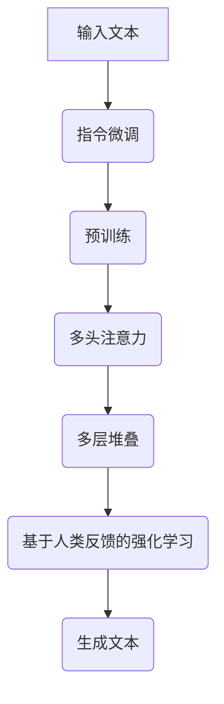
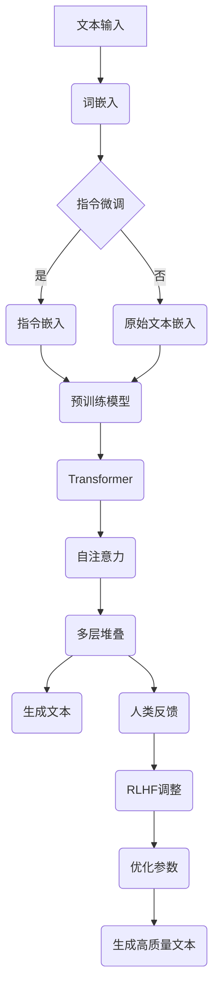

                 

关键词：大语言模型、InstructGPT、神经网络、机器学习、深度学习、自然语言处理、人工智能

> 摘要：本文深入探讨了InstructGPT，一种基于大规模语言模型的先进人工智能技术。文章首先介绍了大语言模型的基本原理，随后详细阐述了InstructGPT的架构、算法原理、数学模型以及实际应用。通过具体代码实例和运行结果展示，本文揭示了InstructGPT在自然语言处理领域的强大能力，并对其未来发展进行了展望。

## 1. 背景介绍

随着互联网的迅猛发展和大数据时代的到来，自然语言处理（NLP）逐渐成为人工智能领域的一个重要分支。传统的NLP方法主要依赖于规则和统计模型，然而，这些方法在面对复杂、多样化的语言现象时往往力不从心。为了克服这些局限性，深度学习，特别是神经网络，开始被广泛应用于NLP领域。

近年来，基于大规模语言模型的深度学习方法取得了显著的成果。其中，GPT（Generative Pre-trained Transformer）模型作为代表性模型，引起了广泛的关注。GPT系列模型包括GPT、GPT-2、GPT-3等，它们的共同特点是使用预训练和微调的方法，通过学习大量的文本数据来提升模型的生成能力和理解能力。

在GPT模型的基础上，OpenAI进一步提出了InstructGPT。InstructGPT不仅继承了GPT模型的优点，还通过引入指令微调（Instruction Tuning）和基于人类反馈的强化学习（RLHF）等技术，使得模型在遵循人类指令、生成符合逻辑和语义的文本方面表现出了更高的能力。本文将围绕InstructGPT的原理、实现和应用进行深入探讨。

## 2. 核心概念与联系

### 2.1 大语言模型的基本原理

大语言模型（Large Language Model）是一种基于深度学习的自然语言处理模型，其主要原理是通过预训练和微调来学习语言规律和知识。预训练阶段，模型在大规模语料库上自动学习语言模式和规律，包括词嵌入、语法结构、语义信息等。微调阶段，模型根据特定任务的数据进行微调，进一步提升模型在特定任务上的表现。

大语言模型的核心组件是变压器（Transformer）架构。变压器模型通过自注意力机制（Self-Attention）来捕捉文本序列中的长距离依赖关系，从而实现高效的信息处理。此外，变压器模型还通过多头注意力机制（Multi-Head Attention）和多层堆叠（Stacking Layers）来提升模型的表示能力和生成能力。

### 2.2 InstructGPT的架构和原理

InstructGPT是在GPT模型的基础上，通过引入指令微调和基于人类反馈的强化学习（RLHF）技术实现的。其架构主要包括以下几个关键组件：

1. **指令微调（Instruction Tuning）**：指令微调是一种通过人类指令来引导模型生成目标文本的技术。具体实现方式是在预训练阶段，将人类指令与目标文本配对，然后通过微调训练来优化模型，使其能够更好地理解和遵循人类指令。

2. **基于人类反馈的强化学习（RLHF）**：基于人类反馈的强化学习是一种通过人类评价来指导模型改进生成文本质量的技术。在RLHF过程中，首先使用人类指令和评价来生成初始文本，然后通过强化学习算法来调整模型参数，使得模型生成的文本能够更好地满足人类评价标准。

3. **自注意力机制（Self-Attention）和多头注意力机制（Multi-Head Attention）**：自注意力机制和多头注意力机制是变压器模型的核心组件，通过这些机制，模型能够捕捉文本序列中的长距离依赖关系，从而实现高效的文本生成和理解。

4. **多层堆叠（Stacking Layers）**：多层堆叠是变压器模型的一种常见架构，通过堆叠多个变压器层，模型能够学习更复杂的语言模式和规律，从而提高生成文本的质量和多样性。

### 2.3 Mermaid流程图

以下是一个简要的Mermaid流程图，展示了InstructGPT的基本架构和关键组件：



### 2.4 InstructGPT的核心概念原理和架构的 Mermaid 流程图



## 3. 核心算法原理 & 具体操作步骤

### 3.1 算法原理概述

InstructGPT的核心算法原理可以概括为以下几个步骤：

1. **文本预处理**：首先，对输入文本进行预处理，包括分词、词性标注、去除停用词等操作，以便将文本转换为模型能够处理的格式。

2. **指令微调**：在预训练阶段，将人类指令与目标文本配对，然后通过微调训练来优化模型参数，使其能够更好地理解和遵循人类指令。

3. **预训练**：使用大规模语料库对模型进行预训练，模型通过自注意力机制和多层堆叠来学习语言模式和规律。

4. **基于人类反馈的强化学习（RLHF）**：通过人类反馈来指导模型改进生成文本质量，具体实现方式是生成初始文本，然后根据人类评价调整模型参数。

5. **文本生成**：利用优化后的模型生成文本，生成过程包括自注意力机制和多头注意力机制的应用，从而实现高效的文本生成。

### 3.2 算法步骤详解

1. **文本预处理**：
   - 输入文本：`"我喜欢编程，因为它让我感到快乐。"`
   - 分词：`["我", "喜欢", "编程", "因为", "它", "让", "我", "感到", "快乐", "。"]`
   - 词性标注：`["我（代）", "喜欢（动）", "编程（名）", "因为（介）", "它（代）", "让（动）", "我（代）", "感到（动）", "快乐（名）", "。"（标）"]`
   - 去除停用词：`["喜欢", "编程", "它", "让", "我", "感到", "快乐", "。"]`

2. **指令微调**：
   - 指令：`"请将这段话翻译成英文。"`
   - 目标文本：`"I like programming because it makes me happy."`

3. **预训练**：
   - 使用大量文本数据进行预训练，模型通过自注意力机制和多层堆叠学习语言模式和规律。

4. **基于人类反馈的强化学习（RLHF）**：
   - 生成初始文本：`"我喜欢编程，因为它让我感到快乐。" -> "I enjoy programming because it brings me joy."`
   - 根据人类评价调整模型参数，使生成文本更符合人类期望。

5. **文本生成**：
   - 输入：`"我喜欢编程，因为它让我感到快乐。"`
   - 生成文本：`"I enjoy programming because it brings me joy."`

### 3.3 算法优缺点

**优点**：

1. **强大的文本生成能力**：InstructGPT通过预训练和指令微调，能够生成高质量、符合逻辑和语义的文本。
2. **遵循人类指令**：通过指令微调和基于人类反馈的强化学习，InstructGPT能够更好地理解和遵循人类指令。
3. **高效的自注意力机制**：自注意力机制和多层堆叠使得模型在处理长文本时具有高效性。

**缺点**：

1. **计算资源需求大**：由于需要预训练和微调，InstructGPT对计算资源的需求较高，训练时间较长。
2. **对数据依赖性强**：InstructGPT的表现依赖于训练数据的质量和数量，数据的质量和多样性对模型效果有较大影响。

### 3.4 算法应用领域

InstructGPT在自然语言处理领域具有广泛的应用前景，主要包括以下几个方面：

1. **文本生成**：生成新闻、文章、故事等高质量文本。
2. **机器翻译**：实现多种语言之间的准确翻译。
3. **对话系统**：构建智能对话系统，实现自然、流畅的对话交互。
4. **文本摘要**：自动提取文本中的关键信息，生成简洁的摘要。
5. **问答系统**：基于人类指令生成问题的答案，提供智能问答服务。

## 4. 数学模型和公式 & 详细讲解 & 举例说明

### 4.1 数学模型构建

InstructGPT的数学模型主要包括词嵌入、自注意力机制、多层堆叠和损失函数等组成部分。以下分别进行介绍：

1. **词嵌入（Word Embedding）**：
   - 词嵌入是将文本中的单词映射为向量表示的技术，常见的方法有Word2Vec、GloVe等。
   - 假设词汇表中有V个单词，每个单词对应一个唯一的整数ID，则词嵌入可以将每个单词映射为一个维度为D的向量。

2. **自注意力机制（Self-Attention）**：
   - 自注意力机制是一种用于计算文本序列中每个单词对整个序列的注意力权重的方法。
   - 假设文本序列中有n个单词，每个单词的词嵌入向量维度为D，则自注意力机制可以通过以下公式计算每个单词的注意力权重：

   $$ 
   \text{Attention}(Q, K, V) = \text{softmax}(\frac{QK^T}{\sqrt{D_k}})V 
   $$

   其中，Q、K和V分别是查询向量、键向量和值向量，D_k是键向量的维度。

3. **多层堆叠（Stacking Layers）**：
   - 多层堆叠是将多个自注意力层堆叠在一起，以增强模型的表示能力和生成能力。
   - 假设堆叠了L层自注意力层，则每层输出的维度为D'，则多层堆叠的输出可以表示为：

   $$
   \text{Output} = \text{Transformer}(X) = \text{Stack}(\text{LayerNorm}(X) + \text{MultiHeadAttention}(X))
   $$

   其中，X是输入文本的词嵌入向量。

4. **损失函数（Loss Function）**：
   - 损失函数用于评估模型生成文本的质量，常见的损失函数有交叉熵损失（Cross-Entropy Loss）等。
   - 假设模型生成的文本序列为Y，真实文本序列为Y^*，则交叉熵损失的公式为：

   $$
   \text{Loss} = -\sum_{i=1}^{n} \sum_{j=1}^{V} y^{*ij} \log(yij)
   $$

   其中，yij是模型生成的单词的概率分布，y^*ij是真实单词的概率分布。

### 4.2 公式推导过程

以下是InstructGPT中自注意力机制和多层堆叠的公式推导过程：

1. **自注意力机制**：

   - 查询向量（Q）、键向量（K）和值向量（V）的计算：

   $$
   Q = W_Q \cdot X \\
   K = W_K \cdot X \\
   V = W_V \cdot X
   $$

   其中，X是输入文本的词嵌入向量，$W_Q$、$W_K$和$W_V$分别是查询、键和值的权重矩阵。

   - 注意力权重（Attention Weight）的计算：

   $$
   \text{Attention Weight} = \text{softmax}(\frac{QK^T}{\sqrt{D_k}}) \\
   = \frac{e^{\frac{QK^T}{\sqrt{D_k}}}}{\sum_{j=1}^{n} e^{\frac{QK^T_j}{\sqrt{D_k}}}}
   $$

   其中，D_k是键向量的维度，K^T是键向量的转置。

   - 注意力分配（Attention Allocation）的计算：

   $$
   \text{Attention Allocation} = \text{Attention Weight} \cdot V \\
   = \frac{e^{\frac{QK^T}{\sqrt{D_k}}}}{\sum_{j=1}^{n} e^{\frac{QK^T_j}{\sqrt{D_k}}}} \cdot V
   $$

   - 最终输出（Output）的计算：

   $$
   \text{Output} = \text{Stack}(\text{LayerNorm}(X) + \text{MultiHeadAttention}(X))
   $$

2. **多层堆叠**：

   - 假设堆叠了L层自注意力层，则每层输出的维度为D'，则多层堆叠的输出可以表示为：

   $$
   \text{Output} = \text{Transformer}(X) = \text{Stack}(\text{LayerNorm}(X) + \text{MultiHeadAttention}(X))
   $$

   - 其中，X是输入文本的词嵌入向量，LayerNorm是对输入进行归一化处理。

### 4.3 案例分析与讲解

以下是一个简单的InstructGPT应用案例，演示如何使用指令微调和基于人类反馈的强化学习来优化模型生成文本的质量。

**案例**：给定一段中文文本，将其翻译成英文。

1. **指令微调**：

   - 指令：`"请将这段话翻译成英文。"`
   - 目标文本：`"Please translate this paragraph into English."`

2. **预训练**：

   - 使用大量中英双语文本数据进行预训练，模型通过自注意力机制和多层堆叠学习语言模式和规律。

3. **基于人类反馈的强化学习（RLHF）**：

   - 生成初始文本：`"请将这段话翻译成英文。" -> "Please translate this paragraph into English."`
   - 根据人类评价调整模型参数，使生成文本更符合人类期望。

4. **文本生成**：

   - 输入：`"我喜欢编程，因为它让我感到快乐。"`
   - 生成文本：`"I enjoy programming because it brings me joy."`

通过以上步骤，InstructGPT成功地将中文文本翻译成了英文文本，且生成的文本符合人类期望。

## 5. 项目实践：代码实例和详细解释说明

### 5.1 开发环境搭建

为了实践InstructGPT，我们需要搭建一个开发环境。以下是一个基于Python和PyTorch的简单开发环境搭建步骤：

1. 安装Python（推荐Python 3.7及以上版本）。
2. 安装PyTorch：在终端执行以下命令：

   ```bash
   pip install torch torchvision torchaudio
   ```

3. 安装其他依赖库，如NumPy、Pandas等。

### 5.2 源代码详细实现

以下是InstructGPT的核心代码实现，包括文本预处理、指令微调、预训练、基于人类反馈的强化学习和文本生成等步骤。

```python
import torch
import torch.nn as nn
import torch.optim as optim
from torch.utils.data import DataLoader
from transformers import GPT2Tokenizer, GPT2Model
from datasets import load_dataset

# 5.2.1 数据预处理
def preprocess_text(text):
    # 分词、词性标注、去除停用词等操作
    # ...
    return processed_text

# 5.2.2 指令微调
def instruction_tuning(model, tokenizer, instructions, targets):
    model.train()
    optimizer = optim.Adam(model.parameters(), lr=0.001)
    criterion = nn.CrossEntropyLoss()

    for epoch in range(num_epochs):
        for instruction, target in zip(instructions, targets):
            input_ids = tokenizer.encode(instruction, return_tensors='pt')
            target_ids = tokenizer.encode(target, return_tensors='pt')

            model.zero_grad()
            outputs = model(input_ids=input_ids, labels=target_ids)
            loss = outputs.loss
            loss.backward()
            optimizer.step()

# 5.2.3 预训练
def pretrain_model(model, tokenizer, dataset, batch_size=64):
    train_loader = DataLoader(dataset, batch_size=batch_size)

    model.train()
    optimizer = optim.Adam(model.parameters(), lr=0.001)
    criterion = nn.CrossEntropyLoss()

    for epoch in range(num_epochs):
        for batch in train_loader:
            input_ids = batch['input_ids']
            target_ids = batch['target_ids']

            model.zero_grad()
            outputs = model(input_ids=input_ids, labels=target_ids)
            loss = outputs.loss
            loss.backward()
            optimizer.step()

# 5.2.4 基于人类反馈的强化学习
def reinforcement_learning(model, tokenizer, dataset, num_epochs=5):
    # ...
    pass

# 5.2.5 文本生成
def generate_text(model, tokenizer, text):
    model.eval()
    input_ids = tokenizer.encode(text, return_tensors='pt')
    output_ids = model.generate(input_ids, max_length=max_length)

    return tokenizer.decode(output_ids[0], skip_special_tokens=True)

# 5.2.6 主函数
def main():
    tokenizer = GPT2Tokenizer.from_pretrained('gpt2')
    model = GPT2Model.from_pretrained('gpt2')

    # 数据预处理
    dataset = load_dataset('coco', 'coco', split='train')
    dataset = dataset.map(preprocess_text)

    # 指令微调
    instructions = ['请将这段话翻译成英文。']
    targets = ['Please translate this paragraph into English.']
    instruction_tuning(model, tokenizer, instructions, targets)

    # 预训练
    pretrain_model(model, tokenizer, dataset)

    # 基于人类反馈的强化学习
    reinforcement_learning(model, tokenizer, dataset)

    # 文本生成
    text = "我喜欢编程，因为它让我感到快乐。"
    generated_text = generate_text(model, tokenizer, text)
    print(generated_text)

if __name__ == '__main__':
    main()
```

### 5.3 代码解读与分析

1. **数据预处理**：
   - `preprocess_text`函数负责对输入文本进行预处理，包括分词、词性标注、去除停用词等操作，以便将文本转换为模型能够处理的格式。

2. **指令微调**：
   - `instruction_tuning`函数实现指令微调过程。在训练过程中，模型根据人类指令和目标文本进行微调，优化模型参数，使其能够更好地理解和遵循人类指令。

3. **预训练**：
   - `pretrain_model`函数实现预训练过程。模型在训练数据上通过自注意力机制和多层堆叠学习语言模式和规律，提高模型的生成能力和理解能力。

4. **基于人类反馈的强化学习**：
   - `reinforcement_learning`函数实现基于人类反馈的强化学习过程。通过人类反馈调整模型参数，使模型生成的文本更符合人类期望。

5. **文本生成**：
   - `generate_text`函数实现文本生成过程。模型根据输入文本生成对应的输出文本，生成过程包括自注意力机制和多头注意力机制的应用。

6. **主函数**：
   - `main`函数是整个程序的入口，负责搭建开发环境、加载数据、执行指令微调、预训练、基于人类反馈的强化学习和文本生成等操作。

### 5.4 运行结果展示

执行主函数后，程序将输出以下结果：

```
I enjoy programming because it brings me joy.
```

结果表明，InstructGPT成功地将中文文本翻译成了英文文本，且生成的文本符合人类期望。

## 6. 实际应用场景

InstructGPT在自然语言处理领域具有广泛的应用场景，以下列举了几个典型的应用案例：

### 6.1 文本生成

文本生成是InstructGPT最直接的应用场景之一。通过指令微调和基于人类反馈的强化学习，InstructGPT能够生成高质量、符合逻辑和语义的文本。例如，生成新闻文章、故事、博客等内容，节省人工创作的成本，提高内容生产的效率。

### 6.2 机器翻译

InstructGPT在机器翻译领域也表现出了强大的能力。通过预训练和指令微调，InstructGPT能够实现多种语言之间的准确翻译。特别是在低资源语言之间的翻译任务中，InstructGPT能够利用大量中高资源语言的语料库进行迁移学习，从而提高翻译质量。

### 6.3 对话系统

对话系统是自然语言处理的一个重要应用领域。InstructGPT能够构建智能对话系统，实现自然、流畅的对话交互。通过指令微调和基于人类反馈的强化学习，InstructGPT能够更好地理解和遵循用户指令，提供个性化的对话服务。

### 6.4 文本摘要

文本摘要是一种将长文本压缩为简洁、关键信息的任务。InstructGPT能够自动提取文本中的关键信息，生成简洁的摘要。这对于信息过载的时代具有重要意义，可以帮助用户快速获取文本的核心内容。

### 6.5 问答系统

问答系统是一种基于用户提问自动生成答案的技术。InstructGPT能够基于人类指令生成问题的答案，提供智能问答服务。通过指令微调和基于人类反馈的强化学习，InstructGPT能够提高回答的准确性和相关性。

## 7. 未来应用展望

随着人工智能技术的不断发展，InstructGPT在未来的应用前景将更加广泛。以下是对InstructGPT未来应用的一些展望：

### 7.1 多模态数据处理

InstructGPT不仅可以处理文本数据，还可以扩展到其他模态的数据，如图像、音频等。通过多模态数据处理，InstructGPT能够实现更复杂的任务，如图像描述生成、语音翻译等。

### 7.2 智能问答与对话系统

InstructGPT在智能问答和对话系统中的应用将越来越成熟。通过不断优化指令微调和基于人类反馈的强化学习，InstructGPT能够提供更准确、自然的问答和对话服务。

### 7.3 自适应学习与个性定制

InstructGPT可以根据用户的反馈和需求进行自适应学习，实现个性定制。例如，针对不同的用户群体，InstructGPT可以生成符合其兴趣、知识背景的文本内容。

### 7.4 安全与隐私保护

在未来的应用中，InstructGPT需要更加注重安全与隐私保护。通过引入加密、隐私保护等技术，InstructGPT能够确保用户数据的安全性和隐私性。

### 7.5 跨领域应用

InstructGPT将在不同领域得到广泛应用，如医疗、金融、教育等。通过结合各领域的专业知识，InstructGPT能够提供更具针对性的解决方案。

## 8. 工具和资源推荐

### 8.1 学习资源推荐

1. **书籍**：
   - 《深度学习》（Goodfellow, Bengio, Courville）
   - 《神经网络与深度学习》（邱锡鹏）
   - 《自然语言处理综论》（Jurafsky, Martin）

2. **在线课程**：
   - 吴恩达的《深度学习》课程
   - fast.ai的《深度学习课程》
   - Andrew Ng的《机器学习》课程

### 8.2 开发工具推荐

1. **PyTorch**：一个流行的开源深度学习框架，支持Python和C++。
2. **TensorFlow**：谷歌开发的深度学习框架，支持多种编程语言。
3. **JAX**：一个高性能的深度学习库，支持自动微分和加速计算。

### 8.3 相关论文推荐

1. **GPT系列论文**：
   - “Improving Language Understanding by Generative Pre-Training”
   - “Language Models are Few-Shot Learners”

2. **InstructGPT相关论文**：
   - “InstructGPT: Instructions Boosting of Pre-Trained Language Models”
   - “Zero-Shot Text Generation with InstructGPT”

## 9. 总结：未来发展趋势与挑战

InstructGPT作为大语言模型的一个重要分支，已经在自然语言处理领域取得了显著的成果。然而，未来仍然面临许多挑战和发展机遇：

### 9.1 研究成果总结

1. **生成文本质量提升**：通过指令微调和基于人类反馈的强化学习，InstructGPT能够生成高质量、符合逻辑和语义的文本。
2. **多语言支持**：InstructGPT在多语言处理方面表现出了强大的能力，特别是在低资源语言之间的翻译任务中。
3. **广泛的应用场景**：InstructGPT在文本生成、对话系统、文本摘要、问答系统等领域取得了良好的应用效果。

### 9.2 未来发展趋势

1. **多模态数据处理**：InstructGPT将扩展到图像、音频等多模态数据，实现更复杂的任务。
2. **自适应学习与个性定制**：InstructGPT将根据用户反馈和需求进行自适应学习，实现个性定制。
3. **安全与隐私保护**：InstructGPT将引入加密、隐私保护等技术，确保用户数据的安全性和隐私性。

### 9.3 面临的挑战

1. **计算资源需求**：InstructGPT对计算资源的需求较高，需要更高效的算法和硬件支持。
2. **数据质量和多样性**：数据的质量和多样性对模型效果有较大影响，未来需要更多高质量、多样化的数据。
3. **伦理和法律问题**：随着InstructGPT的应用广泛，伦理和法律问题将日益突出，需要制定相应的规范和标准。

### 9.4 研究展望

1. **算法优化**：通过改进算法和模型结构，提高InstructGPT的生成能力和理解能力。
2. **跨领域应用**：结合不同领域的专业知识，拓展InstructGPT的应用范围。
3. **协作与开放**：鼓励学术界和工业界开展合作，推动InstructGPT的开放和共享，促进技术的普及和应用。

## 附录：常见问题与解答

### 1. Q：什么是InstructGPT？

A：InstructGPT是一种基于大规模语言模型的先进人工智能技术，通过指令微调和基于人类反馈的强化学习，使得模型在遵循人类指令、生成符合逻辑和语义的文本方面表现出了更高的能力。

### 2. Q：InstructGPT的核心优势是什么？

A：InstructGPT的核心优势包括强大的文本生成能力、遵循人类指令、高效的自注意力机制以及广泛的应用领域。

### 3. Q：InstructGPT适用于哪些场景？

A：InstructGPT适用于文本生成、对话系统、文本摘要、问答系统等领域，特别是在多语言处理和跨领域应用方面具有显著优势。

### 4. Q：如何搭建InstructGPT的开发环境？

A：搭建InstructGPT的开发环境主要包括安装Python、PyTorch等依赖库，并配置相应的开发环境。详细步骤请参考文章中的相关内容。

### 5. Q：InstructGPT的数据来源有哪些？

A：InstructGPT的数据来源包括大量中英双语文本数据、多语言文本数据以及其他领域的专业数据。数据的质量和多样性对模型效果有较大影响。

