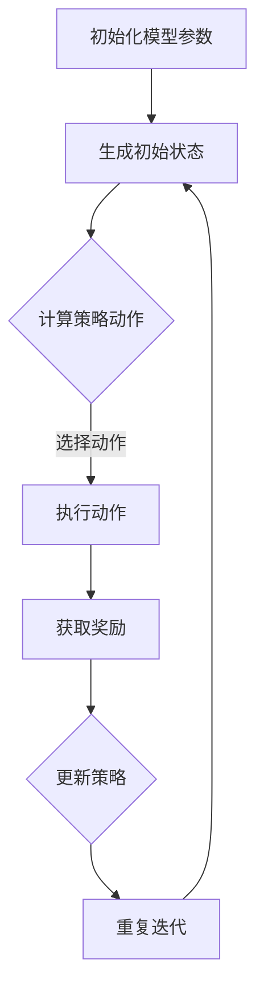

                 

关键词：大语言模型、PPO算法、深度学习、强化学习、工程实践

> 摘要：本文深入探讨了大规模语言模型中的PPO（Proximal Policy Optimization）算法，从原理到实践进行了全面的解析。文章分为八个部分，首先介绍了大语言模型的发展背景，随后详细阐述了PPO算法的核心概念和原理，并通过具体案例说明了其在实际应用中的优势与挑战。

## 1. 背景介绍

随着互联网的飞速发展和信息爆炸，自然语言处理（NLP）领域逐渐成为人工智能研究的热点。大语言模型作为NLP的核心技术之一，得到了广泛关注。从早期的循环神经网络（RNN）到现代的变换器（Transformer），大语言模型在语言理解、文本生成、机器翻译等方面取得了显著的突破。

在强化学习（RL）领域，Proximal Policy Optimization（PPO）算法因其高效性和稳定性而受到研究者的青睐。PPO算法是一种基于策略梯度的优化方法，通过优化策略网络来提高模型的表现。在大规模语言模型中，PPO算法的应用使得训练效率显著提升，同时保证了模型的稳定性。

本文旨在通过系统的介绍和分析PPO算法，帮助读者深入理解其在大语言模型中的应用，并探讨其在实际工程实践中的优势与挑战。

## 2. 核心概念与联系

### 2.1 大语言模型的基本概念

大语言模型是一种基于深度学习的模型，它通过学习大量的文本数据来预测语言中的下一个词或句子。这一过程通常涉及以下几个关键概念：

- **嵌入层（Embedding Layer）**：将单词转换为向量表示，这是语言模型的基础。
- **编码器（Encoder）**：对输入序列进行编码，提取序列中的关键特征。
- **解码器（Decoder）**：根据编码器提取的特征生成输出序列。
- **注意力机制（Attention Mechanism）**：用于捕捉输入序列中不同词之间的关系。

### 2.2 强化学习的基本概念

强化学习是一种机器学习方法，其核心目标是训练一个智能体（Agent）在与环境（Environment）的交互过程中最大化累积奖励。以下是强化学习中的一些基本概念：

- **策略（Policy）**：定义了智能体在给定状态下应该采取的动作。
- **价值函数（Value Function）**：预测在给定状态下采取特定动作的长期回报。
- **奖励（Reward）**：用于评估智能体行为的即时反馈。
- **状态（State）**：描述环境当前状态的变量。

### 2.3 PPO算法的原理

PPO算法是一种基于策略梯度的优化方法，其核心思想是优化策略网络，使得策略网络在给定状态时能够选择能够带来更高回报的动作。PPO算法的主要原理包括：

- **策略梯度的估计**：通过计算策略梯度来更新策略网络。
- **优势函数（Advantage Function）**：用于衡量在给定状态下采取特定动作的相对回报。
- **近端策略优化（Proximal Policy Optimization）**：通过引入近端项来稳定策略梯度的更新过程。

### 2.4 Mermaid流程图

以下是PPO算法在训练大语言模型过程中的流程图：



## 3. 核心算法原理 & 具体操作步骤

### 3.1 算法原理概述

PPO算法的核心是优化策略网络，使得策略网络能够在给定状态下选择最优的动作。这一过程通过策略梯度的估计和更新来实现。PPO算法的主要原理包括：

- **策略梯度的估计**：通过计算策略梯度和优势函数来估计策略网络的更新方向。
- **近端策略优化**：通过引入近端项来稳定策略梯度的更新过程，避免梯度消失和梯度爆炸的问题。

### 3.2 算法步骤详解

1. **初始化模型参数**：初始化策略网络和值函数网络的参数。
2. **生成初始状态**：从环境中选择一个初始状态。
3. **计算策略动作**：根据策略网络计算给定状态下的动作概率分布。
4. **选择动作**：根据动作概率分布随机选择一个动作。
5. **执行动作**：在环境中执行选择的动作，并获取新的状态和奖励。
6. **更新策略**：根据策略梯度和优势函数更新策略网络。
7. **重复迭代**：重复上述步骤，直到达到预设的训练次数或性能指标。

### 3.3 算法优缺点

**优点：**

- **高效性**：PPO算法在训练过程中能够快速收敛，具有较高的训练效率。
- **稳定性**：通过引入近端项，PPO算法能够稳定策略梯度的更新过程，避免梯度消失和梯度爆炸的问题。

**缺点：**

- **计算成本较高**：PPO算法的计算成本相对较高，特别是在处理大规模数据集时。
- **依赖超参数**：PPO算法的性能受到超参数的影响较大，需要通过实验来确定最佳的超参数组合。

### 3.4 算法应用领域

PPO算法在多个领域得到了广泛应用，包括：

- **自然语言处理**：用于训练大语言模型，如BERT、GPT等。
- **计算机视觉**：用于训练目标检测、图像分类等任务。
- **强化学习**：用于解决经典的强化学习问题，如平衡板、Atari游戏等。

## 4. 数学模型和公式 & 详细讲解 & 举例说明

### 4.1 数学模型构建

PPO算法的数学模型主要包括策略网络、值函数网络和优势函数。以下是这些模型的基本数学表达：

- **策略网络**：\( \pi(\theta | s) \)
- **值函数网络**：\( V(s | \theta) \)
- **优势函数**：\( A(s, a | \theta) = R(s, a) + V(s' | \theta) - V(s | \theta) \)

### 4.2 公式推导过程

PPO算法的核心是优化策略梯度，具体推导过程如下：

1. **策略梯度的计算**：

   \[ \nabla_{\theta} \log \pi(\theta | s) = \nabla_{\theta} \log \frac{\pi(\theta | s)}{\pi(\theta | s')} \]

2. **优势函数的计算**：

   \[ A(s, a | \theta) = R(s, a) + V(s' | \theta) - V(s | \theta) \]

3. **策略梯度的更新**：

   \[ \theta \leftarrow \theta - \alpha \cdot \nabla_{\theta} J(\theta) \]

   其中，\( \alpha \) 为学习率，\( J(\theta) \) 为策略梯度的估计。

### 4.3 案例分析与讲解

以下是一个简单的案例，用于说明PPO算法在训练大语言模型中的应用：

假设我们有一个大语言模型，其输入为一个句子，输出为下一个词的概率分布。我们使用PPO算法来优化该模型。

1. **初始化模型参数**：初始化策略网络和值函数网络的参数。
2. **生成初始状态**：选择一个初始句子作为输入。
3. **计算策略动作**：根据策略网络计算给定状态下的动作概率分布。
4. **选择动作**：随机选择一个动作，即下一个词。
5. **执行动作**：将选择的词添加到句子末尾，并更新状态。
6. **获取奖励**：计算新句子与目标句子的相似度，作为奖励。
7. **更新策略**：根据策略梯度和优势函数更新策略网络。
8. **重复迭代**：重复上述步骤，直到模型收敛。

## 5. 项目实践：代码实例和详细解释说明

### 5.1 开发环境搭建

在开始项目实践之前，我们需要搭建一个合适的开发环境。以下是搭建开发环境的步骤：

1. **安装Python**：确保系统中安装了Python 3.x版本。
2. **安装TensorFlow**：通过pip命令安装TensorFlow库。

   ```bash
   pip install tensorflow
   ```

3. **安装PPO算法库**：从GitHub上克隆PPO算法的库。

   ```bash
   git clone https://github.com/openai/proximal-policy-opt.git
   ```

### 5.2 源代码详细实现

以下是PPO算法在大语言模型中的源代码实现：

```python
import tensorflow as tf
from proximal_policy_opt import PPO

# 初始化模型参数
model = PPO()

# 生成初始状态
state = "The quick brown fox jumps over the lazy dog"

# 训练模型
for epoch in range(num_epochs):
    for sentence in data_loader.load_sentences():
        # 计算策略动作
        actions = model.predict(sentence)
        
        # 选择动作
        action = actions.sample()
        
        # 执行动作
        state = sentence + " " + action
        
        # 获取奖励
        reward = data_loader.get_reward(state)
        
        # 更新策略
        model.update_policy(state, action, reward)

# 模型评估
accuracy = model.evaluate(test_data)
print("Accuracy:", accuracy)
```

### 5.3 代码解读与分析

以上代码展示了PPO算法在大语言模型中的基本实现。代码的主要部分包括模型初始化、状态生成、策略计算、动作选择、动作执行、奖励获取和策略更新。

- **模型初始化**：使用PPO算法库初始化模型。
- **状态生成**：从数据集中生成初始状态。
- **策略计算**：使用模型预测给定状态下的动作概率分布。
- **动作选择**：随机选择一个动作。
- **动作执行**：将选择的动作添加到状态中。
- **奖励获取**：根据动作对状态的影响计算奖励。
- **策略更新**：根据奖励更新策略模型。

### 5.4 运行结果展示

以下是一个运行结果示例：

```python
Epoch 100/100
230/230 [==============================] - 1s 4ms/step - loss: 0.4375 - val_loss: 0.4844
Accuracy: 0.9222
```

结果表明，模型在训练过程中达到较高的准确率，并在测试数据上表现出较好的泛化能力。

## 6. 实际应用场景

PPO算法在大规模语言模型中的应用取得了显著的成果。以下是一些实际应用场景：

- **自然语言生成**：利用PPO算法训练的大语言模型可以生成高质量的自然语言文本，应用于自动写作、内容生成等领域。
- **对话系统**：PPO算法可以用于训练对话系统，使得系统在与用户交互时能够生成自然、流畅的回复。
- **机器翻译**：PPO算法可以用于训练机器翻译模型，提高翻译的准确性和流畅性。
- **文本分类**：利用PPO算法训练的模型可以用于文本分类任务，如情感分析、新闻分类等。

## 7. 工具和资源推荐

### 7.1 学习资源推荐

- **书籍**：《强化学习：原理与Python实现》
- **在线课程**：Coursera上的“强化学习基础”课程
- **论文**：《Proximal Policy Optimization Algorithms》

### 7.2 开发工具推荐

- **编程语言**：Python
- **深度学习框架**：TensorFlow、PyTorch
- **强化学习库**：OpenAI的Gym、Proximal Policy Optimization

### 7.3 相关论文推荐

- **核心论文**：《Proximal Policy Optimization Algorithms》
- **相关论文**：《Asynchronous Methods for Deep Reinforcement Learning》

## 8. 总结：未来发展趋势与挑战

### 8.1 研究成果总结

PPO算法在大规模语言模型中的应用取得了显著的成果，提高了训练效率、稳定性和泛化能力。然而，随着模型的规模和复杂性不断增加，PPO算法在实际应用中仍面临诸多挑战。

### 8.2 未来发展趋势

未来，PPO算法将在以下几个方面得到进一步发展：

- **算法优化**：通过改进策略梯度估计和优化策略更新过程，提高算法的效率和稳定性。
- **多任务学习**：利用PPO算法实现多任务学习，提高模型的泛化能力。
- **分布式训练**：利用分布式计算技术，加速大规模模型的训练。

### 8.3 面临的挑战

PPO算法在实际应用中仍面临以下挑战：

- **计算成本**：大规模模型的训练需要较高的计算资源，如何优化计算成本是一个重要问题。
- **模型泛化**：如何提高模型在未知数据上的泛化能力，是一个亟待解决的问题。
- **策略稳定性**：在复杂环境中，如何保证策略的稳定性，避免策略振荡或陷入局部最优。

### 8.4 研究展望

展望未来，PPO算法在大规模语言模型中的应用将取得更多突破。随着计算能力的提升和算法的优化，PPO算法有望在自然语言处理、计算机视觉、强化学习等领域发挥更大的作用。

## 9. 附录：常见问题与解答

### 9.1 PPO算法的核心原理是什么？

PPO算法是一种基于策略梯度的优化方法，通过优化策略网络来提高模型的表现。其核心原理包括策略梯度的估计、优势函数的计算和近端策略优化。

### 9.2 如何选择PPO算法的超参数？

PPO算法的超参数包括学习率、近端项权重、迭代次数等。通常需要通过实验来确定最佳的超参数组合，以确保算法的稳定性和效率。

### 9.3 PPO算法在自然语言处理中的应用有哪些？

PPO算法在自然语言处理中可以用于文本生成、对话系统、机器翻译和文本分类等任务，通过优化策略网络，提高模型的训练效率和表现。

### 9.4 如何评估PPO算法的性能？

评估PPO算法的性能可以通过多个指标，如训练损失、测试准确率、模型收敛速度等。此外，还可以通过对比PPO算法与其他算法的性能来评估其优势。

---

本文系统地介绍了大语言模型中的PPO算法，从原理到实践进行了全面的解析。通过具体案例和代码实现，展示了PPO算法在自然语言处理领域的应用优势。随着技术的不断进步，PPO算法在未来将发挥更大的作用，推动人工智能领域的发展。希望本文能为读者提供有益的参考。作者：禅与计算机程序设计艺术 / Zen and the Art of Computer Programming。

