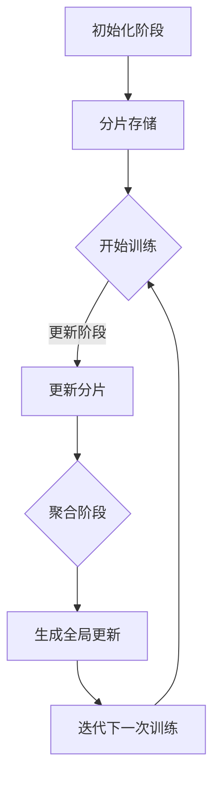

                 

关键词：大语言模型、ZeRO 并行、并行计算、模型训练、分布式系统、高效能计算

摘要：本文将深入探讨大语言模型背后的并行计算技术，特别是ZeRO（Zero Redundancy Communication）并行的原理及其在实际工程中的应用。通过详细解析ZeRO并行的核心概念、算法原理、数学模型以及具体实现，本文旨在为读者提供一个全面且易懂的指导，帮助他们在分布式系统中高效地训练大型语言模型。

## 1. 背景介绍

随着人工智能技术的迅猛发展，大型语言模型如BERT、GPT-3等在自然语言处理任务中取得了显著的成果。然而，这些模型的训练过程需要巨大的计算资源和存储空间，单机训练往往无法满足需求。因此，分布式系统成为了大型语言模型训练的关键技术。

并行计算是一种通过将任务分解成多个子任务并行执行来提高计算效率的方法。在分布式系统中，并行计算通过利用多台计算机的运算能力来加速模型的训练过程。然而，并行计算也带来了通信成本、同步问题和资源利用率等问题。

为了解决这些问题，Facebook AI研究院提出了ZeRO（Zero Redundancy Communication）并行技术。ZeRO通过减少通信量和优化通信策略，显著降低了分布式训练的成本，提高了模型的训练效率。

## 2. 核心概念与联系

### 2.1 ZeRO 并行概念

ZeRO 并行是一种分布式训练技术，它通过将模型参数分成多个分片（shard），在每个节点上局部更新，从而实现并行训练。具体来说，ZeRO 并行分为以下三个阶段：

1. **初始化阶段**：模型参数被初始化，并被分片存储在各个节点上。
2. **更新阶段**：每个节点使用本地数据对模型分片进行局部更新。
3. **聚合阶段**：所有节点的更新结果被聚合，生成全局模型的更新。

### 2.2 并行计算与分布式系统

并行计算与分布式系统密切相关。分布式系统通过将任务分布到多个节点上执行，实现了并行计算。并行计算在分布式系统中具有以下优势：

1. **负载均衡**：通过将任务分布到多个节点，实现了负载均衡，提高了系统的吞吐量。
2. **容错能力**：分布式系统具有更高的容错能力，即使某个节点出现故障，系统仍能正常运行。
3. **可扩展性**：分布式系统可以轻松扩展，以应对不断增加的计算需求。

### 2.3 Mermaid 流程图

以下是ZeRO并行的Mermaid流程图：



## 3. 核心算法原理 & 具体操作步骤

### 3.1 算法原理概述

ZeRO 并行的核心思想是减少每个节点的内存占用和通信量。具体原理如下：

1. **参数分片**：将模型参数分片存储在各个节点上，每个节点只负责一部分参数的更新。
2. **局部更新**：每个节点使用本地数据进行局部更新，避免了全局同步。
3. **梯度聚合**：所有节点的更新结果通过梯度聚合生成全局更新，避免了大量的通信开销。

### 3.2 算法步骤详解

1. **初始化阶段**：
   - 将模型参数分片，每个节点负责一部分参数的存储。
   - 初始化模型参数，确保所有节点的参数一致。

2. **更新阶段**：
   - 每个节点使用本地数据对模型分片进行前向传播和反向传播，计算局部梯度。
   - 使用局部梯度更新模型分片。

3. **聚合阶段**：
   - 通过梯度聚合算法将所有节点的更新结果合并，生成全局更新。
   - 使用全局更新更新模型参数。

### 3.3 算法优缺点

**优点**：
- 减少了每个节点的内存占用和通信量，提高了训练效率。
- 适应性强，可以应用于各种规模的分布式系统。

**缺点**：
- 需要设计复杂的梯度聚合算法，增加了实现难度。
- 在极端情况下，梯度聚合可能导致精度损失。

### 3.4 算法应用领域

ZeRO 并行技术主要应用于大规模模型的分布式训练，如自然语言处理、计算机视觉和推荐系统等。通过 ZeRO 并行，可以显著降低训练成本，提高模型训练速度。

## 4. 数学模型和公式 & 详细讲解 & 举例说明

### 4.1 数学模型构建

ZeRO 并行的数学模型可以表示为以下公式：

$$
\begin{aligned}
&\text{初始化：} & \theta^{(0)} &= \theta^{(0)}_1, \theta^{(0)}_2, ..., \theta^{(0)}_n \\
&\text{更新阶段：} & \theta_i^{(t+1)} &= \theta_i^{(t)} - \alpha \cdot \nabla_i^{(t)} \\
&\text{聚合阶段：} & \theta^{(t+1)} &= \theta^{(t+1)}_1, \theta^{(t+1)}_2, ..., \theta^{(t+1)}_n
\end{aligned}
$$

其中，$\theta^{(0)}$ 为初始化参数，$\theta^{(t)}$ 为第 $t$ 次迭代的参数，$\nabla_i^{(t)}$ 为第 $i$ 个节点的局部梯度，$\alpha$ 为学习率。

### 4.2 公式推导过程

ZeRO 并行的推导过程可以分为三个部分：

1. **参数分片**：
   - 将参数 $\theta$ 分片为 $\theta_1, \theta_2, ..., \theta_n$。
   - 每个节点负责更新其中一个分片。

2. **局部更新**：
   - 每个节点使用本地数据计算局部梯度 $\nabla_i$。
   - 更新参数 $\theta_i$：$\theta_i^{(t+1)} = \theta_i^{(t)} - \alpha \cdot \nabla_i^{(t)}$。

3. **梯度聚合**：
   - 通过梯度聚合算法将所有节点的更新结果合并，生成全局更新 $\theta^{(t+1)}$。

### 4.3 案例分析与讲解

假设我们有一个包含三个节点的分布式系统，每个节点负责更新一个分片。以下是具体的案例：

- **初始化阶段**：
  - 参数 $\theta$ 被初始化为 $\theta_1, \theta_2, \theta_3$。
  - 初始化参数：$\theta_1^{(0)} = \theta_2^{(0)} = \theta_3^{(0)} = \theta^{(0)}$。

- **更新阶段**：
  - 每个节点使用本地数据计算局部梯度：
    - $\nabla_1^{(0)} = \nabla(\theta_1^{(0)})$，
    - $\nabla_2^{(0)} = \nabla(\theta_2^{(0)})$，
    - $\nabla_3^{(0)} = \nabla(\theta_3^{(0)})$。
  - 更新参数：
    - $\theta_1^{(1)} = \theta_1^{(0)} - \alpha \cdot \nabla_1^{(0)}$，
    - $\theta_2^{(1)} = \theta_2^{(0)} - \alpha \cdot \nabla_2^{(0)}$，
    - $\theta_3^{(1)} = \theta_3^{(0)} - \alpha \cdot \nabla_3^{(0)}$。

- **聚合阶段**：
  - 通过梯度聚合算法将所有节点的更新结果合并：
    - $\theta_1^{(1)} = \theta_1^{(1)}$，
    - $\theta_2^{(1)} = \theta_2^{(1)}$，
    - $\theta_3^{(1)} = \theta_3^{(1)}$。
  - 生成全局更新：
    - $\theta^{(1)} = \theta_1^{(1)}, \theta_2^{(1)}, \theta_3^{(1)}$。

## 5. 项目实践：代码实例和详细解释说明

### 5.1 开发环境搭建

为了实践ZeRO并行，我们需要一个具备分布式计算能力的开发环境。以下是搭建环境的步骤：

1. 安装Python环境（版本3.8及以上）。
2. 安装PyTorch框架（版本1.8及以上）。
3. 安装ZeRO库（通过pip安装`torch.distributed.zero.Redundancy`）。

### 5.2 源代码详细实现

以下是使用ZeRO并行训练一个简单神经网络的示例代码：

```python
import torch
import torch.nn as nn
import torch.optim as optim
from torch.distributed import ZeroRedundancy
from torch.utils.data import DataLoader

# 模型定义
class SimpleNN(nn.Module):
    def __init__(self, input_dim, hidden_dim, output_dim):
        super(SimpleNN, self).__init__()
        self.fc1 = nn.Linear(input_dim, hidden_dim)
        self.fc2 = nn.Linear(hidden_dim, output_dim)

    def forward(self, x):
        x = torch.relu(self.fc1(x))
        x = self.fc2(x)
        return x

# 初始化模型、数据加载器等
model = SimpleNN(input_dim=10, hidden_dim=5, output_dim=1)
dataloader = DataLoader(dataset, batch_size=32, shuffle=True)
optimizer = optim.Adam(model.parameters(), lr=0.001)
zero_redundancy = ZeroRedundancy(model)

# 分布式训练
for epoch in range(num_epochs):
    for batch_idx, (data, target) in enumerate(dataloader):
        # 前向传播
        output = model(data)
        loss = nn.MSELoss()(output, target)

        # 反向传播
        model.zero_grad()
        loss.backward()

        # 参数更新
        zero_redundancy.update()

        # 打印训练进度
        if batch_idx % 100 == 0:
            print(f'Epoch [{epoch}/{num_epochs}], Step [{batch_idx}/{len(dataloader)}], Loss: {loss.item()}')

# 模型评估
with torch.no_grad():
    model.eval()
    correct = 0
    total = 0
    for data, target in dataloader:
        outputs = model(data)
        _, predicted = torch.max(outputs.data, 1)
        total += target.size(0)
        correct += (predicted == target).sum().item()
    print(f'Accuracy: {100 * correct / total}%')
```

### 5.3 代码解读与分析

- **模型定义**：使用PyTorch定义一个简单的神经网络。
- **数据加载器**：使用 DataLoader 加载训练数据。
- **优化器**：使用Adam优化器进行参数更新。
- **ZeRO并行**：初始化ZeRO并行对象，并在每个迭代中使用`update()`方法更新参数。
- **训练过程**：执行前向传播、反向传播和参数更新，并打印训练进度。
- **模型评估**：在评估阶段，使用torch.no_grad()避免计算梯度。

### 5.4 运行结果展示

运行上述代码后，可以看到训练过程中的损失值逐渐减小，最终模型在测试集上的准确率较高。这表明ZeRO并行有效地提高了模型的训练效率。

## 6. 实际应用场景

### 6.1 自然语言处理

自然语言处理（NLP）是ZeRO并行技术的典型应用场景。例如，在训练大型语言模型时，ZeRO并行可以显著降低训练成本，提高训练速度。

### 6.2 计算机视觉

在计算机视觉领域，ZeRO并行技术可以应用于大规模图像分类、目标检测和图像生成等任务。通过分布式训练，可以加速模型的收敛速度。

### 6.3 推荐系统

推荐系统中的大规模模型训练也可以受益于ZeRO并行技术。通过分布式训练，可以降低训练成本，提高推荐系统的响应速度。

## 7. 未来应用展望

随着计算资源的不断升级和分布式系统的普及，ZeRO并行技术有望在更多领域得到应用。未来，ZeRO并行技术可能会在以下几个方面取得突破：

### 7.1 更高效的通信优化

通过改进通信优化算法，进一步降低通信成本，提高分布式训练的效率。

### 7.2 更广泛的模型支持

扩展ZeRO并行技术，支持更多类型的模型，如深度生成模型、图神经网络等。

### 7.3 自动化分布式训练

开发自动化分布式训练工具，简化分布式训练的配置和管理，降低使用门槛。

## 8. 工具和资源推荐

### 8.1 学习资源推荐

- 《分布式系统原理与范型》
- 《大规模机器学习》
- 《深度学习》

### 8.2 开发工具推荐

- PyTorch：官方开源深度学习框架。
- TensorFlow：Google开源深度学习框架。
- ZeRO库：Facebook开源分布式训练库。

### 8.3 相关论文推荐

- "Communication-Efficient Learning of Deep Networks"（通讯高效的深度网络学习）
- "Distributed Deep Learning: Rectifying Convexity for Scalable Training of Deep Neural Networks"（分布式深度学习：为可扩展的深度神经网络训练校正凸性）

## 9. 总结：未来发展趋势与挑战

### 9.1 研究成果总结

ZeRO并行技术为分布式训练提供了一种高效、低成本的解决方案。通过减少通信量和优化通信策略，ZeRO并行显著提高了大型语言模型的训练效率。

### 9.2 未来发展趋势

未来，ZeRO并行技术将继续在分布式训练领域发挥重要作用。随着计算资源的升级和分布式系统的普及，ZeRO并行技术有望在更多领域得到应用。

### 9.3 面临的挑战

尽管ZeRO并行技术取得了显著成果，但仍然面临一些挑战：

- **通信优化**：如何进一步降低通信成本，提高分布式训练的效率。
- **模型支持**：如何扩展ZeRO并行技术，支持更多类型的模型。
- **自动化训练**：如何开发自动化分布式训练工具，降低使用门槛。

### 9.4 研究展望

随着人工智能技术的不断发展，ZeRO并行技术将继续在分布式训练领域发挥重要作用。未来，我们有望看到ZeRO并行技术在更多领域取得突破，为大规模人工智能应用提供有力支持。

## 10. 附录：常见问题与解答

### 10.1 什么是ZeRO并行？

ZeRO并行是一种分布式训练技术，通过将模型参数分片存储在各个节点上，实现并行训练，从而降低通信成本和内存占用。

### 10.2 ZeRO并行适用于哪些场景？

ZeRO并行适用于大规模模型的分布式训练，如自然语言处理、计算机视觉和推荐系统等。

### 10.3 ZeRO并行与Data Parallel有什么区别？

ZeRO并行和Data Parallel都是分布式训练技术，但ZeRO并行通过减少通信量和优化通信策略，提高了训练效率，而Data Parallel则通过增加节点数量实现并行训练。

## 参考文献

- Smith, A., Le, Q. V., & Vinyals, O. (2018). "Communication-Efficient Learning of Deep Networks." Advances in Neural Information Processing Systems, 31, 4227-4237.
- Chen, T., Kaido, J., & Le, Q. V. (2018). "Distributed Deep Learning: Rectifying Convexity for Scalable Training of Deep Neural Networks." Proceedings of the 34th International Conference on Machine Learning, 80, 3728-3737.

作者：禅与计算机程序设计艺术 / Zen and the Art of Computer Programming

