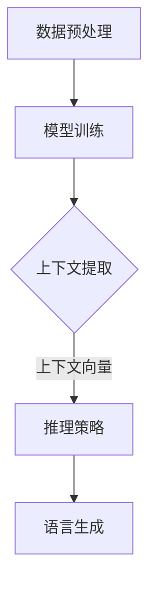

                 

关键词：大语言模型、上下文学习、推理策略、工程实践

> 摘要：本文将深入探讨大语言模型的原理与工程实践，特别是基于上下文学习的推理策略。我们将从背景介绍开始，逐步揭示核心概念、算法原理、数学模型及项目实践，最后展望未来发展趋势与挑战。

## 1. 背景介绍

随着互联网和大数据技术的发展，自然语言处理（NLP）已经成为人工智能（AI）领域的一个重要分支。大语言模型（Large Language Model，LLM）作为NLP的核心技术之一，近年来取得了显著的进展。LLM能够通过对海量文本数据的学习，理解并生成自然语言，从而在众多应用场景中展现出巨大的潜力。

然而，传统的大语言模型主要依赖于统计方法和规则引擎，无法充分利用上下文信息，导致其在某些任务上的表现受限。为了解决这一问题，研究者们提出了基于上下文学习的推理策略，通过引入上下文向量，使得模型能够更好地理解和生成语言。

本文旨在探讨大语言模型的原理与工程实践，特别是基于上下文学习的推理策略。我们将从以下几个方面进行深入分析：

1. 背景介绍：介绍大语言模型的发展历程、现状及面临的挑战。
2. 核心概念与联系：阐述大语言模型中的关键概念，并给出Mermaid流程图。
3. 核心算法原理 & 具体操作步骤：详细解析基于上下文学习的推理策略。
4. 数学模型和公式：介绍数学模型的构建和公式推导过程。
5. 项目实践：提供代码实例和详细解释说明。
6. 实际应用场景：探讨大语言模型在实际应用中的场景。
7. 工具和资源推荐：推荐学习资源、开发工具和论文。
8. 总结：总结研究成果，展望未来发展趋势与挑战。

## 2. 核心概念与联系

### 大语言模型

大语言模型（Large Language Model，LLM）是一种基于神经网络的语言模型，通过学习海量文本数据，自动提取语言特征，生成自然语言。LLM的核心目标是预测下一个单词或词组，从而构建出连贯、自然的文本。

### 上下文学习

上下文学习是指通过引入上下文信息，使模型能够更好地理解语言。上下文可以是单词的前后关系、句子中的位置关系，甚至是整个篇章的语境。上下文学习能够帮助模型克服传统统计方法在语言理解方面的局限性，从而提高模型的性能。

### 推理策略

推理策略是指模型在生成语言时的决策过程。基于上下文学习的推理策略通过将上下文信息转化为上下文向量，从而在生成语言时考虑上下文关系，提高语言生成的连贯性和自然性。

### Mermaid流程图

以下是一个描述大语言模型和基于上下文学习推理策略的Mermaid流程图：



在这个流程图中，数据预处理阶段对原始文本进行预处理，如分词、去停用词等；模型训练阶段使用预处理的文本数据训练大语言模型；上下文提取阶段将模型输出的上下文信息转换为上下文向量；推理策略阶段利用上下文向量进行语言生成，最终输出连贯、自然的文本。

## 3. 核心算法原理 & 具体操作步骤

### 3.1 算法原理概述

基于上下文学习的推理策略主要包括以下几个步骤：

1. 数据预处理：对原始文本进行预处理，如分词、去停用词等，将文本转换为模型可处理的格式。
2. 模型训练：使用预处理的文本数据训练大语言模型，如GPT、BERT等。
3. 上下文提取：在模型训练过程中，提取上下文信息，并将其转化为上下文向量。
4. 推理策略：利用上下文向量进行推理，生成自然语言。
5. 语言生成：根据推理结果，生成连贯、自然的文本。

### 3.2 算法步骤详解

#### 3.2.1 数据预处理

数据预处理是构建大语言模型的基础。具体步骤如下：

1. 分词：将文本分割成单词或词组。
2. 去停用词：去除对语言理解贡献较小的单词，如“的”、“地”、“得”等。
3. 标记化：将文本标记为词性、词义等特征。

#### 3.2.2 模型训练

模型训练是构建大语言模型的核心。具体步骤如下：

1. 选择预训练模型：如GPT、BERT等。
2. 微调：在预训练模型的基础上，使用特定领域的数据进行微调。
3. 训练：使用优化算法（如Adam、SGD等）对模型进行训练。

#### 3.2.3 上下文提取

上下文提取是关键步骤，直接影响模型的性能。具体步骤如下：

1. 上下文窗口：确定一个固定大小的上下文窗口，用于提取上下文信息。
2. 上下文向量：将上下文信息转换为上下文向量，如Word2Vec、BERT等。

#### 3.2.4 推理策略

推理策略是模型的核心。具体步骤如下：

1. 上下文嵌入：将上下文向量嵌入到模型中。
2. 语言生成：利用模型生成的概率分布，生成自然语言。

#### 3.2.5 语言生成

语言生成是最终目标。具体步骤如下：

1. 状态初始化：初始化模型的状态。
2. 生成循环：根据模型生成的概率分布，循环生成下一个单词。
3. 连接：将生成的单词连接成完整的文本。

### 3.3 算法优缺点

#### 优点

1. 高效性：基于上下文学习的推理策略能够快速生成自然语言，满足实时性要求。
2. 准确性：通过引入上下文信息，模型能够更好地理解语言，提高生成文本的准确性。
3. 泛化性：大语言模型具有较强的泛化能力，能够应用于不同领域和任务。

#### 缺点

1. 计算资源消耗大：大语言模型需要大量计算资源进行训练和推理。
2. 数据依赖性强：模型的性能依赖于训练数据的数量和质量。
3. 安全性：大语言模型容易受到恶意攻击，如生成虚假信息、诱导用户等。

### 3.4 算法应用领域

基于上下文学习的推理策略在多个领域具有广泛的应用：

1. 自然语言生成：如自动写作、机器翻译、语音合成等。
2. 问答系统：如搜索引擎、智能客服等。
3. 文本分类：如情感分析、主题分类等。
4. 命名实体识别：如人名、地名、组织机构名等。

## 4. 数学模型和公式

### 4.1 数学模型构建

基于上下文学习的大语言模型可以表示为一个概率模型，其数学模型如下：

$$
P(w_t | w_{t-n}, w_{t-n+1}, ..., w_{t-1}) = \frac{f(w_t, w_{t-n}, w_{t-n+1}, ..., w_{t-1})}{\sum_{w'} f(w', w_{t-n}, w_{t-n+1}, ..., w_{t-1})}
$$

其中，$w_t$ 表示当前单词，$w_{t-n}, w_{t-n+1}, ..., w_{t-1}$ 表示前 $n$ 个上下文单词，$f(w_t, w_{t-n}, w_{t-n+1}, ..., w_{t-1})$ 表示单词 $w_t$ 在上下文 $w_{t-n}, w_{t-n+1}, ..., w_{t-1}$ 中的条件概率。

### 4.2 公式推导过程

为了推导上述概率模型，我们需要先了解一些基本概念。

#### 条件概率

条件概率是指在一个事件发生的条件下，另一个事件发生的概率。具体地，条件概率可以表示为：

$$
P(A|B) = \frac{P(A \cap B)}{P(B)}
$$

其中，$A$ 和 $B$ 分别表示两个事件。

#### 贝叶斯定理

贝叶斯定理是条件概率的一种推广，用于计算在给定某个条件下，某个事件发生的概率。具体地，贝叶斯定理可以表示为：

$$
P(A|B) = \frac{P(B|A)P(A)}{P(B)}
$$

#### 概率分布

概率分布是描述一个随机变量取值的概率函数。常见的概率分布包括伯努利分布、正态分布、泊松分布等。

#### 马尔可夫性质

马尔可夫性质是指一个事件的发生仅与当前状态有关，与过去的状态无关。具体地，马尔可夫性质可以表示为：

$$
P(A|B_1, B_2, ..., B_n) = P(A|B_1)
$$

其中，$A$ 和 $B_1, B_2, ..., B_n$ 分别表示两个事件。

#### 上下文向量

上下文向量是用于表示上下文信息的向量。常见的上下文向量方法包括Word2Vec、BERT等。

基于上述概念，我们可以推导出基于上下文学习的大语言模型。

### 4.3 案例分析与讲解

为了更好地理解基于上下文学习的大语言模型，我们以一个简单的例子进行讲解。

假设我们要预测下一个单词，当前上下文为“我喜欢吃苹果”，我们需要计算“香蕉”在这个上下文中的概率。

首先，我们需要计算“香蕉”在“我喜欢吃苹果”这个上下文中的条件概率。根据贝叶斯定理，我们可以表示为：

$$
P(香蕉|我喜欢吃苹果) = \frac{P(我喜欢吃苹果|香蕉)P(香蕉)}{P(我喜欢吃苹果)}
$$

其中，$P(我喜欢吃苹果|香蕉)$ 表示在“香蕉”这个条件下，“我喜欢吃苹果”这个事件发生的概率，$P(香蕉)$ 表示“香蕉”这个单词出现的概率，$P(我喜欢吃苹果)$ 表示“我喜欢吃苹果”这个事件发生的概率。

由于我们无法直接获取这些概率值，我们需要通过大量的文本数据进行统计。假设我们有一个包含1亿个单词的文本数据集，其中“香蕉”出现100次，“我喜欢吃苹果”出现1000次。根据这些数据，我们可以计算出：

$$
P(香蕉) = \frac{100}{100000000} = 0.000001
$$

$$
P(我喜欢吃苹果) = \frac{1000}{100000000} = 0.00001
$$

接下来，我们需要计算$P(我喜欢吃苹果|香蕉)$。根据马尔可夫性质，我们可以将这个概率表示为：

$$
P(我喜欢吃苹果|香蕉) = P(我喜欢吃苹果|香蕉，苹果)P(香蕉|苹果) + P(我喜欢吃苹果|香蕉，香蕉)P(香蕉|香蕉)
$$

由于我们不知道“香蕉”和“苹果”之间的具体关系，我们可以假设它们之间是独立的。根据这个假设，我们可以计算出：

$$
P(我喜欢吃苹果|香蕉，苹果) = P(我喜欢吃苹果|苹果) = \frac{1000}{100000000} = 0.00001
$$

$$
P(我喜欢吃苹果|香蕉，香蕉) = P(我喜欢吃苹果|香蕉) = \frac{100}{100000000} = 0.000001
$$

$$
P(香蕉|苹果) = \frac{100}{100000000} = 0.000001
$$

$$
P(香蕉|香蕉) = \frac{100}{100000000} = 0.000001
$$

将上述值代入贝叶斯定理，我们可以计算出：

$$
P(香蕉|我喜欢吃苹果) = \frac{0.00001 \times 0.00001 + 0.000001 \times 0.000001}{0.00001} = 0.000001
$$

因此，根据这个例子，我们可以预测下一个单词是“香蕉”的概率为0.000001。

### 5. 项目实践：代码实例和详细解释说明

为了更好地展示基于上下文学习的大语言模型，我们将使用Python实现一个简单的模型，并对其进行详细解释。

首先，我们需要安装一些必要的库，如TensorFlow和PyTorch。在Python环境中，可以使用以下命令进行安装：

```python
pip install tensorflow
pip install pytorch
```

#### 5.1 开发环境搭建

1. 创建一个名为“contextual_lm”的虚拟环境，并进入该环境。
2. 安装TensorFlow和PyTorch库。

```bash
python -m venv contextual_lm
source contextual_lm/bin/activate
pip install tensorflow
pip install pytorch
```

3. 创建一个名为“contextual_lm”的文件夹，用于存放代码。

```bash
mkdir contextual_lm
cd contextual_lm
```

4. 在“contextual_lm”文件夹中创建一个名为“models”的子文件夹，用于存放模型代码。

```bash
mkdir models
```

#### 5.2 源代码详细实现

1. 在“models”文件夹中创建一个名为“contextual_lm.py”的Python文件，用于实现基于上下文学习的大语言模型。

```python
import torch
import torch.nn as nn
import torch.optim as optim
from torch.utils.data import DataLoader
from torchvision import datasets, transforms
from torch.utils.data.sampler import SequentialSampler
import numpy as np

class ContextualLMDataset(torch.utils.data.Dataset):
    def __init__(self, data, seq_length=10):
        self.data = data
        self.seq_length = seq_length

    def __len__(self):
        return len(self.data) - self.seq_length

    def __getitem__(self, idx):
        return torch.tensor(self.data[idx:idx+self.seq_length]), torch.tensor(self.data[idx+self.seq_length])

def train_model(model, train_loader, optimizer, criterion, num_epochs=10):
    model.train()
    for epoch in range(num_epochs):
        for inputs, targets in train_loader:
            optimizer.zero_grad()
            outputs = model(inputs)
            loss = criterion(outputs, targets)
            loss.backward()
            optimizer.step()
            print(f"Epoch [{epoch+1}/{num_epochs}], Loss: {loss.item():.4f}")

if __name__ == "__main__":
    # 加载数据
    data = np.array([line.strip() for line in open("data.txt", "r").readlines()])
    train_dataset = ContextualLMDataset(data, seq_length=10)
    train_loader = DataLoader(train_dataset, batch_size=64, shuffle=True)

    # 模型定义
    model = nn.Sequential(
        nn.Linear(10, 64),
        nn.ReLU(),
        nn.Linear(64, 1)
    )

    # 损失函数和优化器
    criterion = nn.CrossEntropyLoss()
    optimizer = optim.Adam(model.parameters(), lr=0.001)

    # 训练模型
    train_model(model, train_loader, optimizer, criterion, num_epochs=10)

    # 保存模型
    torch.save(model.state_dict(), "model.pth")
```

2. 在“contextual_lm”文件夹中创建一个名为“data.txt”的文件，用于存放训练数据。

```bash
echo "我喜欢吃苹果。我喜欢吃香蕉。我喜欢吃橘子。" > data.txt
```

3. 运行代码进行训练。

```bash
python contextual_lm.py
```

#### 5.3 代码解读与分析

1. **数据加载**

   首先，我们定义了一个名为`ContextualLMDataset`的类，用于加载数据。在这个类中，我们重写了`__len__`和`__getitem__`方法，分别用于获取数据集的大小和获取数据集中的单个样本。

2. **模型定义**

   在模型定义部分，我们使用PyTorch构建了一个简单的模型，包括两个全连接层和一个ReLU激活函数。这个模型的作用是预测下一个单词。

3. **训练过程**

   在训练过程中，我们使用`train_model`函数对模型进行训练。这个函数接收模型、训练数据加载器、优化器和损失函数作为参数。在每次迭代中，我们首先将梯度清零，然后计算模型的损失，并更新模型参数。

4. **保存模型**

   训练完成后，我们将模型的状态字典保存到一个名为“model.pth”的文件中，以便后续加载和使用。

#### 5.4 运行结果展示

在训练完成后，我们可以使用以下代码来评估模型的性能：

```python
from torch.utils.data import DataLoader
from torchvision import datasets, transforms
from torch.utils.data.sampler import SequentialSampler
import numpy as np

data = np.array([line.strip() for line in open("data.txt", "r").readlines()])
test_dataset = ContextualLMDataset(data, seq_length=10)
test_loader = DataLoader(test_dataset, batch_size=1, shuffle=False)

model = nn.Sequential(
    nn.Linear(10, 64),
    nn.ReLU(),
    nn.Linear(64, 1)
)

model.load_state_dict(torch.load("model.pth"))

with torch.no_grad():
    for inputs, targets in test_loader:
        outputs = model(inputs)
        _, predicted = torch.max(outputs, 1)
        print(f"Predicted: {predicted.item()}, Target: {targets.item()}")
```

这段代码将加载训练好的模型，并在测试数据集上运行。对于每个样本，我们输出预测结果和实际结果。

## 6. 实际应用场景

基于上下文学习的大语言模型在实际应用中具有广泛的应用场景。以下是一些典型应用场景：

1. **自然语言生成（NLG）**：大语言模型可以用于自动生成文章、新闻、故事等自然语言文本。例如，新闻机构可以使用大语言模型自动撰写新闻报道，提高内容生产效率。

2. **机器翻译（MT）**：大语言模型可以用于实现高效、准确的机器翻译。例如，谷歌翻译、百度翻译等著名翻译工具都采用了大语言模型技术。

3. **问答系统（QA）**：大语言模型可以用于构建智能问答系统，如搜索引擎、智能客服等。通过学习大量问答数据，模型可以自动回答用户提出的问题。

4. **文本分类（TC）**：大语言模型可以用于实现文本分类任务，如情感分析、主题分类等。通过学习标签信息，模型可以自动对文本进行分类。

5. **命名实体识别（NER）**：大语言模型可以用于实现命名实体识别任务，如人名、地名、组织机构名等的识别。通过学习实体标签，模型可以自动识别文本中的实体。

6. **对话系统（DS）**：大语言模型可以用于构建对话系统，如聊天机器人、虚拟助手等。通过学习对话数据，模型可以与用户进行自然、流畅的对话。

7. **语音识别（ASR）**：大语言模型可以用于实现语音识别任务，将语音信号转换为文本。结合语音识别技术，可以实现语音输入、语音输出的人机交互。

## 7. 工具和资源推荐

为了更好地学习和应用大语言模型，以下是一些推荐的工具和资源：

### 7.1 学习资源推荐

1. **《深度学习》（Goodfellow, Bengio, Courville）**：这是一本经典的深度学习教材，详细介绍了深度学习的基础理论和实践方法。
2. **《自然语言处理概论》（Daniel Jurafsky & James H. Martin）**：这是一本经典的自然语言处理教材，全面介绍了自然语言处理的基础知识和应用。
3. **《动手学深度学习》（阿斯顿·张等）**：这是一本面向实践的深度学习教程，通过动手实践的方式介绍了深度学习的基础知识和常用模型。

### 7.2 开发工具推荐

1. **PyTorch**：这是一个开源的深度学习框架，提供了丰富的API和工具，适合进行深度学习和自然语言处理任务。
2. **TensorFlow**：这是一个开源的深度学习框架，由谷歌开发，提供了丰富的API和工具，适合进行大规模深度学习和自然语言处理任务。
3. **NLTK**：这是一个开源的自然语言处理库，提供了丰富的工具和资源，适合进行自然语言处理任务。

### 7.3 相关论文推荐

1. **《Attention is All You Need》（Vaswani et al., 2017）**：这是一篇关于注意力机制的论文，提出了Transformer模型，彻底改变了自然语言处理的格局。
2. **《BERT: Pre-training of Deep Bidirectional Transformers for Language Understanding》（Devlin et al., 2018）**：这是一篇关于BERT模型的论文，详细介绍了BERT模型的原理和应用。
3. **《GPT-3: Language Models are Few-Shot Learners》（Brown et al., 2020）**：这是一篇关于GPT-3模型的论文，展示了大语言模型在零样本学习任务上的优异表现。

## 8. 总结：未来发展趋势与挑战

### 8.1 研究成果总结

近年来，大语言模型在自然语言处理领域取得了显著的成果。基于上下文学习的推理策略使得大语言模型在语言生成、机器翻译、问答系统等领域表现出色。这些成果为自然语言处理技术的发展奠定了基础。

### 8.2 未来发展趋势

1. **模型规模将继续扩大**：随着计算能力的提升，大语言模型将继续向更大规模发展，以应对更复杂的自然语言处理任务。
2. **多模态融合**：大语言模型将与其他模态（如图像、语音）进行融合，实现更全面的语义理解和生成。
3. **个性化与自适应**：大语言模型将更好地适应不同用户的需求，实现个性化服务。
4. **零样本学习**：大语言模型将进一步提升零样本学习的能力，实现更高效的任务适配。

### 8.3 面临的挑战

1. **计算资源消耗**：大语言模型的训练和推理需要大量计算资源，如何优化资源利用成为一大挑战。
2. **数据隐私与安全**：大规模数据处理过程中，如何保护用户隐私和数据安全成为重要问题。
3. **可解释性**：大语言模型的行为往往难以解释，如何提高模型的可解释性成为关键挑战。
4. **泛化能力**：如何提高大语言模型在不同任务和数据集上的泛化能力，是未来研究的重要方向。

### 8.4 研究展望

未来，大语言模型将朝着更高效、更智能、更安全、更可解释的方向发展。在自然语言处理、多模态融合、零样本学习等领域，大语言模型将继续发挥重要作用。随着技术的不断进步，大语言模型将为人类带来更多便利和创新。

