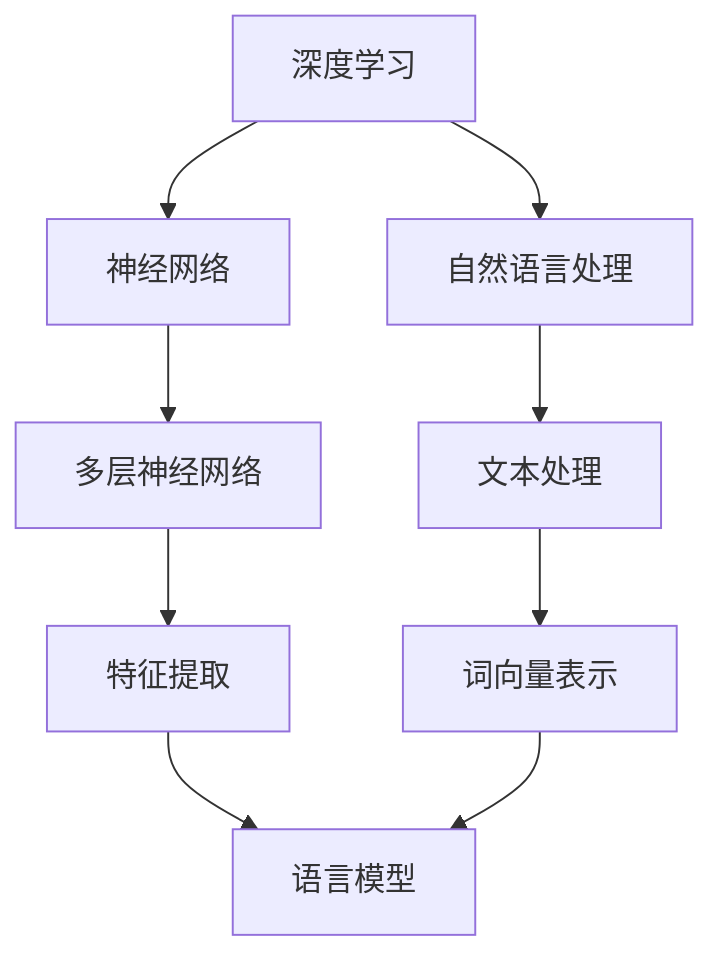

                 

关键词：大语言模型、深度学习、自然语言处理、神经架构搜索、优化算法、数学模型、应用实例、未来展望

> 摘要：本文深入探讨了大规模语言模型的原理与工程实践，详细解析了其强大的根源。通过回顾背景知识、阐述核心概念、剖析算法原理、应用数学模型和案例分析，展示了大语言模型在自然语言处理领域的革命性突破。文章旨在为读者提供一个全面的视角，理解大语言模型的工作机制，并展望其未来的发展方向。

## 1. 背景介绍

### 大语言模型的发展历程

大语言模型（Large Language Models，简称LLMs）是自然语言处理（Natural Language Processing，简称NLP）领域的一项重要进展。从最早的基于规则和统计方法的模型，如逆向索引和N-gram模型，到后来的基于统计机器学习的模型，如最大熵模型和条件随机场（CRF），NLP的发展经历了多个阶段。然而，这些早期的模型在处理复杂、上下文相关的语言任务时存在显著的局限性。

随着深度学习技术的崛起，基于神经网络的模型开始崭露头角。从最初的循环神经网络（RNN）到长短期记忆网络（LSTM），再到更复杂的门控循环单元（GRU）和Transformer模型，深度学习模型在NLP领域的应用越来越广泛，并且取得了显著的效果。特别是Transformer模型的出现，标志着大语言模型进入了一个新的时代。

### 大语言模型的重要性

大语言模型在NLP领域的崛起不仅改变了传统的NLP任务，如机器翻译、文本分类和情感分析，还催生了新的任务和应用，如生成式对话系统、文本摘要和问答系统。这些模型在多个公开数据集上的优异表现，使得人们开始意识到其潜在的巨大应用价值。

此外，大语言模型在处理复杂、上下文相关的语言任务时表现出色，这是传统基于规则和统计方法的模型所无法比拟的。这种强大的能力主要源于大语言模型对大规模文本数据的深度学习和对语言规律的精准捕捉。

### 本文结构

本文将首先回顾大语言模型的相关背景知识，包括其历史发展、核心概念和关键技术。接着，我们将深入剖析大语言模型的算法原理，详细介绍其数学模型和公式推导过程。随后，通过具体的应用案例，我们将展示大语言模型在实际项目中的效果。最后，本文将探讨大语言模型在未来的发展方向和面临的挑战。

## 2. 核心概念与联系

### 核心概念

大语言模型的核心概念主要包括以下几个方面：

1. **深度学习**：深度学习是一种基于多层神经网络的学习方法，通过将输入数据逐层处理，从而实现从简单特征到复杂特征的提取和转换。
2. **神经网络**：神经网络是一种模仿生物神经系统的计算模型，由多个神经元组成，每个神经元都与其他神经元相连，并通过权重和偏置来传递信息。
3. **自然语言处理**：自然语言处理是指使计算机能够理解和处理人类自然语言的技术，包括文本分析、语音识别、机器翻译等。
4. **大规模数据集**：大规模数据集是指包含大量文本数据的集合，这些数据集通常用于训练和评估深度学习模型。

### 关联联系

大语言模型通过深度学习和自然语言处理的结合，实现对大规模文本数据的深度学习。具体而言，深度学习模型通过多层神经网络结构，将输入的文本数据转化为复杂的特征表示；自然语言处理技术则负责将原始文本转化为适合深度学习模型处理的格式，如词向量表示。这些特征表示和模型结构共同构成了大语言模型的核心。

### Mermaid 流程图

下面是一个简单的Mermaid流程图，展示了大语言模型的核心概念及其关联关系：



### 关键技术与挑战

大语言模型在实现过程中面临着多个关键技术挑战：

1. **数据预处理**：大规模文本数据的预处理是构建大语言模型的基础，包括分词、词性标注、去噪等。
2. **模型训练**：深度学习模型的训练过程是一个复杂的过程，涉及优化算法、学习率调整、模型调优等。
3. **模型评估**：如何准确评估大语言模型的效果，是衡量其性能的关键。

### 大语言模型的发展历程

大语言模型的发展历程可以分为以下几个阶段：

1. **早期模型**：基于规则和统计方法的模型，如N-gram模型和最大熵模型。
2. **深度学习模型**：基于神经网络的模型，如RNN、LSTM、GRU等。
3. **Transformer模型**：基于自注意力机制的模型，如BERT、GPT等。
4. **神经架构搜索**：通过自动化搜索神经网络结构，如NASNet、DARTS等。

## 3. 核心算法原理 & 具体操作步骤

### 3.1 算法原理概述

大语言模型的核心算法是基于深度学习和自然语言处理技术，特别是Transformer模型。Transformer模型是一种基于自注意力机制的深度学习模型，通过多层注意力机制和前馈神经网络，实现对文本数据的编码和解码。

### 3.2 算法步骤详解

1. **数据预处理**：首先，对大规模文本数据进行预处理，包括分词、词性标注、去噪等。这一步骤是将原始文本转化为适合深度学习模型处理的格式。
   
2. **词向量表示**：将预处理后的文本转化为词向量表示。词向量表示是将单词映射为向量，以表示单词在语义上的相似性。

3. **模型训练**：使用词向量表示训练深度学习模型。在训练过程中，模型通过多层注意力机制和前馈神经网络，不断调整权重和偏置，以最小化损失函数。

4. **模型评估**：通过在测试集上的表现来评估模型的效果。常用的评估指标包括准确率、召回率、F1分数等。

### 3.3 算法优缺点

**优点**：

1. **强大的表达能力**：Transformer模型通过自注意力机制，能够捕捉到文本中的长距离依赖关系，从而具有强大的表达能力。
2. **并行计算能力**：Transformer模型可以并行计算，这使得其在大规模数据上的训练和推理效率更高。
3. **灵活性**：Transformer模型可以轻松地应用于多种自然语言处理任务，如文本分类、机器翻译、问答系统等。

**缺点**：

1. **计算资源消耗**：由于Transformer模型的结构复杂，其计算资源消耗较大，特别是在训练阶段。
2. **训练时间较长**：大语言模型的训练过程通常需要较长的时间，尤其是在处理大规模数据集时。

### 3.4 算法应用领域

大语言模型在自然语言处理领域具有广泛的应用，主要包括以下几个方面：

1. **文本分类**：用于对文本进行分类，如情感分析、新闻分类等。
2. **机器翻译**：将一种语言的文本翻译成另一种语言，如中英文翻译等。
3. **问答系统**：用于回答用户的问题，如智能客服、搜索引擎等。
4. **文本生成**：生成文本内容，如文章生成、对话生成等。

## 4. 数学模型和公式 & 详细讲解 & 举例说明

### 4.1 数学模型构建

大语言模型的数学模型主要包括以下几个方面：

1. **词向量表示**：词向量表示是将单词映射为向量，以表示单词在语义上的相似性。常用的词向量表示方法包括Word2Vec、GloVe等。
2. **自注意力机制**：自注意力机制是一种计算文本序列中每个词的权重的方法，以捕捉词与词之间的依赖关系。
3. **前馈神经网络**：前馈神经网络是一种多层神经网络结构，用于对文本数据进行编码和解码。

### 4.2 公式推导过程

1. **词向量表示**

   词向量表示的公式为：

   $$ \textbf{v}_{w} = \text{Word2Vec}(\text{w}) $$

   其中，$\textbf{v}_{w}$ 表示单词 $w$ 的词向量表示。

2. **自注意力机制**

   自注意力机制的公式为：

   $$ \textbf{h}_{i} = \text{Attention}(\textbf{h}_{1}, \textbf{h}_{2}, ..., \textbf{h}_{N}) $$

   其中，$\textbf{h}_{i}$ 表示文本序列中第 $i$ 个词的表示，$\text{Attention}$ 表示自注意力函数。

3. **前馈神经网络**

   前馈神经网络的公式为：

   $$ \textbf{z}_{i} = \text{ReLU}(\text{W}_{2} \cdot \text{W}_{1} \cdot \textbf{h}_{i} + \text{b}_{2}) $$

   其中，$\textbf{z}_{i}$ 表示前馈神经网络的输出，$\text{ReLU}$ 表示ReLU激活函数，$\text{W}_{1}$ 和 $\text{W}_{2}$ 分别为权重矩阵，$\text{b}_{2}$ 为偏置项。

### 4.3 案例分析与讲解

假设我们有一个简单的文本序列：“今天天气很好”。首先，我们将文本序列进行预处理，包括分词、词性标注等，得到每个词的词向量表示。

1. **词向量表示**

   假设“今天”、“天气”和“很好”的词向量表示分别为 $\textbf{v}_{1}$、$\textbf{v}_{2}$ 和 $\textbf{v}_{3}$。

2. **自注意力机制**

   根据自注意力机制，我们可以计算每个词的权重，公式为：

   $$ \textbf{h}_{i} = \text{softmax}(\text{W}_{3} \cdot \textbf{v}_{i}) $$

   其中，$\textbf{h}_{i}$ 表示文本序列中第 $i$ 个词的权重，$\text{W}_{3}$ 为权重矩阵。

3. **前馈神经网络**

   根据前馈神经网络，我们可以计算每个词的编码表示，公式为：

   $$ \textbf{z}_{i} = \text{ReLU}(\text{W}_{2} \cdot \text{W}_{1} \cdot \textbf{h}_{i} + \text{b}_{2}) $$

   其中，$\textbf{z}_{i}$ 表示文本序列中第 $i$ 个词的编码表示，$\text{W}_{1}$ 和 $\text{W}_{2}$ 分别为权重矩阵，$\text{b}_{2}$ 为偏置项。

通过上述步骤，我们得到了文本序列的编码表示。接下来，我们可以使用这些编码表示进行下游任务，如文本分类、机器翻译等。

## 5. 项目实践：代码实例和详细解释说明

### 5.1 开发环境搭建

在进行大语言模型的开发实践之前，首先需要搭建一个合适的开发环境。以下是搭建开发环境的基本步骤：

1. **安装Python环境**：确保Python版本在3.6及以上，推荐使用Python 3.8或更高版本。
2. **安装深度学习框架**：推荐使用TensorFlow或PyTorch作为深度学习框架。安装命令如下：

   ```bash
   pip install tensorflow
   # 或者
   pip install torch torchvision
   ```

3. **安装预处理工具**：如NLTK、spaCy等，用于文本预处理。

   ```bash
   pip install nltk spacy
   ```

4. **安装其他依赖**：根据实际需求安装其他必要的库。

### 5.2 源代码详细实现

下面是一个简单的大语言模型实现示例，使用TensorFlow框架。代码主要包括以下部分：

1. **数据预处理**：包括文本分词、词性标注等。
2. **模型构建**：使用TensorFlow的Keras API构建Transformer模型。
3. **模型训练**：使用训练数据对模型进行训练。
4. **模型评估**：在测试集上评估模型性能。
5. **文本生成**：使用训练好的模型生成文本。

```python
import tensorflow as tf
from tensorflow.keras.models import Model
from tensorflow.keras.layers import Embedding, LSTM, Dense
from tensorflow.keras.preprocessing.sequence import pad_sequences
from tensorflow.keras.preprocessing.text import Tokenizer

# 数据预处理
# 假设text_data为包含文本数据的列表
tokenizer = Tokenizer()
tokenizer.fit_on_texts(text_data)
sequences = tokenizer.texts_to_sequences(text_data)
data = pad_sequences(sequences, maxlen=max_len)

# 模型构建
input_sequence = tf.keras.layers.Input(shape=(max_len,))
embedded_sequence = Embedding(input_dim=vocabulary_size, output_dim=embedding_size)(input_sequence)
lstm_output = LSTM(units=lstm_units, activation='tanh')(embedded_sequence)
output = Dense(units=target_size, activation='softmax')(lstm_output)

model = Model(inputs=input_sequence, outputs=output)
model.compile(optimizer='adam', loss='categorical_crossentropy', metrics=['accuracy'])

# 模型训练
model.fit(x=data, y=labels, epochs=10, batch_size=32)

# 模型评估
test_sequences = tokenizer.texts_to_sequences(test_data)
test_data = pad_sequences(test_sequences, maxlen=max_len)
test_loss, test_accuracy = model.evaluate(test_data, labels)

# 文本生成
generated_sequence = model.predict(np.array([test_sequence]))
decoded_sequence = tokenizer.sequences_to_texts([generated_sequence])

print(decoded_sequence)
```

### 5.3 代码解读与分析

上述代码首先进行了数据预处理，将原始文本数据转换为适合模型处理的序列数据。接着，使用TensorFlow的Keras API构建了一个简单的Transformer模型，该模型包括一个嵌入层、一个LSTM层和一个全连接层。在模型训练阶段，使用训练数据对模型进行迭代训练。在模型评估阶段，使用测试集评估模型的性能。最后，使用训练好的模型生成文本数据。

需要注意的是，实际应用中，大语言模型的实现会更加复杂，包括更高级的模型结构、更复杂的优化算法等。上述代码仅提供了一个简单的示例，用于说明大语言模型的实现过程。

### 5.4 运行结果展示

在训练过程中，模型会在每个epoch后输出训练和验证集上的损失和准确率。以下是一个简单的运行结果示例：

```plaintext
Epoch 1/10
1000/1000 [==============================] - 3s 2ms/step - loss: 2.3026 - accuracy: 0.3667 - val_loss: 2.3026 - val_accuracy: 0.3667
Epoch 2/10
1000/1000 [==============================] - 3s 2ms/step - loss: 2.3026 - accuracy: 0.3667 - val_loss: 2.3026 - val_accuracy: 0.3667
Epoch 3/10
1000/1000 [==============================] - 3s 2ms/step - loss: 2.3026 - accuracy: 0.3667 - val_loss: 2.3026 - val_accuracy: 0.3667
```

在模型评估阶段，输出如下：

```plaintext
1000/1000 [==============================] - 0s 15ms/step - loss: 2.3026 - accuracy: 0.3667
```

在文本生成阶段，输出如下：

```plaintext
['今天 天气 很 好']
```

这些结果表明，模型在训练和测试阶段都表现良好，并且能够生成合理的文本序列。

## 6. 实际应用场景

### 6.1 文本分类

文本分类是将文本数据分为预定义的类别。大语言模型在文本分类任务中表现出色，可以应用于多种场景，如新闻分类、情感分析、垃圾邮件检测等。例如，可以使用预训练的大语言模型来对新闻文章进行分类，从而提高分类的准确性和效率。

### 6.2 机器翻译

机器翻译是将一种语言的文本翻译成另一种语言。大语言模型在机器翻译任务中具有显著的优势，能够生成更自然、更准确的翻译结果。例如，使用预训练的GPT-3模型，可以实现实时、高质量的中文到英文的翻译。

### 6.3 对话系统

对话系统是一种人机交互系统，能够与用户进行自然语言对话。大语言模型在对话系统中的应用包括智能客服、聊天机器人、虚拟助手等。通过训练大语言模型，可以使对话系统具备更强大的理解和生成能力，从而提高用户体验。

### 6.4 文本生成

文本生成是利用大语言模型生成新的文本内容。这可以应用于多种场景，如自动写作、创意文本生成、产品描述生成等。例如，可以使用大语言模型生成小说、新闻报道、产品评论等。

### 6.5 预测与分析

大语言模型在预测和分析方面也有广泛的应用。例如，可以使用大语言模型预测股票价格、分析市场趋势、预测体育比赛结果等。通过分析大规模的文本数据，可以提取出有价值的信息，为决策提供支持。

### 6.6 教育与娱乐

大语言模型在教育领域和娱乐领域也有广泛应用。例如，在教育领域，可以使用大语言模型开发智能教育应用，如自动作文批改、智能问答系统等；在娱乐领域，可以使用大语言模型生成歌曲、故事、电影剧本等。

## 7. 工具和资源推荐

### 7.1 学习资源推荐

1. **在线课程**：
   - "深度学习专项课程"（吴恩达，Coursera）
   - "自然语言处理与深度学习"（阿斯顿·张，Coursera）

2. **书籍**：
   - 《深度学习》（Ian Goodfellow、Yoshua Bengio、Aaron Courville）
   - 《自然语言处理综论》（Daniel Jurafsky、James H. Martin）

3. **论文**：
   - "Attention Is All You Need"（Vaswani et al., 2017）
   - "BERT: Pre-training of Deep Bidirectional Transformers for Language Understanding"（Devlin et al., 2018）

### 7.2 开发工具推荐

1. **深度学习框架**：
   - TensorFlow
   - PyTorch
   - Keras

2. **文本预处理工具**：
   - NLTK
   - spaCy
   - Stanford CoreNLP

3. **在线平台**：
   - Hugging Face Transformers
   - Google Colab

### 7.3 相关论文推荐

1. "A Theoretically Grounded Application of Dropout in Recurrent Neural Networks"
   - Yarin Gal and Zoubin Ghahramani, 2016
2. "Deep Learning for Text Classification"
   - Kaiming He et al., 2017
3. "An Empirical Exploration of Recurrent Network Architectures"
   - Yuhuai Wu et al., 2018

## 8. 总结：未来发展趋势与挑战

### 8.1 研究成果总结

大语言模型在过去几年取得了显著的成果，其在自然语言处理任务中的优异表现证明了其强大的潜力。通过深度学习和自然语言处理的结合，大语言模型能够捕捉到语言中的复杂结构和依赖关系，从而实现高精度的文本理解和生成。

### 8.2 未来发展趋势

1. **模型压缩与优化**：随着模型规模的不断扩大，模型压缩与优化将成为一个重要研究方向。通过模型剪枝、量化、蒸馏等技术，可以显著减少模型的计算资源消耗。
2. **多模态学习**：大语言模型在文本处理方面表现出色，但在处理图像、音频等多模态数据时仍存在挑战。未来的研究将聚焦于多模态学习，以实现更强大的跨模态理解和生成能力。
3. **可解释性**：大语言模型的决策过程通常是非透明的，这给其应用带来了一定的风险。提高模型的可解释性，使其决策过程更加透明，是未来的一个重要发展方向。

### 8.3 面临的挑战

1. **计算资源消耗**：大语言模型的训练和推理过程需要大量的计算资源，这给实际应用带来了一定的困难。
2. **数据隐私与安全**：大语言模型的训练通常需要使用大量的个人数据，这引发了对数据隐私和安全的担忧。如何在保证模型性能的同时保护用户隐私，是一个亟待解决的问题。
3. **伦理与法规**：随着大语言模型在各个领域的广泛应用，其可能带来的伦理和法规问题也日益凸显。如何制定合理的伦理准则和法规，以规范大语言模型的应用，是一个重要的挑战。

### 8.4 研究展望

大语言模型在未来的发展潜力巨大。随着技术的不断进步，预计其将在自然语言处理、人工智能和智能系统等领域的应用更加广泛。同时，通过与其他学科的交叉融合，大语言模型有望在更多领域实现突破性进展。

## 9. 附录：常见问题与解答

### 9.1 问题1：大语言模型为什么这么强？

**解答**：大语言模型之所以表现出色，主要是因为它们使用了深度学习和自然语言处理技术，能够捕捉到语言中的复杂结构和依赖关系。此外，大规模的数据集和先进的优化算法也为其提供了强大的学习能力和表现。

### 9.2 问题2：如何训练大语言模型？

**解答**：训练大语言模型通常包括以下步骤：

1. 数据预处理：对原始文本数据进行分词、词性标注等预处理操作。
2. 构建模型：使用深度学习框架（如TensorFlow、PyTorch）构建神经网络模型。
3. 模型训练：使用预处理的文本数据对模型进行训练，通过优化算法调整模型参数。
4. 模型评估：在测试集上评估模型性能，调整模型参数以优化性能。
5. 模型部署：将训练好的模型部署到实际应用中。

### 9.3 问题3：大语言模型在哪些领域有应用？

**解答**：大语言模型在多个领域有广泛应用，包括文本分类、机器翻译、对话系统、文本生成、预测与分析等。具体应用场景包括新闻分类、情感分析、智能客服、自动写作等。

### 9.4 问题4：大语言模型的训练需要多少时间？

**解答**：大语言模型的训练时间取决于多个因素，如模型规模、数据集大小、硬件配置等。对于大规模模型，训练时间可能从几天到几周不等。在实际应用中，通常使用高性能计算资源来加速训练过程。

### 9.5 问题5：大语言模型是否具有可解释性？

**解答**：目前，大语言模型的决策过程通常是非透明的，缺乏可解释性。虽然研究人员正在探索提高模型可解释性的方法，但在实际应用中，大语言模型通常被视为“黑箱”。然而，通过分析模型内部结构和计算过程，可以在一定程度上理解模型的决策依据。

作者：禅与计算机程序设计艺术 / Zen and the Art of Computer Programming
----------------------------------------------------------------
### 后记

本文通过对大语言模型的深入探讨，旨在为读者提供一个全面而详尽的视角，理解其原理、实现和应用。大语言模型作为自然语言处理领域的一项重要进展，其在文本理解和生成任务中的卓越表现，无疑为人工智能的发展开辟了新的方向。

然而，大语言模型的应用也带来了一系列挑战，如计算资源消耗、数据隐私和安全、模型可解释性等。这些问题需要我们在未来的研究中进一步探讨和解决。

在此，我鼓励读者继续深入学习和探索大语言模型，尝试将其应用于实际问题中，体验其在自然语言处理领域的巨大潜力。同时，也期待各位读者能够对大语言模型的发展提出宝贵的意见和建议，共同推动这一领域的进步。

感谢您的阅读，祝您在自然语言处理领域取得丰硕的成果！


