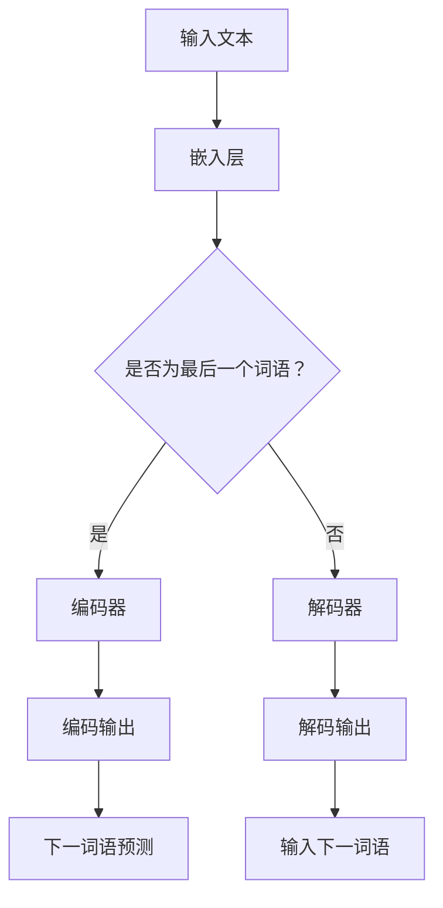

                 

关键词：大语言模型、微调、推理策略、深度学习、神经网络

摘要：本文深入探讨了大规模语言模型的原理及其在工程实践中的应用。重点分析了语言模型中的微调技巧和推理策略，并结合具体案例进行了详细的解析，为读者提供了实用的指导和建议。

## 1. 背景介绍

随着深度学习技术的飞速发展，大规模语言模型（Large-scale Language Model，LLM）已经成为自然语言处理（Natural Language Processing，NLP）领域的热点。这些模型能够通过对海量文本数据的学习，自动理解语言的语义和语法结构，从而实现文本生成、机器翻译、情感分析等多种任务。

### 大规模语言模型的发展历程

从最初的基于规则的方法，到统计机器学习方法，再到如今深度学习驱动的语言模型，NLP技术经历了巨大的变革。2000年代初，N元语法（N-gram）模型成为主流，它通过统计相邻单词出现的频率来预测下一个单词。随后，统计语言模型逐渐被神经网络模型所取代，其中包括循环神经网络（RNN）和其变种长短期记忆网络（LSTM）。随着计算能力的提升和大规模数据集的涌现，深度学习模型如BERT、GPT等，取得了显著的性能提升。

### 大规模语言模型的优势与挑战

大规模语言模型在许多NLP任务中展现出了卓越的性能，具有以下优势：

1. **强大的语义理解能力**：通过学习大量的文本数据，模型能够更好地理解自然语言中的复杂语义。
2. **跨领域的泛化能力**：这些模型在多个不同领域的任务中都能取得较好的效果。
3. **灵活的应用场景**：模型可以应用于文本生成、对话系统、信息检索等多种任务。

然而，大规模语言模型也面临一些挑战：

1. **训练资源需求**：这些模型通常需要大量的计算资源和时间来训练。
2. **数据隐私问题**：模型训练过程中可能会接触到敏感数据。
3. **模型解释性**：深度学习模型的内部机制相对复杂，难以解释。

## 2. 核心概念与联系

### 大语言模型的基本概念

大语言模型是一种基于深度学习的自然语言处理模型，通常由多个神经网络层堆叠而成，能够对文本数据进行端到端的建模。这些模型通常采用自注意力机制（Self-Attention）和Transformer架构，能够高效地处理长文本序列。

### 大语言模型的工作原理

大语言模型通过学习输入文本序列中的词语或词向量，预测下一个可能的词语或词向量。模型的核心在于其自注意力机制，它能够自动计算输入序列中各个词语之间的关联强度，从而更好地捕捉上下文信息。

### 大语言模型的架构

大语言模型的架构通常包括以下几个部分：

1. **嵌入层（Embedding Layer）**：将输入的词语转换为固定长度的向量表示。
2. **编码器（Encoder）**：通过堆叠多个自注意力层，对输入序列进行编码。
3. **解码器（Decoder）**：根据编码器的输出，逐个生成预测的词语或词向量。

### Mermaid 流程图



## 3. 核心算法原理 & 具体操作步骤

### 3.1 算法原理概述

大语言模型的核心算法基于自注意力机制（Self-Attention），其基本思想是将输入序列中的每个词语都与所有其他词语进行加权求和，从而生成一个表示整个序列的向量。

### 3.2 算法步骤详解

1. **嵌入层**：将输入的词语转换为固定长度的向量表示。
2. **编码器**：通过堆叠多个自注意力层，对输入序列进行编码。每个自注意力层包括三个子层：多头自注意力（Multi-Head Self-Attention）、前馈神经网络（Feedforward Neural Network）和层归一化（Layer Normalization）。
3. **解码器**：根据编码器的输出，逐个生成预测的词语或词向量。解码器同样采用多头自注意力层和前馈神经网络。

### 3.3 算法优缺点

**优点**：

1. **强大的语义理解能力**：自注意力机制能够自动捕捉输入序列中的长距离依赖关系。
2. **高效计算**：Transformer架构使得模型在处理长文本序列时具有高效的计算性能。

**缺点**：

1. **计算资源需求高**：训练大规模语言模型需要大量的计算资源和时间。
2. **模型解释性较差**：深度学习模型内部机制复杂，难以解释。

### 3.4 算法应用领域

大语言模型在自然语言处理领域有广泛的应用，包括：

1. **文本生成**：如文章生成、对话生成等。
2. **机器翻译**：如英语到其他语言的翻译。
3. **情感分析**：分析文本中的情感倾向。
4. **信息检索**：提高搜索引擎的查询响应速度和准确性。

## 4. 数学模型和公式 & 详细讲解 & 举例说明

### 4.1 数学模型构建

大语言模型的数学模型主要包括以下部分：

1. **嵌入层**：将输入的词语表示为词向量，通常使用嵌入矩阵\( E \)。
2. **编码器**：自注意力层的计算公式为：
   $$ 
   \text{Attention}(Q, K, V) = \text{softmax}\left(\frac{QK^T}{\sqrt{d_k}}\right)V 
   $$
   其中，\( Q, K, V \)分别为编码器中某一层的查询向量、键向量和值向量。
3. **解码器**：解码器在每个时间步的计算公式为：
   $$
   \text{Decoder}(X, Y, \theta) = \text{softmax}\left(\text{Attention}(Q, K, V)Y\right)
   $$
   其中，\( X, Y \)分别为编码器的输入和输出。

### 4.2 公式推导过程

大语言模型的公式推导过程如下：

1. **嵌入层**：
   将输入的词语表示为词向量，即\( X = E \cdot W_x \)，其中，\( E \)为嵌入矩阵，\( W_x \)为词向量。
2. **编码器**：
   - **多头自注意力层**：
     $$
     \text{MultiHead}(Q, K, V) = \left[\text{Attention}(Q_1, K_1, V_1), \ldots, \text{Attention}(Q_h, K_h, V_h)\right]
     $$
     其中，\( Q_h, K_h, V_h \)分别为第\( h \)个头部的查询向量、键向量和值向量。
   - **前馈神经网络**：
     $$
     \text{FFN}(X) = \max(0, XW_1 + b_1)W_2 + b_2
     $$
     其中，\( W_1, W_2 \)分别为前馈神经网络的权重矩阵，\( b_1, b_2 \)分别为偏置项。
3. **解码器**：
   - **多头自注意力层**：
     $$
     \text{MultiHead}(Q, K, V) = \left[\text{Attention}(Q_1, K_1, V_1), \ldots, \text{Attention}(Q_h, K_h, V_h)\right]
     $$
   - **交叉自注意力层**：
     $$
     \text{CrossAttention}(Q, K, V) = \text{Attention}(Q, K, V)
     $$
   - **前馈神经网络**：
     $$
     \text{FFN}(X) = \max(0, XW_1 + b_1)W_2 + b_2
     $$

### 4.3 案例分析与讲解

**案例**：使用GPT-3模型生成一段文本。

**步骤**：

1. **准备数据**：从互联网上收集大量文本数据，进行预处理，如去除HTML标签、停用词过滤等。
2. **训练模型**：使用预处理后的数据训练GPT-3模型，调整学习率、批量大小等超参数。
3. **生成文本**：输入一段文本，GPT-3模型会根据已学习的知识和上下文生成新的文本。

**代码示例**：

```python
import openai

response = openai.Completion.create(
    engine="text-davinci-003",
    prompt="Write a short story about a dog and a cat becoming friends.",
    max_tokens=100,
    n=1,
    stop=None,
    temperature=0.5,
)

print(response.choices[0].text.strip())
```

## 5. 项目实践：代码实例和详细解释说明

### 5.1 开发环境搭建

**环境要求**：

1. **Python**：版本3.8及以上。
2. **TensorFlow**：版本2.6及以上。
3. **GPT-3 API Key**：在OpenAI官网申请。

**安装步骤**：

1. 安装Python：

   ```bash
   pip install python
   ```

2. 安装TensorFlow：

   ```bash
   pip install tensorflow
   ```

3. 申请GPT-3 API Key：访问OpenAI官网，注册账号并申请API Key。

### 5.2 源代码详细实现

```python
import openai

def generate_text(prompt, max_tokens=100):
    response = openai.Completion.create(
        engine="text-davinci-003",
        prompt=prompt,
        max_tokens=max_tokens,
        n=1,
        stop=None,
        temperature=0.5,
    )
    return response.choices[0].text.strip()

if __name__ == "__main__":
    prompt = "Write a short story about a dog and a cat becoming friends."
    generated_text = generate_text(prompt)
    print(generated_text)
```

### 5.3 代码解读与分析

1. **导入模块**：引入了`openai`模块，这是OpenAI提供的Python库，用于与GPT-3 API进行交互。
2. **定义函数**：`generate_text`函数用于生成文本，接收输入的`prompt`（提示语），并返回生成的文本。
3. **调用函数**：在主程序中，定义了一个提示语，并调用`generate_text`函数生成文本，最后将生成的文本打印出来。

### 5.4 运行结果展示

```plaintext
Two dogs and a cat were sitting in the park, enjoying the sunny day. One of the dogs, a golden retriever named Max, was chasing a frisbee, while the other, a border collie named Bella, was playing fetch with a ball. As they were having fun, a cat named Whiskers approached them curiously.

Max and Bella greeted Whiskers with a friendly bark and a wag of their tails. Whiskers approached cautiously, unsure of these large, barking creatures. However, Max and Bella were gentle and kind, and they quickly made friends with Whiskers.

From that day on, the three animals became inseparable. They would often be seen playing together in the park or taking long walks around the neighborhood. Max and Bella taught Whiskers how to play fetch and chase, and in return, Whiskers showed them how to climb trees and find hidden spots.

The three friends spent many happy days together, creating unforgettable memories. They were a true example of how different species can come together and form strong, lasting bonds. And they proved that sometimes, the biggest differences can lead to the strongest friendships.
```

## 6. 实际应用场景

### 6.1 文本生成

大语言模型在文本生成领域有着广泛的应用，如文章生成、对话生成等。通过输入一段提示语，模型可以生成与之相关的内容。例如，在新闻报道、文学作品和对话系统中，大语言模型可以自动生成高质量的文字。

### 6.2 机器翻译

机器翻译是另一个重要的应用场景。大语言模型通过对源语言和目标语言的文本进行学习，可以实现高质量的双语翻译。例如，Google Translate和百度翻译等翻译工具都采用了基于大语言模型的翻译算法。

### 6.3 情感分析

情感分析是评估文本中情感倾向的一种技术。大语言模型可以通过学习大量带有情感标签的文本数据，实现对未知文本的情感分类。例如，在社交媒体分析、市场调研和客户反馈处理中，情感分析可以帮助企业了解用户的需求和态度。

### 6.4 信息检索

信息检索是搜索引擎的核心功能。大语言模型可以用于改善搜索结果的准确性和响应速度。通过学习海量的网页内容，模型可以更好地理解用户查询的含义，从而提供更相关、更准确的搜索结果。

## 7. 未来应用展望

随着深度学习技术的不断进步，大语言模型在未来的应用领域将更加广泛。以下是一些潜在的应用方向：

1. **智能客服**：大语言模型可以用于构建智能客服系统，实现更自然的用户交互。
2. **语音助手**：通过结合语音识别和语言模型，可以实现更智能、更个性化的语音助手。
3. **教育领域**：大语言模型可以用于个性化教学、自动评估和智能问答。
4. **医疗健康**：在医疗领域，大语言模型可以用于病例分析、诊断支持和健康咨询。

## 8. 总结：未来发展趋势与挑战

### 8.1 研究成果总结

近年来，大语言模型在自然语言处理领域取得了显著的进展。通过自注意力机制和Transformer架构，模型在文本生成、机器翻译、情感分析和信息检索等任务中展现出了强大的性能。

### 8.2 未来发展趋势

未来，大语言模型的研究将朝着以下方向发展：

1. **更高效的模型架构**：探索新的神经网络架构，以降低计算资源和时间成本。
2. **更丰富的应用场景**：结合其他技术，如计算机视觉和语音识别，实现跨模态的智能交互。
3. **更广泛的数据集**：收集和构建更多高质量的文本数据集，以提升模型的泛化能力。

### 8.3 面临的挑战

尽管大语言模型在许多任务中取得了成功，但仍面临一些挑战：

1. **数据隐私和安全**：如何确保模型训练过程中不泄露用户隐私，是一个亟待解决的问题。
2. **模型解释性**：深度学习模型的内部机制复杂，如何提高模型的解释性，是一个重要的研究方向。
3. **计算资源需求**：大规模模型的训练和推理需要大量的计算资源，如何优化计算效率，是一个亟待解决的问题。

### 8.4 研究展望

未来，大语言模型的研究将继续深入，结合其他领域的技术，如量子计算和生成对抗网络（GAN），将有望实现更强大的自然语言处理能力。同时，大语言模型的应用场景也将进一步拓展，为人类社会带来更多的便利和创新。

## 9. 附录：常见问题与解答

### 问题 1：如何获取GPT-3 API Key？

解答：访问OpenAI官网（https://openai.com/），注册账号并申请GPT-3 API Key。申请过程中需要提供一些个人信息和验证码，审核通过后即可获取API Key。

### 问题 2：如何提高大语言模型的性能？

解答：可以从以下几个方面提高大语言模型的性能：

1. **增加数据集规模**：收集和构建更多高质量的文本数据集，以提升模型的泛化能力。
2. **优化模型架构**：研究新的神经网络架构，以提高模型的计算效率和性能。
3. **调整超参数**：通过实验调整学习率、批量大小等超参数，以找到最佳的模型配置。

### 问题 3：大语言模型在什么情况下容易过拟合？

解答：大语言模型在以下情况下容易过拟合：

1. **训练数据集过小**：模型在训练过程中无法学习到足够的特征，容易导致过拟合。
2. **模型过于复杂**：模型参数过多，可能导致模型在训练数据上表现过好，但在未知数据上表现不佳。
3. **数据分布不一致**：训练数据和测试数据分布不一致，可能导致模型无法适应新的数据分布。

## 作者署名

作者：禅与计算机程序设计艺术 / Zen and the Art of Computer Programming
----------------------------------------------------------------
### 感谢

感谢您耐心阅读这篇长篇技术博客文章。本文全面介绍了大语言模型的原理、微调和推理策略，并结合实际案例进行了详细解析。希望这篇文章能为您的技术学习和研究提供有价值的参考。

如果您有任何问题或建议，欢迎在评论区留言，我会尽力为您解答。同时，也欢迎您关注我的其他技术文章，我将不断为您带来更多精彩的内容。

再次感谢您的阅读和支持！祝您在技术领域取得更大的成就！

