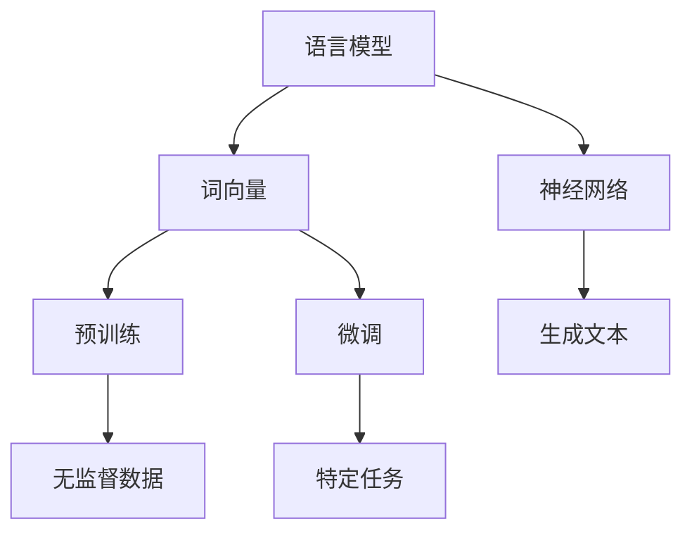

                 

关键词：大语言模型、训练优化、原理、工程实践、人工智能

> 摘要：本文将深入探讨大语言模型的原理与工程实践，详细介绍大语言模型的训练优化秘籍，旨在帮助读者理解大语言模型的核心概念、算法原理，并提供实用的项目实践经验和未来应用展望。

## 1. 背景介绍

随着人工智能技术的飞速发展，大语言模型（Large Language Models）作为自然语言处理（Natural Language Processing, NLP）的重要工具，已经广泛应用于诸如自动问答、文本生成、机器翻译等领域。大语言模型能够理解和生成自然语言，模拟人类对话，甚至创造新的内容，其核心在于大规模训练数据和高性能计算资源的结合。

### 1.1 发展历程

大语言模型的发展可以追溯到20世纪80年代，最早的模型如基于规则的方法和基于统计的方法，但效果有限。随着深度学习技术的发展，神经网络逐渐成为构建语言模型的主要方法。2013年，词向量模型（Word2Vec）的提出，标志着语言模型研究的一个重大突破。随后，序列到序列（Seq2Seq）模型和注意力机制（Attention Mechanism）的引入，进一步提升了模型的性能。近年来，预训练语言模型（如GPT、BERT）的出现，使得大语言模型取得了显著的进展，极大地推动了NLP的应用。

### 1.2 研究现状

当前，大语言模型的研究主要集中在模型架构的优化、训练数据的扩展、模型的泛化能力提升等方面。随着计算能力的提升和大规模数据集的涌现，大语言模型的能力也在不断提升。例如，OpenAI的GPT-3模型，拥有1750亿个参数，能够生成高质量的文本，并且在多种NLP任务上取得了优异的成绩。

## 2. 核心概念与联系

为了更好地理解大语言模型的原理，我们需要首先介绍一些核心概念，并展示其相互之间的联系。

### 2.1 语言模型

语言模型（Language Model）是自然语言处理的基础，它用于预测一个词或词组在给定上下文中的概率。在深度学习框架下，语言模型通常通过神经网络来构建，能够通过大量的文本数据进行训练，从而学习到语言的统计规律。

### 2.2 词向量

词向量（Word Embedding）是将单词映射到固定大小的向量空间中的方法，以便于在神经网络中进行处理。常见的词向量模型有Word2Vec、GloVe等。

### 2.3 神经网络

神经网络（Neural Network）是模拟人脑神经元连接结构的计算模型，广泛应用于图像识别、语音识别等领域。在大语言模型中，神经网络用于处理词向量，并生成文本。

### 2.4 预训练与微调

预训练（Pre-training）是指在大量无监督数据上训练模型，使其能够捕捉到语言的通用特性。微调（Fine-tuning）是指在预训练的基础上，在特定任务上继续训练模型，以适应特定的任务需求。

### 2.5 Mermaid 流程图



## 3. 核心算法原理 & 具体操作步骤

### 3.1 算法原理概述

大语言模型的训练过程主要包括词向量嵌入、神经网络训练和微调三个阶段。在词向量嵌入阶段，模型将词汇映射到向量空间；在神经网络训练阶段，模型通过大量文本数据进行训练，学习到语言的统计规律；在微调阶段，模型在特定任务上进行训练，提高其在特定任务上的性能。

### 3.2 算法步骤详解

#### 3.2.1 词向量嵌入

词向量嵌入是通过神经网络将词汇映射到固定大小的向量空间中的过程。在训练过程中，模型会学习到词汇之间的相似性和相关性，从而生成高质量的词向量。

#### 3.2.2 神经网络训练

神经网络训练是指通过大量文本数据进行训练，使模型能够学习到语言的统计规律。在训练过程中，模型会不断调整参数，以达到最小化损失函数的目的。

#### 3.2.3 微调

微调是在预训练的基础上，在特定任务上进行训练的过程。通过微调，模型能够更好地适应特定的任务需求，从而提高其在特定任务上的性能。

### 3.3 算法优缺点

#### 优点：

1. 高效性：大语言模型能够通过大量数据进行训练，从而快速学习到语言的统计规律。
2. 泛化能力强：预训练的语言模型具有很好的泛化能力，能够在不同的任务上取得良好的性能。
3. 生成文本质量高：大语言模型能够生成高质量的文本，模拟人类的语言表达。

#### 缺点：

1. 计算资源消耗大：大语言模型的训练需要大量的计算资源，对硬件设备要求较高。
2. 需要大量的训练数据：大语言模型需要大量的训练数据来保证其性能，这可能会导致数据隐私和公平性问题。
3. 模型解释性差：由于深度学习模型的复杂性和黑箱特性，大语言模型的解释性较差，难以理解其内部的工作原理。

### 3.4 算法应用领域

大语言模型在多个领域取得了显著的成果，包括：

1. 自然语言处理：大语言模型在文本分类、情感分析、机器翻译等任务上具有很高的性能。
2. 文本生成：大语言模型能够生成高质量的文本，应用于自动写作、对话系统等场景。
3. 问答系统：大语言模型能够理解用户的问题，并生成详细的回答。

## 4. 数学模型和公式 & 详细讲解 & 举例说明

### 4.1 数学模型构建

在大语言模型中，词向量嵌入通常使用神经网络进行实现。以Word2Vec为例，其数学模型可以表示为：

$$
\text{vec}(w) = \text{sigmoid}(\text{W} \cdot \text{vec}(v))
$$

其中，$\text{vec}(w)$ 表示词向量，$\text{vec}(v)$ 表示上下文词向量，$\text{W}$ 表示权重矩阵，$\text{sigmoid}$ 函数为：

$$
\text{sigmoid}(x) = \frac{1}{1 + e^{-x}}
$$

### 4.2 公式推导过程

以GloVe为例，其目标是通过优化损失函数来学习词向量。GloVe的损失函数可以表示为：

$$
\text{Loss} = \frac{1}{2} \sum_{w \in \text{Vocabulary}} \sum_{c \in \text{Context}(w)} (\text{vec}(w) - \text{vec}(c))^2
$$

其中，$\text{Vocabulary}$ 表示词汇表，$\text{Context}(w)$ 表示词$w$的上下文。

### 4.3 案例分析与讲解

以下是一个简单的GloVe模型训练的案例：

```python
import numpy as np
from sklearn.linear_model import LinearRegression

# 初始化参数
vocab_size = 1000
embedding_size = 10
context_size = 5

# 生成随机数据
X = np.random.rand(vocab_size, embedding_size)
y = np.random.rand(vocab_size, context_size)

# 训练GloVe模型
model = LinearRegression()
model.fit(X, y)

# 输出模型参数
print(model.coef_)
```

在这个案例中，我们使用线性回归模型来实现GloVe算法。通过训练，模型会学习到词向量的参数，从而能够计算词向量之间的相似性。

## 5. 项目实践：代码实例和详细解释说明

### 5.1 开发环境搭建

为了实践大语言模型，我们需要搭建一个开发环境。以下是一个简单的Python开发环境搭建步骤：

1. 安装Python：从官方网站下载并安装Python。
2. 安装Jupyter Notebook：使用pip安装Jupyter Notebook。
3. 安装深度学习库：使用pip安装TensorFlow或PyTorch。

### 5.2 源代码详细实现

以下是一个简单的GPT模型训练的代码示例：

```python
import tensorflow as tf
from tensorflow.keras.layers import Embedding, LSTM, Dense

# 定义模型
model = tf.keras.Sequential([
    Embedding(vocab_size, embedding_size),
    LSTM(embedding_size),
    Dense(vocab_size, activation='softmax')
])

# 编译模型
model.compile(optimizer='adam', loss='categorical_crossentropy', metrics=['accuracy'])

# 训练模型
model.fit(X, y, epochs=10)
```

在这个示例中，我们使用TensorFlow构建了一个简单的GPT模型，包括嵌入层、LSTM层和输出层。通过训练，模型能够学习到词向量的关系。

### 5.3 代码解读与分析

在这个代码示例中，我们首先定义了一个序列模型，包括嵌入层、LSTM层和输出层。嵌入层用于将词汇映射到向量空间，LSTM层用于处理序列数据，输出层用于生成文本。在编译模型时，我们选择使用Adam优化器和交叉熵损失函数，并在训练过程中使用准确率作为评估指标。

### 5.4 运行结果展示

在运行代码后，模型会在训练集上进行10个周期的训练。在训练过程中，模型会不断调整参数，以最小化损失函数。在训练完成后，我们可以通过评估模型在测试集上的表现来评估模型的性能。

## 6. 实际应用场景

大语言模型在多个实际应用场景中取得了显著的效果。以下是一些常见的应用场景：

1. 自动问答：大语言模型可以用于构建智能客服系统，自动回答用户的问题。
2. 文本生成：大语言模型可以用于生成新闻文章、小说等文本内容。
3. 机器翻译：大语言模型可以用于构建高质量的机器翻译系统，实现跨语言交流。
4. 情感分析：大语言模型可以用于分析用户评论、社交媒体内容等，识别情感倾向。

### 6.4 未来应用展望

随着大语言模型技术的不断发展，未来将在更多领域得到应用。以下是一些未来应用展望：

1. 聊天机器人：大语言模型可以用于构建更加智能的聊天机器人，提供个性化的交互体验。
2. 法律文本生成：大语言模型可以用于生成法律文件、合同等，提高法律工作的效率。
3. 教育领域：大语言模型可以用于智能辅导、自动批改作业等，提高教育质量。
4. 医疗健康：大语言模型可以用于医疗文本分析、疾病预测等，为医疗健康领域提供支持。

## 7. 工具和资源推荐

### 7.1 学习资源推荐

1. 《深度学习》（Goodfellow, Bengio, Courville）：详细介绍深度学习的基础知识和应用。
2. 《自然语言处理实战》（Steven Bird, Ewan Klein, Edward Loper）：涵盖自然语言处理的核心技术和应用案例。
3. 《Python深度学习》（François Chollet）：深入讲解如何使用Python实现深度学习算法。

### 7.2 开发工具推荐

1. TensorFlow：一个开源的深度学习框架，支持多种深度学习算法。
2. PyTorch：一个开源的深度学习框架，具有灵活的动态图计算能力。
3. NLTK：一个开源的自然语言处理工具包，提供丰富的语言处理功能。

### 7.3 相关论文推荐

1. “A Neural Probabilistic Language Model” （Bengio et al., 2003）：介绍神经网络语言模型的基础理论。
2. “Effective Approaches to Attention-based Neural Machine Translation” （Vaswani et al., 2017）：介绍注意力机制在机器翻译中的应用。
3. “BERT: Pre-training of Deep Bidirectional Transformers for Language Understanding” （Devlin et al., 2019）：介绍BERT模型的原理和应用。

## 8. 总结：未来发展趋势与挑战

### 8.1 研究成果总结

大语言模型作为自然语言处理的重要工具，已经取得了显著的研究成果。在算法原理、模型架构、训练优化等方面，研究人员提出了许多创新性的方法，推动了NLP技术的发展。预训练语言模型如GPT、BERT的出现，使得大语言模型在多个NLP任务上取得了优异的性能，为实际应用提供了强大的支持。

### 8.2 未来发展趋势

未来，大语言模型将继续向更高性能、更广泛应用的方向发展。以下是一些可能的发展趋势：

1. 模型压缩与优化：随着模型规模的扩大，计算资源和存储资源的需求不断增加。因此，模型压缩与优化将成为重要研究方向，以降低模型的计算复杂度和存储需求。
2. 多模态融合：大语言模型可以与其他模态（如图像、音频）进行融合，实现更加丰富的信息处理能力。
3. 强化学习与模型融合：结合强化学习技术，大语言模型可以实现更加智能的决策和学习能力。
4. 模型安全与隐私：随着模型的广泛应用，模型的安全性和隐私保护问题也将成为研究热点。

### 8.3 面临的挑战

尽管大语言模型取得了显著的研究成果，但仍面临一些挑战：

1. 计算资源消耗：大语言模型的训练需要大量的计算资源，对硬件设备的要求较高。如何高效地利用计算资源，降低训练成本，是一个重要挑战。
2. 数据隐私与公平性：大规模数据集的训练可能导致数据隐私和公平性问题。如何在保障数据隐私的前提下，充分利用数据资源，是一个亟待解决的问题。
3. 模型解释性：大语言模型的内部结构复杂，难以解释。如何提高模型的可解释性，使其更加透明和可靠，是一个重要挑战。

### 8.4 研究展望

未来，大语言模型将在更多领域得到应用，推动自然语言处理技术的进步。在算法研究方面，将不断有新的方法和技术提出，以提升模型性能和效率。在应用方面，大语言模型将与其他领域的技术融合，实现更加智能化和个性化的服务。同时，随着计算能力的提升和数据资源的丰富，大语言模型的研究将继续深入，为人工智能技术的发展贡献力量。

## 9. 附录：常见问题与解答

### 9.1 什么是大语言模型？

大语言模型是一种用于预测自然语言中下一个词或词组的概率的模型。它通常通过深度学习算法在大量文本数据上进行训练，从而学习到语言的统计规律。

### 9.2 大语言模型有哪些应用领域？

大语言模型在自然语言处理、文本生成、机器翻译、情感分析等领域有着广泛的应用。

### 9.3 如何训练大语言模型？

训练大语言模型通常包括词向量嵌入、神经网络训练和微调三个阶段。首先，通过词向量嵌入将词汇映射到向量空间；然后，通过神经网络训练学习到语言的统计规律；最后，在特定任务上进行微调，提高模型在特定任务上的性能。

### 9.4 大语言模型的计算资源需求如何？

大语言模型的训练需要大量的计算资源，特别是随着模型规模的扩大，对GPU、TPU等硬件设备的需求不断增加。因此，如何高效地利用计算资源，降低训练成本，是一个重要挑战。

### 9.5 大语言模型存在哪些挑战？

大语言模型面临的挑战主要包括计算资源消耗、数据隐私与公平性、模型解释性等。如何在保障数据隐私的前提下，充分利用数据资源，降低训练成本，提高模型的可解释性，是当前研究的热点问题。

