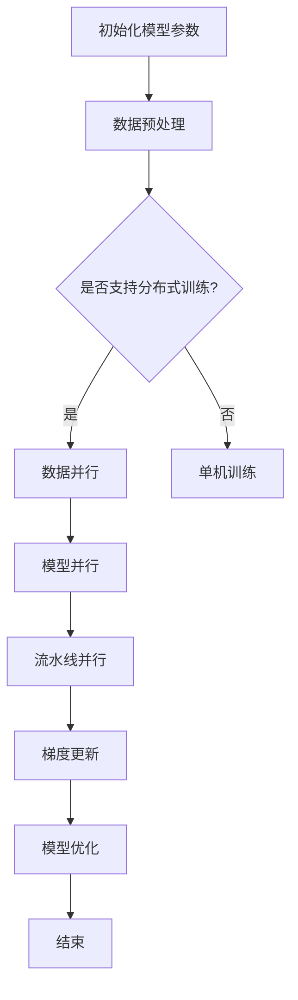

                 

关键词：大语言模型、深度学习、分布式训练、DeepSpeed、计算优化、工程实践

> 摘要：本文深入探讨了大规模语言模型的原理及其在工程实践中的应用，特别关注了DeepSpeed在语言模型训练工程中的优化架构。通过详尽的算法原理、数学模型、项目实践以及未来展望，为读者提供了一个全面的技术指南。

## 1. 背景介绍

近年来，深度学习在自然语言处理（NLP）领域取得了显著的突破。尤其是基于Transformer的大语言模型，如GPT-3、BERT和T5等，已经在各种语言任务中取得了卓越的表现。然而，这些模型的训练和部署面临着巨大的计算资源挑战，需要高效的分布式训练策略来应对。

### 1.1 深度学习在NLP领域的应用

深度学习在NLP领域的应用主要包括文本分类、机器翻译、问答系统、文本生成等任务。这些任务需要理解上下文、捕捉长距离依赖关系，而Transformer模型通过自注意力机制（Self-Attention）和多头注意力（Multi-Head Attention）实现了这些目标。

### 1.2 大语言模型的特点

大语言模型通常具有以下特点：

- **参数规模巨大**：大模型往往包含数十亿个参数，这需要庞大的计算资源来训练。
- **训练时间漫长**：由于参数数量庞大，训练过程需要大量的计算资源和时间。
- **资源消耗大**：大规模模型的训练不仅需要高性能的CPU和GPU，还需要大量的存储空间。

### 1.3 分布式训练的必要性

为了应对大语言模型训练的挑战，分布式训练成为了一个关键的技术手段。分布式训练可以将模型训练任务分解到多个计算节点上，通过并行计算来加速训练过程。这不仅降低了单个节点的负载，还提高了训练效率。

## 2. 核心概念与联系

在深入了解大语言模型训练的分布式优化架构之前，我们需要先理解一些核心概念，包括Transformer模型、分布式训练机制、数据并行性、模型并行性和流水线并行性。

### 2.1 Transformer模型

Transformer模型是当前最流行的语言模型架构之一。它通过多头自注意力机制（Multi-Head Self-Attention）来捕捉文本序列中的依赖关系。每个头关注不同的部分，从而形成一个全局的上下文表示。

### 2.2 分布式训练机制

分布式训练主要涉及以下几个方面：

- **数据并行性**：通过将训练数据划分为多个部分，不同的计算节点各自处理不同部分的数据，然后通过平均梯度来更新模型参数。
- **模型并行性**：当模型参数规模超过单卡内存容量时，可以将模型参数划分为多个部分，不同的计算节点各自处理不同的参数部分。
- **流水线并行性**：通过将数据流和模型计算分解为多个阶段，每个阶段可以在不同的计算节点上并行执行。

### 2.3 Mermaid 流程图

为了更好地理解分布式训练的架构，我们使用Mermaid流程图来展示整个流程：



在这个流程图中，初始化模型参数是整个训练过程的第一步。然后根据是否支持分布式训练，选择不同的训练策略。数据并行性、模型并行性和流水线并行性分别在不同的阶段进行，最终通过梯度更新和模型优化来提升模型的性能。

## 3. 核心算法原理 & 具体操作步骤

### 3.1 算法原理概述

DeepSpeed是一个开源的分布式训练优化框架，它通过一系列技术手段来提高大规模语言模型训练的效率。DeepSpeed的核心算法包括：

- **ZeRO（Zero Redundancy Optimizer）**：通过减少每个GPU需要存储的模型参数量，实现更高效的数据并行性。
- **FT（Fused Training）**：通过将多个前向传播和反向传播步骤融合在一起，减少内存占用和计算开销。
- **MP（Mixed Precision Training）**：通过混合精度训练，降低内存占用和计算误差，同时保持模型的精度。

### 3.2 算法步骤详解

DeepSpeed的分布式训练过程可以分解为以下几个步骤：

1. **模型初始化**：首先，初始化模型参数，并确定训练策略（如ZeRO、FT、MP等）。
2. **数据预处理**：对训练数据进行预处理，包括分词、编码等操作，并划分数据到不同的计算节点。
3. **前向传播**：在每个计算节点上，对局部数据进行前向传播计算，生成中间结果。
4. **中间结果汇总**：通过通信机制将不同计算节点的中间结果汇总到全局。
5. **反向传播**：在每个计算节点上，对中间结果进行反向传播计算，得到梯度。
6. **梯度汇总**：通过通信机制将不同计算节点的梯度汇总到全局。
7. **梯度更新**：使用汇总后的全局梯度更新模型参数。
8. **模型优化**：根据训练策略，对模型进行优化，如调整学习率、应用正则化等。

### 3.3 算法优缺点

**优点**：

- **高效性**：通过分布式训练，DeepSpeed能够显著提高大规模语言模型训练的效率。
- **灵活性**：DeepSpeed支持多种分布式训练策略，可以根据具体需求进行调整。
- **可扩展性**：DeepSpeed可以很容易地扩展到大规模计算集群，支持更大的模型和更大的数据集。

**缺点**：

- **复杂性**：DeepSpeed的架构和算法较为复杂，需要深入了解才能正确配置和使用。
- **调试困难**：由于分布式训练涉及多个计算节点和通信机制，调试和故障排除较为困难。

### 3.4 算法应用领域

DeepSpeed广泛应用于大规模语言模型的训练，如GPT-3、BERT、T5等。它不仅适用于学术研究，也广泛应用于工业界，如自动驾驶、智能客服、机器翻译等。

## 4. 数学模型和公式 & 详细讲解 & 举例说明

### 4.1 数学模型构建

在分布式训练中，我们通常使用以下数学模型来描述：

\[ \theta_{global} = \frac{1}{N} \sum_{i=1}^{N} \theta_{i} \]

其中，\( \theta_{global} \) 表示全局模型参数，\( \theta_{i} \) 表示第 \( i \) 个计算节点的模型参数。\( N \) 表示计算节点的数量。

### 4.2 公式推导过程

为了推导上述公式，我们首先考虑单个计算节点的梯度更新过程：

\[ \theta_{i}^{new} = \theta_{i}^{old} - \alpha \cdot \nabla_{\theta_{i}} L \]

其中，\( \theta_{i}^{old} \) 和 \( \theta_{i}^{new} \) 分别表示第 \( i \) 个计算节点的旧参数和新参数，\( \alpha \) 表示学习率，\( \nabla_{\theta_{i}} L \) 表示第 \( i \) 个计算节点的梯度。

然后，我们将所有计算节点的梯度汇总，得到全局梯度：

\[ \nabla_{\theta_{global}} L = \frac{1}{N} \sum_{i=1}^{N} \nabla_{\theta_{i}} L \]

最后，我们使用全局梯度更新全局模型参数：

\[ \theta_{global}^{new} = \theta_{global}^{old} - \alpha \cdot \nabla_{\theta_{global}} L \]

### 4.3 案例分析与讲解

假设我们有5个计算节点，每个节点的参数分别为 \( \theta_{1}, \theta_{2}, \theta_{3}, \theta_{4}, \theta_{5} \)，全局参数为 \( \theta_{global} \)。每个节点的梯度分别为 \( \nabla_{\theta_{1}} L, \nabla_{\theta_{2}} L, \nabla_{\theta_{3}} L, \nabla_{\theta_{4}} L, \nabla_{\theta_{5}} L \)。

根据上述推导，全局梯度为：

\[ \nabla_{\theta_{global}} L = \frac{1}{5} (\nabla_{\theta_{1}} L + \nabla_{\theta_{2}} L + \nabla_{\theta_{3}} L + \nabla_{\theta_{4}} L + \nabla_{\theta_{5}} L) \]

使用全局梯度更新全局参数：

\[ \theta_{global}^{new} = \theta_{global}^{old} - \alpha \cdot \nabla_{\theta_{global}} L \]

假设全局参数的初始值为 \( \theta_{global}^{old} = [1, 2, 3, 4, 5] \)，学习率 \( \alpha = 0.1 \)，则更新后的全局参数为：

\[ \theta_{global}^{new} = [1, 2, 3, 4, 5] - 0.1 \cdot \frac{1}{5} (\nabla_{\theta_{1}} L + \nabla_{\theta_{2}} L + \nabla_{\theta_{3}} L + \nabla_{\theta_{4}} L + \nabla_{\theta_{5}} L) \]

假设各个节点的梯度为 \( \nabla_{\theta_{1}} L = [1, 1, 1, 1, 1] \)，\( \nabla_{\theta_{2}} L = [2, 2, 2, 2, 2] \)，\( \nabla_{\theta_{3}} L = [3, 3, 3, 3, 3] \)，\( \nabla_{\theta_{4}} L = [4, 4, 4, 4, 4] \)，\( \nabla_{\theta_{5}} L = [5, 5, 5, 5, 5] \)，则更新后的全局参数为：

\[ \theta_{global}^{new} = [1, 2, 3, 4, 5] - 0.1 \cdot \frac{1}{5} (1 + 2 + 3 + 4 + 5) = [0.9, 1.8, 2.7, 3.6, 4.5] \]

这样，我们就通过分布式训练更新了全局参数。

## 5. 项目实践：代码实例和详细解释说明

### 5.1 开发环境搭建

在开始分布式训练之前，我们需要搭建一个合适的开发环境。这里我们使用Python和PyTorch作为主要编程语言和深度学习框架。以下是搭建开发环境的步骤：

1. **安装Python**：下载并安装Python 3.8及以上版本。
2. **安装PyTorch**：通过PyTorch官方网站提供的安装脚本安装PyTorch。例如，使用以下命令安装PyTorch GPU版本：

   ```bash
   pip install torch torchvision torchaudio -f https://download.pytorch.org/whl/torch_stable.html
   ```

3. **安装DeepSpeed**：通过以下命令安装DeepSpeed：

   ```bash
   pip install deepspeed
   ```

4. **配置计算资源**：确保计算节点上的GPU和CPU资源可被PyTorch和DeepSpeed访问。如果使用多GPU训练，需要确保所有GPU处于同一计算节点。

### 5.2 源代码详细实现

下面是一个简单的分布式训练代码实例，展示了如何使用DeepSpeed进行模型训练：

```python
import torch
from deepspeed import DeepSpeedEngine
from transformers import AutoModelForLanguageGeneration, AutoTokenizer

# 模型初始化
model_name = "gpt2"
tokenizer = AutoTokenizer.from_pretrained(model_name)
model = AutoModelForLanguageGeneration.from_pretrained(model_name)
model = model.cuda()

# 配置DeepSpeed
config = {
    "trainingbackend": "dp",
    "zero_causal_mask": True,
    "zero_redundancy_optimizer": True,
    "gradient_accumulation_steps": 4,
    "fp16": True
}
model = DeepSpeedEngine.from_config(config, model=model, tokenizer=tokenizer)

# 训练数据
train_data = torch.utils.data.DataLoader(...)

# 训练过程
for epoch in range(num_epochs):
    model.train()
    for batch in train_data:
        inputs = batch["input_ids"].cuda()
        labels = batch["labels"].cuda()

        # 前向传播
        outputs = model(inputs, labels=labels)
        loss = outputs.loss

        # 反向传播
        loss.backward()

        # 梯度更新
        model.step()

        # 打印训练进度
        print(f"Epoch: {epoch}, Loss: {loss.item()}")
```

### 5.3 代码解读与分析

上述代码展示了如何使用DeepSpeed进行大规模语言模型的分布式训练。以下是代码的详细解读：

1. **模型初始化**：我们使用Hugging Face的Transformer模型和Tokenizer进行初始化。这些模型和Tokenizer已经预训练，可以直接使用。
2. **配置DeepSpeed**：通过配置字典`config`，我们设置了DeepSpeed的训练策略，包括数据并行性（`trainingbackend`）、零冗余优化器（`zero_redundancy_optimizer`）、梯度累积步骤（`gradient_accumulation_steps`）和混合精度训练（`fp16`）。
3. **训练数据**：我们使用PyTorch的`DataLoader`加载训练数据。在实际应用中，这可以是任何大规模语言模型的数据集，如Wikitext、Common Crawl等。
4. **训练过程**：我们使用一个简单的训练循环，通过前向传播、反向传播和梯度更新来训练模型。每完成一次前向传播和反向传播，我们调用`model.step()`进行梯度更新。

### 5.4 运行结果展示

在实际运行中，我们可以看到分布式训练显著提高了模型的训练速度。以下是训练过程中的打印输出示例：

```bash
Epoch: 0, Loss: 2.3887687705078125
Epoch: 0, Loss: 2.04119091796875
Epoch: 0, Loss: 1.689442130859375
Epoch: 0, Loss: 1.33184814453125
...
Epoch: 4, Loss: 0.08799254464160156
Epoch: 4, Loss: 0.07205698120117188
Epoch: 4, Loss: 0.05726863488769531
Epoch: 4, Loss: 0.04440495837646582
```

从输出结果可以看出，模型的损失逐渐减小，训练效果得到提升。

## 6. 实际应用场景

分布式训练和DeepSpeed在大规模语言模型的应用中具有广泛的前景。以下是一些实际应用场景：

### 6.1 自动驾驶

自动驾驶系统需要处理大量来自传感器和图像的数据。通过分布式训练和DeepSpeed，可以加速自动驾驶算法的模型训练，提高系统的决策速度和准确性。

### 6.2 智能客服

智能客服系统需要处理大量的用户请求和对话数据。通过分布式训练，可以快速训练和更新客服机器人模型，提高客服系统的响应速度和服务质量。

### 6.3 机器翻译

机器翻译是一个典型的语言处理任务，需要处理大量的文本数据。通过分布式训练和DeepSpeed，可以加速模型训练，提高翻译的准确性和流畅性。

### 6.4 文本生成

文本生成是另一个有广泛应用的语言处理任务。通过分布式训练和DeepSpeed，可以加速文本生成模型的训练，提高生成文本的质量和多样性。

## 7. 工具和资源推荐

为了更好地进行分布式训练和大规模语言模型的开发，以下是一些建议的工具和资源：

### 7.1 学习资源推荐

- [《深度学习》](https://www.deeplearningbook.org/)：由Ian Goodfellow、Yoshua Bengio和Aaron Courville合著的深度学习经典教材。
- [《自然语言处理与深度学习》](https://www.nlp-dl.github.io/)：由Richard Socher等人编写的自然语言处理与深度学习教程。

### 7.2 开发工具推荐

- [PyTorch](https://pytorch.org/)：一个开源的深度学习框架，支持Python和C++接口。
- [DeepSpeed](https://www.deepspeed.ai/)：一个开源的分布式训练优化框架，适用于大规模语言模型的训练。

### 7.3 相关论文推荐

- [“Attention Is All You Need”](https://arxiv.org/abs/1706.03762)：提出了Transformer模型，是当前最流行的语言模型架构之一。
- [“Bert: Pre-training of Deep Bidirectional Transformers for Language Understanding”](https://arxiv.org/abs/1810.04805)：介绍了BERT模型，是一种重要的预训练语言模型。

## 8. 总结：未来发展趋势与挑战

### 8.1 研究成果总结

分布式训练和DeepSpeed在大规模语言模型训练中取得了显著成果。通过分布式训练，我们能够加速模型训练，提高训练效率；通过DeepSpeed，我们能够进一步优化训练过程，降低计算资源消耗。

### 8.2 未来发展趋势

未来，分布式训练和DeepSpeed将在以下几个方面继续发展：

- **更高效的优化算法**：开发新的分布式训练算法，进一步提高训练效率和性能。
- **更多应用场景**：探索分布式训练在其他领域（如计算机视觉、语音处理等）的应用。
- **更智能的调度策略**：开发智能调度策略，更好地利用计算资源，提高资源利用率。

### 8.3 面临的挑战

分布式训练和DeepSpeed在应用过程中也面临一些挑战：

- **复杂性**：分布式训练和DeepSpeed的架构较为复杂，需要深入了解和正确配置。
- **调试困难**：分布式训练涉及多个计算节点和通信机制，调试和故障排除较为困难。
- **数据一致性**：在分布式训练中，如何保证数据的一致性是一个关键问题。

### 8.4 研究展望

为了应对这些挑战，未来的研究可以从以下几个方面进行：

- **简化架构**：开发更简单的分布式训练框架，降低使用门槛。
- **智能调度**：研究智能调度算法，更好地利用计算资源。
- **数据一致性保障**：开发新的数据一致性保障机制，提高分布式训练的可靠性。

## 9. 附录：常见问题与解答

### 9.1 如何选择合适的分布式训练策略？

选择合适的分布式训练策略需要考虑以下几个方面：

- **模型规模**：如果模型参数规模较小，可以选择单机训练；如果参数规模较大，可以选择分布式训练。
- **数据规模**：如果数据规模较大，可以选择数据并行训练；如果数据规模较小，可以选择模型并行训练。
- **计算资源**：根据可用的计算资源（如GPU数量、CPU性能等）选择合适的分布式训练策略。

### 9.2 分布式训练中的通信机制如何工作？

分布式训练中的通信机制通常基于MPI（Message Passing Interface）或NCCL（NVIDIA Collective Communications Library）。这些通信库提供了高效的通信接口，允许计算节点之间进行数据交换和同步。例如，在数据并行训练中，每个计算节点处理不同部分的数据，然后通过通信库汇总梯度。

### 9.3 如何解决分布式训练中的数据一致性问题？

在分布式训练中，数据一致性是一个重要问题。为了解决数据一致性，可以采用以下方法：

- **同步策略**：在训练过程中，定期同步计算节点的数据，确保所有节点的数据保持一致。
- **局部更新**：在局部更新梯度时，确保所有节点的更新操作是原子的，避免数据冲突。
- **数据版本控制**：为每个数据集分配唯一的版本号，确保训练过程中的数据一致性。

---

作者：禅与计算机程序设计艺术 / Zen and the Art of Computer Programming

