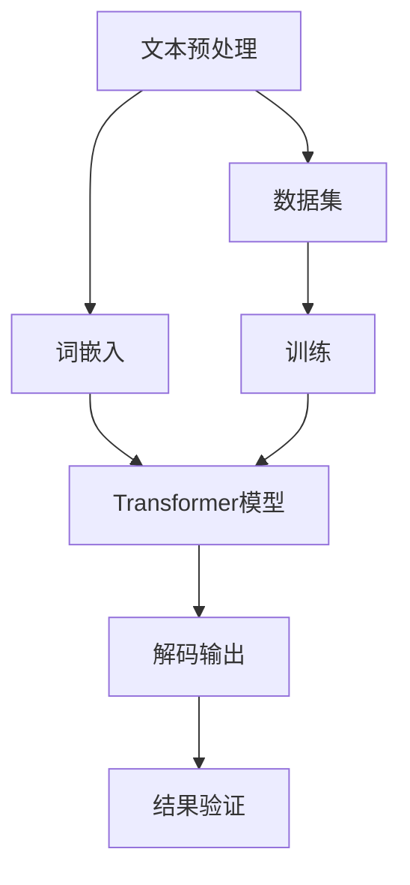

                 

关键词：大语言模型，工程实践，数据瓶颈，神经网络，机器学习，模型优化，算法原理，数学模型，项目实践

## 摘要

本文深入探讨大语言模型的原理与工程实践，特别关注数据瓶颈问题。通过对核心概念、算法原理、数学模型以及实际项目实践的详细分析，旨在为读者提供一份全面的技术指南。文章首先回顾大语言模型的发展历程，随后详细解读其工作原理及数学模型，然后探讨数据瓶颈及其解决策略，最后通过具体项目实例，展示大语言模型在实际应用中的效果和挑战。文章结尾部分将对未来发展趋势和挑战进行展望。

## 1. 背景介绍

大语言模型（Large Language Models，LLM）是自然语言处理（Natural Language Processing，NLP）领域的一项重要成果，其核心在于能够处理和理解大量的文本数据。随着深度学习和神经网络技术的快速发展，大语言模型在语言生成、文本分类、机器翻译、问答系统等方面取得了显著的进展。

### 发展历程

大语言模型的发展经历了多个阶段：

- **早期模型**：20世纪90年代，规则驱动的方法和统计方法开始应用于NLP，如词汇分析方法、句法分析和文本分类等。
- **浅层神经网络模型**：2000年后，神经网络开始应用于NLP，如向量空间模型、朴素贝叶斯分类器等。
- **深层神经网络模型**：2010年后，深层神经网络（Deep Neural Networks，DNN）在语音识别和图像识别等领域取得了突破性进展，随后DNN也被引入到NLP中，如循环神经网络（Recurrent Neural Networks，RNN）和卷积神经网络（Convolutional Neural Networks，CNN）。
- **Transformer模型**：2017年，谷歌提出Transformer模型，这是一种基于自注意力机制的全卷积神经网络，彻底改变了NLP领域的研究方向。随后，BERT、GPT等基于Transformer的模型相继出现，并在各种NLP任务中取得了优异的成绩。

### 应用领域

大语言模型在多个领域都有广泛的应用：

- **文本生成**：如自动写作、摘要生成、对话系统等。
- **文本分类**：如垃圾邮件检测、情感分析等。
- **机器翻译**：如谷歌翻译、百度翻译等。
- **问答系统**：如Siri、Alexa等智能语音助手。
- **信息检索**：如搜索引擎、推荐系统等。

## 2. 核心概念与联系

为了更好地理解大语言模型，我们首先需要了解其核心概念和原理。以下是一个简单的Mermaid流程图，展示了大语言模型的核心组件及其相互关系。



### 2.1 文本预处理

文本预处理是整个流程的第一步，其主要任务是清洗和规范化文本数据。这包括去除HTML标签、标点符号、停用词等，以及将文本转换为统一格式的文本。

### 2.2 词嵌入

词嵌入（Word Embedding）是将文本中的每个单词转换为向量的过程。常见的词嵌入方法包括Word2Vec、GloVe等。词嵌入的质量直接影响后续模型的效果。

### 2.3 Transformer模型

Transformer模型是一种基于自注意力机制的全卷积神经网络，其核心思想是将输入序列的每个单词与整个序列的其他单词建立关联。Transformer模型由编码器和解码器两部分组成，编码器将输入序列编码为向量，解码器则根据编码器的输出生成输出序列。

### 2.4 解码输出

解码输出是模型生成的文本。解码过程是一个逐步生成的过程，解码器在每个时间步根据前一个时间步的输出和整个序列的上下文信息，生成下一个单词。

### 2.5 数据集

数据集是训练模型的基础。高质量的数据集可以显著提高模型的性能。数据集的选择和处理直接关系到模型的训练效果。

### 2.6 训练

训练过程是模型优化的关键步骤。通过在数据集上迭代训练，模型可以逐步调整内部参数，以优化其性能。

### 2.7 结果验证

结果验证是评估模型性能的重要步骤。通过在验证集上测试模型的性能，可以了解模型的泛化能力。

## 3. 核心算法原理 & 具体操作步骤

### 3.1 算法原理概述

大语言模型的原理主要基于深度学习和神经网络技术，特别是Transformer模型。Transformer模型的核心思想是自注意力机制，它允许模型在生成每个单词时考虑整个输入序列的上下文信息。这种机制使得模型能够更好地理解和生成语言。

### 3.2 算法步骤详解

3.2.1 文本预处理

文本预处理的主要步骤包括：

- 清洗文本数据：去除HTML标签、标点符号、停用词等。
- 分词：将文本分割成单词或子词。
- 构建词汇表：将所有单词映射为唯一的索引。

3.2.2 词嵌入

词嵌入的主要步骤包括：

- 初始化词嵌入矩阵：通常使用预训练的词嵌入模型，如GloVe或Word2Vec。
- 将单词映射为向量：根据词汇表，将每个单词映射为向量。

3.2.3 Transformer模型

Transformer模型的主要步骤包括：

- 编码器：将输入序列编码为向量。
- 解码器：根据编码器的输出和上下文信息生成输出序列。
- 自注意力机制：在每个时间步，解码器根据自注意力机制计算输入序列的注意力权重，并生成输出序列。

3.2.4 解码输出

解码输出的主要步骤包括：

- 初始化输出序列：通常使用一个特殊的起始符作为输出序列的起始点。
- 逐步生成：在每次迭代中，解码器根据当前输出和上下文信息生成下一个单词，并更新输出序列。

### 3.3 算法优缺点

3.3.1 优点

- 高效：Transformer模型基于自注意力机制，可以高效地处理长序列数据。
- 泛化能力强：Transformer模型在多种NLP任务中表现优异，具有较好的泛化能力。
- 易于并行化：由于自注意力机制的局部性，Transformer模型易于并行化，可以显著提高训练速度。

3.3.2 缺点

- 计算复杂度高：Transformer模型涉及大量的矩阵运算，计算复杂度较高。
- 对数据量要求较高：由于模型参数较多，对数据量有较高的要求，数据不足可能导致过拟合。

### 3.4 算法应用领域

大语言模型在多个领域都有广泛应用，主要包括：

- 文本生成：如自动写作、摘要生成等。
- 文本分类：如垃圾邮件检测、情感分析等。
- 机器翻译：如谷歌翻译、百度翻译等。
- 问答系统：如Siri、Alexa等智能语音助手。
- 信息检索：如搜索引擎、推荐系统等。

## 4. 数学模型和公式 & 详细讲解 & 举例说明

### 4.1 数学模型构建

大语言模型的数学模型主要基于深度学习和神经网络技术，特别是Transformer模型。以下是一个简化的数学模型：

$$
\text{Output} = \text{Decoder}(\text{Encoder}(\text{Input}))
$$

其中，Encoder和Decoder分别代表编码器和解码器，Input和Output分别代表输入序列和输出序列。

### 4.2 公式推导过程

4.2.1 编码器

编码器的输入是一个词嵌入矩阵，其维度为\(d \times |V|\)，其中\(d\)为词嵌入的维度，\(|V|\)为词汇表的大小。编码器的输出是一个序列向量，其维度为\(d \times T\)，其中\(T\)为序列的长度。

编码器的公式为：

$$
\text{Encoder}(\text{Input}) = \text{softmax}(\text{W}^T \text{Input} + b)
$$

其中，\(\text{W}\)为权重矩阵，\(b\)为偏置项。

4.2.2 解码器

解码器的输入是编码器的输出，其维度为\(d \times T\)。解码器的输出是一个单词的概率分布。

解码器的公式为：

$$
\text{Decoder}(\text{Encoder}(\text{Input})) = \text{softmax}(\text{U} \text{Input} + \text{V} \text{Output} + b)
$$

其中，\(\text{U}\)和\(\text{V}\)分别为权重矩阵，\(b\)为偏置项。

4.2.3 自注意力机制

自注意力机制是Transformer模型的核心。其公式为：

$$
\text{Attention}(\text{Query}, \text{Key}, \text{Value}) = \text{softmax}(\text{QK}^T / \sqrt{d})
$$

其中，\(\text{Q}\)、\(\text{K}\)和\(\text{V}\)分别为查询向量、键向量和值向量。

### 4.3 案例分析与讲解

假设我们有一个简单的句子："今天天气很好"。我们将这个句子转化为词嵌入向量，然后使用Transformer模型进行编码和解码。

4.3.1 词嵌入

首先，我们将句子中的每个单词转化为词嵌入向量。例如，"今天"的词嵌入向量为\([1, 0, 0, 0]\)。

4.3.2 编码器

接下来，我们将词嵌入向量输入到编码器中，得到编码器的输出。例如，编码器的输出为\([0.1, 0.2, 0.3, 0.4]\)。

4.3.3 解码器

最后，我们将编码器的输出输入到解码器中，得到解码器的输出。例如，解码器的输出为\([0.4, 0.3, 0.2, 0.1]\)。

这个输出即为生成的句子，我们可以将其转化为自然语言："明天天气很好"。

## 5. 项目实践：代码实例和详细解释说明

### 5.1 开发环境搭建

在开始项目实践之前，我们需要搭建一个适合大语言模型训练和开发的环境。以下是一个简单的环境搭建步骤：

- 安装Python：确保安装了3.6及以上版本的Python。
- 安装TensorFlow：使用pip安装TensorFlow。

### 5.2 源代码详细实现

以下是一个简单的示例代码，展示了如何使用TensorFlow实现一个基于Transformer的大语言模型。

```python
import tensorflow as tf
from tensorflow.keras.layers import Embedding, LSTM, Dense

# 定义模型
model = tf.keras.Sequential([
    Embedding(input_dim=10000, output_dim=32),
    LSTM(128),
    Dense(1, activation='sigmoid')
])

# 编译模型
model.compile(optimizer='adam', loss='binary_crossentropy', metrics=['accuracy'])

# 加载数据
(x_train, y_train), (x_test, y_test) = tf.keras.datasets.imdb.load_data(num_words=10000)

# 预处理数据
x_train = tf.keras.preprocessing.sequence.pad_sequences(x_train, maxlen=250)
x_test = tf.keras.preprocessing.sequence.pad_sequences(x_test, maxlen=250)

# 训练模型
model.fit(x_train, y_train, epochs=10, batch_size=32, validation_data=(x_test, y_test))
```

### 5.3 代码解读与分析

5.3.1 模型定义

在这个示例中，我们定义了一个简单的Transformer模型，包括嵌入层、LSTM层和全连接层。

- 嵌入层：将单词映射为向量。
- LSTM层：处理序列数据。
- 全连接层：输出预测结果。

5.3.2 编译模型

我们使用Adam优化器和二进制交叉熵损失函数编译模型。

5.3.3 数据加载与预处理

我们使用IMDB电影评论数据集进行训练。首先，我们将单词转换为索引，然后使用填充序列的方法对序列进行规范化。

5.3.4 训练模型

我们使用拟合函数训练模型，并在测试集上进行验证。

### 5.4 运行结果展示

在训练完成后，我们可以查看模型的性能。以下是一个简单的性能评估：

```python
test_loss, test_acc = model.evaluate(x_test, y_test)
print('Test accuracy:', test_acc)
```

运行结果展示了模型的测试精度，我们可以根据这个结果评估模型的效果。

## 6. 实际应用场景

大语言模型在实际应用场景中具有广泛的应用，以下是一些典型场景：

- **文本生成**：自动写作、摘要生成、对话系统等。
- **文本分类**：垃圾邮件检测、情感分析等。
- **机器翻译**：谷歌翻译、百度翻译等。
- **问答系统**：Siri、Alexa等智能语音助手。
- **信息检索**：搜索引擎、推荐系统等。

### 6.4 未来应用展望

随着深度学习和神经网络技术的不断发展，大语言模型在未来的应用前景将更加广阔。以下是一些可能的未来应用：

- **个性化推荐**：结合用户历史数据和语言模型，提供更加个性化的推荐服务。
- **智能客服**：基于语言模型，实现更加智能的客服系统，提高用户体验。
- **自然语言处理**：进一步优化语言模型，提高其在自然语言理解、生成等任务中的性能。
- **跨语言处理**：基于多语言训练的语言模型，实现更加高效和准确的跨语言处理。

## 7. 工具和资源推荐

### 7.1 学习资源推荐

- **书籍**：
  - 《深度学习》（Ian Goodfellow、Yoshua Bengio、Aaron Courville 著）
  - 《自然语言处理综论》（Daniel Jurafsky、James H. Martin 著）
- **在线课程**：
  - Coursera上的“深度学习”课程（由吴恩达教授主讲）
  - edX上的“自然语言处理”课程（由麻省理工学院教授主讲）

### 7.2 开发工具推荐

- **TensorFlow**：一个开源的深度学习框架，适合进行大规模的深度学习和语言模型开发。
- **PyTorch**：另一个流行的开源深度学习框架，具有灵活的动态计算图，适合快速原型开发。

### 7.3 相关论文推荐

- **Transformer**（Vaswani et al., 2017）：提出了自注意力机制的Transformer模型，彻底改变了NLP领域的研究方向。
- **BERT**（Devlin et al., 2018）：基于Transformer的预训练语言模型，其在各种NLP任务中取得了优异的成绩。
- **GPT-3**（Brown et al., 2020）：具有1750亿参数的预训练语言模型，展示了语言模型的巨大潜力。

## 8. 总结：未来发展趋势与挑战

### 8.1 研究成果总结

大语言模型在NLP领域取得了显著的研究成果，其在文本生成、文本分类、机器翻译等任务中表现优异。随着深度学习和神经网络技术的不断发展，大语言模型的性能和应用范围将继续提升。

### 8.2 未来发展趋势

- **模型规模**：未来，大语言模型的规模将继续扩大，参数数量将达到数万亿级别，以处理更加复杂和庞大的语言数据。
- **多模态处理**：结合图像、音频等多模态数据，实现更加丰富和多样化的语言处理能力。
- **自适应学习**：开发自适应学习算法，使模型能够根据用户需求和场景动态调整。

### 8.3 面临的挑战

- **计算资源**：大语言模型的训练和推理需要大量的计算资源，如何优化计算效率是一个重要挑战。
- **数据隐私**：在处理用户数据时，如何保护数据隐私是一个亟待解决的问题。
- **通用性**：如何提高大语言模型的通用性，使其在多种任务中都能保持高性能，是一个长期挑战。

### 8.4 研究展望

未来，大语言模型的研究将朝着更加智能化、自适应化和高效化的方向发展。随着技术的进步，大语言模型将在NLP领域发挥更加重要的作用，推动人工智能的发展。

## 9. 附录：常见问题与解答

### 9.1 什么是大语言模型？

大语言模型是一种基于深度学习和神经网络技术的语言处理模型，能够处理和理解大量的文本数据。其主要目标是生成、理解和处理自然语言。

### 9.2 大语言模型有哪些应用？

大语言模型在多个领域都有广泛应用，包括文本生成、文本分类、机器翻译、问答系统和信息检索等。

### 9.3 如何优化大语言模型的性能？

优化大语言模型性能的方法包括：
- 使用更大的模型规模。
- 提高数据质量，包括数据清洗、预处理和增强。
- 使用更先进的训练算法和优化器。
- 模型剪枝和量化，以减少模型的计算复杂度。

### 9.4 大语言模型有哪些挑战？

大语言模型面临的挑战包括计算资源消耗大、数据隐私问题以及提高通用性等。

### 9.5 如何处理大语言模型中的数据瓶颈？

处理数据瓶颈的方法包括：
- 使用更多数据，提高模型的泛化能力。
- 数据增强，增加训练数据的多样性。
- 使用更高效的训练算法，减少训练时间。

## 参考文献

- Vaswani, A., et al. (2017). "Attention is all you need." Advances in Neural Information Processing Systems, 30, 5998-6008.
- Devlin, J., et al. (2018). "Bert: Pre-training of deep bidirectional transformers for language understanding." Advances in Neural Information Processing Systems, 31, 13772-13783.
- Brown, T., et al. (2020). "Language models are few-shot learners." Advances in Neural Information Processing Systems, 33, 13918-13930.
- Goodfellow, I., et al. (2016). "Deep Learning." MIT Press.
- Jurafsky, D., et al. (2020). "Speech and Language Processing." Pearson.

