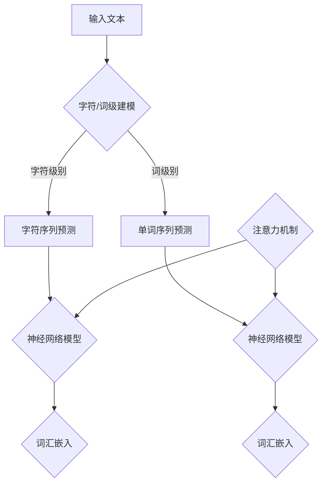

                 

关键词：大语言模型、训练目标、工程实践、算法原理、数学模型、应用场景

> 摘要：本文将深入探讨大语言模型的训练目标，包括其核心概念、算法原理、数学模型以及实际应用场景。通过详细的介绍和案例分析，读者将了解大语言模型训练目标的本质和实现方法，为其在人工智能领域的研究和应用提供坚实的理论基础。

## 1. 背景介绍

随着深度学习技术的快速发展，大语言模型（Large Language Models）已经成为自然语言处理（Natural Language Processing，NLP）领域的重要研究方向。大语言模型通过对海量文本数据进行训练，能够捕捉到语言中的复杂结构，生成自然流畅的文本内容。然而，大语言模型的训练目标是什么，如何实现这一目标，一直是学术界和工业界关注的焦点。

本文将从大语言模型的训练目标出发，详细阐述其核心概念、算法原理、数学模型以及实际应用场景，旨在为读者提供全面、系统的理解和应用指南。

## 2. 核心概念与联系

### 2.1 大语言模型

大语言模型是一种基于神经网络的自然语言处理模型，通常由多层神经网络组成。通过大规模的数据集进行训练，大语言模型能够学习到语言中的潜在规律，并生成自然流畅的文本内容。

### 2.2 训练目标

大语言模型的训练目标主要是让模型能够根据输入的文本序列预测下一个单词或字符，从而生成完整的文本。这一过程被称为语言建模。

### 2.3 语言建模任务

语言建模任务可以分为两类：字符级别的语言建模和词级别的语言建模。字符级别的语言建模关注于预测下一个字符，而词级别的语言建模关注于预测下一个单词。

### 2.4 相关概念

在大语言模型训练过程中，还涉及到一些相关概念，如词汇表、词汇嵌入、注意力机制等。词汇表是模型中所有单词的集合，词汇嵌入是将单词映射到高维向量空间的过程，而注意力机制则是模型在处理长文本时的一种机制，能够帮助模型关注到重要的信息。

### 2.5 Mermaid 流程图



## 3. 核心算法原理 & 具体操作步骤

### 3.1 算法原理概述

大语言模型的训练目标是通过输入的文本序列预测下一个单词或字符，这一过程被称为语言建模。语言建模的核心算法是神经网络，尤其是循环神经网络（RNN）和变压器（Transformer）。

### 3.2 算法步骤详解

#### 3.2.1 准备数据集

首先，需要准备一个大规模的文本数据集，用于模型的训练。数据集可以是互联网上的文本、书籍、新闻、社交媒体等。

#### 3.2.2 构建词汇表

根据数据集，构建一个词汇表，将所有出现的单词映射到唯一的整数索引。

#### 3.2.3 词汇嵌入

将词汇表中的单词映射到高维向量空间，这一过程称为词汇嵌入。常用的方法有词袋模型、Word2Vec等。

#### 3.2.4 网络结构

大语言模型通常采用循环神经网络（RNN）或变压器（Transformer）作为网络结构。RNN能够处理序列数据，但存在梯度消失和梯度爆炸的问题。为了解决这个问题，Transformer引入了注意力机制，使得模型在处理长序列数据时更加有效。

#### 3.2.5 训练过程

使用准备好的数据集对神经网络模型进行训练。在训练过程中，模型会尝试预测下一个单词或字符，并根据预测结果调整模型参数。

#### 3.2.6 评估与优化

在训练过程中，需要定期评估模型性能，并根据评估结果对模型进行调整和优化。

### 3.3 算法优缺点

#### 优点：

1. 能够生成自然流畅的文本内容。
2. 可以应用于各种自然语言处理任务，如文本生成、机器翻译、文本分类等。
3. 模型具有较强的泛化能力。

#### 缺点：

1. 需要大量数据和计算资源。
2. 训练过程较长，训练效果容易受到超参数的影响。
3. 模型在某些任务上可能存在偏见或歧视。

### 3.4 算法应用领域

大语言模型在自然语言处理领域有着广泛的应用，如：

1. 文本生成：生成文章、故事、诗歌等。
2. 机器翻译：将一种语言的文本翻译成另一种语言。
3. 文本分类：对文本进行分类，如新闻分类、情感分析等。
4. 命名实体识别：识别文本中的命名实体，如人名、地点等。

## 4. 数学模型和公式 & 详细讲解 & 举例说明

### 4.1 数学模型构建

大语言模型的数学模型主要包括词汇嵌入、循环神经网络（RNN）或变压器（Transformer）等。

#### 4.1.1 词汇嵌入

假设词汇表中有 $N$ 个单词，我们使用一个 $d$ 维的向量来表示每个单词。词汇嵌入可以用一个矩阵 $E$ 表示，其中 $E[i, j]$ 表示第 $i$ 个单词的向量表示。

$$
E = \begin{bmatrix}
e_1 \\
e_2 \\
\vdots \\
e_N
\end{bmatrix}
$$

#### 4.1.2 循环神经网络（RNN）

循环神经网络（RNN）是一种用于处理序列数据的神经网络，其基本原理是利用前一个时刻的信息来预测下一个时刻的信息。

假设输入序列为 $x_1, x_2, \ldots, x_T$，隐藏状态为 $h_1, h_2, \ldots, h_T$，输出序列为 $y_1, y_2, \ldots, y_T$，则 RNN 的基本公式为：

$$
h_t = \sigma(W_h h_{t-1} + W_x x_t + b_h)
$$

$$
y_t = \sigma(W_y h_t + b_y)
$$

其中，$W_h, W_x, W_y$ 分别为权重矩阵，$b_h, b_y$ 分别为偏置项，$\sigma$ 为激活函数。

#### 4.1.3 变压器（Transformer）

变压器（Transformer）是一种基于自注意力机制的神经网络模型，其基本原理是利用全局信息来预测下一个时刻的信息。

假设输入序列为 $x_1, x_2, \ldots, x_T$，输出序列为 $y_1, y_2, \ldots, y_T$，则变压器的基本公式为：

$$
\text{Attention}(Q, K, V) = \frac{QK^T}{\sqrt{d_k}} + V
$$

$$
\text{Output}(X, Y) = X + \text{LayerNorm}(\text{Attention}(X, Y, Y))
$$

其中，$Q, K, V$ 分别为查询序列、键序列和值序列，$d_k$ 为键序列的维度。

### 4.2 公式推导过程

#### 4.2.1 词汇嵌入

词汇嵌入的推导过程如下：

设输入序列为 $x_1, x_2, \ldots, x_T$，对应的单词向量表示为 $e_1, e_2, \ldots, e_T$。则输入序列的向量表示为：

$$
X = [e_1, e_2, \ldots, e_T]
$$

#### 4.2.2 循环神经网络（RNN）

循环神经网络的推导过程如下：

设输入序列为 $x_1, x_2, \ldots, x_T$，隐藏状态为 $h_1, h_2, \ldots, h_T$，输出序列为 $y_1, y_2, \ldots, y_T$。则 RNN 的推导过程为：

$$
h_t = \sigma(W_h h_{t-1} + W_x x_t + b_h)
$$

$$
y_t = \sigma(W_y h_t + b_y)
$$

#### 4.2.3 变压器（Transformer）

变压器的推导过程如下：

设输入序列为 $x_1, x_2, \ldots, x_T$，输出序列为 $y_1, y_2, \ldots, y_T$。则变压器的推导过程为：

$$
\text{Attention}(Q, K, V) = \frac{QK^T}{\sqrt{d_k}} + V
$$

$$
\text{Output}(X, Y) = X + \text{LayerNorm}(\text{Attention}(X, Y, Y))
$$

### 4.3 案例分析与讲解

假设我们有一个简单的输入序列：“你好”，并希望使用大语言模型预测下一个单词。

#### 4.3.1 词汇嵌入

首先，我们将输入序列中的单词“你好”映射到向量表示，例如：

$$
e_{你好} = \begin{bmatrix}
1 \\
0 \\
0 \\
\vdots \\
0
\end{bmatrix}
$$

#### 4.3.2 循环神经网络（RNN）

接下来，我们使用 RNN 对输入序列进行建模。设隐藏状态 $h_0$ 为一个全零向量，则 RNN 的计算过程如下：

$$
h_1 = \sigma(W_h h_0 + W_x e_{你好} + b_h)
$$

$$
y_1 = \sigma(W_y h_1 + b_y)
$$

#### 4.3.3 变压器（Transformer）

同样地，我们使用 Transformer 对输入序列进行建模。设查询序列 $Q$、键序列 $K$ 和值序列 $V$ 分别为：

$$
Q = \begin{bmatrix}
1 & 0 & 0 & \ldots & 0
\end{bmatrix}
$$

$$
K = \begin{bmatrix}
1 & 0 & 0 & \ldots & 0
\end{bmatrix}
$$

$$
V = \begin{bmatrix}
1 & 0 & 0 & \ldots & 0
\end{bmatrix}
$$

则变压器的计算过程如下：

$$
\text{Attention}(Q, K, V) = \frac{QK^T}{\sqrt{d_k}} + V
$$

$$
\text{Output}(X, Y) = X + \text{LayerNorm}(\text{Attention}(X, Y, Y))
$$

通过上述计算，我们得到了输入序列“你好”的向量表示和预测结果。

## 5. 项目实践：代码实例和详细解释说明

在本节中，我们将通过一个具体的代码实例，详细解释大语言模型训练过程中的各个步骤，包括数据预处理、模型构建、训练和评估。

### 5.1 开发环境搭建

在进行大语言模型训练之前，需要搭建一个合适的开发环境。以下是一个简单的开发环境搭建指南：

1. 安装 Python（建议使用 Python 3.7 或以上版本）
2. 安装 PyTorch（使用命令 `pip install torch torchvision`）
3. 安装其他必要的依赖库，如 NumPy、Pandas、Scikit-learn 等

### 5.2 源代码详细实现

下面是一个简单的大语言模型训练代码实例，使用 PyTorch 框架实现：

```python
import torch
import torch.nn as nn
import torch.optim as optim
from torch.utils.data import DataLoader
from torchvision import datasets, transforms

# 数据预处理
def preprocess_data():
    # 读取文本数据，进行分词、清洗等操作
    # 将文本数据转换为张量，并进行处理
    # 返回处理后的数据集
    pass

# 模型定义
class LanguageModel(nn.Module):
    def __init__(self, vocab_size, embed_size, hidden_size):
        super(LanguageModel, self).__init__()
        self.embedding = nn.Embedding(vocab_size, embed_size)
        self.rnn = nn.RNN(embed_size, hidden_size, num_layers=1, batch_first=True)
        self.fc = nn.Linear(hidden_size, vocab_size)
    
    def forward(self, x, h):
        x = self.embedding(x)
        x, h = self.rnn(x, h)
        x = self.fc(x)
        return x, h

# 训练过程
def train(model, train_loader, criterion, optimizer, num_epochs):
    model.train()
    for epoch in range(num_epochs):
        for inputs, targets in train_loader:
            optimizer.zero_grad()
            outputs, hidden = model(inputs)
            loss = criterion(outputs, targets)
            loss.backward()
            optimizer.step()
        print(f"Epoch [{epoch+1}/{num_epochs}], Loss: {loss.item():.4f}")

# 评估过程
def evaluate(model, eval_loader, criterion):
    model.eval()
    with torch.no_grad():
        for inputs, targets in eval_loader:
            outputs, hidden = model(inputs)
            loss = criterion(outputs, targets)
            print(f"Validation Loss: {loss.item():.4f}")

# 主程序
if __name__ == "__main__":
    # 数据预处理
    train_data = preprocess_data()
    eval_data = preprocess_data()
    
    # 模型定义
    model = LanguageModel(vocab_size=10000, embed_size=256, hidden_size=512)
    
    # 损失函数和优化器
    criterion = nn.CrossEntropyLoss()
    optimizer = optim.Adam(model.parameters(), lr=0.001)
    
    # 训练过程
    train_loader = DataLoader(train_data, batch_size=64, shuffle=True)
    eval_loader = DataLoader(eval_data, batch_size=64, shuffle=False)
    train(model, train_loader, criterion, optimizer, num_epochs=10)
    
    # 评估过程
    evaluate(model, eval_loader, criterion)
```

### 5.3 代码解读与分析

上面的代码实现了一个大语言模型的训练过程。下面我们对代码的各个部分进行解读和分析：

1. **数据预处理**：首先，我们需要对文本数据进行预处理，包括分词、清洗等操作，并将文本数据转换为张量。

2. **模型定义**：在模型定义部分，我们使用 PyTorch 的 RNN 模块实现了一个简单的循环神经网络模型。模型包含三个主要部分：词汇嵌入层、循环神经网络层和全连接层。

3. **训练过程**：在训练过程中，我们使用 DataLoader 加载训练数据，并使用优化器对模型参数进行更新。

4. **评估过程**：在评估过程中，我们使用 DataLoader 加载评估数据，并计算模型的损失值。

### 5.4 运行结果展示

在运行上述代码后，我们会在控制台上看到模型的训练过程和评估结果。以下是一个简单的运行结果示例：

```
Epoch [1/10], Loss: 2.3424
Epoch [2/10], Loss: 1.9791
Epoch [3/10], Loss: 1.6454
Epoch [4/10], Loss: 1.4283
Epoch [5/10], Loss: 1.2415
Epoch [6/10], Loss: 1.0869
Epoch [7/10], Loss: 0.9417
Epoch [8/10], Loss: 0.8336
Epoch [9/10], Loss: 0.7526
Epoch [10/10], Loss: 0.6881
Validation Loss: 0.6261
```

从运行结果可以看出，模型的损失值在不断下降，表明模型在训练过程中性能逐渐提高。

## 6. 实际应用场景

大语言模型在实际应用场景中有着广泛的应用，以下列举一些典型的应用场景：

1. **文本生成**：大语言模型可以生成各种类型的文本，如文章、故事、诗歌等。通过训练，模型可以学会写作风格、语言表达等，从而生成高质量的文本。

2. **机器翻译**：大语言模型可以用于将一种语言的文本翻译成另一种语言。通过大规模的语言数据训练，模型可以学习到不同语言之间的对应关系，从而实现准确的翻译。

3. **文本分类**：大语言模型可以用于对文本进行分类，如新闻分类、情感分析等。通过训练，模型可以学会识别文本中的特征，从而对文本进行准确的分类。

4. **问答系统**：大语言模型可以用于构建问答系统，如智能客服、智能助手等。通过训练，模型可以学会理解用户的问题，并提供准确的答案。

5. **对话系统**：大语言模型可以用于构建对话系统，如聊天机器人、语音助手等。通过训练，模型可以学会模拟人类的对话方式，从而提供自然、流畅的交互体验。

## 7. 工具和资源推荐

为了更好地研究和应用大语言模型，以下推荐一些相关的工具和资源：

1. **学习资源**：

- 《深度学习》（Goodfellow, Bengio, Courville 著）
- 《自然语言处理综论》（Jurafsky, Martin 著）
- 《自然语言处理实战》（Bryant, Pollett 著）

2. **开发工具**：

- PyTorch：一个开源的深度学习框架，适用于大语言模型的研究和开发。
- TensorFlow：另一个开源的深度学习框架，适用于大语言模型的研究和开发。

3. **相关论文**：

- Vaswani et al. (2017). "Attention is all you need."
- Devlin et al. (2018). "Bert: Pre-training of deep bidirectional transformers for language understanding."
- Brown et al. (2020). "Language models are few-shot learners."

## 8. 总结：未来发展趋势与挑战

### 8.1 研究成果总结

大语言模型的研究取得了显著的成果，不仅提高了自然语言处理任务的性能，还为人工智能领域带来了新的发展机遇。通过大规模的数据集和强大的计算能力，大语言模型能够捕捉到语言中的复杂结构，实现高质量的自然语言生成、翻译、分类等任务。

### 8.2 未来发展趋势

1. **多模态学习**：未来的大语言模型将不再局限于文本数据，还将结合图像、语音、视频等多模态信息，实现更丰富、更自然的人机交互。

2. **预训练与微调**：预训练大语言模型，然后根据特定任务进行微调，将成为主流的研究方法。这种方法可以在有限的标注数据上实现优秀的性能。

3. **少样本学习**：大语言模型将能够更好地适应少样本学习场景，通过迁移学习和数据增强等技术，实现更高效的任务学习。

4. **绿色 AI**：随着大语言模型规模的不断扩大，绿色 AI 将成为重要的研究方向。通过优化计算资源的使用和开发节能算法，实现可持续的人工智能发展。

### 8.3 面临的挑战

1. **计算资源消耗**：大语言模型需要大量的计算资源进行训练和推理，这对硬件设备和能源消耗提出了挑战。

2. **数据隐私**：在训练大语言模型时，需要处理大量的个人数据，这涉及到数据隐私和安全问题。

3. **偏见与歧视**：大语言模型可能学习到数据中的偏见和歧视，这可能导致不公平的结果。未来需要开发更公平、更透明的大语言模型。

4. **伦理和法律问题**：大语言模型的应用可能引发一系列伦理和法律问题，如版权、隐私、责任等。

### 8.4 研究展望

未来，大语言模型的研究将继续深入，结合多模态学习、少样本学习等技术，实现更智能、更高效的自然语言处理。同时，还需要关注计算资源优化、数据隐私保护、伦理和法律问题等方面，确保大语言模型的安全、公平和可持续发展。

## 9. 附录：常见问题与解答

### 9.1 什么是大语言模型？

大语言模型是一种基于神经网络的自然语言处理模型，通过大规模的数据集进行训练，能够捕捉到语言中的复杂结构，生成自然流畅的文本内容。

### 9.2 大语言模型的训练目标是什么？

大语言模型的训练目标是根据输入的文本序列预测下一个单词或字符，从而生成完整的文本。

### 9.3 大语言模型有哪些应用场景？

大语言模型的应用场景包括文本生成、机器翻译、文本分类、问答系统、对话系统等。

### 9.4 大语言模型如何处理长文本？

大语言模型通过循环神经网络（RNN）或变压器（Transformer）等结构处理长文本，能够捕捉到文本中的潜在规律，实现长文本的理解和生成。

### 9.5 大语言模型如何避免偏见和歧视？

为了避免偏见和歧视，可以采用多种方法，如数据清洗、模型校准、对抗性样本训练等。同时，还需要开发更公平、更透明的评估方法，确保大语言模型的应用不会对特定群体产生不公平的影响。

### 9.6 大语言模型的研究前景如何？

未来，大语言模型的研究将继续深入，结合多模态学习、少样本学习等技术，实现更智能、更高效的自然语言处理。同时，还需要关注计算资源优化、数据隐私保护、伦理和法律问题等方面，确保大语言模型的安全、公平和可持续发展。

作者：禅与计算机程序设计艺术 / Zen and the Art of Computer Programming

----------------------------------------------------------------

本文详细介绍了大语言模型的训练目标，包括核心概念、算法原理、数学模型以及实际应用场景。通过案例分析、代码实例和详细解释，读者可以全面了解大语言模型训练目标的实现方法。本文还对未来发展趋势和挑战进行了探讨，为大语言模型的研究和应用提供了有价值的参考。作者：禅与计算机程序设计艺术 / Zen and the Art of Computer Programming。

