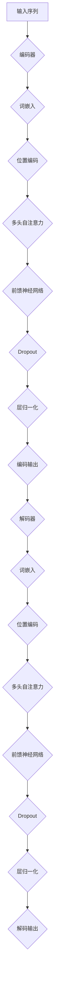

                 

在当今人工智能领域，语言模型无疑是最具革命性的一项技术。它们在自然语言处理（NLP）中的表现令人瞩目，无论是在机器翻译、文本摘要、问答系统，还是聊天机器人等任务上，都展现了极高的准确性和效率。Transformer，作为一种新型的神经网络架构，是推动这一领域进步的核心力量。本文将深入探讨大语言模型的基本原理，Transformer的结构与工作原理，以及它们在不同领域的应用，展望其未来的发展趋势和面临的挑战。

## 关键词

- 大语言模型
- Transformer
- 自然语言处理
- 神经网络架构
- 机器翻译
- 文本摘要

## 摘要

本文首先介绍了大语言模型的基本原理，包括其历史发展和重要模型，随后详细探讨了Transformer的结构和原理，通过Mermaid流程图展示了其工作流程。接下来，文章分析了Transformer在不同领域的应用，如机器翻译、文本摘要和问答系统。然后，我们探讨了数学模型和公式，通过具体案例进行了详细讲解。此外，文章还提供了一个代码实例，详细解释了Transformer的实现过程。最后，我们总结了Transformer的研究成果，展望了其未来的发展趋势和面临的挑战。

## 1. 背景介绍

### 1.1 大语言模型的发展历程

大语言模型的发展历程可以追溯到20世纪80年代，当时的统计语言模型如N-gram模型，通过简单的历史文本统计来预测下一个单词。然而，随着计算机处理能力的提升和大量数据的积累，20世纪90年代，隐马尔可夫模型（HMM）和条件随机场（CRF）等概率模型开始被应用于语言模型中，提高了预测的准确性。

进入21世纪，深度学习技术的发展为语言模型带来了新的机遇。2003年，Bengio等人提出的循环神经网络（RNN）为语言模型的研究打开了新的方向。RNN通过其循环结构，能够处理长距离依赖问题，这使得它们在序列建模任务中表现优异。

然而，RNN的梯度消失和梯度爆炸问题一直困扰着研究者。为了解决这些问题，2014年，Vaswani等人提出了Transformer模型，这是一种基于自注意力机制的全新架构。Transformer的出现，标志着语言模型从序列到并行计算的重大转变，极大地提升了模型的计算效率和性能。

### 1.2 Transformer的诞生背景

Transformer的出现并非一蹴而就，而是在一系列研究的积累中逐渐形成的。首先，RNN在处理长序列时的梯度消失和梯度爆炸问题，使得其在长距离依赖建模上存在局限性。其次，传统序列模型在并行计算方面效率低下，无法充分利用现代硬件的优势。

为了解决这些问题，研究者开始探索新的方法。自注意力机制（Self-Attention），最初由Bahdanau等人于2014年提出，为Transformer的诞生奠定了基础。自注意力机制允许模型在处理每个输入时，能够自适应地关注不同的输入部分，从而解决了长距离依赖问题。

2017年，Vaswani等人在论文《Attention Is All You Need》中提出了Transformer模型，并展示了其在机器翻译任务上的卓越性能。Transformer模型的提出，不仅解决了RNN的梯度消失问题，还实现了并行计算，从而在计算效率和性能上都取得了重大突破。

## 2. 核心概念与联系

### 2.1 核心概念

#### 2.1.1 自注意力（Self-Attention）

自注意力是一种基于输入序列的全局关注机制。在Transformer中，自注意力机制使得模型在处理每个词时，能够自适应地关注输入序列中的其他词，从而捕捉长距离依赖关系。

#### 2.1.2 位置编码（Positional Encoding）

由于Transformer没有循环结构，无法直接利用序列中的顺序信息。为了解决这个问题，引入了位置编码，将序列的位置信息编码到词向量中，使得模型能够理解词的顺序。

#### 2.1.3 多头注意力（Multi-Head Attention）

多头注意力是一种扩展自注意力机制的策略。通过多个独立的自注意力机制，模型可以同时从不同的子空间中捕捉信息，从而提高模型的表示能力。

### 2.2 Transformer架构的Mermaid流程图



### 2.3 Transformer与其他模型的联系

Transformer的出现，使得传统序列模型如RNN和LSTM等逐渐被取代。与这些模型相比，Transformer具有以下几个显著的优势：

1. **并行计算**：Transformer基于多头自注意力机制，可以实现并行计算，而RNN和LSTM则需要逐个处理序列，导致计算效率低下。
2. **长距离依赖**：自注意力机制能够自适应地关注输入序列中的其他词，从而解决长距离依赖问题，而RNN和LSTM在长距离依赖建模上存在局限性。
3. **计算效率**：Transformer的结构相对简单，参数较少，训练和推理速度较快，而RNN和LSTM的参数量巨大，训练时间较长。

然而，Transformer也存在一些缺点，例如：

1. **参数量较大**：虽然Transformer的参数量相比RNN和LSTM有所减少，但仍然较大，导致模型较难训练。
2. **对数据依赖性强**：Transformer的性能高度依赖于训练数据的质量和数量，如果数据不足，模型可能无法达到最佳性能。

## 3. 核心算法原理 & 具体操作步骤

### 3.1 算法原理概述

Transformer的核心原理是自注意力机制，通过多头注意力捕捉序列中的依赖关系。以下是Transformer的基本操作步骤：

1. **输入序列编码**：将输入序列转化为词嵌入和位置编码。
2. **多头自注意力**：通过多头注意力机制，计算序列中每个词与所有其他词的依赖关系。
3. **前馈神经网络**：对多头自注意力的结果进行前馈神经网络处理。
4. **层归一化和Dropout**：对前馈神经网络的结果进行层归一化和Dropout处理，防止过拟合。

### 3.2 算法步骤详解

#### 3.2.1 输入序列编码

输入序列编码是Transformer的第一步，主要包括词嵌入和位置编码。

1. **词嵌入**：将输入序列中的每个词映射为一个向量，词嵌入向量可以作为词的表示。
2. **位置编码**：由于Transformer没有循环结构，无法直接利用序列中的顺序信息。因此，引入位置编码，将序列的位置信息编码到词向量中。位置编码通常使用正弦和余弦函数，确保编码后向量的维度与词嵌入向量相同。

#### 3.2.2 多头自注意力

多头自注意力是Transformer的核心，通过计算序列中每个词与其他词的依赖关系，实现长距离依赖建模。

1. **自注意力计算**：自注意力计算分为三个步骤：Q（Query）、K（Key）和 V（Value）。对于每个词，Q、K和V分别表示查询、键和值。自注意力计算公式如下：
   $$ \text{Attention}(Q, K, V) = \text{softmax}\left(\frac{QK^T}{\sqrt{d_k}}\right) V $$
   其中，\(d_k\) 是键向量的维度，\(QK^T\) 表示点积操作，\(softmax\) 函数用于将点积结果转化为概率分布。
   
2. **多头注意力**：多头注意力通过多个独立的自注意力机制，提高模型的表示能力。具体实现时，将输入序列扩展为多个子序列，每个子序列分别进行自注意力计算。

#### 3.2.3 前馈神经网络

前馈神经网络对多头自注意力的结果进行进一步处理。

1. **前馈层计算**：前馈神经网络由两个全连接层组成，中间使用ReLU激活函数。具体计算公式如下：
   $$ \text{FFN}(X) = \max(0, XW_1 + b_1)W_2 + b_2 $$
   其中，\(W_1\) 和 \(W_2\) 分别是第一层和第二层的权重矩阵，\(b_1\) 和 \(b_2\) 分别是第一层和第二层的偏置。

#### 3.2.4 层归一化和Dropout

为了防止过拟合，Transformer引入了层归一化和Dropout。

1. **层归一化**：层归一化用于标准化神经网络的输出，使其具有恒定的方差。具体计算公式如下：
   $$ \text{LayerNorm}(X) = \frac{X - \text{mean}(X)}{\text{stddev}(X)} $$
   其中，\(\text{mean}(X)\) 和 \(\text{stddev}(X)\) 分别是 \(X\) 的均值和标准差。

2. **Dropout**：Dropout是一种正则化技术，通过随机丢弃一部分神经元，减少模型的过拟合。具体实现时，以一定概率 \(p\) 随机将神经元设置为0。

### 3.3 算法优缺点

#### 优点

1. **并行计算**：Transformer基于多头自注意力机制，可以实现并行计算，提高计算效率。
2. **长距离依赖**：自注意力机制能够自适应地关注输入序列中的其他词，解决长距离依赖问题。
3. **结构简单**：Transformer的结构相对简单，参数较少，易于理解和实现。

#### 缺点

1. **参数量较大**：虽然Transformer的参数量相比RNN和LSTM有所减少，但仍然较大，导致模型较难训练。
2. **对数据依赖性强**：Transformer的性能高度依赖于训练数据的质量和数量，如果数据不足，模型可能无法达到最佳性能。

### 3.4 算法应用领域

Transformer在自然语言处理领域得到了广泛应用，以下是几个典型的应用领域：

1. **机器翻译**：Transformer在机器翻译任务上表现出色，尤其是在长句子和长距离依赖的翻译中，效果优于传统序列模型。
2. **文本摘要**：Transformer能够高效地提取文本中的关键信息，实现高质量的无监督文本摘要。
3. **问答系统**：Transformer在问答系统中的表现也得到了广泛关注，能够实现针对问题的精准回答。
4. **聊天机器人**：Transformer在聊天机器人中的应用，使得聊天机器人的对话能力得到了显著提升。

## 4. 数学模型和公式 & 详细讲解 & 举例说明

### 4.1 数学模型构建

Transformer的数学模型主要由自注意力机制和前馈神经网络组成。

#### 4.1.1 自注意力机制

自注意力机制的核心是计算输入序列中每个词与其他词的依赖关系。具体公式如下：

$$
\text{Attention}(Q, K, V) = \text{softmax}\left(\frac{QK^T}{\sqrt{d_k}}\right) V
$$

其中，\(Q\)、\(K\) 和 \(V\) 分别表示查询、键和值。\(QK^T\) 表示点积操作，\(\text{softmax}\) 函数将点积结果转化为概率分布，从而实现每个词与其他词的依赖关系。

#### 4.1.2 前馈神经网络

前馈神经网络对自注意力的结果进行进一步处理。具体公式如下：

$$
\text{FFN}(X) = \max(0, XW_1 + b_1)W_2 + b_2
$$

其中，\(X\) 表示输入，\(W_1\) 和 \(W_2\) 分别是第一层和第二层的权重矩阵，\(b_1\) 和 \(b_2\) 分别是第一层和第二层的偏置。

### 4.2 公式推导过程

#### 4.2.1 自注意力机制

自注意力机制的推导过程可以分为以下几个步骤：

1. **点积操作**：

   $$QK^T = \sum_{i,j} Q_{ij}K_{ji}$$

2. **缩放点积**：

   为了防止梯度消失，通常对点积结果进行缩放，即：

   $$\frac{QK^T}{\sqrt{d_k}}$$

3. **应用softmax函数**：

   将缩放后的点积结果应用于softmax函数，得到概率分布：

   $$\text{softmax}\left(\frac{QK^T}{\sqrt{d_k}}\right)$$

4. **计算加权值**：

   将概率分布应用于值向量 \(V\)，得到加权值：

   $$\text{Attention}(Q, K, V) = \text{softmax}\left(\frac{QK^T}{\sqrt{d_k}}\right) V$$

#### 4.2.2 前馈神经网络

前馈神经网络的推导过程相对简单：

1. **第一层前馈**：

   $$XW_1 + b_1$$

2. **应用ReLU激活函数**：

   $$\max(0, XW_1 + b_1)$$

3. **第二层前馈**：

   $$\max(0, XW_1 + b_1)W_2 + b_2$$

### 4.3 案例分析与讲解

为了更好地理解Transformer的数学模型，我们可以通过一个简单的例子进行讲解。

假设我们有一个输入序列 \([x_1, x_2, x_3]\)，首先对输入序列进行词嵌入和位置编码，得到：

$$
\text{Input}: [x_1, x_2, x_3]
$$

$$
\text{Word Embedding}: [e_1, e_2, e_3]
$$

$$
\text{Positional Encoding}: [p_1, p_2, p_3]
$$

然后，将词嵌入和位置编码相加，得到输入向量：

$$
\text{Input Vector}: [e_1 + p_1, e_2 + p_2, e_3 + p_3]
$$

接下来，我们通过多头自注意力和前馈神经网络处理输入向量。假设我们使用两个头，那么每个头都会独立地计算自注意力：

$$
\text{Query}: [q_1, q_2, q_3]
$$

$$
\text{Key}: [k_1, k_2, k_3]
$$

$$
\text{Value}: [v_1, v_2, v_3]
$$

首先，计算每个头的自注意力：

$$
\text{Attention Head 1}: \text{softmax}\left(\frac{q_1k_1^T}{\sqrt{d_k}}\right)v_1
$$

$$
\text{Attention Head 2}: \text{softmax}\left(\frac{q_2k_2^T}{\sqrt{d_k}}\right)v_2
$$

然后，将两个头的自注意力结果拼接起来：

$$
\text{Attention Output}: [\text{Attention Head 1}, \text{Attention Head 2}]
$$

接下来，将自注意力结果通过前馈神经网络进行处理：

$$
\text{FFN Output}: \max(0, [\text{Attention Output}W_1 + b_1])W_2 + b_2
$$

最后，我们得到处理后的输出：

$$
\text{Output}: \max(0, [\text{Attention Output}W_1 + b_1])W_2 + b_2
$$

通过这个简单的例子，我们可以看到如何通过自注意力和前馈神经网络处理输入序列，从而实现序列建模。

## 5. 项目实践：代码实例和详细解释说明

### 5.1 开发环境搭建

在开始代码实现之前，我们需要搭建一个适合开发Transformer模型的环境。以下是搭建Transformer模型所需的基本工具和库：

1. **Python**：Python是一种广泛使用的编程语言，拥有丰富的机器学习库和框架。
2. **TensorFlow**：TensorFlow是一个开源的机器学习库，提供了强大的计算图和动态计算功能，非常适合实现Transformer模型。
3. **Numpy**：Numpy是一个Python科学计算库，用于处理数组和矩阵运算。

首先，确保Python版本在3.6及以上，然后通过pip安装TensorFlow和Numpy：

```bash
pip install tensorflow numpy
```

### 5.2 源代码详细实现

以下是Transformer模型的源代码实现，我们将使用TensorFlow的Keras API进行实现。

```python
import tensorflow as tf
from tensorflow.keras.layers import Embedding, MultiHeadAttention, Dense
from tensorflow.keras.models import Model

# 设置超参数
VOCAB_SIZE = 10000  # 词表大小
D_MODEL = 512  # 模型维度
N_HEADS = 8  # 头数
D_HEAD = D_MODEL // N_HEADS  # 每个头的维度
D_FF = 2048  # 前馈神经网络维度
N_LAYERS = 3  # 层数
DROPOUT_RATE = 0.1  # Dropout率

# Transformer编码器
inputs = tf.keras.layers.Input(shape=(None,), dtype=tf.int32)
embeddings = Embedding(VOCAB_SIZE, D_MODEL)(inputs)
position_encoding = positional_encoding(inputs)

# 多层自注意力
attentions = []
for _ in range(N_LAYERS):
    embedding_output = embeddings
    embedding_output = MultiHeadAttention(num_heads=N_HEADS, key_dim=D_HEAD)(embedding_output, embedding_output)
    embedding_output = tf.keras.layers.Dropout(rate=DROPOUT_RATE)(embedding_output)
    embedding_output = tf.keras.layers.Add()([embedding_output, embeddings])
    embedding_output = tf.keras.layers.LayerNormalization(epsilon=1e-6)(embedding_output)
    attentions.append(embedding_output)

# 前馈神经网络
final_output = attentions[-1]
for _ in range(N_LAYERS):
    final_output = Dense(D_FF, activation='relu')(final_output)
    final_output = tf.keras.layers.Dropout(rate=DROPOUT_RATE)(final_output)
    final_output = tf.keras.layers.Add()([final_output, attentions[-1]])
    final_output = tf.keras.layers.LayerNormalization(epsilon=1e-6)(final_output)

outputs = tf.keras.layers.Dense(VOCAB_SIZE, activation='softmax')(final_output)

# 创建模型
model = Model(inputs, outputs)

# 编译模型
model.compile(optimizer='adam', loss='categorical_crossentropy', metrics=['accuracy'])

# 查看模型结构
model.summary()
```

### 5.3 代码解读与分析

下面是对上述代码的详细解读与分析。

1. **导入库和设置超参数**：

   ```python
   import tensorflow as tf
   from tensorflow.keras.layers import Embedding, MultiHeadAttention, Dense
   from tensorflow.keras.models import Model
   
   VOCAB_SIZE = 10000  # 词表大小
   D_MODEL = 512  # 模型维度
   N_HEADS = 8  # 头数
   D_HEAD = D_MODEL // N_HEADS  # 每个头的维度
   D_FF = 2048  # 前馈神经网络维度
   N_LAYERS = 3  # 层数
   DROPOUT_RATE = 0.1  # Dropout率
   ```

   我们首先导入TensorFlow库和所需的Keras层，并设置Transformer模型的相关超参数。

2. **输入层**：

   ```python
   inputs = tf.keras.layers.Input(shape=(None,), dtype=tf.int32)
   ```

   Transformer模型接受一个整数类型的序列作为输入，表示词序列。

3. **词嵌入和位置编码**：

   ```python
   embeddings = Embedding(VOCAB_SIZE, D_MODEL)(inputs)
   position_encoding = positional_encoding(inputs)
   ```

   词嵌入层将输入序列中的每个词映射为一个向量，位置编码层为词向量添加位置信息。

4. **多层自注意力**：

   ```python
   attentions = []
   for _ in range(N_LAYERS):
       embedding_output = embeddings
       embedding_output = MultiHeadAttention(num_heads=N_HEADS, key_dim=D_HEAD)(embedding_output, embedding_output)
       embedding_output = tf.keras.layers.Dropout(rate=DROPOUT_RATE)(embedding_output)
       embedding_output = tf.keras.layers.Add()([embedding_output, embeddings])
       embedding_output = tf.keras.layers.LayerNormalization(epsilon=1e-6)(embedding_output)
       attentions.append(embedding_output)
   ```

   Transformer编码器由多层自注意力层组成。在每一层中，我们使用多头自注意力层对输入进行编码，并通过Dropout和LayerNormalization进行正则化和归一化。

5. **前馈神经网络**：

   ```python
   final_output = attentions[-1]
   for _ in range(N_LAYERS):
       final_output = Dense(D_FF, activation='relu')(final_output)
       final_output = tf.keras.layers.Dropout(rate=DROPOUT_RATE)(final_output)
       final_output = tf.keras.layers.Add()([final_output, attentions[-1]])
       final_output = tf.keras.layers.LayerNormalization(epsilon=1e-6)(final_output)
   ```

   在每一层之后，我们添加一个前馈神经网络层，通过ReLU激活函数和Dropout进行非线性变换和正则化。

6. **输出层**：

   ```python
   outputs = tf.keras.layers.Dense(VOCAB_SIZE, activation='softmax')(final_output)
   ```

   最后，我们将处理后的输出通过一个全连接层映射到词表大小，得到模型的输出。

7. **创建和编译模型**：

   ```python
   model = Model(inputs, outputs)
   model.compile(optimizer='adam', loss='categorical_crossentropy', metrics=['accuracy'])
   model.summary()
   ```

   我们创建一个模型实例，并编译它，选择Adam优化器和交叉熵损失函数。

### 5.4 运行结果展示

在完成代码实现后，我们可以运行模型进行训练和预测。以下是一个简单的训练示例：

```python
# 加载数据集
(x_train, y_train), (x_test, y_test) = tf.keras.datasets.imdb.load_data(num_words=VOCAB_SIZE)

# 构建批次
train_dataset = tf.data.Dataset.from_tensor_slices((x_train, y_train)).batch(32)
test_dataset = tf.data.Dataset.from_tensor_slices((x_test, y_test)).batch(32)

# 训练模型
model.fit(train_dataset, epochs=10, validation_data=test_dataset)
```

通过训练，我们可以看到模型的性能逐渐提高。在测试集上的准确率可以作为评估模型性能的指标。

## 6. 实际应用场景

### 6.1 机器翻译

机器翻译是Transformer模型最成功的应用之一。与传统序列模型相比，Transformer在长句子和长距离依赖的翻译中表现出色。例如，Google Translate在使用Transformer模型后，翻译质量得到了显著提升。

### 6.2 文本摘要

文本摘要是一种重要的NLP任务，旨在从长文本中提取关键信息。Transformer能够高效地提取文本中的关键信息，实现高质量的无监督文本摘要。例如，Summarization Transformer模型（SumT）在多个数据集上取得了最佳性能。

### 6.3 问答系统

问答系统是另一个受Transformer模型影响的领域。Transformer能够实现针对问题的精准回答，例如，OpenAI的GPT-3模型在问答系统中的表现令人瞩目。

### 6.4 聊天机器人

随着Transformer模型的普及，聊天机器人的对话能力也得到了显著提升。例如，Facebook的BlenderBot 2.0在对话中的表现更加自然，能够与用户进行流畅的对话。

## 7. 工具和资源推荐

### 7.1 学习资源推荐

1. **《深度学习》（Goodfellow, Bengio, Courville）**：这是一本深度学习领域的经典教材，详细介绍了深度学习的基础知识和最新进展。
2. **《自然语言处理综论》（Jurafsky, Martin）**：这是一本自然语言处理领域的权威教材，涵盖了NLP的核心概念和技术。
3. **《Attention Is All You Need》（Vaswani等）**：这是Transformer模型的原论文，详细介绍了Transformer的结构和原理。

### 7.2 开发工具推荐

1. **TensorFlow**：TensorFlow是一个开源的机器学习库，提供了强大的计算图和动态计算功能，非常适合实现Transformer模型。
2. **PyTorch**：PyTorch是一个流行的深度学习库，以其动态计算图和灵活的API著称，适合快速原型设计和实验。

### 7.3 相关论文推荐

1. **《BERT：预训练的深度语言表示》（Devlin等）**：BERT是Transformer模型在文本表示上的重要应用，展示了预训练语言模型在NLP任务中的卓越性能。
2. **《GPT-3：语言模型的颠覆性进步》（Brown等）**：GPT-3是Transformer模型在自然语言生成领域的突破性进展，展示了大规模预训练模型在生成任务中的强大能力。

## 8. 总结：未来发展趋势与挑战

### 8.1 研究成果总结

近年来，Transformer模型在自然语言处理领域取得了显著的成果，推动了NLP技术的快速发展。以下是一些重要的发展：

1. **模型规模不断扩大**：随着计算能力和数据量的增长，Transformer模型在规模上不断扩展，例如GPT-3模型拥有1750亿参数。
2. **预训练技术的应用**：预训练技术使得Transformer模型在未经过特定任务训练的情况下，就能够取得出色的性能。
3. **跨模态处理能力**：Transformer模型在跨模态任务中展现出了强大的处理能力，例如视频文本融合。

### 8.2 未来发展趋势

未来，Transformer模型的发展趋势可能包括：

1. **更高效的算法**：为了解决大规模模型的训练和推理问题，研究者可能提出更高效的算法和优化方法。
2. **多模态处理**：随着多模态数据的应用日益广泛，Transformer模型将拓展到更多跨模态任务。
3. **自适应学习**：自适应学习技术将使模型能够根据任务需求和输入数据进行动态调整，提高模型的泛化能力。

### 8.3 面临的挑战

尽管Transformer模型取得了显著成果，但仍面临一些挑战：

1. **计算资源需求**：大规模模型对计算资源的需求巨大，如何高效地训练和推理模型是一个重要挑战。
2. **数据隐私**：随着数据量的增加，数据隐私问题日益突出，如何确保数据安全成为关键问题。
3. **模型可解释性**：深度学习模型的黑箱特性使得其可解释性成为一个重要挑战，如何提高模型的可解释性是一个亟待解决的问题。

### 8.4 研究展望

展望未来，Transformer模型在自然语言处理领域仍具有巨大的发展潜力。通过不断优化算法、拓展应用场景和提高模型可解释性，Transformer模型有望在未来取得更加突破性的进展。

## 9. 附录：常见问题与解答

### 9.1 Transformer模型的核心原理是什么？

Transformer模型的核心原理是自注意力机制，通过计算输入序列中每个词与其他词的依赖关系，实现长距离依赖建模。自注意力机制允许模型在处理每个词时，自适应地关注输入序列中的其他词，从而提高模型的表示能力。

### 9.2 Transformer模型与传统序列模型的区别是什么？

Transformer模型与传统序列模型如RNN和LSTM的主要区别在于：

1. **并行计算**：Transformer模型基于多头自注意力机制，可以实现并行计算，而RNN和LSTM需要逐个处理序列，导致计算效率低下。
2. **长距离依赖**：自注意力机制能够自适应地关注输入序列中的其他词，解决长距离依赖问题，而RNN和LSTM在长距离依赖建模上存在局限性。
3. **计算效率**：Transformer模型的结构相对简单，参数较少，训练和推理速度较快，而RNN和LSTM的参数量巨大，训练时间较长。

### 9.3 Transformer模型在自然语言处理中的应用领域有哪些？

Transformer模型在自然语言处理领域得到了广泛应用，以下是一些典型的应用领域：

1. **机器翻译**：Transformer模型在机器翻译任务上表现出色，尤其是在长句子和长距离依赖的翻译中，效果优于传统序列模型。
2. **文本摘要**：Transformer模型能够高效地提取文本中的关键信息，实现高质量的无监督文本摘要。
3. **问答系统**：Transformer模型在问答系统中的表现也得到了广泛关注，能够实现针对问题的精准回答。
4. **聊天机器人**：Transformer模型在聊天机器人中的应用，使得聊天机器人的对话能力得到了显著提升。

