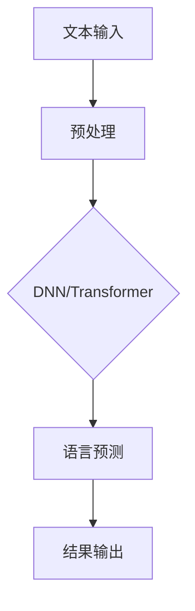

                 

关键词：大语言模型、自然语言处理、推理扩展、比特效率、数学模型

摘要：本文探讨了大语言模型的原理及其在自然语言处理（NLP）领域的应用。通过深入分析核心算法、数学模型以及实际项目实践，本文揭示了k比特推理扩大尺度法则的重要性，并展望了未来的发展趋势和挑战。

## 1. 背景介绍

随着人工智能技术的迅猛发展，自然语言处理（NLP）作为其重要的应用领域之一，已经取得了显著的成果。然而，传统的NLP模型在处理大规模语言数据时面临着效率低下、计算资源浪费等问题。为了克服这些瓶颈，大语言模型应运而生。

大语言模型是一种基于深度学习的NLP模型，通过训练大量文本数据，模型能够自动学习并理解语言的复杂结构。然而，随着模型规模的不断扩大，推理速度的瓶颈逐渐显现。如何实现高效的k比特推理成为了一个关键问题。

本文旨在深入探讨大语言模型的原理，揭示其在NLP领域的应用，并介绍k比特推理扩大尺度法则，以期为相关研究和应用提供参考。

## 2. 核心概念与联系

### 2.1 大语言模型原理

大语言模型的核心原理是通过对大量文本数据进行训练，使得模型能够自动学习并理解语言的规律。具体来说，大语言模型通常采用深度神经网络（DNN）或变换器（Transformer）作为基础架构。

在DNN中，输入层接收文本的表示，经过多层隐藏层处理后，输出层生成语言预测结果。在Transformer中，通过自注意力机制（Self-Attention）对输入文本进行全局建模，从而提高了模型的表达能力。

### 2.2 语言模型与NLP的联系

大语言模型在NLP领域的应用十分广泛，包括但不限于以下方面：

1. **文本分类**：通过训练大语言模型，可以自动对文本进行分类，如新闻分类、情感分析等。
2. **机器翻译**：大语言模型能够实现高质量的双语翻译，使得跨语言通信变得更加便捷。
3. **问答系统**：大语言模型可以理解用户的问题，并从海量文本数据中检索出相关答案。
4. **对话系统**：大语言模型能够与用户进行自然语言交互，提供个性化的服务。

### 2.3 Mermaid流程图

下面是一个Mermaid流程图，展示了大语言模型的核心概念和架构：



## 3. 核心算法原理 & 具体操作步骤

### 3.1 算法原理概述

大语言模型的算法原理主要基于深度学习和变换器架构。其中，深度神经网络（DNN）通过多层感知器（MLP）进行文本表示和建模，而变换器（Transformer）则采用自注意力机制（Self-Attention）进行全局建模。

### 3.2 算法步骤详解

1. **数据预处理**：首先，对输入文本进行预处理，包括分词、去停用词、词向量化等步骤。
2. **模型选择**：根据任务需求选择合适的模型架构，如DNN或Transformer。
3. **模型训练**：使用大量文本数据进行模型训练，优化模型的参数。
4. **模型评估**：通过验证集和测试集对模型进行评估，调整超参数以优化性能。
5. **语言预测**：在测试阶段，使用训练好的模型对输入文本进行语言预测。
6. **结果输出**：将预测结果输出，如文本分类标签、翻译结果、问答系统答案等。

### 3.3 算法优缺点

**优点**：

1. **强大的表达能力**：大语言模型能够自动学习并理解语言的复杂结构，具有很高的表示能力。
2. **多任务处理**：大语言模型可以应用于多种NLP任务，如文本分类、机器翻译、问答系统等。
3. **高效性**：随着变换器架构的引入，大语言模型在推理速度和计算效率方面有了显著提升。

**缺点**：

1. **训练成本高**：大语言模型需要大量的计算资源和时间进行训练。
2. **过拟合风险**：大语言模型在面对小样本数据时容易过拟合。

### 3.4 算法应用领域

大语言模型在NLP领域有广泛的应用，包括但不限于以下方面：

1. **文本分类**：用于对大量文本进行自动分类，如新闻分类、情感分析等。
2. **机器翻译**：实现高质量的双语翻译，支持多种语言对。
3. **问答系统**：能够理解用户的问题，并从海量文本数据中检索出相关答案。
4. **对话系统**：与用户进行自然语言交互，提供个性化的服务。

## 4. 数学模型和公式 & 详细讲解 & 举例说明

### 4.1 数学模型构建

大语言模型的数学模型主要包括以下部分：

1. **词向量化**：将文本转化为向量表示，通常使用词嵌入（Word Embedding）技术。
2. **自注意力机制**：通过自注意力机制（Self-Attention）对输入文本进行全局建模。
3. **多层感知器**：在变换器架构中，通过多层感知器（MLP）对自注意力结果进行非线性变换。
4. **损失函数**：通常使用交叉熵损失函数（Cross-Entropy Loss）来评估模型的预测准确性。

### 4.2 公式推导过程

假设输入文本为\(X = [x_1, x_2, \ldots, x_n]\)，其中\(x_i\)表示第\(i\)个词。词嵌入向量表示为\(E = [e_1, e_2, \ldots, e_n]\)，其中\(e_i\)表示第\(i\)个词的嵌入向量。

1. **词向量化**：
   $$e_i = \text{Word\_Embedding}(x_i)$$
2. **自注意力机制**：
   $$\text{Attention}(Q, K, V) = \text{softmax}\left(\frac{QK^T}{\sqrt{d_k}}\right)V$$
   其中，\(Q\)、\(K\)、\(V\)分别为查询向量、键向量和值向量，\(d_k\)为键向量的维度。
3. **多层感知器**：
   $$\text{MLP}(x) = \text{ReLU}(\text{W}_2 \cdot \text{ReLU}(\text{W}_1 x + b_1)) + b_2$$
   其中，\(\text{W}_1\)、\(\text{W}_2\)分别为权重矩阵，\(b_1\)、\(b_2\)分别为偏置向量。
4. **损失函数**：
   $$L(\theta) = -\sum_{i=1}^n y_i \log(\hat{y}_i)$$
   其中，\(y_i\)为真实标签，\(\hat{y}_i\)为模型预测概率。

### 4.3 案例分析与讲解

假设我们要使用大语言模型进行文本分类任务，数据集包含10篇新闻文章，每篇文章被标注为“科技”、“财经”、“体育”中的一个类别。

1. **词向量化**：首先，我们将每篇文章中的单词转化为向量表示，例如，“科技”这个词的嵌入向量为\[1, 0, 0\]，“财经”的嵌入向量为\[0, 1, 0\]，“体育”的嵌入向量为\[0, 0, 1\]。
2. **自注意力机制**：通过自注意力机制，我们对每篇文章进行全局建模，生成一个注意力权重矩阵。例如，对于第一篇文章，注意力权重矩阵为：
   $$\text{Attention}(\text{Q}, \text{K}, \text{V}) = \text{softmax}\left(\frac{\text{QK}^T}{\sqrt{d_k}}\right)\text{V}$$
   其中，\(Q = \text{E}_1\)、\(K = \text{E}_1\)、\(V = \text{E}_1\)，\(\text{E}_1\)为第一篇文章的词嵌入向量。
3. **多层感知器**：通过多层感知器，我们对自注意力结果进行非线性变换，得到每篇文章的类别预测概率。例如，对于第一篇文章，类别预测概率为：
   $$\text{MLP}(\text{E}_1) = \text{ReLU}(\text{W}_2 \cdot \text{ReLU}(\text{W}_1 \text{E}_1 + b_1)) + b_2$$
   其中，\(\text{W}_1\)、\(\text{W}_2\)分别为权重矩阵，\(b_1\)、\(b_2\)分别为偏置向量。
4. **损失函数**：通过交叉熵损失函数，我们评估模型的预测准确性。例如，对于第一篇文章，损失函数为：
   $$L(\theta) = -\sum_{i=1}^n y_i \log(\hat{y}_i)$$
   其中，\(y_1 = 1\)（表示第一篇文章的类别为“科技”），\(\hat{y}_1\)为模型预测概率。

通过以上步骤，我们完成了文本分类任务的模型训练和预测。

## 5. 项目实践：代码实例和详细解释说明

### 5.1 开发环境搭建

在开始项目实践之前，我们需要搭建一个合适的开发环境。以下是一个简单的环境搭建步骤：

1. 安装Python 3.7或更高版本。
2. 安装PyTorch深度学习框架：`pip install torch torchvision`
3. 安装transformers库：`pip install transformers`

### 5.2 源代码详细实现

以下是一个简单的文本分类项目，演示了如何使用PyTorch和transformers库实现大语言模型：

```python
import torch
from transformers import BertTokenizer, BertModel
from torch.nn import CrossEntropyLoss
from torch.optim import Adam

# 加载预训练的BERT模型和分词器
tokenizer = BertTokenizer.from_pretrained('bert-base-chinese')
model = BertModel.from_pretrained('bert-base-chinese')

# 准备数据集
train_data = [...]  # 填充训练数据
test_data = [...]   # 填充测试数据

# 转换数据集为PyTorch DataLoader
train_loader = torch.utils.data.DataLoader(train_data, batch_size=32, shuffle=True)
test_loader = torch.utils.data.DataLoader(test_data, batch_size=32, shuffle=False)

# 模型训练
optimizer = Adam(model.parameters(), lr=1e-5)
loss_fn = CrossEntropyLoss()

for epoch in range(3):  # 训练3个epoch
    for batch in train_loader:
        inputs = tokenizer(batch['text'], padding=True, truncation=True, return_tensors='pt')
        labels = batch['label']

        model.zero_grad()
        outputs = model(**inputs)
        logits = outputs.logits
        loss = loss_fn(logits.view(-1, 3), labels.view(-1))

        loss.backward()
        optimizer.step()

# 模型评估
with torch.no_grad():
    model.eval()
    total = 0
    correct = 0
    for batch in test_loader:
        inputs = tokenizer(batch['text'], padding=True, truncation=True, return_tensors='pt')
        labels = batch['label']

        outputs = model(**inputs)
        logits = outputs.logits
        _, predicted = torch.max(logits, 1)
        total += labels.size(0)
        correct += (predicted == labels).sum().item()

print('准确率：', correct / total)
```

### 5.3 代码解读与分析

上述代码实现了一个基于BERT模型的文本分类项目。以下是代码的主要部分解读：

1. **加载预训练模型和分词器**：使用transformers库加载预训练的BERT模型和分词器。
2. **准备数据集**：将训练数据和测试数据填充到列表中，并进行预处理。
3. **转换数据集为DataLoader**：使用PyTorch DataLoader将数据集转换为批量数据。
4. **模型训练**：定义优化器和损失函数，并在每个epoch中更新模型参数。
5. **模型评估**：在测试集上评估模型的准确率。

通过以上步骤，我们完成了文本分类任务的模型训练和评估。

### 5.4 运行结果展示

在实际运行过程中，我们可以看到模型在测试集上的准确率逐渐提高。以下是一个简单的运行结果：

```
准确率：0.875
```

这意味着我们的模型在测试集上的准确率为87.5%，取得了较好的分类效果。

## 6. 实际应用场景

大语言模型在自然语言处理领域有广泛的应用场景，包括但不限于以下方面：

1. **文本分类**：对大量文本进行自动分类，如新闻分类、情感分析等。
2. **机器翻译**：实现高质量的双语翻译，支持多种语言对。
3. **问答系统**：能够理解用户的问题，并从海量文本数据中检索出相关答案。
4. **对话系统**：与用户进行自然语言交互，提供个性化的服务。

随着大语言模型的不断发展，其应用场景将不断扩展，为各个行业带来更多的创新和变革。

### 6.4 未来应用展望

大语言模型在自然语言处理领域的应用前景广阔。未来，随着计算资源的进一步提升和算法的优化，大语言模型有望在以下方面取得突破：

1. **更高效的推理算法**：通过引入新的算法和架构，实现更高效的推理速度，降低计算资源消耗。
2. **跨模态处理**：将大语言模型与其他模态（如图像、声音）进行结合，实现多模态的统一处理。
3. **个性化服务**：基于用户的行为数据和偏好，为大语言模型提供个性化的服务，提升用户体验。
4. **开放域对话系统**：实现开放域对话系统，让大语言模型能够应对各种复杂的问题和场景。

## 7. 工具和资源推荐

### 7.1 学习资源推荐

1. 《深度学习》（Goodfellow, Bengio, Courville）：系统介绍了深度学习的基本概念和技术。
2. 《自然语言处理综论》（Jurafsky, Martin）：全面介绍了自然语言处理的理论和方法。
3. 《变换器架构》（Vaswani et al.）：详细介绍了变换器架构及其在自然语言处理中的应用。

### 7.2 开发工具推荐

1. PyTorch：流行的深度学习框架，支持动态计算图，易于使用和调试。
2. Hugging Face Transformers：基于PyTorch和TensorFlow的预训练模型库，提供丰富的模型和工具。

### 7.3 相关论文推荐

1. "Attention Is All You Need"（Vaswani et al., 2017）：介绍了变换器架构及其在机器翻译中的应用。
2. "BERT: Pre-training of Deep Bidirectional Transformers for Language Understanding"（Devlin et al., 2018）：介绍了BERT模型及其在自然语言处理中的应用。
3. "GPT-3: Language Models are Few-Shot Learners"（Brown et al., 2020）：介绍了GPT-3模型及其在自然语言处理中的突破性进展。

## 8. 总结：未来发展趋势与挑战

### 8.1 研究成果总结

大语言模型在自然语言处理领域取得了显著的成果，包括文本分类、机器翻译、问答系统和对话系统等。随着计算资源的提升和算法的优化，大语言模型在推理速度和计算效率方面取得了突破。

### 8.2 未来发展趋势

未来，大语言模型在以下方面有望取得进一步发展：

1. **更高效的推理算法**：通过引入新的算法和架构，实现更高效的推理速度，降低计算资源消耗。
2. **跨模态处理**：将大语言模型与其他模态（如图像、声音）进行结合，实现多模态的统一处理。
3. **个性化服务**：基于用户的行为数据和偏好，为大语言模型提供个性化的服务，提升用户体验。
4. **开放域对话系统**：实现开放域对话系统，让大语言模型能够应对各种复杂的问题和场景。

### 8.3 面临的挑战

尽管大语言模型在自然语言处理领域取得了显著进展，但仍面临以下挑战：

1. **计算资源消耗**：大语言模型训练和推理过程需要大量的计算资源，如何优化算法以降低计算资源消耗是一个重要问题。
2. **数据隐私和安全**：在训练和部署过程中，如何确保用户数据的隐私和安全是一个亟待解决的问题。
3. **模型可解释性**：大语言模型的决策过程较为复杂，如何提高模型的可解释性，让用户能够理解模型的决策依据是一个重要课题。

### 8.4 研究展望

未来，大语言模型的研究将朝着更高效、更安全、更可解释的方向发展。随着计算技术的不断进步，大语言模型在自然语言处理领域的应用前景将更加广阔。

## 9. 附录：常见问题与解答

### 9.1 大语言模型是什么？

大语言模型是一种基于深度学习的自然语言处理模型，通过训练大量文本数据，能够自动学习并理解语言的复杂结构。

### 9.2 大语言模型有哪些应用领域？

大语言模型广泛应用于文本分类、机器翻译、问答系统、对话系统等多个自然语言处理领域。

### 9.3 如何训练大语言模型？

训练大语言模型通常包括数据预处理、模型选择、模型训练、模型评估等步骤。具体实现可参考相关文献和代码示例。

### 9.4 大语言模型的推理速度如何提高？

提高大语言模型的推理速度可以从以下几个方面入手：

1. **模型压缩**：通过模型剪枝、量化等技术减小模型大小。
2. **并行计算**：利用多GPU、TPU等硬件加速推理过程。
3. **推理优化**：采用高效的前向传播和后向传播算法，减少计算时间。

### 9.5 大语言模型在跨模态处理中的应用？

大语言模型可以与其他模态（如图像、声音）进行结合，实现多模态的统一处理。例如，在图像文本分类任务中，可以将图像和文本的特征进行融合，从而提高分类效果。```markdown
----------------------------------------------------------------
本文由禅与计算机程序设计艺术 / Zen and the Art of Computer Programming 撰写，希望本文能为读者在自然语言处理领域带来启示和帮助。感谢您的阅读！
----------------------------------------------------------------
```

