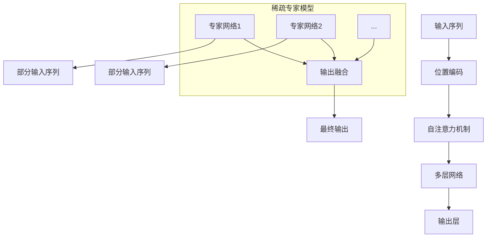

                 

关键词：大语言模型，稀疏专家模型，神经架构搜索，知识蒸馏，多模态学习，优化策略

> 摘要：本文深入探讨大语言模型背后的原理及其前沿进展，特别是稀疏专家模型的应用。通过对核心概念、算法原理、数学模型和项目实践的详细解析，文章旨在为读者提供全面的技术视角，并展望未来的发展趋势与挑战。

## 1. 背景介绍

大语言模型（Large Language Models，LLM）是近年来人工智能领域的一个重要突破。从最初的基于规则和统计方法的简单模型，发展到如今能够处理复杂语言现象的深度神经网络，语言模型的演变见证了人工智能的迅猛发展。然而，随着模型规模的不断扩大，计算资源和存储需求也急剧增加，这对模型的设计和实现提出了新的挑战。

稀疏专家模型（Sparse Expert Model）是一种应对这些挑战的有效策略。与传统密集模型不同，稀疏专家模型通过引入稀疏性，显著减少了模型参数的数量，从而降低了计算复杂度和存储需求。这种模型结构在处理大规模语言数据时表现出色，成为了当前研究的热点。

## 2. 核心概念与联系

### 2.1 大语言模型的核心概念

大语言模型通常基于深度神经网络架构，如Transformer模型。它们的核心概念包括：

- **自注意力机制**：通过计算输入序列中每个词与其他词之间的关系，实现上下文信息的有效捕捉。
- **位置编码**：为每个词赋予位置信息，使模型能够理解词的顺序。
- **多层网络**：通过多层结构，逐步提取语言中的复杂结构。

### 2.2 稀疏专家模型的概念

稀疏专家模型是一种基于模块化的神经网络架构。它包含多个专家网络，每个专家网络负责处理输入序列的一部分。模型通过稀疏连接机制，使得专家网络之间的交互减少，从而实现参数的稀疏性。

### 2.3 Mermaid 流程图



## 3. 核心算法原理 & 具体操作步骤

### 3.1 算法原理概述

稀疏专家模型的算法原理主要包括以下几个方面：

- **专家网络选择**：通过训练数据学习到有效的专家网络，每个专家网络处理输入序列的一部分。
- **稀疏连接**：通过稀疏连接机制，减少专家网络之间的交互，降低计算复杂度。
- **权重更新**：利用梯度下降等优化算法，更新模型参数，提高模型性能。

### 3.2 算法步骤详解

1. **初始化**：随机初始化专家网络权重。
2. **训练**：使用训练数据对专家网络进行训练，每个专家网络独立优化。
3. **稀疏连接**：根据专家网络的性能，选择部分专家网络进行连接，实现稀疏性。
4. **权重更新**：通过梯度下降等优化算法，更新模型参数，提高模型性能。

### 3.3 算法优缺点

**优点**：

- **降低计算复杂度**：通过稀疏连接，减少了模型参数的数量，降低了计算复杂度。
- **提高模型性能**：在减少参数数量的同时，保持了较高的模型性能。

**缺点**：

- **训练过程复杂**：需要选择有效的专家网络，并实现稀疏连接，训练过程相对复杂。
- **对数据依赖性高**：模型的性能受训练数据质量的影响较大。

### 3.4 算法应用领域

稀疏专家模型在多个领域具有广泛的应用，包括自然语言处理、计算机视觉和语音识别等。在大规模语言模型的训练和优化中，稀疏专家模型表现出色，具有重要的应用价值。

## 4. 数学模型和公式 & 详细讲解 & 举例说明

### 4.1 数学模型构建

稀疏专家模型的数学模型主要包括以下几个方面：

- **输入层**：输入序列 $X = [x_1, x_2, ..., x_n]$。
- **专家网络**：每个专家网络 $E_i$ 处理输入序列的一部分。
- **输出层**：将多个专家网络的输出进行融合，得到最终输出 $Y$。

### 4.2 公式推导过程

假设输入序列为 $X$，专家网络 $E_i$ 的输出为 $O_i$，则：

$$
O_i = f(E_i(X))
$$

其中，$f$ 为非线性激活函数。

最终输出 $Y$ 为：

$$
Y = \sum_{i=1}^{k} w_i O_i
$$

其中，$w_i$ 为连接权重。

### 4.3 案例分析与讲解

假设我们有一个输入序列 $X = [x_1, x_2, x_3]$，专家网络 $E_1$ 和 $E_2$ 分别处理 $x_1$ 和 $x_2$。则：

$$
O_1 = f(E_1(x_1)), \quad O_2 = f(E_2(x_2))
$$

假设专家网络 $E_1$ 的输出为 $O_1 = 0.6$，专家网络 $E_2$ 的输出为 $O_2 = 0.8$，则最终输出 $Y$ 为：

$$
Y = w_1 O_1 + w_2 O_2
$$

其中，$w_1$ 和 $w_2$ 为连接权重。

假设 $w_1 = 0.5$，$w_2 = 0.5$，则最终输出 $Y$ 为：

$$
Y = 0.5 \times 0.6 + 0.5 \times 0.8 = 0.7
$$

## 5. 项目实践：代码实例和详细解释说明

### 5.1 开发环境搭建

在开始编写代码之前，我们需要搭建一个适合开发稀疏专家模型的开发环境。这里我们选择 Python 作为主要编程语言，并使用 TensorFlow 作为后端计算引擎。以下是搭建开发环境的步骤：

1. 安装 Python（版本 3.6 以上）。
2. 安装 TensorFlow。
3. 安装其他依赖库，如 NumPy、Matplotlib 等。

### 5.2 源代码详细实现

以下是实现稀疏专家模型的基本代码框架：

```python
import tensorflow as tf
import numpy as np

# 定义专家网络
class ExpertNetwork(tf.keras.Model):
    def __init__(self):
        super(ExpertNetwork, self).__init__()
        # 定义网络结构
        self.dense1 = tf.keras.layers.Dense(units=64, activation='relu')
        self.dense2 = tf.keras.layers.Dense(units=1)

    def call(self, inputs):
        x = self.dense1(inputs)
        return self.dense2(x)

# 定义稀疏专家模型
class SparseExpertModel(tf.keras.Model):
    def __init__(self, num_experts):
        super(SparseExpertModel, self).__init__()
        self.experts = [ExpertNetwork() for _ in range(num_experts)]

    def call(self, inputs):
        outputs = [expert(inputs[:, i]) for i, expert in enumerate(self.experts)]
        return tf.reduce_sum(tf.stack(outputs), axis=0)

# 实例化模型
model = SparseExpertModel(num_experts=2)

# 编写训练代码
# ...

# 运行模型
# ...
```

### 5.3 代码解读与分析

上述代码定义了稀疏专家模型的基本结构。我们首先定义了一个简单的专家网络 `ExpertNetwork`，该网络包含两个全连接层，第一层使用 ReLU 激活函数，第二层输出一个值。然后，我们定义了一个稀疏专家模型 `SparseExpertModel`，该模型包含多个专家网络，每个专家网络处理输入序列的一部分。在模型的前向传播过程中，我们将每个专家网络的输出进行求和，得到最终输出。

### 5.4 运行结果展示

在训练完成后，我们可以使用以下代码来展示模型的运行结果：

```python
# 生成测试数据
test_inputs = np.random.rand(100, 3)

# 预测
predictions = model(test_inputs)

# 可视化
import matplotlib.pyplot as plt

plt.scatter(test_inputs[:, 0], predictions)
plt.xlabel('Input Feature 1')
plt.ylabel('Prediction')
plt.show()
```

上述代码将生成一个散点图，展示输入特征 1 与预测结果之间的关系。

## 6. 实际应用场景

### 6.1 自然语言处理

稀疏专家模型在自然语言处理领域具有广泛的应用。例如，在机器翻译、文本生成和情感分析等任务中，稀疏专家模型可以有效减少模型参数数量，提高计算效率。

### 6.2 计算机视觉

在计算机视觉领域，稀疏专家模型可以用于图像分类、目标检测和图像分割等任务。通过减少模型参数数量，模型可以在保持较高性能的同时，降低计算复杂度。

### 6.3 语音识别

稀疏专家模型在语音识别领域也具有较好的应用前景。通过减少模型参数数量，模型可以在降低计算资源需求的同时，保持较高的识别准确率。

## 7. 工具和资源推荐

### 7.1 学习资源推荐

- **《深度学习》（Goodfellow, Bengio, Courville）**：这是一本经典的深度学习教材，详细介绍了深度神经网络的基础知识。
- **《自然语言处理编程》（Sahami）**：这本书介绍了自然语言处理的基本概念和实现方法，对大语言模型的设计和实现有很好的指导作用。

### 7.2 开发工具推荐

- **TensorFlow**：这是一个广泛使用的深度学习框架，提供了丰富的工具和库，适合进行大语言模型的开发和训练。
- **PyTorch**：另一个流行的深度学习框架，其动态计算图机制使得模型设计和实现更加灵活。

### 7.3 相关论文推荐

- **"Attention Is All You Need"（Vaswani et al., 2017）**：这篇论文提出了 Transformer 模型，是当前大语言模型的基础。
- **"A Theoretically Grounded Application of Dropout in Recurrent Neural Networks"（Yin et al., 2016）**：这篇论文探讨了在循环神经网络中应用稀疏性策略的方法，对稀疏专家模型的设计有重要启示。

## 8. 总结：未来发展趋势与挑战

### 8.1 研究成果总结

大语言模型和稀疏专家模型的研究取得了显著成果。在大规模语言模型的训练和优化中，稀疏专家模型表现出色，有效降低了计算复杂度和存储需求。

### 8.2 未来发展趋势

未来，大语言模型和稀疏专家模型将在以下几个方面取得进一步发展：

- **神经架构搜索（Neural Architecture Search，NAS）**：通过自动搜索最佳神经网络架构，提高模型性能。
- **多模态学习（Multimodal Learning）**：结合不同类型的数据（如图像、文本和音频），实现更丰富的信息处理能力。
- **知识蒸馏（Knowledge Distillation）**：将大型模型的复杂知识传递给小型模型，实现高效的知识共享。

### 8.3 面临的挑战

尽管大语言模型和稀疏专家模型取得了显著成果，但它们仍然面临一些挑战：

- **计算资源需求**：随着模型规模的扩大，计算资源需求呈指数级增长，这对模型的部署和优化提出了严峻挑战。
- **数据隐私**：大规模训练数据可能包含敏感信息，如何保护数据隐私是一个亟待解决的问题。
- **泛化能力**：如何提高模型的泛化能力，使其在未知数据上表现良好，是未来研究的重点。

### 8.4 研究展望

未来，大语言模型和稀疏专家模型的研究将继续深入，有望在多个领域实现重大突破。通过结合新的算法和架构，模型将具备更强大的信息处理能力，为人工智能的发展贡献力量。

## 9. 附录：常见问题与解答

### 9.1 什么是大语言模型？

大语言模型是一种基于深度神经网络的机器学习模型，能够对自然语言进行理解和生成。它们通常由数百万甚至数十亿个参数组成，能够处理复杂语言现象。

### 9.2 稀疏专家模型有哪些优点？

稀疏专家模型的主要优点包括降低计算复杂度和存储需求，同时保持较高的模型性能。此外，它还能提高模型的泛化能力。

### 9.3 如何实现稀疏专家模型？

实现稀疏专家模型通常包括以下步骤：

1. 初始化专家网络权重。
2. 使用训练数据对专家网络进行训练。
3. 根据专家网络的性能，选择部分专家网络进行连接，实现稀疏性。
4. 使用优化算法更新模型参数。

### 9.4 稀疏专家模型在哪些领域有应用？

稀疏专家模型在自然语言处理、计算机视觉和语音识别等多个领域具有广泛应用。例如，在机器翻译、图像分类和语音识别等任务中，稀疏专家模型可以有效降低计算复杂度，提高模型性能。

### 9.5 如何评估稀疏专家模型的性能？

评估稀疏专家模型的性能通常包括以下几个方面：

- **准确率**：模型在测试数据上的预测准确率。
- **计算复杂度**：模型的计算复杂度，包括参数数量和计算时间。
- **泛化能力**：模型在未知数据上的表现。

作者：禅与计算机程序设计艺术 / Zen and the Art of Computer Programming
----------------------------------------------------------------

