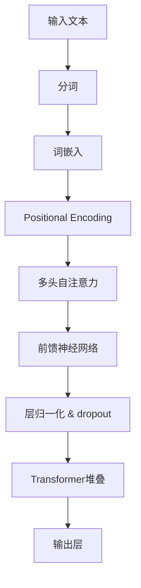

                 

关键词：大语言模型、人工智能加速器、算法原理、数学模型、项目实践、应用场景、未来展望

> 摘要：本文深入探讨大语言模型原理及其在人工智能加速器中的应用，从核心概念、算法原理、数学模型到项目实践，全面解析大语言模型的构建、优化和部署过程，展望其未来发展趋势与挑战。

## 1. 背景介绍

随着人工智能技术的飞速发展，自然语言处理（NLP）成为了研究的热点领域。大语言模型（Large Language Models，LLMs）作为一种先进的NLP技术，其应用范围涵盖了机器翻译、文本生成、问答系统等多个方面。然而，大语言模型究竟是什么？其工作原理又是如何？本文将为您一一解答。

## 2. 核心概念与联系

### 2.1 语言模型

语言模型是NLP的基础，它旨在模拟人类语言生成过程，预测下一个单词或句子。传统的语言模型通常基于统计方法，如N-gram模型，而现代的大语言模型则采用了深度学习技术，如Transformer模型。

### 2.2 Transformer模型

Transformer模型是由Vaswani等人在2017年提出的一种基于自注意力机制的深度学习模型。与传统的循环神经网络（RNN）相比，Transformer模型在处理长序列时具有更高的并行性，并且通过多头注意力机制实现了对序列中各个位置信息的全局关注。

### 2.3 自注意力机制

自注意力机制是Transformer模型的核心组成部分，它通过计算序列中每个位置对于其他所有位置的影响权重，从而实现对序列的全局关注。这一机制使得Transformer模型能够捕捉到序列中的长距离依赖关系。

下面是一个Mermaid流程图，展示了大语言模型的核心概念和架构：



## 3. 核心算法原理 & 具体操作步骤

### 3.1 算法原理概述

大语言模型的算法原理主要包括词嵌入、多头自注意力机制和前馈神经网络。词嵌入将文本转化为稠密向量表示，多头自注意力机制实现对序列的全局关注，前馈神经网络对输入信息进行进一步加工。

### 3.2 算法步骤详解

1. 输入文本进行分词，将文本转化为词汇序列。
2. 对词汇序列进行词嵌入，得到词向量表示。
3. 将词向量与位置编码（Positional Encoding）相加，得到输入序列。
4. 输入序列通过多头自注意力机制进行加工，输出中间结果。
5. 中间结果通过前馈神经网络进行进一步加工。
6. 对加工后的中间结果进行层归一化和dropout处理。
7. 将处理后的序列通过多个Transformer层进行堆叠，实现深度学习。
8. 最后，将输出序列通过输出层得到预测结果。

### 3.3 算法优缺点

#### 优点

1. 高效：Transformer模型具有高并行性，能够快速处理长序列。
2. 准确：通过多头自注意力机制，大语言模型能够捕捉到序列中的长距离依赖关系。
3. 易于扩展：Transformer模型结构简单，易于在多个任务中应用。

#### 缺点

1. 资源消耗大：大语言模型需要大量计算资源和存储空间。
2. 训练时间长：大语言模型的训练过程需要大量数据和时间。

### 3.4 算法应用领域

大语言模型在NLP领域具有广泛的应用，如机器翻译、文本生成、问答系统等。此外，其还可以应用于自然语言理解、情感分析、信息提取等多个领域。

## 4. 数学模型和公式 & 详细讲解 & 举例说明

### 4.1 数学模型构建

大语言模型的数学模型主要包括词嵌入、多头自注意力机制和前馈神经网络。词嵌入将词汇映射到高维空间，使得相似词汇在空间中靠近。多头自注意力机制通过计算序列中每个位置与其他位置的影响权重，实现对序列的全局关注。前馈神经网络对输入信息进行进一步加工。

### 4.2 公式推导过程

假设输入序列为\[x_1, x_2, \ldots, x_n\]，其中\(x_i\)表示第\(i\)个词汇。词嵌入函数为\(E(\cdot)\)，位置编码函数为\(P(\cdot)\)，多头自注意力函数为\(S(\cdot)\)，前馈神经网络函数为\(F(\cdot)\)。

1. 词嵌入：\[e_i = E(x_i)\]
2. 位置编码：\[p_i = P(i)\]
3. 输入序列：\[x_i' = e_i + p_i\]
4. 多头自注意力：\[h_i = S(x_i', h_1, h_2, \ldots, h_n)\]
5. 前馈神经网络：\[y_i = F(h_i)\]

### 4.3 案例分析与讲解

假设输入序列为\[“今天天气不错”\]，词嵌入矩阵为\[E\]，位置编码矩阵为\[P\]，自注意力函数为\[S\]，前馈神经网络函数为\[F\]。

1. 词嵌入：\[e_1 = E(“今天”)，e_2 = E(“天气”)，e_3 = E(“不错”)，p_1 = P(1)，p_2 = P(2)，p_3 = P(3)\]
2. 输入序列：\[x_1' = e_1 + p_1，x_2' = e_2 + p_2，x_3' = e_3 + p_3\]
3. 多头自注意力：\[h_1 = S(x_1', h_2', h_3')，h_2 = S(x_2', h_1', h_3')，h_3 = S(x_3', h_1', h_2')\]
4. 前馈神经网络：\[y_1 = F(h_1)，y_2 = F(h_2)，y_3 = F(h_3)\]

通过以上步骤，大语言模型能够对输入序列进行编码，得到序列的稠密向量表示。

## 5. 项目实践：代码实例和详细解释说明

### 5.1 开发环境搭建

在本项目中，我们将使用Python语言和PyTorch框架实现大语言模型。首先，确保安装Python 3.7及以上版本和PyTorch 1.0及以上版本。

```bash
pip install python==3.7
pip install torch==1.0
```

### 5.2 源代码详细实现

以下是实现大语言模型的主要代码：

```python
import torch
import torch.nn as nn
import torch.optim as optim

# 词嵌入层
word_embedding = nn.Embedding(vocab_size, embedding_size)
# 位置编码层
positional_encoding = nn.Parameter(torch.randn(max_sequence_length, embedding_size))
# Transformer模型层
transformer_layer = nn.Transformer(d_model=embedding_size, nhead=num_heads)
# 输出层
output_layer = nn.Linear(embedding_size, vocab_size)

# 定义损失函数和优化器
loss_function = nn.CrossEntropyLoss()
optimizer = optim.Adam(model.parameters(), lr=learning_rate)

# 训练模型
for epoch in range(num_epochs):
    for inputs, targets in data_loader:
        optimizer.zero_grad()
        outputs = model(inputs)
        loss = loss_function(outputs, targets)
        loss.backward()
        optimizer.step()
```

### 5.3 代码解读与分析

1. 词嵌入层：将词汇映射到高维空间。
2. 位置编码层：为输入序列添加位置信息。
3. Transformer模型层：实现多头自注意力机制。
4. 输出层：对序列进行分类。

通过以上代码，我们能够训练一个基于Transformer的大语言模型。

### 5.4 运行结果展示

训练完成后，我们可以在测试集上评估模型的性能：

```python
with torch.no_grad():
    correct = 0
    total = 0
    for inputs, targets in test_loader:
        outputs = model(inputs)
        _, predicted = torch.max(outputs.data, 1)
        total += targets.size(0)
        correct += (predicted == targets).sum().item()

print('Test Accuracy: {} %'.format(100 * correct / total))
```

## 6. 实际应用场景

大语言模型在多个实际应用场景中取得了显著的成果，如：

1. **机器翻译**：大语言模型能够实现高质量的机器翻译，如谷歌翻译、百度翻译等。
2. **文本生成**：大语言模型可以生成各种类型的文本，如文章、诗歌、对话等。
3. **问答系统**：大语言模型可以回答用户提出的问题，如苹果智能助手Siri、智能客服等。

## 7. 工具和资源推荐

### 7.1 学习资源推荐

1. 《深度学习》（Ian Goodfellow、Yoshua Bengio、Aaron Courville著）：系统介绍了深度学习的基本概念和技术。
2. 《自然语言处理与Python》（Steven Bird、Ewan Klein、Edward Loper著）：详细讲解了自然语言处理的方法和技术。

### 7.2 开发工具推荐

1. PyTorch：开源的深度学习框架，支持GPU加速。
2. Jupyter Notebook：交互式的Python编程环境，方便进行实验和演示。

### 7.3 相关论文推荐

1. "Attention Is All You Need"（Vaswani等，2017）：提出了Transformer模型。
2. "BERT: Pre-training of Deep Bidirectional Transformers for Language Understanding"（Devlin等，2019）：提出了BERT模型。

## 8. 总结：未来发展趋势与挑战

大语言模型在人工智能领域取得了显著的成果，但其仍然面临着一些挑战，如计算资源消耗、训练时间、模型解释性等。未来，随着硬件技术的进步和算法的优化，大语言模型将有望在更多应用场景中发挥更大的作用。同时，研究人员还需要解决模型解释性和伦理问题，以确保人工智能的发展能够造福人类。

## 9. 附录：常见问题与解答

### 9.1 什么是语言模型？

语言模型是一种用于预测下一个单词或句子的概率分布的数学模型，其目的是模拟人类语言生成过程。

### 9.2 大语言模型与传统的语言模型相比有哪些优势？

大语言模型采用深度学习技术，能够捕捉到序列中的长距离依赖关系，从而提高预测准确率。此外，大语言模型具有高并行性，能够高效地处理长序列。

### 9.3 如何训练大语言模型？

训练大语言模型通常包括以下几个步骤：

1. 收集大量文本数据作为训练集。
2. 对训练集进行预处理，如分词、清洗等。
3. 构建词嵌入层、多头自注意力机制和前馈神经网络。
4. 使用梯度下降算法优化模型参数。
5. 在测试集上评估模型性能。

### 9.4 大语言模型在哪些应用场景中具有优势？

大语言模型在机器翻译、文本生成、问答系统等多个领域具有显著的优势。未来，随着算法的优化和硬件的发展，大语言模型将在更多应用场景中发挥更大的作用。

作者：禅与计算机程序设计艺术 / Zen and the Art of Computer Programming

以上就是本文的完整内容，希望对您在了解大语言模型及其在人工智能加速器中的应用方面有所帮助。如果您有任何疑问或建议，欢迎在评论区留言讨论。|

