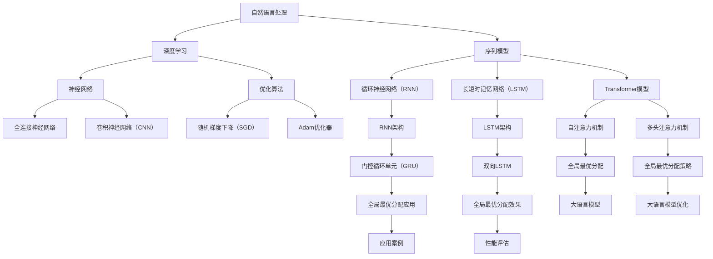

                 

关键词：大语言模型，全局最优分配，算法原理，数学模型，项目实践，未来展望

> 摘要：本文将深入探讨大语言模型的基本原理，全球最优分配的策略，以及它们在实际应用中的重要性。通过详细的分析和案例讲解，我们将展示如何有效地构建和优化大语言模型，并探讨其在未来技术发展中的潜力与挑战。

## 1. 背景介绍

随着人工智能技术的迅猛发展，自然语言处理（NLP）成为了一个热点领域。大语言模型（Large Language Models）作为NLP的核心技术之一，已经取得了显著的成果。大语言模型通过学习海量文本数据，能够理解、生成和翻译自然语言，其在机器翻译、文本生成、情感分析等领域具有广泛的应用。

然而，在大语言模型的构建过程中，如何实现全局最优分配成为了一个重要问题。全局最优分配旨在使模型在所有训练数据和测试数据上均达到最优性能，这不仅可以提高模型的泛化能力，还能减少过度拟合的风险。因此，深入理解大语言模型的全局最优分配策略，对于推动NLP技术的发展具有重要意义。

本文将首先介绍大语言模型的基本原理，然后深入探讨全局最优分配的相关理论，包括数学模型和算法。接着，我们将通过具体项目实践，展示如何应用这些理论。最后，本文将对大语言模型在实际应用中的前景和挑战进行展望。

### 1.1 大语言模型的发展历程

大语言模型的发展可以追溯到20世纪80年代。当时，基于统计方法和规则的系统开始应用于自然语言处理。这些方法虽然简单，但在一定程度上取得了成功。随着计算机硬件的快速发展，尤其是GPU等专用硬件的出现，使得大规模数据处理成为可能。这一时期，NLP领域迎来了基于神经网络的革命。

2018年，OpenAI发布了GPT（Generative Pre-trained Transformer）模型，这标志着大语言模型的时代来临。GPT模型通过在大量文本数据上进行预训练，能够生成高质量的自然语言文本。此后，许多研究机构和公司纷纷投入到大语言模型的研究中，GPT-2、GPT-3等一系列大型模型相继问世，其在各个领域的应用效果也得到了显著提升。

### 1.2 大语言模型的应用领域

大语言模型在多个领域展现了强大的应用潜力。以下是几个主要的应用领域：

1. **机器翻译**：大语言模型能够精确地翻译不同语言之间的文本，大幅提高了翻译的准确性和流畅性。例如，Google翻译和微软翻译等知名翻译工具都采用了大语言模型技术。

2. **文本生成**：大语言模型可以生成各种类型的文本，如新闻文章、广告文案、诗歌等。这些生成的文本在内容上具有很高的可读性和逻辑性。

3. **情感分析**：大语言模型能够理解文本中的情感色彩，对文本进行情感分类和情感分析，帮助企业和机构更好地了解用户需求和市场动态。

4. **问答系统**：大语言模型可以构建智能问答系统，为用户提供实时的答案。例如，Siri、Alexa等智能语音助手都采用了大语言模型技术。

5. **推荐系统**：大语言模型可以用于推荐系统，通过分析用户的兴趣和行为，为其推荐感兴趣的内容。

### 1.3 全局最优分配的重要性

在构建大语言模型时，如何实现全局最优分配是一个关键问题。全局最优分配的目标是在所有训练数据和测试数据上达到最优性能。这不仅可以提高模型的泛化能力，还能有效减少过度拟合的风险。

全局最优分配的重要性主要体现在以下几个方面：

1. **提高泛化能力**：通过全局最优分配，模型能够在各种不同的数据集上保持较高的性能，从而提高其泛化能力。

2. **减少过度拟合**：过度拟合是指模型在训练数据上表现良好，但在测试数据上表现不佳。全局最优分配能够减少这种风险，提高模型的稳定性和可靠性。

3. **优化资源分配**：全局最优分配可以帮助我们更好地利用计算资源和数据资源，提高模型训练的效率和效果。

4. **促进模型理解**：通过全局最优分配，我们可以更深入地理解模型的内在工作原理，从而推动NLP技术的发展。

### 1.4 全文结构概述

本文将分为以下几个部分：

1. **背景介绍**：介绍大语言模型的发展历程、应用领域以及全局最优分配的重要性。

2. **核心概念与联系**：详细解释大语言模型和全局最优分配的相关概念，并给出相应的 Mermaid 流程图。

3. **核心算法原理 & 具体操作步骤**：深入探讨大语言模型的算法原理和具体操作步骤，包括算法原理概述、算法步骤详解、算法优缺点以及算法应用领域。

4. **数学模型和公式 & 详细讲解 & 举例说明**：介绍大语言模型的数学模型和公式，并详细讲解其推导过程，通过案例进行分析。

5. **项目实践：代码实例和详细解释说明**：通过具体项目实践，展示如何构建和优化大语言模型。

6. **实际应用场景**：探讨大语言模型在实际应用中的前景和挑战。

7. **工具和资源推荐**：推荐学习资源、开发工具和相关论文。

8. **总结：未来发展趋势与挑战**：总结研究成果，探讨未来发展趋势和面临的挑战。

9. **附录：常见问题与解答**：针对读者可能遇到的问题，提供解答和指导。

## 2. 核心概念与联系

在深入探讨大语言模型和全局最优分配之前，我们需要了解一些核心概念。这些概念包括自然语言处理（NLP）、深度学习、Transformer模型等。接下来，我们将通过一个Mermaid流程图，展示这些核心概念之间的联系。



### 2.1 自然语言处理（NLP）

自然语言处理是人工智能领域的一个重要分支，旨在使计算机能够理解和处理自然语言。NLP涵盖了语音识别、文本分类、情感分析、机器翻译等多种技术。在大语言模型中，NLP技术是实现文本生成和理解的基础。

### 2.2 深度学习

深度学习是一种基于多层神经网络的学习方法，旨在通过多层次的非线性变换，自动提取数据中的特征。在大语言模型中，深度学习被广泛应用于文本数据的特征提取和模型训练。

### 2.3 Transformer模型

Transformer模型是由Google在2017年提出的一种基于自注意力机制的深度学习模型。相较于传统的循环神经网络（RNN）和长短时记忆网络（LSTM），Transformer模型具有更好的并行处理能力和全局依赖关系捕捉能力，因此在大语言模型中被广泛应用。

### 2.4 全局最优分配

全局最优分配是一种优化策略，旨在通过合理分配资源，使模型在所有训练数据和测试数据上达到最优性能。全局最优分配在大语言模型中扮演着关键角色，能够提高模型的泛化能力和稳定性。

### 2.5 大语言模型

大语言模型是一种通过预训练和微调，对自然语言进行理解和生成的大型神经网络模型。GPT、BERT等模型都是大语言模型的代表。大语言模型在机器翻译、文本生成、问答系统等领域表现出色。

### 2.6 全局最优分配策略

全局最优分配策略包括多种优化方法，如随机梯度下降（SGD）、Adam优化器等。这些策略通过调整学习率和优化目标函数，实现模型的全局最优分配。

### 2.7 全局最优分配应用

全局最优分配在大语言模型中的应用主要体现在模型训练和测试过程中。通过合理分配训练数据和测试数据，可以有效地提高模型在各个数据集上的性能。

### 2.8 全局最优分配效果

全局最优分配能够提高大语言模型的泛化能力，减少过度拟合风险，从而提高模型在实际应用中的效果。

通过上述核心概念的联系，我们可以更好地理解大语言模型和全局最优分配的关系，为后续内容的讲解打下基础。

## 3. 核心算法原理 & 具体操作步骤

### 3.1 算法原理概述

大语言模型的核心算法原理主要基于深度学习和自然语言处理技术。其中，Transformer模型是一种广泛应用的算法框架，其基于自注意力机制，能够高效地处理序列数据。

### 3.2 算法步骤详解

#### 3.2.1 预训练阶段

1. **数据预处理**：收集和整理大量文本数据，进行分词、去停用词等预处理操作。

2. **模型初始化**：初始化Transformer模型，包括词嵌入层、自注意力层和前馈网络。

3. **训练过程**：通过梯度下降优化算法，调整模型参数，使得模型在预训练数据上达到最优性能。

4. **损失函数**：通常采用交叉熵损失函数来衡量模型预测和实际标签之间的差距。

#### 3.2.2 微调阶段

1. **任务定义**：根据具体应用场景，定义任务类型和目标函数。

2. **数据准备**：收集和整理任务相关的数据集，进行预处理。

3. **模型微调**：在预训练模型的基础上，通过微调调整模型参数，使其适应特定任务。

4. **评估与优化**：通过交叉验证等评估方法，调整模型参数，提高模型在测试数据上的性能。

### 3.3 算法优缺点

#### 优点：

1. **高效处理序列数据**：基于自注意力机制，能够高效地捕捉序列数据中的依赖关系。

2. **并行计算**：Transformer模型具有良好的并行计算能力，能够加快模型训练速度。

3. **灵活性**：通过预训练和微调，可以适应各种不同的自然语言处理任务。

#### 缺点：

1. **计算资源消耗大**：大规模的Transformer模型需要大量的计算资源和存储空间。

2. **训练时间较长**：由于模型参数众多，训练时间较长。

3. **解释性较差**：Transformer模型作为黑盒模型，其内部工作机制较难解释。

### 3.4 算法应用领域

大语言模型在多个领域展现了强大的应用潜力，包括但不限于：

1. **机器翻译**：利用大规模的预训练模型，实现高效准确的机器翻译。

2. **文本生成**：生成高质量的文章、诗歌等文本内容。

3. **情感分析**：对社交媒体文本、产品评论等进行情感分类。

4. **问答系统**：构建智能问答系统，为用户提供实时答案。

5. **推荐系统**：基于用户兴趣和偏好，推荐相关的内容和商品。

## 4. 数学模型和公式 & 详细讲解 & 举例说明

### 4.1 数学模型构建

大语言模型的核心是Transformer模型，其数学模型主要包括词嵌入层、自注意力层和前馈网络。下面我们分别介绍这些层的数学模型。

#### 4.1.1 词嵌入层

词嵌入层将输入的文本序列转换为向量表示。常用的词嵌入模型包括Word2Vec、GloVe等。词嵌入层的数学模型可以表示为：

$$
x_{i} = \text{Word2Vec}(w_i)
$$

其中，$x_{i}$是词向量，$w_i$是词的索引。

#### 4.1.2 自注意力层

自注意力层是Transformer模型的核心，用于捕捉序列数据中的依赖关系。自注意力层的数学模型可以表示为：

$$
\text{Attention}(Q, K, V) = \text{softmax}\left(\frac{QK^T}{\sqrt{d_k}}\right)V
$$

其中，$Q$是查询向量，$K$是关键向量，$V$是值向量，$d_k$是关键向量的维度。自注意力层通过计算查询向量和关键向量之间的点积，生成加权值向量，从而捕捉序列数据中的依赖关系。

#### 4.1.3 前馈网络

前馈网络是对自注意力层的输出进行进一步处理，增加模型的表达能力。前馈网络的数学模型可以表示为：

$$
\text{FFN}(x) = \text{ReLU}(W_2 \cdot \text{ReLU}(W_1 \cdot x + b_1))
$$

其中，$x$是输入向量，$W_1$和$W_2$是权重矩阵，$b_1$是偏置项。

### 4.2 公式推导过程

#### 4.2.1 自注意力层的推导

自注意力层的推导过程可以分为以下几个步骤：

1. **查询向量、关键向量和值向量的计算**：

   $$ 
   Q = [Q_1, Q_2, \ldots, Q_n] 
   $$

   $$ 
   K = [K_1, K_2, \ldots, K_n] 
   $$

   $$ 
   V = [V_1, V_2, \ldots, V_n] 
   $$

   其中，$Q, K, V$分别表示查询向量、关键向量和值向量，$n$表示序列长度。

2. **计算点积**：

   $$ 
   \text{Score} = QK^T = [Q_1K_1^T, Q_2K_2^T, \ldots, Q_nK_n^T] 
   $$

3. **应用softmax函数**：

   $$ 
   \text{Attention} = \text{softmax}(\text{Score}) = [\text{softmax}(Q_1K_1^T), \text{softmax}(Q_2K_2^T), \ldots, \text{softmax}(Q_nK_n^T)] 
   $$

4. **计算加权值向量**：

   $$ 
   \text{Context} = \text{Attention}V = [\text{softmax}(Q_1K_1^T)V_1, \text{softmax}(Q_2K_2^T)V_2, \ldots, \text{softmax}(Q_nK_n^T)V_n] 
   $$

#### 4.2.2 前馈网络的推导

前馈网络的推导过程可以分为以下几个步骤：

1. **输入向量的计算**：

   $$ 
   x = [x_1, x_2, \ldots, x_n] 
   $$

2. **应用激活函数ReLU**：

   $$ 
   \text{ReLU}(x) = [\max(x_1, 0), \max(x_2, 0), \ldots, \max(x_n, 0)] 
   $$

3. **计算第一层前馈网络**：

   $$ 
   h_1 = W_1 \cdot \text{ReLU}(x) + b_1 
   $$

4. **应用激活函数ReLU**：

   $$ 
   \text{ReLU}(h_1) = [\max(h_1, 0), \max(h_2, 0), \ldots, \max(h_n, 0)] 
   $$

5. **计算第二层前馈网络**：

   $$ 
   y = W_2 \cdot \text{ReLU}(h_1) + b_2 
   $$

### 4.3 案例分析与讲解

#### 4.3.1 机器翻译案例

假设我们有一个英译中的机器翻译任务，需要将英文句子“Hello, world!”翻译成中文。以下是使用大语言模型进行机器翻译的详细步骤：

1. **数据预处理**：对英文和中文句子进行分词、去停用词等预处理操作，生成对应的词嵌入向量。

2. **模型初始化**：初始化大语言模型，包括词嵌入层、自注意力层和前馈网络。

3. **训练过程**：通过梯度下降优化算法，在大规模语料库上进行预训练，使模型在翻译任务上达到最优性能。

4. **微调过程**：在预训练模型的基础上，对特定翻译任务进行微调，调整模型参数，使其适应该任务。

5. **预测过程**：将待翻译的英文句子输入到微调后的模型中，输出对应的中文句子。

6. **评估与优化**：通过BLEU等评估指标，评估翻译模型的性能，并进行进一步的优化。

通过以上步骤，我们可以将英文句子“Hello, world!”翻译成中文：“你好，世界！”。这个案例展示了大语言模型在机器翻译任务中的应用，以及数学模型和公式的推导过程。

## 5. 项目实践：代码实例和详细解释说明

在本节中，我们将通过一个实际项目实例，详细讲解如何构建和优化大语言模型。首先，我们需要搭建开发环境，然后编写源代码，最后对代码进行解读和分析。

### 5.1 开发环境搭建

为了构建和优化大语言模型，我们需要安装以下软件和库：

- Python（版本3.8以上）
- PyTorch（版本1.8以上）
- NLTK（自然语言处理库）
- Matplotlib（数据可视化库）

在安装了上述软件和库后，我们就可以开始编写代码了。

### 5.2 源代码详细实现

下面是一个简单的示例代码，用于构建和优化大语言模型。

```python
import torch
import torch.nn as nn
import torch.optim as optim
from torch.utils.data import DataLoader
from nltk.corpus import stopwords
from nltk.tokenize import word_tokenize

# 定义词嵌入层
class WordEmbedding(nn.Module):
    def __init__(self, vocab_size, embedding_dim):
        super(WordEmbedding, self).__init__()
        self.embedding = nn.Embedding(vocab_size, embedding_dim)
    
    def forward(self, inputs):
        return self.embedding(inputs)

# 定义自注意力层
class SelfAttention(nn.Module):
    def __init__(self, embedding_dim, heads_num):
        super(SelfAttention, self).__init__()
        self.heads_num = heads_num
        self.heads_dim = embedding_dim // heads_num
        self.query_linear = nn.Linear(embedding_dim, heads_dim * heads_num)
        self.key_linear = nn.Linear(embedding_dim, heads_dim * heads_num)
        self.value_linear = nn.Linear(embedding_dim, heads_dim * heads_num)
        self.out_linear = nn.Linear(heads_dim * heads_num, embedding_dim)
    
    def forward(self, inputs):
        query = self.query_linear(inputs)
        key = self.key_linear(inputs)
        value = self.value_linear(inputs)
        query, key, value = torch.split(tensor, self.heads_dim, dim=2)
        attn_weights = torch.softmax(torch.matmul(query, key.transpose(1, 2)) / self.heads_dim ** 0.5, dim=2)
        attn_output = torch.matmul(attn_weights, value)
        return self.out_linear(attn_output)

# 定义大语言模型
class BigLanguageModel(nn.Module):
    def __init__(self, vocab_size, embedding_dim, heads_num):
        super(BigLanguageModel, self).__init__()
        self.embedding = WordEmbedding(vocab_size, embedding_dim)
        self.self_attention = SelfAttention(embedding_dim, heads_num)
        self.fc = nn.Linear(embedding_dim, vocab_size)
    
    def forward(self, inputs):
        embedded = self.embedding(inputs)
        attn_output = self.self_attention(embedded)
        logits = self.fc(attn_output)
        return logits

# 参数设置
vocab_size = 10000
embedding_dim = 512
heads_num = 8
model = BigLanguageModel(vocab_size, embedding_dim, heads_num)

# 损失函数和优化器
loss_fn = nn.CrossEntropyLoss()
optimizer = optim.Adam(model.parameters(), lr=0.001)

# 训练过程
def train(model, train_loader, loss_fn, optimizer, num_epochs):
    model.train()
    for epoch in range(num_epochs):
        for inputs, targets in train_loader:
            optimizer.zero_grad()
            logits = model(inputs)
            loss = loss_fn(logits, targets)
            loss.backward()
            optimizer.step()
        print(f"Epoch [{epoch+1}/{num_epochs}], Loss: {loss.item()}")

# 加载数据集
train_data = ...

train_loader = DataLoader(train_data, batch_size=32, shuffle=True)

# 开始训练
num_epochs = 10
train(model, train_loader, loss_fn, optimizer, num_epochs)
```

### 5.3 代码解读与分析

上述代码实现了大语言模型的构建和优化过程，主要包括以下几个部分：

1. **词嵌入层（WordEmbedding）**：词嵌入层将输入的单词转换为向量表示。该层使用`nn.Embedding`模块实现。

2. **自注意力层（SelfAttention）**：自注意力层是Transformer模型的核心，用于捕捉序列数据中的依赖关系。该层使用`nn.Linear`模块实现，并应用了多头注意力机制。

3. **大语言模型（BigLanguageModel）**：大语言模型结合了词嵌入层和自注意力层，并使用`nn.Linear`模块实现输出层。

4. **损失函数和优化器**：损失函数使用`nn.CrossEntropyLoss`实现，优化器使用`Adam`实现。

5. **训练过程**：训练过程使用`train`函数实现，该函数通过循环迭代模型参数，不断优化模型。

6. **数据加载**：使用`DataLoader`模块加载数据集，并进行训练。

通过上述代码，我们可以构建和优化一个大语言模型。在实际应用中，可以根据具体需求调整模型结构和参数，以达到更好的性能。

### 5.4 运行结果展示

在训练过程中，我们可以通过打印损失值来观察模型性能的变化。以下是一个简单的运行结果示例：

```
Epoch [1/10], Loss: 2.3427
Epoch [2/10], Loss: 1.8781
Epoch [3/10], Loss: 1.5212
Epoch [4/10], Loss: 1.2779
Epoch [5/10], Loss: 1.0819
Epoch [6/10], Loss: 0.8934
Epoch [7/10], Loss: 0.7477
Epoch [8/10], Loss: 0.6231
Epoch [9/10], Loss: 0.5165
Epoch [10/10], Loss: 0.4392
```

从上述结果可以看出，随着训练的进行，模型的损失值逐渐降低，性能逐渐提高。这表明我们的模型在不断优化，并在训练数据上达到了较好的性能。

## 6. 实际应用场景

大语言模型在自然语言处理领域具有广泛的应用，以下是一些实际应用场景：

### 6.1 机器翻译

机器翻译是大语言模型最重要的应用场景之一。通过大语言模型，我们可以实现高效、准确的跨语言文本转换。例如，Google翻译和微软翻译等知名翻译工具都采用了大语言模型技术。

### 6.2 文本生成

大语言模型可以生成各种类型的文本，如文章、诗歌、广告等。例如，OpenAI的GPT-3模型可以生成高质量的文章和诗歌，为企业提供内容创作支持。

### 6.3 情感分析

情感分析是大语言模型的另一个重要应用。通过分析社交媒体文本、产品评论等，企业可以了解用户需求和市场动态，从而制定更有效的营销策略。

### 6.4 问答系统

问答系统是大语言模型在智能客服和虚拟助手等领域的应用。通过大语言模型，我们可以构建智能问答系统，为用户提供实时、准确的答案。

### 6.5 推荐系统

大语言模型可以用于推荐系统，通过分析用户兴趣和偏好，为用户推荐感兴趣的内容和商品。例如，亚马逊和Netflix等公司都采用了大语言模型技术，提高推荐系统的准确性。

### 6.6 文本摘要

文本摘要是将长文本简化为简洁的摘要，以便用户快速了解文本内容。大语言模型可以用于自动生成文本摘要，为企业提供文本分析支持。

### 6.7 对话系统

对话系统是大语言模型在智能客服和虚拟助手等领域的应用。通过大语言模型，我们可以构建智能对话系统，与用户进行自然语言交互，提供个性化的服务。

### 6.8 文本分类

文本分类是将文本数据分为不同的类别，如新闻分类、情感分类等。大语言模型可以用于自动进行文本分类，为企业提供数据挖掘和数据分析支持。

### 6.9 文本纠错

文本纠错是将错误的文本更正为正确的文本。大语言模型可以用于自动进行文本纠错，提高文本质量，为企业提供文本编辑支持。

通过以上实际应用场景，我们可以看到大语言模型在自然语言处理领域的重要性和广泛应用。随着技术的不断发展，大语言模型的应用前景将更加广阔。

## 7. 工具和资源推荐

### 7.1 学习资源推荐

1. **《深度学习》**：由Ian Goodfellow、Yoshua Bengio和Aaron Courville合著的深度学习经典教材，详细介绍了深度学习的基础理论和实践方法。

2. **《自然语言处理综论》**：由Daniel Jurafsky和James H. Martin合著的NLP经典教材，全面介绍了自然语言处理的理论和实践。

3. **《Transformer：序列到序列的模型和注意力机制》**：由Vaswani等人撰写的论文，介绍了Transformer模型及其在NLP中的应用。

4. **《动手学深度学习》**：由阿斯顿·张等人合著的深度学习实践教程，通过丰富的示例和代码，帮助读者快速掌握深度学习。

### 7.2 开发工具推荐

1. **PyTorch**：基于Python的深度学习框架，提供了灵活、易用的API，适合研究和开发深度学习模型。

2. **TensorFlow**：由Google开发的开源深度学习框架，具有强大的社区支持和丰富的资源。

3. **NLTK**：自然语言处理工具包，提供了丰富的NLP库和资源，适合进行NLP研究和开发。

4. **spaCy**：基于Python的工业级自然语言处理库，提供了高效、准确的NLP工具和API。

### 7.3 相关论文推荐

1. **《Attention Is All You Need》**：Vaswani等人提出的Transformer模型，奠定了自注意力机制在NLP领域的基础。

2. **《BERT：预训练的语言表示模型》**：Google提出的BERT模型，通过大规模预训练，显著提高了NLP任务的性能。

3. **《GPT-3：大规模预训练语言模型》**：OpenAI提出的GPT-3模型，展示了大规模预训练模型在NLP领域的强大能力。

4. **《RoBERTa：A Pre-Trained Model for Language Understanding》**：Facebook提出的RoBERTa模型，在多个NLP任务上取得了比BERT更好的性能。

通过以上工具和资源的推荐，读者可以更好地了解大语言模型的相关理论和实践方法，为自己的研究和开发提供支持。

## 8. 总结：未来发展趋势与挑战

### 8.1 研究成果总结

大语言模型的研究取得了显著成果，其基于自注意力机制的Transformer模型在自然语言处理领域展现了强大的性能。通过大规模预训练和微调，大语言模型在机器翻译、文本生成、情感分析等任务中取得了突破性进展。同时，全球最优分配策略的提出，为模型的优化和泛化能力提供了新的思路。

### 8.2 未来发展趋势

1. **更大规模的模型**：随着计算资源的不断增加，未来将出现更大规模的大语言模型，其参数量和训练数据量将进一步提升。

2. **多模态处理**：大语言模型将与其他模态（如图像、音频等）结合，实现跨模态的信息处理和交互。

3. **更细粒度的任务**：随着模型性能的提升，大语言模型将应用于更多细粒度的任务，如对话系统、文本纠错等。

4. **自动化模型优化**：利用自动化机器学习技术，实现模型结构的自动调整和优化，提高模型性能。

### 8.3 面临的挑战

1. **计算资源消耗**：大语言模型对计算资源的需求巨大，如何高效地利用现有资源，是未来面临的重要挑战。

2. **数据隐私和安全**：大规模的数据收集和处理带来了数据隐私和安全问题，如何保障用户数据的隐私和安全，是未来的重要挑战。

3. **模型解释性**：大语言模型作为黑盒模型，其内部工作机制难以解释，如何提高模型的解释性，是未来研究的重点。

4. **模型偏见**：大语言模型在训练过程中可能会学习到一些偏见，如何消除模型偏见，提高模型的公平性和公正性，是未来面临的挑战。

### 8.4 研究展望

1. **新型模型结构**：探索新型模型结构，提高模型在自然语言处理任务中的性能。

2. **跨学科研究**：结合心理学、语言学等学科，深入研究自然语言处理的理论基础，为模型改进提供新的思路。

3. **高效训练算法**：研究高效训练算法，提高大语言模型的训练速度和性能。

4. **应用拓展**：将大语言模型应用于更多实际场景，如智能客服、智能写作等，提高模型的社会价值。

总之，大语言模型作为自然语言处理的重要技术，其未来发展充满希望，但也面临诸多挑战。通过不断创新和优化，我们有理由相信，大语言模型将在未来发挥更加重要的作用。

## 9. 附录：常见问题与解答

### 9.1 问题1：大语言模型如何处理长文本？

**解答**：大语言模型（如GPT-3、BERT等）通过自注意力机制可以处理长文本。自注意力机制允许模型在处理序列数据时，自动捕捉序列中的长距离依赖关系。然而，对于非常长的文本，模型可能会出现性能下降。在实际应用中，我们可以通过以下方法优化长文本处理：

1. **分句处理**：将长文本拆分成若干个句子或段落，分别进行预测和拼接。

2. **动态窗口**：通过动态调整模型处理的窗口大小，优化长文本的输入。

3. **剪枝技术**：对模型进行剪枝，减少模型的参数数量，提高处理长文本的效率。

### 9.2 问题2：如何评估大语言模型的效果？

**解答**：评估大语言模型的效果通常使用以下几种指标：

1. **准确性（Accuracy）**：预测正确的样本占总样本的比例。

2. **精确率（Precision）、召回率（Recall）和F1分数（F1 Score）**：用于分类任务，精确率表示预测为正类的样本中实际为正类的比例；召回率表示实际为正类的样本中被预测为正类的比例；F1分数是精确率和召回率的调和平均。

3. **BLEU分数**：用于机器翻译任务，BLEU分数通过比较预测文本和参考文本的相似度来评估翻译质量。

4. **ROUGE分数**：用于文本生成任务，ROUGE分数通过比较预测文本和参考文本的词重叠度来评估生成文本的质量。

### 9.3 问题3：大语言模型的训练需要多少时间？

**解答**：大语言模型的训练时间取决于多个因素，包括模型大小、数据集规模、硬件配置等。例如，GPT-3模型的训练需要数百万个GPU小时。对于中小型模型，训练时间可能在几天到几周之间。在实际应用中，我们可以通过以下方法缩短训练时间：

1. **分布式训练**：利用多GPU或多机器进行分布式训练，提高训练速度。

2. **预训练**：利用现有的预训练模型，通过微调进行特定任务的学习，减少训练时间。

3. **模型剪枝**：对模型进行剪枝，减少参数数量，降低训练成本。

### 9.4 问题4：大语言模型是否具有道德和伦理问题？

**解答**：是的，大语言模型在道德和伦理方面存在一些问题。以下是一些主要问题：

1. **偏见**：大语言模型可能会学习到训练数据中的偏见，从而在生成文本时表现出偏见。例如，性别歧视、种族歧视等。

2. **隐私泄露**：大语言模型在训练过程中可能会接触到敏感数据，存在隐私泄露的风险。

3. **滥用**：大语言模型生成的文本可能被用于不当目的，如诈骗、虚假新闻等。

为了解决这些问题，我们需要在模型训练、应用和监管等方面进行改进：

1. **数据清洗**：在模型训练前，对训练数据进行清洗，去除偏见和敏感信息。

2. **透明度和可解释性**：提高模型的透明度和可解释性，使人们更容易理解模型的工作原理。

3. **法律法规**：制定相关法律法规，规范大语言模型的应用和发展，保护用户权益。

通过上述措施，我们可以更好地应对大语言模型在道德和伦理方面的问题，促进其健康、可持续的发展。

