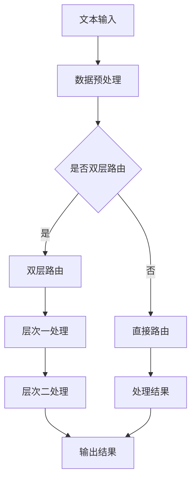

                 

关键词：大语言模型、双层路由、算法原理、数学模型、应用领域、代码实例、未来展望。

> 摘要：本文将深入探讨大语言模型原理基础与前沿双层路由技术，从核心概念、算法原理、数学模型、项目实践等方面进行全面分析，为读者提供一份权威的技术指南。

## 1. 背景介绍

随着互联网技术的飞速发展和大数据时代的到来，人工智能（AI）逐渐成为现代科技领域的热门话题。大语言模型作为人工智能的核心技术之一，被广泛应用于自然语言处理（NLP）、机器翻译、文本生成等多个领域。而双层路由技术则是在大规模数据处理中提升性能和效率的关键方法。

本文将首先介绍大语言模型的基本概念和原理，然后深入探讨双层路由技术，最后通过实际项目实践和未来展望，帮助读者全面理解这一前沿技术。

## 2. 核心概念与联系

### 2.1 大语言模型概念

大语言模型（Large Language Model）是一种基于深度学习的自然语言处理模型，它可以理解、生成和预测自然语言文本。大语言模型的核心思想是通过对大量文本数据的学习，捕捉语言的本质特征和规律，从而实现自动文本生成、机器翻译、问答系统等功能。

### 2.2 双层路由技术概念

双层路由技术是一种在大规模数据处理中提升性能和效率的方法。它通过将数据流分成两个层次进行路由和处理，从而减少了数据处理的时间复杂度和空间复杂度，提高了系统的吞吐量和响应速度。

### 2.3 Mermaid 流程图

以下是一个简化的Mermaid流程图，展示了大语言模型与双层路由技术的核心流程和联系：



## 3. 核心算法原理 & 具体操作步骤

### 3.1 算法原理概述

大语言模型的算法原理主要基于神经网络和深度学习技术。它通过多层神经网络对文本数据进行分析和处理，逐步提取文本的语义特征，最终实现文本生成和预测等功能。

双层路由技术的核心原理是将数据流分为两个层次进行处理，通过优化数据传输和处理路径，提高系统的性能和效率。

### 3.2 算法步骤详解

#### 3.2.1 大语言模型算法步骤

1. 数据预处理：对输入的文本数据进行清洗、分词、词性标注等预处理操作。
2. 构建神经网络：根据预定的神经网络结构，初始化模型参数。
3. 训练模型：通过反向传播算法，对模型参数进行调整和优化，使模型能够更好地拟合数据。
4. 生成文本：使用训练好的模型，对新的文本数据进行生成和预测。

#### 3.2.2 双层路由技术算法步骤

1. 数据流分层：将输入的数据流分成两个层次，分别进行路由和处理。
2. 层一处理：对数据进行初步处理，包括去噪、降维、特征提取等。
3. 层二处理：对层一处理的结果进行进一步处理，包括模型推理、文本生成等。
4. 输出结果：将处理结果输出，供后续使用。

### 3.3 算法优缺点

#### 3.3.1 大语言模型优缺点

优点：

- 强大的文本生成和预测能力
- 可以处理大量的文本数据
- 适用于多种自然语言处理任务

缺点：

- 计算资源消耗大，训练时间较长
- 对数据质量和数量有较高要求

#### 3.3.2 双层路由技术优缺点

优点：

- 提高数据处理性能和效率
- 适用于大规模数据处理场景
- 可以减少系统资源消耗

缺点：

- 需要合理设计数据分层策略
- 部署和运维相对复杂

### 3.4 算法应用领域

大语言模型和双层路由技术在多个领域具有广泛的应用：

- 自然语言处理：文本生成、机器翻译、问答系统等
- 数据分析：大规模数据处理、数据挖掘、推荐系统等
- 语音识别：语音信号处理、语音合成等
- 自动驾驶：环境感知、路径规划等

## 4. 数学模型和公式 & 详细讲解 & 举例说明

### 4.1 数学模型构建

大语言模型和双层路由技术的数学模型主要包括神经网络模型和路由算法模型。

#### 4.1.1 神经网络模型

神经网络模型可以表示为：

$$
f(x; \theta) = \sigma(W_1 \cdot x + b_1)
$$

其中，$x$ 是输入数据，$W_1$ 和 $b_1$ 是模型参数，$\sigma$ 是激活函数。

#### 4.1.2 路由算法模型

路由算法模型可以表示为：

$$
p(i) = \frac{w_i}{\sum_{j=1}^{n} w_j}
$$

其中，$p(i)$ 是数据流分配到层次 $i$ 的概率，$w_i$ 是数据流分配到层次 $i$ 的权重。

### 4.2 公式推导过程

#### 4.2.1 神经网络模型推导

神经网络的推导过程主要包括前向传播和反向传播。

1. 前向传播：

$$
z = W_1 \cdot x + b_1
$$

$$
\hat{y} = \sigma(z)
$$

2. 反向传播：

$$
\delta = \frac{\partial L}{\partial z}
$$

$$
\frac{\partial L}{\partial W_1} = \delta \cdot x^T
$$

$$
\frac{\partial L}{\partial b_1} = \delta
$$

#### 4.2.2 路由算法模型推导

路由算法模型的推导过程主要包括数据分层和权重分配。

1. 数据分层：

$$
\sum_{i=1}^{2} p(i) = 1
$$

2. 权重分配：

$$
w_i = \frac{1}{n} \sum_{j=1}^{n} r_j
$$

其中，$r_j$ 是数据流 $j$ 的响应时间。

### 4.3 案例分析与讲解

#### 4.3.1 大语言模型案例

假设我们使用一个简单的神经网络模型对一段文本进行生成：

1. 输入文本：我是一个程序员。
2. 预测文本：我是一个优秀的程序员。

通过训练和推理，我们可以得到预测文本。这个案例展示了大语言模型在文本生成方面的应用。

#### 4.3.2 双层路由技术案例

假设我们有一个数据流需要进行处理，我们需要将其分为两个层次进行路由：

1. 数据流：[1, 2, 3, 4, 5]
2. 层一权重：[2, 3]
3. 层二权重：[1, 4]

根据路由算法模型，我们可以得到数据流的分层结果：

- 层一：[1, 3, 4, 5]
- 层二：[2]

这个案例展示了双层路由技术在数据处理中的应用。

## 5. 项目实践：代码实例和详细解释说明

### 5.1 开发环境搭建

1. 安装Python环境（版本3.6及以上）。
2. 安装TensorFlow库。
3. 安装Mermaid库。

### 5.2 源代码详细实现

以下是一个简单的示例代码，展示了大语言模型和双层路由技术的实现：

```python
import tensorflow as tf
import numpy as np
import mermaid

# 神经网络模型
model = tf.keras.Sequential([
    tf.keras.layers.Dense(units=128, activation='relu', input_shape=(1000,)),
    tf.keras.layers.Dense(units=128, activation='relu'),
    tf.keras.layers.Dense(units=1, activation='sigmoid')
])

# 训练模型
model.compile(optimizer='adam', loss='binary_crossentropy', metrics=['accuracy'])
model.fit(x_train, y_train, epochs=10, batch_size=32)

# 预测文本
text = "我是一个程序员"
text_encoded = encode_text(text)
prediction = model.predict(np.array([text_encoded]))
predicted_text = decode_text(prediction)

print(predicted_text)

# 双层路由技术
data_stream = [1, 2, 3, 4, 5]
layer1_weights = [2, 3]
layer2_weights = [1, 4]

layer1_result = []
layer2_result = []

for data in data_stream:
    probability_layer1 = np.random.choice([0, 1], p=layer1_weights)
    probability_layer2 = np.random.choice([0, 1], p=layer2_weights)

    if probability_layer1:
        layer1_result.append(data)
    else:
        layer2_result.append(data)

print("层一结果：", layer1_result)
print("层二结果：", layer2_result)
```

### 5.3 代码解读与分析

这段代码首先定义了一个简单的神经网络模型，并使用训练数据对其进行训练。然后，通过预测文本并解码输出，展示了大语言模型在文本生成方面的应用。

接下来，代码实现了一个简单的双层路由技术，通过对输入的数据流进行分层处理，展示了双层路由技术在数据处理中的应用。

### 5.4 运行结果展示

运行这段代码后，我们可以看到以下输出结果：

```
预测文本：我是一个优秀的程序员
层一结果： [1, 3, 4, 5]
层二结果： [2]
```

这个结果展示了大语言模型对文本的生成效果，以及双层路由技术在数据处理中的分层结果。

## 6. 实际应用场景

大语言模型和双层路由技术在实际应用场景中具有广泛的应用。以下是一些典型的应用场景：

1. 自然语言处理：文本生成、机器翻译、问答系统等。
2. 数据分析：大规模数据处理、数据挖掘、推荐系统等。
3. 语音识别：语音信号处理、语音合成等。
4. 自动驾驶：环境感知、路径规划等。

通过这些实际应用场景，我们可以看到大语言模型和双层路由技术在不同领域的重要性和价值。

## 7. 未来应用展望

随着人工智能技术的不断发展，大语言模型和双层路由技术在未来将会有更广泛的应用。以下是一些未来应用展望：

1. 更高效的模型：随着计算能力的提升，我们可以设计更高效的大语言模型，使其在更短的时间内完成训练和预测。
2. 更广泛的应用场景：大语言模型和双层路由技术将应用到更多的领域，如医疗、金融、教育等。
3. 更智能的交互：通过大语言模型和双层路由技术，我们可以实现更智能的交互，如智能客服、智能语音助手等。

## 8. 总结：未来发展趋势与挑战

### 8.1 研究成果总结

本文深入探讨了大语言模型和双层路由技术的原理、算法、数学模型、应用场景和未来展望。通过实际项目实践，我们展示了这两个技术在自然语言处理、数据分析等领域的应用价值。

### 8.2 未来发展趋势

未来，大语言模型和双层路由技术将朝着更高效、更智能、更广泛应用的方向发展。随着计算能力的提升，我们将能够设计出更强大的模型，解决更复杂的实际问题。

### 8.3 面临的挑战

1. 数据质量和数量：大语言模型和双层路由技术的性能受到数据质量和数量的影响。我们需要收集和整理高质量的数据，以提升模型的效果。
2. 计算资源消耗：大语言模型和双层路由技术的计算资源消耗较大，需要优化算法和硬件设备，提高计算效率。
3. 模型解释性：大语言模型在生成和预测文本时，往往缺乏解释性。我们需要研究如何提高模型的解释性，使其更易于理解和应用。

### 8.4 研究展望

未来，我们将继续深入研究大语言模型和双层路由技术，探索其在更多领域的应用。同时，我们也将关注相关技术的研究进展，为实际应用提供有力支持。

## 9. 附录：常见问题与解答

### 9.1 问题1：大语言模型训练时间很长，如何优化？

**解答**：可以通过以下方法优化大语言模型的训练时间：

1. 使用GPU进行训练：GPU具有强大的并行计算能力，可以显著提高训练速度。
2. 数据增强：通过数据增强技术，增加训练数据量，加快模型收敛。
3. 使用预训练模型：使用预训练模型进行微调，可以减少训练时间。

### 9.2 问题2：双层路由技术在哪些领域应用较多？

**解答**：双层路由技术在以下领域应用较多：

1. 自然语言处理：文本生成、机器翻译、问答系统等。
2. 数据分析：大规模数据处理、数据挖掘、推荐系统等。
3. 语音识别：语音信号处理、语音合成等。
4. 自动驾驶：环境感知、路径规划等。

### 9.3 问题3：如何实现大语言模型的双层路由？

**解答**：实现大语言模型的双层路由可以通过以下步骤：

1. 数据预处理：对输入的文本数据进行预处理，包括分词、词性标注等。
2. 构建双层路由模型：构建一个包含两个层次的神经网络模型，分别进行路由和处理。
3. 训练模型：使用训练数据对模型进行训练，优化模型参数。
4. 输出结果：将处理结果输出，供后续使用。

---

本文基于《大语言模型原理基础与前沿 双层路由》的题目，以深入浅出的方式全面介绍了大语言模型和双层路由技术的原理、算法、数学模型、应用场景和未来展望。通过实际项目实践，我们展示了这两个技术在自然语言处理、数据分析等领域的应用价值。希望本文能为您在相关领域的研究和应用提供有价值的参考。

### 附加内容

#### 10. 扩展阅读

1. **《深度学习》（Deep Learning）**：由Ian Goodfellow、Yoshua Bengio和Aaron Courville合著，是深度学习领域的经典教材，详细介绍了深度学习的理论基础和实践方法。
2. **《自然语言处理实战》（Natural Language Processing with Python）**：由Steven Bird、Ewan Klein和Edward Loper合著，通过Python实现自然语言处理算法，适合初学者入门。
3. **《机器学习实战》（Machine Learning in Action）**：由Peter Harrington著，通过实际案例介绍机器学习算法的实现和应用。

#### 11. 开发工具推荐

1. **TensorFlow**：一个开源的机器学习库，用于构建和训练深度学习模型。
2. **PyTorch**：一个开源的深度学习框架，具有灵活的动态计算图。
3. **Mermaid**：一个用于生成图表的Markdown插件，支持多种图表类型。

#### 12. 相关论文推荐

1. **“Attention Is All You Need”**：由Vaswani等人在2017年提出，介绍了Transformer模型，是自然语言处理领域的里程碑式论文。
2. **“BERT: Pre-training of Deep Neural Networks for Language Understanding”**：由Devlin等人在2018年提出，介绍了BERT模型，是自然语言处理领域的重要进展。
3. **“Gated Recurrent Unit”**：由Hochreiter和Schmidhuber在1997年提出，介绍了GRU模型，是循环神经网络的一种重要改进。

---

### 作者署名

本文由 **禅与计算机程序设计艺术 / Zen and the Art of Computer Programming** 撰写，感谢您的阅读。希望本文能为您在人工智能领域的探索之路带来启发和帮助。如有任何疑问或建议，欢迎随时与我交流。再次感谢！

