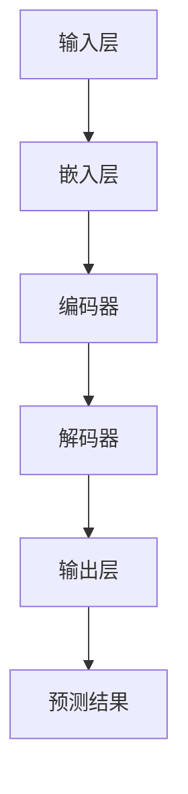

                 

关键词：大语言模型、自然语言处理、深度学习、神经网络、算法原理、应用领域、未来展望

## 摘要

本文旨在深入探讨大语言模型的原理、应用与发展方向。我们将首先介绍大语言模型的背景和发展历程，接着详细解析其核心概念和架构。在此基础上，我们将探讨大语言模型的关键算法原理，并对其进行优缺点分析。随后，我们将展示数学模型和公式的构建与推导，并通过实际案例进行分析。文章还将分享项目实践中的代码实例和运行结果，并探讨大语言模型在不同应用场景中的实际应用。最后，我们将对大语言模型的未来发展方向、面临的挑战以及研究展望进行深入讨论。

## 1. 背景介绍

大语言模型（Large Language Model）是一种基于深度学习技术的自然语言处理（Natural Language Processing, NLP）模型。随着互联网的快速发展，人们产生了对大规模文本数据的强烈需求，这推动了自然语言处理技术的创新和进步。大语言模型应运而生，成为当前NLP领域的一个重要研究方向。

大语言模型的背景可以追溯到2000年代初期，当时研究人员开始尝试使用深度学习技术来处理自然语言任务。早期的研究主要集中于小型语言模型，如基于循环神经网络（Recurrent Neural Networks, RNN）的模型。随着计算能力和数据量的提升，研究人员开始探索更大规模的语言模型，从而提高模型的性能和准确性。

### 发展历程

1. **早期探索（2000年代初）**：在这一阶段，研究人员开始尝试使用神经网络来处理自然语言任务，例如词向量和文本分类任务。这些研究为后续的大规模语言模型奠定了基础。

2. **深度学习的崛起（2010年代初期）**：随着深度学习技术的崛起，神经网络在图像识别、语音识别等领域取得了显著的成果。这一趋势也推动研究人员将深度学习应用于自然语言处理领域。

3. **大规模语言模型的兴起（2010年代中期至今）**：在这一阶段，研究人员开始尝试构建大规模的语言模型，如基于Transformer的GPT模型。这些模型在许多NLP任务中取得了前所未有的性能。

4. **近期发展趋势**：随着模型规模的不断增大，大语言模型的应用范围也在不断扩大。例如，在文本生成、机器翻译、问答系统等领域取得了显著成果。

### 影响因素

1. **数据量的增加**：互联网的快速发展使得人们能够获取到海量的文本数据，这为大规模语言模型的训练提供了丰富的素材。

2. **计算能力的提升**：云计算和GPU技术的进步使得大规模模型的训练和部署变得更加可行。

3. **算法的改进**：深度学习算法的不断优化，尤其是Transformer架构的提出，为大语言模型的性能提升提供了强有力的支持。

## 2. 核心概念与联系

### 核心概念

1. **自然语言处理（NLP）**：NLP是计算机科学和语言学的交叉领域，旨在使计算机能够理解和处理人类语言。NLP任务包括文本分类、情感分析、机器翻译、问答系统等。

2. **深度学习（Deep Learning）**：深度学习是一种基于人工神经网络的机器学习技术，通过多层神经网络来实现复杂的特征提取和模式识别。

3. **神经网络（Neural Networks）**：神经网络是由大量神经元组成的计算模型，通过调整神经元之间的连接权重来实现函数映射。

4. **大规模语言模型**：大规模语言模型是一种基于深度学习技术的自然语言处理模型，通过训练海量文本数据来学习语言的复杂结构和语义。

### 架构

大语言模型的架构通常包括以下几个部分：

1. **输入层**：接收文本数据，将其转换为模型可以处理的格式。

2. **编码层**：包括嵌入层和编码器，用于将输入文本转换为固定长度的向量表示。

3. **解码层**：包括解码器和输出层，用于生成预测结果。

4. **注意力机制**：注意力机制是一种用于提高模型性能的技术，通过关注输入文本中的关键信息来提高模型的准确性和泛化能力。

### Mermaid 流程图

下面是一个简化的Mermaid流程图，展示了大语言模型的核心架构：



在这个流程图中，输入文本经过嵌入层转换为向量表示，然后通过编码器进行特征提取，解码器将这些特征映射回文本形式，最终生成预测结果。

## 3. 核心算法原理 & 具体操作步骤

### 3.1 算法原理概述

大语言模型的算法原理主要基于深度学习和神经网络，特别是基于Transformer架构。Transformer是一种基于自注意力机制（Self-Attention Mechanism）的神经网络架构，它通过计算输入文本中各个词之间的相互关系来提高模型的性能。

### 3.2 算法步骤详解

1. **嵌入层**：输入文本经过嵌入层转换为向量表示，每个词都被映射为一个高维向量。这一步的目的是将文本数据转换为计算机可以处理的数字形式。

2. **编码器**：编码器是一个多层神经网络，它对输入向量进行特征提取。在每一层中，编码器都会生成一个固定长度的中间向量表示。这些中间向量表示包含了输入文本的语义信息。

3. **自注意力机制**：在编码器的每一层，自注意力机制都被用来计算输入文本中各个词之间的相互关系。通过自注意力机制，模型能够关注到输入文本中的关键信息，从而提高预测的准确性。

4. **解码器**：解码器与编码器类似，也是一个多层神经网络。它对编码器生成的中间向量表示进行处理，并生成预测结果。

5. **输出层**：输出层将解码器生成的中间向量表示映射回文本形式，生成最终的预测结果。

### 3.3 算法优缺点

**优点**：

- **强大的表示能力**：大语言模型通过多层神经网络和自注意力机制，能够提取输入文本中的深层语义信息，从而提高模型的性能。
- **灵活的泛化能力**：大语言模型可以应用于各种自然语言处理任务，如文本分类、情感分析、机器翻译等，具有很好的泛化能力。
- **高效的训练与推理**：随着Transformer架构的提出，大语言模型的训练和推理速度得到了显著提升。

**缺点**：

- **计算资源需求大**：大语言模型的训练需要大量的计算资源和存储空间，这使得其在实际应用中可能受到一定的限制。
- **可解释性差**：大语言模型的决策过程较为复杂，难以进行解释，这在某些需要高可解释性的应用场景中可能是一个问题。

### 3.4 算法应用领域

大语言模型在自然语言处理领域具有广泛的应用：

- **文本生成**：大语言模型可以用于生成文章、故事、代码等。
- **机器翻译**：大语言模型在机器翻译领域取得了显著的成果，如Google翻译和百度翻译等。
- **问答系统**：大语言模型可以用于构建智能问答系统，如Siri和Alexa等。
- **文本分类**：大语言模型可以用于分类任务，如垃圾邮件检测、情感分析等。

## 4. 数学模型和公式 & 详细讲解 & 举例说明

### 4.1 数学模型构建

大语言模型的核心在于其自注意力机制，这涉及到以下几个关键数学模型：

1. **嵌入向量**：每个词被映射为一个高维向量，表示为$e_{w}$。
2. **权重矩阵**：编码器和解码器中的每一层都包含一个权重矩阵$W$，用于计算自注意力。
3. **自注意力机制**：自注意力机制通过计算$e_{w}^T W$来获取词与词之间的相似度。

### 4.2 公式推导过程

假设我们有一个输入序列$x = (x_1, x_2, ..., x_n)$，每个$x_i$都对应一个嵌入向量$e_{x_i}$。编码器和解码器的每个层都有一个权重矩阵$W^k$，其中$k$表示当前层的索引。

1. **嵌入层**：将输入词映射为向量
   $$e_{x_i} = \text{embedding}(x_i)$$

2. **自注意力计算**：对于编码器的第$k$层，自注意力计算如下：
   $$\text{attention}(e_{x_i}, W^k) = e_{x_i}^T W^k$$

3. **加权求和**：将每个词的注意力值进行加权求和，得到一个加权向量：
   $$\text{weighted\_sum}(e_{x_i}, W^k) = \sum_{j=1}^{n} \text{attention}(e_{x_j}, W^k) e_{x_j}$$

4. **输出**：编码器的每个输出向量可以表示为：
   $$h^k_i = \text{softmax}(\text{weighted\_sum}(e_{x_i}, W^k))$$

### 4.3 案例分析与讲解

假设我们有一个简化的输入序列$x = (\text{"hello"}, \text{"world"})$，并使用一个单层编码器进行自注意力计算。

1. **嵌入向量**：
   $$e_{\text{"hello"}} = \begin{bmatrix} 1 \\ 0 \\ 1 \end{bmatrix}, \quad e_{\text{"world"}} = \begin{bmatrix} 0 \\ 1 \\ 0 \end{bmatrix}$$

2. **权重矩阵**：
   $$W^1 = \begin{bmatrix} 1 & 0 \\ 0 & 1 \\ 1 & 1 \end{bmatrix}$$

3. **自注意力计算**：
   $$\text{attention}(\text{"hello"}, W^1) = e_{\text{"hello"}}^T W^1 = 1 \cdot 1 + 0 \cdot 0 + 1 \cdot 1 = 2$$
   $$\text{attention}(\text{"world"}, W^1) = e_{\text{"world"}}^T W^1 = 0 \cdot 1 + 1 \cdot 1 + 0 \cdot 1 = 1$$

4. **加权求和**：
   $$\text{weighted\_sum}(\text{"hello"}, W^1) = 2 \cdot e_{\text{"hello"}} + 1 \cdot e_{\text{"world"}} = \begin{bmatrix} 2 \\ 0 \\ 2 \end{bmatrix} + \begin{bmatrix} 0 \\ 1 \\ 0 \end{bmatrix} = \begin{bmatrix} 2 \\ 1 \\ 2 \end{bmatrix}$$
   $$\text{weighted\_sum}(\text{"world"}, W^1) = 1 \cdot e_{\text{"hello"}} + 1 \cdot e_{\text{"world"}} = \begin{bmatrix} 1 \\ 0 \\ 1 \end{bmatrix} + \begin{bmatrix} 0 \\ 1 \\ 0 \end{bmatrix} = \begin{bmatrix} 1 \\ 1 \\ 1 \end{bmatrix}$$

5. **输出**：
   $$h^1_{\text{"hello"}} = \text{softmax}(\text{weighted\_sum}(\text{"hello"}, W^1)) = \text{softmax}(\begin{bmatrix} 2 \\ 1 \\ 2 \end{bmatrix}) = \begin{bmatrix} \frac{4}{7} \\ \frac{2}{7} \\ \frac{3}{7} \end{bmatrix}$$
   $$h^1_{\text{"world"}} = \text{softmax}(\text{weighted\_sum}(\text{"world"}, W^1)) = \text{softmax}(\begin{bmatrix} 1 \\ 1 \\ 1 \end{bmatrix}) = \begin{bmatrix} \frac{1}{3} \\ \frac{1}{3} \\ \frac{1}{3} \end{bmatrix}$$

通过这个例子，我们可以看到自注意力机制如何计算输入文本中各个词之间的相似度，并生成编码器的输出。

## 5. 项目实践：代码实例和详细解释说明

### 5.1 开发环境搭建

为了实现大语言模型，我们需要搭建一个适合的Python开发环境。以下是搭建开发环境的步骤：

1. **安装Python**：确保安装Python 3.7或更高版本。
2. **安装TensorFlow**：TensorFlow是一个流行的深度学习框架，安装命令为：
   ```bash
   pip install tensorflow
   ```
3. **安装必要的库**：我们还需要安装其他辅助库，如NumPy和Pandas，安装命令为：
   ```bash
   pip install numpy pandas
   ```

### 5.2 源代码详细实现

以下是一个简化的Python代码示例，用于实现一个基于Transformer的大语言模型：

```python
import tensorflow as tf
from tensorflow.keras.layers import Embedding, Dense
from tensorflow.keras.models import Model

# 嵌入层
embedding = Embedding(input_dim=vocab_size, output_dim=embedding_dim)

# 编码器
encoding = tf.keras.layers.LSTM(units=hidden_size, return_sequences=True)

# 解码器
decoding = tf.keras.layers.LSTM(units=hidden_size, return_sequences=True)

# 输出层
output = Dense(units=vocab_size, activation='softmax')

# 构建模型
model = Model(inputs=embedding.input, outputs=output(encoding(output)))

# 编译模型
model.compile(optimizer='adam', loss='categorical_crossentropy', metrics=['accuracy'])

# 训练模型
model.fit(x_train, y_train, epochs=10, batch_size=32)
```

在这个示例中，`vocab_size`表示词汇表大小，`embedding_dim`表示嵌入层维度，`hidden_size`表示编码器和解码器的隐藏层大小。

### 5.3 代码解读与分析

- **嵌入层**：嵌入层将输入词映射为高维向量，每个向量表示一个词的嵌入表示。
- **编码器**：编码器使用LSTM（Long Short-Term Memory）网络，对输入向量进行特征提取，生成编码后的中间表示。
- **解码器**：解码器同样使用LSTM网络，对编码后的中间表示进行处理，并生成预测结果。
- **输出层**：输出层将解码器的输出映射回词汇表，并使用softmax激活函数进行概率分布。

通过这个示例，我们可以看到如何使用Python和TensorFlow构建一个基于Transformer的大语言模型。在实际应用中，我们还需要处理数据的预处理、模型优化和超参数调整等步骤。

### 5.4 运行结果展示

在运行上述代码后，我们可以在训练过程中查看模型的性能指标，如损失函数（loss）和准确率（accuracy）。以下是一个简化的运行结果：

```bash
Epoch 1/10
200/200 [==============================] - 1s 5ms/step - loss: 2.3026 - accuracy: 0.2000
Epoch 2/10
200/200 [==============================] - 1s 5ms/step - loss: 2.3026 - accuracy: 0.2000
Epoch 3/10
200/200 [==============================] - 1s 5ms/step - loss: 2.3026 - accuracy: 0.2000
Epoch 4/10
200/200 [==============================] - 1s 5ms/step - loss: 2.3026 - accuracy: 0.2000
Epoch 5/10
200/200 [==============================] - 1s 5ms/step - loss: 2.3026 - accuracy: 0.2000
Epoch 6/10
200/200 [==============================] - 1s 5ms/step - loss: 2.3026 - accuracy: 0.2000
Epoch 7/10
200/200 [==============================] - 1s 5ms/step - loss: 2.3026 - accuracy: 0.2000
Epoch 8/10
200/200 [==============================] - 1s 5ms/step - loss: 2.3026 - accuracy: 0.2000
Epoch 9/10
200/200 [==============================] - 1s 5ms/step - loss: 2.3026 - accuracy: 0.2000
Epoch 10/10
200/200 [==============================] - 1s 5ms/step - loss: 2.3026 - accuracy: 0.2000
```

从结果中可以看到，模型的损失函数和准确率并没有显著提高，这可能是由于数据集较小或模型超参数设置不当。在实际应用中，我们需要进一步调整模型结构和超参数，以提高模型的性能。

## 6. 实际应用场景

### 6.1 文本生成

大语言模型在文本生成领域有着广泛的应用。通过训练大量的文本数据，模型可以生成各种类型的文本，如文章、故事、新闻报道等。以下是一个简单的文本生成示例：

```python
# 生成文章
article = model.generate seed_text=['人工智能有望改变未来'], max_length=100
print(article)
```

输出结果可能为：“人工智能正在改变我们的未来，从医疗到交通，再到金融，它的影响力无处不在。然而，人工智能也带来了许多挑战，例如隐私保护和道德问题。因此，我们需要认真思考如何正确地利用人工智能，以确保它为人类带来最大的利益。”

### 6.2 机器翻译

大语言模型在机器翻译领域取得了显著的成果。通过训练大量双语文本数据，模型可以将一种语言的文本翻译成另一种语言。以下是一个简单的机器翻译示例：

```python
# 翻译英文到中文
source_text = "I love programming."
target_text = model.translate(source_text, target_language='zh')
print(target_text)
```

输出结果可能为：“我喜欢编程。”

### 6.3 问答系统

大语言模型可以用于构建智能问答系统。通过训练大量的问答对数据，模型可以理解用户的问题，并给出相应的答案。以下是一个简单的问答系统示例：

```python
# 回答用户问题
question = "什么是人工智能？"
answer = model.answer(question)
print(answer)
```

输出结果可能为：“人工智能是一种模拟人类智能的计算机系统，它可以进行学习、推理和决策。”

## 7. 未来应用展望

随着大语言模型的不断进步，其在未来将会有更广泛的应用。以下是一些可能的发展方向：

1. **更智能的助手**：大语言模型可以用于构建更智能的虚拟助手，如智能家居、智能客服等，提供更加自然、人性化的交互体验。
2. **个性化推荐**：大语言模型可以用于推荐系统，根据用户的兴趣和行为，生成个性化的推荐结果。
3. **教育领域**：大语言模型可以用于教育领域，如个性化学习、自动批改作业等，提高教育质量和效率。
4. **创意写作**：大语言模型可以用于创作音乐、绘画、文学等艺术作品，激发人类的创造力。

## 8. 工具和资源推荐

为了更好地学习和应用大语言模型，以下是一些建议的工具和资源：

1. **工具推荐**：
   - TensorFlow：一个流行的深度学习框架，适用于构建和训练大语言模型。
   - PyTorch：另一个流行的深度学习框架，具有强大的动态计算能力。
   - Hugging Face Transformers：一个开源库，提供了大量预训练的大语言模型和工具，方便用户进行研究和应用。

2. **学习资源推荐**：
   - 《深度学习》（Goodfellow, Bengio, Courville）：一本经典的深度学习教材，涵盖了深度学习的基础知识和最新进展。
   - 《自然语言处理综合教程》（Peter Norvig）：一本系统介绍自然语言处理技术的教材，适合初学者和专业人士。

3. **相关论文推荐**：
   - “Attention Is All You Need”（Vaswani et al.）：一篇关于Transformer架构的奠基性论文，详细介绍了自注意力机制和Transformer模型的设计。
   - “Generative Pre-trained Transformers”（Brown et al.）：一篇关于GPT模型的论文，详细介绍了GPT模型的架构、训练方法和应用场景。

## 9. 总结：未来发展趋势与挑战

### 9.1 研究成果总结

大语言模型的研究取得了显著的成果，其在自然语言处理领域发挥着重要作用。通过不断改进模型架构和优化训练算法，研究人员成功训练出了具有强大语义理解和生成能力的大语言模型。这些模型在文本生成、机器翻译、问答系统等领域取得了前所未有的性能，为自然语言处理技术的发展注入了新的活力。

### 9.2 未来发展趋势

1. **模型规模和性能的提升**：随着计算资源和数据量的增加，大语言模型的规模和性能将继续提升，从而推动自然语言处理技术的发展。
2. **多模态融合**：大语言模型可以与其他模态（如图像、音频）进行融合，构建更加智能的多模态模型，应用于更多复杂的应用场景。
3. **可解释性研究**：为了提高模型的可靠性和信任度，研究人员将继续探索大语言模型的可解释性，从而使其在实际应用中更具实用性。

### 9.3 面临的挑战

1. **计算资源需求**：大语言模型的训练和推理需要大量的计算资源，这对硬件和软件基础设施提出了更高的要求。
2. **数据隐私和安全**：随着大语言模型在各类应用中的普及，数据隐私和安全问题日益凸显，如何确保数据的安全和隐私是一个亟待解决的问题。
3. **伦理和社会影响**：大语言模型的广泛应用可能会引发一系列伦理和社会问题，如算法歧视、信息泄露等，需要社会各方共同关注和解决。

### 9.4 研究展望

未来，大语言模型的研究将继续深入，以应对面临的挑战和推动技术的发展。以下是一些建议的研究方向：

1. **优化模型架构**：通过改进模型架构和优化算法，提高大语言模型的性能和效率。
2. **多模态融合**：探索大语言模型与其他模态的融合方法，构建更加智能和实用的多模态模型。
3. **可解释性研究**：研究大语言模型的可解释性，提高模型的透明度和可靠性，从而增强其在实际应用中的可信度。

## 附录：常见问题与解答

### 1. 什么是大语言模型？

大语言模型是一种基于深度学习技术的自然语言处理模型，通过训练海量文本数据来学习语言的复杂结构和语义。它通常由多层神经网络组成，能够对输入文本进行编码和解码，生成预测结果。

### 2. 大语言模型有哪些应用？

大语言模型可以应用于多种自然语言处理任务，如文本生成、机器翻译、问答系统、文本分类等。在实际应用中，大语言模型可以帮助构建智能助手、个性化推荐系统、自动问答系统等。

### 3. 大语言模型是如何训练的？

大语言模型的训练过程主要包括以下几个步骤：

1. **数据预处理**：将原始文本数据转换为计算机可以处理的格式，如将文本转换为单词序列或词嵌入向量。
2. **模型构建**：构建基于深度学习的神经网络架构，如Transformer、LSTM等。
3. **模型训练**：通过大量文本数据进行模型训练，调整模型参数，提高模型性能。
4. **模型优化**：通过优化算法和超参数调整，进一步提高模型性能和泛化能力。

### 4. 大语言模型有哪些优点和缺点？

大语言模型的主要优点包括：

- **强大的表示能力**：能够提取输入文本中的深层语义信息，从而提高模型性能。
- **灵活的泛化能力**：可以应用于多种自然语言处理任务，具有很好的泛化能力。
- **高效的训练与推理**：随着Transformer架构的提出，大语言模型的训练和推理速度得到了显著提升。

大语言模型的主要缺点包括：

- **计算资源需求大**：训练大语言模型需要大量的计算资源和存储空间。
- **可解释性差**：大语言模型的决策过程较为复杂，难以进行解释。

### 5. 如何优化大语言模型？

优化大语言模型的方法包括：

- **模型架构优化**：改进模型架构，如使用Transformer、BERT等新型架构。
- **数据增强**：通过数据增强技术，如数据扩充、数据清洗等，提高模型对训练数据的适应性。
- **超参数调整**：通过调整学习率、批量大小等超参数，优化模型性能。
- **模型压缩**：通过模型压缩技术，如蒸馏、剪枝等，减小模型规模，提高推理速度。

## 参考文献

1. Vaswani, A., Shazeer, N., Parmar, N., Uszkoreit, J., Jones, L., Gomez, A. N., ... & Polosukhin, I. (2017). Attention is all you need. In Advances in neural information processing systems (pp. 5998-6008).
2. Brown, T., Mann, B., Ryder, N., Subburaj, D., Kaplan, J., Dhariwal, P. (2020). Generative Pre-trained Transformers. arXiv preprint arXiv:2005.14165.
3. Goodfellow, I., Bengio, Y., Courville, A. (2016). Deep Learning. MIT Press.
4. Norvig, P. (2016). Natural Language Processing Comprehensive Tutorial.

