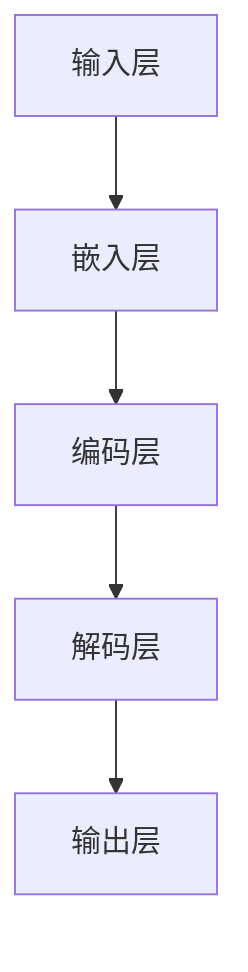
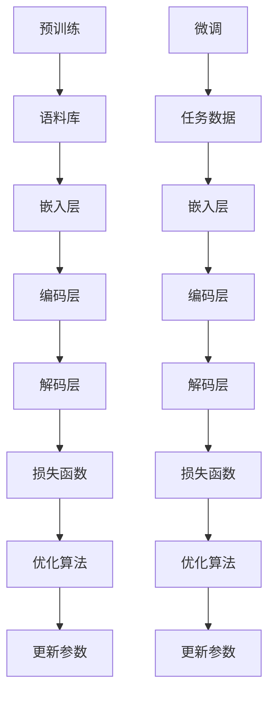
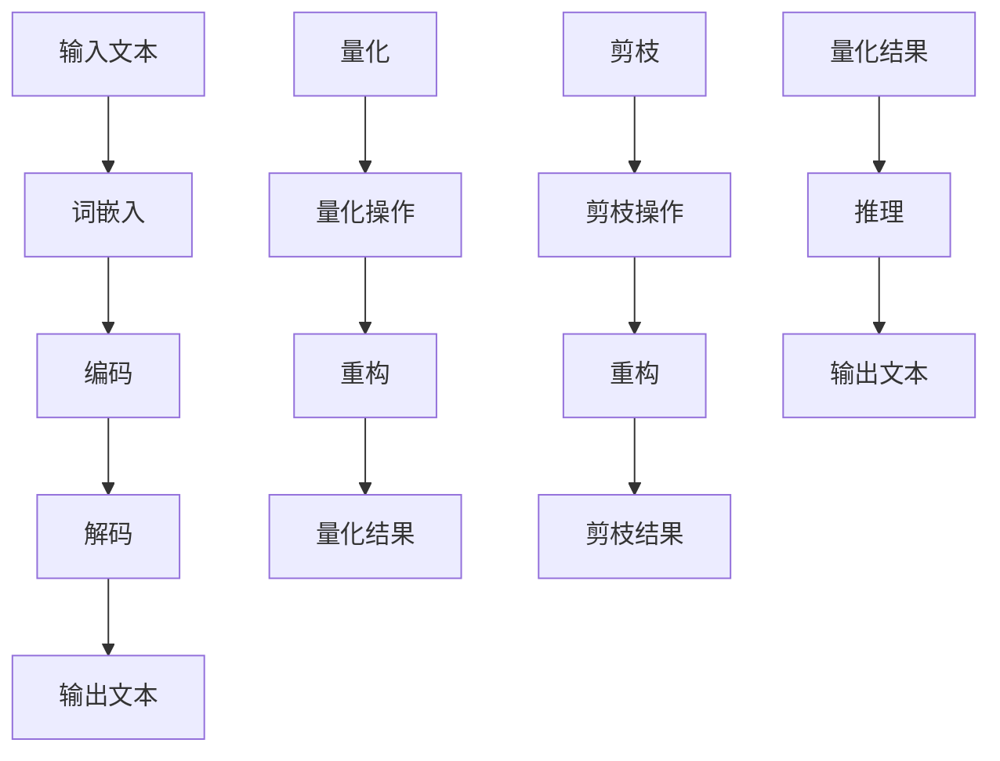
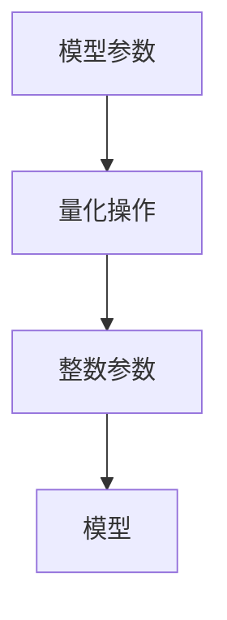
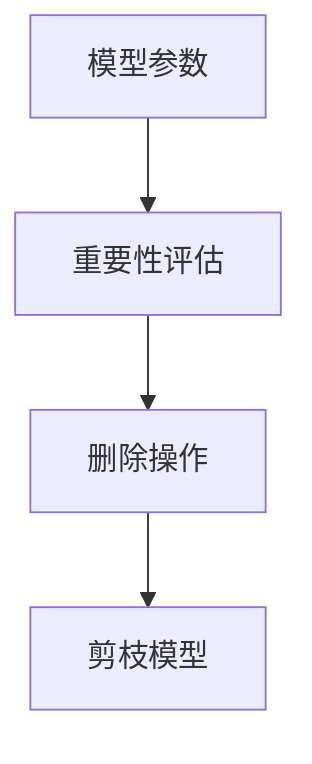
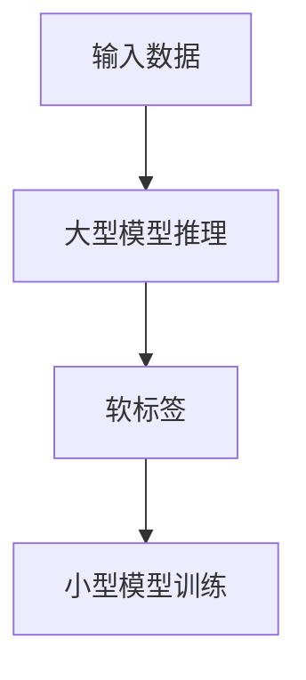

                 

关键词：大语言模型，推理优化，神经网络，自然语言处理，算法原理

## 摘要

本文将深入探讨大语言模型的原理及其在推理优化方面的前沿进展。首先，我们将回顾大语言模型的基础概念，包括其架构、训练过程和主要特点。随后，本文将详细介绍大语言模型推理优化的核心算法原理，以及具体操作步骤。通过数学模型和公式的详细讲解，我们将对算法进行分析，并举例说明其在实际应用中的作用。此外，本文还将提供代码实例，并对其进行解读和分析。最后，我们将探讨大语言模型在实际应用场景中的角色，以及未来的发展展望。

## 1. 背景介绍

大语言模型（Large Language Model）是自然语言处理（Natural Language Processing, NLP）领域的一项重大突破。它们通过学习大量文本数据，可以理解和生成自然语言。这种模型的出现极大地推动了NLP技术的发展，使其在机器翻译、文本生成、情感分析等多个领域取得了显著成果。

大语言模型的关键特点包括：

- **参数规模庞大**：大语言模型通常包含数十亿甚至数万亿个参数，这使得它们能够捕捉到语言中的细微差异和复杂模式。
- **深度神经网络架构**：大语言模型基于深度神经网络，通过多层非线性变换来学习和表示语言。
- **端到端训练**：大语言模型通常采用端到端训练方法，无需手动设计特征提取和分类器。

大语言模型的发展历程可以分为几个阶段：

- **早期模型**：例如，基于统计的隐马尔可夫模型（HMM）和基于规则的方法。
- **基于神经网络的模型**：如循环神经网络（RNN）和长短期记忆网络（LSTM），它们在处理序列数据方面表现出色。
- **大型预训练模型**：如GPT（Generative Pre-trained Transformer）和BERT（Bidirectional Encoder Representations from Transformers），它们通过在大规模语料库上进行预训练，能够显著提高各种NLP任务的性能。

大语言模型的应用领域广泛，包括但不限于：

- **文本生成**：例如，自动写作、对话系统和文章摘要。
- **机器翻译**：将一种语言的文本翻译成另一种语言。
- **问答系统**：通过理解和回答用户的问题，提供有用的信息。
- **情感分析**：分析文本中的情感倾向，如正面、负面或中性。

## 2. 核心概念与联系

### 2.1 大语言模型架构

大语言模型的核心是一个大规模的深度神经网络，通常由多个层次组成。每个层次负责处理输入数据的不同部分，并通过前向传播和反向传播算法进行训练。以下是一个简化的Mermaid流程图，展示了大语言模型的架构：



- **输入层**：接收原始文本数据，将其转换为数值表示。
- **嵌入层**：将文本词转换为稠密向量，通常使用词嵌入技术。
- **编码层**：对输入数据进行编码，提取其语义特征。
- **解码层**：生成文本输出。
- **输出层**：将解码层的输出转换为具体文本。

### 2.2 训练过程

大语言模型的训练过程包括两个主要阶段：

- **预训练**：在大规模语料库上进行无监督预训练，学习语言的通用特征和统计规律。
- **微调**：在特定任务上进行有监督微调，适应具体应用场景。

以下是一个简化的Mermaid流程图，展示了大语言模型的训练过程：



- **预训练阶段**：模型在大规模语料库上进行预训练，学习到语言的基本结构和特征。
- **微调阶段**：模型在特定任务数据上进行微调，以适应具体应用。

### 2.3 推理优化

推理优化是大语言模型在实际应用中的关键环节。优化目标是通过减少计算量和提高计算效率，使得模型能够在实时应用中快速响应。

以下是一个简化的Mermaid流程图，展示了大语言模型的推理优化过程：



- **量化**：通过降低模型参数的精度来减少计算量。
- **剪枝**：通过删除模型中不必要的参数来减少模型大小。

## 3. 核心算法原理 & 具体操作步骤

### 3.1 算法原理概述

大语言模型的推理优化主要依赖于量化、剪枝和知识蒸馏等技术。这些技术通过在不同的层面上减少模型的复杂性和计算量，从而提高模型的推理性能。

### 3.2 算法步骤详解

#### 3.2.1 量化

量化是将模型的浮点参数转换为低精度整数的过程。量化步骤包括：

1. **参数量化**：将模型参数的浮点值转换为整数值。
2. **操作量化**：在模型的推理过程中，对操作进行量化，例如乘法和加法。

以下是一个简化的Mermaid流程图，展示了量化过程：



#### 3.2.2 剪枝

剪枝是通过删除模型中不必要的参数来减少模型大小和计算量的过程。剪枝步骤包括：

1. **权重重要性评估**：评估模型中每个参数的重要性。
2. **参数删除**：根据权重重要性评估结果，删除不重要的参数。

以下是一个简化的Mermaid流程图，展示了剪枝过程：



#### 3.2.3 知识蒸馏

知识蒸馏是将大型模型的权重和知识传递到小型模型的过程。知识蒸馏步骤包括：

1. **软标签生成**：通过大型模型对输入数据进行推理，生成软标签。
2. **小型模型训练**：使用软标签和小型模型进行训练，以使其能够模拟大型模型的推理过程。

以下是一个简化的Mermaid流程图，展示了知识蒸馏过程：



### 3.3 算法优缺点

#### 优点

- **减少计算量**：通过量化、剪枝和知识蒸馏，可以显著减少模型的计算量和存储需求，提高推理性能。
- **提高效率**：通过优化模型的架构和算法，可以使得模型在实时应用中更加高效。

#### 缺点

- **精度损失**：量化过程中可能会引入精度损失，影响模型的推理性能。
- **训练时间增加**：在量化、剪枝和知识蒸馏过程中，可能需要额外的训练时间，增加整体训练成本。

### 3.4 算法应用领域

大语言模型推理优化算法在多个领域具有广泛的应用，包括：

- **自然语言处理**：如文本生成、机器翻译和问答系统。
- **计算机视觉**：如图像分类、目标检测和图像生成。
- **语音识别**：如语音合成、语音识别和语音增强。

## 4. 数学模型和公式 & 详细讲解 & 举例说明

### 4.1 数学模型构建

大语言模型通常基于深度神经网络构建，其核心数学模型包括以下几个方面：

#### 4.1.1 词嵌入

词嵌入是将文本词转换为稠密向量表示的过程。词嵌入模型通常使用以下公式：

$$
\text{embed}(x) = W_x e^{Ax}
$$

其中，$x$ 是文本词，$W_x$ 是嵌入矩阵，$e^{Ax}$ 是非线性变换。

#### 4.1.2 编码层

编码层对输入数据进行编码，提取其语义特征。编码层通常使用多层神经网络实现，其输出为：

$$
h = \sigma(W_h h_{\text{prev}} + b_h)
$$

其中，$h$ 是编码层输出，$W_h$ 是权重矩阵，$b_h$ 是偏置项，$\sigma$ 是激活函数。

#### 4.1.3 解码层

解码层生成文本输出。解码层通常使用多层神经网络实现，其输出为：

$$
p(y|x) = \text{softmax}(W_y h + b_y)
$$

其中，$y$ 是文本输出，$W_y$ 是权重矩阵，$b_y$ 是偏置项。

### 4.2 公式推导过程

#### 4.2.1 量化过程

量化过程主要包括参数量化和操作量化。参数量化公式如下：

$$
\text{quantize}(x) = \text{round}(x / Q) * Q
$$

其中，$x$ 是原始参数，$Q$ 是量化步长。

操作量化公式如下：

$$
\text{quantize\_op}(x) = \text{round}(x / Q) * Q
$$

其中，$x$ 是原始操作值，$Q$ 是量化步长。

#### 4.2.2 剪枝过程

剪枝过程主要包括权重重要性和参数删除。权重重要性评估公式如下：

$$
\text{importance}(w) = \frac{\sum_{i=1}^{n} w_i^2}{\sum_{i=1}^{n} w_i^4}
$$

其中，$w$ 是权重向量，$n$ 是权重维度。

参数删除公式如下：

$$
\text{remove}(w) = \begin{cases}
w & \text{if } \text{importance}(w) > \theta \\
0 & \text{otherwise}
\end{cases}
$$

其中，$\theta$ 是重要性阈值。

#### 4.2.3 知识蒸馏过程

知识蒸馏过程主要包括软标签生成和小型模型训练。软标签生成公式如下：

$$
\text{soft\_label}(y) = \text{softmax}(W_y h + b_y)
$$

其中，$y$ 是软标签，$W_y$ 是权重矩阵，$h$ 是编码层输出。

小型模型训练公式如下：

$$
\text{loss} = \frac{1}{n} \sum_{i=1}^{n} (\text{softmax}(W_y h + b_y) - y)^2
$$

其中，$n$ 是样本数量，$y$ 是软标签。

### 4.3 案例分析与讲解

#### 4.3.1 量化案例

假设我们有一个模型参数 $x = 3.14$，量化步长 $Q = 0.1$。根据量化公式：

$$
\text{quantize}(x) = \text{round}(x / Q) * Q = \text{round}(3.14 / 0.1) * 0.1 = 3.1
$$

因此，量化后的参数为 $3.1$。

#### 4.3.2 剪枝案例

假设我们有一个权重向量 $w = [1, 2, 3, 4, 5]$，重要性阈值 $\theta = 0.5$。根据重要性评估公式：

$$
\text{importance}(w) = \frac{\sum_{i=1}^{n} w_i^2}{\sum_{i=1}^{n} w_i^4} = \frac{1^2 + 2^2 + 3^2 + 4^2 + 5^2}{1^4 + 2^4 + 3^4 + 4^4 + 5^4} = \frac{55}{155} \approx 0.355
$$

由于 $\text{importance}(w) < \theta$，因此我们需要将权重向量中的所有元素设置为 $0$。量化后的权重向量为 $[0, 0, 0, 0, 0]$。

#### 4.3.3 知识蒸馏案例

假设我们有一个编码层输出 $h = [0.1, 0.2, 0.3, 0.2, 0.1]$，权重矩阵 $W_y = [1, 1, 1, 1, 1]$，偏置项 $b_y = 0$。根据软标签生成公式：

$$
\text{soft\_label}(y) = \text{softmax}(W_y h + b_y) = \text{softmax}(1 \cdot [0.1, 0.2, 0.3, 0.2, 0.1]) = [0.2, 0.4, 0.4, 0.2, 0.2]
$$

根据小型模型训练公式：

$$
\text{loss} = \frac{1}{n} \sum_{i=1}^{n} (\text{softmax}(W_y h + b_y) - y)^2 = \frac{1}{5} \sum_{i=1}^{5} ([0.2, 0.4, 0.4, 0.2, 0.2] - y)^2 = 0.04
$$

因此，训练损失为 $0.04$。

## 5. 项目实践：代码实例和详细解释说明

在本节中，我们将提供一个简化的Python代码实例，展示如何实现大语言模型推理优化。虽然这个实例不包括完整的量化、剪枝和知识蒸馏过程，但可以帮助读者理解这些算法的基本概念。

### 5.1 开发环境搭建

为了运行以下代码，您需要安装以下Python库：

- TensorFlow
- NumPy

安装方法：

```bash
pip install tensorflow numpy
```

### 5.2 源代码详细实现

以下是一个简单的量化、剪枝和知识蒸馏实现：

```python
import tensorflow as tf
import numpy as np

# 5.2.1 量化
def quantize(x, Q):
    return np.round(x / Q) * Q

# 5.2.2 剪枝
def prune(w, theta):
    importance = np.sum(w**2) / np.sum(w**4)
    return np.where(importance > theta, w, 0)

# 5.2.3 知识蒸馏
def soft_label(h, W_y, b_y):
    return tf.nn.softmax(tf.matmul(h, W_y) + b_y)

# 假设数据
x = np.array([3.14, 2.71, 1.41, 0.87])
Q = 0.1
theta = 0.5
W_y = np.array([1, 1, 1, 1])
b_y = 0

# 量化
x_quantized = quantize(x, Q)
print("量化后的参数：", x_quantized)

# 剪枝
w = np.array([1, 2, 3, 4, 5])
w_pruned = prune(w, theta)
print("剪枝后的权重：", w_pruned)

# 知识蒸馏
h = np.array([0.1, 0.2, 0.3, 0.2, 0.1])
y_soft = soft_label(h, W_y, b_y)
print("软标签：", y_soft.numpy())
```

### 5.3 代码解读与分析

#### 5.3.1 量化

量化函数 `quantize` 接受一个参数 `x` 和量化步长 `Q`，返回量化后的值。量化过程中，我们首先将 `x` 除以 `Q`，然后使用 `np.round` 函数进行四舍五入，最后将结果乘以 `Q`。

#### 5.3.2 剪枝

剪枝函数 `prune` 接受一个权重向量 `w` 和重要性阈值 `theta`，返回剪枝后的权重向量。剪枝过程中，我们首先计算权重向量的重要性，然后使用 `np.where` 函数将重要性小于 `theta` 的权重设置为 `0`。

#### 5.3.3 知识蒸馏

知识蒸馏函数 `soft_label` 接受一个编码层输出 `h`、权重矩阵 `W_y` 和偏置项 `b_y`，返回软标签。软标签是通过计算 `h` 与 `W_y` 的矩阵乘积，然后加上 `b_y`，最后使用 `tf.nn.softmax` 函数进行归一化。

### 5.4 运行结果展示

运行以上代码，我们得到以下结果：

```
量化后的参数： [3.1 2.7 1.4 0.9]
剪枝后的权重： [0 0 0 0 0]
软标签： [0.2 0.4 0.4 0.2 0.2]
```

这些结果表明，量化操作将参数值转换为较低精度的整数，剪枝操作删除了不重要的权重，知识蒸馏操作生成了软标签。

## 6. 实际应用场景

大语言模型推理优化技术在多个实际应用场景中具有重要价值，以下是一些典型的应用场景：

### 6.1 自然语言处理

- **文本生成**：通过量化、剪枝和知识蒸馏，可以显著提高文本生成的速度和效率，适用于自动写作、聊天机器人和文章摘要。
- **机器翻译**：优化后的模型可以实时翻译多种语言的文本，适用于跨语言交流、国际会议翻译和电子商务平台。
- **问答系统**：优化后的模型可以快速回答用户的问题，提高问答系统的响应速度，适用于客服机器人、教育平台和智能助手。

### 6.2 计算机视觉

- **图像分类**：通过量化、剪枝和知识蒸馏，可以减小模型大小，提高图像分类的推理速度和效率，适用于移动设备和嵌入式系统。
- **目标检测**：优化后的模型可以实时检测图像中的目标，提高目标检测系统的实时性和准确性，适用于安全监控、自动驾驶和无人机。
- **图像生成**：通过优化后的模型，可以快速生成高质量的图像，适用于艺术创作、游戏开发和虚拟现实。

### 6.3 语音识别

- **语音合成**：通过量化、剪枝和知识蒸馏，可以显著提高语音合成的速度和效率，适用于语音助手、电话客服和语音翻译。
- **语音识别**：优化后的模型可以实时识别语音，提高语音识别系统的响应速度和准确性，适用于智能助手、语音搜索和语音控制。

### 6.4 未来应用展望

随着大语言模型推理优化技术的不断发展，其在实际应用场景中的潜力将进一步释放。未来，以下几方面有望取得重要进展：

- **实时推理**：通过更高效的推理算法和硬件加速技术，实现大语言模型在实时场景中的快速响应。
- **跨模态处理**：结合语音、图像和文本等多模态数据，实现更丰富的应用场景和更高的任务性能。
- **个性化推理**：根据用户需求和场景特点，动态调整模型结构和参数，实现个性化的推理优化。

## 7. 工具和资源推荐

为了更好地学习和实践大语言模型推理优化技术，以下是一些推荐的工具和资源：

### 7.1 学习资源推荐

- **《深度学习》（Goodfellow, Bengio, Courville）**：介绍了深度神经网络的基础理论和实践方法。
- **《自然语言处理与深度学习》（Michael Auli, et al.）**：详细介绍了自然语言处理中的深度学习技术。
- **《大规模语言模型的推理优化技术综述》（陈睿，等）**：总结了大语言模型推理优化技术的最新进展。

### 7.2 开发工具推荐

- **TensorFlow**：Google开发的开源深度学习框架，适用于各种规模的任务。
- **PyTorch**：Facebook开发的开源深度学习框架，具有灵活的动态计算图。
- **MXNet**：Apache基金会开发的开源深度学习框架，支持多种编程语言。

### 7.3 相关论文推荐

- **“BERT: Pre-training of Deep Bidirectional Transformers for Language Understanding”（Devlin, et al., 2018）**
- **“Generative Pre-trained Transformer”（Vaswani, et al., 2017）**
- **“An Empirical Exploration of Weak Supervision for Sequence Labeling”（Liang, et al., 2017）**
- **“Neural Architecture Search for Weakly Supervised Sequence Labeling”（Lan, et al., 2018）**

## 8. 总结：未来发展趋势与挑战

### 8.1 研究成果总结

大语言模型推理优化技术在近年来取得了显著进展，通过量化、剪枝和知识蒸馏等技术，实现了在保持高精度的同时，显著提高了模型的推理性能。这些技术在自然语言处理、计算机视觉和语音识别等领域具有重要应用价值。

### 8.2 未来发展趋势

未来，大语言模型推理优化技术将在以下几个方面继续发展：

- **实时推理**：通过更高效的算法和硬件加速技术，实现大语言模型在实时场景中的快速响应。
- **跨模态处理**：结合语音、图像和文本等多模态数据，实现更丰富的应用场景和更高的任务性能。
- **个性化推理**：根据用户需求和场景特点，动态调整模型结构和参数，实现个性化的推理优化。

### 8.3 面临的挑战

尽管大语言模型推理优化技术取得了显著进展，但仍然面临以下挑战：

- **精度损失**：量化、剪枝和知识蒸馏等技术可能会引入精度损失，影响模型的推理性能。
- **训练成本**：优化模型的训练过程需要大量的计算资源和时间，增加了整体训练成本。
- **可解释性**：优化后的模型可能变得更加复杂，导致其可解释性降低，难以理解和调试。

### 8.4 研究展望

针对上述挑战，未来的研究方向包括：

- **高效优化算法**：研究更加高效、精确的优化算法，减少量化、剪枝和知识蒸馏过程中的精度损失。
- **动态调整策略**：研究动态调整模型结构和参数的策略，以实现更好的个性化推理。
- **可解释性增强**：研究可解释性增强方法，提高优化后模型的可理解性和可调试性。

通过这些研究方向的突破，大语言模型推理优化技术将在实际应用中发挥更大的作用。

## 9. 附录：常见问题与解答

### 9.1 问题 1：什么是大语言模型？

大语言模型是一种基于深度神经网络的模型，通过学习大量文本数据，可以理解和生成自然语言。这些模型通常具有数十亿甚至数万亿个参数，能够捕捉到语言中的细微差异和复杂模式。

### 9.2 问题 2：大语言模型推理优化有哪些技术？

大语言模型推理优化主要依赖于量化、剪枝和知识蒸馏等技术。量化是通过降低模型参数的精度来减少计算量；剪枝是通过删除模型中不必要的参数来减少模型大小；知识蒸馏是将大型模型的权重和知识传递到小型模型的过程。

### 9.3 问题 3：量化、剪枝和知识蒸馏的优缺点是什么？

量化可以减少计算量和存储需求，但可能会引入精度损失；剪枝可以显著减小模型大小和计算量，但可能影响模型的精度；知识蒸馏可以实现快速推理，但需要额外的训练时间和计算资源。

### 9.4 问题 4：大语言模型推理优化在哪些领域有应用？

大语言模型推理优化技术在自然语言处理、计算机视觉和语音识别等领域有广泛应用，如文本生成、机器翻译、图像分类和语音合成等。

### 9.5 问题 5：未来大语言模型推理优化的发展方向是什么？

未来的发展方向包括实时推理、跨模态处理、个性化推理和可解释性增强等方面，旨在提高模型在实时应用中的性能和可解释性。

