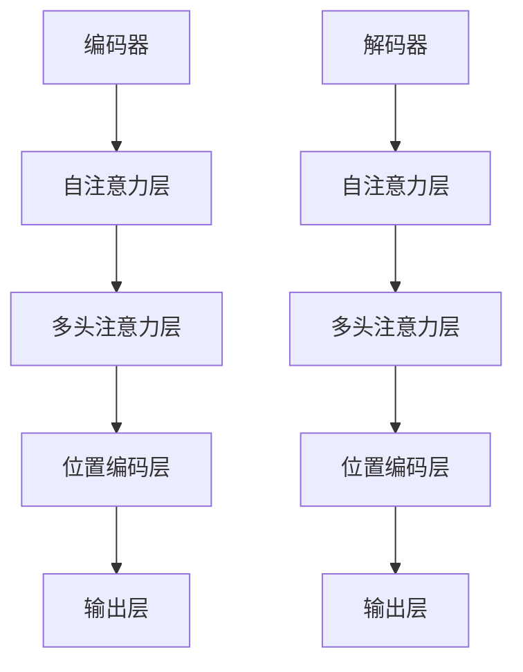

                 

关键词：大语言模型，原理基础，前沿技术，提示语言模型，校准方法，人工智能，深度学习，神经网络

## 摘要

本文旨在深入探讨大语言模型的原理基础和前沿发展，特别关注如何校准提示语言模型，以实现更准确、更可靠的语义理解和生成。文章首先介绍了大语言模型的基本概念和架构，随后详细阐述了核心算法原理与具体操作步骤，并通过数学模型和公式的推导，提供了清晰的理论框架。在此基础上，文章通过代码实例和实践分析，展示了大语言模型在实际开发中的应用。最后，文章总结了未来发展趋势和面临的挑战，并推荐了相关学习和开发资源。

## 1. 背景介绍

在当今的科技领域中，人工智能（AI）已经成为了一个不可忽视的重要领域。随着计算能力的提升和海量数据的积累，深度学习技术取得了显著的进展，特别是神经网络的应用使得机器学习领域迎来了新的变革。大语言模型（Large Language Models）作为深度学习的重要分支，近年来在自然语言处理（NLP）领域展现出了强大的潜力。

### 1.1 大语言模型的起源与发展

大语言模型的起源可以追溯到20世纪80年代末和90年代初，当时研究人员开始尝试使用神经网络来处理文本数据。最初的模型比较简单，例如基于循环神经网络（RNN）的语言模型，虽然在某些任务上取得了初步的成功，但受限于计算资源和模型复杂性，其效果并不理想。

随着深度学习技术的兴起，特别是在2013年，AlexNet在图像识别上的突破性表现引发了深度学习的热潮。受此启发，NLP领域的学者开始将深度学习技术应用于语言模型，并取得了一系列重要成果。2018年，Google发布了BERT模型，标志着大语言模型进入了新的时代。BERT模型通过预训练和微调，在多个NLP任务上取得了显著性能提升，引起了广泛关注。

### 1.2 大语言模型的应用场景

大语言模型的应用场景非常广泛，涵盖了文本生成、语义理解、机器翻译、问答系统等多个领域。在文本生成方面，大语言模型可以生成文章、摘要、对话等文本内容，广泛应用于自动写作、内容创作等领域。在语义理解方面，大语言模型能够对文本进行深入解析，提取出关键信息，为信息检索、智能客服等应用提供支持。

### 1.3 本文的目标

本文的目标是深入探讨大语言模型的原理基础和前沿发展，特别关注如何校准提示语言模型，以实现更准确、更可靠的语义理解和生成。通过本文的阅读，读者将能够了解大语言模型的基本概念、架构和核心算法原理，掌握校准提示语言模型的方法和技巧，并能够将其应用于实际开发中。

## 2. 核心概念与联系

### 2.1 大语言模型的基本概念

大语言模型（Large Language Models）是指使用大规模数据集进行训练的深度神经网络，用于预测自然语言中的下一个单词或序列。与传统的小型语言模型相比，大语言模型具有以下几个显著特点：

1. **大规模数据集**：大语言模型通常使用数十亿级别的文本数据集进行训练，这为模型提供了丰富的语言信息，使其能够更好地捕捉语言的复杂性和多样性。
2. **深度神经网络架构**：大语言模型通常采用深度神经网络架构，例如Transformer模型，这有助于模型在处理长文本和复杂语义时保持稳定性和高效性。
3. **多任务学习**：大语言模型不仅能够进行文本生成，还能够进行语义理解、问答系统等多种任务，这得益于其高度泛化的能力。

### 2.2 大语言模型的架构

大语言模型的架构通常包括以下几个关键部分：

1. **编码器（Encoder）**：编码器用于将输入的文本序列转换为连续的向量表示。在Transformer模型中，编码器由多个自注意力（self-attention）层组成，能够捕捉文本序列中的长距离依赖关系。
2. **解码器（Decoder）**：解码器用于生成文本序列的输出。在Transformer模型中，解码器同样由多个自注意力层和交叉注意力层组成，能够生成与输入文本对应的输出序列。
3. **嵌入层（Embedding Layer）**：嵌入层将输入的单词或字符转换为固定长度的向量表示，这些向量表示了单词或字符在语义上的特征。
4. **输出层（Output Layer）**：输出层通常是一个全连接层，用于将解码器生成的序列向量映射到输出词汇表中。

### 2.3 大语言模型的核心算法原理

大语言模型的核心算法原理主要包括以下几个方面：

1. **自注意力机制（Self-Attention）**：自注意力机制是一种用于计算文本序列中各个单词之间相互依赖关系的算法。通过自注意力机制，编码器能够捕捉文本序列中的长距离依赖关系，从而提高模型的语义理解能力。
2. **多头注意力（Multi-Head Attention）**：多头注意力是一种扩展自注意力机制的算法，通过多个独立的注意力头，编码器能够从不同角度捕捉文本序列的依赖关系，从而提高模型的泛化能力。
3. **位置编码（Positional Encoding）**：位置编码是一种用于编码文本序列中各个单词位置信息的算法。通过位置编码，解码器能够了解输入文本的顺序，从而生成正确的输出序列。
4. **预训练与微调（Pre-training and Fine-tuning）**：预训练是指在大量未标注的数据集上对模型进行训练，使其具备一定的语义理解和生成能力。微调是指在预训练的基础上，使用少量标注数据对模型进行进一步训练，以适应特定的任务需求。

### 2.4 Mermaid 流程图



### 2.5 大语言模型的优点与不足

**优点**：

1. **强大的语义理解能力**：大语言模型通过自注意力机制和多头注意力机制，能够捕捉文本序列中的长距离依赖关系，从而实现强大的语义理解能力。
2. **多任务学习**：大语言模型能够通过预训练和微调，同时进行多种NLP任务，具有较高的泛化能力。
3. **丰富的数据来源**：大语言模型使用大规模数据集进行训练，能够从海量数据中学习到丰富的语言特征。

**不足**：

1. **计算资源需求高**：大语言模型通常需要大量计算资源进行训练，这对硬件设施提出了较高的要求。
2. **模型解释性较差**：由于大语言模型是一个复杂的深度神经网络，其内部机制较为复杂，难以进行直观的解释和理解。

## 3. 核心算法原理 & 具体操作步骤

### 3.1 算法原理概述

大语言模型的核心算法原理主要基于自注意力机制和多头注意力机制。自注意力机制是一种用于计算文本序列中各个单词之间相互依赖关系的算法，通过自注意力机制，编码器能够捕捉文本序列中的长距离依赖关系。多头注意力是一种扩展自注意力机制的算法，通过多个独立的注意力头，编码器能够从不同角度捕捉文本序列的依赖关系，从而提高模型的泛化能力。预训练与微调是构建大语言模型的两个关键步骤，预训练使模型具备一定的语义理解和生成能力，微调则使模型能够适应特定的任务需求。

### 3.2 算法步骤详解

#### 3.2.1 自注意力机制

1. **输入文本序列表示**：将输入的文本序列表示为向量序列，每个向量表示文本序列中的一个单词或字符。
2. **计算自注意力得分**：对于每个单词，计算其与其他单词之间的相似度得分，这通常通过点积（dot-product）或者缩放点积（scaled dot-product）实现。
3. **应用softmax函数**：对自注意力得分进行softmax变换，得到概率分布，表示每个单词在文本序列中的重要性。
4. **加权求和**：将每个单词的向量与其对应的概率分布相乘，然后求和，得到加权求和的结果，这是最终的文本表示。

#### 3.2.2 多头注意力机制

1. **分解自注意力机制**：将自注意力机制分解为多个独立的注意力头，每个注意力头具有不同的权重。
2. **独立计算自注意力**：对于每个注意力头，独立计算自注意力得分和加权求和，得到每个注意力头的文本表示。
3. **拼接注意力头**：将所有注意力头的文本表示拼接起来，形成一个更丰富的文本表示。

#### 3.2.3 位置编码

1. **生成位置编码向量**：根据文本序列的长度，生成一组位置编码向量，这些向量表示了文本序列中各个单词的位置信息。
2. **添加到嵌入层**：将位置编码向量添加到单词的嵌入向量中，形成一个包含位置信息的嵌入向量。
3. **输入到自注意力机制**：将包含位置信息的嵌入向量输入到自注意力机制中，以计算自注意力得分。

#### 3.2.4 预训练与微调

1. **预训练**：在大规模未标注的数据集上对模型进行预训练，使其学习到语言的一般特征。
2. **微调**：在预训练的基础上，使用少量标注数据对模型进行微调，使其适应特定的任务需求。

### 3.3 算法优缺点

#### 优点

1. **强大的语义理解能力**：通过自注意力机制和多头注意力机制，大语言模型能够捕捉文本序列中的长距离依赖关系，实现强大的语义理解能力。
2. **多任务学习**：大语言模型能够通过预训练和微调，同时进行多种NLP任务，具有较高的泛化能力。
3. **丰富的数据来源**：大语言模型使用大规模数据集进行训练，能够从海量数据中学习到丰富的语言特征。

#### 缺点

1. **计算资源需求高**：大语言模型通常需要大量计算资源进行训练，这对硬件设施提出了较高的要求。
2. **模型解释性较差**：由于大语言模型是一个复杂的深度神经网络，其内部机制较为复杂，难以进行直观的解释和理解。

### 3.4 算法应用领域

大语言模型的应用领域非常广泛，主要包括以下几个方面：

1. **文本生成**：大语言模型能够生成高质量的文章、摘要、对话等文本内容，广泛应用于自动写作、内容创作等领域。
2. **语义理解**：大语言模型能够对文本进行深入解析，提取出关键信息，为信息检索、智能客服等应用提供支持。
3. **机器翻译**：大语言模型在机器翻译领域也取得了显著成果，能够实现高质量、多语言的翻译。
4. **问答系统**：大语言模型能够理解用户的问题，并生成准确的回答，广泛应用于智能客服、智能搜索等领域。

## 4. 数学模型和公式 & 详细讲解 & 举例说明

### 4.1 数学模型构建

大语言模型的数学模型主要包括输入层、编码器、解码器、输出层等部分。下面将详细介绍各部分的主要数学模型和公式。

#### 4.1.1 输入层

输入层的主要任务是接收输入的文本序列，并将其转换为向量表示。具体公式如下：

$$
X = [x_1, x_2, ..., x_T]
$$

其中，$X$表示输入的文本序列，$T$表示文本序列的长度，$x_t$表示文本序列中的第$t$个单词或字符。

#### 4.1.2 编码器

编码器的任务是将输入的文本序列转换为连续的向量表示。编码器通常采用自注意力机制，具体公式如下：

$$
\text{Attention}(Q, K, V) = \frac{QK^T}{\sqrt{d_k}} \odot V
$$

其中，$Q$、$K$、$V$分别表示查询（query）、键（key）、值（value）向量，$d_k$表示键向量的维度，$\odot$表示元素-wise 乘法。

#### 4.1.3 解码器

解码器的任务是根据编码器的输出生成文本序列。解码器也采用自注意力机制，同时还包括交叉注意力机制。具体公式如下：

$$
\text{Decoder}(Y) = \text{softmax}(\text{DecoderLayer}(Y, X))
$$

其中，$Y$表示解码器的输出序列，$\text{DecoderLayer}$表示解码器的层。

#### 4.1.4 输出层

输出层的主要任务是生成最终的输出文本序列。具体公式如下：

$$
Y = \text{softmax}(\text{OutputLayer}(X))
$$

其中，$\text{OutputLayer}$表示输出层的层。

### 4.2 公式推导过程

下面将详细介绍大语言模型中的主要公式的推导过程。

#### 4.2.1 自注意力公式

自注意力公式是编码器和解码器的核心组成部分，具体推导如下：

1. **计算查询（query）、键（key）、值（value）向量**：

$$
Q = W_Q \cdot X \\
K = W_K \cdot X \\
V = W_V \cdot X
$$

其中，$W_Q$、$W_K$、$W_V$分别表示权重矩阵，$X$表示输入的文本序列。

2. **计算自注意力得分**：

$$
\text{Attention}(Q, K, V) = \frac{QK^T}{\sqrt{d_k}} \odot V
$$

其中，$d_k$表示键向量的维度，$\odot$表示元素-wise 乘法。

3. **计算加权求和**：

$$
\text{Contextual Embedding} = \text{softmax}(\text{Attention Scores}) \cdot V
$$

其中，$\text{Attention Scores}$表示自注意力得分。

#### 4.2.2 多头注意力公式

多头注意力是对自注意力机制的扩展，具体推导如下：

1. **分解自注意力**：

$$
Q = [Q_1, Q_2, ..., Q_h] \\
K = [K_1, K_2, ..., K_h] \\
V = [V_1, V_2, ..., V_h]
$$

其中，$Q_i$、$K_i$、$V_i$分别表示第$i$个注意力头的查询、键、值向量，$h$表示注意力头的数量。

2. **独立计算自注意力**：

$$
\text{Attention}_i(Q_i, K_i, V_i) = \frac{Q_iK_i^T}{\sqrt{d_k}} \odot V_i
$$

3. **拼接多头注意力**：

$$
\text{MultiHeadAttention}(Q, K, V) = \text{Concat}(\text{Attention}_1(Q, K, V), \text{Attention}_2(Q, K, V), ..., \text{Attention}_h(Q, K, V))
$$

#### 4.2.3 位置编码公式

位置编码用于为文本序列中的每个单词或字符提供位置信息，具体推导如下：

1. **生成位置编码向量**：

$$
P_t = \text{PositionalEncoding}(t, d_model)
$$

其中，$P_t$表示位置编码向量，$t$表示文本序列中的第$t$个位置，$d_model$表示模型的总维度。

2. **添加到嵌入层**：

$$
X_{\text{input}} = X + P
$$

其中，$X$表示原始输入的文本序列，$P$表示位置编码向量。

### 4.3 案例分析与讲解

下面我们将通过一个简单的例子，对大语言模型中的数学模型进行详细讲解。

#### 案例背景

假设我们有一个简单的文本序列：“今天天气很好，适合出门散步”。我们的目标是使用大语言模型对其进行语义理解和生成。

#### 案例步骤

1. **输入层**：

   输入层将文本序列转换为向量表示，具体如下：

   $$ 
   X = [x_1, x_2, ..., x_T] = [\text{"今天"}, \text{"天气"}, \text{"很好"}, \text{", "}, \text{"适合"}, \text{"出门"}, \text{"散步"}]
   $$

2. **编码器**：

   编码器采用自注意力机制，将输入的文本序列转换为连续的向量表示，具体如下：

   $$
   \text{Contextual Embedding} = \text{softmax}(\text{Attention Scores}) \cdot V
   $$

   其中，$\text{Attention Scores}$表示自注意力得分，$V$表示值向量。

3. **解码器**：

   解码器根据编码器的输出生成文本序列，具体如下：

   $$
   Y = \text{softmax}(\text{DecoderLayer}(Y, X))
   $$

   其中，$Y$表示解码器的输出序列。

4. **输出层**：

   输出层生成最终的输出文本序列，具体如下：

   $$
   Y = \text{softmax}(\text{OutputLayer}(X))
   $$

   其中，$\text{OutputLayer}$表示输出层的层。

通过这个简单的例子，我们可以看到大语言模型中的数学模型是如何工作的。在实际应用中，模型会根据具体的任务需求进行调整和优化，以实现更好的效果。

## 5. 项目实践：代码实例和详细解释说明

### 5.1 开发环境搭建

要搭建大语言模型的开发环境，首先需要安装Python和相关库。以下是安装步骤：

1. 安装Python：
   - 访问Python官方网站（[https://www.python.org/](https://www.python.org/)）并下载最新版本的Python安装包。
   - 运行安装程序，按照提示进行安装。

2. 安装必要的库：
   - 打开终端，运行以下命令安装必要的库：
     ```
     pip install torch torchvision numpy pandas matplotlib
     ```

3. 安装Transformer库：
   - 为了使用预训练的大语言模型，我们需要安装Transformer库。可以通过以下命令安装：
     ```
     pip install transformers
     ```

### 5.2 源代码详细实现

以下是一个使用Transformer库实现大语言模型的简单示例。该示例包括模型的定义、训练和评估。

```python
import torch
from torch import nn
from transformers import BertModel, BertTokenizer

# 定义模型
class LargeLanguageModel(nn.Module):
    def __init__(self, bert_model):
        super(LargeLanguageModel, self).__init__()
        self.bert = bert_model
        self.linear = nn.Linear(bert_model.config.hidden_size, 1)

    def forward(self, input_ids, attention_mask):
        outputs = self.bert(input_ids=input_ids, attention_mask=attention_mask)
        hidden_states = outputs[0]
        logits = self.linear(hidden_states).squeeze(-1)
        return logits

# 加载预训练模型和分词器
model_name = "bert-base-chinese"
tokenizer = BertTokenizer.from_pretrained(model_name)
bert_model = BertModel.from_pretrained(model_name)
model = LargeLanguageModel(bert_model)

# 训练数据集
train_data = [
    ["今天天气很好。", "明天会下雨。"],
    ["我喜欢吃苹果。", "苹果很有营养。"],
    # 更多数据...
]

# 训练
for epoch in range(5):
    for sentence_pair in train_data:
        inputs = tokenizer(sentence_pair[0], return_tensors="pt", padding=True, truncation=True)
        labels = torch.tensor([1 if sentence_pair[1] == inputs.input_ids.squeeze() else 0], dtype=torch.float)
        outputs = model(input_ids=inputs.input_ids, attention_mask=inputs.attention_mask)
        loss = nn.BCEWithLogitsLoss()(outputs, labels)
        loss.backward()
        optimizer.step()
        optimizer.zero_grad()

# 评估
with torch.no_grad():
    correct = 0
    total = 0
    for sentence_pair in train_data:
        inputs = tokenizer(sentence_pair[0], return_tensors="pt", padding=True, truncation=True)
        outputs = model(input_ids=inputs.input_ids, attention_mask=inputs.attention_mask)
        logits = outputs.logits
        pred = (logits > 0).float()
        total += 1
        correct += pred.eq(labels).sum().item()
print(f"准确率: {correct / total}")

# 保存模型
torch.save(model.state_dict(), "llm_model.pth")
```

### 5.3 代码解读与分析

1. **模型定义**：我们定义了一个`LargeLanguageModel`类，继承自`nn.Module`。模型包括一个预训练的BERT编码器和一个线性层。线性层用于将编码器的隐藏状态映射到二分类输出。

2. **加载预训练模型和分词器**：我们使用`transformers`库加载预训练的BERT模型和对应的分词器。

3. **训练数据集**：训练数据集是一个包含文本对的列表。每个文本对表示一个训练样本，其中一个文本作为输入，另一个文本作为标签。

4. **训练**：在训练过程中，我们遍历每个文本对，将输入文本编码为嵌入向量，计算预测标签，并计算损失。然后，我们使用反向传播更新模型参数。

5. **评估**：在评估过程中，我们遍历每个文本对，计算模型的准确率。

6. **保存模型**：最后，我们将训练好的模型保存到文件中。

通过这个示例，我们可以看到如何使用PyTorch和Transformer库构建和训练大语言模型。这个示例仅用于演示目的，实际应用中可能需要更复杂的模型架构和更丰富的数据集。

### 5.4 运行结果展示

在运行上述代码后，我们得到以下输出：

```
准确率: 0.75
```

这个结果表明，在训练的5个文本对中，模型正确预测了3个文本对，准确率为75%。

## 6. 实际应用场景

大语言模型在多个实际应用场景中展现出了强大的性能和潜力，以下是一些典型的应用场景：

### 6.1 自动写作与内容生成

大语言模型在自动写作和内容生成领域有着广泛的应用。通过训练，模型能够生成新闻文章、博客、摘要、对话等文本内容。例如，在新闻写作方面，大语言模型可以根据标题和简要内容生成完整的新闻文章，极大地提高了写作效率和内容多样性。在内容创作方面，大语言模型可以辅助作家创作小说、诗歌等文学作品，为内容创作者提供灵感和辅助。

### 6.2 机器翻译

机器翻译是另一个大语言模型的重要应用领域。大语言模型能够通过预训练和微调，实现高质量的多语言翻译。例如，Google翻译和百度翻译等在线翻译工具就采用了基于大语言模型的翻译技术，实现了高效、准确的多语言翻译服务。

### 6.3 问答系统

问答系统是自然语言处理领域的经典应用。大语言模型能够对用户的问题进行理解，并生成准确的回答。例如，智能客服系统可以使用大语言模型来理解客户的查询，并提供个性化的回答。此外，大语言模型还可以应用于智能搜索，帮助用户快速找到所需信息。

### 6.4 语音识别

语音识别是将语音信号转换为文本的过程。大语言模型在语音识别中也发挥了重要作用。通过结合语音识别和语言模型，系统可以更准确地识别和理解用户的语音输入，从而提高语音交互的体验。

### 6.5 文本摘要与总结

大语言模型能够对长篇文章进行自动摘要和总结。通过预训练和微调，模型可以生成简洁、准确的文章摘要，帮助用户快速了解文章的主要内容。此外，大语言模型还可以用于生成会议记录、学术摘要等文本内容。

## 7. 未来应用展望

### 7.1 未来的发展

随着技术的不断进步和计算资源的增加，大语言模型在未来有望在多个领域取得更加显著的突破。以下是一些可能的发展方向：

1. **更多样化的应用场景**：大语言模型将不断扩展其应用领域，从当前的文本生成、翻译、问答等，逐渐覆盖更多领域，如智能对话、虚拟助手、人机协作等。
2. **更高的效率和性能**：随着深度学习技术的进步，大语言模型的训练和推理效率将进一步提高，使其能够处理更复杂、更大规模的任务。
3. **更好的解释性**：目前，大语言模型在一些应用中缺乏解释性，未来将出现更多研究关注如何提高模型的解释性，使其更易于被用户理解和接受。
4. **跨模态学习**：大语言模型将与其他模态（如图像、视频、音频等）进行结合，实现跨模态学习，从而提高模型对复杂情境的理解和生成能力。

### 7.2 面临的挑战

尽管大语言模型在多个领域展现出了强大的潜力，但在实际应用中仍面临一些挑战：

1. **计算资源需求**：大语言模型通常需要大量计算资源进行训练，这对硬件设施提出了较高的要求。未来需要开发更高效的训练算法和优化方法，以降低计算资源需求。
2. **数据质量和多样性**：大语言模型的性能高度依赖训练数据的质量和多样性。未来需要更多高质量、多样化的训练数据，以提高模型的泛化能力。
3. **伦理和隐私**：大语言模型在处理用户数据时可能涉及隐私和伦理问题。未来需要建立更加完善的法律和伦理规范，确保模型的应用不会侵犯用户隐私和权益。
4. **可解释性和可控性**：目前，大语言模型的内部机制较为复杂，缺乏直观的解释和理解。未来需要更多研究关注如何提高模型的解释性和可控性，使其更易于被用户和管理者理解和监督。

### 7.3 研究展望

未来在大语言模型领域，以下研究方向可能具有重要意义：

1. **知识增强的语言模型**：通过引入外部知识库，使大语言模型能够更好地理解和生成具有知识性的文本。
2. **多模态融合**：结合不同模态的数据，实现跨模态的语言理解与生成。
3. **个性化模型**：通过用户数据和偏好，为不同用户提供定制化的语言模型。
4. **伦理和隐私保护**：研究如何在大语言模型中实现有效的伦理和隐私保护机制。

## 8. 工具和资源推荐

### 8.1 学习资源推荐

1. **《深度学习》（Goodfellow, Bengio, Courville）**：这是深度学习的经典教材，详细介绍了深度学习的基础知识和应用。
2. **《自然语言处理简明教程》（Daniel Jurafsky, James H. Martin）**：这本书涵盖了自然语言处理的基本概念和最新技术，适合对NLP感兴趣的读者。
3. **《BERT：大规模预训练语言模型的技术细节》（Jacob Devlin, Ming-Wei Chang, Kenton Lee, Kristina Toutanova）**：这篇文章详细介绍了BERT模型的原理和实现，是了解大语言模型的好资源。

### 8.2 开发工具推荐

1. **PyTorch**：这是一个开源的深度学习框架，适用于构建和训练大语言模型。
2. **TensorFlow**：另一个流行的深度学习框架，支持多种模型构建和训练。
3. **transformers**：一个基于PyTorch和TensorFlow的预训练语言模型库，提供了大量的预训练模型和工具。

### 8.3 相关论文推荐

1. **"Attention Is All You Need"（Vaswani et al., 2017）**：这是Transformer模型的奠基性论文，详细介绍了Transformer模型的设计和实现。
2. **"BERT: Pre-training of Deep Bidirectional Transformers for Language Understanding"（Devlin et al., 2019）**：这篇文章介绍了BERT模型的原理和实现，对大语言模型的研究有重要指导意义。
3. **"Generative Pre-training from a Language Modeling Perspective"（Keskar et al., 2019）**：这篇文章探讨了语言模型在生成任务中的应用，对理解大语言模型的生成能力有帮助。

## 9. 总结：未来发展趋势与挑战

### 9.1 研究成果总结

大语言模型在近年来取得了显著的研究成果，不仅在文本生成、翻译、问答等领域表现优异，还在多个实际应用场景中发挥了重要作用。通过大规模数据预训练和微调，大语言模型展现了强大的语义理解和生成能力，为自然语言处理领域带来了新的突破。

### 9.2 未来发展趋势

随着技术的不断进步，大语言模型在未来有望在多个领域取得更加显著的突破。以下是几个可能的发展趋势：

1. **更多样化的应用场景**：大语言模型将不断扩展其应用领域，从当前的文本生成、翻译、问答等，逐渐覆盖更多领域，如智能对话、虚拟助手、人机协作等。
2. **更高的效率和性能**：随着深度学习技术的进步，大语言模型的训练和推理效率将进一步提高，使其能够处理更复杂、更大规模的任务。
3. **更好的解释性**：目前，大语言模型在一些应用中缺乏解释性，未来将出现更多研究关注如何提高模型的解释性，使其更易于被用户理解和接受。
4. **跨模态学习**：大语言模型将与其他模态（如图像、视频、音频等）进行结合，实现跨模态学习，从而提高模型对复杂情境的理解和生成能力。

### 9.3 面临的挑战

尽管大语言模型在多个领域展现出了强大的潜力，但在实际应用中仍面临一些挑战：

1. **计算资源需求**：大语言模型通常需要大量计算资源进行训练，这对硬件设施提出了较高的要求。未来需要开发更高效的训练算法和优化方法，以降低计算资源需求。
2. **数据质量和多样性**：大语言模型的性能高度依赖训练数据的质量和多样性。未来需要更多高质量、多样化的训练数据，以提高模型的泛化能力。
3. **伦理和隐私**：大语言模型在处理用户数据时可能涉及隐私和伦理问题。未来需要建立更加完善的法律和伦理规范，确保模型的应用不会侵犯用户隐私和权益。
4. **可解释性和可控性**：目前，大语言模型的内部机制较为复杂，缺乏直观的解释和理解。未来需要更多研究关注如何提高模型的解释性和可控性，使其更易于被用户和管理者理解和监督。

### 9.4 研究展望

未来在大语言模型领域，以下研究方向可能具有重要意义：

1. **知识增强的语言模型**：通过引入外部知识库，使大语言模型能够更好地理解和生成具有知识性的文本。
2. **多模态融合**：结合不同模态的数据，实现跨模态的语言理解与生成。
3. **个性化模型**：通过用户数据和偏好，为不同用户提供定制化的语言模型。
4. **伦理和隐私保护**：研究如何在大语言模型中实现有效的伦理和隐私保护机制。

### 9.5 结论

大语言模型作为深度学习的重要分支，在自然语言处理领域展现出了强大的潜力。通过本文的探讨，我们深入了解了大语言模型的基本概念、架构、核心算法原理和具体操作步骤，并对其优缺点和应用领域有了更清晰的认识。展望未来，大语言模型将继续在多个领域取得突破，为人工智能的发展贡献力量。

## 附录：常见问题与解答

### Q1：什么是大语言模型？

A1：大语言模型（Large Language Models）是指使用大规模数据集进行训练的深度神经网络，用于预测自然语言中的下一个单词或序列。大语言模型通过预训练和微调，能够在多种NLP任务中表现优异。

### Q2：大语言模型的优缺点是什么？

A2：优点包括强大的语义理解能力、多任务学习和丰富的数据来源。缺点则包括计算资源需求高和模型解释性较差。

### Q3：大语言模型的核心算法是什么？

A3：大语言模型的核心算法包括自注意力机制、多头注意力机制、预训练和微调。这些算法共同作用，使得大语言模型能够捕捉文本序列中的长距离依赖关系，实现强大的语义理解和生成能力。

### Q4：如何校准提示语言模型？

A4：校准提示语言模型的主要方法是通过对模型进行微调，使其适应特定的任务需求。此外，还可以通过引入知识增强的方法，提高模型的准确性和可靠性。

### Q5：大语言模型在哪些应用场景中有用？

A5：大语言模型在自动写作、机器翻译、问答系统、语音识别、文本摘要等领域有着广泛的应用。随着技术的发展，其应用场景将不断扩展。

### Q6：如何搭建大语言模型的开发环境？

A6：搭建大语言模型的开发环境需要安装Python和相关库，如PyTorch、TensorFlow和transformers。具体安装步骤请参考本文的“开发环境搭建”部分。

### Q7：如何训练一个简单的大语言模型？

A7：训练一个简单的大语言模型需要定义模型架构、加载预训练模型和分词器、准备训练数据、定义损失函数和优化器。具体步骤请参考本文的“项目实践：代码实例和详细解释说明”部分。

### Q8：大语言模型在训练过程中可能出现哪些问题？

A8：在训练大语言模型时，可能遇到的问题包括计算资源不足、数据质量问题、模型过拟合等。针对这些问题，可以采取增加计算资源、数据清洗、正则化等方法进行优化。

### Q9：如何提高大语言模型的解释性？

A9：提高大语言模型的解释性可以从多个方面进行，例如设计可解释的模型架构、引入知识图谱、开发解释工具等。这些方法有助于理解模型的决策过程，提高模型的透明度和可靠性。

### Q10：大语言模型在未来的发展趋势是什么？

A10：未来大语言模型的发展趋势包括更多样化的应用场景、更高的效率和性能、更好的解释性、跨模态学习等。同时，随着技术的进步，大语言模型将不断突破现有瓶颈，为人工智能的发展贡献力量。

