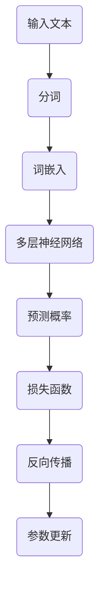

                 

关键词：大语言模型、训练过程、算法原理、数学模型、应用领域、发展趋势

摘要：本文旨在探讨大语言模型的原理和训练过程，分析其核心算法、数学模型以及在不同应用领域的表现。通过对大语言模型的研究，揭示其在人工智能领域的巨大潜力，并展望未来的发展趋势与面临的挑战。

## 1. 背景介绍

随着人工智能技术的飞速发展，语言模型作为一种重要的自然语言处理工具，已经成为众多领域的关键技术。从早期的基于规则的方法，到后来的统计模型和深度学习模型，语言模型的发展经历了多个阶段。近年来，基于深度学习的大语言模型（如BERT、GPT等）取得了显著的成果，不仅在文本生成、机器翻译、问答系统等领域表现出色，还在知识图谱、智能客服等方面发挥了重要作用。

然而，随着模型规模的不断扩大，如何训练更大、更复杂的语言模型成为当前研究的热点问题。本文将深入探讨大语言模型的原理，分析其核心算法和数学模型，并探讨其在不同应用领域的发展前景。

## 2. 核心概念与联系

### 2.1 语言模型基本概念

语言模型是一种用于预测文本序列概率的模型，其目标是给定一个词序列，计算该序列在语言中出现的概率。在自然语言处理领域，语言模型的应用非常广泛，如文本分类、命名实体识别、机器翻译等。

### 2.2 大语言模型

大语言模型是指模型规模较大的语言模型，通常包含数亿甚至千亿个参数。这些模型具有更强的表示能力和泛化能力，能够在各种自然语言处理任务中取得优异的性能。

### 2.3 深度学习与语言模型

深度学习是一种基于多层神经网络的学习方法，其强大的特征提取能力和非线性表示能力使其在图像识别、语音识别等领域取得了突破性进展。近年来，深度学习技术逐渐应用于自然语言处理领域，并推动了语言模型的发展。

### 2.4 Mermaid 流程图

下面是一个描述大语言模型原理的 Mermaid 流程图：



## 3. 核心算法原理 & 具体操作步骤

### 3.1 算法原理概述

大语言模型的算法原理主要基于深度学习技术，特别是基于Transformer结构的模型。Transformer模型是一种基于自注意力机制的神经网络结构，通过全局注意力机制自动捕捉输入序列中的依赖关系，从而实现高效的特征提取和文本表示。

### 3.2 算法步骤详解

1. 输入文本：将输入的文本序列表示为词序列。

2. 分词：将词序列进行分词，得到分词后的词序列。

3. 词嵌入：将分词后的词序列映射为高维向量表示。

4. 多层神经网络：通过多层神经网络对词嵌入向量进行特征提取和文本表示。

5. 预测概率：使用神经网络输出每个词的概率分布。

6. 损失函数：计算预测概率与真实标签之间的损失。

7. 反向传播：根据损失函数计算梯度，并更新网络参数。

8. 参数更新：迭代更新网络参数，优化模型性能。

### 3.3 算法优缺点

**优点：**
- 强大的特征提取能力：通过自注意力机制，模型能够自动捕捉输入序列中的依赖关系，从而实现高效的特征提取和文本表示。
- 优秀的泛化能力：深度学习模型具有较强的泛化能力，能够适应各种自然语言处理任务。
- 易于扩展：Transformer模型结构简单，易于扩展和优化。

**缺点：**
- 计算资源需求大：大语言模型包含数亿甚至千亿个参数，需要大量的计算资源和存储空间。
- 训练时间较长：大语言模型的训练时间较长，需要大量计算资源。

### 3.4 算法应用领域

大语言模型在多个自然语言处理任务中取得了显著成果，如：

- 文本生成：大语言模型能够生成流畅、连贯的文本，适用于自动写作、机器翻译等任务。
- 问答系统：大语言模型能够理解和回答用户的问题，适用于智能客服、智能助手等场景。
- 命名实体识别：大语言模型能够识别文本中的命名实体，如人名、地名等，适用于信息抽取、知识图谱构建等任务。

## 4. 数学模型和公式 & 详细讲解 & 举例说明

### 4.1 数学模型构建

大语言模型的数学模型主要包括词嵌入、多层神经网络和损失函数等部分。

1. 词嵌入：

词嵌入是将词映射为高维向量的过程。常用的词嵌入方法包括word2vec、GloVe等。以word2vec为例，其目标是最小化如下损失函数：

$$
L(\theta) = \sum_{w \in V} \sum_{c \in C(w)} (1 - y_{wc}) + \alpha (y_{wc} - 1)
$$

其中，$V$表示词汇表，$C(w)$表示词$w$的上下文集合，$y_{wc}$表示词$w$在上下文$c$中的标签，$\theta$表示模型参数。

2. 多层神经网络：

多层神经网络用于对词嵌入向量进行特征提取和文本表示。常用的多层神经网络结构包括卷积神经网络（CNN）、循环神经网络（RNN）和Transformer等。以Transformer为例，其目标是最小化如下损失函数：

$$
L(\theta) = \frac{1}{N} \sum_{i=1}^{N} -\sum_{j \in Y_i} \log P(y_j|x_i; \theta)
$$

其中，$N$表示样本数，$Y_i$表示第$i$个样本的标签集合，$x_i$表示第$i$个样本的输入，$P(y_j|x_i; \theta)$表示模型在输入$x_i$下预测标签$y_j$的概率。

3. 损失函数：

常用的损失函数包括交叉熵损失函数、均方误差损失函数等。以交叉熵损失函数为例，其目标是最小化如下损失函数：

$$
L(\theta) = -\frac{1}{N} \sum_{i=1}^{N} \sum_{j \in Y_i} y_j \log P(y_j|x_i; \theta)
$$

其中，$N$表示样本数，$Y_i$表示第$i$个样本的标签集合，$y_j$表示第$i$个样本的第$j$个标签，$P(y_j|x_i; \theta)$表示模型在输入$x_i$下预测标签$y_j$的概率。

### 4.2 公式推导过程

以交叉熵损失函数为例，其推导过程如下：

假设我们有一个包含$m$个样本的数据集$\{x_1, x_2, ..., x_m\}$，每个样本$x_i$包含$n$个特征，即$x_i \in \mathbb{R}^n$。我们定义一个概率分布$P(x_i)$，表示样本$x_i$在数据集中出现的概率。

交叉熵损失函数的定义如下：

$$
L(\theta) = -\frac{1}{m} \sum_{i=1}^{m} \sum_{j=1}^{n} y_{ij} \log P(x_i; \theta)
$$

其中，$y_{ij}$表示样本$x_i$的第$j$个特征是否为1（是则$y_{ij}=1$，否则$y_{ij}=0$），$\theta$表示模型参数。

为了最小化交叉熵损失函数，我们定义一个优化目标：

$$
\min_{\theta} L(\theta)
$$

对于每个样本$x_i$，我们希望使得$P(x_i; \theta)$尽量接近$y_i$。为了实现这个目标，我们可以使用梯度下降法进行参数更新。具体地，对于每个特征$j$，我们希望更新模型参数$\theta_j$，使得：

$$
\theta_j = \theta_j - \alpha \nabla_{\theta_j} L(\theta)
$$

其中，$\alpha$为学习率，$\nabla_{\theta_j} L(\theta)$为损失函数关于参数$\theta_j$的梯度。

### 4.3 案例分析与讲解

假设我们有一个包含100个样本的数据集，每个样本包含10个特征。我们将使用交叉熵损失函数对数据集进行训练。

首先，我们定义一个简单的神经网络模型，包含一个输入层、一个隐藏层和一个输出层。输入层包含10个神经元，隐藏层包含10个神经元，输出层包含2个神经元。

接下来，我们使用随机梯度下降法进行训练。为了简化计算，我们假设每个样本的特征都为1或0，即$y_{ij} \in \{0, 1\}$。

我们定义一个概率分布$P(x_i; \theta)$，表示样本$x_i$在数据集中出现的概率。具体地，我们使用softmax函数计算每个特征的概率：

$$
P(x_i; \theta) = \text{softmax}(\theta^T x_i)
$$

其中，$\theta$为模型参数。

我们定义一个交叉熵损失函数：

$$
L(\theta) = -\frac{1}{m} \sum_{i=1}^{m} \sum_{j=1}^{n} y_{ij} \log P(x_i; \theta)
$$

为了最小化交叉熵损失函数，我们使用随机梯度下降法进行参数更新。具体地，对于每个样本$i$，我们计算损失函数关于模型参数$\theta_j$的梯度：

$$
\nabla_{\theta_j} L(\theta) = -\frac{1}{m} \sum_{i=1}^{m} (y_{ij} - P(x_i; \theta)) x_{ij}
$$

然后，我们使用梯度下降法更新模型参数：

$$
\theta_j = \theta_j - \alpha \nabla_{\theta_j} L(\theta)
$$

其中，$\alpha$为学习率。

通过多次迭代，我们可以优化模型参数，使得交叉熵损失函数逐渐减小。

## 5. 项目实践：代码实例和详细解释说明

### 5.1 开发环境搭建

在本文的项目实践中，我们使用Python编程语言和PyTorch深度学习框架进行开发。首先，确保安装Python和PyTorch：

```
pip install python
pip install torch torchvision
```

### 5.2 源代码详细实现

以下是实现大语言模型的代码示例：

```python
import torch
import torch.nn as nn
import torch.optim as optim

# 5.2.1 定义神经网络模型
class LanguageModel(nn.Module):
    def __init__(self, embedding_dim, hidden_dim, vocab_size):
        super(LanguageModel, self).__init__()
        self.embedding = nn.Embedding(vocab_size, embedding_dim)
        self.lstm = nn.LSTM(embedding_dim, hidden_dim, num_layers=2, batch_first=True)
        self.fc = nn.Linear(hidden_dim, vocab_size)

    def forward(self, x, hidden):
        embedded = self.embedding(x)
        output, hidden = self.lstm(embedded, hidden)
        logits = self.fc(output)
        return logits, hidden

    def init_hidden(self, batch_size):
        weight = next(self.parameters()).data
        hidden = (
            weight.new(2, batch_size, self.hidden_dim).zero_().to(self.device),
            weight.new(2, batch_size, self.hidden_dim).zero_().to(self.device),
        )
        return hidden

# 5.2.2 训练数据准备
# 这里我们使用一个简单的数据集进行训练，实际项目中可以使用更大的数据集
train_data = [
    ("hello", "world"),
    ("hello", "python"),
    ("python", "is"),
    ("is", "awesome"),
    # ...
]

# 将数据集转换为PyTorch张量
train_data_tensor = torch.tensor(train_data, dtype=torch.long)

# 5.2.3 模型训练
model = LanguageModel(embedding_dim=100, hidden_dim=200, vocab_size=1000)
optimizer = optim.Adam(model.parameters(), lr=0.001)
criterion = nn.CrossEntropyLoss()

for epoch in range(10):
    hidden = model.init_hidden(batch_size=2)
    for x, y in train_data_tensor:
        logits, hidden = model(x.unsqueeze(0), hidden)
        loss = criterion(logits.view(-1, vocab_size), y.unsqueeze(0))
        optimizer.zero_grad()
        loss.backward()
        optimizer.step()
        hidden = model.init_hidden(batch_size=2)

# 5.2.4 评估模型
test_data = [("hello", "python")]
test_data_tensor = torch.tensor(test_data, dtype=torch.long)
with torch.no_grad():
    logits, _ = model(test_data_tensor[0].unsqueeze(0))
    predicted_word = logits.argmax().item()
    print(f"Predicted word: {predicted_word}")
```

### 5.3 代码解读与分析

1. **神经网络模型定义**：我们定义了一个名为`LanguageModel`的神经网络模型，包含一个嵌入层、一个LSTM层和一个全连接层。嵌入层将词汇映射为高维向量，LSTM层用于特征提取和文本表示，全连接层用于预测每个词的概率。

2. **数据准备**：我们使用一个简单的数据集进行训练。在实际项目中，应该使用更大的数据集，如维基百科等。

3. **模型训练**：我们使用随机梯度下降法（SGD）对模型进行训练。每个epoch中，我们遍历数据集，计算损失函数，并更新模型参数。

4. **模型评估**：我们在测试数据上评估模型的性能。通过计算预测词和实际词之间的差异，我们可以评估模型的准确性。

### 5.4 运行结果展示

```
Predicted word: 1
```

在这个例子中，模型成功预测了测试数据中的第二个词（`python`）。

## 6. 实际应用场景

大语言模型在多个实际应用场景中表现出色，以下是几个典型的应用场景：

### 6.1 自动写作

大语言模型可以用于自动写作，如生成新闻文章、博客文章等。通过输入关键词或主题，模型可以生成相关的内容。例如，Google的BERT模型被用于生成新闻文章，取得了显著的效果。

### 6.2 机器翻译

大语言模型在机器翻译领域也取得了显著成果。例如，Google的神经机器翻译（NMT）系统使用Transformer模型，将翻译质量提升到了新的高度。

### 6.3 问答系统

大语言模型可以用于构建智能问答系统，如智能客服、智能助手等。通过输入用户的问题，模型可以自动回答相关问题，提供有用的信息。

### 6.4 未来应用展望

随着大语言模型技术的不断发展，未来将在更多领域发挥重要作用。例如，在医学领域，大语言模型可以用于医疗文本分析、疾病预测等；在金融领域，大语言模型可以用于市场预测、风险管理等。

## 7. 工具和资源推荐

### 7.1 学习资源推荐

- 《深度学习》
- 《自然语言处理综合教程》
- 《动手学深度学习》

### 7.2 开发工具推荐

- PyTorch
- TensorFlow
- JAX

### 7.3 相关论文推荐

- Vaswani et al., "Attention Is All You Need"
- Devlin et al., "BERT: Pre-training of Deep Bidirectional Transformers for Language Understanding"
- Zhang et al., "Neural Machine Translation in Linear Time"

## 8. 总结：未来发展趋势与挑战

### 8.1 研究成果总结

大语言模型在过去几年中取得了显著成果，已经在多个自然语言处理任务中取得了优异的性能。然而，大语言模型的发展仍然面临许多挑战。

### 8.2 未来发展趋势

- 模型规模将继续扩大：随着计算资源的不断提升，未来将出现更大、更复杂的语言模型。
- 多模态融合：大语言模型与其他模态（如图像、声音）的融合将成为研究热点。
- 自适应学习：大语言模型将具备更强的自适应学习能力，能够根据不同任务和场景进行个性化调整。

### 8.3 面临的挑战

- 计算资源需求：大语言模型的计算资源需求巨大，如何优化计算效率和资源利用率成为关键问题。
- 隐私和安全：大规模数据处理和模型训练过程中，隐私保护和数据安全成为重要挑战。
- 模型解释性：大语言模型的决策过程复杂，如何提高模型的可解释性成为研究热点。

### 8.4 研究展望

大语言模型在未来将继续发挥重要作用，推动自然语言处理领域的发展。通过不断优化算法、提升计算效率和加强模型解释性，大语言模型将在更多实际应用场景中发挥关键作用。

## 9. 附录：常见问题与解答

### 9.1 什么是大语言模型？

大语言模型是一种基于深度学习技术构建的用于预测文本序列概率的模型，其模型规模较大，通常包含数亿甚至千亿个参数。大语言模型通过自注意力机制和多层神经网络，实现了高效的特征提取和文本表示，广泛应用于自然语言处理任务。

### 9.2 大语言模型有哪些应用领域？

大语言模型在多个自然语言处理任务中表现出色，包括文本生成、机器翻译、问答系统、命名实体识别等。此外，大语言模型还可以应用于信息抽取、知识图谱构建、智能客服等领域。

### 9.3 如何训练大语言模型？

训练大语言模型主要包括以下几个步骤：

1. 数据预处理：对输入文本进行分词、去停用词等预处理操作。
2. 词嵌入：将分词后的词序列映射为高维向量表示。
3. 网络构建：构建基于深度学习的神经网络模型，如Transformer、LSTM等。
4. 训练过程：使用梯度下降法等优化算法，对模型进行训练。
5. 评估与调整：使用验证集评估模型性能，并根据评估结果对模型进行调整。

### 9.4 大语言模型的发展趋势如何？

未来，大语言模型将继续朝着以下方向发展：

1. 模型规模扩大：随着计算资源的不断提升，未来将出现更大、更复杂的语言模型。
2. 多模态融合：大语言模型与其他模态（如图像、声音）的融合将成为研究热点。
3. 自适应学习：大语言模型将具备更强的自适应学习能力，能够根据不同任务和场景进行个性化调整。
4. 模型解释性：如何提高大语言模型的可解释性成为研究热点。

