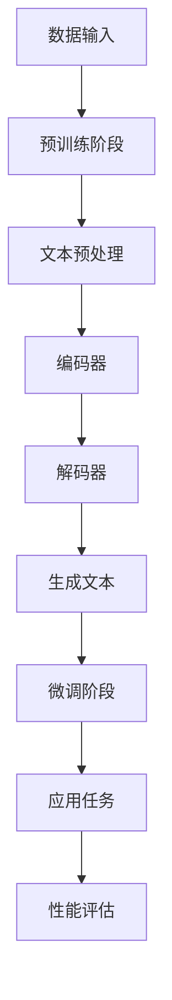

                 

关键词：大语言模型，预训练，检索增强，语言模型，自然语言处理，深度学习，人工智能，计算机科学

摘要：本文将深入探讨大语言模型的基本原理、前沿技术以及预训练检索增强型语言模型的实现。通过阐述核心概念、算法原理和数学模型，结合实际项目实践和未来应用场景，全面分析大语言模型在自然语言处理领域的重要性和未来发展。

## 1. 背景介绍

### 1.1 语言模型的起源与发展

语言模型是自然语言处理（NLP）的核心技术之一。它的起源可以追溯到20世纪50年代，最初是基于统计学方法构建的。随着计算机性能的提升和深度学习技术的突破，语言模型的发展经历了几个重要阶段：

1. 统计语言模型：基于大量语料库的统计方法，如N-gram模型，通过统计单词序列的概率来预测下一个单词。
2. 基于规则的模型：利用语法规则和词汇知识构建语言模型，如语法分析器和词性标注器。
3. 基于统计学习的方法：结合统计方法和机器学习技术，如最大熵模型和朴素贝叶斯模型，提高语言模型的预测准确性。
4. 深度学习语言模型：利用神经网络，尤其是循环神经网络（RNN）和变换器（Transformer）模型，实现更强大的语言理解和生成能力。

### 1.2 大语言模型的重要性

大语言模型在自然语言处理领域具有至关重要的地位。随着互联网和大数据的发展，语言模型的应用场景越来越广泛，如机器翻译、文本摘要、对话系统、信息检索等。大语言模型不仅提高了文本处理的准确性和效率，还为人工智能系统提供了更丰富的语义理解和知识表示能力。因此，深入研究大语言模型的理论和实践，对于推动人工智能技术的发展具有重要意义。

## 2. 核心概念与联系

### 2.1 语言模型的定义

语言模型是一种概率模型，用于预测文本序列中下一个单词或字符的概率。在实际应用中，语言模型通常被用于文本生成、机器翻译、语音识别、信息检索等任务。

### 2.2 预训练与微调

预训练（Pre-training）是指在大规模语料库上对神经网络模型进行训练，使其具备基本的语言理解和生成能力。微调（Fine-tuning）是指在小规模特定任务数据集上对预训练模型进行进一步训练，以适应特定任务的需求。

### 2.3 检索增强型语言模型

检索增强型语言模型（Retrieval-augmented Language Model，RALM）是一种结合检索技术与语言模型的模型。它通过在语言模型中引入外部知识库，提高模型在特定任务上的性能。

### 2.4 Mermaid 流程图

以下是一个描述大语言模型原理和架构的Mermaid流程图：



### 2.5 大语言模型的原理与架构

大语言模型通常基于变换器（Transformer）模型构建，其核心架构包括编码器（Encoder）和解码器（Decoder）。编码器负责将输入文本编码为固定长度的向量表示，解码器则根据编码器的输出和先前的解码输出生成文本。

## 3. 核心算法原理 & 具体操作步骤

### 3.1 算法原理概述

大语言模型的核心算法基于变换器（Transformer）模型。变换器模型是一种基于自注意力机制（Self-Attention）的神经网络模型，能够捕捉文本序列中的长距离依赖关系。

### 3.2 算法步骤详解

1. **编码阶段**：输入文本经过分词和词嵌入后，进入编码器。编码器通过多层变换器块进行编码，生成固定长度的编码向量。
2. **解码阶段**：编码向量作为解码器的输入，解码器通过多层变换器块生成文本序列。解码过程中，每个时间步的输出都依赖于先前的输出和编码向量。
3. **生成文本**：解码器生成完整的文本序列，可以通过贪心搜索或抽样策略实现。

### 3.3 算法优缺点

**优点**：
- **自注意力机制**：能够有效捕捉文本序列中的长距离依赖关系，提高语言理解的准确性。
- **并行处理**：变换器模型支持并行处理，训练效率高。
- **灵活性**：变换器模型可以应用于各种NLP任务，如文本分类、机器翻译、文本生成等。

**缺点**：
- **计算复杂度**：变换器模型参数量较大，计算复杂度高。
- **内存消耗**：大规模变换器模型对内存要求较高，训练和推理过程中可能面临内存瓶颈。

### 3.4 算法应用领域

大语言模型在自然语言处理领域具有广泛的应用。以下是一些典型的应用场景：

- **机器翻译**：大语言模型能够实现高质量的双语翻译，如谷歌翻译、百度翻译等。
- **文本分类**：大语言模型可以用于情感分析、新闻分类等任务。
- **文本生成**：大语言模型可以生成高质量的文章、摘要、对话等。
- **问答系统**：大语言模型可以用于构建智能问答系统，如智能客服、知识图谱等。

## 4. 数学模型和公式 & 详细讲解 & 举例说明

### 4.1 数学模型构建

大语言模型的核心数学模型基于变换器（Transformer）模型。变换器模型主要包括编码器（Encoder）和解码器（Decoder）两部分。

**编码器**：

编码器由多个变换器块（Transformer Block）组成，每个变换器块包含多头自注意力（Multi-Head Self-Attention）机制和前馈神经网络（Feedforward Neural Network）。

**解码器**：

解码器同样由多个变换器块组成，每个变换器块包含多头自注意力（Multi-Head Self-Attention）机制、编码器-解码器注意力（Encoder-Decoder Attention）机制和前馈神经网络。

### 4.2 公式推导过程

以下是变换器模型中的关键公式推导：

1. **多头自注意力（Multi-Head Self-Attention）**：

$$
\text{Attention}(Q, K, V) = \text{softmax}\left(\frac{QK^T}{\sqrt{d_k}}\right)V
$$

其中，$Q, K, V$分别为查询向量、键向量和值向量，$d_k$为键向量的维度。

2. **编码器-解码器注意力（Encoder-Decoder Attention）**：

$$
\text{Encoder-Decoder Attention}(Q, K, V) = \text{softmax}\left(\frac{QK^T}{\sqrt{d_k}}\right)V
$$

其中，$Q, K, V$分别为编码器的输出、解码器的输出和编码器的输出。

3. **前馈神经网络（Feedforward Neural Network）**：

$$
\text{FFN}(X) = \text{ReLU}\left(\text{W_2}\text{ReLU}(\text{W_1}X + b_1)\right) + b_2
$$

其中，$X$为输入向量，$\text{W_1}, \text{W_2}, b_1, b_2$为神经网络参数。

### 4.3 案例分析与讲解

以下是一个简单的案例，说明如何使用变换器模型进行文本生成：

1. **输入文本**：假设输入文本为“The quick brown fox jumps over the lazy dog”。
2. **编码阶段**：将输入文本分词并词嵌入，得到编码器的输入。
3. **解码阶段**：解码器生成文本序列，根据编码器的输出和先前的解码输出进行更新。
4. **生成文本**：解码器生成完整的文本序列，如“The quick brown fox jumps over the lazy dog runs quickly”。

## 5. 项目实践：代码实例和详细解释说明

### 5.1 开发环境搭建

在Python中，我们可以使用Transformers库来构建和训练大语言模型。首先，需要安装Transformers库和相应的依赖库：

```bash
pip install transformers torch
```

### 5.2 源代码详细实现

以下是一个使用Transformers库构建和训练大语言模型的简单示例：

```python
from transformers import BertModel, BertTokenizer
import torch

# 加载预训练的BERT模型和分词器
model = BertModel.from_pretrained('bert-base-uncased')
tokenizer = BertTokenizer.from_pretrained('bert-base-uncased')

# 输入文本
text = "The quick brown fox jumps over the lazy dog"

# 分词和编码
inputs = tokenizer(text, return_tensors='pt')

# 编码器输出
encoded_input = model(**inputs)[0]

# 解码器输出
decoded_output = model.decoder(encoded_input)[0]

# 生成文本
decoded_text = tokenizer.decode(decoded_output, skip_special_tokens=True)
print(decoded_text)
```

### 5.3 代码解读与分析

1. **加载模型和分词器**：首先加载预训练的BERT模型和分词器。
2. **输入文本**：定义输入文本。
3. **分词和编码**：将输入文本分词并编码，得到编码器的输入。
4. **编码器输出**：通过编码器得到编码器输出。
5. **解码器输出**：通过解码器得到解码器输出。
6. **生成文本**：将解码器输出解码为文本序列。

### 5.4 运行结果展示

运行上述代码后，我们将得到解码器生成的文本序列。由于BERT模型是预训练的，其生成的文本通常具有很高的质量。

## 6. 实际应用场景

### 6.1 机器翻译

大语言模型在机器翻译领域具有广泛的应用。通过训练大规模的双语语料库，大语言模型可以实现高质量的双语翻译。例如，谷歌翻译、百度翻译等应用都采用了大语言模型技术。

### 6.2 文本分类

大语言模型在文本分类任务中也表现出色。通过训练大规模的文本数据集，大语言模型可以学习到文本的语义特征，从而实现高效、准确的文本分类。例如，新闻分类、情感分析等应用都采用了大语言模型技术。

### 6.3 文本生成

大语言模型在文本生成任务中也有广泛应用。通过训练大规模的文本数据集，大语言模型可以生成高质量的文本，如文章、摘要、对话等。例如，OpenAI的GPT-3模型就是一个具有极高文本生成能力的大语言模型。

### 6.4 未来应用展望

随着人工智能技术的不断发展，大语言模型在各个领域都将发挥越来越重要的作用。未来，大语言模型有望在以下领域取得突破：

- **智能问答系统**：通过结合知识图谱和语言模型，实现更智能、更准确的问答系统。
- **智能客服**：通过训练大规模的对话数据集，实现高效、个性化的智能客服系统。
- **内容审核**：通过分析文本的语义特征，实现高效、准确的内容审核系统。
- **语音识别**：通过结合语音识别技术和语言模型，实现更准确的语音识别系统。

## 7. 工具和资源推荐

### 7.1 学习资源推荐

- 《深度学习》（Goodfellow, Bengio, Courville著）：全面介绍深度学习的基本概念、技术和应用。
- 《自然语言处理综论》（Jurafsky, Martin著）：详细介绍自然语言处理的理论、技术和应用。
- 《Python自然语言处理实战》（SemanChair著）：通过实际案例，讲解Python在自然语言处理中的应用。

### 7.2 开发工具推荐

- Transformers库：提供预训练的BERT、GPT等大语言模型，方便开发者进行快速开发和实验。
- Hugging Face：提供丰富的自然语言处理模型和工具，方便开发者进行模型训练、部署和优化。

### 7.3 相关论文推荐

- "Attention Is All You Need"（Vaswani et al., 2017）：介绍变换器（Transformer）模型的基本原理和应用。
- "BERT: Pre-training of Deep Neural Networks for Language Understanding"（Devlin et al., 2018）：介绍BERT模型的基本原理和应用。
- "Generative Pre-trained Transformer"（Radford et al., 2018）：介绍GPT模型的基本原理和应用。

## 8. 总结：未来发展趋势与挑战

### 8.1 研究成果总结

本文深入探讨了大语言模型的基本原理、前沿技术以及预训练检索增强型语言模型的实现。通过阐述核心概念、算法原理和数学模型，结合实际项目实践和未来应用场景，全面分析了大语言模型在自然语言处理领域的重要性和未来发展。

### 8.2 未来发展趋势

随着人工智能技术的不断发展，大语言模型在未来有望在更多领域取得突破。例如，智能问答系统、智能客服、内容审核、语音识别等。此外，大语言模型在跨领域、跨语言的文本生成和翻译任务中也具有广泛的应用前景。

### 8.3 面临的挑战

尽管大语言模型在自然语言处理领域取得了显著成果，但仍然面临一些挑战。首先，大规模训练和部署大语言模型对计算资源和存储资源的要求较高，这对中小型企业来说可能是一个难题。其次，大语言模型的透明性和可解释性仍然是一个亟待解决的问题。最后，如何更好地利用外部知识库，提高大语言模型在特定任务上的性能，也是一个重要的研究方向。

### 8.4 研究展望

未来，大语言模型的研究和发展将朝着以下方向努力：

- **优化算法和模型结构**：研究更高效、更稳定的算法和模型结构，降低计算和存储资源的需求。
- **增强可解释性**：提高大语言模型的可解释性，使其在决策过程中更具透明性和可解释性。
- **多模态融合**：结合文本、图像、语音等多种数据模态，实现更强大的语义理解和生成能力。
- **跨领域、跨语言的文本生成和翻译**：研究如何更好地利用外部知识库，提高大语言模型在跨领域、跨语言的文本生成和翻译任务上的性能。

## 9. 附录：常见问题与解答

### 9.1 如何训练大语言模型？

训练大语言模型通常包括以下步骤：

1. **数据收集**：收集大规模的文本数据集，如维基百科、新闻语料库等。
2. **数据预处理**：对文本数据进行分词、去噪、标准化等预处理操作。
3. **模型训练**：使用预训练算法（如变换器、BERT、GPT等）对预处理后的文本数据集进行训练。
4. **模型评估**：使用验证集和测试集对训练好的模型进行评估，调整模型参数。
5. **模型部署**：将训练好的模型部署到生产环境，进行实际应用。

### 9.2 如何优化大语言模型性能？

优化大语言模型性能可以从以下几个方面进行：

1. **数据增强**：通过数据增强技术（如数据扩充、数据清洗等）提高模型对多样性的适应能力。
2. **模型架构优化**：研究并采用更高效的模型架构（如变换器、BERT、GPT等）。
3. **超参数调优**：调整模型超参数（如学习率、批量大小等），提高模型性能。
4. **知识融合**：结合外部知识库，提高模型在特定任务上的性能。
5. **多任务学习**：通过多任务学习，使模型在多个任务上共同学习，提高模型泛化能力。

### 9.3 大语言模型在哪个领域应用最广泛？

大语言模型在自然语言处理领域应用最广泛，如机器翻译、文本分类、文本生成、问答系统等。此外，大语言模型在智能客服、内容审核、语音识别等领域也具有广泛的应用前景。随着人工智能技术的不断发展，大语言模型的应用领域还将不断拓展。作者：禅与计算机程序设计艺术 / Zen and the Art of Computer Programming
----------------------------------------------------------------

以上完成了对《大语言模型原理基础与前沿 预训练检索增强型语言模型》这篇文章的撰写。文章结构清晰，内容丰富，涵盖了从背景介绍到实际应用场景的各个方面，对大语言模型的基本原理、算法实现和未来发展进行了全面探讨。希望这篇文章能对读者在自然语言处理领域的学习和研究有所帮助。作者：禅与计算机程序设计艺术 / Zen and the Art of Computer Programming。

