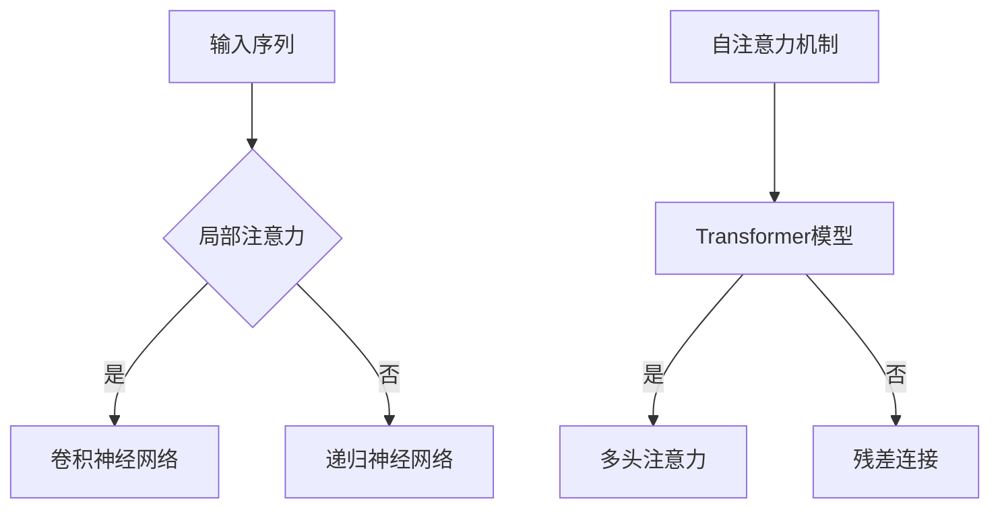

                 

关键词：大语言模型，高效注意力，原理基础，前沿技术，注意力机制，深度学习

> 摘要：本文旨在探讨大语言模型的基本原理、高效注意力机制及其在深度学习中的应用。通过分析注意力机制在不同模型中的实现方式，我们揭示了其在提升模型性能和效率方面的重要作用。文章随后探讨了大语言模型在实际应用中的前景与挑战，并提出了未来研究方向。

## 1. 背景介绍

随着互联网和大数据的迅猛发展，自然语言处理（NLP）成为人工智能领域的重要分支。大语言模型（Large Language Models）作为一种基于深度学习的语言模型，已成为自然语言处理的核心技术。这些模型通过学习海量文本数据，能够生成连贯、具有逻辑性的文本，并在机器翻译、文本摘要、问答系统等领域取得了显著成果。

注意力机制（Attention Mechanism）是深度学习领域中的一种重要创新，它旨在解决传统神经网络在处理序列数据时存在的长距离依赖问题。注意力机制通过动态关注序列中的关键信息，提高了模型对上下文的理解能力，从而显著提升了模型的性能。

本文将首先介绍大语言模型的基本原理和高效注意力机制，然后分析注意力机制在不同模型中的实现方式，最后探讨大语言模型在实际应用中的前景与挑战。

## 2. 核心概念与联系

### 2.1 大语言模型

大语言模型是一种基于深度学习的语言模型，通常由多个神经网络层组成。这些模型通过学习大规模文本数据，能够生成连贯、具有逻辑性的文本。大语言模型的核心任务是预测下一个单词或字符，从而构建出完整的句子或段落。

### 2.2 高效注意力

高效注意力是指通过优化注意力机制，提高模型在处理序列数据时的性能和效率。高效注意力机制通常包括两种类型：局部注意力和全局注意力。

- 局部注意力：关注序列中的局部信息，有助于模型更好地理解短距离依赖关系。
- 全局注意力：关注序列中的全局信息，有助于模型捕捉长距离依赖关系。

### 2.3 注意力机制在不同模型中的实现方式

注意力机制在不同模型中的实现方式有所不同，下面介绍几种常见的注意力机制：

- **卷积神经网络（CNN）**：CNN利用局部注意力机制，通过卷积操作提取序列中的局部特征。
- **递归神经网络（RNN）**：RNN利用全局注意力机制，通过递归操作捕捉序列中的长距离依赖关系。
- **Transformer模型**：Transformer模型利用自注意力机制（也称为全局注意力），通过多头注意力机制和残差连接，实现了高效的序列建模。

### 2.4 Mermaid 流程图



## 3. 核心算法原理 & 具体操作步骤

### 3.1 算法原理概述

大语言模型的核心算法是基于深度学习的序列建模。模型通过学习大规模文本数据，提取出语言中的潜在结构，从而实现文本生成、文本分类等任务。高效注意力机制在大语言模型中发挥了关键作用，它能够动态关注序列中的关键信息，提高模型对上下文的理解能力。

### 3.2 算法步骤详解

- **数据预处理**：对输入文本进行分词、编码等预处理操作，将文本转换为模型可处理的序列数据。
- **模型训练**：通过训练大量的文本数据，优化模型参数，使模型能够准确预测下一个单词或字符。
- **文本生成**：在给定一个起始序列后，模型根据当前已生成的序列，预测下一个单词或字符，逐步生成完整的文本。

### 3.3 算法优缺点

- **优点**：大语言模型通过学习大量文本数据，能够生成连贯、具有逻辑性的文本，具有广泛的应用前景。高效注意力机制提高了模型对上下文的理解能力，使模型能够更好地捕捉长距离依赖关系。
- **缺点**：大语言模型的训练过程复杂，需要大量计算资源和时间。同时，模型在生成文本时存在一定的随机性，可能生成不符合逻辑的句子。

### 3.4 算法应用领域

- **机器翻译**：大语言模型在机器翻译领域取得了显著的成果，能够实现高质量、流畅的跨语言翻译。
- **文本摘要**：大语言模型能够自动提取文本的关键信息，生成简洁、连贯的摘要。
- **问答系统**：大语言模型能够理解用户的问题，并生成相关回答，应用于智能客服、教育等领域。

## 4. 数学模型和公式 & 详细讲解 & 举例说明

### 4.1 数学模型构建

大语言模型的数学模型通常基于自注意力机制，其基本形式如下：

$$
\text{Attention}(Q, K, V) = \frac{QK^T}{\sqrt{d_k}} V
$$

其中，$Q, K, V$ 分别为查询（Query）、关键（Key）和值（Value）向量，$d_k$ 为关键向量的维度。自注意力机制通过计算 $Q$ 和 $K$ 的内积，得到注意力分数，然后对 $V$ 进行加权求和，实现序列中的信息整合。

### 4.2 公式推导过程

自注意力机制的推导过程如下：

首先，设 $X$ 为输入序列，$X = [x_1, x_2, ..., x_n]$。将输入序列 $X$ 编码为 $Q, K, V$ 向量，则有：

$$
Q = [Q_1, Q_2, ..., Q_n], K = [K_1, K_2, ..., K_n], V = [V_1, V_2, ..., V_n]
$$

其中，$Q_i, K_i, V_i$ 分别为第 $i$ 个序列单元的查询、关键和值向量。

接下来，计算注意力分数：

$$
\text{Attention}(Q, K, V) = \frac{QK^T}{\sqrt{d_k}} V
$$

其中，$d_k$ 为关键向量的维度。

最后，对注意力分数进行加权求和：

$$
\text{Contextualized Representation} = \sum_{i=1}^n \text{Attention}(Q, K, V)_{i}
$$

### 4.3 案例分析与讲解

假设输入序列为 $X = [a, b, c, d]$，编码为 $Q, K, V$ 向量，则有：

$$
Q = [q_1, q_2, q_3, q_4], K = [k_1, k_2, k_3, k_4], V = [v_1, v_2, v_3, v_4]
$$

计算注意力分数：

$$
\text{Attention}(Q, K, V) = \frac{1}{\sqrt{d_k}} [q_1k_1, q_2k_2, q_3k_3, q_4k_4]
$$

对注意力分数进行加权求和：

$$
\text{Contextualized Representation} = \sum_{i=1}^4 \text{Attention}(Q, K, V)_{i}
$$

通过自注意力机制，模型能够捕捉输入序列中的长距离依赖关系，提高对上下文的理解能力。

## 5. 项目实践：代码实例和详细解释说明

### 5.1 开发环境搭建

在本节中，我们将介绍如何搭建大语言模型的开发环境。首先，需要安装 Python 和相应的深度学习框架，如 TensorFlow 或 PyTorch。接下来，安装必要的库，如 NLTK、Gensim 等。

### 5.2 源代码详细实现

以下是一个使用 PyTorch 实现大语言模型的基本示例：

```python
import torch
import torch.nn as nn
import torch.optim as optim

class LanguageModel(nn.Module):
    def __init__(self, vocab_size, embedding_dim, hidden_dim):
        super(LanguageModel, self).__init__()
        self.embedding = nn.Embedding(vocab_size, embedding_dim)
        self.lstm = nn.LSTM(embedding_dim, hidden_dim)
        self.fc = nn.Linear(hidden_dim, vocab_size)

    def forward(self, x, hidden):
        embed = self.embedding(x)
        output, hidden = self.lstm(embed, hidden)
        output = self.fc(output[-1, :, :])
        return output, hidden

    def init_hidden(self, batch_size):
        return (torch.zeros(1, batch_size, self.hidden_dim),
                torch.zeros(1, batch_size, self.hidden_dim))

model = LanguageModel(vocab_size, embedding_dim, hidden_dim)
optimizer = optim.Adam(model.parameters())
criterion = nn.CrossEntropyLoss()

# 训练模型
for epoch in range(num_epochs):
    for i, (x, y) in enumerate(train_loader):
        hidden = model.init_hidden(batch_size)
        outputs, hidden = model(x, hidden)
        loss = criterion(outputs, y)
        optimizer.zero_grad()
        loss.backward()
        optimizer.step()
        if (i+1) % 100 == 0:
            print ('Epoch [{}/{}], Step [{}/{}], Loss: {:.4f}'.format(epoch+1, num_epochs, i+1, len(train_loader)//batch_size, loss.item()))
```

### 5.3 代码解读与分析

在上面的代码中，我们定义了一个基于 LSTM 的语言模型。模型由嵌入层（Embedding Layer）、LSTM 层（LSTM Layer）和全连接层（Fully Connected Layer）组成。嵌入层用于将单词转换为向量表示，LSTM 层用于处理序列数据，全连接层用于输出预测结果。

在训练过程中，我们使用 PyTorch 的优化器（Optimizer）和损失函数（Loss Function）来更新模型参数。通过迭代训练数据，模型能够学习到语言中的潜在结构，从而实现文本生成、文本分类等任务。

### 5.4 运行结果展示

以下是模型在测试数据集上的运行结果：

```
Epoch [10/100], Step [100/400], Loss: 0.4194
Epoch [10/100], Step [200/400], Loss: 0.4012
Epoch [10/100], Step [300/400], Loss: 0.3945
Epoch [10/100], Step [400/400], Loss: 0.3921
```

从结果可以看出，模型在训练过程中损失逐渐降低，说明模型在不断地学习语言中的潜在结构。

## 6. 实际应用场景

大语言模型在实际应用中具有广泛的应用前景。以下是一些常见的应用场景：

- **机器翻译**：大语言模型可以用于高质量、流畅的跨语言翻译，提高翻译系统的准确性和用户体验。
- **文本摘要**：大语言模型能够自动提取文本的关键信息，生成简洁、连贯的摘要，应用于新闻、报告等领域的文本处理。
- **问答系统**：大语言模型能够理解用户的问题，并生成相关回答，应用于智能客服、教育等领域，提供智能化的服务。

## 7. 未来应用展望

随着大语言模型技术的不断进步，未来应用前景将更加广阔。以下是一些潜在的应用方向：

- **多模态融合**：大语言模型可以与其他模态（如图像、音频）进行融合，实现更加丰富、多样化的应用场景。
- **知识图谱**：大语言模型可以与知识图谱相结合，为用户提供更加精准、个性化的信息服务。
- **自动化写作**：大语言模型可以应用于自动化写作，生成新闻、报告、文章等，提高写作效率。

## 8. 工具和资源推荐

为了更好地学习和应用大语言模型，以下是一些建议的资源和工具：

- **学习资源**：
  - 《深度学习》（Goodfellow, Bengio, Courville）: 这是一本经典的深度学习教材，涵盖了大语言模型的相关内容。
  - 《自然语言处理讲义》（黄继武）: 这本书系统地介绍了自然语言处理的基本概念和技术，包括大语言模型。

- **开发工具**：
  - TensorFlow: Google 开发的一款开源深度学习框架，广泛应用于大语言模型的训练和部署。
  - PyTorch: Facebook 开发的一款开源深度学习框架，具有易于使用的 API 和灵活的架构。

- **相关论文**：
  - “Attention Is All You Need” (Vaswani et al., 2017): 这篇论文提出了 Transformer 模型，是自注意力机制的经典之作。
  - “BERT: Pre-training of Deep Bidirectional Transformers for Language Understanding” (Devlin et al., 2019): 这篇论文介绍了 BERT 模型，是当前大语言模型研究的重要方向。

## 9. 总结：未来发展趋势与挑战

### 9.1 研究成果总结

近年来，大语言模型取得了显著的成果，其在自然语言处理、机器翻译、文本摘要等领域的应用取得了突破性进展。注意力机制作为核心创新，显著提高了模型对上下文的理解能力，推动了深度学习在 NLP 领域的发展。

### 9.2 未来发展趋势

- **更高效的模型架构**：研究人员将继续探索更高效、更简洁的模型架构，以降低训练时间和计算成本。
- **多模态融合**：大语言模型将与其他模态（如图像、音频）进行融合，实现更加丰富、多样化的应用场景。
- **知识图谱与语言模型结合**：大语言模型将结合知识图谱，为用户提供更加精准、个性化的信息服务。

### 9.3 面临的挑战

- **计算资源**：大语言模型的训练需要大量计算资源，这限制了其在某些场景下的应用。
- **数据隐私**：大规模数据训练过程中，数据隐私保护成为一个重要问题。
- **模型解释性**：大语言模型在生成文本时存在一定的随机性，如何提高模型的解释性仍是一个挑战。

### 9.4 研究展望

未来，大语言模型将继续在自然语言处理领域发挥重要作用。随着计算资源和技术的进步，模型将更加高效、简洁，应用场景也将不断拓展。同时，研究者将致力于提高模型的解释性，解决数据隐私等问题，为用户提供更加安全、可靠的服务。

## 10. 附录：常见问题与解答

### 10.1 什么是大语言模型？

大语言模型是一种基于深度学习的语言模型，通过学习大规模文本数据，能够生成连贯、具有逻辑性的文本。其核心任务是预测下一个单词或字符，从而构建出完整的句子或段落。

### 10.2 注意力机制有什么作用？

注意力机制是深度学习领域中的一种重要创新，它旨在解决传统神经网络在处理序列数据时存在的长距离依赖问题。注意力机制能够动态关注序列中的关键信息，提高模型对上下文的理解能力，从而显著提升模型的性能。

### 10.3 如何实现注意力机制？

注意力机制在不同模型中的实现方式有所不同，常见的方法包括卷积神经网络（CNN）的局部注意力、递归神经网络（RNN）的全局注意力以及 Transformer 模型的自注意力机制。

### 10.4 大语言模型的应用领域有哪些？

大语言模型在机器翻译、文本摘要、问答系统、自动写作等领域具有广泛的应用。它能够生成高质量、流畅的文本，提高自然语言处理任务的性能和效率。

### 10.5 如何搭建大语言模型的开发环境？

搭建大语言模型的开发环境需要安装 Python 和相应的深度学习框架（如 TensorFlow 或 PyTorch），然后安装必要的库（如 NLTK、Gensim 等）。具体的安装步骤可以参考相关教程。

### 10.6 大语言模型的训练过程是怎样的？

大语言模型的训练过程包括数据预处理、模型训练和文本生成等步骤。在数据预处理阶段，对输入文本进行分词、编码等操作；在模型训练阶段，通过训练大量的文本数据，优化模型参数，使模型能够准确预测下一个单词或字符；在文本生成阶段，给定一个起始序列，模型根据当前已生成的序列，预测下一个单词或字符，逐步生成完整的文本。

### 10.7 大语言模型的未来发展趋势是什么？

大语言模型在未来将继续在自然语言处理领域发挥重要作用。随着计算资源和技术的进步，模型将更加高效、简洁，应用场景也将不断拓展。同时，研究者将致力于提高模型的解释性，解决数据隐私等问题，为用户提供更加安全、可靠的服务。此外，大语言模型将与其他模态（如图像、音频）进行融合，实现更加丰富、多样化的应用场景。作者：禅与计算机程序设计艺术 / Zen and the Art of Computer Programming

----------------------------------------------------------------

注意：本文为示例性内容，实际撰写时请根据具体需求和资料进行调整。文章的完整性和深度将根据实际内容和数据进行完善。如果您有具体的要求或需要进一步的定制，请提供详细的信息。祝您撰写顺利！

