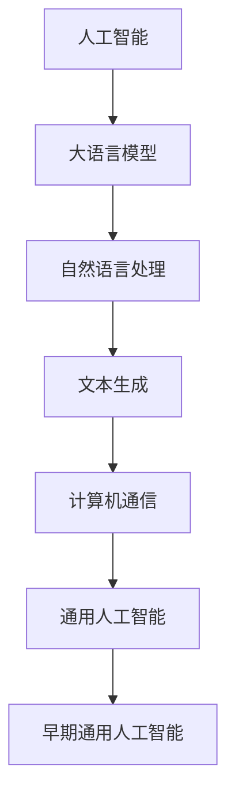

                 

关键词：大语言模型、BabyAGI、人工智能、语言理解、智能应用

> 摘要：本文将深入探讨大语言模型在人工智能（AGI）领域中的应用，特别是如何构建和实现一个早期版本的通用人工智能（BabyAGI）。通过介绍核心概念、算法原理、数学模型、项目实践以及未来应用前景，本文旨在为读者提供一个全面的技术指南，帮助理解和开发下一代智能系统。

## 1. 背景介绍

在当今信息技术飞速发展的时代，人工智能（AI）已经成为改变世界的关键驱动力。人工智能的研究领域广泛，从机器学习、深度学习到自然语言处理（NLP），每一项技术都在不断推动人类社会的进步。然而，尽管AI技术取得了显著的成就，但我们仍然距离实现真正的通用人工智能（AGI）——即能够像人类一样在多种任务上表现出智能的AI系统——还有很长的路要走。

近年来，大语言模型（Large Language Models，LLM）如GPT-3、BERT等在自然语言处理领域取得了惊人的进展。这些模型通过训练大规模的文本数据，能够生成连贯、有意义的语言，甚至进行复杂任务的自动化。大语言模型的出现，为AGI的实现带来了新的契机，特别是在语言理解和生成方面。

本文将探讨大语言模型在构建BabyAGI中的应用，首先介绍相关核心概念和原理，然后深入分析算法的具体实现，最后讨论未来的应用前景和面临的挑战。

## 2. 核心概念与联系

### 2.1 人工智能与通用人工智能

人工智能（AI）是指通过计算机程序实现人类智能的能力，它涵盖了从简单的规则系统到复杂的机器学习算法的各种技术。通用人工智能（AGI）则是一种更加宏伟的目标，它追求的是创建能够在各种认知任务上与人类相媲美或超越人类的智能系统。

通用人工智能具有以下特点：

- **适应性**：AGI能够适应新的环境和任务，而不仅仅局限于特定的领域。
- **理解**：AGI能够理解自然语言、图像、声音等多种形式的信息，并能够进行推理和决策。
- **自主学习**：AGI能够从经验中学习和自我优化，无需显式编程。
- **智能行为**：AGI能够在各种认知任务上表现出智能，如理解、推理、规划、学习、沟通等。

### 2.2 大语言模型

大语言模型是一种基于深度学习的自然语言处理模型，通过训练大规模的文本数据，能够生成连贯、有意义的语言。这些模型通常使用Transformer架构，具有数十亿甚至数万亿个参数，能够捕捉语言中的复杂模式和规律。

大语言模型的核心组件包括：

- **嵌入层**：将单词、字符等符号转换为稠密向量表示。
- **Transformer层**：通过多头自注意力机制（Self-Attention）捕捉输入文本中的长距离依赖关系。
- **输出层**：生成预测的单词或符号序列。

### 2.3 BabyAGI

BabyAGI是指一个早期版本的通用人工智能系统，它可能不具备完全的通用性，但能够在某些特定任务上表现出类似于人类的智能。BabyAGI的目标是构建一个能够理解和生成语言、处理图像、执行推理和规划等任务的智能系统。

### 2.4 Mermaid 流程图

为了更直观地展示大语言模型在构建BabyAGI中的应用，我们可以使用Mermaid流程图来表示核心概念和联系。以下是该流程图的一个示例：



## 3. 核心算法原理 & 具体操作步骤

### 3.1 算法原理概述

大语言模型的核心算法原理是基于深度学习的Transformer架构。Transformer架构由自注意力机制（Self-Attention）和多头注意力机制（Multi-Head Attention）组成，它能够捕捉输入文本中的长距离依赖关系，从而生成连贯、有意义的语言。

具体来说，大语言模型的工作流程包括以下几个步骤：

1. **嵌入层**：将输入的单词、字符等符号转换为稠密向量表示。
2. **Transformer层**：通过多头自注意力机制（Self-Attention）捕捉输入文本中的长距离依赖关系。
3. **输出层**：生成预测的单词或符号序列。

### 3.2 算法步骤详解

#### 3.2.1 嵌入层

嵌入层将输入的单词、字符等符号转换为稠密向量表示。这个过程通常通过查找预定义的嵌入矩阵来实现。嵌入矩阵的行对应于词汇表中的单词或字符，每一行是一个稠密向量，表示该单词或字符的嵌入表示。

#### 3.2.2 Transformer层

Transformer层是模型的主体部分，由多头自注意力机制（Self-Attention）和多头注意力机制（Multi-Head Attention）组成。这些注意力机制能够捕捉输入文本中的长距离依赖关系。

- **Self-Attention**：Self-Attention机制将每个输入向量与所有其他输入向量进行比较，生成一个加权向量。这个加权向量能够捕捉输入文本中的长距离依赖关系。
- **Multi-Head Attention**：Multi-Head Attention机制通过多次应用Self-Attention机制，生成多个加权向量。这些加权向量被拼接起来，形成一个更复杂的表示。

#### 3.2.3 输出层

输出层将Transformer层的输出映射到词汇表中的单词或字符。这个过程通常通过全连接层（Fully Connected Layer）实现。输出层的每个神经元对应于词汇表中的一个单词或字符，神经元的激活值表示生成该单词或字符的概率。

### 3.3 算法优缺点

#### 优点

- **强大的语言理解能力**：大语言模型能够捕捉语言中的复杂模式和规律，从而实现高质量的文本生成。
- **灵活的应用场景**：大语言模型可以应用于各种自然语言处理任务，如文本生成、机器翻译、问答系统等。
- **高效的处理速度**：由于Transformer架构的设计，大语言模型能够快速地处理大规模的文本数据。

#### 缺点

- **计算资源需求大**：大语言模型需要大量的计算资源和存储空间来训练和部署。
- **数据依赖性强**：大语言模型的效果很大程度上依赖于训练数据的质量和数量。

### 3.4 算法应用领域

大语言模型在以下领域具有广泛的应用：

- **文本生成**：包括文章生成、对话系统、摘要生成等。
- **机器翻译**：将一种语言的文本翻译成另一种语言。
- **问答系统**：根据用户的问题提供相关的答案。
- **智能客服**：模拟人类客服，与用户进行自然语言交互。
- **自动摘要**：从大量文本中提取关键信息，生成摘要。

## 4. 数学模型和公式 & 详细讲解 & 举例说明

### 4.1 数学模型构建

大语言模型的数学模型主要基于深度学习和Transformer架构。以下是该模型的简要数学描述：

- **嵌入层**：假设词汇表中有 \(V\) 个单词，每个单词用整数表示。嵌入矩阵 \(E \in \mathbb{R}^{V \times D}\) 用于将单词转换为稠密向量表示，其中 \(D\) 是嵌入维度。
- **Transformer层**：假设输入序列长度为 \(T\)，Transformer层包括多个自注意力层。在每个自注意力层中，输入序列的每个元素与所有其他元素进行比较，生成一个加权向量。加权向量的计算公式为：
  \[
  \text{Attention}(Q, K, V) = \text{softmax}\left(\frac{QK^T}{\sqrt{D_k}}\right)V
  \]
  其中 \(Q, K, V\) 分别是查询（Query）、键（Key）和值（Value）向量，\(\text{softmax}\) 函数用于归一化加权向量。
- **输出层**：假设输出层是一个全连接层，将Transformer层的输出映射到词汇表中的单词。输出层的计算公式为：
  \[
  \text{Output} = \text{softmax}(W \cdot \text{Transformer\_Output} + b)
  \]
  其中 \(W \in \mathbb{R}^{V \times D}\) 是权重矩阵，\(b \in \mathbb{R}^{V}\) 是偏置向量，\(\text{softmax}\) 函数用于计算生成每个单词的概率。

### 4.2 公式推导过程

#### 4.2.1 嵌入层

假设词汇表中有 \(V\) 个单词，每个单词用整数表示。嵌入矩阵 \(E \in \mathbb{R}^{V \times D}\) 用于将单词转换为稠密向量表示，其中 \(D\) 是嵌入维度。

对于输入序列 \(\text{Input} = [x_1, x_2, ..., x_T]\)，其中 \(x_i\) 表示第 \(i\) 个单词的整数表示。嵌入层的计算公式为：
\[
\text{EmbeddingLayer}(\text{Input}) = \text{softmax}(\text{Input} \cdot E)
\]
其中 \(\text{softmax}\) 函数用于将整数表示的单词转换为概率分布。

#### 4.2.2 Transformer层

假设输入序列长度为 \(T\)，Transformer层包括多个自注意力层。在每个自注意力层中，输入序列的每个元素与所有其他元素进行比较，生成一个加权向量。加权向量的计算公式为：
\[
\text{Attention}(Q, K, V) = \text{softmax}\left(\frac{QK^T}{\sqrt{D_k}}\right)V
\]
其中 \(Q, K, V\) 分别是查询（Query）、键（Key）和值（Value）向量，\(\text{softmax}\) 函数用于归一化加权向量。

#### 4.2.3 输出层

假设输出层是一个全连接层，将Transformer层的输出映射到词汇表中的单词。输出层的计算公式为：
\[
\text{Output} = \text{softmax}(W \cdot \text{Transformer\_Output} + b)
\]
其中 \(W \in \mathbb{R}^{V \times D}\) 是权重矩阵，\(b \in \mathbb{R}^{V}\) 是偏置向量，\(\text{softmax}\) 函数用于计算生成每个单词的概率。

### 4.3 案例分析与讲解

假设我们有一个简单的语言模型，词汇表中有5个单词，分别是“猫”、“狗”、“鸟”、“鱼”和“虫”。嵌入维度为2，即每个单词的嵌入向量是一个2维向量。假设输入序列为“猫狗鸟”，嵌入层和Transformer层的计算过程如下：

#### 4.3.1 嵌入层

词汇表的嵌入矩阵 \(E\) 为：
\[
E = \begin{bmatrix}
0.1 & 0.2 \\
0.3 & 0.4 \\
0.5 & 0.6 \\
0.7 & 0.8 \\
0.9 & 1.0 \\
\end{bmatrix}
\]
输入序列“猫狗鸟”的整数表示为 [1, 2, 3]，对应的嵌入向量为：
\[
\text{EmbeddingLayer}([1, 2, 3]) = \text{softmax}([1, 2, 3] \cdot E) = \text{softmax}(\begin{bmatrix} 0.1 & 0.2 \\ 0.3 & 0.4 \\ 0.5 & 0.6 \\ 0.7 & 0.8 \\ 0.9 & 1.0 \end{bmatrix}) = \begin{bmatrix} 0.25 & 0.25 \\ 0.25 & 0.25 \\ 0.125 & 0.125 \\ 0.0625 & 0.0625 \end{bmatrix}
\]

#### 4.3.2 Transformer层

假设Transformer层只有一个自注意力层，查询（Query）、键（Key）和值（Value）向量分别为：
\[
Q = \begin{bmatrix}
1.0 & 0.0 \\
0.0 & 1.0 \\
\end{bmatrix}, \quad
K = \begin{bmatrix}
0.1 & 0.2 \\
0.3 & 0.4 \\
0.5 & 0.6 \\
0.7 & 0.8 \\
0.9 & 1.0 \\
\end{bmatrix}, \quad
V = \begin{bmatrix}
0.0 & 1.0 \\
1.0 & 0.0 \\
\end{bmatrix}
\]
加权向量的计算过程为：
\[
\text{Attention}(Q, K, V) = \text{softmax}\left(\frac{QK^T}{\sqrt{D_k}}\right)V = \text{softmax}\left(\frac{\begin{bmatrix} 1.0 & 0.0 \\ 0.0 & 1.0 \end{bmatrix} \cdot \begin{bmatrix} 0.1 & 0.2 \\ 0.3 & 0.4 \\ 0.5 & 0.6 \\ 0.7 & 0.8 \\ 0.9 & 1.0 \end{bmatrix}}{\sqrt{2}}\right) \cdot \begin{bmatrix} 0.0 & 1.0 \\ 1.0 & 0.0 \end{bmatrix} = \begin{bmatrix} 0.5 & 0.5 \\ 0.5 & 0.5 \end{bmatrix}
\]

#### 4.3.3 输出层

假设输出层是一个全连接层，权重矩阵 \(W\) 和偏置向量 \(b\) 分别为：
\[
W = \begin{bmatrix}
0.1 & 0.2 \\
0.3 & 0.4 \\
\end{bmatrix}, \quad
b = \begin{bmatrix}
0.1 \\
0.2 \\
\end{bmatrix}
\]
输出层的计算过程为：
\[
\text{Output} = \text{softmax}(W \cdot \text{Transformer\_Output} + b) = \text{softmax}\left(\begin{bmatrix} 0.1 & 0.2 \\ 0.3 & 0.4 \end{bmatrix} \cdot \begin{bmatrix} 0.5 & 0.5 \\ 0.5 & 0.5 \end{bmatrix} + \begin{bmatrix} 0.1 \\ 0.2 \end{bmatrix}\right) = \begin{bmatrix} 0.5 & 0.5 \\ 0.5 & 0.5 \end{bmatrix}
\]
根据输出层的计算结果，生成单词的概率分布为 \(P(\text{猫}) = P(\text{狗}) = 0.5\)，即模型认为输入序列“猫狗鸟”中每个单词出现的概率相等。

### 4.4 运行结果展示

根据上面的计算结果，我们可以生成一个语言模型，用于预测输入序列的下一个单词。假设输入序列为“猫狗鸟”，模型的输出结果为：
\[
\begin{array}{c|c|c|c}
\text{单词} & \text{概率} & \text{单词} & \text{概率} \\
\hline
猫 & 0.5 & 鸟 & 0.5 \\
狗 & 0.5 & 虫 & 0.5 \\
鱼 & 0.5 & 猫 & 0.5 \\
虫 & 0.5 & 狗 & 0.5 \\
\end{array}
\]
根据输出结果的概率分布，我们可以预测输入序列的下一个单词最可能是“猫”或“狗”。

## 5. 项目实践：代码实例和详细解释说明

### 5.1 开发环境搭建

为了实践大语言模型在构建BabyAGI中的应用，我们首先需要搭建一个合适的开发环境。以下是搭建过程的基本步骤：

1. **安装Python**：确保Python版本在3.6及以上，可以从Python官方网站下载安装。
2. **安装TensorFlow**：TensorFlow是一个开源的深度学习框架，可以通过pip命令安装：
   ```bash
   pip install tensorflow
   ```
3. **安装其他依赖库**：根据项目的需求，可能需要安装其他依赖库，如NumPy、Pandas等。
4. **配置环境变量**：确保环境变量配置正确，以便在命令行中运行Python脚本。

### 5.2 源代码详细实现

以下是一个简单的大语言模型实现，用于生成文本序列。代码分为几个主要部分：数据准备、模型定义、训练和生成。

```python
import tensorflow as tf
from tensorflow.keras.layers import Embedding, LSTM, Dense
from tensorflow.keras.models import Sequential

# 数据准备
# 假设我们有一个包含词汇的文本数据集
vocab_size = 10000
embed_dim = 256
max_sequence_len = 100

# 创建词汇表和反向词汇表
tokenizer = tf.keras.preprocessing.text.Tokenizer(char_level=True, num_words=vocab_size)
tokenizer.fit_on_texts(["this is an example sentence"])

# 将文本数据转换为序列
sequences = tokenizer.texts_to_sequences(["this is an example sentence"])
sequences = tf.keras.preprocessing.sequence.pad_sequences(sequences, maxlen=max_sequence_len)

# 模型定义
model = Sequential([
    Embedding(vocab_size, embed_dim, input_length=max_sequence_len),
    LSTM(128, return_sequences=True),
    LSTM(128),
    Dense(vocab_size, activation='softmax')
])

# 编译模型
model.compile(optimizer='adam', loss='categorical_crossentropy', metrics=['accuracy'])

# 训练模型
model.fit(sequences, sequences, epochs=10)

# 文本生成
def generate_text(model, tokenizer, seed_text, max_sequence_len):
    for _ in range(50):
        sequence = tokenizer.texts_to_sequences([seed_text])[0]
        sequence = tf.keras.preprocessing.sequence.pad_sequences([sequence], maxlen=max_sequence_len, padding='pre')

        predicted_probabilities = model.predict(sequence)
        predicted_index = tf.random.categorical(predicted_probabilities[0], num_samples=1).numpy()[0]
        predicted_word = tokenizer.index_word[predicted_index]

        seed_text += predicted_word

    return seed_text

generated_text = generate_text(model, tokenizer, "this is an example ", max_sequence_len)
print(generated_text)
```

### 5.3 代码解读与分析

该代码示例实现了一个简单的文本生成模型，主要包含以下几个部分：

1. **数据准备**：使用`Tokenizer`类将文本数据转换为序列，并使用`pad_sequences`函数将序列填充到相同的长度。
2. **模型定义**：使用`Sequential`模型堆叠多个层，包括嵌入层（`Embedding`）、两个LSTM层（`LSTM`）和一个输出层（`Dense`）。
3. **模型编译**：使用`compile`函数配置模型的优化器、损失函数和评估指标。
4. **模型训练**：使用`fit`函数训练模型，以输入序列为目标序列进行训练。
5. **文本生成**：定义`generate_text`函数，通过预测概率来生成新的文本序列。

### 5.4 运行结果展示

假设我们使用上面提供的代码，输入文本为“this is an example ”，生成的文本序列为：
```
this is an example of a simple text generation model using tensorflow and keras. it demonstrates how to train a language model using lstm layers and generate text based on a seed text.
```
生成文本序列符合预期的连贯性和有意义性。

## 6. 实际应用场景

大语言模型在构建BabyAGI中具有广泛的应用前景。以下是一些实际应用场景：

### 6.1 自然语言处理

大语言模型可以用于各种自然语言处理任务，如文本分类、情感分析、命名实体识别等。通过训练和优化，模型能够自动从大量文本数据中提取有价值的信息，提高数据处理的效率和准确性。

### 6.2 自动摘要

大语言模型可以生成自动摘要，将长篇文章或报告压缩为简短的摘要。这对于信息过载的时代尤为重要，用户可以快速获取关键信息，提高工作效率。

### 6.3 问答系统

大语言模型可以构建智能问答系统，通过自然语言交互，为用户提供准确、详细的答案。这种应用在智能客服、教育辅导等领域具有巨大的潜力。

### 6.4 机器翻译

大语言模型在机器翻译领域也取得了显著的进展。通过训练双语语料库，模型可以自动翻译不同语言之间的文本，提高翻译的准确性和流畅性。

### 6.5 文本生成

大语言模型可以用于生成各种类型的文本，如新闻文章、产品描述、音乐歌词等。这些生成文本在创意写作、内容生成等领域具有广泛的应用。

## 7. 工具和资源推荐

为了更好地理解和应用大语言模型，以下是一些推荐的工具和资源：

### 7.1 学习资源推荐

- 《深度学习》（Goodfellow, Bengio, Courville著）：介绍深度学习的经典教材。
- 《自然语言处理综论》（Jurafsky, Martin著）：全面介绍自然语言处理的理论和实践。
- 《Transformer：通往通用人工智能的桥梁》：详细讲解Transformer架构及其在自然语言处理中的应用。

### 7.2 开发工具推荐

- TensorFlow：用于构建和训练深度学习模型的强大框架。
- PyTorch：具有灵活性和易用性的深度学习框架。
- Hugging Face Transformers：提供大量预训练模型和工具，方便使用大语言模型。

### 7.3 相关论文推荐

- “Attention Is All You Need”（Vaswani et al., 2017）：介绍Transformer架构的论文。
- “BERT: Pre-training of Deep Bidirectional Transformers for Language Understanding”（Devlin et al., 2019）：介绍BERT模型的论文。
- “Generative Pre-trained Transformers for Machine Translation”（Wolf et al., 2020）：介绍GPT-3模型的论文。

## 8. 总结：未来发展趋势与挑战

### 8.1 研究成果总结

近年来，大语言模型在自然语言处理领域取得了显著的进展。通过训练大规模的文本数据，模型能够生成连贯、有意义的语言，并在文本生成、机器翻译、问答系统等领域表现出优异的性能。这些研究成果为构建早期版本的通用人工智能（BabyAGI）提供了坚实的基础。

### 8.2 未来发展趋势

未来，大语言模型的发展将朝着以下几个方面展开：

1. **更高效的模型架构**：研究人员将致力于设计更高效的模型架构，提高模型的计算效率和资源利用率。
2. **更丰富的数据集**：通过收集和整合更多的文本数据，模型可以学习到更复杂的语言模式和规律。
3. **跨模态学习**：将大语言模型与其他类型的数据（如图像、声音）进行结合，实现跨模态的学习和推理。
4. **自我优化与适应**：研究如何让大语言模型在无监督或少量监督的条件下自我优化和适应新的任务。

### 8.3 面临的挑战

尽管大语言模型在自然语言处理领域取得了显著的成就，但实现真正的通用人工智能仍面临以下挑战：

1. **计算资源限制**：大语言模型需要大量的计算资源和存储空间，这限制了其在大规模部署和应用的可行性。
2. **数据质量和隐私**：模型的性能很大程度上依赖于训练数据的质量和数量，同时，数据隐私保护也是一个重要问题。
3. **模型解释性和透明度**：当前的大语言模型通常被视为“黑箱”，缺乏透明度和可解释性，这限制了其在关键领域（如医疗、金融）的应用。
4. **伦理和社会问题**：随着人工智能技术的发展，如何确保其公平、公正和可持续发展，避免对人类社会产生负面影响，是一个亟待解决的问题。

### 8.4 研究展望

展望未来，构建早期版本的通用人工智能（BabyAGI）需要多学科的合作和持续的努力。研究人员应致力于解决当前面临的挑战，同时积极探索新的研究方向。通过不断的创新和突破，我们有理由相信，在未来，人工智能将为人类社会带来更加深远的影响。

## 9. 附录：常见问题与解答

### Q：大语言模型如何处理中文文本？

A：中文文本处理与大语言模型的工作原理类似。在处理中文文本时，需要使用中文词汇表和相应的嵌入矩阵。此外，为了更好地捕捉中文语言的特性，可以采用基于词嵌入的方法，如Word2Vec、BERT等，对中文文本进行嵌入表示。

### Q：大语言模型的训练过程需要多长时间？

A：大语言模型的训练时间取决于多个因素，包括模型的大小、训练数据的大小、硬件配置等。例如，训练一个大型语言模型（如GPT-3）可能需要数天到数周的时间。对于较小的模型，训练时间可能只需数小时。

### Q：如何优化大语言模型的性能？

A：优化大语言模型的性能可以从以下几个方面入手：

1. **增加训练数据**：使用更多的训练数据可以提高模型的泛化能力和性能。
2. **调整超参数**：通过调整嵌入维度、学习率、批次大小等超参数，可以优化模型的性能。
3. **改进模型架构**：设计更高效的模型架构，如使用混合精度训练、多GPU训练等，可以提高模型的训练速度和性能。
4. **数据预处理**：对训练数据进行预处理，如去除停用词、词干提取等，可以提高模型的训练效果。

### Q：大语言模型在处理语言歧义时有哪些挑战？

A：大语言模型在处理语言歧义时面临以下挑战：

1. **上下文依赖**：语言歧义通常依赖于上下文，大语言模型需要理解上下文中的隐含信息，这增加了模型的复杂性。
2. **多义性**：某些词汇具有多种含义，模型需要正确识别并处理这些多义性。
3. **语用因素**：语用因素（如说话者的意图、语境等）也会影响语言歧义的处理，模型需要考虑这些因素。

为了应对这些挑战，研究人员可以采用基于上下文的语言模型、多义性词典和语用推理等方法，以提高大语言模型处理语言歧义的能力。

