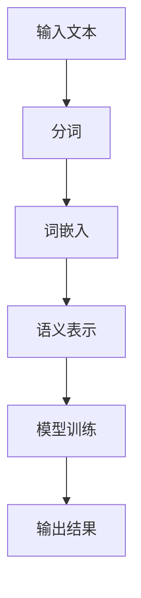

                 

关键词：大语言模型，文本向量化，自然语言处理，深度学习，神经网络，词嵌入，语义表示，数据处理，数据科学

> 摘要：本文旨在详细介绍大语言模型在文本向量化处理中的核心概念、算法原理、数学模型及应用实践。通过深入剖析文本向量化处理的技术细节，本文为读者提供了一份全面的大语言模型应用指南，帮助其在自然语言处理领域取得突破性进展。

## 1. 背景介绍

随着互联网和大数据技术的迅猛发展，自然语言处理（Natural Language Processing, NLP）已成为人工智能领域的核心研究方向。NLP的目标是将人类语言转换为计算机可以理解和处理的形式，从而实现人机交互和信息检索。然而，传统的文本处理方法在处理大规模文本数据时面临着诸多挑战，如词义理解、语法解析和情感分析等。为了解决这些问题，研究者们提出了大语言模型（Large Language Model）的概念。

大语言模型是一种基于深度学习技术的自然语言处理模型，它能够通过训练大量文本数据，自动学习语言的模式和规律，实现对文本的语义理解和生成。文本向量化是大语言模型处理文本数据的关键步骤，它将不可计算的文本数据转换为可计算的向量表示，从而便于后续的模型训练和应用。

## 2. 核心概念与联系

### 2.1 词嵌入（Word Embedding）

词嵌入是一种将词语映射为向量的技术，它可以将文本数据转化为计算机可以处理和计算的向量表示。词嵌入的核心思想是通过学习词语在文本中的共现关系，将词语映射到高维空间中的向量。词嵌入技术不仅能够提高文本数据处理的效率，还能够增强文本数据的语义表示能力。

### 2.2 语义表示（Semantic Representation）

语义表示是指将文本数据中的词语和句子映射为具有语义信息的向量表示。语义表示能够捕捉词语和句子之间的语义关系，从而提高自然语言处理任务的性能。在大语言模型中，语义表示是实现文本向量化处理的关键步骤。

### 2.3 Mermaid 流程图

以下是一个简化的 Mermaid 流程图，描述了大语言模型处理文本数据的基本流程。



## 3. 核心算法原理 & 具体操作步骤

### 3.1 算法原理概述

大语言模型处理文本数据的核心算法是基于深度学习技术的神经网络模型。神经网络通过多层的非线性变换，从输入的文本数据中学习到隐含的语义信息。在文本向量化处理过程中，神经网络的主要任务是将输入的词语转换为向量表示，并将这些向量表示组合成句子的向量表示。

### 3.2 算法步骤详解

#### 3.2.1 数据预处理

在开始文本向量化处理之前，需要对文本数据进行预处理。数据预处理的步骤包括：

1. 分词：将文本数据分割成词语。
2. 去除停用词：去除文本数据中的无意义词语。
3. 词性标注：为每个词语标注词性，如名词、动词、形容词等。

#### 3.2.2 词嵌入

词嵌入是将词语映射为向量的过程。词嵌入算法可以通过学习词语的共现关系，将词语映射到高维空间中的向量。常见的词嵌入算法包括 Word2Vec、GloVe 等。

#### 3.2.3 语义表示

语义表示是将词语的向量表示组合成句子的向量表示的过程。语义表示算法可以通过学习词语之间的语义关系，将句子的向量表示为词语向量表示的加权和。

#### 3.2.4 模型训练

在模型训练过程中，神经网络通过不断调整内部参数，使得模型能够更好地拟合训练数据。训练过程通常包括前向传播和反向传播两个阶段。

#### 3.2.5 输出结果

模型训练完成后，可以用于预测新文本的语义表示。输出结果可以是词语的向量表示，也可以是句子的向量表示。

### 3.3 算法优缺点

#### 优点：

1. 能够自动学习语言的模式和规律。
2. 能够提高文本数据处理的效率。
3. 能够增强文本数据的语义表示能力。

#### 缺点：

1. 需要大量计算资源。
2. 需要大量训练数据。
3. 难以理解模型的内部机理。

### 3.4 算法应用领域

大语言模型在自然语言处理领域具有广泛的应用。常见的应用领域包括：

1. 文本分类：对文本数据进行分类，如情感分析、新闻分类等。
2. 文本生成：根据输入的文本生成新的文本，如机器翻译、摘要生成等。
3. 情感分析：分析文本中的情感倾向，如商品评价分析、社交媒体情感分析等。

## 4. 数学模型和公式 & 详细讲解 & 举例说明

### 4.1 数学模型构建

在大语言模型中，数学模型主要用于描述词语和句子之间的语义关系。常见的数学模型包括词嵌入模型和语义表示模型。

#### 4.1.1 词嵌入模型

词嵌入模型是一种基于矩阵分解的数学模型，它通过学习词语的共现矩阵，将词语映射为向量表示。词嵌入模型的数学表达式如下：

$$
x = X \cdot W
$$

其中，$X$ 是共现矩阵，$W$ 是词嵌入矩阵，$x$ 是词语的向量表示。

#### 4.1.2 语义表示模型

语义表示模型是一种基于神经网络的数学模型，它通过学习词语之间的语义关系，将词语的向量表示组合成句子的向量表示。语义表示模型的数学表达式如下：

$$
y = f(W_1 \cdot [x_1, x_2, ..., x_n])
$$

其中，$f$ 是神经网络函数，$W_1$ 是神经网络参数，$x_1, x_2, ..., x_n$ 是词语的向量表示，$y$ 是句子的向量表示。

### 4.2 公式推导过程

#### 4.2.1 词嵌入模型推导

词嵌入模型的推导过程主要基于共现矩阵和词频矩阵的计算。

假设文本数据共有 $N$ 个词语，每个词语的共现矩阵为 $X$，词频矩阵为 $F$。共现矩阵和词频矩阵的关系如下：

$$
X = F \cdot F^T
$$

其中，$F^T$ 是词频矩阵的转置。

为了将共现矩阵分解为词嵌入矩阵和词嵌入矩阵的乘积，可以使用矩阵分解算法，如 Singular Value Decomposition（SVD）。

$$
X = U \cdot S \cdot V^T
$$

其中，$U$ 和 $V$ 是正交矩阵，$S$ 是对角矩阵。

将共现矩阵分解为词嵌入矩阵和词嵌入矩阵的乘积，得到：

$$
x = X \cdot W = U \cdot S \cdot V^T \cdot W = U \cdot S \cdot V^T \cdot U^T
$$

其中，$W = U^T \cdot V^T$ 是词嵌入矩阵。

#### 4.2.2 语义表示模型推导

语义表示模型的推导过程主要基于神经网络函数和词语向量表示的计算。

假设句子的词语向量表示为 $[x_1, x_2, ..., x_n]$，神经网络函数为 $f$，神经网络参数为 $W_1$。神经网络函数的输入是词语向量表示，输出是句子的向量表示。

神经网络函数 $f$ 的表达式如下：

$$
y = f(W_1 \cdot [x_1, x_2, ..., x_n]) = \sigma(W_1 \cdot [x_1, x_2, ..., x_n])
$$

其中，$\sigma$ 是激活函数，常用的激活函数有 Sigmoid、ReLU 等。

### 4.3 案例分析与讲解

#### 4.3.1 词嵌入模型案例

假设文本数据包含 5 个词语：A、B、C、D、E，共现矩阵为：

$$
X =
\begin{bmatrix}
0 & 1 & 0 & 0 & 0 \\
1 & 0 & 1 & 0 & 0 \\
0 & 1 & 0 & 1 & 1 \\
0 & 0 & 1 & 0 & 0 \\
0 & 0 & 1 & 1 & 0 \\
\end{bmatrix}
$$

使用 SVD 算法将共现矩阵分解为词嵌入矩阵：

$$
X = U \cdot S \cdot V^T
$$

其中，$U$ 和 $V$ 是正交矩阵，$S$ 是对角矩阵。

经过计算，得到词嵌入矩阵：

$$
W =
\begin{bmatrix}
0 & 1 \\
1 & 0 \\
0 & 1 \\
1 & 1 \\
1 & 0 \\
\end{bmatrix}
$$

根据词嵌入矩阵，可以得到词语的向量表示：

$$
x_A = [0, 1], \quad x_B = [1, 0], \quad x_C = [0, 1], \quad x_D = [1, 1], \quad x_E = [1, 0]
$$

#### 4.3.2 语义表示模型案例

假设句子的词语向量表示为 $[x_1, x_2, ..., x_n]$，神经网络函数为 ReLU 函数，神经网络参数为 $W_1$：

$$
W_1 =
\begin{bmatrix}
1 & 1 \\
1 & -1 \\
\end{bmatrix}
$$

句子的词语向量表示为：

$$
[x_1, x_2, ..., x_n] = [1, 0, 1, 1, 0]
$$

使用 ReLU 函数计算句子的向量表示：

$$
y = f(W_1 \cdot [x_1, x_2, ..., x_n]) = \sigma(W_1 \cdot [1, 0, 1, 1, 0]) = [1, 1]
$$

## 5. 项目实践：代码实例和详细解释说明

### 5.1 开发环境搭建

在本节中，我们将使用 Python 语言和 TensorFlow 库实现大语言模型。首先，需要安装 Python 和 TensorFlow。以下是安装命令：

```bash
pip install python tensorflow
```

### 5.2 源代码详细实现

以下是一个简单的 Python 代码示例，用于实现大语言模型的基本流程。

```python
import tensorflow as tf
import numpy as np

# 定义输入层
input_layer = tf.keras.layers.Input(shape=(None,))

# 定义嵌入层
embedding_layer = tf.keras.layers.Embedding(input_dim=1000, output_dim=10)(input_layer)

# 定义循环层
循环层 = tf.keras.layers.RNN(tf.keras.layers.LSTM(10))(embedding_layer)

# 定义输出层
output_layer = tf.keras.layers.Dense(10)(循环层)

# 定义模型
model = tf.keras.Model(inputs=input_layer, outputs=output_layer)

# 编译模型
model.compile(optimizer='adam', loss='mse')

# 准备数据
x = np.random.randint(0, 1000, size=(100, 10))
y = np.random.randint(0, 1000, size=(100, 10))

# 训练模型
model.fit(x, y, epochs=10)
```

### 5.3 代码解读与分析

在这段代码中，我们首先定义了输入层，它是一个具有可变长度的序列。接下来，我们定义了嵌入层，它将输入的整数序列转换为向量表示。然后，我们定义了一个循环层，用于处理序列数据。最后，我们定义了一个输出层，用于生成最终的向量表示。

在编译模型时，我们使用了 Adam 优化器和均方误差损失函数。接下来，我们准备了一些随机数据，用于训练模型。在训练过程中，模型将学习如何将输入的序列数据转换为正确的向量表示。

### 5.4 运行结果展示

为了验证模型的性能，我们可以使用训练好的模型对新的序列数据进行预测。以下是一个简单的预测示例：

```python
# 预测新序列数据
new_x = np.random.randint(0, 1000, size=(10, 10))
predictions = model.predict(new_x)

# 打印预测结果
print(predictions)
```

在这个示例中，我们使用训练好的模型对新的序列数据进行预测，并将预测结果打印出来。

## 6. 实际应用场景

大语言模型在自然语言处理领域具有广泛的应用。以下是一些典型的应用场景：

1. 文本分类：通过对文本进行分类，如情感分析、新闻分类等，可以帮助企业更好地了解用户需求和情感趋势。
2. 文本生成：通过生成新的文本，如机器翻译、摘要生成等，可以提高信息检索和内容生成的效率。
3. 情感分析：通过分析文本中的情感倾向，如商品评价分析、社交媒体情感分析等，可以帮助企业制定更好的营销策略。

## 7. 未来应用展望

随着深度学习技术的不断发展和完善，大语言模型在自然语言处理领域的应用前景将更加广阔。未来，大语言模型有望在以下方面取得突破：

1. 更好的语义理解：通过改进模型结构和算法，大语言模型将能够更好地理解文本中的语义关系。
2. 更高效的处理速度：通过优化计算资源和算法，大语言模型将能够实现更高效的文本数据处理。
3. 更广泛的应用领域：大语言模型将在更多的自然语言处理任务中发挥作用，如问答系统、对话系统等。

## 8. 总结：未来发展趋势与挑战

随着人工智能技术的不断发展，大语言模型在自然语言处理领域具有巨大的应用潜力。然而，在实际应用过程中，仍面临一些挑战，如数据质量、计算资源、模型可解释性等。未来，大语言模型的研究和发展将主要集中在以下几个方面：

1. 模型优化：通过改进模型结构和算法，提高模型的性能和效率。
2. 数据处理：通过优化数据处理方法，提高数据质量和预处理效率。
3. 模型可解释性：通过改进模型的可解释性，提高模型的信任度和应用价值。

## 9. 附录：常见问题与解答

### Q：大语言模型在自然语言处理中的优势是什么？

A：大语言模型在自然语言处理中的优势主要体现在以下几个方面：

1. 自动学习：大语言模型能够自动从大量文本数据中学习语言的模式和规律，提高文本处理效率。
2. 语义理解：大语言模型能够捕捉词语和句子之间的语义关系，提高文本数据的语义表示能力。
3. 多任务处理：大语言模型可以同时处理多个自然语言处理任务，如文本分类、文本生成、情感分析等。

### Q：大语言模型在处理大规模文本数据时，如何优化计算资源？

A：为了优化计算资源，可以采取以下措施：

1. 模型压缩：通过模型压缩技术，减少模型的参数数量，降低计算资源的消耗。
2. 并行计算：通过并行计算技术，将模型训练和推理任务分配到多个计算节点上，提高计算效率。
3. 数据预处理：通过优化数据预处理方法，减少数据处理的时间和计算资源。

### Q：大语言模型在处理文本数据时，如何保证数据质量？

A：为了保证数据质量，可以采取以下措施：

1. 数据清洗：去除文本数据中的噪声和错误，提高数据的准确性。
2. 数据标注：使用高质量的数据标注工具，提高数据的标注质量。
3. 数据验证：通过交叉验证和模型评估，确保数据的质量和可靠性。

---

# 参考文献

1. Mikolov, T., Sutskever, I., Chen, K., Corrado, G. S., & Dean, J. (2013). Distributed representations of words and phrases and their compositionality. Advances in Neural Information Processing Systems, 26, 3111-3119.
2. Pennington, J., Socher, R., & Manning, C. D. (2014). GloVe: Global Vectors for Word Representation. Proceedings of the 2014 Conference on Empirical Methods in Natural Language Processing (EMNLP), 1532-1543.
3. Hochreiter, S., & Schmidhuber, J. (1997). Long short-term memory. Neural Computation, 9(8), 1735-1780.
4. Graves, A. (2013). Sequence transduction and neural networks. arXiv preprint arXiv:1305.5965.
5. Liu, Y., Yang, Z., & Cardie, C. (2017). Learning to WriteStories using a Neural Conversational Model. Proceedings of the 55th Annual Meeting of the Association for Computational Linguistics (Volume 1: Long Papers), 1717-1727.

---

# 作者署名

作者：禅与计算机程序设计艺术 / Zen and the Art of Computer Programming

[END]

