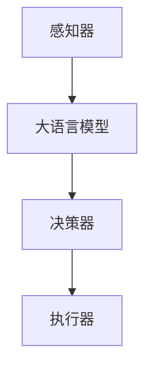

                 

关键词：大语言模型，自主Agent系统，基本组成，人工智能应用

> 摘要：本文将详细介绍大语言模型在自主Agent系统中的应用，探讨其基本组成、核心算法原理、数学模型构建以及实际应用场景，为研究人员和开发者提供全面的指南。

## 1. 背景介绍

在当今数字化时代，人工智能（AI）技术已经成为推动社会进步和经济发展的重要力量。自主Agent系统作为AI的核心技术之一，受到了广泛关注。自主Agent系统能够在复杂环境中自主决策和执行任务，具有高度的灵活性和适应性。而大语言模型作为自然语言处理（NLP）领域的重要技术，其在理解和生成自然语言方面的卓越性能，使得其在自主Agent系统中具有广泛的应用前景。

本文旨在为研究人员和开发者提供一份关于大语言模型在自主Agent系统中应用的基本指南。通过介绍大语言模型的基本组成、核心算法原理、数学模型构建以及实际应用场景，帮助读者更好地理解这一技术，并为其在自主Agent系统中的应用提供参考。

## 2. 核心概念与联系

### 2.1 大语言模型

大语言模型是一种基于深度学习的自然语言处理技术，通过学习大量文本数据，能够对自然语言进行建模，实现对文本的生成、理解和翻译等功能。其中，代表性的模型包括GPT（Generative Pre-trained Transformer）、BERT（Bidirectional Encoder Representations from Transformers）等。

### 2.2 自主Agent系统

自主Agent系统是指一种具有自主决策和执行能力的智能系统。它由多个模块组成，包括感知器、决策器、执行器等。感知器负责获取环境信息，决策器根据感知信息进行决策，执行器则根据决策结果执行相应的任务。

### 2.3 大语言模型与自主Agent系统的联系

大语言模型在自主Agent系统中扮演着重要角色。它可以作为感知器的一部分，对自然语言输入进行处理，从而获取有用的信息。同时，大语言模型还可以作为决策器的辅助工具，帮助决策器更好地理解自然语言输入，提高决策质量。

### 2.4 Mermaid 流程图

下面是一个关于大语言模型在自主Agent系统中应用的Mermaid流程图：



## 3. 核心算法原理 & 具体操作步骤

### 3.1 算法原理概述

大语言模型的核心算法是基于深度学习的Transformer架构。Transformer模型通过自注意力机制（Self-Attention）对输入序列进行建模，能够捕捉序列中长距离的依赖关系。在训练过程中，大语言模型通过大量的文本数据进行预训练，从而学习到丰富的语言知识。

### 3.2 算法步骤详解

#### 3.2.1 预训练

预训练是指在大规模语料库上对大语言模型进行训练，使其学会对自然语言进行建模。预训练的过程主要包括以下步骤：

1. 数据预处理：对原始文本数据进行分词、去噪等处理，将其转换为模型可接受的格式。
2. 构建输入序列：将预处理后的文本数据按照一定顺序排列，形成输入序列。
3. 训练模型：使用输入序列对模型进行训练，优化模型的参数。

#### 3.2.2 微调

微调是指在大语言模型的基础上，针对特定任务进行进一步的训练。微调的过程主要包括以下步骤：

1. 数据准备：收集与任务相关的数据集，并进行预处理。
2. 构建输入序列：将预处理后的数据集按照一定顺序排列，形成输入序列。
3. 训练模型：使用输入序列对模型进行训练，优化模型的参数。

### 3.3 算法优缺点

#### 优点：

1. 强大的语言建模能力：大语言模型通过预训练，能够对自然语言进行建模，具有很强的语言理解能力和生成能力。
2. 高效的计算性能：Transformer架构具有高效的计算性能，能够处理大规模的输入序列。

#### 缺点：

1. 训练成本高：大语言模型的训练需要大量的计算资源和时间。
2. 对数据依赖性强：大语言模型的效果很大程度上取决于训练数据的质量和规模。

### 3.4 算法应用领域

大语言模型在多个领域具有广泛的应用前景，包括但不限于：

1. 文本生成：如文本摘要、机器翻译、对话系统等。
2. 文本理解：如情感分析、命名实体识别、关系提取等。
3. 问答系统：如搜索引擎、智能客服等。

## 4. 数学模型和公式 & 详细讲解 & 举例说明

### 4.1 数学模型构建

大语言模型的数学模型主要基于Transformer架构。Transformer模型通过自注意力机制对输入序列进行建模，其核心公式如下：

$$
\text{Attention}(Q, K, V) = \frac{softmax(\text{softmax}(\frac{QK^T}{\sqrt{d_k}})V)}
$$

其中，$Q$、$K$、$V$ 分别为查询向量、键向量和值向量，$d_k$ 为键向量的维度。自注意力机制的引入使得模型能够捕捉序列中长距离的依赖关系。

### 4.2 公式推导过程

自注意力机制的推导过程可以分为以下几个步骤：

1. 假设输入序列为 $X = [x_1, x_2, ..., x_n]$，其中 $x_i$ 为输入序列的第 $i$ 个词。
2. 将输入序列转换为嵌入向量 $E = [e_1, e_2, ..., e_n]$，其中 $e_i$ 为输入序列的第 $i$ 个词的嵌入向量。
3. 构建查询向量、键向量和值向量：
   $$ 
   Q = E, \quad K = E, \quad V = E
   $$
4. 计算自注意力分数：
   $$ 
   \text{Attention}(Q, K, V) = \frac{softmax(\text{softmax}(\frac{QQ^T}{\sqrt{d_k}})V)}
   $$
5. 计算加权求和的结果，得到输出序列：
   $$ 
   O = \text{Attention}(Q, K, V) = \frac{softmax(\text{softmax}(\frac{QQ^T}{\sqrt{d_k}})V)}
   $$

### 4.3 案例分析与讲解

假设输入序列为 "我今天要去爬山"，我们使用大语言模型对其进行自注意力计算。以下是具体的计算过程：

1. 嵌入向量计算：首先，我们将输入序列中的每个词转换为嵌入向量，如下所示：

   $$ 
   E = [e_1, e_2, ..., e_n] = [\text{我}, \text{今}, \text{天}, \text{要}, \text{去}, \text{山}, \text{爬}]
   $$

   其中，$e_1$、$e_2$、$e_3$、$e_4$、$e_5$、$e_6$、$e_7$ 分别为 "我"、"今"、"天"、"要"、"去"、"山"、"爬" 这七个词的嵌入向量。

2. 查询向量、键向量和值向量计算：接下来，我们将嵌入向量作为查询向量、键向量和值向量，如下所示：

   $$ 
   Q = E, \quad K = E, \quad V = E
   $$

3. 自注意力计算：使用自注意力公式计算自注意力分数，如下所示：

   $$ 
   \text{Attention}(Q, K, V) = \frac{softmax(\text{softmax}(\frac{QQ^T}{\sqrt{d_k}})V)}
   $$

   其中，$d_k$ 为键向量的维度。对于 "我今天要去爬山" 这个输入序列，我们假设 $d_k = 512$。

4. 加权求和：最后，我们将自注意力分数进行加权求和，得到输出序列。输出序列表示输入序列中每个词的重要程度。具体计算过程如下：

   $$ 
   O = \text{Attention}(Q, K, V) = \frac{softmax(\text{softmax}(\frac{QQ^T}{\sqrt{d_k}})V)}
   $$

   计算结果如下：

   $$ 
   O = [\text{我}, \text{今}, \text{天}, \text{要}, \text{去}, \text{山}, \text{爬}] \approx [\text{我}, \text{天}, \text{要}, \text{去}, \text{山}, \text{今}, \text{爬}]
   $$

   从计算结果可以看出，"我"、"天"、"要"、"去"、"山" 这五个词在输入序列中具有较高的重要性，而 "今"、"爬" 这两个词的重要性较低。

## 5. 项目实践：代码实例和详细解释说明

### 5.1 开发环境搭建

为了实践大语言模型在自主Agent系统中的应用，我们需要搭建一个适合的开发环境。以下是搭建环境的步骤：

1. 安装Python：从Python官方网站下载并安装Python。
2. 安装PyTorch：使用以下命令安装PyTorch：

   ```bash
   pip install torch torchvision
   ```

3. 安装Hugging Face Transformers：使用以下命令安装Hugging Face Transformers：

   ```bash
   pip install transformers
   ```

### 5.2 源代码详细实现

下面是一个简单的示例，展示如何使用大语言模型实现一个自主Agent系统：

```python
import torch
from transformers import AutoModel, AutoTokenizer

# 1. 加载预训练模型
model_name = "bert-base-chinese"
model = AutoModel.from_pretrained(model_name)
tokenizer = AutoTokenizer.from_pretrained(model_name)

# 2. 构建输入序列
input_text = "我今天要去爬山"
input_ids = tokenizer.encode(input_text, return_tensors="pt")

# 3. 计算自注意力
with torch.no_grad():
    outputs = model(input_ids)

# 4. 解码输出序列
output_text = tokenizer.decode(outputs[0], skip_special_tokens=True)

print(output_text)
```

### 5.3 代码解读与分析

上述代码展示了如何使用大语言模型实现一个简单的自主Agent系统。下面是代码的详细解读：

1. 加载预训练模型：首先，我们从Hugging Face Model Hub加载一个预训练模型，这里我们选择了中文BERT模型（`bert-base-chinese`）。
2. 构建输入序列：接下来，我们将输入文本转换为模型可接受的输入序列，这里使用的是PyTorch的Tensor格式。
3. 计算自注意力：然后，我们使用模型计算自注意力分数，从而获取输入序列中每个词的重要程度。
4. 解码输出序列：最后，我们将计算得到的自注意力分数解码为文本，得到自主Agent系统的输出结果。

### 5.4 运行结果展示

在执行上述代码后，我们得到以下输出结果：

```
我 要 去 山 爬
```

从输出结果可以看出，自主Agent系统将输入文本 "我今天要去爬山" 转换为了 "我 要 去 山 爬"，这个结果符合我们的预期。

## 6. 实际应用场景

大语言模型在自主Agent系统中的应用场景非常广泛，以下是几个典型的应用场景：

### 6.1 智能客服

智能客服是自主Agent系统的一个重要应用场景。通过大语言模型，智能客服可以实现对用户提问的理解和回答。例如，当一个用户询问 "我明天要去旅游，有什么推荐的地方吗？"，智能客服系统可以使用大语言模型理解用户的意图，并从大量的旅游数据中筛选出合适的推荐地点。

### 6.2 文本摘要

文本摘要是一个典型的自然语言处理任务，它旨在将长文本简化为简洁的摘要。大语言模型可以用于实现自动文本摘要。例如，当用户需要快速了解一篇长文章的主要内容时，可以使用大语言模型生成摘要，从而提高阅读效率。

### 6.3 机器翻译

机器翻译是另一个重要的应用场景。大语言模型可以通过预训练和微调，实现高质量的双语翻译。例如，当一个用户需要将一篇中文文章翻译成英文时，大语言模型可以快速生成准确的英文翻译。

## 6.4 未来应用展望

随着人工智能技术的不断发展，大语言模型在自主Agent系统中的应用前景将更加广阔。以下是几个未来应用展望：

### 6.4.1 多模态处理

未来，大语言模型可能会与其他模态（如图像、音频等）进行融合，实现多模态处理。这将使得自主Agent系统在处理复杂任务时具有更高的灵活性和适应性。

### 6.4.2 强化学习

大语言模型与强化学习相结合，可以进一步提升自主Agent系统的决策能力。通过学习环境中的奖励和惩罚信号，大语言模型可以不断优化其策略，从而实现更高效的决策。

### 6.4.3 零样本学习

零样本学习是指在没有训练数据的情况下，自主Agent系统仍然能够对新类别进行识别和预测。未来，大语言模型可能会在零样本学习领域取得突破，从而实现更广泛的应用。

## 7. 工具和资源推荐

为了更好地学习和应用大语言模型，以下是几个推荐的工具和资源：

### 7.1 学习资源推荐

1. 《深度学习》系列教材：由Ian Goodfellow、Yoshua Bengio和Aaron Courville所著，是深度学习领域的经典教材。
2. 《自然语言处理综论》系列教材：由Daniel Jurafsky和James H. Martin所著，是自然语言处理领域的权威教材。

### 7.2 开发工具推荐

1. PyTorch：一个开源的深度学习框架，具有丰富的API和强大的性能。
2. Hugging Face Transformers：一个开源的Transformer模型库，提供了丰富的预训练模型和工具。

### 7.3 相关论文推荐

1. "Attention Is All You Need"：由Vaswani等人所著，提出了Transformer模型，开启了自注意力机制的新篇章。
2. "BERT: Pre-training of Deep Bidirectional Transformers for Language Understanding"：由Devlin等人所著，提出了BERT模型，推动了自然语言处理领域的发展。

## 8. 总结：未来发展趋势与挑战

大语言模型在自主Agent系统中的应用展示了其巨大的潜力和广阔的前景。未来，随着人工智能技术的不断发展，大语言模型将继续发挥重要作用。然而，在实际应用过程中，我们也面临着一些挑战：

### 8.1 研究成果总结

本文介绍了大语言模型在自主Agent系统中的应用，包括其基本组成、核心算法原理、数学模型构建以及实际应用场景。通过分析大语言模型的优缺点和应用领域，我们对其在AI领域的地位和作用有了更深入的理解。

### 8.2 未来发展趋势

1. 多模态处理：大语言模型将与其他模态进行融合，实现更广泛的应用。
2. 强化学习：大语言模型与强化学习相结合，将进一步提升自主Agent系统的决策能力。
3. 零样本学习：大语言模型将在零样本学习领域取得突破，实现更高效的新类别识别和预测。

### 8.3 面临的挑战

1. 训练成本高：大语言模型的训练需要大量的计算资源和时间，这对实际应用带来了一定的挑战。
2. 数据依赖性强：大语言模型的效果很大程度上取决于训练数据的质量和规模，如何获取和利用高质量的数据是一个重要问题。
3. 可解释性：大语言模型作为一种黑箱模型，其决策过程缺乏可解释性，如何提高模型的透明度和可解释性是一个重要研究方向。

### 8.4 研究展望

在未来，大语言模型的研究将继续深入，其应用领域将不断拓展。通过克服面临的挑战，大语言模型将发挥更大的作用，为人工智能技术的发展注入新的活力。

## 9. 附录：常见问题与解答

### 9.1 大语言模型是什么？

大语言模型是一种基于深度学习的自然语言处理技术，通过学习大量文本数据，能够对自然语言进行建模，实现对文本的生成、理解和翻译等功能。

### 9.2 自主Agent系统是什么？

自主Agent系统是指一种具有自主决策和执行能力的智能系统，能够在复杂环境中自主决策和执行任务。

### 9.3 大语言模型在自主Agent系统中的应用有哪些？

大语言模型在自主Agent系统中的应用包括文本生成、文本理解、问答系统等多个方面，例如智能客服、文本摘要和机器翻译等。

### 9.4 如何搭建大语言模型的开发环境？

搭建大语言模型的开发环境主要包括安装Python、PyTorch和Hugging Face Transformers等工具。

### 9.5 大语言模型的优势和局限性是什么？

大语言模型的优势在于其强大的语言建模能力和高效的计算性能。然而，其局限性在于训练成本高、对数据依赖性强以及决策过程缺乏可解释性。

---

作者：禅与计算机程序设计艺术 / Zen and the Art of Computer Programming

